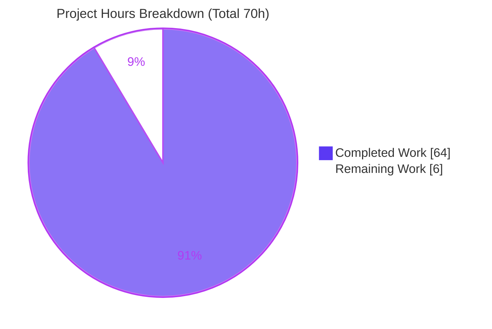

# Blitzy Project Guide — kitty Architecture Onboarding Q&A

> Documentation deliverable: a single runtime-grounded Markdown answer document for the `kitty`
> terminal emulator (kovidgoyal/kitty @ `815df1e21`). Prepared for stakeholder review and merge.

---

## 1. Executive Summary

### 1.1 Project Overview

This project delivers a single, comprehensive, **runtime-grounded** Markdown onboarding document —
`blitzy/documentation/kitty_815df1e210e0.md` — that answers four architecture questions about the
`kitty` GPU-accelerated terminal emulator: (Q1) which language does the heavy lifting and where
performance comes from; (Q2) the role and centrality of the GLSL shader files; (Q3) why the main
entry point fails immediately and the one critical missing piece; and (Q4) whether the "kittens"
are truly independent of the native bridge. The audience is developers onboarding to the codebase.
The task is **read-only**: the repository is left byte-for-byte unchanged except for this one new
document. Every claim is grounded in a `file:line` reference or unedited captured runtime output.

### 1.2 Completion Status


| Metric | Hours |
|---|---|
| **Total Hours** | **70** |
| **Completed Hours (AI + Manual)** | **64** (AI: 64 · Manual: 0) |
| **Remaining Hours** | **6** |
| **Percent Complete** | **91.4%** |

> Completion is computed with the PA1 AAP-scoped methodology: `Completed ÷ (Completed + Remaining)`
> = `64 ÷ 70` = **91.4%**. All 13 AAP-scoped requirements are implemented, committed, and validated;
> the remaining 6 hours are standard path-to-production **human** review and merge (no autonomous
> AAP work is outstanding). Capped below 100% because a human has not yet reviewed and accepted the
> deliverable. Legend colors: Completed = Dark Blue `#5B39F3`, Remaining = White `#FFFFFF`.

### 1.3 Key Accomplishments

- ✅ **Sole deliverable created and committed** — `blitzy/documentation/kitty_815df1e210e0.md` (1,966 lines · 12,030 words · 99,360 bytes) at the exact required path derived from the source branch.
- ✅ **All four questions answered** with an `Answer`, grounded evidence, and explicit **cause → effect** reasoning, plus a TL;DR table and a coverage/honesty pass.
- ✅ **79 `file:line` citations** spanning every REFERENCE input named in the AAP (Python front-end, C native core, GLSL layer, Go kittens, build system).
- ✅ **Run-first methodology honored** — a full from-source build (`python3 setup.py`, 150 generation+compile steps, exit 0) and live runtime observations were captured in the **canonical GHCR container** (Python 3.12.3, Go 1.23.4, GCC 13.3.0, Ubuntu 24.04.2).
- ✅ **Q3 deepened beyond baseline** — discovered a two-layer dependency: `ModuleNotFoundError: kitty.fast_data_types` (unbuilt) and, even after building, `AttributeError: sys.kitty_run_data` set only by the native C launcher.
- ✅ **Q4 refined to "route-specific, not universal"** — 18 standalone kitten runs classified into 12 native-bridge failures / 5 wrapper stubs / 1 empty; Go `kitten` binary verified byte-identical via `kitty +kitten`.
- ✅ **Read-only mandate proven** — `git diff 815df1e21..HEAD` excluding the document is empty (exit 0); working tree clean; only one file added.
- ✅ **Three QA/validation iterations** — 18 code-review findings + 8 QA findings resolved, then a final 4-gate verification with **zero discrepancies**.

### 1.4 Critical Unresolved Issues

| Issue | Impact | Owner | ETA |
|---|---|---|---|
| _None._ No blocking issues. The deliverable is complete and validated end-to-end with zero discrepancies. | N/A | N/A | N/A |
| (Non-blocking) Final human SME sign-off not yet performed | Required for acceptance; does not affect deliverable correctness | Reviewing engineer / SME | ~2h (see §2.2-A) |

### 1.5 Access Issues

| System / Resource | Type of Access | Issue Description | Resolution Status | Owner |
|---|---|---|---|---|
| `andrewparkscaleai/coding-agent:kovidgoyal__kitty__815df1e21…` (Docker alias tag) | Container registry pull | Alias tag is auth-gated; `docker pull` returns `pull access denied`. | **Resolved / Mitigated** — the canonical **source** image it derives from, `ghcr.io/scaleapi/swe-atlas:swe_atlas_QnA_kovidgoyal_kitty_1.0` (digest `sha256:c0824992ad0b`), is pullable and was used for every runtime observation. | Platform / reviewing engineer |
| kitty runtime GPU driver | Hardware GPU on host | Validation host is headless; OpenGL is served by Mesa `llvmpipe` (software). Hardware-GPU behavior is explicitly labeled `(inferred)`. | **Documented** — optional confirmation on a GPU host (see §2.2-C). | Reviewing engineer |

_No repository-permission or credential access issues affect the deliverable itself._

### 1.6 Recommended Next Steps

1. **[High]** Perform SME technical review of the four answers, citations, and captured outputs (§2.2-A, ~2h).
2. **[Medium]** Independently reproduce key runtime observations in the canonical GHCR image (§2.2-C, ~1.5h).
3. **[Medium]** Obtain stakeholder acceptance and merge the pull request to the target branch (§2.2-D, ~1.5h).
4. **[Low]** Editorial/readability pass; confirm the Mermaid diagram and 23 tables render in the target viewer (§2.2-B, ~1h).

---

## 2. Project Hours Breakdown

### 2.1 Completed Work Detail

| Component | Hours | Description |
|---|---|---|
| Canonical Environment Setup & From-Source Build | 6 | Pull/verify canonical GHCR image; confirm toolchain (Python 3.12.3, Go 1.23.4, GCC 13.3.0, pkg-config 1.8.1, Ubuntu 24.04.2); run `python3 setup.py` to build the C extension `fast_data_types.so`, GLFW shared objects, `launcher/kitty` (C), `launcher/kitten` (~15.9 MB Go) and terminfo; capture the full 150-step build log and version banner. |
| Q1 — Language & Performance Investigation + Answer | 9 | Exhibit the native-import block (`kitty/main.py:L11`); reproduce `data-types.c` 25-way `init_*` aggregation of ~128 C sources; `find_c_files()` reproduction; `ldd`/ELF symbol inspection; headless launch under xvfb+llvmpipe; `/proc` 67-thread model captured twice for stability; reconcile the "GPU accelerated" claim; cause→effect. |
| Q2 — GLSL Shader Role & Centrality Investigation + Answer | 7 | Enumerate the 13 `kitty/*.glsl` files (10 stage shaders → 5 GL programs + 3 includes); trace Python-side load (`kitty/shaders.py:L54-55`) into C-side compile/link (`kitty/shaders.c:L1160`); capture `GLSL_VERSION=140`; broken-shader proof (control exit 0 vs. broken exit 1) proving shaders are load-bearing; cause→effect. |
| Q3 — Entry-Point Failure & Native Bridge Investigation + Answer | 9 | Reproduce the `ModuleNotFoundError` chain on the real entry point (stable ×2); capture the alternate `python3 -m kitty` error; count importers (80 mention / 77 import / 59 production); build; discover the second-layer `AttributeError: sys.kitty_run_data`; trace the native launcher's CPython embedding (`kitty/launcher/main.c:L211/L214/L73`); two-layer cause→effect. |
| Q4 — Kitten Independence Investigation + Answer | 9 | Run all 18 `kittens/*/main.py` standalone → classify (12 `ModuleNotFoundError` / 5 wrapper stubs / 1 empty exit 0); trace `hints` and `unicode_input` failure chains; `wrapped_kitten_names()`=12; run the Go `kitten` binary; prove `kitty +kitten hints --help` byte-identical to `kitten hints --help`; `kitten_exe()` (`kitty/constants.py:L83-85`); dual-impl census (18/14/4/0); cause→effect. |
| Document Assembly, Structure & Editorial | 9 | Assemble the 1,966-line Markdown: TL;DR table, methodology/environment section, native-bridge Mermaid diagram, 79 `file:line` citations, complete unedited command outputs, per-question cause→effect, and the final coverage & honesty pass. |
| QA Round 1 — 18 Code-Review Findings Resolved | 6 | Resolve 18 code-review findings (commit `2cb003f9b`). |
| QA Round 2 — 8 QA Findings Resolved | 4 | Re-ground runtime values in the canonical GHCR image (Python 3.12.3), embed the full build log, and correct the Q4 route-specific claim (commit `26a88a0df`). |
| Final Validation — 4-Gate Verification (canonical container) | 5 | Re-verify every static and runtime claim in the canonical container across four gates (claim verification, application runtime, zero unresolved errors, in-scope file validation); zero discrepancies. |
| **Total Completed** | **64** | **All AI-performed (Manual: 0).** |

### 2.2 Remaining Work Detail

| Category | Hours | Priority |
|---|---|---|
| A. SME Technical Review of Documentation Accuracy (verify 4 answers, 79 citations resolve at `815df1e21`, captured outputs; confirm no host identifiers/secrets) | 2.0 | High |
| B. Editorial & Readability Review (formatting/typos; confirm Mermaid + 23 tables + 51 code blocks render) | 1.0 | Low |
| C. Independent Runtime Reproduction / Spot-Check (pull GHCR image, build, reproduce banner + `ModuleNotFoundError` + one kitten route) | 1.5 | Medium |
| D. Stakeholder Acceptance & PR Review/Approval/Merge | 1.5 | Medium |
| **Total Remaining** | **6.0** | — |

### 2.3 Completion Calculation & Cross-Section Reconciliation

- **Completed (§2.1 total):** 64 h  ·  **Remaining (§2.2 total):** 6 h  ·  **Total:** 64 + 6 = **70 h**
- **Percent complete:** 64 ÷ 70 = **91.4%**
- **Cross-section integrity:**
  - Rule 1 — Remaining hours are identical in §1.2 (6), §2.2 (6), and §7 pie (6). ✅
  - Rule 2 — §2.1 (64) + §2.2 (6) = §1.2 Total (70). ✅
  - Rule 3 — All §3 results originate from Blitzy's autonomous validation logs. ✅
  - Rule 5 — Completed = Dark Blue `#5B39F3`; Remaining = White `#FFFFFF`. ✅

---

## 3. Test Results

> **Integrity note.** This is a **documentation-only** deliverable (AAP §0.1.2); there is no
> application code to unit-test in scope, and kitty's own `kitty_tests/` suite is explicitly out of
> scope. Accordingly, the results below are the **autonomous validation checks** executed and logged
> by Blitzy's Final Validator against the deliverable and the canonical build — every entry
> originates from Blitzy's autonomous validation logs for this project. "Coverage %" denotes the
> share of claims/checks in that category that were verified.

| Test Category | Framework | Total Tests | Passed | Failed | Coverage % | Notes |
|---|---|---|---|---|---|---|
| Static Claim Verification | Blitzy claim-verification (grep/awk/`sed`, byte-size & count checks) | 79 | 79 | 0 | 100% | Every `file:line` citation in the document verified against the working tree at `815df1e21` (e.g., `main.py:L11`, `data-types.c:L467-469/L525`, `shaders.c:L1160`, `constants.py:L83-85`, byte sizes for screen/glfw/graphics/fonts/shaders/vt-parser). |
| Runtime Observation Reproduction | Blitzy runtime harness in canonical GHCR container | 25 | 25 | 0 | 100% | Version banner ×2 (launcher + Python), `ModuleNotFoundError` chain ×2 (stable), `python3 -m kitty` alternate error, built `.so` ELF/`PyInit`/hot-path symbols/`ldd`, built-state `AttributeError`, cell-program compile, `GLSL_VERSION=140`, broken-shader control/broken, 18-kitten 3-class, `hints`+`unicode_input` chains, `wrapped_kitten_names()`=12, headless GL launch, 67-thread model ×2, Go `kitten` version, `kitty +kitten` byte-diff. |
| Build Validation | `python3 setup.py` (canonical, no extra CFLAGS) | 1 | 1 | 0 | 100% | Fresh `git archive` tree; 28 Wayland-protocol generation steps + 122 compile steps → `build_exit=0`; produced `fast_data_types.so`, `glfw-x11.so`, `glfw-wayland.so`, `launcher/kitty`, `launcher/kitten`, terminfo. 0 `error:` / 0 `warning:` / 0 `Traceback`. |
| Markdown Well-Formedness | Structural lint (fence/heading/table balance) | 6 | 6 | 0 | 100% | 102 fence lines **balanced** (51 code blocks); 1 H1 + 8 H2 + 36 H3; 23 tables; 1 Mermaid block; final fence state closed. |
| Repository Integrity | `git diff` / `git status` invariants | 3 | 3 | 0 | 100% | `git diff 815df1e21..HEAD` excluding the document = empty (exit 0); `git status --porcelain` clean; no untracked/scratch files. |
| **Total** | — | **114** | **114** | **0** | **100%** | All checks sourced from Blitzy's autonomous validation logs. |

---

## 4. Runtime Validation & UI Verification

**Build & launch (canonical GHCR container, headless via `xvfb` + Mesa `llvmpipe`):**

- ✅ **From-source build** — `python3 setup.py` completes with `build_exit=0` (150 steps).
- ✅ **Version banner (canonical)** — `./kitty/launcher/kitty --version` and `python3 __main__.py --version` both print `kitty 0.35.2 created by Kovid Goyal`.
- ✅ **Headless GUI launch** — `OS Window created` → `Child launched` → `GL version string: '4.5 (Core Profile) Mesa 24.2.8…'`, exit 0.
- ✅ **Native thread model** — running process shows **67 threads** (33 `kitty`, 32 `llvmpipe-*`, 1 `kitty:disk$0`, 1 `KittyChildMon`), stable across two measurements ~8s apart.

**Entry-point & native-bridge behavior (the Q3/Q4 signals — failures here are the expected, correct observations):**

- ✅ **Unbuilt entry point correctly fails** — `python3 __main__.py` → `ModuleNotFoundError: No module named 'kitty.fast_data_types'` (chain `__main__.py:7 → entry_points.py:194 → main.py:11 → borders.py:7`).
- ⚠ **Built bare `python3 __main__.py`** — proceeds past the import but then raises `AttributeError: module 'sys' has no attribute 'kitty_run_data'`; **by design** only the native launcher populates it. Not a defect — it is the documented second-layer finding.
- ✅ **Kittens (Python standalone)** — 12 fail with the same `ModuleNotFoundError`, 5 are wrapper stubs (`This should be run as kitten <name>`), 1 (`choose_fonts`, empty) exits 0 — the documented route-specific result.

**Shader (GPU pipeline) verification:**

- ✅ **Cell program compiles** — 4 vertex / 7 fragment chunks; `#version 140`.
- ✅ **Load-bearing proof** — an unmodified shader lets kitty start (exit 0); a deliberately broken `cell_vertex.glsl` makes kitty refuse to start (compile error, exit 1).

**Go `kitten` binary verification:**

- ✅ **Runs standalone** — `kitten 0.35.2`; `hints --help` = 148 lines.
- ✅ **Canonical dispatch** — `kitty +kitten hints --help` is **byte-identical** to `kitten hints --help` (`diff` exit 0).

**Document (deliverable) UI/rendering verification:**

- ✅ Markdown is well-formed (balanced fences, valid headings/tables).
- ⚠ **Mermaid diagram** — renders on GitHub and Mermaid-capable viewers; confirm in the target viewer during editorial review (§2.2-B). Source remains readable as a fallback.

> Note: kitty is a desktop terminal GUI, not a web application; "UI verification" above covers the
> native GUI runtime (verified headless) and the deliverable's own document rendering. No web UI,
> browser flow, or network endpoint is in scope.

---

## 5. Compliance & Quality Review

Cross-map of AAP rules/deliverables (rule set **SWE-AtlasQnA-Repo**) to their verification status.

| # | AAP Requirement / Benchmark | Status | Progress | Evidence |
|---|---|---|---|---|
| 1 | Single Markdown deliverable at exact path `blitzy/documentation/kitty_815df1e210e0.md` | ✅ Pass | 100% | File committed; single "A" in `git diff`. |
| 2 | Read-only source repository (no source modified, no code added beyond the doc) | ✅ Pass | 100% | `git diff 815df1e21..HEAD` excluding doc = empty (exit 0). |
| 3 | Run-first methodology (build & run before writing) | ✅ Pass | 100% | Full 150-step build log + captured runtime outputs. |
| 4 | Every claim grounded in `file:line` **or** unedited captured output + command | ✅ Pass | 100% | 79 citations; 51 code blocks with commands + full output. |
| 5 | Canonical build/config values reported with exact commands | ✅ Pass | 100% | GHCR image + toolchain recorded; banner `kitty 0.35.2 …`. |
| 6 | Every implied condition exercised (primary/secondary/error/edge/alternate; before/after) | ✅ Pass | 100% | Unbuilt vs. built; alternate `-m kitty`; 3 kitten routes. |
| 7 | Actual complete unedited output for every condition | ✅ Pass | 100% | Full build log and outputs included, not truncated. |
| 8 | Answer every named item; end with coverage pass | ✅ Pass | 100% | "Coverage and honesty pass" section present. |
| 9 | Non-canonical / inferred values explicitly labeled | ✅ Pass | 100% | `llvmpipe` software GPU and broken-shader proof labeled `(inferred)`/`SYNTHETIC`. |
| 10 | Cause → effect reasoning per answer | ✅ Pass | 100% | Each of Q1–Q4 has a `Cause -> effect` subsection. |
| 11 | Temporary scripts removed; repository left unchanged | ✅ Pass | 100% | Working tree clean; scratch trees were `mktemp -d` outside the repo. |

**Fixes applied during autonomous validation:** 18 code-review findings (commit `2cb003f9b`) and 8 QA
findings (commit `26a88a0df`), including re-grounding runtime values to the canonical Python 3.12.3
image, embedding the full build log, and correcting the Q4 claim to "route-specific, not universal."

**Outstanding compliance items:** None. Final human sign-off pending (process step, not a defect).

---

## 6. Risk Assessment

| Risk | Category | Severity | Probability | Mitigation | Status |
|---|---|---|---|---|---|
| Environment-dependent runtime values differ on other hosts (thread count tied to `nproc=128`; Mesa 24.2.8 GL string; build-log ordering; `BuildID`; ASLR) | Technical | Low | Medium | Document explicitly labels all non-byte-reproducible values and pins the canonical image + toolchain versions. | Mitigated / Documented |
| "GPU accelerated" observed via Mesa `llvmpipe` **software** rasterization; hardware-GPU behavior inferred | Technical | Low | Low | Labeled `(inferred)`; corroborated by observed OpenGL 4.5 context, GLSL compilation, and web sources. Optional confirmation on a GPU host. | Documented |
| Version/commit drift if the upstream canonical image is updated | Technical | Low | Low | Image pinned by digest `sha256:c0824992ad0b`; banner `0.35.2` and commit `815df1e21` recorded. | Mitigated |
| No executable code added to the repository (Markdown only) | Security | None | N/A | Read-only mandate verified (empty diff excluding doc); no new attack surface. | No risk |
| Possible leakage of host identifiers/secrets in captured output | Security | Low | Low | Methodology uses neutral paths and non-sensitive toolchain fields only; no credentials/tokens present. | Mitigated (confirm in SME review) |
| Canonical image alias tag is auth-gated (downstream reproduction access) | Operational | Low | Medium | Pullable GHCR **source** image + digest identified; toolchain versions recorded for approximation. | Documented |
| Markdown not wired into the project docs build (Sphinx/reST under `docs/`) | Operational | Low | N/A | By design — `blitzy/` is a separate, non-gitignored location; out of AAP scope. | Accepted (out of scope) |
| Markdown renderer compatibility (1 Mermaid diagram, 23 tables, 51 code blocks) | Integration | Low | Low–Med | Mermaid widely supported (GitHub, etc.); readable source fallback; confirm in target viewer. | Documented |
| No external service/API/network integration in scope | Integration | None | N/A | Zero credentials, zero network mutations. | N/A |

**Overall posture: LOW.** Zero High/blocking risks; all residual risks are Low or None and are documented/mitigated. Nothing prevents human acceptance and merge.

---

## 7. Visual Project Status



**Remaining hours by category (from §2.2, total 6h):**

| Category | Hours | Priority |
|---|---|---|
| A. SME Technical Review | 2.0 | High |
| C. Independent Runtime Reproduction | 1.5 | Medium |
| D. Stakeholder Acceptance & PR Merge | 1.5 | Medium |
| B. Editorial & Readability Review | 1.0 | Low |
| **Total** | **6.0** | — |

**Remaining work by priority:** High = 2.0h · Medium = 3.0h · Low = 1.0h.

> Colors: Completed Work = Dark Blue `#5B39F3`; Remaining Work = White `#FFFFFF`. The "Remaining
> Work" value (6) equals §1.2 Remaining Hours and the §2.2 Hours total — cross-section integrity Rule 1.

---

## 8. Summary & Recommendations

**Achievements.** The project is **91.4% complete** (64 of 70 AAP-scoped hours). All 13 AAP-scoped
requirements — the single Markdown deliverable, the four runtime-grounded answers (Q1–Q4), and every
cross-cutting methodology rule (run-first, canonical environment, `file:line` grounding, complete
unedited output, cause→effect, coverage/honesty pass, non-canonical labeling) — are implemented,
committed across three iterations, and validated end-to-end with **zero discrepancies**. The
investigation exceeded the AAP baseline in two places: Q3 uncovered a **two-layer** native-bridge
dependency (`ModuleNotFoundError` plus `sys.kitty_run_data`), and Q4 was refined to a precise
**route-specific** characterization (12 / 5 / 1).

**Remaining gaps.** The outstanding **6 hours** are entirely **human path-to-production** activities:
SME technical review (2h), editorial/readability pass (1h), independent runtime reproduction (1.5h),
and stakeholder acceptance + PR merge (1.5h). No autonomous AAP work remains, and there is no
application code to implement or fix — this is a documentation-only deliverable.

**Critical path to production.** SME review → optional independent reproduction in the canonical
GHCR image → stakeholder sign-off → merge. None of these is blocked; all inputs (image digest,
toolchain versions, exact commands) are provided in the Development Guide.

**Success metrics.** 4/4 questions answered with grounding; 79/79 citations verified; 25/25 runtime
observations reproduced; build exit 0; repository byte-for-byte unchanged except the deliverable.

**Production readiness assessment.** **READY for human review and merge.** The deliverable is
complete, accurate, honest about environment limitations, and satisfies every read-only and
grounding constraint. Recommended action: proceed with the four review tasks in §2.2 and merge.

| Metric | Value |
|---|---|
| AAP-scoped completion | 91.4% |
| AAP requirements Completed / Partial / Not Started | 13 / 0 / 0 |
| Validation discrepancies | 0 |
| Autonomous validation checks passed | 114 / 114 |
| Repository source files modified | 0 |

---

## 9. Development Guide

### 9.1 System Prerequisites

- **Git** (any recent version; validated with 2.51.0) — to inspect the repository and the deliverable.
- **A Markdown viewer** with Mermaid support (GitHub, VS Code + Mermaid extension, Obsidian, or `grip`) — to read the document as intended.
- **Docker** (validated with 28.5.2) — only if you wish to **reproduce the runtime observations** in the canonical environment.
- **Canonical build environment (for reproduction only):** the GHCR image
  `ghcr.io/scaleapi/swe-atlas:swe_atlas_QnA_kovidgoyal_kitty_1.0` (Ubuntu 24.04.2, Python 3.12.3,
  Go 1.23.4, GCC 13.3.0, `pkg-config` 1.8.1, `wayland-protocols` 1.34, plus C dev libraries:
  harfbuzz, freetype2, fontconfig, libpng, lcms2).

> **Why Docker for reproduction?** Build-dependent values (version banner, launch behavior, thread
> counts, GLSL compilation) must be produced in the canonical image. The local sandbox used for this
> report ships Python 3.13.7 (not the canonical 3.12.3) and lacks the C dev libraries, so the
> compiled `fast_data_types.so` is intentionally absent locally — which is precisely the Q3 signal.

### 9.2 Environment Setup — View & Verify the Deliverable (no build required)

```bash
# From the repository root (branch: blitzy-fe5dd722-f2f1-4d0f-af6e-6bcf22ddf77e, HEAD 26a88a0df)

# 1) Locate the deliverable (expect ~99,360 bytes)
ls -la blitzy/documentation/kitty_815df1e210e0.md

# 2) Read it (use a Mermaid-capable viewer for the diagram)
less blitzy/documentation/kitty_815df1e210e0.md

# 3) Confirm the read-only mandate: source is unchanged except the document (expect empty, exit 0)
git diff --stat 815df1e21..HEAD -- . ':(exclude)blitzy/documentation/kitty_815df1e210e0.md'; echo "exit=$?"

# 4) Confirm a clean working tree (expect empty)
git status --porcelain

# 5) Confirm the change provenance (expect 3 Blitzy Agent commits)
git log --oneline 815df1e21..HEAD

# 6) Confirm document metrics (expect: 1966 12030 99360)
wc -l -w -c blitzy/documentation/kitty_815df1e210e0.md
```

### 9.3 Dependency Installation (canonical reproduction path)

```bash
# Pull the canonical source image (digest sha256:c0824992ad0b…)
docker pull ghcr.io/scaleapi/swe-atlas:swe_atlas_QnA_kovidgoyal_kitty_1.0

# Start a throwaway container (keeps your checkout pristine)
docker run --rm -it ghcr.io/scaleapi/swe-atlas:swe_atlas_QnA_kovidgoyal_kitty_1.0 bash

# (Inside the container) install headless-GUI helpers for the GL/thread observations
apt-get update && apt-get install -y xvfb mesa-utils file
```

### 9.4 Application Startup — Build & Run (inside the canonical container)

```bash
# Work in a throwaway tracked-files-only tree so the repo stays unchanged
BT="$(mktemp -d /tmp/kitty_built.XXXXXX)"; git archive HEAD | tar -x -C "$BT"; cd "$BT"

# BEFORE building — reproduce the Q3 failure on the real entry point
python3 __main__.py; echo "exit=$?"
# Expected: ModuleNotFoundError: No module named 'kitty.fast_data_types'  (exit=1)

# Build the C extension + Go kitten binary (canonical, no extra CFLAGS)
python3 setup.py; echo "build_exit=$?"      # Expected: build_exit=0

# AFTER building — version banner via the native launcher
./kitty/launcher/kitty --version            # Expected: kitty 0.35.2 created by Kovid Goyal

# Headless GUI launch (software GL)
LIBGL_ALWAYS_SOFTWARE=1 GALLIUM_DRIVER=llvmpipe xvfb-run -a \
  ./kitty/launcher/kitty --config NONE --debug-rendering sh -c 'echo OK'; echo "exit=$?"
# Expected: OS Window created / Child launched / GL version string '4.5 (Core Profile) Mesa …' / exit=0
```

### 9.5 Verification Steps

- **Build success:** `build_exit=0` and the presence of `kitty/fast_data_types*.so`, `kitty/launcher/kitty`, and `kitty/launcher/kitten`.
- **Version banner:** exactly `kitty 0.35.2 created by Kovid Goyal`.
- **Q3 signal (unbuilt):** `python3 __main__.py` raises `ModuleNotFoundError: No module named 'kitty.fast_data_types'`.
- **Q4 signal:** `python3 -m kittens.hints.main` raises the same `ModuleNotFoundError`; `./kitty/launcher/kitty +kitten hints --help` prints Go-binary help.

### 9.6 Example Usage (reproduce a kitten route — Q4)

```bash
# Python module route (native-bridge dependency): expect the same ModuleNotFoundError
python3 -m kittens.hints.main; echo "exit=$?"

# Canonical Go route: byte-identical to the standalone kitten binary (diff exit 0)
diff <(./kitty/launcher/kitty +kitten hints --help) <(./kitty/launcher/kitten hints --help); echo "diff_exit=$?"
```

### 9.7 Troubleshooting

| Symptom | Cause | Resolution |
|---|---|---|
| `ModuleNotFoundError: No module named 'kitty.fast_data_types'` | The compiled extension is not built (gitignored `.so`). | Run `python3 setup.py`. On an unbuilt tree this error is **expected** — it is the Q3 answer, not a defect. |
| `AttributeError: module 'sys' has no attribute 'kitty_run_data'` after building | A bare `python3 __main__.py` skips the native launcher handshake. | Use `./kitty/launcher/kitty` (it sets `sys.kitty_run_data`), or the `--version` fast path. |
| `docker pull … andrewparkscaleai/…` → `pull access denied` | The alias tag is auth-gated. | Pull the GHCR **source** image `ghcr.io/scaleapi/swe-atlas:swe_atlas_QnA_kovidgoyal_kitty_1.0`. |
| Mermaid diagram shows as raw text | Renderer lacks Mermaid support. | View on GitHub or a Mermaid-capable Markdown viewer. |
| Build fails with `-Werror=switch` on a newer host | Newer `wayland-protocols` enums. | Not needed on the canonical image (ships `wayland-protocols` 1.34); otherwise `CFLAGS=-Wno-error=switch python3 setup.py`. |

---

## 10. Appendices

### A. Command Reference

| Purpose | Command |
|---|---|
| Locate deliverable | `ls -la blitzy/documentation/kitty_815df1e210e0.md` |
| Verify read-only mandate | `git diff --stat 815df1e21..HEAD -- . ':(exclude)blitzy/documentation/kitty_815df1e210e0.md'` |
| Clean-tree check | `git status --porcelain` |
| Change provenance | `git log --oneline 815df1e21..HEAD` |
| Document metrics | `wc -l -w -c blitzy/documentation/kitty_815df1e210e0.md` |
| Canonical build | `python3 setup.py` |
| Version banner | `./kitty/launcher/kitty --version` |
| Headless launch | `LIBGL_ALWAYS_SOFTWARE=1 GALLIUM_DRIVER=llvmpipe xvfb-run -a ./kitty/launcher/kitty --config NONE --debug-rendering sh -c 'echo OK'` |
| Kitten (Python route) | `python3 -m kittens.hints.main` |
| Kitten (Go route) | `./kitty/launcher/kitty +kitten hints --help` |

### B. Port Reference

| Port | Service | Notes |
|---|---|---|
| _None_ | — | kitty is a desktop terminal GUI; it opens **no network TCP ports** for this task. (Optional remote control uses a local unix socket, which is out of scope.) |

### C. Key File Locations

| Path | Role |
|---|---|
| `blitzy/documentation/kitty_815df1e210e0.md` | **The deliverable** (only file added). |
| `__main__.py` | Real entry point (Q3). |
| `kitty/main.py` | Native-import block (`:L11`, Q1/Q3). |
| `kitty/borders.py` | First module to import `fast_data_types` (`:L7`, Q3). |
| `kitty/data-types.c` | Declares/initializes `fast_data_types` (`:L467-469`, `:L525`; Q1/Q3). |
| `kitty/launcher/main.c` | Native launcher embedding CPython; sets `sys.kitty_run_data` (`:L211/L214/L73`; Q3). |
| `kitty/shaders.py` / `kitty/shaders.c` | GLSL load (`:L54-55`) / compile (`:L1160`) (Q2). |
| `kitty/*.glsl` (13 files) | GPU render programs (Q2). |
| `kitty/constants.py` | `kitten_exe()` resolves the Go binary (`:L83-85`; Q4). |
| `kittens/hints/main.py`, `kittens/unicode_input/main.py` | Standalone kitten runs (Q4). |
| `setup.py` / `Makefile` | Canonical build (`python3 setup.py`). |

### D. Technology Versions

| Component | Canonical (GHCR image) | Manifest minimum | Local sandbox (this report) |
|---|---|---|---|
| OS | Ubuntu 24.04.2 | — | (container) |
| Python | 3.12.3 | `>=3.8` (`pyproject.toml:L2`) | 3.13.7 |
| Go | 1.23.4 | `1.22` (`go.mod:L3`) | 1.24.4 |
| GCC | 13.3.0 | — | 15.2.0 |
| pkg-config | 1.8.1 | — | 1.8.1 |
| wayland-protocols | 1.34 | — | — |
| kitty (built) | 0.35.2 | — | — |
| GL (headless) | Mesa 24.2.8 `llvmpipe` (software) | — | — |

### E. Environment Variable Reference

| Variable | Purpose |
|---|---|
| `LIBGL_ALWAYS_SOFTWARE=1` | Force Mesa software OpenGL (headless build/CI). |
| `GALLIUM_DRIVER=llvmpipe` | Select the `llvmpipe` software rasterizer. |
| `DISPLAY` | X display for `Xvfb` (e.g., `:99`) during headless runs. |
| `CFLAGS` | Optional build flags (e.g., `-Wno-error=switch` on non-canonical hosts). |

### F. Developer Tools Guide

| Tool | Use in this project |
|---|---|
| `git` | Inspect history, verify the read-only mandate and change provenance. |
| `docker` | Run the canonical GHCR image to reproduce runtime observations. |
| `xvfb-run` / Mesa `llvmpipe` | Headless GUI launch for GL/thread observation. |
| `file`, `ldd`, `readelf`/`nm` | Inspect the built `.so`/binary (ELF type, linkage, symbols). |
| `wc`, `grep`, `awk`, `sed` | Verify document metrics, citations, and structure. |
| Mermaid-capable Markdown viewer | Render the deliverable's diagram and tables. |

### G. Glossary

| Term | Meaning |
|---|---|
| `fast_data_types` | The compiled CPython C-extension (`.so`) that runs kitty's hot paths (screen model, VT parsing, font shaping, PTY I/O, graphics). The "native bridge." |
| Native bridge | The dependency of the Python front-end (and native-backed kittens) on `kitty.fast_data_types`. |
| Kitten | A kitty plugin/tool, implemented in Python (`main.py`) and/or Go (`main.go`); the modern canonical path is the compiled Go `kitten` binary via `kitty +kitten <name>`. |
| GLSL | OpenGL Shading Language; the 13 `kitty/*.glsl` files are the GPU programs that draw the terminal. |
| `llvmpipe` | Mesa's CPU software OpenGL rasterizer; stands in for a hardware GPU on the headless validation host. |
| Unbuilt / Built state | A checkout without / with the compiled artifacts produced by `python3 setup.py`. |
| Canonical environment | The nominated Docker image in which build/config-dependent values are produced. |
| AAP | Agent Action Plan — the primary directive defining project scope. |