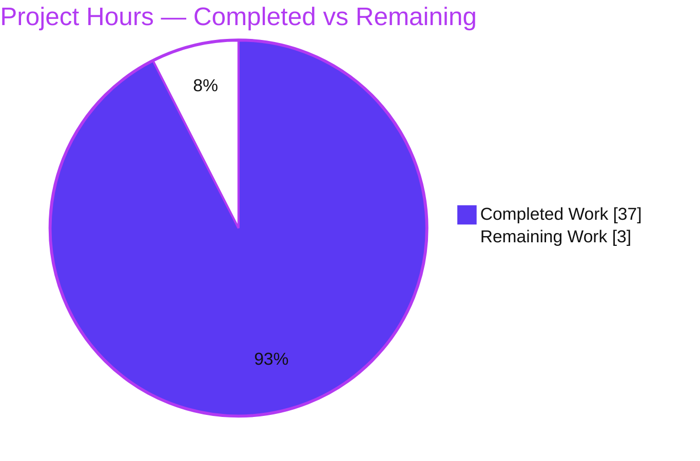

# Blitzy Project Guide — kitty Onboarding Investigation (Q&A)

> Branch: `blitzy-398e87e1-dff1-4fb6-8612-c20e9d3fed15` · Source tip: `815df1e21` · HEAD: `edfe06e25`
> Deliverable: `blitzy/documentation/kitty_815df1e210e0.md`

---

## 1. Executive Summary

### 1.1 Project Overview

This project delivers a single, empirically-grounded Q&A document that resolves an onboarding investigation into the **kitty** terminal emulator — a codebase that markets itself as a "GPU based terminal" yet is a weave of C, Python, Go, Objective-C, and GLSL. The document answers four questions: where the runtime heavy lifting lives (the native C core plus the GPU shader pipeline), what the 13 GLSL files do and how central they are, why running the main entry point fails immediately (the missing compiled extension `kitty.fast_data_types`), and whether the `kittens/` tools are truly independent (they share the same native bridge). Target users are engineers onboarding to kitty. Every behavioral claim is paired with verbatim command output; every factual claim carries a `file:line` citation.

### 1.2 Completion Status

The project is **92.5% complete** on an AAP-scoped, hours-based basis. All autonomous deliverables are finished and verified; the remaining work is human review and sign-off of the document.


| Metric | Hours |
|--------|------:|
| **Total Hours** | 40 |
| **Completed Hours (AI + Manual)** | 37 (AI: 37 · Manual: 0) |
| **Remaining Hours** | 3 |
| **Percent Complete** | **92.5%** |

> Color key — **Completed = Dark Blue `#5B39F3`**, **Remaining = White `#FFFFFF`**.

### 1.3 Key Accomplishments

- [x] Delivered the mandated branch-named document `blitzy/documentation/kitty_815df1e210e0.md` (554 lines) at the exact required path.
- [x] Answered all four questions (Q1 heavy-lifting, Q2 GLSL, Q3 entry-point failure, Q4 kittens) with an explicit coverage pass confirming every named item + "e.g./such as" example is addressed.
- [x] Achieved evidentiary rigor — 66 code-fence lines (~33 evidence blocks), 4 tables, 1 mermaid convergence diagram, and 34+ `file:line` citations, each re-verified against source.
- [x] Built kitty from source (C extension, Go `kitten`, GLFW backend, native launcher) under strict `-std=c11 -pedantic-errors -Werror` — EXIT 0.
- [x] Captured both failure paths (`ModuleNotFoundError`, icat standalone guard) and success paths (`kitty --version`, headless GPU render with live shader compilation).
- [x] Quantified the multi-language footprint (native C/ObjC ≈ 100,023 LOC) and traced the GLSL build-time codegen + runtime GPU compilation pipeline.
- [x] Maintained perfect read-only scope — repository byte-clean apart from the single new document; all temporary observation scripts removed.
- [x] Passed all five autonomous validation gates with zero unresolved discrepancies.

### 1.4 Critical Unresolved Issues

| Issue | Impact | Owner | ETA |
|-------|--------|-------|-----|
| _None_ | No blocking issues. The deliverable is complete, committed, and independently verified accurate; the read-only codebase builds, tests, and runs cleanly. | — | — |

### 1.5 Access Issues

**No access issues identified.** The repository is fully accessible, the toolchain image is available, and no external service credentials, API keys, or third-party access are required for this documentation deliverable.

| System/Resource | Type of Access | Issue Description | Resolution Status | Owner |
|-----------------|----------------|-------------------|-------------------|-------|
| _None_ | — | No access issues encountered during investigation, build, or validation | N/A | — |

### 1.6 Recommended Next Steps

1. **[Medium]** Technically review the answer document for accuracy and completeness against the four onboarding questions and confirm every named item is addressed to the requester's satisfaction.
2. **[Medium]** Optionally spot-reproduce the key commands (build sanity, one failure path, one success path) in the reviewer's own environment to confirm the pasted evidence.
3. **[Low]** Accept and merge the single-file pull request to the target branch.
4. **[Low]** Optionally distribute the document to the broader onboarding audience or link it from internal onboarding materials (the document is standalone Markdown, separate from the Sphinx `docs/`).

---

## 2. Project Hours Breakdown

### 2.1 Completed Work Detail

Every completed component traces to an AAP requirement (investigation activity or the single answer document). **Total = 37 hours** (matches Completed Hours in §1.2).

| Component | Hours | Description |
|-----------|------:|-------------|
| Environment setup & full build | 6 | Configure the toolchain image (CPython 3.11.15, Go 1.22, C11 compiler, pkg-config libs) and build the C extension `kitty/fast_data_types`, Go `kitten`, GLFW backend, and native launcher — EXIT 0 under strict flags. |
| Failure-path evidence capture (Q3/Q4) | 3 | Reproduce the un-built scenario via `git archive HEAD`; capture the entry-point `ModuleNotFoundError` (Q3), the runner `ModuleNotFoundError` (Q4a), and the icat standalone guard (Q4b) with verbatim tracebacks + exit codes. |
| Success-path evidence capture (Q2) | 4 | Capture `kitty --version` (EXIT 0), the headless GPU render (`OS Window created`, GL 4.5 Mesa) via `xvfb-run` + software Mesa, and the live shader assembly (`#version 140`, 9294-char assembled source). |
| Q1 — language footprint measurement & analysis | 4 | Measure per-language LOC on the committed tree (excluding vendored `3rdparty/`), reconcile the `cloc`/`find` fallback, analyze built-tree inflation and the `-print` artifact, and locate the C/GPU heavy-lifting seam. |
| Q2 — GLSL pipeline trace | 3 | Trace build-time C uniform-binding codegen (`setup.py:1035–1059`) and runtime versioning/compilation (`kitty/shaders.py`, `kitty/shaders.c`); enumerate all 13 shaders and their program groups. |
| Q3 — entry-point import-chain & native-wiring analysis | 3 | Trace `__main__.py → entry_points.py → main.py → borders.py`, the dispatcher GUI-branch logic, the C extension definition (`data-types.c`), the 1,635-line `.pyi` stub, and the `setup.py` build/launcher path. |
| Q4 — kittens modularity investigation | 3 | Count 19 subdirs / 18 runnable / `tui`; enumerate all 18 kitten names; prove the transitive native dependency and the distinct standalone guard (AST-confirmed module-level import analysis). |
| Authoring the 554-line answer document | 8 | Write the full Q&A prose, pair each claim with its evidence block, build the tables and mermaid convergence diagram, and structure the abstract, per-question sections, and appendix. |
| Coverage pass + iterative QA/code-review fixes | 2 | Perform the coverage pass and apply four review/QA refinements across the commit history (Q1 metric label, Q1 build boundary, §1.2 LOC counts, code-review findings). |
| Cleanup & scope-integrity verification | 1 | Remove all temporary observation scripts/checkouts under `/tmp`; verify `git status` clean and the diff is exactly one file. |
| **Total** | **37** | |

### 2.2 Remaining Work Detail

Remaining work is path-to-production human acceptance only (no deployment/CI applies to a Markdown deliverable). **Total = 3 hours** (matches Remaining Hours in §1.2 and the §7 pie chart).

| Category | Hours | Priority |
|----------|------:|----------|
| Technical review of document accuracy & completeness vs Q1–Q4 | 1.5 | Medium |
| Spot-reproduction of key build/run/failure commands on reviewer environment | 1.0 | Medium |
| Stakeholder acceptance & PR merge | 0.5 | Low |
| **Total** | **3.0** | |

---

## 3. Test Results

All results below originate from Blitzy's autonomous validation logs for this project (Gate 3 test execution and Gate 4/5 runtime + evidence reproduction). Because the deliverable is a read-only document, the unit suites function as **regression/integrity checks** (confirming the codebase still builds, tests, and runs), while the documentation evidence-reproduction checks verify the document's empirical claims.

| Test Category | Framework | Total Tests | Passed | Failed | Coverage % | Notes |
|---------------|-----------|------------:|-------:|-------:|-----------:|-------|
| Unit (Python) | `unittest` via `./test.py` | 145 | 141 | 0 | Not measured | `Ran 145 tests / OK (skipped=4)`; 4 skips are legitimate env-conditional (frozen-build CA cert, macOS-only font, fish-not-installed ×2) |
| Unit/Integration (Go) | `go test` | All | All | 0 | Not measured | `All Go tests succeeded`; `go mod verify` → "all modules verified" |
| Documentation Evidence Reproduction | Agent capture (Gate 4/5) | 6 | 6 | 0 | N/A | Q3 entry-point failure, Q4a runner failure, Q4b icat guard, `kitty --version`, headless GPU render, per-language LOC — all reproduce the doc byte-for-byte |

**Aggregate:** 151+ autonomous checks executed, **0 failures**, 4 legitimate skips. No regressions vs the setup baseline.

---

## 4. Runtime Validation & UI Verification

kitty is a native GPU terminal emulator (no web UI); "UI verification" here means the GPU rendering context and shader compilation at launch.

- ✅ **Operational** — Dependencies: Python 3.11.15, Go 1.22.12, C11 compiler, all system libraries resolved via `pkg-config`.
- ✅ **Operational** — Compilation: `setup.py build` → EXIT 0 under strict `-std=c11 -pedantic-errors -Werror` (zero warnings/errors). Built `fast_data_types.so`, Go `kitten`, `glfw-x11.so`, `launcher/kitty`.
- ✅ **Operational** — Success path (version): `PYTHONHOME=/opt/python311 kitty/launcher/kitty --version` → `kitty 0.35.2 created by Kovid Goyal` (EXIT 0).
- ✅ **Operational** — GPU render / "UI": headless launch under `xvfb-run` + `LIBGL_ALWAYS_SOFTWARE=1` → `OS Window created`, `Child launched`, `GL version string: '4.5 (Core Profile) Mesa 25.2.8-0ubuntu0.25.10.2'` (EXIT 0 ⇒ cell/border/graphics/bgimage/tint shaders compiled successfully).
- ✅ **Operational** — Failure path Q3 (by design): `python __main__.py` on an un-built tree → `ModuleNotFoundError: No module named 'kitty.fast_data_types'` (EXIT 1).
- ✅ **Operational** — Failure path Q4a (by design): runner import chain `runner.py:14 → utils.py:45` → identical `ModuleNotFoundError` (EXIT 1).
- ✅ **Operational** — Failure path Q4b (by design): `kittens/icat/main.py` standalone → `This should be run as kitten icat` (EXIT 1).

_All runtime outcomes reproduce the deliverable's pasted evidence byte-for-byte; several were independently re-run during this assessment with matching results._

---

## 5. Compliance & Quality Review

Cross-map of the AAP / rule-set "SWE-AtlasQnA-Repo" directives to observed compliance. Fixes applied during autonomous validation are noted.

| Benchmark (AAP / Rule) | Status | Progress | Evidence / Notes |
|------------------------|--------|:--------:|------------------|
| Deliverable location & branch-name (`blitzy/documentation/kitty_815df1e210e0.md`) | ✅ Pass | 100% | File present at exact path; name equals source branch |
| Investigate by RUNNING first, then write | ✅ Pass | 100% | Build + failure/success runs captured before authoring; two execution states documented |
| One claim → one verbatim evidence line | ✅ Pass | 100% | 66 fence-lines; each claim followed by its command + output |
| Answer every named item + coverage pass | ✅ Pass | 100% | Explicit checkboxed coverage section enumerating all items + examples |
| Exact & grounded (`file:line` + literals) | ✅ Pass | 100% | 34+ citations; 8 spot-checked in this assessment — all pinpoint-accurate |
| Report-as-observed oddities | ✅ Pass | 100% | "calibre requires Python" (`setup.py:44`), 13 GLSL (not 12), 18 kittens/19 subdirs, `-print` artifact, off-by-one note |
| Read-only scope (no source edits) | ✅ Pass | 100% | `git diff 815df1e21..HEAD` = 1 file, 554 insertions, 0 deletions |
| Cleanup (temp scripts removed) | ✅ Pass | 100% | `git status --porcelain` empty; verified clean post-cleanup |
| No regressions (codebase builds/tests/runs) | ✅ Pass | 100% | Gate 2 EXIT 0; Gate 3 145 Python OK + Go OK |
| Lint/type scope | ✅ Pass | 100% | `.md` deliverable is outside ruff/mypy scope (`kitty,kittens,glfw,*.py,docs/conf.py,gen`) |

**Fixes applied during the autonomous process (visible in commit history):** resolve code-review findings (`7c7c7e168`); correct Q1 metric label — Python leads by line count, not file count (`74db792c1`); fix Q1 build boundary — `glfw/` and `tools/` build separately, not into `fast_data_types` (`5b1418ed1`); fix §1.2 LOC counts and causal note (`edfe06e25`). **Outstanding compliance items: none.**

---

## 6. Risk Assessment

Overall risk posture is **LOW** — a read-only, single-document deliverable, fully verified, with the repository left byte-clean and zero source/build/test/CI changes. No High or Critical risks exist.

| Risk | Category | Severity | Probability | Mitigation | Status |
|------|----------|----------|-------------|------------|--------|
| Citation/line-number drift if upstream kitty advances beyond the branch tip | Technical | Low | Low | Document is pinned to exact commit `815df1e210e0a9ab4622f5c7f2d6891d7dbeddf1`; it is a point-in-time snapshot | Mitigated |
| Success-path evidence (build + GPU render) requires the specific toolchain image | Technical | Low | Medium | Exact image, interpreter, and flags documented; Q3/Q4 failure paths reproduce with **no build** at all | Mitigated |
| Sensitive-data leakage in pasted evidence | Security | Low | Low | Verified clean — no secrets/tokens/keys; absolute host paths normalized to `.../`; no code/attack surface added | Resolved |
| Documentation staleness over time | Operational | Low | Low | Static, pinned snapshot; re-verify only if referenced against a newer branch | Accepted |
| Integration coupling / breaking the build | Integration | Low | Low | Standalone doc — no in-repo file references it; outside ruff/mypy scope; cannot break build/test/CI | N/A (no exposure) |

---

## 7. Visual Project Status

**Project Hours Breakdown** — Completed = Dark Blue `#5B39F3`, Remaining = White `#FFFFFF`. The "Remaining Work" value (3) equals the §1.2 Remaining Hours and the §2.2 total.



**Remaining hours by category** (from §2.2, total = 3.0h):

| Category | Hours | Bar |
|----------|------:|-----|
| Technical review vs Q1–Q4 | 1.5 | ███████████████ |
| Spot-reproduction of commands | 1.0 | ██████████ |
| Stakeholder acceptance & merge | 0.5 | █████ |
| **Total** | **3.0** | |

**Priority distribution of remaining work:** Medium = 2.5h (83%) · Low = 0.5h (17%) · High/Blocking = 0h.

---

## 8. Summary & Recommendations

**Achievements.** The project fully delivers its single mandated artifact: a 554-line, empirically-grounded Q&A document that resolves the kitty onboarding investigation. It answers all four questions with paired command output and `file:line` citations, converging on the central finding that a single compiled C extension — `kitty.fast_data_types` — ties everything together: it is the seam behind which the native heavy lifting lives (Q1), it exports `GLSL_VERSION`/`compile_program` to the shader runtime (Q2), its absence is the "one critical piece" that breaks the entry point (Q3), and the kittens inherit it transitively (Q4).

**Remaining gaps.** None on the autonomous side. The 3 remaining hours are entirely human acceptance: reviewing the document, optionally re-running a few commands, and merging.

**Critical path to production.** Review → optional spot-reproduction → sign-off/merge. There is no build, deployment, or integration path for a Markdown deliverable, so "production" means acceptance and merge of the single-file PR.

**Success metrics.** Scope compliance: exactly one file changed (554 insertions, 0 deletions). Quality: all five autonomous gates passed; 145 Python + all Go tests green; every empirical claim reproduces byte-for-byte; 8/8 spot-checked citations pinpoint-accurate.

**Production readiness assessment.** The project is **92.5% complete** and **ready for human review**. It is production-ready subject only to stakeholder acceptance — the maximum honest autonomous completion for a deliverable that still awaits human sign-off.

| Metric | Value |
|--------|-------|
| AAP-scoped completion | 92.5% |
| Completed / Total hours | 37 / 40 |
| Files changed | 1 (`blitzy/documentation/kitty_815df1e210e0.md`) |
| Blocking issues | 0 |
| Autonomous gates passed | 5 / 5 |

---

## 9. Development Guide

How to reproduce every observation in the deliverable. All commands below were tested during this assessment and reproduce the documented outputs.

### 9.1 System Prerequisites

- **OS:** Linux (project toolchain image `andrewparkscaleai/coding-agent:kovidgoyal__kitty__815df1e210e0a9ab4622f5c7f2d6891d7dbeddf1`)
- **Python:** CPython **3.11** (build target; the image ships it at `/opt/python311`). A system `python3` (3.13) also exists but is **not** the build target.
- **Go:** **1.22** (`go.mod:3`)
- **C compiler:** C11 (`gcc`/`clang`), used with `-std=c11 -pedantic-errors -Werror`
- **System libraries (via `pkg-config`):** `gl`, `xi`, `xrandr`, `xinerama`, `xcursor`, `fontconfig`, `freetype2`, `harfbuzz`, `lcms2`, `libpng`, `dbus-1`, `xkbcommon`
- **Headless GPU:** `xvfb` + Mesa software rendering (`LIBGL_ALWAYS_SOFTWARE=1`)

### 9.2 Environment Setup

```bash
# From the repository root
export PATH="$PATH:/usr/local/go/bin"     # ensure Go 1.22 is on PATH
/opt/python311/bin/python3.11 --version   # -> Python 3.11.15  (the build target)
go version                                # -> go1.22.12 linux/amd64
```

### 9.3 Read the Deliverable

```bash
wc -l blitzy/documentation/kitty_815df1e210e0.md   # -> 554
sed -n '1,60p' blitzy/documentation/kitty_815df1e210e0.md
```

### 9.4 Build (produces the C extension + native launcher)

```bash
PATH=$PATH:/usr/local/go/bin CI=true /opt/python311/bin/python3.11 setup.py build --verbose
# Expected: EXIT 0; builds kitty/fast_data_types.so, kitty/launcher/kitty, kitty/launcher/kitten, kitty/glfw-x11.so
```

### 9.5 Run — Success Path

```bash
PYTHONHOME=/opt/python311 kitty/launcher/kitty --version
# Expected: kitty 0.35.2 created by Kovid Goyal   (EXIT 0)

# Headless GPU render (confirms shader compilation):
PATH=$PATH:/usr/local/go/bin xvfb-run -a env PYTHONHOME=/opt/python311 LIBGL_ALWAYS_SOFTWARE=1 \
    kitty/launcher/kitty --debug-rendering -o confirm_os_window_close=0 sh -c 'printf DONE' 2>&1 \
  | sed -E 's/^\[[0-9]+\.[0-9]+\] //' | grep -E 'OS Window created|GL version string'
# Expected: OS Window created ; GL version string: '4.5 (Core Profile) Mesa ...'
```

### 9.6 Run — Failure Paths (require NO build)

```bash
# Reproduce the un-built tree faithfully (contains none of the git-ignored .so artifacts)
rm -rf /tmp/kitty_clean && mkdir -p /tmp/kitty_clean && git archive HEAD | tar -x -C /tmp/kitty_clean
cd /tmp/kitty_clean

# Q3 — entry point:
/opt/python311/bin/python3.11 __main__.py ; echo "EXIT=$?"
# -> ModuleNotFoundError: No module named 'kitty.fast_data_types'   (EXIT=1)

# Q4a — via the runner:
/opt/python311/bin/python3.11 -c "from kittens.runner import run_kitten; run_kitten('icat')" ; echo "EXIT=$?"
# -> same ModuleNotFoundError via kittens/runner.py:14 -> kitty/utils.py:45   (EXIT=1)

# Q4b — a kitten standalone (distinct guard):
/opt/python311/bin/python3.11 kittens/icat/main.py ; echo "EXIT=$?"
# -> This should be run as kitten icat   (EXIT=1)
cd - >/dev/null && rm -rf /tmp/kitty_clean
```

### 9.7 Verification — LOC Footprint (Q1)

```bash
rm -rf /tmp/kitty_loc && mkdir -p /tmp/kitty_loc && git archive HEAD | tar -x -C /tmp/kitty_loc
cd /tmp/kitty_loc
for ext in c h m py go glsl; do
  files=$(find . -path ./.git -prune -o -path ./3rdparty -prune -o -type f -name "*.$ext" -print | wc -l)
  lines=$(find . -path ./.git -prune -o -path ./3rdparty -prune -o -type f -name "*.$ext" -exec cat {} + | wc -l)
  printf "%-6s files=%-6s lines=%s\n" ".$ext" "$files" "$lines"
done
cd - >/dev/null && rm -rf /tmp/kitty_loc
# Expected: .c 83/57209  .h 75/34815  .m 7/7999  .py 213/62829  .go 258/56071  .glsl 13/696
```

### 9.8 Verification — Scope & Tests

```bash
git diff 815df1e21..HEAD --name-status   # -> A  blitzy/documentation/kitty_815df1e210e0.md
git status --porcelain                   # -> (empty: clean tree)

# Full regression suite (integrity check that nothing is broken):
PATH=$PATH:/usr/local/go/bin CI=true LC_ALL=C.UTF-8 LANG=C.UTF-8 LIBGL_ALWAYS_SOFTWARE=1 xvfb-run -a ./test.py
# Expected: Ran 145 tests / OK (skipped=4) ; All Go tests succeeded
```

### 9.9 Troubleshooting

- **`ModuleNotFoundError: No module named 'kitty.fast_data_types'` on a fresh tree** — expected on an un-built tree; this is exactly the Q3/Q4a scenario. Run §9.4 to build the extension for the success paths.
- **Headless GPU launch hangs or fails to find a display** — wrap in `xvfb-run -a` and set `LIBGL_ALWAYS_SOFTWARE=1` for Mesa software rendering.
- **Wrong Python** — use `/opt/python311` (the build target), not the system `python3` (3.13); the compiled `.so` is ABI-tied to 3.11.
- **`cloc: not found`** — the image lacks `cloc`; use the sanctioned `find … | wc -l` fallback (§9.7).
- **Inflated LOC counts** — measure the committed tree via `git archive HEAD`, not the built tree; the build generates extra Go/header source that inflates counts (e.g., `.go` 258→338, `.h` 75→77).

---

## 10. Appendices

### A. Command Reference

| Purpose | Command |
|---------|---------|
| View deliverable | `sed -n '1,60p' blitzy/documentation/kitty_815df1e210e0.md` |
| Build | `PATH=$PATH:/usr/local/go/bin CI=true /opt/python311/bin/python3.11 setup.py build --verbose` |
| Test suite | `PATH=$PATH:/usr/local/go/bin CI=true LC_ALL=C.UTF-8 LANG=C.UTF-8 LIBGL_ALWAYS_SOFTWARE=1 xvfb-run -a ./test.py` |
| Version (success) | `PYTHONHOME=/opt/python311 kitty/launcher/kitty --version` |
| Clean checkout | `git archive HEAD \| tar -x -C /tmp/kitty_clean` |
| Q3 failure | `/opt/python311/bin/python3.11 __main__.py` |
| Q4a failure | `/opt/python311/bin/python3.11 -c "from kittens.runner import run_kitten; run_kitten('icat')"` |
| Q4b guard | `/opt/python311/bin/python3.11 kittens/icat/main.py` |
| Scope check | `git diff 815df1e21..HEAD --name-status` |

### B. Port Reference

Not applicable. kitty is a local GPU terminal emulator; the investigation opens no network listeners or service ports. Headless rendering uses a virtual X display (`xvfb`), not a TCP port.

### C. Key File Locations

| Path | Role |
|------|------|
| `blitzy/documentation/kitty_815df1e210e0.md` | **The deliverable** (554 lines) |
| `kitty/data-types.c` | C extension definition — `PyInit_fast_data_types` (`:525`), `.m_name = "fast_data_types"` (`:469`) |
| `kitty/borders.py` | First hard native import — `from .fast_data_types import …` (`:7`) |
| `kitty/utils.py` | Transitive native import for kittens (`:45`) |
| `kittens/runner.py` | Kitten dispatch — `from kitty.utils import …` (`:14`) |
| `kittens/icat/main.py` | Standalone guard — `raise SystemExit('This should be run as kitten icat')` (`:172`) |
| `kitty/shaders.py` / `kitty/shaders.c` | Runtime shader versioning/assembly + GPU compile |
| `kitty/*.glsl` (13 files) | Shader source set (cell, border, graphics, bgimage, tint, helpers) |
| `setup.py` | GLSL codegen (`:1035–1059`), extension build (`:1091`), launcher (`:1289`) |
| `kitty/fast_data_types.pyi` | 1,635-line native API type stub |

### D. Technology Versions

| Component | Version | Source |
|-----------|---------|--------|
| kitty | 0.35.2 | `kitty --version` |
| CPython (build target) | 3.11.15 | `/opt/python311` |
| Python (declared minimum) | `>=3.8` | `pyproject.toml:2` |
| CI-tested Python (highest) | 3.11 | `.github/workflows/ci.yml:85` |
| Go | 1.22.12 (pinned `1.22`) | `go.mod:3` |
| C standard | C11 (`-std=c11`) | `setup.py:492` |
| GLSL version | 140 | `fast_data_types.GLSL_VERSION` |
| OpenGL (runtime) | 4.5 (Core, Mesa 25.2.8) | headless render log |

### E. Environment Variable Reference

| Variable | Value | Purpose |
|----------|-------|---------|
| `PYTHONHOME` | `/opt/python311` | Point the native launcher at the 3.11 build-target interpreter |
| `PATH` | `…:/usr/local/go/bin` | Make Go 1.22 available to the build |
| `CI` | `true` | Non-interactive build/test mode |
| `LIBGL_ALWAYS_SOFTWARE` | `1` | Force Mesa software rendering for headless GPU |
| `LC_ALL` / `LANG` | `C.UTF-8` | Deterministic locale for the test suite |

### F. Developer Tools Guide

- **`git archive HEAD | tar -x -C /tmp/…`** — reproduce a pristine, un-built tree without disturbing the working copy (used for Q3/Q4 failure paths and LOC counts).
- **`xvfb-run -a`** — provide a virtual X display for headless GPU rendering.
- **`find … | wc -l`** — sanctioned LOC fallback when `cloc` is unavailable; exclude `3rdparty/` (linguist-vendored) to match the canonical `count-lines-of-code`.
- **`setup.py build`** — the single Python orchestrator that compiles the C extension, generates C from GLSL, builds the launcher, and drives the Go build.
- **`./test.py`** — runs both the Python (`unittest`) and Go test suites.

### G. Glossary

| Term | Definition |
|------|------------|
| `kitty.fast_data_types` | The compiled CPython C extension that is the seam between Python and the native core; the "one critical piece" everything converges on. |
| kitten | A small, self-contained kitty tool under `kittens/`; launched via the `kitten` binary/runner, not as a free-standing script. |
| GLSL | OpenGL Shading Language; kitty's 13 `.glsl` files implement all on-screen rendering. |
| VT parser | The terminal escape-sequence parser (`kitty/vt-parser.c`), part of the native hot path. |
| PTY | Pseudo-terminal; kitty's non-blocking PTY I/O runs on a native thread (`kitty/child-monitor.c`). |
| Uniform | A GPU shader input variable; `setup.py` code-generates a C struct of `GLint` locations per shader program. |
| Native launcher | The compiled `kitty/launcher/kitty` binary that embeds CPython and loads the built extension. |

---

_Blitzy Project Guide · Completed = `#5B39F3` · Remaining = `#FFFFFF` · Accent = `#B23AF2` · Highlight = `#A8FDD9`_