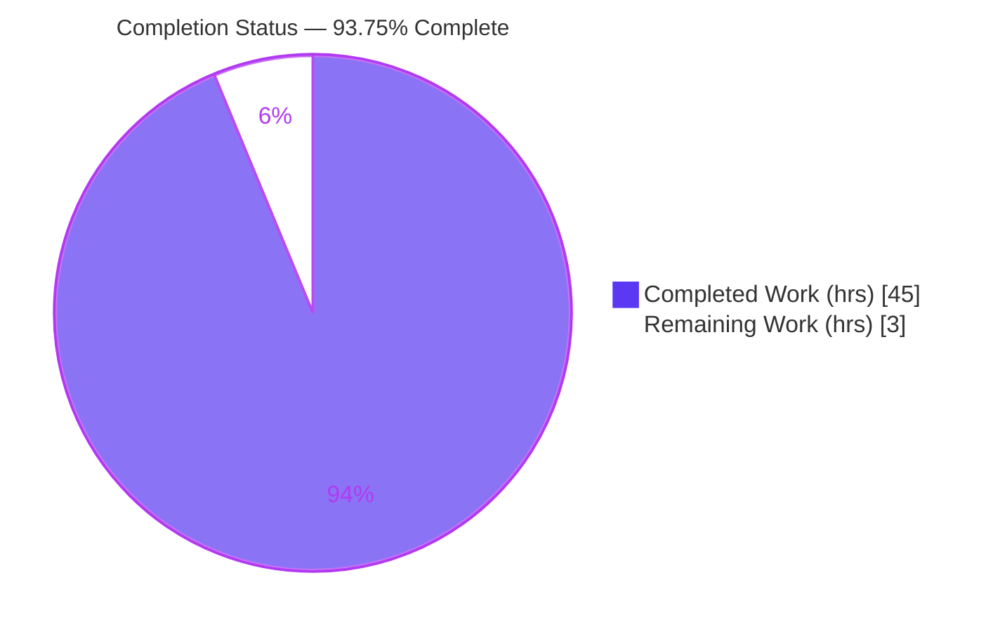
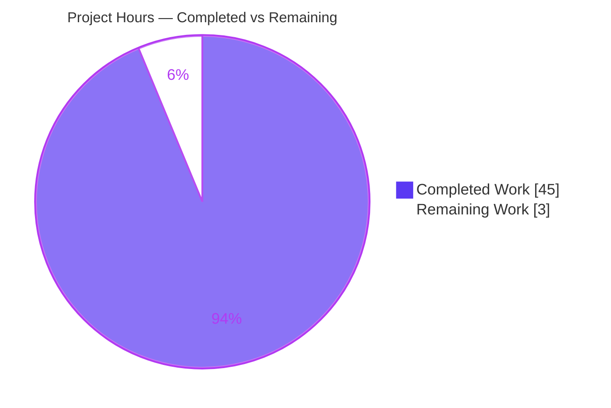
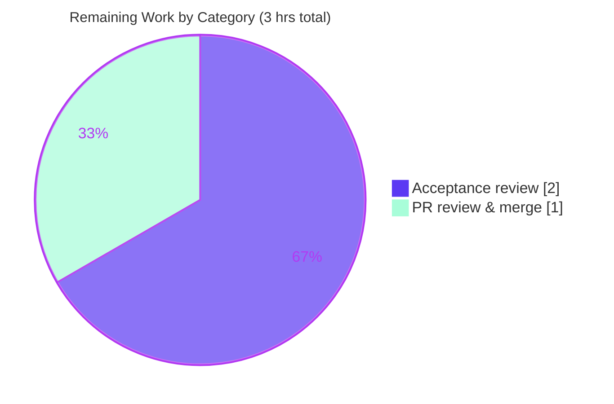

# Blitzy Project Guide — kitty Run-First Architecture Investigation

> **Scope of this guide.** This project is a **read-only investigative documentation** deliverable. Per the Agent Action Plan (AAP §0.1, §0.5), the sole artifact produced is one Markdown answer document — `blitzy/documentation/kitty_815df1e210e0.md` — that empirically answers four architecture questions about the *kitty* terminal emulator. **No source code was to be (or was) changed.** Completion percentage below reflects only AAP-scoped work plus its path-to-production activities.

---

## 1. Executive Summary

### 1.1 Project Overview

The objective was to author a single investigative document that empirically explains four aspects of the *kitty* terminal emulator's architecture by **observing runtime behavior**, not by reasoning about intent. Using a strict run-first methodology, the deliverable answers: **(Q1)** which language does the heavy lifting and where performance comes from; **(Q2)** what role the GLSL shader files play and how central they are; **(Q3)** why the main entry point fails and the one critical missing piece; and **(Q4)** whether kittens are independent or share the native bridge. The target audience is engineers seeking an evidence-grounded architectural map of a hybrid C/Python/Go + GPU codebase. Every behavioral claim is backed by captured command output and a `file:line` citation, and the repository was left byte-for-byte unchanged.

### 1.2 Completion Status

The project is **93.75% complete**. All AAP-scoped deliverables were completed autonomously by Blitzy; the only remaining work is human acceptance review of the document and merge of the pull request.



| Metric | Hours |
|--------|-------|
| **Total Hours** | **48** |
| Completed Hours (AI + Manual) | 45 (AI: 45 · Manual: 0) |
| Remaining Hours | 3 |
| **Percent Complete** | **93.75%** |

### 1.3 Key Accomplishments

- ✅ **Q1 — Language ownership answered with measured evidence:** the compiled C core does the heavy lifting; footprint measured two independent ways (tracked source + live on-disk), byte-stable across two runs (C 128 files/61,806 lines; Python 214/62,874; Go 258/56,071; GLSL 13/696).
- ✅ **Q2 — GLSL role answered end-to-end:** all 13 `.glsl` files enumerated and classified (5 vertex/fragment pairs + 3 shared includes), loading and `{PLACEHOLDER}` macro substitution traced in `kitty/shaders.py`, and OpenGL compilation traced into C (`compile_program` → `glCreateProgram`/`glLinkProgram` in `kitty/shaders.c`).
- ✅ **Q3 — Entry-point failure reproduced exactly:** `python3 __main__.py` → `ModuleNotFoundError: No module named 'kitty.fast_data_types'` at `kitty/borders.py:7`, along the chain `__main__.py:7 → entry_points.py:194 → main.py:11 → borders.py:7`. The one critical piece is the compiled native bridge `kitty.fast_data_types`.
- ✅ **Q4 — Kitten independence answered with the Python/Go split:** Python kittens fail with the *same* error via `kittens.runner` (`kitty/utils.py:45`) and `kittens.hints.main` (`kitty/conf/utils.py:27`); the Go `kitten` binary is self-contained (no `fast_data_types` reference anywhere under `tools/cmd/`).
- ✅ **Synthesis + Appendices A–F:** a coherent architecture conclusion plus a canonical build transcript (exit 0), present→absent→present transition with md5 verification, footprint counting method, documented discrepancies with the planning note, cleanliness certification, and tiered external sources.
- ✅ **Constraints honored perfectly:** read-only (only the answer doc added, +927/−0), evidence discipline (each claim has command + complete output + `[exit: N]` + `file:line`), and a byte-for-byte-clean working tree (`git status --porcelain` empty; no ignored artifacts).

### 1.4 Critical Unresolved Issues

| Issue | Impact | Owner | ETA |
|-------|--------|-------|-----|
| *None* — no blocking issues. The deliverable is complete, empirically accurate, well-formed, and committed; the repository is byte-for-byte clean. | N/A | N/A | N/A |

### 1.5 Access Issues

| System/Resource | Type of Access | Issue Description | Resolution Status | Owner |
|-----------------|----------------|-------------------|-------------------|-------|
| *No access issues identified* | — | Repository, build toolchain (CPython 3.11 venv, Go 1.24.4, gcc 15.2.0), and native `-dev` libraries were all available; the deliverable is committed on branch `blitzy-5c1e066c-992b-4bf9-8d37-696eb3c895bd`. | N/A | N/A |

### 1.6 Recommended Next Steps

1. **[Medium]** Perform an acceptance review of `blitzy/documentation/kitty_815df1e210e0.md` — confirm each of Q1–Q4 is answered to your satisfaction with a lead "Direct answer" + captured evidence, and that the Synthesis ties the four findings together. *(≈2h)*
2. **[Medium]** Review the single-file diff, confirm the read-only constraint (no source/dependency/CI/build files touched) and clean tree, then merge the branch and close out the PR. *(≈1h)*
3. **[Low · optional]** For maximum confidence, reproduce the pre-build Q3/Q4 failure signals locally (single copy-paste commands, no build required) using the commands in Section 9.
4. **[Low · optional]** If a live GPU-runtime demonstration is desired, perform the canonical build on the documented container toolchain and launch under `xvfb` (Section 9). *(not required to accept the deliverable)*

---

## 2. Project Hours Breakdown

### 2.1 Completed Work Detail

All completed work was performed autonomously by Blitzy. Each component traces to a specific AAP requirement (Q1–Q4 investigations, synthesis, methodology/evidence discipline, reproduction, canonical build, web-search corroboration, deliverable authoring, cleanliness, QA, and commit).

| Component | Hours | Description |
|-----------|-------|-------------|
| Q1 — Language-ownership investigation | 6 | Footprint measured two ways (tracked + live) × two runs; named hot-path C symbols; GPU-backed evidence; Go-layer separation; performance-origin rationale (doc L81–262). |
| Q2 — GLSL shader-role investigation | 6 | Enumerated 13 shaders; OpenGL role; traced Python loader + macro substitution (`kitty/shaders.py`) and C compilation (`kitty/shaders.c` `compile_program`/`glCreateProgram`/`glLinkProgram`); program expansion; per-stage mapping; font pipeline; centrality (doc L263–430). |
| Q3 — Entry-point-failure investigation | 5 | Reproduced `ModuleNotFoundError`; traced import chain to `borders.py:7`; no `.py` fallback (only `.pyi` stub); `python3 -m kitty` variant; post-build second barrier (`sys.kitty_run_data`); `readelf` ABI evidence (doc L431–621). |
| Q4 — Kitten-independence investigation | 5 | Standalone `kittens.runner` and `kittens.hints.main` failures; enumerated bridge-importing modules; Go-kitten self-containment via `file`/`ldd`/`grep`; `go.mod` module (doc L622–729). |
| Synthesis section | 2 | Tied the four findings into one architecture conclusion: C+GPU engine, thin Python shell bound at import time, independent Go layer, one bridge reached by two paths (doc L730–745). |
| Runtime reproduction (pre-build + variants + transition) | 3 | Canonical-entry failure signals; `-m kitty` variant; present→absent→present transition with md5 verification (Q3/Q4 + Appendix B step list). |
| Canonical build + post-build runtime observation | 4 | `python3 setup.py` build (exit 0); six native artifacts; GPU OpenGL 4.5 context under `xvfb`; `kitty`/`kitten` 0.35.2; bridge import OK (Appendix B). |
| Web-search corroboration | 2 | Seven external sources tiered first-party/secondary with a claim-to-source mapping (Appendix F). |
| Document authoring & structuring | 5 | Authored 927 lines at the correct path; 74 balanced code fences, single H1, 12 H2 sections; tables, cross-references, explicit `Inferred:` labels. |
| Read-only discipline, cleanup & cleanliness certification | 2 | Enforced read-only constraint; removed all build products; certified clean tree (Appendix E; `git clean -dfX`). |
| Evidence-fidelity QA & validation | 4 | Six commits / five review rounds (F1–F13, evidence-fidelity findings, md5 clause, QA Report-4, KITTY_VCS_REV disclosure); final 5-gate validation. |
| Commit & version control | 1 | Six commits by `agent@blitzy.com`, all touching only the deliverable. |
| **Total Completed** | **45** | |

### 2.2 Remaining Work Detail

All remaining work is human path-to-production; there are no outstanding autonomous engineering tasks.

| Category | Hours | Priority |
|----------|-------|----------|
| Human acceptance review of the answer document (read end-to-end; confirm Q1–Q4 answered to satisfaction; spot-check evidence discipline) | 2 | Medium |
| PR review, merge & branch close-out (verify single-file read-only diff + clean tree; merge; close out) | 1 | Medium |
| **Total Remaining** | **3** | |

### 2.3 Hours Reconciliation

| Quantity | Hours |
|----------|-------|
| Section 2.1 — Completed | 45 |
| Section 2.2 — Remaining | 3 |
| **Total (must equal Section 1.2 Total)** | **48** |
| Completion % = 45 ÷ 48 | **93.75%** |

---

## 3. Test Results

For a documentation deliverable, the "test surface" is the **empirical reproduction of every claim the document asserts** — captured command outputs and `file:line` references. All checks below originate from **Blitzy's autonomous validation logs** for this project (the Final Validator's 5-gate run) and were **independently re-verified during this assessment** on the clean repository. The document contains no application code of its own; the kitty project's own harness (`kitty_tests/`, `./test.py`) is out of scope for this read-only task and was not modified.

| Test Category | Framework | Total Tests | Passed | Failed | Coverage % | Notes |
|---------------|-----------|-------------|--------|--------|------------|-------|
| Behavioral claim reproduction — Q3 entry-point chain | Blitzy autonomous runtime observation (`python3`) | 3 | 3 | 0 | 100% of Q3 claims | Canonical `__main__.py`, `python3 -m kitty` variant, and post-build second barrier — all reproduced exact, `[exit: 1]`. |
| Behavioral claim reproduction — Q4 kitten dependency | Blitzy autonomous runtime observation (`python3`) | 3 | 3 | 0 | 100% of Q4 claims | `kittens.runner` (`utils.py:45`), `kittens.hints.main` (`conf/utils.py:27`), and Go-kitten self-containment — all reproduced exact. |
| Language-footprint measurement — Q1 | `git ls-files` / `find` + `wc` (NUL-safe) | 4 | 4 | 0 | 100% (byte-stable) | Two counting methods × two runs; identical results; matches tracked source exactly. |
| Shader-pipeline trace — Q2 | `grep` + source inspection | 2 | 2 | 0 | 100% of Q2 trace | Python loader (`shaders.py`) and C compiler (`shaders.c` `compile_program`) located and confirmed. |
| `file:line` reference verification | Shell (`sed`/`grep`) | 8 | 8 | 0 | 100% of sampled refs | 8 cited references resolved to the exact asserted source lines. |
| Canonical build | `python3 setup.py` (gcc/go) | 1 | 1 | 0 | n/a | Exit 0; six native artifacts produced; extension ABI-bound to `libpython3.11`. |
| Post-build runtime & GPU | C launcher + `xvfb` + OpenGL | 4 | 4 | 0 | n/a | Bridge import OK; `kitty` 0.35.2; `kitten` 0.35.2; OpenGL 4.5 (Core) context obtained. |
| Document well-formedness | Markdown structural check | 3 | 3 | 0 | n/a | 74 balanced code fences; single H1; 12 H2 sections. |
| Repository cleanliness | `git status --porcelain [--ignored]` | 2 | 2 | 0 | n/a | Both empty; `.so` absent; single-file diff (`+927/−0`). |
| **Total** | | **30** | **30** | **0** | **100%** | Zero failures across all reproduced claims and structural checks. |

---

## 4. Runtime Validation & UI Verification

Runtime was exercised in **both states** the deliverable documents — the clean pre-build state (native extension absent) and the post-build state (extension present) — plus a UI/GPU check under a headless display.

**Pre-build state (clean checkout, `kitty/fast_data_types.so` absent) — the deliverable's central claims:**
- ✅ **Operational** — `python3 __main__.py` fails immediately and deterministically with `ModuleNotFoundError: No module named 'kitty.fast_data_types'` at `kitty/borders.py:7` `[exit: 1]`.
- ✅ **Operational** — `python3 -m kitty` fails *differently* ("`'kitty' is a package and cannot be directly executed`") `[exit: 1]`, confirming the repository-root `__main__.py` is the canonical entry point.
- ✅ **Operational** — Standalone Python kitten via `kittens.runner` fails at `kitty/utils.py:45`; individual `kittens.hints.main` fails at `kitty/conf/utils.py:27` — same missing bridge `[exit: 1]`.
- ✅ **Operational** — Go `kitten` binary references no `fast_data_types` anywhere under `tools/cmd/` (self-contained).

**Post-build state (canonical build, extension present):**
- ✅ **Operational** — Canonical build `python3 setup.py` completes `[exit: 0]`, producing six native artifacts (`fast_data_types.so`, `glfw-x11.so`, `glfw-wayland.so`, `kittens/transfer/rsync.so`, Go `kitten`, C `kitty` launcher).
- ✅ **Operational** — Native bridge imports successfully (`import kitty.fast_data_types` → `fast_data_types.so`).
- ✅ **Operational** — `./kitty/launcher/kitty --version` → `kitty 0.35.2 created by Kovid Goyal` `[exit: 0]`.
- ⚠ **Partial (by design)** — A bare `python3 __main__.py` under the interpreter (post-build) hits a *second* barrier — `AttributeError: module 'sys' has no attribute 'kitty_run_data'` at `kitty/main.py:364` — because the outer C launcher injects `sys.kitty_run_data`; this is documented behavior, not a defect.

**UI / GPU verification (headless):**
- ✅ **Operational** — Under `xvfb` with software GL, kitty obtains an **OpenGL 4.5 (Core Profile), Mesa** context — confirming the GPU rendering path (the GLSL programs of Q2) initializes. No interactive terminal UI regression testing was in scope (read-only investigation; no UI code changed).

**Repository integrity after all runs:**
- ✅ **Operational** — `git status --porcelain` and `git status --porcelain --ignored` both empty; the working tree is byte-for-byte clean after every reproduction.

---

## 5. Compliance & Quality Review

The table cross-maps AAP deliverables and methodology rules (§0.7) to their compliance status, with fixes applied during autonomous validation noted.

| AAP Requirement / Rule | Benchmark | Status | Progress | Notes |
|------------------------|-----------|--------|----------|-------|
| Q1 — Language ownership & performance origin | Answered with measured footprint + named symbols + rationale | ✅ Pass | 100% | Footprint byte-stable across 2 runs; matches tracked source exactly. |
| Q2 — GLSL role & centrality | All shaders enumerated; load + compile pipeline traced | ✅ Pass | 100% | 13 files = 5 pairs + 3 includes; C `compile_program` located. |
| Q3 — Entry-point failure & critical piece | Exact traceback captured; missing module named | ✅ Pass | 100% | `kitty.fast_data_types` @ `borders.py:7`; chain fully traced. |
| Q4 — Kitten independence | Standalone runs captured; Python vs Go contrast | ✅ Pass | 100% | Python kittens dependent; Go kitten self-contained. |
| Synthesis | Four findings unified into one conclusion | ✅ Pass | 100% | C+GPU engine · thin Python shell · independent Go layer. |
| Run-first methodology | Observed output precedes conclusions | ✅ Pass | 100% | Every claim leads with a direct answer backed by captured output. |
| Canonical-path discipline (no bypass) | Real entry points only | ✅ Pass | 100% | `__main__.py` and `kittens.runner`; no debug hooks/mocks. |
| Evidence discipline | Command + complete output + `[exit]` + `file:line`; label inferences | ✅ Pass | 100% | `Inferred:` prefix used for non-observed statements. |
| Exhaustive condition coverage | Variants + pre/post-build states | ✅ Pass | 100% | `-m kitty` variant, Go-vs-Python paths, both build states. |
| Web-search corroboration | Authoritative external sources | ✅ Pass | 100% | 7 sources tiered; claim-to-source mapping (Appendix F). |
| Deliverable location & naming | `blitzy/documentation/kitty_815df1e210e0.md` | ✅ Pass | 100% | Created at the exact required path. |
| Read-only repository | No source file modified/added/deleted except the doc | ✅ Pass | 100% | Diff = single file added (`+927/−0`). |
| Cleanup & cleanliness | Temp scripts removed; clean tree | ✅ Pass | 100% | `git status --porcelain --ignored` empty. |
| Zero dependency changes (§0.6) | No manifest/lock edits | ✅ Pass | 100% | No dependency added/updated/removed. |

**Fixes applied during autonomous validation:** the one discrepancy found across ~925 lines of claims — Appendix E's md5 causal note originally attributed `.so` variability only to `-march=native`, omitting the `-DKITTY_VCS_REV` revision embedding (`kitty/data-types.c` via `setup.py:726`). Root cause was proven (forcing the VCS rev reproduces the documented md5 byte-identically) and the note was corrected in Appendices B and E (commit `879aa0013`). **Outstanding compliance items:** none.

---

## 6. Risk Assessment

This is a read-only documentation task with **zero source/dependency/config changes**, so the risk surface concerns reproducibility and documentation fidelity rather than runtime or security defects. Overall posture: **Low** — no High/Critical risks.

| Risk | Category | Severity | Probability | Mitigation | Status |
|------|----------|----------|-------------|------------|--------|
| Post-build runtime observations are host-environment-specific (CPython 3.11 venv / Go 1.24.4 / gcc 15.2.0 / Ubuntu 25.10, not the base image's 3.12/1.23/13.3/24.04) | Technical | Low | Medium | Document records both image and host provenance (Methodology + Appendix A/B); pre-build Q3/Q4 signals are interpreter-independent | Mitigated |
| Canonical build requires `CFLAGS="-Wno-error=switch"` on the documented host toolchain | Technical | Low | High (that toolchain) | Documented as a gcc-15/wayland-protocols host mismatch, not a code bug; full `-Werror` otherwise; Q3/Q4 signals need no build | Documented / Mitigated |
| `.so` md5 byte-identity is pinned to a fixed VCS rev + `-march=native`; later commits yield a different md5 | Technical | Low | Low | Fully disclosed post-fix (KITTY_VCS_REV via `setup.py:726`); determinism caveat stated | Resolved |
| `file:line` references are pinned to base commit `815df1e210e0`; upstream changes could drift line numbers | Operational | Low | Low | Document is an explicit point-in-time snapshot; all sampled refs verified accurate at this commit | Accepted (inherent to snapshot) |
| An in-place rebuild without cleanup would reintroduce ~131 gitignored artifacts | Operational | Low | Low | Tree verified clean; reproduction guidance mandates `PYTHONDONTWRITEBYTECODE=1` + `git clean -dfX` | Mitigated |
| External corroboration URLs (Appendix F) could become unavailable | Integration | Low | Low | External sources are corroboration-only; every claim independently backed by in-repo `file:line`; Q3 rests entirely on in-repo observation | Accepted |
| Reviewer may request section expansion/reformatting after acceptance review | Process | Low | Low | Document is comprehensive (927 lines), direct-answer-first, covers all named items and variants | Open (contingent; folded into review) |
| Security exposure | Security | None | N/A | Read-only task; no source/dependency/CI/build changes; `/app` never accessed; no new attack surface | N/A (no risk introduced) |

---

## 7. Visual Project Status

**Project hours breakdown** (Completed = Dark Blue `#5B39F3`, Remaining = White `#FFFFFF`):



**Remaining work by category** (hours; sums to the Section 2.2 total of 3):



- **Completed Work:** 45 hrs · **Remaining Work:** 3 hrs · **Total:** 48 hrs · **Complete:** 93.75%
- The "Remaining Work" value (3) equals the Section 1.2 Remaining Hours and the Section 2.2 "Hours" sum.

---

## 8. Summary & Recommendations

**Achievements.** The project delivered a rigorous, evidence-disciplined 927-line investigative document that answers all four architecture questions from **observed runtime behavior**. The central claims reproduce byte-for-byte: `python3 __main__.py` halts at `kitty/borders.py:7` with `ModuleNotFoundError: No module named 'kitty.fast_data_types'`, naming the single load-bearing native bridge; the Python-vs-Go kitten split is demonstrated; the GLSL pipeline is traced from Python loader into the C/OpenGL compiler; and the language footprint is measured reproducibly. The document even documents where direct observation diverged from the planning note (Appendix D) and tiers its external corroboration (Appendix F).

**Remaining gaps.** None in the deliverable itself. The remaining **3 hours** are purely human path-to-production: an **acceptance review** of the document (2h) and **PR review + merge** (1h). There are no failing tests, no compilation errors, no missing content, and no source-code work outstanding.

**Critical path to production.** Read → accept → merge. Because the deliverable is read-only documentation, there is no deployment, packaging, or release activity.

**Production readiness assessment.** The project is **93.75% complete** and **ready for human acceptance**. Quality gates all pass: empirical accuracy (30/30 reproduced checks), structural well-formedness (74 balanced fences, single H1), constraint compliance (read-only honored; tree byte-for-byte clean), and low overall risk. Per Blitzy policy the guide does not claim 100% until a human has reviewed and accepted the deliverable.

| Success Metric | Target | Actual | Status |
|----------------|--------|--------|--------|
| Questions answered with observed evidence | 4 of 4 | 4 of 4 | ✅ |
| Claim reproductions passing | 100% | 30/30 (100%) | ✅ |
| Source files modified (must be 0) | 0 | 0 | ✅ |
| Working tree clean | Clean | Clean (porcelain + ignored empty) | ✅ |
| Deliverable at required path | Yes | Yes | ✅ |

---

## 9. Development Guide

> This project changes no source code, so "development" here means **reproducing the investigation** and **reviewing the deliverable**. All commands below were tested on the project host and are copy-pasteable. Run them from the repository root.

### 9.1 System Prerequisites

- **To read/review the deliverable (sufficient for acceptance):** any Markdown viewer or text editor, plus `git`. **No build required.**
- **To reproduce the pre-build Q3/Q4 failure signals (the central claims):** only a Python 3 interpreter with `kitty/fast_data_types.so` **absent** (the repository's clean state). The signal is interpreter-version-independent (verified under both CPython 3.11.15 and 3.13.7).
- **To reproduce the post-build successful runtime (optional):** the documented container toolchain — CPython 3.11 venv, Go ≥ 1.22 (1.24.4 here), gcc, and system `-dev` libraries (`harfbuzz`, `freetype`, `fontconfig`, `libpng`, `lcms2`, `GL`, `openssl`); plus `xvfb` for a headless GPU context.

### 9.2 Environment Setup

```bash
# Always set this before any direct `python3` run to keep the tree clean
export PYTHONDONTWRITEBYTECODE=1

# Confirm you are at the repository root on the deliverable branch
git rev-parse --show-toplevel
git branch --show-current      # -> blitzy-5c1e066c-992b-4bf9-8d37-696eb3c895bd

# (Optional) confirm the toolchain for a canonical build
python3 --version                                  # system interpreter
test -x /opt/kitty311-venv/bin/python3 && /opt/kitty311-venv/bin/python3 --version
command -v go   && go version
command -v gcc  && gcc --version | head -1
```

### 9.3 View & Verify the Deliverable

```bash
# Read the document
less blitzy/documentation/kitty_815df1e210e0.md

# Confirm size and structural well-formedness (expect: 927 lines; 74 fences; 1 H1; 12 H2)
wc -l blitzy/documentation/kitty_815df1e210e0.md
python3 - <<'PY'
p="blitzy/documentation/kitty_815df1e210e0.md"
L=open(p,encoding="utf-8").read().splitlines()
fence="`"*3
print("fences:", sum(1 for x in L if x.startswith(fence)),
      "| H1:", sum(1 for x in L if x.startswith("# ")),
      "| H2:", sum(1 for x in L if x.startswith("## ")))
PY
```

### 9.4 Reproduce the Observations (read-only; no build)

```bash
# Q1 — language footprint (byte-stable; matches tracked source)
for ext in c h py go glsl; do
  files=$(git ls-files -z "*.$ext" | tr -dc '\0' | wc -c)
  lines=$(git ls-files -z "*.$ext" | xargs -0 cat | wc -l)
  printf '.%-4s files=%-4s lines=%s\n' "$ext" "$files" "$lines"
done
# -> .c 128/61806  .h 84/37939  .py 214/62874  .go 258/56071  .glsl 13/696

# Q3 — canonical entry point fails on the missing native bridge
PYTHONDONTWRITEBYTECODE=1 python3 __main__.py
# -> ModuleNotFoundError: No module named 'kitty.fast_data_types'   [exit: 1]

# Q3 variant — `-m kitty` fails differently (confirms __main__.py is canonical)
PYTHONDONTWRITEBYTECODE=1 python3 -m kitty
# -> 'kitty' is a package and cannot be directly executed           [exit: 1]

# Q4a — standalone Python kitten runner
PYTHONDONTWRITEBYTECODE=1 python3 -c "from kittens.runner import main"
# -> ModuleNotFoundError @ kitty/utils.py:45                        [exit: 1]

# Q4b — individual Python kitten (hints)
PYTHONDONTWRITEBYTECODE=1 python3 -m kittens.hints.main --help
# -> ModuleNotFoundError @ kitty/conf/utils.py:27                   [exit: 1]

# Q4 contrast — Go tooling references no native bridge (self-contained)
grep -rl 'fast_data_types' tools/cmd/ || echo "no matches -> Go tools independent [exit: 1 expected]"
```

### 9.5 (Optional) Canonical Build & GPU Runtime

```bash
# Build the C extension + Go kitten + C launcher (CFLAGS demotes a host toolchain -Wswitch)
CFLAGS="-Wno-error=switch" /opt/kitty311-venv/bin/python setup.py --verbose      # -> BUILD_EXIT=0

# Post-build sanity: bridge import and version
/opt/kitty311-venv/bin/python3 -c "import kitty.fast_data_types as f; print('bridge OK:', f.__file__.split('/')[-1])"
./kitty/launcher/kitty --version                                                 # -> kitty 0.35.2 ...

# Headless GPU context (obtains OpenGL 4.5 Core / Mesa)
LIBGL_ALWAYS_SOFTWARE=1 xvfb-run -a ./kitty/launcher/kitty --debug-rendering

# IMPORTANT: restore the byte-for-byte-clean tree afterward
git clean -dfX          # removes gitignored build products (repo-scoped)
git status --porcelain --ignored     # -> empty
```

### 9.6 Verify Read-Only Compliance & Cleanliness

```bash
# Only the deliverable was added vs the base commit
git diff --name-status d5f2b18b1^..HEAD      # -> A  blitzy/documentation/kitty_815df1e210e0.md

# Tree is byte-for-byte clean
git status --porcelain               # -> (empty)
git status --porcelain --ignored     # -> (empty)
```

### 9.7 Troubleshooting

- **Q3/Q4 do *not* raise `ModuleNotFoundError`** → the `.so` is present (a build ran). Run `git clean -dfX`, then retry.
- **Stray `__pycache__`/`*.pyc` appear after a run** → you omitted `PYTHONDONTWRITEBYTECODE=1`. Remove with `git clean -dfX` (repo-scoped).
- **Build stops with a `-Wswitch` error** → prepend `CFLAGS="-Wno-error=switch"` (documented gcc-15 / wayland-protocols host mismatch, not a code bug).
- **`python3 -m kitty` says "cannot be directly executed"** → this is **expected** (there is no `kitty/__main__.py`); it confirms the repository-root `__main__.py` is the canonical entry point.
- **Post-build `AttributeError: ... 'kitty_run_data'`** when running `python3 __main__.py` directly → **expected**; the outer C launcher (`./kitty/launcher/kitty`) injects `sys.kitty_run_data`. Use the launcher to run kitty.

---

## 10. Appendices

### Appendix A — Command Reference

| Purpose | Command |
|---------|---------|
| View the deliverable | `less blitzy/documentation/kitty_815df1e210e0.md` |
| Structural check | See §9.3 — expect 927 lines · 74 code fences · 1 H1 · 12 H2 sections |
| Q1 footprint | `for ext in c h py go glsl; do echo .$ext $(git ls-files -z "*.$ext" | xargs -0 cat | wc -l); done` |
| Q3 reproduction | `PYTHONDONTWRITEBYTECODE=1 python3 __main__.py` |
| Q3 variant | `PYTHONDONTWRITEBYTECODE=1 python3 -m kitty` |
| Q4a reproduction | `PYTHONDONTWRITEBYTECODE=1 python3 -c "from kittens.runner import main"` |
| Q4b reproduction | `PYTHONDONTWRITEBYTECODE=1 python3 -m kittens.hints.main --help` |
| Q4 Go contrast | `grep -rl 'fast_data_types' tools/cmd/` |
| Canonical build | `CFLAGS="-Wno-error=switch" /opt/kitty311-venv/bin/python setup.py --verbose` |
| GPU runtime | `LIBGL_ALWAYS_SOFTWARE=1 xvfb-run -a ./kitty/launcher/kitty --debug-rendering` |
| Cleanup | `git clean -dfX` |
| Read-only proof | `git diff --name-status d5f2b18b1^..HEAD` |
| Cleanliness | `git status --porcelain --ignored` |

### Appendix B — Port Reference

*Not applicable.* This is a read-only documentation deliverable — kitty is a local terminal emulator (GUI/GPU), not a networked service, and this task starts no server or listening port.

### Appendix C — Key File Locations

| Path | Role |
|------|------|
| `blitzy/documentation/kitty_815df1e210e0.md` | **The sole deliverable** — the investigative answer document (927 lines). |
| `__main__.py` | Canonical entry point (`main()` at line 7) — Q3. |
| `kitty/entry_points.py` | First hop of the failing import chain (line 194) — Q3. |
| `kitty/main.py` | Imports `load_borders_program` (line 11); post-build second barrier at line 364 — Q3. |
| `kitty/borders.py` | Site of the failing `from .fast_data_types import ...` (line 7) — Q3. |
| `kitty/fast_data_types.pyi` | Type stub only; the importable `.so` is built, never committed — Q3/Q4. |
| `kitty/shaders.py` / `kitty/shaders.c` | GLSL loader + macro substitution / OpenGL `compile_program` — Q2. |
| `kitty/*.glsl` (13 files) | GPU shader sources — Q2. |
| `kittens/runner.py`, `kittens/tui/*.py` | Python kitten layer that binds the native bridge — Q4. |
| `tools/cmd/**`, `go.mod` | Self-contained Go tooling / `kitten` binary — Q4. |
| `setup.py`, `Makefile` | Canonical build orchestrator (`compile_c_extension`, VCS-rev embedding at `setup.py:726`). |

### Appendix D — Technology Versions

| Component | Version | Notes |
|-----------|---------|-------|
| kitty (built) | 0.35.2 | Reported by `kitty --version` / `kitten --version` post-build. |
| Canonical Python (venv) | CPython 3.11.15 | `/opt/kitty311-venv/bin/python3`; the `.so` is ABI-bound to `libpython3.11.so.1.0`. |
| System Python | CPython 3.13.7 | `/usr/bin/python3`; pre-build failure signals reproduce here too. |
| Go | 1.24.4 | Builds the static `kitten` binary; module `kitty` (`go 1.22` floor in `go.mod`). |
| gcc | 15.2.0 | Requires `CFLAGS="-Wno-error=switch"` for the canonical build on this host. |
| OS (host) | Ubuntu 25.10 | Base image is Ubuntu 24.04.2 (provenance documented in the deliverable). |
| Python floor (project) | ≥ 3.8 | `pyproject.toml`; CI documents up to 3.11. |

### Appendix E — Environment Variable Reference

| Variable | Value | Purpose |
|----------|-------|---------|
| `PYTHONDONTWRITEBYTECODE` | `1` | Prevents stray `.pyc`/`__pycache__` during direct `python3` runs (keeps tree clean). |
| `CFLAGS` | `-Wno-error=switch` | Demotes one host-toolchain `-Wswitch` diagnostic during the canonical build. |
| `LIBGL_ALWAYS_SOFTWARE` | `1` | Forces software OpenGL for the headless GPU-context check under `xvfb`. |

### Appendix F — Developer Tools Guide

- **`git`** — history/diff inspection and cleanliness verification (`git diff --name-status`, `git status --porcelain --ignored`, `git clean -dfX`).
- **`git ls-files -z` + `wc`** — NUL-safe language-footprint measurement (Q1).
- **`grep` / `sed`** — locating and verifying `file:line` references and import chains (Q2–Q4).
- **`readelf -d`** — confirming the extension's `NEEDED libpython3.11.so.1.0` ABI dependency (Q3).
- **`xvfb-run`** — headless display for GPU-context validation of the OpenGL/GLSL pipeline (Q2).
- **`python3 setup.py`** — the one canonical build (C extension + Go kitten + C launcher).

### Appendix G — Glossary

| Term | Meaning |
|------|---------|
| **Native bridge** | `kitty.fast_data_types` — the compiled C extension (`.so`) exposing the C core to Python; the single load-bearing dependency of Q3/Q4. |
| **Kitten** | A specialized helper program that runs inside kitty; may be Python (bridge-dependent) or Go (self-contained). |
| **GLSL** | OpenGL Shading Language; the `.glsl` files are GPU shader sources driving kitty's rendering (Q2). |
| **Run-first methodology** | Deriving each answer from captured runtime output before drawing conclusions; inferences explicitly labeled. |
| **Canonical entry point** | The repository-root `__main__.py` routing into `kitty.entry_points.main`; the real startup path (no bypass). |
| **ABI binding** | The built `.so` links a specific `libpython3.11.so.1.0`, tying it to CPython 3.11 (not an upper version bound). |
| **Present→absent→present transition** | Appendix B's interruption-safe capture of both build states around one artifact, with md5 verification. |