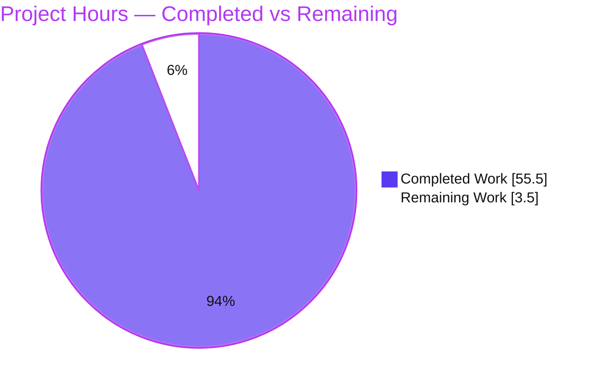
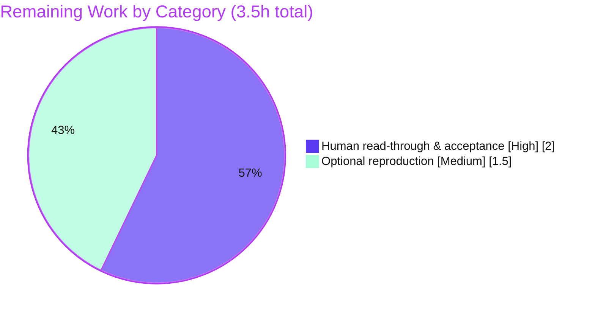

# Blitzy Project Guide

**Project:** Kitty Input→Display Pipeline — Runtime-Observation-Driven Investigation
**Branch:** `blitzy-2906a0d2-bb42-4083-8494-88f4281071c4` (base `815df1e21`)
**Deliverable:** `blitzy/documentation/kitty_815df1e210e0.md`
**Task Type:** Documentation (runtime-observation investigation) — read-only, single-file CREATE

---

## 1. Executive Summary

### 1.1 Project Overview

This project is a runtime-observation-driven investigation of the **Kitty** terminal emulator that documents how a keypress in the default shell flows through Kitty's core components to a screen update. The audience is engineers who need to understand Kitty's input→display pipeline from *observed* behavior rather than code reading alone. The deliverable is a single Markdown document grounded in real captured `--debug-input`/`--debug-rendering` traces, attributing each observed signal to an exact source `file:line`. Technical scope spans the GLFW/XKB reception layer, key encoding, PTY delivery, VT parsing, and the GPU render path. No Kitty source is modified — the investigation is strictly **read-only**, adding exactly one answer document.

### 1.2 Completion Status

The project is **94.1% complete** (AAP-scoped, hours-based per PA1: 55.5 completed hours of 59.0 total).


| Metric | Hours |
|--------|-------|
| **Total Hours** | 59.0 |
| **Completed Hours (AI + Manual)** | 55.5 (AI: 55.5, Manual: 0.0) |
| **Remaining Hours** | 3.5 |
| **Percent Complete** | **94.1%** |

> Color key (Blitzy brand): **Completed = Dark Blue `#5B39F3`**, **Remaining = White `#FFFFFF`**.

### 1.3 Key Accomplishments

- ✅ Built **Kitty 0.35.2** from source (`CI=true python3 setup.py build` → `kitty/launcher/kitty`); verified banner `kitty 0.35.2 created by Kovid Goyal`.
- ✅ Ran Kitty headless (Xvfb + Mesa `llvmpipe`, OpenGL **4.5 Core**) and captured real `--debug-input` and `--debug-rendering` traces.
- ✅ Exercised the canonical input path with `xdotool` (`a`, `b`, `c`, `Enter`, `Ctrl+a`, `Shift+b`) inside `bash`, covering press, release, and ignored modifier-only transitions.
- ✅ Answered all **three named sub-questions** — RECEIVE FIRST, INTERMEDIATE PROCESSING, DISPLAY UPDATE — with cause→effect reasoning.
- ✅ Attributed **62 `file:line` citations across 23 source files** (100% verified accurate by autonomous validation).
- ✅ Demonstrated **determinism**: two identical runs, normalized-trace `md5 = dec3329116425f7feb6d7ba26ce86592` in both.
- ✅ Applied **evidence discipline**: Wayland/Cocoa/IME backends and per-frame render internals explicitly labeled *inferred, not observed*.
- ✅ Maintained **read-only compliance** (0 source files modified) and cleaned up all temporary artifacts.

### 1.4 Critical Unresolved Issues

| Issue | Impact | Owner | ETA |
|-------|--------|-------|-----|
| _None._ Autonomous validation reported zero unresolved issues; the deliverable compiles-adjacent (builds), reproduces, and is scope-compliant. | None | — | — |

### 1.5 Access Issues

**No access issues identified.** The task is a self-contained, read-only documentation investigation requiring no repository permissions beyond the working branch, no service credentials, and no third-party API access.

| System/Resource | Type of Access | Issue Description | Resolution Status | Owner |
|-----------------|----------------|-------------------|-------------------|-------|
| — | — | No access issues identified | N/A | — |

### 1.6 Recommended Next Steps

1. **[High]** Perform a final human read-through and acceptance of `blitzy/documentation/kitty_815df1e210e0.md`; spot-check a sample of the 62 `file:line` citations and confirm the three sub-questions are answered satisfactorily, then approve/merge.
2. **[Medium]** Optionally reproduce the Appendix B workflow on the canonical reference container to independently re-confirm the environment-independent signals (32/16/16/6/10 counts and `md5 dec3329…`).
3. **[Low]** (Out of AAP scope) Consider follow-up investigations of the Wayland/Cocoa backends, IME composition, or the enhanced Kitty keyboard protocol — not required for this deliverable.

---

## 2. Project Hours Breakdown

### 2.1 Completed Work Detail

Each component traces to AAP requirements (§0.1–§0.5) and was delivered autonomously by Blitzy agents.

| Component | Hours | Description |
|-----------|-------|-------------|
| Environment setup & build | 8.5 | Build Kitty 0.35.2 from source with full toolchain (gcc, go, python3, harfbuzz/freetype/fontconfig, X11/XKB/GL headers per §0.6.2); provision headless OpenGL (Xvfb + Mesa `llvmpipe`, GL 4.5); install input-injection tooling (`xdotool`, PID-correlated window discovery). |
| Runtime observation capture | 6.0 | Capture `--debug-input` reception + `on_key_input` processing lines and `--debug-rendering` lifecycle; exercise unmodified keys, control key, modifier combinations, and press/release/ignored transitions. |
| Component attribution & mechanism analysis | 14.5 | Attribute 62 `file:line` citations across 23 source files; explain cause→effect legacy encoding (`a/b/c`→text, `Enter`→`0x0d`, `Ctrl+a`→`0x1`, `Shift+b`→`B`, releases ignored); corroborate against Kitty keyboard-protocol docs. |
| Answer-document authoring | 14.5 | Author the 920-line / 7,711-word document answering the 3 named sub-questions; embed verbatim Appendix A trace and the hardened, fail-closed Appendix B workflow; produce the Mermaid pipeline diagram, End-to-End summary, and Coverage Checklist; apply inferred-vs-observed labeling. |
| Verification & quality | 8.0 | Two-run determinism (byte-identical, matching `md5`); citation-accuracy verification (62/62); 20/20 cross-check assertions (counts 32/16/16/6/10 + encoding outcomes); markdown structural validity (UTF-8, balanced fences, mermaid intact, 0 NUL bytes). |
| Scope compliance, cleanup & commits | 4.0 | Read-only discipline (0 source files modified); correct deliverable placement/naming; trap-guarded temp-artifact teardown; 4 `agent@blitzy.com` commits including a code-review pass and two QA rounds. |
| **Total Completed** | **55.5** | |

### 2.2 Remaining Work Detail

Each remaining item is a **path-to-production** activity (human acceptance of a prose deliverable). No unfinished AAP implementation work remains.

| Category | Hours | Priority |
|----------|-------|----------|
| Final human read-through & acceptance of the investigation document (verify sub-question coverage, spot-check citations, approve/merge) | 2.0 | High |
| Optional independent reproduction of the Appendix B workflow on the canonical container (re-confirm 32/16/16/6/10 counts + `md5 dec3329…`) | 1.5 | Medium |
| **Total Remaining** | **3.5** | |

> Out-of-scope items (§0.4.2) — Wayland/Cocoa/IME backends, enhanced keyboard-protocol mode, exhaustive VT/shader internals — carry **0 hours** and are excluded from all totals.

### 2.3 Hours Reconciliation

- Completed (Section 2.1) = **55.5h**; Remaining (Section 2.2) = **3.5h**.
- 55.5 + 3.5 = **59.0h** = Total Hours (Section 1.2). ✔
- Completion = 55.5 / 59.0 = **94.1%**. ✔

---

## 3. Test Results

This is a documentation deliverable with **no product unit-test suite**; the "tests" below are **Blitzy's autonomous validation checks** executed against the build and the deliverable during the Final Validation phase. All entries originate from Blitzy's autonomous validation logs for this project.

| Test Category | Framework | Total Tests | Passed | Failed | Coverage % | Notes |
|---------------|-----------|-------------|--------|--------|------------|-------|
| Build Compilation | `setup.py build` (CI=true) | 1 | 1 | 0 | n/a | `kitty 0.35.2` produced; EXIT 0; zero warnings; `fast_data_types.so` built. |
| Citation Accuracy | grep/manual verbatim verification | 62 | 62 | 0 | 100% | Every `file:line` reference verified verbatim across 23 source files. |
| Runtime Determinism | two-run `diff` + `md5sum` | 2 | 2 | 0 | n/a | Normalized traces byte-identical; `md5 = dec3329116425f7feb6d7ba26ce86592` in both runs. |
| Cross-Check Assertions | count/encoding assertions | 20 | 20 | 0 | n/a | 32 key-event lines = 16 reception + 16 `on_key_input` = 6 sent + 10 ignored; `Enter`→`0x0d`, `Ctrl+a`→`0x1`, `Shift+b`→`B`. |
| Markdown Structure | structural validation | 5 | 5 | 0 | n/a | UTF-8 valid; 0 NUL bytes; balanced code fences; 1 Mermaid block intact; 3 named sub-question sections present. |
| **Totals** | | **90** | **90** | **0** | **100%** | All autonomous validation gates PASS. |

> Independent re-verification during this assessment reproduced: the `kitty 0.35.2` banner, the advertised `--debug-input`/`--debug-rendering` flags, the single-Added-file diff, balanced fences (46), 0 NUL bytes, the three sub-question sections (doc lines 249/315/446), and the exact Appendix A counts (32/16/16/6/10).

---

## 4. Runtime Validation & UI Verification

Legend: ✅ Operational | ⚠ Partial | ❌ Failing

**Runtime health (observed under the built binary):**
- ✅ **Build & launch** — `kitty 0.35.2` launches under headless Xvfb.
- ✅ **OpenGL context** — `GL version string: '4.5 (Core Profile) Mesa …' Detected version: 4.5` (above Kitty's 3.3 minimum).
- ✅ **Input reception** (`--debug-input`) — `Press/Release … xkb_keycode … glfw_key …` emitted per key.
- ✅ **Intermediate processing** — `on_key_input: … sent/ignored …` dispatch line emitted per key.
- ✅ **Child shell** — `bash` launched as the child (`Child launched`); echoes typed bytes back through the PTY.
- ✅ **Display lifecycle** (`--debug-rendering`) — `OS Window created`, `Child launched`, and the GL version line all observed at startup.
- ✅ **Determinism** — identical 32-line key-event sequence across two runs (matching `md5`).

**UI verification (terminal render surface):**
- ✅ **Render path active** — startup GL/window lifecycle confirms the OpenGL render path is live; the encoding outcomes (`a/b/c`→text, `Shift+b`→`B`, `Enter`→`0x0d`, `Ctrl+a`→`0x1`) are what the shell echoes back for display.
- ⚠ **Per-frame draw/swap** — the per-frame `parse_input → render → draw_cells → swap_window_buffers` chain is **source-inferred**, not logged per keystroke by `--debug-rendering` (the deliverable labels this explicitly). This is an accurate observation boundary, not a defect.

_No GUI screens exist to verify beyond the terminal render surface; there are no Figma frames or design attachments (§0.9)._

---

## 5. Compliance & Quality Review

AAP deliverables and the five binding rules (§0.7) cross-mapped to Blitzy's quality benchmarks.

| Requirement (AAP) | Benchmark | Status | Progress | Evidence |
|-------------------|-----------|--------|----------|----------|
| Rule 1 — Run-first persistent investigation | Built & ran real code paths; 2-run stability | ✅ PASS | 100% | Build banner; two identical runs; `md5 dec3329…` |
| Rule 2 — Exhaustive condition & evidence coverage | Modifiers + press/release/ignored; verbatim output | ✅ PASS | 100% | 6 keys; 6 sent + 10 ignored; Appendix A verbatim |
| Rule 3 — Observed-output discipline | Inferred labeled distinctly from observed | ✅ PASS | 100% | "Not Observed / Inferred" section; inline labels |
| Rule 4 — Complete, precise, grounded answering | Every claim carries `file:line`; cause→effect | ✅ PASS | 100% | 62 citations; §1/§2/§3; Coverage Checklist |
| Rule 5 — Deliverable & scope | Single MD, read-only, cleanup | ✅ PASS | 100% | Single Added file; 0 source modified; artifacts removed |
| Three named sub-questions answered | RECEIVE FIRST / INTERMEDIATE / DISPLAY | ✅ PASS | 100% | Doc §1 (L249), §2 (L315), §3 (L446) |
| Correct naming & placement | `blitzy/documentation/<branch>.md` | ✅ PASS | 100% | `kitty_815df1e210e0.md` present |
| No dependency changes to repo (§0.6.1) | 0 package/manifest edits | ✅ PASS | 100% | `setup.py`/`go.mod`/`pyproject.toml` unmodified |

**Fixes applied during autonomous validation:** code-review findings (commit `e594b91ec`), Python-version citation correction in the toolchain-provenance sidebar (`21c8fed98`), and Appendix B workflow hardening + child-argv prose correction (`044eca47b`).
**Outstanding compliance items:** none.

---

## 6. Risk Assessment

| Risk | Category | Severity | Probability | Mitigation | Status |
|------|----------|----------|-------------|------------|--------|
| Reproducibility metadata drift across environments (GL/Mesa/OS version strings & timestamps differ off the reference Ubuntu 24.04.2 container) | Technical | Low | Medium | Doc declares reference-container provenance; all environment-independent signals (counts, encodings, normalized-trace `md5`) reproduce byte-for-byte (confirmed on native Ubuntu 25.10). | Mitigated / Documented |
| `file:line` citation fragility if Kitty source is later updated/rebased (62 citations pinned to current commit) | Technical | Low | Low | Citations anchored to repo state at base `815df1e21`; deliverable is an explicit point-in-time snapshot; source is read-only. | Accepted |
| Headless OpenGL dependency for the render leg (Kitty is GPU-first) | Operational | Low | Medium | Appendix B documents exact Xvfb + Mesa `llvmpipe` setup (`LIBGL_ALWAYS_SOFTWARE=1`, `GALLIUM_DRIVER=llvmpipe`); software rendering avoids a physical GPU. | Mitigated |
| No automated regression guarding the prose deliverable vs. future code drift | Operational | Low | Medium | Point-in-time investigation; Appendix B is a re-runnable, assertion-checked workflow for on-demand re-validation. | Accepted |
| Reader may mistake reference-environment values (Mesa 25.2.8, GL 4.5, Ubuntu 24.04.2) for universal facts | Operational | Low | Low | Explicit toolchain-provenance sidebar labels these as reference-environment values. | Mitigated / Documented |

**Security risks:** none material — read-only documentation task, no code added to source, no dependency changes, no secrets, no network/auth surface. The Appendix B workflow is fail-closed and uses a per-run MIT-MAGIC-COOKIE for its private Xvfb (access control on).
**Integration risks:** none — no external services, APIs, or credentials; the only integration is the internal Kitty→child-`bash` PTY, fully self-contained and directly observed.
**Overall risk profile:** very low; all identified risks are Low severity and already Mitigated or Accepted. No blockers.

---

## 7. Visual Project Status

**Project Hours Breakdown** (Completed = Dark Blue `#5B39F3`, Remaining = White `#FFFFFF`):



**Remaining Hours by Category** (from Section 2.2; sums to 3.5h):



**Priority distribution of remaining work:** High = 2.0h (57%), Medium = 1.5h (43%), Low = 0.0h (out of scope). Remaining Work total = **3.5h**, identical to Section 1.2 and the Section 2.2 sum.

---

## 8. Summary & Recommendations

**Achievements.** The investigation is functionally complete. Blitzy autonomously built Kitty 0.35.2 from source, ran it headless under a software OpenGL context, captured deterministic `--debug-input`/`--debug-rendering` traces, and synthesized a rigorous 920-line answer document that explains — with 62 exact `file:line` citations and verbatim captured output — how input travels from the GLFW/XKB reception layer, through `kitty/keys.c` encoding and PTY delivery, VT parsing, and the main-loop render tick, to the GPU draw and buffer swap. All three named sub-questions (RECEIVE FIRST, INTERMEDIATE PROCESSING, DISPLAY UPDATE) are answered, and unobserved backends are honestly labeled as inferred.

**Remaining gaps.** No AAP implementation work remains. The only outstanding effort is **path-to-production**: a human read-through/acceptance of the prose deliverable (2.0h) and an optional independent reproduction of the Appendix B workflow (1.5h) — **3.5h** total.

**Critical path to production.** Human review and acceptance (HT-1) is the single gating step; once accepted, the PR can be merged. The optional reproduction (HT-2) adds independent confidence but is not blocking.

**Success metrics.** Build reproducible (`kitty 0.35.2`); trace deterministic (`md5 dec3329…` across two runs); 62/62 citations accurate; 20/20 cross-check assertions pass; single Added file with zero source modifications.

**Production readiness.** The project is **94.1% complete** (55.5 of 59.0 AAP-scoped hours). The deliverable is complete, internally consistent, reproducible, and scope-compliant; it is ready for human acceptance. Per Blitzy policy, completion is held below 100% pending that human sign-off.

| Metric | Value |
|--------|-------|
| AAP-scoped completion | 94.1% |
| Completed / Total hours | 55.5 / 59.0 |
| Remaining hours | 3.5 |
| Critical blockers | 0 |
| Source files modified | 0 (read-only) |

---

## 9. Development Guide

This guide explains how to build Kitty and reproduce the runtime-observation investigation. Commands were tested during this assessment; the deliverable's **Appendix B** contains the complete, fail-closed, two-run workflow.

### 9.1 System Prerequisites

- **OS:** Linux (reference environment: Ubuntu 24.04.2 LTS; verified reproducible on Ubuntu 25.10).
- **Compiler:** `gcc` with C11 support (reference 13.3.0; also builds on 15.x).
- **Python:** `python3` ≥ 3.8 (reference CPython 3.12.3). On Ubuntu 25.x system Python (PEP 668), use a venv or `--break-system-packages`.
- **Go:** `go 1.22` (per `go.mod`) — builds the `kitten` CLI only, which is **off** the input→display path.
- **Graphics:** an OpenGL **3.3+** context. Headless: Xvfb + Mesa software OpenGL (`llvmpipe`) reports GL 4.5.
- **Observation tools:** `xdotool`, `x11-utils`/`xdpyinfo`, `xauth` (all present in this assessment environment).

### 9.2 Environment Setup & Dependency Installation

```bash
# Reference dependency set (Ubuntu/Debian; from AAP §0.6.2). Non-interactive.
sudo DEBIAN_FRONTEND=noninteractive apt-get update
sudo DEBIAN_FRONTEND=noninteractive apt-get install -y \
  gcc golang pkg-config \
  libharfbuzz-dev libfreetype-dev libfontconfig-dev \
  liblcms2-dev libpng-dev zlib1g-dev libxxhash-dev libssl-dev libcanberra-dev libdbus-1-dev \
  libxkbcommon-x11-dev libx11-xcb-dev libx11-dev libxcursor-dev libxrandr-dev libxi-dev libxinerama-dev \
  libgl1-mesa-dev libsimde-dev \
  xvfb libgl1-mesa-dri mesa-utils xdotool x11-utils
```

### 9.3 Build

```bash
# From the repository root. Produces kitty/launcher/kitty (kitty 0.35.2).
CI=true python3 setup.py build

# Verify the build (expected banner shown):
./kitty/launcher/kitty --version
# -> kitty 0.35.2 created by Kovid Goyal

# Confirm the tracing flags are advertised:
./kitty/launcher/kitty --help | grep -E 'debug-input|debug-rendering'
# -> --debug-rendering, --debug-gl
# -> --debug-keyboard, --debug-input
```

### 9.4 Reproduce the Investigation (headless)

```bash
# 1) Private, authenticated Xvfb on a free display (access control ON).
export DISPLAY=:99
Xvfb :99 -screen 0 1280x800x24 +extension GLX +render >/tmp/obs_xvfb.log 2>&1 &
XVFB_PID=$!
export LIBGL_ALWAYS_SOFTWARE=1 GALLIUM_DRIVER=llvmpipe

# 2) Launch Kitty with input tracing in default config, child = bash.
./kitty/launcher/kitty --debug-input --config NONE -o confirm_os_window_close=0 \
  bash --norc --noprofile >/tmp/kitty_debug_input.log 2>&1 &
KITTY_PID=$!

# 3) Discover the window correlated to KITTY_PID, then inject the fixed key set.
WID=$(xdotool search --pid "$KITTY_PID" 2>/dev/null | head -1)
xdotool key --window "$WID" a b c Return ctrl+a shift+b

# 4) Separately, capture the render lifecycle.
./kitty/launcher/kitty --debug-rendering --config NONE -o confirm_os_window_close=0 \
  bash --norc --noprofile >/tmp/kitty_debug_render.log 2>&1 &

# 5) Normalize (strip ANSI + [N.NNN] timestamps; keep the two key-event line types)
#    and assert the canonical counts, then compare two runs with diff + md5sum.
#    Expected: 32 lines = 16 reception + 16 on_key_input = 6 sent + 10 ignored;
#    md5 = dec3329116425f7feb6d7ba26ce86592.

# 6) Teardown (kill THEN reap only the PIDs you spawned).
kill "$KITTY_PID" "$XVFB_PID" 2>/dev/null; wait "$KITTY_PID" "$XVFB_PID" 2>/dev/null
```

> The complete hardened, fail-closed, PID-correlated, two-run, assertion-checked workflow is in the deliverable's **Appendix B**. Prefer it for auditable reproduction.

### 9.5 Verify the Deliverable

```bash
DOC=blitzy/documentation/kitty_815df1e210e0.md
git diff 815df1e21 HEAD --name-status          # -> A  blitzy/documentation/kitty_815df1e210e0.md
file "$DOC"                                     # -> Unicode text, UTF-8 text
[ "$(tr -cd '\000' < "$DOC" | wc -c)" -eq 0 ] && echo "no NUL bytes"
grep -c '^\`\`\`' "$DOC"                        # -> 46 (even = balanced fences)
grep -nE '^## [123]\. (RECEIVE FIRST|INTERMEDIATE PROCESSING|DISPLAY UPDATE)' "$DOC"
```

### 9.6 Troubleshooting

- **`go: command not found`** — install `go 1.22`; it builds only the `kitten` CLI and does not affect the input→display path or the `kitty` launcher used for tracing.
- **No OpenGL context / GLX errors** — ensure Xvfb is running and export `LIBGL_ALWAYS_SOFTWARE=1` and `GALLIUM_DRIVER=llvmpipe` so Mesa `llvmpipe` provides software GL 4.5.
- **`xdotool` finds no window** — confirm the launched Kitty PID is still alive and match on `_NET_WM_PID`; add a short bounded wait for the window to map.
- **`error: externally-managed-environment` (pip on Ubuntu 25.x)** — use a virtualenv (`python -m venv .venv && source .venv/bin/activate`) or pass `--break-system-packages`.
- **Timestamps differ between runs** — expected; they are stripped by the `normalize` step before `diff`/`md5sum`.

---

## 10. Appendices

### Appendix A — Command Reference

| Command | Purpose |
|---------|---------|
| `CI=true python3 setup.py build` | Build Kitty; produces `kitty/launcher/kitty` (0.35.2). |
| `./kitty/launcher/kitty --version` | Print version banner (`kitty 0.35.2 created by Kovid Goyal`). |
| `./kitty/launcher/kitty --debug-input --config NONE … bash --norc --noprofile` | Launch with input tracing in default config, child = bash. |
| `./kitty/launcher/kitty --debug-rendering --config NONE … bash --norc --noprofile` | Launch with render-lifecycle tracing. |
| `xdotool search --pid <PID>` / `xdotool key --window <WID> a b c Return ctrl+a shift+b` | Discover the window and inject the fixed key set. |
| `git diff 815df1e21 HEAD --name-status` | Confirm single Added deliverable, zero source modifications. |

### Appendix B — Port Reference

No network ports are used. A terminal emulator with a local child shell over a PTY requires no listening sockets.

| Resource | Value |
|----------|-------|
| X display (headless) | `:99` (example; any free display) |
| Network ports | None |

### Appendix C — Key File Locations

| Path | Role |
|------|------|
| `blitzy/documentation/kitty_815df1e210e0.md` | **The deliverable** (answer document). |
| `setup.py` | Build entry point → `kitty/launcher/kitty`. |
| `kitty/launcher/kitty` | Built launcher (bootstraps the Python runtime). |
| `kitty/fast_data_types.so` | Compiled C core (child-monitor, VT parser, screen, shaders). |
| `glfw/xkb_glfw.c`, `kitty/glfw.c` | Input reception (XKB translation, GLFW callback). |
| `kitty/keys.c`, `kitty/key_encoding.c` | Intermediate processing (dispatch, encoding). |
| `kitty/child-monitor.c` | PTY write/read; main-loop render tick. |
| `kitty/vt-parser.c`, `kitty/screen.c` | Output parsing; screen model. |
| `kitty/shaders.c`, `kitty/gl.c` | GPU draw; GL context/version. |
| `docs/build.rst`, `docs/keyboard-protocol.rst` | Build procedure; legacy vs. enhanced encoding reference. |

### Appendix D — Technology Versions

| Component | Reference Environment | This Assessment Shell |
|-----------|-----------------------|-----------------------|
| Kitty | 0.35.2 | 0.35.2 (verified) |
| OS | Ubuntu 24.04.2 LTS | Ubuntu 25.10 |
| gcc | 13.3.0 | 15.2.0 |
| python3 | CPython 3.12.3 | 3.13.7 |
| go | 1.22.2 (`go.mod` requires `go 1.22`) | absent (kitten CLI only; off input→display path) |
| OpenGL (headless) | 4.5 Core, Mesa `llvmpipe` | Xvfb + Mesa available |
| git | — | 2.51.0 |

> Environment-**independent** behavioral signals (trace counts, encoding outcomes, normalized-trace `md5`) reproduce byte-for-byte across both environments; only environment-**dependent** metadata (version strings, timestamps) differs, as the deliverable documents.

### Appendix E — Environment Variable Reference

| Variable | Value | Purpose |
|----------|-------|---------|
| `DISPLAY` | `:99` | Target the headless Xvfb server. |
| `LIBGL_ALWAYS_SOFTWARE` | `1` | Force Mesa software rendering. |
| `GALLIUM_DRIVER` | `llvmpipe` | Select the `llvmpipe` software GL driver. |
| `CI` | `true` | Non-interactive build for `setup.py`. |
| `XAUTHORITY` | per-run cookie file | MIT-MAGIC-COOKIE auth for the private Xvfb. |
| `XDG_RUNTIME_DIR`, `HOME` | per-run | Runtime/home dirs for the headless session. |

### Appendix F — Developer Tools Guide

- **`--debug-input` (alias `--debug-keyboard`)** — prints the reception line (`Press/Release … xkb_keycode …`) and the processing line (`on_key_input: … sent/ignored …`) for every key event. Primary tool for the input path.
- **`--debug-rendering` (alias `--debug-gl`)** — prints the window/child/GL startup lifecycle (`OS Window created`, `Child launched`, `GL version string …`). Primary tool for the display path.
- **`kitten show-key -m kitty`** — companion tool for inspecting the enhanced keyboard protocol interactively (out of scope here; noted for completeness).
- **`xdotool`** — injects real X11 key events into the correlated window, exercising the canonical reception path (no remote-control/injection bypass).

### Appendix G — Glossary

| Term | Definition |
|------|------------|
| **Legacy keyboard mode** | Default encoding: printable keys as literal UTF-8, `Ctrl` combos as C0 control bytes, releases not encoded. |
| **XKB** | X Keyboard Extension (`libxkbcommon`); translates hardware keycodes to keysyms/text. |
| **GLFW** | Vendored windowing/input library fork in `glfw/`; delivers key callbacks to Kitty core. |
| **PTY** | Pseudo-terminal connecting Kitty to its child shell; carries encoded bytes and echoed output. |
| **VT parser** | `kitty/vt-parser.c`; parses child output bytes into terminal operations that mutate the screen grid. |
| **`llvmpipe`** | Mesa's software OpenGL rasterizer; provides a GL context without a physical GPU. |
| **`on_key_input`** | `kitty/keys.c` entry point that decides whether/what to send to the child; emits the processing trace line. |
| **Normalized trace** | Captured trace with ANSI colors and `[N.NNN]` timestamps stripped, used for deterministic comparison. |

---

_Completion is measured strictly against AAP-scoped and path-to-production work (PA1): **55.5 completed hours of 59.0 total = 94.1% complete**, with **3.5 hours remaining**. These figures are consistent across Sections 1.2, 2.1, 2.2, 7, and 8._
