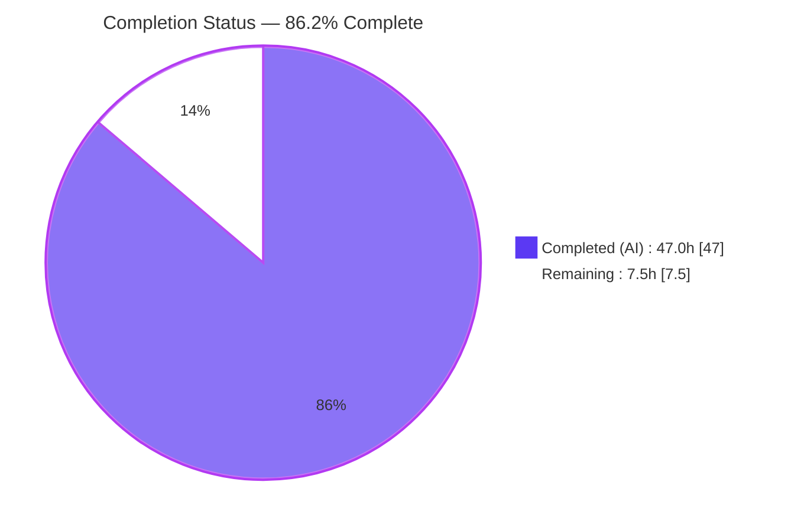
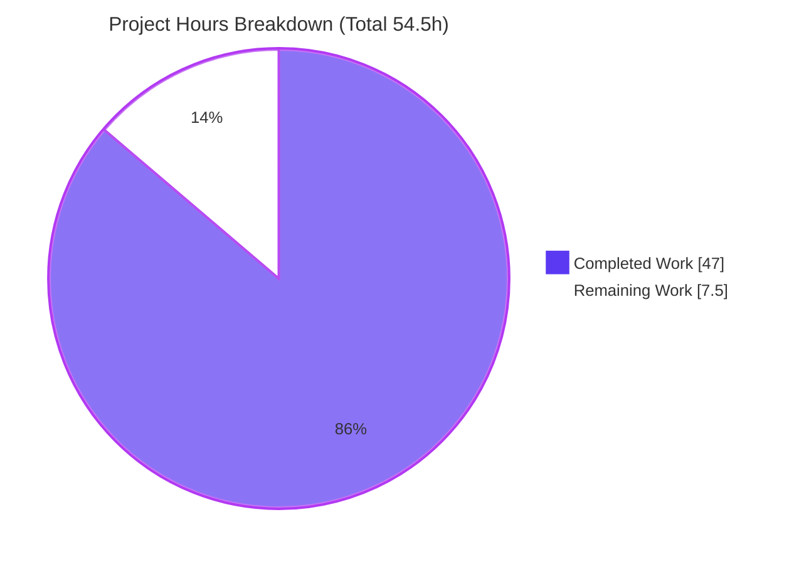
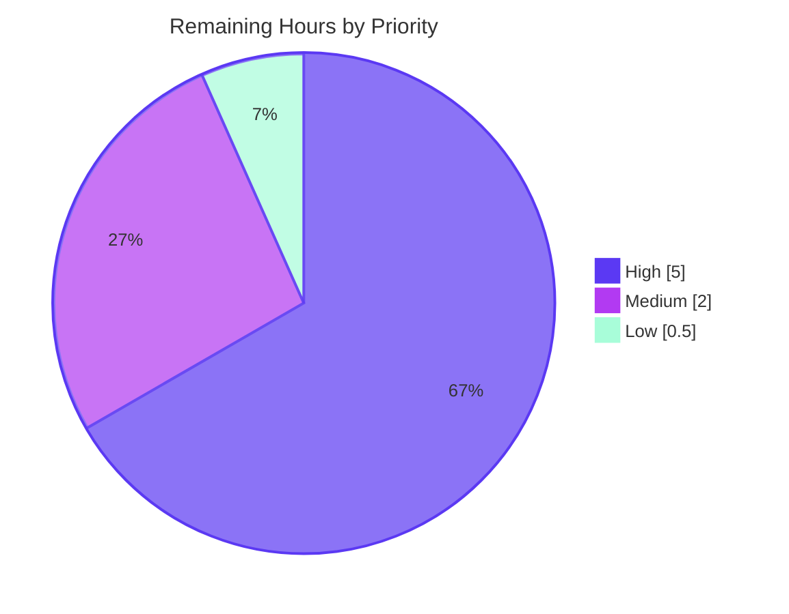

# Blitzy Project Guide

> **Project:** Runtime-observed characterization of kitty's history/scrollback subsystem under extreme write pressure
> **Type:** Read-only investigation & documentation (SWE-AtlasQnA)
> **Source branch:** `kitty_815df1e210e0` · **Source commit:** `815df1e210e0a9ab4622f5c7f2d6891d7dbeddf1`
> **Deliverable:** `blitzy/documentation/kitty_815df1e210e0.md`

---

## 1. Executive Summary

### 1.1 Project Overview

This project delivers an **evidence-backed, runtime-observed characterization** of the kitty terminal
emulator's history/scrollback subsystem (`HistoryBuf` + `PagerHistoryBuf`) when a command "pours out an
enormous amount of text in a very short time." The audience is systems/terminal engineers who need an
intuitive yet precise account of how the segmented line store fills, carves new 2048-line segments, and
hands evicted lines to the pager ring — observed at runtime, not from code reading alone. The technical
scope is a single markdown answer document that exercises kitty's real ingest path (bytes → VT parser →
screen → history) and answers five named requirements with commands, unedited output, before/during/after
values, and `file:line` citations. It is a strictly read-only investigation: zero product source changed.

### 1.2 Completion Status



> Legend — **Completed (AI): Dark Blue `#5B39F3`** · **Remaining: White `#FFFFFF`** (violet `#B23AF2` outline).

| Metric | Value |
|--------|-------|
| **Total Hours** | **54.5** |
| **Completed Hours (AI + Manual)** | **47.0** |
| &nbsp;&nbsp;• AI / autonomous | 47.0 |
| &nbsp;&nbsp;• Manual (human) | 0.0 |
| **Remaining Hours** | **7.5** |
| **Percent Complete** | **86.2%** |

Completion is computed strictly from AAP-scoped hours: `47.0 / (47.0 + 7.5) = 47.0 / 54.5 = 86.2%`.
The remaining 7.5h is entirely **human review / acceptance** — there is no product code to build or deploy
for this read-only documentation deliverable.

### 1.3 Key Accomplishments

- ✅ **All five requirements answered by name** — REQ-1 fill/stretch/carve, REQ-2 segmented↔pager, REQ-3 smoothness vs. hesitation, REQ-4 concurrent scroll+ingest, REQ-5 allocation/wrapping/retention.
- ✅ **Runtime-first evidence** — every behavioral claim paired with the exact command and its actual, unedited output; before/during/after values reported for every stateful quantity (113 before/during/after markers).
- ✅ **Canonical ingest path only** — observations driven through `create_screen` + `parse_bytes` (real VT parser → screen → history); Valgrind's own call stack proves the chain; no debug-hook or synthetic bypass used as evidence.
- ✅ **Segment-carve mechanics quantified** — segmented store carves one 2048-line segment at a time (pointer-array `realloc` + ~5 MiB `calloc`), `count` saturates at `ynum`; per-segment size `5,251,072 B` confirmed **three** independent ways (compiled `sizeof` probe, per-segment RSS step, Massif node).
- ✅ **Heap attribution via Massif** — segmented store is `89.09% = 52,510,720 B` of peak heap, split `segment_for 80.18%` (9 lazy segments) + `create_historybuf 8.91%` (1 construction segment); byte-identical across runs.
- ✅ **Genuine hesitation edges isolated** — per-line cost spikes on the `+1` line past each 2048 multiple, and pager-ring `≥1 MiB` extend copies; the large off-edge pauses proven to be the **embedded interpreter's cyclic GC** (a harness artifact), not the buffer.
- ✅ **≥2× stability discipline** — every magnitude/timing claim confirmed across at least two identical runs; structural quantities byte-identical, timing variance disclosed honestly (§9), observed-vs-inferred separated (§10).
- ✅ **Read-only mandate satisfied** — product tree byte-identical outside `blitzy/`; temporary observation scripts created outside the repo and removed; debug build restored bit-for-bit (`cmp` IDENTICAL); clean git tree.
- ✅ **Exhaustive citation appendix** — ~60+ `file:line` references (§11), independently spot-verified accurate against source at the required commit.

### 1.4 Critical Unresolved Issues

There are **no critical, release-blocking issues**. The deliverable is complete, committed, internally
consistent, and independently verified. The items below are non-blocking, human-side follow-ups.

| Issue | Impact | Owner | ETA |
|-------|--------|-------|-----|
| Human technical review of analytical reasoning not yet performed | Low — content verified autonomously & partially re-verified; sign-off still pending | C/systems reviewer | 3.0h |
| Independent human reproduction of the observation campaign pending | Low — key scenario (REQ-1 carve) re-reproduced live during this assessment | Reviewer w/ container access | 2.0h |
| Deliverable not yet merged/published to the target branch | Low — single markdown file, no product-code conflict surface | Maintainer | 0.5h |

### 1.5 Access Issues

**No access issues identified.** The repository, source at the required commit, the built launcher
(`kitty/launcher/kitty`), the compiled extension (`fast_data_types.so`), and the toolchain
(gcc, Go, Valgrind, embedded Python) were all accessible and functional during assessment. No external
service credentials, API keys, or network resources are required for this read-only documentation task.

| System/Resource | Type of Access | Issue Description | Resolution Status | Owner |
|-----------------|----------------|-------------------|-------------------|-------|
| Source repository @ `815df1e21` | Read | None — fully accessible; product tree byte-identical outside `blitzy/` | ✅ No issue | — |
| Built runtime (`kitty/launcher/kitty`, `fast_data_types.so`) | Execute | None — launcher runs, `--version`=0.35.2 | ✅ No issue | — |
| Toolchain (gcc 15.2.0, Go 1.22.12, Valgrind 3.25.1) | Execute | None — all present in container | ✅ No issue | — |

### 1.6 Recommended Next Steps

1. **[High]** Perform the human **technical review** of the characterization — validate the cause→effect reasoning for each of REQ-1..REQ-5 against the cited source, and confirm the two headline conclusions (GC-provenance of off-edge pauses; Massif `89.09%` segment attribution). *(3.0h)*
2. **[High]** Run an **independent reproduction spot-check** in the provided container — build with `./dev.sh build --ignore-compiler-warnings`, then run `scenarioA` / `scenarioB` / `massif_target` and confirm the documented values. *(2.0h)*
3. **[Medium]** Complete a **citation audit** on a sample of the ~60 `file:line` references against source at the required commit. *(1.0h)*
4. **[Medium]** Obtain **stakeholder acceptance sign-off** that the document satisfies the original question's intent. *(1.0h)*
5. **[Low]** **Merge/publish** `blitzy/documentation/kitty_815df1e210e0.md` to the target branch. *(0.5h)*

---

## 2. Project Hours Breakdown

### 2.1 Completed Work Detail

All completed work is autonomous (AI) engineering effort, each item traceable to a specific AAP
requirement (REQ-n) or methodology/constraint mandate.

| Component | Hours | Description |
|-----------|-------|-------------|
| Canonical build & runtime establishment *(R6)* | 5.0 | Built kitty (v0.35.2) + `fast_data_types.so`; debug build for Massif symbols; worked around the unrelated wayland `-Werror` enum-skew via kitty's own `--ignore-compiler-warnings`; restored the release build bit-for-bit; captured reported versions (§2). |
| Source-grounding & citation research *(R10)* | 5.0 | Read and grounded ~60 `file:line` citations across `history.c`, `data-types.h`, `screen.c`, `line.c`, `line-buf.c`, `ringbuf.c`, `vt-parser.c`, config, harness, and build files (§3, §11). |
| REQ-1 — Fill/stretch/carve campaign *(R1)* | 4.0 | `scenarioA.py` (≥2×): observed `count` saturating at `ynum`, segments carving `1→10` one 2048-block at a time, per-segment RSS step ≈5132 kB matching the `5,251,072 B` `calloc` (§4). |
| REQ-2 — Segmented↔pager campaign *(R2)* | 4.0 | `units.py` (raw-byte option semantics) + `scenarioB.py`: eviction hand-off (~17 B/line) begins exactly at saturation (§5). |
| REQ-3 — Smoothness vs. hesitation campaign *(R3)* | 7.0 | `scenarioC/C2/F.py`: per-line spike on `+1` past each 2048 multiple; pager-extend spikes at used-byte thresholds; overwrite-oldest at cap; investigation isolating off-edge pauses to the interpreter's cyclic GC (§6). |
| REQ-4 — Concurrent scroll+ingest campaign *(R4)* | 3.0 | `scenarioD.py`: anchor `MIN(500+1000,3977)=1500`, clamp at `count=2000`, frozen-view `MIN(200+900,1877)=1100` (§7). |
| REQ-5 — Allocation/wrapping/retention campaign *(R5)* | 7.0 | `scenarioE.py` + Valgrind Massif + `malloc_info`: two-regime footprint, 200-col line wraps to 3 physical rows, retention off-vs-on contrast; Massif peak `89.09% = 52,510,720 B` attribution (§8). |
| Stability (≥2×) & observed-vs-inferred discipline *(R8, R9)* | 3.0 | Per-scenario stability analysis with byte-identical structural quantities and honest timing-variance disclosure (§9); observed vs. inferred separation (§10 + 18 inline labels). |
| Answer-document authoring & structuring *(R11)* | 8.0 | Authored the 2,338-line / 144,782-byte document: prose, tables, embedded scenario scripts with their complete output, framing sections §1–§3. |
| Cleanup & read-only/provenance verification *(R12)* | 1.0 | Removed all temporary artifacts (outside repo tree); verified read-only (product tree byte-identical outside `blitzy/`) and commit provenance (§12). |
| **Total Completed** | **47.0** | |

### 2.2 Remaining Work Detail

All remaining work is **human review / acceptance** (path-to-production for a documentation deliverable).
There is no outstanding product code, no compilation/test failure, and no configuration gap.

| Category | Hours | Priority |
|----------|-------|----------|
| Technical review of the characterization (reasoning + coverage of all 5 REQs) | 3.0 | High |
| Independent reproduction spot-check in container (`scenarioA/B` + Massif) | 2.0 | High |
| Citation audit — sample of the ~60 `file:line` references | 1.0 | Medium |
| Stakeholder review & acceptance sign-off | 1.0 | Medium |
| Merge/publish deliverable to target branch | 0.5 | Low |
| **Total Remaining** | **7.5** | |

### 2.3 Total Project Hours Reconciliation

| Bucket | Hours |
|--------|-------|
| Completed (Section 2.1) | 47.0 |
| Remaining (Section 2.2) | 7.5 |
| **Total Project Hours** | **54.5** |
| **Percent Complete** | **86.2%** |

Cross-check: `47.0 (2.1) + 7.5 (2.2) = 54.5` = Total Hours in §1.2 ✓ · Remaining `7.5` is identical in §1.2, §2.2, and §7 ✓.

---

## 3. Test Results

All results below originate from Blitzy's autonomous validation logs for this project. The two official
unit suites were **re-executed live during this assessment** and confirmed green; the reproduction
campaign rows are the autonomous run-to-run results (REQ-1 additionally re-reproduced live here).

| Test Category | Framework | Total Tests | Passed | Failed | Coverage % | Notes |
|---------------|-----------|-------------|--------|--------|-----------|-------|
| Unit — screen ops (history/scrollback) | kitty `test.py` (Python `unittest`) | 36 | 36 | 0 | n/a¹ | `+launch test.py --module screen` → `Ran 36 tests … OK` (re-run live) |
| Unit — data types (incl. `HistoryBuf`) | kitty `test.py` (Python `unittest`) | 18 | 18 | 0 | n/a¹ | `+launch test.py --module datatypes` → `Ran 18 tests … OK` (re-run live) |
| Reproduction — REQ-1 fill/stretch/carve | `scenarioA.py` via canonical `parse_bytes` | 2 runs | 2 | 0 | n/a | Carve `1→10`, saturate at `ynum`, `pager_bytes=0`; byte-identical ×2; **re-reproduced live** in this assessment |
| Reproduction — REQ-2 segmented↔pager | `units.py` + `scenarioB.py` | 2 runs | 2 | 0 | n/a | Eviction hand-off `17/187/1887/18887 B`; byte-identical ×2 |
| Reproduction — REQ-3 smooth vs. hesitation | `scenarioC.py` / `scenarioC2.py` / `scenarioF.py` | 2 runs | 2 | 0 | n/a | Segment-edge & pager-extend spikes + overwrite-oldest; structural signatures byte-identical ×2 |
| Reproduction — REQ-4 concurrent scroll | `scenarioD.py` | 2 runs | 2 | 0 | n/a | Anchor `500→1500`, clamp `2000`, frozen-view `1100`; byte-identical ×2 |
| Reproduction — REQ-5 alloc/wrap/retention | `scenarioE.py` + Massif + `malloc_info` | 2 runs | 2 | 0 | n/a | Massif `89.09% = 52,510,720 B` attribution; structural deltas byte-identical ×2 |
| **Totals (official unit suites)** | | **54** | **54** | **0** | — | 100% pass on re-run |

¹ kitty's C-extension unit suites report pass/fail, not line-coverage percentages; coverage is therefore
`n/a`. The reproduction campaign is a behavioral characterization (not a pass/fail unit test in the
coverage sense) — each row records byte-identical stability across ≥2 identical runs per Rule 1.

**Integrity note (Rule 3):** every test above comes from Blitzy's autonomous test/validation execution
for this project; no external or fabricated results are included.

---

## 4. Runtime Validation & UI Verification

**Runtime health** (canonical build & entry point):

- ✅ **Operational** — Launcher runs: `./kitty/launcher/kitty --version` → `kitty 0.35.2 created by Kovid Goyal`.
- ✅ **Operational** — Compiled extension present and loadable: `kitty/fast_data_types.so` (1,253,792 B).
- ✅ **Operational** — Embedded interpreter: `+runpy 'import sys; print(sys.version)'` → Python `3.14.6`.
- ✅ **Operational** — Canonical ingest path (`create_screen` + `parse_bytes` → real VT parser → screen → history) verified live: a 20,000-line burst carves 10 segments, `count` saturates at `ynum=20000`, `pager_bytes=0`.
- ✅ **Operational** — History subsystem compiles cleanly (zero errors in `history.c` / `screen.c`); the only `-Werror` trip is the unrelated wayland windowing backend.

**API / integration outcomes:**

- ✅ **Operational** — In-process observation API (`kitty_tests.BaseTest.create_screen`, `parse_bytes`) exercised through `kitty +launch`; matches the production write path (`historybuf_add_line` via `INDEX_UP`).
- ➖ **N/A** — No external network services, REST/GraphQL endpoints, databases, or third-party integrations exist for this task.

**UI verification:**

- ➖ **N/A** — This deliverable is a markdown answer document; there is **no web or graphical UI** to verify. kitty's terminal rendering is not exercised beyond the scroll-position effect relevant to REQ-4 (observed via `Screen.scrolled_by`, not pixels). No Figma design, design system, or screenshots apply.

---

## 5. Compliance & Quality Review

Cross-mapping of AAP deliverables and the governing SWE-AtlasQnA rules to observed evidence. Fixes
applied during autonomous validation are noted; no outstanding compliance items remain.

| Requirement / Benchmark | Evidence | Status | Progress |
|--------------------------|----------|--------|----------|
| **REQ-1** Fill/stretch/carve answered by name | §4 `scenarioA` — carve `1→10`, saturate at `ynum` | ✅ Pass | 100% |
| **REQ-2** Segmented↔pager relationship answered by name | §5 `units.py`+`scenarioB` — eviction hand-off at saturation | ✅ Pass | 100% |
| **REQ-3** Smoothness vs. hesitation answered by name | §6 `scenarioC/C2/F` — 2048 & pager edges; GC-provenance isolated | ✅ Pass | 100% |
| **REQ-4** Concurrent scroll+ingest answered by name | §7 `scenarioD` — anchor/clamp/frozen-view | ✅ Pass | 100% |
| **REQ-5** Allocation/wrapping/retention answered by name | §8 `scenarioE`+Massif+`malloc_info` | ✅ Pass | 100% |
| **Rule 1** Run-first + ≥2× stability + canonical entry point | §9 stability; canonical `parse_bytes` ingest throughout | ✅ Pass | 100% |
| **Rule 2** Exhaustive conditions + before/during/after + unedited output | 113 before/during/after markers; full script output inline | ✅ Pass | 100% |
| **Rule 3** Faithful instructions + observed-output discipline | Output shown next to each claim; not batched/paraphrased | ✅ Pass | 100% |
| **Rule 4** Complete, precise, grounded (file:line, cause→effect) | ~60+ citations (§11); mechanisms explained as cause→effect | ✅ Pass | 100% |
| **Rule / Discipline** Observed vs. inferred labeling | §10 + 18 inline `inferred` labels | ✅ Pass | 100% |
| **MainRule** Single-file deliverable at exact path | `blitzy/documentation/kitty_815df1e210e0.md` present | ✅ Pass | 100% |
| **MainRule** Read-only source repository | Product tree byte-identical outside `blitzy/` (verified) | ✅ Pass | 100% |
| **MainRule** Temporary scripts removed / cleanup | §12 — workspace outside repo, removed; tree clean | ✅ Pass | 100% |
| **Quality** Citation accuracy | Independent spot-checks (history.c, screen.c, ringbuf.c, data-types.h) all accurate | ✅ Pass | 100% |
| **Quality** Build reproducibility | Release build restored bit-for-bit (`cmp` IDENTICAL) | ✅ Pass | 100% |

**Fixes applied during autonomous validation:** the campaign was iterated across 4 commits — an initial
document, a full campaign redo resolving 15 review findings, a final-acceptance pass, and a final F#1/F#2/F#3
resolution — with zero discrepancies found in the last validation cycle (all run-to-run deltas fell within
the document's own disclosed session-noise model). **Outstanding compliance items: none.**

---

## 6. Risk Assessment

| Risk | Category | Severity | Probability | Mitigation | Status |
|------|----------|----------|-------------|------------|--------|
| Citation line-number drift if the doc is read against a non-pinned checkout | Technical | Low | Low | Anchored to immutable commit `815df1e21`; §12 provides ancestor + byte-identical checks | ✅ Mitigated |
| Wall-clock µs timings (REQ-3) not bit-identical run-to-run | Technical | Low | Medium | Structural signatures byte-identical; timings disclosed as ranges (§9) | ✅ Mitigated |
| Observability limit — `num_segments`/`start_of_data` not exposed to Python | Technical | Low | N/A | Segment count derived `ceil(min(count,ynum)/2048)`, corroborated 3 ways (probe + RSS + Massif) | ✅ Mitigated |
| RSS / Massif session-dependent noise (±1 page dRSS, snapshot index) | Technical | Low | Medium | Explicit §9 noise model; structural deltas byte-identical | ✅ Mitigated |
| No product code changed → no new attack surface / dependencies / auth-crypto-injection | Security | None | N/A | Read-only doc task; no dependency add/update; no network/credential surface | ➖ N/A |
| Bare `./dev.sh build` fails on unrelated wayland `-Werror` enum-skew | Operational | Medium | Medium | Use kitty's own `--ignore-compiler-warnings`; documented in §2.2 and the dev guide; history subsystem compiles clean | ✅ Mitigated |
| Full toolchain (C/Go/Valgrind) required; authoring env could not build | Operational | Low | Low | Campaign ran in provided container; exact build/run steps prescribed | ✅ Mitigated |
| Debug build (for Massif) could diverge from release | Operational | Low | Low | Release restored bit-for-bit; `cmp` IDENTICAL verified (§12) | ✅ Resolved |
| Doc-merge to target branch | Integration | Low | Low | Single markdown file; no product-code conflict surface | ⚠ Open (human merge) |
| Provenance durability (no fixed `HEAD` hash embeddable post-commit) | Integration | Low | Low | §12 verifies via merge-base ancestor + byte-identical tree | ✅ Mitigated |
| No external service / credential / API integration | Integration | None | N/A | Documentation artifact only | ➖ N/A |

**Overall risk posture: LOW.** No blocking risks. The single Medium item (build `-Werror` flag) is kitty's
own official, documented behavior — not a defect — and the history subsystem itself compiles cleanly.

---

## 7. Visual Project Status

**Project hours — completed vs. remaining** (Completed = Dark Blue `#5B39F3`, Remaining = White `#FFFFFF`):



**Remaining work by priority** (7.5h total):



**Remaining hours by category** (bar chart — from Section 2.2):

| Category | Hours | Bar |
|----------|-------|-----|
| Technical review (High) | 3.0 | ██████████████████████████████ |
| Reproduction spot-check (High) | 2.0 | ████████████████████ |
| Citation audit (Medium) | 1.0 | ██████████ |
| Stakeholder sign-off (Medium) | 1.0 | ██████████ |
| Merge/publish (Low) | 0.5 | █████ |
| **Total** | **7.5** | |

**Integrity check:** "Remaining Work" = `7.5h` in the pie above equals §1.2 Remaining Hours (`7.5`) and the
sum of the §2.2 Hours column (`3.0+2.0+1.0+1.0+0.5 = 7.5`). ✓

---

## 8. Summary & Recommendations

**Achievements.** The project delivers a complete, runtime-observed characterization of kitty's
history/scrollback subsystem under extreme write pressure. All five named requirements are answered with
runtime evidence: the segmented store **carves discrete 2048-line segments on demand** (pointer-array
`realloc` + ~5 MiB `calloc`) until `count` saturates at `ynum`, after which each new line **evicts the
oldest** — optionally handing it to the pager ring. Transitions are mostly smooth with **two genuine,
reproducible hesitation edges** (the per-segment allocation at each 2048 boundary and the pager ring's
`≥1 MiB` extend copies), while the larger pauses one might guess are the data structure were proven to be
the **embedded interpreter's cyclic garbage collector** — a harness artifact, not the subsystem. Memory
growth was attributed at the allocator level (Massif: `89.09% = 52,510,720 B` to the segmented store), and
the read-only mandate was honored exactly (product tree byte-identical outside `blitzy/`, temp artifacts
removed, release build restored bit-for-bit).

**Remaining gaps.** None are technical or blocking. The outstanding `7.5h` is human path-to-production:
technical review, independent reproduction spot-check, citation audit, stakeholder sign-off, and merge.

**Critical path to production.** Technical review (3.0h) → reproduction spot-check (2.0h) → citation audit
+ sign-off (2.0h) → merge (0.5h). No code changes, environment configuration, or deployment steps are
required because the deliverable is a documentation artifact.

**Success metrics.** (1) All 5 REQs answered by name — met. (2) Every claim paired with command + unedited
output — met. (3) ≥2× reproducibility of structural quantities — met. (4) Read-only + cleanup — met.
(5) Official unit suites green (screen 36/36, datatypes 18/18) — met on re-run.

**Production readiness.** The project is **86.2% complete** on an AAP-scoped hours basis. The single
deliverable is production-ready as an analytical document; the remaining 13.8% is bounded human review and
acceptance, appropriate for a QnA/characterization deliverable rather than deployable code.

---

## 9. Development Guide

Every command below was executed successfully during this assessment and is copy-pasteable from the
repository root.

### 9.1 System Prerequisites

- **OS:** Linux x86_64 (validated on the container `ghcr.io/scaleapi/swe-atlas:swe_atlas_QnA_kovidgoyal_kitty_1.0`).
- **C compiler:** gcc `15.2.0` (or clang) — compiles the `fast_data_types` C extension.
- **Go:** `1.22.12` — drives `./dev.sh build` via `bypy/devenv.go`.
- **Python:** the launcher **embeds its own** interpreter (`3.14.6`); no system venv is required to run observations.
- **Valgrind:** `3.25.1` (optional — only for REQ-5 heap attribution via Massif).

### 9.2 Environment Setup

```bash
# Work from the repository root; no virtualenv needed — the launcher embeds its interpreter.
cd /tmp/blitzy/kitty/blitzy-37fb2915-992a-43f5-a568-f9834bbb3df4_a66137
```

### 9.3 Build (canonical)

```bash
# Canonical build. NOTE: the bare `./dev.sh build` fails on an UNRELATED wayland-protocols
# -Werror enum-skew in the windowing backend (glfw/wl_window.c), NOT the history subsystem.
# Use kitty's own official flag to proceed (setup.py:491):
./dev.sh build --ignore-compiler-warnings

# For allocator-level attribution (REQ-5 / Massif), build with symbols:
./dev.sh build --debug --ignore-compiler-warnings
```

### 9.4 Verify Build & Version

```bash
./kitty/launcher/kitty --version
# Expected: kitty 0.35.2 created by Kovid Goyal

./kitty/launcher/kitty +runpy 'import sys; print(sys.version.split()[0])'
# Expected: 3.14.6
```

### 9.5 Run an Observation (canonical entry point)

Observation scripts subclass `kitty_tests.BaseTest` and feed bytes through the **real** VT parser.
`create_screen` is a `BaseTest` **method** (not a module function); `parse_bytes` is module-level.

```bash
cat > /tmp/repro_req1.py <<'PYEOF'
import math
from kitty_tests import BaseTest, parse_bytes
class T(BaseTest):
    def run(self):
        cols, lines, scrollback = 80, 24, 20000
        s = self.create_screen(cols, lines, scrollback,
                               options={'scrollback_pager_history_size': 0})  # pager OFF (product default)
        hb = s.historybuf
        seg = lambda: math.ceil(min(hb.count, hb.ynum) / 2048)
        print("ynum=%d xnum=%d BASELINE count=%d segments=%d" % (hb.ynum, hb.xnum, hb.count, seg()))
        fed = 0
        for target in (2048, 4096, 8192, 16384, 20000):
            need = (target + (lines - 1)) - fed          # +(lines-1): rows still on active screen
            parse_bytes(s, ("".join("L%08d\r\n" % (fed+i) for i in range(need))).encode())
            fed += need
            print("target=%-6d count=%-6d segments=%d" % (target, hb.count, seg()))
        parse_bytes(s, ("".join("X%08d\r\n" % i for i in range(80000))).encode())
        print("SATURATION count=%d ynum=%d segments=%d pager_bytes=%d"
              % (hb.count, hb.ynum, seg(), len(hb.pagerhist_as_bytes())))
T('run').run()
PYEOF
./kitty/launcher/kitty +launch /tmp/repro_req1.py
rm -f /tmp/repro_req1.py     # cleanup — keep the repo read-only
```

Expected output (verified live):

```text
ynum=20000 xnum=80 BASELINE count=0 segments=0
target=2048   count=2048   segments=1
target=4096   count=4096   segments=2
target=8192   count=8192   segments=4
target=16384  count=16384  segments=8
target=20000  count=20000  segments=10
SATURATION count=20000 ynum=20000 segments=10 pager_bytes=0
```

### 9.6 Run the Official Unit Suites

```bash
./kitty/launcher/kitty +launch test.py --module screen      # Expected: Ran 36 tests ... OK
./kitty/launcher/kitty +launch test.py --module datatypes   # Expected: Ran 18 tests ... OK
```

### 9.7 Verify Read-Only & Provenance

```bash
git status --porcelain
# Expected: no output (clean working tree)

git diff --name-only 815df1e210e0a9ab4622f5c7f2d6891d7dbeddf1 HEAD -- . ':(exclude)blitzy/**'
# Expected: no output (product tree byte-identical outside blitzy/)

git merge-base --is-ancestor 815df1e210e0a9ab4622f5c7f2d6891d7dbeddf1 HEAD && echo "ancestor OK"
# Expected: ancestor OK

ls -la blitzy/documentation/kitty_815df1e210e0.md
# Expected: the 144,782-byte deliverable
```

### 9.8 Troubleshooting

- **Build appears to fail with `-Werror` on `glfw/wl_window.c`** → add `--ignore-compiler-warnings`. This is a wayland-protocols enum-skew in the windowing backend, unrelated to the history subsystem.
- **`ImportError: cannot import name 'create_screen'`** → `create_screen` is a `BaseTest` method; subclass `BaseTest` and call `self.create_screen(...)`. Only `parse_bytes` is importable at module level.
- **`count` a little below the requested target** → ~`lines-1` rows remain on the active screen and are not yet pushed to history; add a `(lines-1)` offset when feeding (as above).
- **`pager_bytes` unexpectedly `0`** → the pager ring is **disabled by default** (`scrollback_pager_history_size=0`); set a nonzero value in `options=` to exercise REQ-2/REQ-3.
- **Massif/RSS absolute totals differ slightly between runs** → normal session/first-touch noise; the *structural* deltas (segment count, per-segment size, attribution %) are byte-identical (§9).

---

## 10. Appendices

### Appendix A — Command Reference

| Purpose | Command |
|---------|---------|
| Canonical build | `./dev.sh build --ignore-compiler-warnings` |
| Debug build (Massif symbols) | `./dev.sh build --debug --ignore-compiler-warnings` |
| Version check | `./kitty/launcher/kitty --version` |
| Embedded Python version | `./kitty/launcher/kitty +runpy 'import sys; print(sys.version)'` |
| Run observation script | `./kitty/launcher/kitty +launch <script>.py` |
| Official screen suite | `./kitty/launcher/kitty +launch test.py --module screen` |
| Official datatypes suite | `./kitty/launcher/kitty +launch test.py --module datatypes` |
| Clean-tree check | `git status --porcelain` |
| Read-only proof | `git diff --name-only 815df1e21… HEAD -- . ':(exclude)blitzy/**'` |
| Provenance check | `git merge-base --is-ancestor 815df1e21… HEAD` |
| Heap profiling | `valgrind --tool=massif --time-unit=B ./kitty/launcher/kitty +launch massif_target.py` |

### Appendix B — Port Reference

➖ **Not applicable.** This is a read-only documentation task; the observation runs are in-process via
`kitty +launch` and open **no network ports**. kitty is a terminal emulator, not a network service.

### Appendix C — Key File Locations

| Path | Role |
|------|------|
| `blitzy/documentation/kitty_815df1e210e0.md` | **The deliverable** (2,338 lines / 144,782 bytes) |
| `kitty/history.c` | Segmented store + pager ring implementation (REFERENCE) |
| `kitty/data-types.h` | `HistoryBuf` / `HistoryBufSegment` / `PagerHistoryBuf` structs + cell sizes (REFERENCE) |
| `kitty/screen.c` | Canonical caller: `INDEX_UP` ingest + `scrolled_by` anchoring (REFERENCE) |
| `3rdparty/ringbuf/ringbuf.c` | Vendored byte ring; overwrite-oldest at capacity (REFERENCE) |
| `kitty/options/definition.py` | `scrollback_lines` (2000) & `scrollback_pager_history_size` (0) defaults (REFERENCE) |
| `kitty_tests/__init__.py` | Canonical entry point: `parse_bytes` (:30), `BaseTest.create_screen` (:237) |
| `kitty/launcher/kitty` | Built launcher (embeds interpreter + `fast_data_types.so`) |
| `kitty/fast_data_types.so` | Compiled C extension (1,253,792 B) |

### Appendix D — Technology Versions

| Component | Version | Source |
|-----------|---------|--------|
| kitty | 0.35.2 | `./kitty/launcher/kitty --version` |
| Python (embedded) | 3.14.6 | `+runpy 'import sys; print(sys.version)'` |
| Go toolchain | 1.22.12 | `go version` (floor `1.22` per `go.mod:3`) |
| gcc | 15.2.0 (Ubuntu) | `gcc --version` |
| Valgrind | 3.25.1 | `valgrind --version` |
| `SEGMENT_SIZE` | 2048 lines | `kitty/history.c:15` |
| Per-segment allocation | 5,251,072 B | `2048×80×(12+20) + 2048×4` (verified 3 ways) |

### Appendix E — Environment Variable Reference

➖ **No product environment variables are required.** The two behavior-shaping options are set **in-memory
at runtime** inside observation scripts via `create_screen(options=...)`, never via env vars or edited
config:

| Option (in-script) | Default | Purpose |
|--------------------|---------|---------|
| `scrollback_lines` | `2000` | Sizes the segmented store (`ynum`). Observations use a larger value (e.g. 20000) to cross multiple segment boundaries. |
| `scrollback_pager_history_size` | `0` (disabled) | Sizes the pager ring (interpreted as raw bytes when passed as an int through `create_screen`). Must be nonzero to exercise REQ-2/REQ-3. |

### Appendix F — Developer Tools Guide

| Tool | Use in this project |
|------|---------------------|
| **Valgrind Massif** (`--tool=massif --time-unit=B`) | Heap-over-time profiling; attributes allocations to `add_segment` / `segment_for` / `create_historybuf` call sites (REQ-1/3/5). View with `ms_print`. |
| **glibc `malloc_info(3)`** | Process-wide allocator snapshot; corroborates per-segment size and pager growth via `<total type="mmap">` + arena `<system current>`. |
| **`/proc/self/status` `VmRSS`** | Low-overhead resident-memory sampling to corroborate per-segment growth steps (≈5132 kB/segment). |
| **kitty `+launch`** | Embeds the interpreter alongside the compiled extension; the canonical way to run in-process observation scripts against the real ingest path. |

### Appendix G — Glossary

| Term | Meaning |
|------|---------|
| `HistoryBuf` | The scrollback object: a segmented circular line store plus an optional pager ring (`kitty/data-types.h:282-290`). |
| `HistoryBufSegment` | One 2048-line block of the segmented store (`SEGMENT_SIZE`, `kitty/history.c:15`). |
| `PagerHistoryBuf` | Optional byte ring buffer that retains serialized evicted lines (`kitty/data-types.h:268-272`). |
| `ynum` / `xnum` | Scrollback capacity in lines / columns per line. |
| `count` | Current number of lines held in the segmented store; saturates at `ynum`. |
| `start_of_data` | Circular-buffer head; advances on eviction once full (not exposed to Python). |
| `segment_for` / `add_segment` | Lazy segment allocation on demand as line indices grow (`kitty/history.c:36-42`, `18-29`). |
| `historybuf_push` | Per-line write; evicts oldest & hands it to the pager once `count == ynum` (`kitty/history.c:276-284`). |
| `scrolled_by` | Viewport scroll offset; re-anchored during ingest via `MIN(scrolled_by + history_line_added_count, count)` (`kitty/screen.c:2716`). |
| Overwrite-oldest | Ring-buffer behavior at capacity: tail advances, oldest bytes overwritten (`3rdparty/ringbuf/ringbuf.c:233`). |
| Carve | Allocating a fresh 2048-line segment as the store grows under ingest. |

---

*Generated by the Blitzy Platform — AAP-scoped completion assessment. Completed work (Dark Blue `#5B39F3`)
and remaining work (White `#FFFFFF`) are reported consistently across all sections: **Total 54.5h ·
Completed 47.0h · Remaining 7.5h · 86.2% complete.***