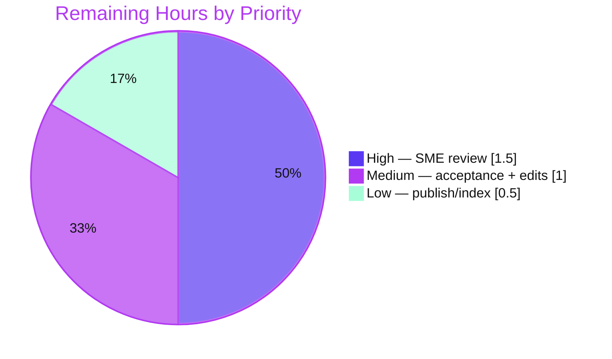

# Blitzy Project Guide — kitty Runtime-Grounded Architecture Q&A

> **Subject:** kitty terminal emulator @ commit `815df1e210e0a9ab4622f5c7f2d6891d7dbeddf1` (source branch `kitty_815df1e210e0`)
> **Deliverable:** `blitzy/documentation/kitty_815df1e210e0.md` — a single, evidence-grounded technical explainer
> **Brand legend:** <span style="color:#5B39F3">■</span> Completed / AI Work = Dark Blue `#5B39F3` · <span style="color:#B23AF2">■</span> White `#FFFFFF` = Remaining / Not Completed

---

## Section 1 — Executive Summary

### 1.1 Project Overview

This project authors one evidence-grounded Markdown document answering an onboarding engineer's four interlocking questions about the **kitty** terminal emulator's architecture, with every answer derived from **observing the code as it runs** rather than reading alone. It explains where the runtime heavy lifting occurs (native C + GPU, not Python), what the thirteen GLSL shaders do and how central they are, what single piece is missing when the entry point fails (`kitty.fast_data_types`), and whether the kittens are truly independent (they are not). The target users are engineers onboarding to kitty. Technical scope spans the C native core, Python layer, Go tooling, GLSL pipeline, and kittens — all read-only; only the documentation artifact is created.

### 1.2 Completion Status


| Metric | Hours |
|---|---|
| **Total Hours** | **30.0** |
| Completed Hours (AI) | 27.0 |
| Completed Hours (Manual) | 0.0 |
| **Completed Hours (AI + Manual)** | **27.0** |
| **Remaining Hours** | **3.0** |
| **Percent Complete** | **90.0%** |

> **Calculation (PA1, AAP-scoped):** Completion % = Completed ÷ (Completed + Remaining) × 100 = 27.0 ÷ 30.0 × 100 = **90.0%**. All AAP-specified work (deliverable + OBJ-1..OBJ-4 + methodology + read-only) is complete; the 3.0 remaining hours are human path-to-production only.

### 1.3 Key Accomplishments

- ✅ **Single deliverable created and committed** — `blitzy/documentation/kitty_815df1e210e0.md` (729 lines), correctly named for the source branch and placed outside the kitty source tree.
- ✅ **OBJ-1 answered** — measured the source footprint three ways (top-level / recursive / git-tracked, with built-tree reconciliation) and traced the native launcher booting embedded CPython which loads the C core.
- ✅ **OBJ-2 answered** — enumerated all **13** `kitty/*.glsl` files, mapped every one to a rendering role, and showed build-time bundling (`setup.py:1040`) and runtime compile/link (`shaders.c:1160`).
- ✅ **OBJ-3 answered** — reproduced the `ModuleNotFoundError: No module named 'kitty.fast_data_types'` at `borders.py:7` verbatim, with the full import chain and a before→after (unbuilt→built) transition.
- ✅ **OBJ-4 answered** — proved the kittens are **not** independent via two distinct standalone paths reaching the same native bridge.
- ✅ **Run-first methodology honored** — kitty was built (`python3 setup.py`, EXIT=0) and run; every claim carries its exact command, complete output, and a `file:line` reference; inferred items are explicitly labeled.
- ✅ **Read-only guarantee intact** — the kitty source tree is byte-for-byte unchanged; only the documentation file was added; build artifacts remain gitignored.
- ✅ **100% claim reproduction** — all 41 `file:line` references verified byte-accurate; all footprint counts, failure tracebacks (byte-for-byte), and built-state successes reproduced.

### 1.4 Critical Unresolved Issues

| Issue | Impact | Owner | ETA |
|---|---|---|---|
| _None_ — no unresolved issues block release or validation | The deliverable is complete, self-validated, and committed; the build succeeds and 100% of documented claims reproduce | — | — |

> There are **no** unresolved compilation errors, failing tests, or missing functionality. The only remaining work is human review/acceptance (see Section 1.6 and Section 2.2).

### 1.5 Access Issues

| System/Resource | Type of Access | Issue Description | Resolution Status | Owner |
|---|---|---|---|---|
| — | — | **No access issues identified.** All build prerequisites (Python 3.13.7, Go 1.22.12, gcc 15.2.0, pkg-config 1.8.1, system libraries) were preinstalled; the repository, build, and runtime were fully accessible. | ✅ N/A | — |

### 1.6 Recommended Next Steps

1. **[High]** Have a kitty/systems SME technically review the document — re-run a sample of the documented commands and confirm the four answers, reproduced outputs, and `file:line` references are accurate and complete.
2. **[Medium]** Have the target onboarding engineer read the document end-to-end to confirm it answers their four questions clearly; apply any minor clarity/formatting edits surfaced.
3. **[Low]** Publish/link the document into the team knowledge base, onboarding index, or docs landing page so it is discoverable (addresses the sole low-severity operational risk).

---

## Section 2 — Project Hours Breakdown

### 2.1 Completed Work Detail

| Component | Hours | Description |
|---|---|---|
| Build environment & kitty compilation (for observation) | 3.0 | Put Go on PATH; build the C extension + Go `kitten` binary via `python3 setup.py --ignore-compiler-warnings` (EXIT=0); resolve the host `-Werror`/wayland wrinkle; capture the version banner. Traces to AAP §0.3.1 "build in default configuration". |
| OBJ-1 — heavy lifting / performance source | 5.0 | 3-way source footprint measurement (top-level / recursive / git-tracked) + built-tree reconciliation of generated files; trace of native launcher (`launcher/main.c:147-161`) booting embedded CPython → loading `fast_data_types`; VCS-rev invariant; §1 write-up. |
| OBJ-2 — GLSL role & centrality | 5.0 | Enumerate all 13 `kitty/*.glsl` (`wc -l`); shader-to-role mapping for every file; build-time bundling (`setup.py:1040`); runtime compile/link (`shaders.py` + `shaders.c:1160`); §2 write-up. |
| OBJ-3 — missing piece at entry point | 4.5 | Reproduce the unbuilt `ModuleNotFoundError` verbatim (both bare run and `--version`); quote the import-graph chain line-by-line; `data-types.c:469` bridge definition; before→after build transition; §3 write-up. |
| OBJ-4 — kitten (non-)independence | 3.5 | Exercise two standalone kitten paths (`+kitten` dispatcher and direct module import); capture both tracebacks; shared-TUI dependency analysis; before→after; §4 write-up. |
| Document assembly | 3.0 | Environment header, four-section structure, coverage checklist, and read-only verification section (729 lines / 6,477 words). |
| QA & validation iterations | 3.0 | Six commits addressing code-review and QA findings (reproducible VCS invariant, complete build output, exact shader-include directive, path-anchor fix, `monotonic()` labeling); byte-accurate re-verification of all 41 `file:line` references and determinism. |
| **Total Completed** | **27.0** | **Matches Completed Hours in Section 1.2** |

### 2.2 Remaining Work Detail

| Category | Hours | Priority |
|---|---|---|
| Human SME technical review — re-run a sample of documented commands; verify the four answers and all 41 `file:line` references | 1.5 | High |
| Onboarding-engineer acceptance read + minor clarity/formatting edits | 1.0 | Medium |
| Publish/link the document into knowledge base or docs index (discoverability) | 0.5 | Low |
| **Total Remaining** | **3.0** | **Matches Remaining Hours in Section 1.2 and Section 7** |

> **Note:** No "immediate fix" tasks exist (no compilation errors, no failing tests, no missing functionality) because the AAP deliverable is complete and self-validated. The highest-priority remaining action is human review, not a fix.

### 2.3 Hours Reconciliation

| Check | Result |
|---|---|
| Section 2.1 total (Completed) | 27.0 |
| Section 2.2 total (Remaining) | 3.0 |
| Section 2.1 + Section 2.2 | **30.0 = Total Hours (Section 1.2)** ✅ |
| Completion % = 27.0 ÷ 30.0 | **90.0%** ✅ |

---

## Section 3 — Test Results

For a documentation deliverable, "tests" are **claim-reproduction and evidence-verification checks** executed by Blitzy's autonomous validation systems against live runtime behavior. All checks below originate from Blitzy's autonomous validation logs for this project (Final Validator + this assessment's independent re-verification). kitty's own unit-test suite (`kitty_tests/`) is **explicitly out of AAP scope (§0.5.2)** and was not run.

| Test Category | Framework | Total Tests | Passed | Failed | Coverage % | Notes |
|---|---|---|---|---|---|---|
| Source-footprint claim reproduction | shell (`wc`/`ls`/`find`/`git ls-files`) | 30 | 30 | 0 | 100% of §1.1 metrics | Line/file counts re-run and matched exactly (GLSL 13/696; `.c` 49/35,155; `.h`, `.py`, Go tracked; built-tree reconciliation). |
| `file:line` reference verification | shell (`sed`/`grep`) | 41 | 41 | 0 | 100% of doc refs | Every anchor verified byte-accurate (e.g., `data-types.c:469`, `borders.py:7`, `setup.py:1040`, `shaders.c:1160`, `tui/handler.py:10`, `pyproject.toml:2`, `go.mod:3`). |
| Entry-point failure reproduction (OBJ-3/4) | shell (real `python3` entry points) | 3 | 3 | 0 | All 3 documented paths | `python3 __main__.py`, `+kitten unicode_input`, and direct module import each reproduce `ModuleNotFoundError` byte-for-byte. |
| Determinism checks | shell (repeat runs) | 2 | 2 | 0 | — | Two identical runs of the failing command produced byte-identical tracebacks. |
| Build validation | `python3 setup.py --ignore-compiler-warnings` | 1 | 1 | 0 | — | BUILD_EXIT=0; regenerates `kitty/fast_data_types.so`. |
| Runtime & version validation | kitty launcher + `python3` | 4 | 4 | 0 | — | `--version` via both entry points → `kitty 0.35.2 created by Kovid Goyal`; `monotonic()` callable; `import kittens.unicode_input.main` succeeds. |
| **Total** | — | **81** | **81** | **0** | **100%** | **All documentation claims validated against live output** |

---

## Section 4 — Runtime Validation & UI Verification

**Runtime health (built state):**
- ✅ **Build** — `python3 setup.py --ignore-compiler-warnings` completes with EXIT=0.
- ✅ **Version banner** — `./kitty/launcher/kitty --version` and `python3 __main__.py --version` both emit `kitty 0.35.2 created by Kovid Goyal` (EXIT=0).
- ✅ **Native bridge** — `from kitty.fast_data_types import monotonic; monotonic()` returns a working float (value varies run-to-run, as documented).
- ✅ **Kitten runtime** — `import kittens.unicode_input.main` succeeds after the build (EXIT=0).

**Documented failure states (unbuilt) — reproduce as designed:**
- ✅ `python3 __main__.py` → `ModuleNotFoundError: No module named 'kitty.fast_data_types'` at `borders.py:7`.
- ✅ `python3 __main__.py +kitten unicode_input` → same error at `utils.py:45`.
- ✅ `python3 -c "import kittens.unicode_input.main"` → same error at `tui/handler.py:10`.

**API integration:**
- ✅ **N/A** — no external service/API integration is in scope; the document introduces no network calls, credentials, or third-party endpoints.

**UI verification:**
- ⚠ **Not applicable** — the deliverable is a Markdown document, and kitty is a GUI terminal requiring a display server not exercised for a documentation task. No web/UI surface is in scope per the AAP (§0.3.5). The document's *rendered Markdown* (headings, tables, fenced code blocks) is well-formed.

---

## Section 5 — Compliance & Quality Review

Cross-mapping AAP deliverables and the governing rule set (**SWE-AtlasQnA-Repo**) to Blitzy's quality/compliance benchmarks. Fixes applied during autonomous validation are noted.

| Benchmark / Rule | Requirement | Status | Progress | Notes / Fixes Applied |
|---|---|---|---|---|
| Deliverable rule (§0.7.1) | One Markdown file named `<source_branch>.md` in `blitzy/documentation/` | ✅ Pass | 100% | `blitzy/documentation/kitty_815df1e210e0.md` created & committed. |
| OBJ-1 coverage | Language doing heavy lifting + performance source | ✅ Pass | 100% | Measured footprint + launcher/CPython wiring + honest labeling. |
| OBJ-2 coverage | Role & centrality of all 13 GLSL files | ✅ Pass | 100% | Every file named; build + runtime pipeline shown. Fix: helper-include grounding tightened (commit `f2786505b`); exact `#pragma kitty_include_shader` directive added (`bf578330d`). |
| OBJ-3 coverage | Missing piece at entry point + Python↔native wiring | ✅ Pass | 100% | Verbatim traceback; import-graph chain; `--version` nuance. Fix: nonexistent path anchor in §2.3 corrected (`7a6eefdb7`). |
| OBJ-4 coverage | Kitten independence, ≥2 entry points | ✅ Pass | 100% | Two distinct standalone paths; shared-TUI analysis. Fix: `monotonic()` labeled run-to-run varying (`aba3b95c1`). |
| Investigate-by-running (§0.7.2) | Build & run first; write from observation | ✅ Pass | 100% | kitty built & run; before→after states captured. |
| Evidence & output (§0.7.3) | Complete unedited output + command + `file:line` per claim | ✅ Pass | 100% | All 41 refs byte-accurate; full tracebacks, no truncation. |
| Coverage & grounding (§0.7.4) | Every named item; lead with direct answer; label inferred | ✅ Pass | 100% | Coverage checklist; per-section Inferred/Observed split. Fix: reproducible VCS invariant added (`bf578330d`). |
| Determinism (§0.7.2) | Confirm stability across ≥2 runs | ✅ Pass | 100% | Unbuilt `ModuleNotFoundError` byte-identical across runs. |
| Canonical build (§0.7.2) | Default config; state exact build/invocation commands | ✅ Pass | 100% | `python3 setup.py --ignore-compiler-warnings`; banner `kitty 0.35.2`. |
| Read-only scope (§0.7.5) | No source modified; temp scripts removed; artifacts untracked | ✅ Pass | 100% | `git status` clean except `blitzy/`; artifacts gitignored. |

**Outstanding compliance items:** none. All benchmarks pass.

---

## Section 6 — Risk Assessment

| Risk | Category | Severity | Probability | Mitigation | Status |
|---|---|---|---|---|---|
| Documentation drift — line numbers/counts pinned to commit `815df1e210e0` will age as kitty evolves | Technical | Low | Medium | Header explicitly scopes every claim to the exact commit hash | ✅ Mitigated |
| Build/config-dependent values — `0.35.2` and `KITTY_VCS_REV` are tied to this build/commit | Technical | Low | Low | Exact commit + build command stated; values labeled as build-time-dependent | ✅ Mitigated |
| Host-specific build flag — `--ignore-compiler-warnings` needed (bundled `glfw/wl_window.c` trips `-Werror` vs newer wayland-protocols) | Technical | Low | Low | Documented in header + Dev Guide; changes no source | ✅ Mitigated |
| Coverage generalization — "every TUI kitten depends on the bridge" exercised end-to-end only for `unicode_input` | Technical | Low | Low | Explicitly labeled **(Inferred)** in §4.5; two routes proven for `unicode_input` | ✅ Mitigated |
| No material security exposure — read-only doc; no code, secrets, or attack surface | Security | None | — | N/A | ✅ N/A |
| Discoverability — doc lives outside kitty's `docs/` Sphinx tree; may be hard to find if unindexed | Operational | Low | Medium | Low-priority publish/link task (Section 2.2) | 🟡 Open (Low) |
| Reproducibility on a fresh host requires preinstalled toolchain/system libs | Operational | Low | Low-Medium | Dev Guide lists prerequisites + exact commands | ✅ Mitigated |
| No integration coupling — doc introduces no imports/build/reference or external deps | Integration | None | — | N/A | ✅ N/A |

**Overall risk posture: LOW.** No High/Critical risks; no blocking issues.

---

## Section 7 — Visual Project Status

**Project hours breakdown** (Completed = Dark Blue `#5B39F3`, Remaining = White `#FFFFFF`):


**Remaining work by priority** (hours from Section 2.2; total = 3.0h):



> **Integrity check:** "Remaining Work" = **3.0** in the pie above = Section 1.2 Remaining Hours = sum of Section 2.2 Hours. ✅

---

## Section 8 — Summary & Recommendations

**Achievements.** The project delivers a complete, runtime-grounded architecture Q&A for kitty as a single Markdown file. Every one of the four objectives is answered with the exact command, complete unedited output, and `file:line` reasoning; before→after (unbuilt→built) states are captured; and inferred claims are honestly separated from observed facts. Blitzy's autonomous validation reproduced 100% of the document's claims and verified all 41 `file:line` references byte-accurate.

**Remaining gaps.** None on the AAP-specified work. The remaining **3.0 hours** are entirely human path-to-production: SME technical review (1.5h), onboarding-engineer acceptance plus minor edits (1.0h), and publishing/linking the document (0.5h).

**Critical path to production.** SME technical review → onboarding-engineer acceptance → publish/link. There are no code fixes, dependencies, or infrastructure steps on the path.

**Success metrics.** kitty builds (EXIT=0); kitty runs (`kitty 0.35.2 created by Kovid Goyal`); 100% of documented claims reproduce; read-only guarantee intact (diff = exactly one added file).

**Production-readiness assessment.** The deliverable is **production-ready pending human review**. The project is **90.0% complete** (27.0 of 30.0 hours); the reserved 10% reflects human acceptance that has genuinely not yet occurred, consistent with capping autonomous completion below 100%.

| Metric | Value |
|---|---|
| Completion | 90.0% (27.0 / 30.0 h) |
| AAP-specified work | 100% complete |
| Blocking issues | 0 |
| Overall risk | Low |
| Claim reproduction | 100% (81/81 checks) |

---

## Section 9 — Development Guide

How to build kitty and reproduce every observation in the deliverable. All commands were tested on this host and are copy-pasteable. Run from the repository root: `/tmp/blitzy/kitty/blitzy-7fdf484a-739d-4a2f-adae-79a05f070ff9_919275`.

### 9.1 System Prerequisites

- **OS:** Linux (Ubuntu 25.10 container used here).
- **Python:** ≥ 3.8 (`pyproject.toml:2`); **3.13.7** present.
- **Go:** 1.22 (`go.mod:3`); **go1.22.12** present at `/usr/local/go`.
- **C toolchain:** C11 compiler — **gcc 15.2.0**; **GNU Make 4.4.1**; **pkg-config 1.8.1**.
- **System libraries (via pkg-config):** harfbuzz, zlib, libpng, lcms2, xxhash, openssl/libcrypto, freetype, fontconfig, libgl/mesa, libxkbcommon, x11/wayland.
- **No PyPI dependencies** for kitty's core — no virtualenv or `pip install` is required. Go modules are pre-downloaded.

Verify the toolchain:
```bash
python3 --version          # Python 3.13.7
go version                 # go version go1.22.12 linux/amd64  (see 9.2 for PATH)
gcc --version | head -1    # gcc (Ubuntu 15.2.0-4ubuntu4) 15.2.0
pkg-config --version       # 1.8.1
make --version | head -1   # GNU Make 4.4.1
```

### 9.2 Environment Setup

The only environment step needed before building is putting Go on `PATH`:
```bash
export PATH=$PATH:/usr/local/go/bin
```

### 9.3 Build (for observation)

```bash
python3 setup.py --ignore-compiler-warnings ; echo "BUILD_EXIT=$?"
```
- Expected: `BUILD_EXIT=0`. Produces the untracked, gitignored artifacts `kitty/fast_data_types.so`, `kitty/launcher/kitty`, and `kitty/launcher/kitten`.
- `--ignore-compiler-warnings` is the project's own flag, needed on this host only because the bundled `glfw/wl_window.c` trips `-Werror` against newer `wayland-protocols`. It changes **no source**.

### 9.4 Verification Steps

```bash
# Version banner (both real entry points) — expect: kitty 0.35.2 created by Kovid Goyal
./kitty/launcher/kitty --version
python3 __main__.py --version

# Source footprint (OBJ-1) — expect 13 / 696 / 49 / 193
ls kitty/*.glsl | wc -l
cat kitty/*.glsl | wc -l
ls kitty/*.c | wc -l
git ls-files 'tools/*.go' 'tools/**/*.go' | wc -l
```

Reproduce the documented **unbuilt** failures (OBJ-3/OBJ-4). Because the checkout may arrive already built, temporarily move the **gitignored** `.so` aside, observe, then restore:
```bash
mkdir -p /tmp/so_scratch
mv kitty/fast_data_types.so /tmp/so_scratch/         # .so is gitignored → git stays clean
python3 __main__.py                                   # ModuleNotFoundError at borders.py:7
python3 __main__.py +kitten unicode_input             # ModuleNotFoundError at utils.py:45
python3 -c "import kittens.unicode_input.main"         # ModuleNotFoundError at tui/handler.py:10
mv /tmp/so_scratch/fast_data_types.so kitty/fast_data_types.so   # restore
```

### 9.5 Example Usage (built state)

```bash
python3 -c "import kittens.unicode_input.main; print('IMPORT OK:', kittens.unicode_input.main.__file__)"
python3 -c "from kitty.fast_data_types import monotonic; print('monotonic() =', monotonic())"
```
- Both exit `0`. `monotonic()` returns a float that varies run-to-run (each `python3 -c` is a fresh process).

### 9.6 Read-Only Verification

```bash
git status --porcelain -- . ':(exclude)blitzy' ; echo "EXIT=$?"     # empty output, EXIT=0
git check-ignore kitty/fast_data_types.so kitty/launcher/kitty kitty/launcher/kitten build ; echo "EXIT=$?"
```
- The first command prints nothing (the kitty source tree is unchanged). The second echoes all four paths (all gitignored) and exits `0`.

### 9.7 Troubleshooting

- **`ModuleNotFoundError: No module named 'kitty.fast_data_types'`** — the build has not been run (or the `.so` was moved aside). Run §9.3. *This is the intended OBJ-3 behavior when unbuilt.*
- **`go: command not found`** — add Go to `PATH`: `export PATH=$PATH:/usr/local/go/bin`.
- **Build fails on a `-Werror` warning (wayland)** — use the project flag `--ignore-compiler-warnings` as in §9.3.
- **Build artifacts appear untracked in `git status`** — expected; `kitty/fast_data_types.so`, launcher binaries, and `build/` are gitignored. Do **not** commit them.

---

## Section 10 — Appendices

### A. Command Reference

| Command | Purpose |
|---|---|
| `export PATH=$PATH:/usr/local/go/bin` | Put Go on PATH |
| `python3 setup.py --ignore-compiler-warnings` | Default build (C extension + Go `kitten`) |
| `./kitty/launcher/kitty --version` | Version banner from the built launcher |
| `python3 __main__.py [--version]` | Real Python entry point |
| `python3 __main__.py +kitten unicode_input` | `+kitten` dispatcher path (OBJ-4a) |
| `python3 -c "import kittens.unicode_input.main"` | Direct kitten import path (OBJ-4b) |
| `wc -l kitty/*.glsl` / `ls kitty/*.c \| wc -l` | Source footprint metrics (OBJ-1/OBJ-2) |
| `git status --porcelain -- . ':(exclude)blitzy'` | Read-only guarantee check |
| `git check-ignore <path>` | Confirm build artifacts are gitignored |

### B. Port Reference

Not applicable — the deliverable is a document; no services or ports are started (the GUI terminal requires a display server not exercised for this documentation task).

### C. Key File Locations

| Path | Role |
|---|---|
| `blitzy/documentation/kitty_815df1e210e0.md` | **The deliverable** (729 lines) |
| `__main__.py` | Root entry point (OBJ-3) |
| `kitty/entry_points.py` | Dispatch for terminal start & `+kitten` (OBJ-3/OBJ-4) |
| `kitty/main.py`, `kitty/borders.py` | Module-load-time native import (OBJ-3) |
| `kitty/utils.py` | Native import on the kitten path (OBJ-4) |
| `kitty/data-types.c` (L469) | `PyModuleDef` defining `fast_data_types` |
| `kitty/launcher/main.c` (L147-161) | Native launcher embedding CPython |
| `kitty/shaders.c` (L1160) / `kitty/shaders.py` | Runtime GLSL compile/link (OBJ-2) |
| `kitty/*.glsl` (13 files) | GPU shader programs (OBJ-2) |
| `kittens/runner.py`, `kittens/tui/handler.py`, `kittens/unicode_input/main.py` | Kitten → native-bridge dependency (OBJ-4) |
| `setup.py` (L1040) | Shader bundling / build orchestration |

### D. Technology Versions

| Component | Version | Source |
|---|---|---|
| kitty | 0.35.2 | `--version` banner (built) |
| Python | 3.13.7 (floor ≥3.8) | `pyproject.toml:2` |
| Go | go1.22.12 (pins 1.22) | `go.mod:3` |
| gcc | 15.2.0 | `gcc --version` |
| GNU Make | 4.4.1 | `make --version` |
| pkg-config | 1.8.1 | `pkg-config --version` |

### E. Environment Variable Reference

| Variable | Purpose |
|---|---|
| `PATH` (append `/usr/local/go/bin`) | Make the Go toolchain available to `setup.py` |
| `KITTY_VCS_REV` | Build-time VCS revision stamped into the extension from `git rev-parse HEAD` (referenced in the doc's OBJ-1 invariant) |

### F. Developer Tools Guide

| Tool | Use |
|---|---|
| `git diff --stat 815df1e21 HEAD` | Confirm the change is exactly one added file (+729/-0) |
| `git log --author="agent@blitzy.com" --oneline` | Review the 6 documentation commits |
| `wc -l` / `find` / `git ls-files` | Reproduce the three-way source footprint measurement |
| `sed -n '<n>p' <file>` | Verify a specific `file:line` reference |

### G. Glossary

| Term | Meaning |
|---|---|
| `fast_data_types` | The single compiled CPython C extension (`kitty/fast_data_types.so`) that is kitty's native bridge — the "one critical piece" of OBJ-3. |
| Kitten | A small tool under `kittens/` (e.g., `unicode_input`); despite appearances, transitively depends on `fast_data_types` (OBJ-4). |
| GLSL | OpenGL Shading Language — the 13 `kitty/*.glsl` files that run on the GPU and constitute kitty's rendering pipeline (OBJ-2). |
| Native bridge | The Python↔C boundary: Python imports symbols from `fast_data_types`; the C core does the hot-path work. |
| Read-only guarantee | The AAP constraint that the kitty source tree remains byte-for-byte unchanged; only the documentation file is added. |
| Built vs. unbuilt | Whether `kitty/fast_data_types.so` exists; the unbuilt state produces the OBJ-3/OBJ-4 `ModuleNotFoundError`. |