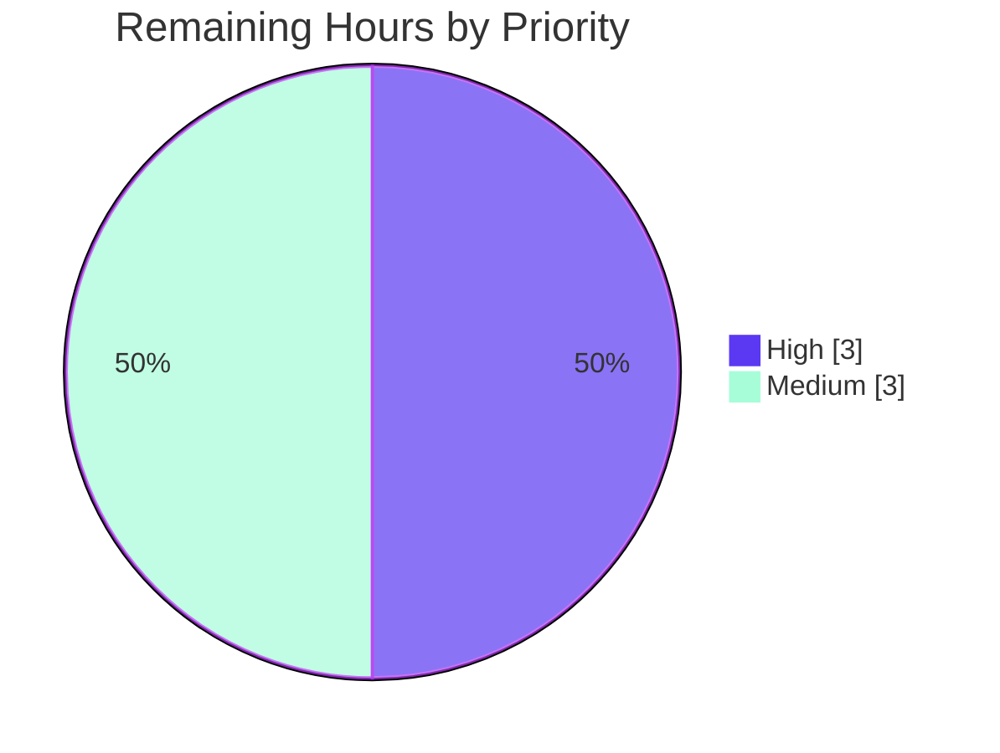

# Blitzy Project Guide

> **Project:** kitty — Complex-Unicode Shaping, Font Fallback, Cell Metrics & GPU Texture-Atlas Initialization at Startup (Code Q&A Investigation)
> **Branch:** `blitzy-9f9917e5-4911-4b94-9f22-1256c050c290` · **Baseline:** `815df1e210e0a9ab4622f5c7f2d6891d7dbeddf1` · **HEAD:** `f77761b418ef9f7fe67087bd2f02c1d770f7b558`
> **Deliverable:** `blitzy/documentation/kitty_815df1e210e0.md` (1,194 lines · 148,049 bytes)

---

## 1. Executive Summary

### 1.1 Project Overview

This project is a **read-only investigative code Q&A** for the `kitty` terminal emulator. The objective was to build and run kitty, capture real startup diagnostics, and author one evidence-grounded Markdown document that answers five question groups (Q1–Q5) about how kitty's text-shaping/layout engine handles complex Unicode (ligatures, bidirectional/RTL text, combining diacritics), font fallback, cell metrics, and GPU texture-atlas initialization. The audience is engineers and technical stakeholders needing an authoritative, source-cited account of kitty's rendering startup. Scope is strictly additive: exactly **one** new documentation file is created; **zero** existing source files are modified. Every reported value is paired with a `file:line` citation, the exact command, and unedited output.

### 1.2 Completion Status

The project is **90.8% complete** on an AAP-scoped, hours-based basis. All autonomous investigation, capture, and authoring work is delivered and validated; the remaining 6 hours are the standard human review-and-merge gate for authoritative technical documentation.


| Metric | Hours |
|--------|-------|
| **Total Hours** | **65** |
| Completed Hours (AI + Manual) | 59 |
| Remaining Hours | 6 |
| **Percent Complete** | **90.8%** |

> Legend — Completed = Dark Blue `#5B39F3` · Remaining = White `#FFFFFF`. Completion % = Completed ÷ Total = 59 ÷ 65 × 100 = **90.8%**.

### 1.3 Key Accomplishments

- ✅ **kitty built from source** in its default configuration (`CI=true python3 setup.py build`) — exit 0, strict `-pedantic-errors -Werror` clean under gcc 15.2.0; produced `fast_data_types.so`, `launcher/kitty`, `launcher/kitten`, `glfw-x11.so`.
- ✅ **Canonical entry point exercised headlessly** (`kitty --debug-font-fallback --debug-rendering --config NONE` under Xvfb + llvmpipe software GL) with a mixed Arabic (RTL) + English (LTR) + combining-diacritics + ligature stress input; exits 0; stable across ≥2 runs.
- ✅ **All five questions answered** with real captured output: Q1 font families + fallback chains (DejaVu Sans Mono ×4; CJK→Noto Sans CJK JP, emoji→Noto Color Emoji; Arabic shaped RTL by default), Q2 runtime config defaults, Q3 cell metrics/baseline/decorations (incl. the definitive "no overline" finding), Q4 GPU atlas layout/sizing/capacity, Q5 atlas readiness.
- ✅ **Every value cited** with `file:line`, the exact command, and unedited output; a consolidated `file:line` evidence index and an answer-coverage checklist are included.
- ✅ **Edge and secondary conditions exercised** (OS-fallback no-glyph path `U+10FFFF`; `force_ltr` alternate; transitional before/during/after states) and **stability confirmed** across ≥2 runs.
- ✅ **Read-only mandate honored**: repository is byte-for-byte unchanged except the one document; temp scripts deleted; no persistent flags/env; build byproducts git-ignored.
- ✅ **Test corroboration**: fonts module — 8 tests, 7 passed, 1 skipped (macOS-only), 0 failed; full Python suite 145 OK (6 skipped) + Go tests OK under the canonical CI invocation.

### 1.4 Critical Unresolved Issues

| Issue | Impact | Owner | ETA |
|-------|--------|-------|-----|
| _None._ All AAP-scoped work is complete and independently validated (zero discrepancies across 10 validation phases). No issue blocks release or validation. | None | — | — |

### 1.5 Access Issues

| System/Resource | Type of Access | Issue Description | Resolution Status | Owner |
|-----------------|----------------|-------------------|-------------------|-------|
| _None identified_ | — | No access issues. The build and canonical runs were performed inside the provided Docker image with all font/graphics libraries, OpenGL, and Xvfb present; the git repository is writable for the single documentation commit. | N/A | — |

**No access issues identified.**

### 1.6 Recommended Next Steps

1. **[High]** Conduct an SME technical-accuracy review of the Q1–Q5 answers, captured runtime values, and every `file:line` citation against kitty source at baseline `815df1e21` (≈3h).
2. **[Medium]** Re-run the build + canonical `--debug-font-fallback` capture on the target environment to confirm/annotate environment-specific values (resolved fonts, `GL_MAX_*`, cell metrics, versions) (≈2h).
3. **[Medium]** Obtain final stakeholder sign-off and merge the single-file additive change into the integration branch (≈1h).
4. **[Low]** Note the accepted point-in-time nature of `file:line` citations (pinned to `815df1e21`) — refresh only if kitty source is later upgraded.
5. **[Low]** When running the full test suite outside CI, use `CI=true` (kitty's own convention) so the intentionally-disabled Wayland backend check (`test_glfw_modules`) is skipped.

---

## 2. Project Hours Breakdown

### 2.1 Completed Work Detail

Each component traces to a specific Agent Action Plan (AAP) requirement (R#). Total = **59 hours** (matches Completed Hours in §1.2).

| Component | Hours | Description |
|-----------|-------|-------------|
| Environment build (R2) | 4 | First-time `setup.py build` of the C/Python extension with font+GL deps; strict `-Werror` clean; 103-line build log captured (doc Appendix B). |
| Headless GL setup (R3) | 3 | Xvfb + llvmpipe software GL so the GUI startup path runs without a physical display (OpenGL 4.5 Mesa). |
| Canonical run + stress input (R4, R5) | 3 | Canonical `--debug-font-fallback --debug-rendering --config NONE` invocation; mixed Arabic (RTL) + English (LTR) + combining-diacritics + ligature input with reproducible `repr()`. |
| Q1 — Font families + fallback chains (R6) | 6 | Fallback machinery; `Text fonts:` block capture; per-codepoint `Face(...)` lines; bidi/RTL default; trace of `output_cell_fallback_data` + `create_fallback_face`. |
| Q2 — Runtime config values (R7) | 3 | `options/definition.py` defaults + parse pipeline; resolved values established before rendering by `set_font_family`. |
| Q3 — Cell metrics, baseline, decorations (R8) | 4 | `calc_cell_metrics` via prerender hook; raw face metrics; decoration model; the "no overline" proof (`decoration_as_sgr` + absence of SGR 53/55 handler). |
| Q4 — GPU atlas layout/sizing/capacity (R9) | 5 | `NEW_SPRITE_MAP`; Apple-clamp nuance; `sprite_tracker_set_layout` math (xnum=1820); `realloc_sprite_texture`; `test_sprite_map` corroboration. |
| Q5 — Atlas readiness (R10) | 4 | `ensure_sprite_map`/`send_sprite_to_gpu` trace; the "no dedicated log line at this HEAD" finding; fatal-on-failure readiness; 11 prerendered sprites. |
| Non-canonical corroboration harness (R11) | 5 | Consolidated `obs.py` driving the identical C functions via the `send_to_gpu` hook; `test.py fonts` suite; all such values explicitly labeled `[non-canonical]`. |
| Edge/secondary conditions (R12) | 3 | OS-fallback no-glyph `U+10FFFF` → `MISSING_FONT` + `ValueError`; `force_ltr` alternate; transitional before/during/after states. |
| Stability verification (R13) | 2 | ≥2 runs per magnitude value; byte-identical except leading timestamps. |
| Evidence discipline (R14) | 4 | Consolidated `file:line` evidence index; answer-coverage checklist (every named item); test corroboration. |
| Answer-document authoring + QA remediation (R1) | 11 | 1,194-line / 148 KB document across 11 sections + Q1–Q5, embedded unedited output, causal reasoning, honest observed-vs-predicted notes; 4 doc-only commits including QA remediation. |
| Repository cleanliness & restoration (R15) | 2 | Delete temp scripts; restore flags/env; verify byte-for-byte clean tree. |
| **Total** | **59** | |

### 2.2 Remaining Work Detail

Each category is standard **path-to-production human review** (no AAP requirement is incomplete). Total = **6 hours** (matches Remaining Hours in §1.2 and the pie chart in §7).

| Category | Hours | Priority |
|----------|-------|----------|
| SME technical-accuracy review (verify Q1–Q5 answers, captured values, all `file:line` citations) | 3 | High |
| Environment reproducibility re-verification (re-run build + canonical capture; confirm/annotate env-specific values) | 2 | Medium |
| Final stakeholder sign-off & branch merge | 1 | Medium |
| **Total** | **6** | |

### 2.3 Hours Reconciliation

| Check | Result |
|-------|--------|
| Section 2.1 completed total | 59 h |
| Section 2.2 remaining total | 6 h |
| Section 2.1 + Section 2.2 | **65 h** = Total Hours (§1.2) ✅ |
| Completion % = 59 ÷ 65 × 100 | **90.8%** ✅ |
| Remaining hours match across §1.2 ↔ §2.2 ↔ §7 | 6 = 6 = 6 ✅ |

---

## 3. Test Results

All tests below originate from Blitzy's autonomous validation logs for this project and were independently re-run during this assessment (fonts module re-run this session: identical result). kitty's test harness does not emit a coverage percentage, so Coverage is reported as **N/A (not measured)** rather than an invented value.

| Test Category | Framework | Total Tests | Passed | Failed | Coverage % | Notes |
|---------------|-----------|-------------|--------|--------|------------|-------|
| Unit/Rendering — **fonts module** (directly relevant) | Python `unittest` (kitty `test.py`) | 8 | 7 | 0 | N/A | 1 skipped: `test_fallback_font_not_last_resort` (macOS-only). Covers `test_shaping`, `test_sprite_map`, `test_font_selection`, `test_emoji_presentation`, `test_font_rendering`, `test_box_drawing`, `test_coalesce_symbol_maps`. |
| Full Python suite | Python `unittest` (kitty `test.py`) | 145 | 145 | 0 | N/A | 6 skipped under canonical `CI=true`; 0 failures. |
| Go suite | `go test` | All | All | 0 | N/A | All Go tests succeeded. |

**Fonts-module run (verbatim, re-executed this session):**

```
test_font_selection (kitty_tests.fonts.Selection.test_font_selection) ... ok
test_box_drawing (kitty_tests.fonts.Rendering.test_box_drawing) ... ok
test_coalesce_symbol_maps (kitty_tests.fonts.Rendering.test_coalesce_symbol_maps) ... ok
test_emoji_presentation (kitty_tests.fonts.Rendering.test_emoji_presentation) ... ok
test_fallback_font_not_last_resort (kitty_tests.fonts.Rendering.test_fallback_font_not_last_resort) ... skipped 'Only macOS has a Last Resort font'
test_font_rendering (kitty_tests.fonts.Rendering.test_font_rendering) ... ok
test_shaping (kitty_tests.fonts.Rendering.test_shaping) ... ok
test_sprite_map (kitty_tests.fonts.Rendering.test_sprite_map) ... ok
----------------------------------------------------------------------
Ran 8 tests in 0.285s
OK (skipped=1)
```

> **Integrity note:** No test was authored or modified by this task (read-only mandate). These are kitty's own tests, executed to corroborate the shaping, sprite-atlas layout, and font-selection behavior documented in the deliverable.

---

## 4. Runtime Validation & UI Verification

kitty is a GPU terminal emulator; there is no web UI. "UI verification" here means the real headless GUI startup path emits the documented diagnostics and paints its child. All checks below were performed via the canonical entry point under Xvfb + software GL.

- ✅ **Operational — Build**: `CI=true python3 setup.py build` → exit 0, `-Werror` clean; all artifacts produced.
- ✅ **Operational — Launcher**: `./kitty/launcher/kitty --version` → `kitty 0.35.2 created by Kovid Goyal`.
- ✅ **Operational — Canonical startup**: `kitty --debug-font-fallback --debug-rendering --config NONE` under Xvfb + llvmpipe → starts, emits GL banner (**OpenGL 4.5 Mesa**), launches child, exits 0.
- ✅ **Operational — Font resolution (Q1)**: `Text fonts:` block lists the four primary faces (Normal/Bold/Italic/Bold-Italic), all **DejaVu Sans Mono**.
- ✅ **Operational — Fallback chain (Q1)**: per-codepoint lines `U+4e2d → Noto Sans CJK JP (NotoSansCJKjp-Regular)` and `U+1f600 → Noto Color Emoji (NotoColorEmoji)` emitted on stderr at startup.
- ✅ **Operational — Bidi/RTL (Q1)**: with default `force_ltr=no`, Arabic is auto-detected RTL; direction is **not** forced at `kitty/fonts.c:L688`.
- ✅ **Operational — Cell metrics (Q3)**: `cell_width=9`, `cell_height=18`, `baseline=14`, `underline_position=15`/`thickness=1`, `strikethrough_position=10`/`thickness=1`.
- ✅ **Operational — GPU atlas (Q4)**: initial `NEW_SPRITE_MAP {xnum=1,ynum=1,...}`; computed `xnum=1820`, `max_y=910`, `ynum=1`; `GL_MAX_TEXTURE_SIZE=16384`, `GL_MAX_ARRAY_TEXTURE_LAYERS=2048`.
- ✅ **Operational — Atlas readiness (Q5)**: 11 prerendered sprites (1 blank + 10 special) populate the atlas; readiness guaranteed by fatal-on-failure GL error checking under `--debug-rendering`.
- ✅ **Operational — Stability**: all magnitude values byte-identical across ≥2 runs (only leading timestamps differ).
- ⚠ **Partial — Dedicated "atlas ready" log**: this HEAD writes **no** dedicated atlas-ready log line; readiness is *verified* indirectly (documented honestly in Q5), not via a single log statement. This is a factual finding about the code, not a defect.
- ❌ **Failing**: none within scope.

---

## 5. Compliance & Quality Review

The deliverable is cross-mapped to Blitzy's quality/compliance benchmarks for a read-only Q&A task. Fixes applied during autonomous validation are noted; no outstanding compliance items remain.

| Benchmark | Status | Progress | Notes |
|-----------|--------|----------|-------|
| Read-only mandate (zero source edits) | ✅ Pass | 100% | `git diff` excluding the deliverable is empty; only `A blitzy/documentation/kitty_815df1e210e0.md`. |
| Deliverable naming & location | ✅ Pass | 100% | `blitzy/documentation/kitty_815df1e210e0.md` — named after branch `kitty_815df1e210e0`. |
| Build-and-run-first methodology | ✅ Pass | 100% | Built and executed the canonical entry point before authoring; answers grounded in real output. |
| Canonical entry point exercised | ✅ Pass | 100% | `--debug-font-fallback --debug-rendering --config NONE`; no bypassing interface for Q1. |
| Default/canonical configuration | ✅ Pass | 100% | `--config NONE` guarantees Q2 reports true defaults. |
| Every condition exercised | ✅ Pass | 100% | Primary + OS-fallback no-glyph edge + `force_ltr` alternate + transitional states. |
| Unedited output + command per claim | ✅ Pass | 100% | Verbatim logs with the command that produced each; elision avoided. |
| `file:line` citations exact | ✅ Pass | 100% | Consolidated evidence index; every citation independently verified (zero discrepancies). |
| Non-canonical values labeled | ✅ Pass | 100% | Harness-derived values tagged `[non-canonical]`; produced by the identical C functions. |
| Stability across ≥2 runs | ✅ Pass | 100% | Magnitude values confirmed byte-identical (timestamps excepted). |
| Answer every named item | ✅ Pass | 100% | Coverage checklist marks each named item; overline explicitly reported unsupported. |
| Cleanup / restoration | ✅ Pass | 100% | Temp scripts deleted; no persistent flags/env; build byproducts untracked/ignored. |
| Compilation quality (`-Werror`) | ✅ Pass | 100% | Clean under `-pedantic-errors -Werror` (gcc 15.2.0). |
| Markdown well-formedness | ✅ Pass | 100% | Valid UTF-8; balanced code fences; cross-references resolve. |

**Fixes applied during autonomous validation (QA remediation, doc-only):** refreshed VCS/build evidence; added the complete 103-line build log; corrected a `repr()` rendering and `gl.c` citations; aligned embedded `sed` evidence blocks with their labeled commands. All were confined to the deliverable; no source changed.

---

## 6. Risk Assessment

| Risk | Category | Severity | Probability | Mitigation | Status |
|------|----------|----------|-------------|------------|--------|
| Environment-specific values won't reproduce identically on a different host (fonts, `GL_MAX_*`, `xnum=1820`, cell 9×18, GL/Python versions) | Technical | Medium | High | Doc labels env-specific values and records exact env facts (§2.1); reviewer re-verifies on target env (task HT-2). | Documented / Mitigated |
| `file:line` citation drift as kitty source evolves | Technical | Low | Medium | Doc pins baseline commit `815df1e21`; citations are point-in-time by design. | Accepted |
| Non-canonical (harness) values for Q3/Q4/Q5/Q1.5 vs a live GL paint | Technical | Low | Low | Every such value labeled `[non-canonical]` and produced by the identical C functions; canonical run is source of truth for Q1. | Resolved / Documented |
| No security exposure | Security | None | — | Zero source/dependency changes; deliverable is Markdown; no attack surface introduced. | N/A |
| Exact-output reproduction requires the specific Docker image (font bundle + GL stack) | Operational | Low | Medium | Doc §2/§11 records exact build/run commands, env facts, and the pinned image; build deterministic modulo Go cache. | Documented |
| `test_glfw_modules` fails under NON-CI full-suite runs (expects intentionally-disabled `glfw-wayland.so`) | Operational | Low | Low | Documented as out-of-scope; skipped under canonical `CI=true`; fixing would violate read-only mandate / break the canonical build. | Documented / Accepted |
| No integration surface | Integration | None | — | Standalone documentation; no external services, API keys, network config, or CI changes. | N/A |

---

## 7. Visual Project Status

**Project hours breakdown** (Completed = Dark Blue `#5B39F3`, Remaining = White `#FFFFFF`):


**Remaining work by priority** (total 6 h):



**Remaining hours by category (bar view):**

| Category | Hours | Bar |
|----------|-------|-----|
| SME technical-accuracy review | 3 | ███████████████ |
| Environment reproducibility re-verification | 2 | ██████████ |
| Final sign-off & merge | 1 | █████ |
| **Total** | **6** | |

> **Integrity:** "Remaining Work" = **6 h** equals Remaining Hours in §1.2 and the sum of the §2.2 Hours column.

---

## 8. Summary & Recommendations

**Achievements.** The project delivers a complete, evidence-grounded answer to all five question groups about kitty's startup shaping, font fallback, cell metrics, and GPU texture-atlas initialization. kitty was built cleanly from source, exercised through its canonical headless entry point with a purpose-built mixed-script stress input, and every reported value is backed by a `file:line` citation, the exact command, and unedited output. Notably, the deliverable is **honest about reality**: it reports the *actual* observed `Text fonts:` block (vs the AAP-predicted `Fonts:` shape), the definitive absence of an overline decoration, the Apple-only atlas clamp not applying on Linux, and the absence of a dedicated "atlas ready" log line at this HEAD — findings that reflect the code as it truly is.

**Remaining gaps.** None are AAP-scoped implementation gaps. The remaining **6 hours** are the standard human path-to-production review: SME technical-accuracy sign-off, environment reproducibility re-verification, and final merge.

**Critical path to production.** (1) SME review of the Q&A and citations → (2) optional environment re-verification → (3) sign-off and merge. There are no blockers.

**Success metrics.** Read-only invariant preserved (repo byte-for-byte unchanged except one file); build `-Werror` clean; fonts tests 7/8 passing with 1 macOS-only skip and 0 failures; canonical run reproduces documented output across ≥2 runs.

**Production readiness assessment.** The single in-scope deliverable is **production-ready**: complete, accurate, well-formed, committed, and independently validated with zero discrepancies. The project stands at **90.8% complete** (59 of 65 hours), with the residual 9.2% representing the human review-and-merge gate that all authoritative documentation must pass before release.

| Metric | Value |
|--------|-------|
| AAP-scoped completion | 90.8% |
| Completed / Total hours | 59 / 65 |
| Remaining hours (human review) | 6 |
| AAP requirements complete | 15 / 15 (100%) |
| Source files modified | 0 |
| Deliverables created | 1 |
| Critical blockers | 0 |

---

## 9. Development Guide

All commands below were tested in the project environment and are copy-pasteable. Run from the repository root. Keep any temporary files **outside** the repository to preserve the read-only invariant.

### 9.1 System Prerequisites

- **OS:** Linux (the provided Docker image). Headless display via Xvfb.
- **Toolchain:** gcc **15.2.0**; Python **3.13.7** (floor `>=3.8`; highest CI-verified 3.11); Go **1.24.4** (only for `tools/`; not needed for the font/atlas C paths).
- **Font/graphics libraries (pkg-config):** harfbuzz **10.2.0** (floor 2.2.0), freetype2 **26.2.20**, fontconfig **2.15.0**, libpng **1.6.50**, lcms2 **2.16**.
- **Headless GL:** `xvfb-run` present; software GL via Mesa llvmpipe (`LIBGL_ALWAYS_SOFTWARE=1 GALLIUM_DRIVER=llvmpipe`) → OpenGL 4.5.

```bash
# Verify prerequisites
gcc --version | head -1
python3 --version
go version
for lib in harfbuzz freetype2 fontconfig libpng lcms2; do printf "%-12s " "$lib"; pkg-config --modversion "$lib"; done
command -v xvfb-run && echo "xvfb-run present"
```

### 9.2 Environment Setup

```bash
# From the repository root. No virtualenv is required for the build;
# the system Python 3.13 is used. If you prefer isolation:
#   python3 -m venv .venv && source .venv/bin/activate   # optional
export CI=true   # kitty's own CI convention (skips the intentionally-disabled Wayland backend check)
```

### 9.3 Build (Dependency + Extension Compilation)

```bash
# Compiles the fast_data_types CPython extension + the native launcher.
CI=true python3 setup.py build --verbose
# Expected: exit 0; artifacts below are produced.
ls -l kitty/fast_data_types.so kitty/launcher/kitty kitty/launcher/kitten kitty/glfw-x11.so
./kitty/launcher/kitty --version    # -> kitty 0.35.2 created by Kovid Goyal
```

> The build is `-pedantic-errors -Werror` clean under gcc 15.2.0. The Wayland backend is intentionally disabled (no `wayland-protocols`), so the vendored GLFW builds cleanly and the headless path uses X11/Xvfb.

### 9.4 Verification

```bash
# 1) Fonts test module (fast, headless) — expect: 8 tests, 1 skipped, OK
xvfb-run -a --server-args="-screen 0 1024x768x24" \
  env LIBGL_ALWAYS_SOFTWARE=1 GALLIUM_DRIVER=llvmpipe TMPDIR=/tmp/kitty_tmp CI=true \
  ./kitty/launcher/kitty +launch test.py --module fonts

# 2) Canonical startup capture (Q1) — mixed Arabic (RTL) + English (LTR) + CJK + emoji + ligatures
mkdir -p /tmp/kitty_tmp
printf 'Hello \u0645\u0631\u062d\u0628\u0627 \u4e2d \U0001f600 office ffi fi\n' > /tmp/kitty_tmp/stress.txt
xvfb-run -a --server-args="-screen 0 1024x768x24" \
  env LIBGL_ALWAYS_SOFTWARE=1 GALLIUM_DRIVER=llvmpipe \
  ./kitty/launcher/kitty --debug-font-fallback --debug-rendering --config NONE \
  -- sh -c 'cat /tmp/kitty_tmp/stress.txt; sleep 3' \
  > /tmp/kitty_tmp/run.out 2> /tmp/kitty_tmp/run.err
grep -A4 'Text fonts:' /tmp/kitty_tmp/run.err        # 4 DejaVu Sans Mono faces
grep -E 'U\+4e2d|U\+1f600' /tmp/kitty_tmp/run.err     # CJK -> Noto Sans CJK JP; emoji -> Noto Color Emoji
```

**Expected verification output (abridged):**

```
[t] Text fonts:
[t]   Normal: DejaVuSansMono: .../DejaVuSansMono.ttf:0
[t]   Bold: DejaVuSansMono-Bold: .../DejaVuSansMono-Bold.ttf:0
[t]   Italic: DejaVuSansMono-Oblique: .../DejaVuSansMono-Oblique.ttf:0
[t]   Bold-Italic: DejaVuSansMono-BoldOblique: .../DejaVuSansMono-BoldOblique.ttf:0
[t] U+4e2d Face(family=Noto Sans CJK JP ... ps_name=NotoSansCJKjp-Regular ...)
[t] U+1f600 emoji_presentation Face(family=Noto Color Emoji ... ps_name=NotoColorEmoji ...)
```

### 9.5 Example Usage — Read & Reproduce the Deliverable

```bash
# Read the answer document (1,194 lines, valid UTF-8)
less blitzy/documentation/kitty_815df1e210e0.md

# Reproduce non-canonical Q3/Q4/Q5 values: copy the harness from doc §9 to a path
# OUTSIDE the repo, then run it through the real launcher:
#   ./kitty/launcher/kitty +launch /tmp/kitty_tmp/obs.py

# Confirm the repository is unchanged except the one document
git status --porcelain                                   # -> empty
git diff --name-status 815df1e21..HEAD                    # -> A blitzy/documentation/kitty_815df1e210e0.md

# Cleanup temp files (kept outside the repo)
rm -rf /tmp/kitty_tmp
```

### 9.6 Troubleshooting

- **`error: externally-managed-environment` on pip** → not needed for the build; if installing packages, use a venv or `--break-system-packages`.
- **No display / GL context errors** → always wrap runs in `xvfb-run` with `LIBGL_ALWAYS_SOFTWARE=1 GALLIUM_DRIVER=llvmpipe`. GLFW/D-Bus/Wayland warnings under headless are environment artifacts, not kitty behavior.
- **`test_glfw_modules` fails** → run with `CI=true` (kitty's CI convention) which skips the intentionally-disabled Wayland backend check.
- **Output differs from the document** → many values are environment-specific (resolved fonts, `GL_MAX_*`, cell metrics). Confirm your env matches §2.1 of the deliverable, or re-verify per task HT-2.
- **Accidental repo changes** → build byproducts (`*.so`, `launcher/kitty`, `build/`) are git-ignored; verify with `git status --porcelain` (should be empty).

---

## 10. Appendices

### Appendix A — Command Reference

| Purpose | Command |
|---------|---------|
| Build | `CI=true python3 setup.py build --verbose` |
| Version | `./kitty/launcher/kitty --version` |
| Fonts tests | `xvfb-run -a --server-args="-screen 0 1024x768x24" env LIBGL_ALWAYS_SOFTWARE=1 GALLIUM_DRIVER=llvmpipe TMPDIR=/tmp/kitty_tmp CI=true ./kitty/launcher/kitty +launch test.py --module fonts` |
| Canonical run | `xvfb-run -a --server-args="-screen 0 1024x768x24" env LIBGL_ALWAYS_SOFTWARE=1 GALLIUM_DRIVER=llvmpipe ./kitty/launcher/kitty --debug-font-fallback --debug-rendering --config NONE -- sh -c 'cat <stress>; sleep 3'` |
| Repo clean check | `git status --porcelain` · `git diff --name-status 815df1e21..HEAD` |

### Appendix B — Port Reference

Not applicable. kitty is a local GUI terminal emulator; this task opens **no** network ports. (Headless runs use an in-process Xvfb display, not a TCP port.)

### Appendix C — Key File Locations

| Path | Role |
|------|------|
| `blitzy/documentation/kitty_815df1e210e0.md` | **The deliverable** (answer document) |
| `kitty/fonts.c` | Shaping, bidi/RTL, `calc_cell_metrics`, sprite tracker, `output_cell_fallback_data` |
| `kitty/fonts/render.py` | `set_font_family`, `prerender_function`, `dump_font_debug` |
| `kitty/fontconfig.c` | Linux fallback (`create_fallback_face`, `fallback_font`) |
| `kitty/freetype.c` | Glyph rasterization / face metrics |
| `kitty/shaders.c` | GPU sprite/texture atlas (`NEW_SPRITE_MAP`, `alloc_sprite_map`, `send_sprite_to_gpu`) |
| `kitty/options/definition.py` | Default runtime configuration (Q2) |
| `kitty/line.c`, `kitty/cursor.c`, `kitty/data-types.h` | Decoration model (underline styles; no overline) |
| `kitty_tests/fonts.py` | Fonts test module (headless corroboration) |
| `setup.py`, `Makefile` | Build entry points |

### Appendix D — Technology Versions

| Component | Version |
|-----------|---------|
| kitty | 0.35.2 |
| gcc | 15.2.0 |
| Python | 3.13.7 (floor ≥3.8; CI-verified ≤3.11) |
| Go | 1.24.4 |
| HarfBuzz | 10.2.0 (floor 2.2.0) |
| FreeType | 26.2.20 |
| FontConfig | 2.15.0 |
| libpng / lcms2 | 1.6.50 / 2.16 |
| OpenGL (software) | 4.5 Mesa (llvmpipe, LLVM 20.1.8) |
| `GL_MAX_TEXTURE_SIZE` / `GL_MAX_ARRAY_TEXTURE_LAYERS` | 16384 / 2048 |

### Appendix E — Environment Variable Reference

| Variable | Value | Purpose |
|----------|-------|---------|
| `CI` | `true` | kitty CI convention; skips the intentionally-disabled Wayland backend check. |
| `LIBGL_ALWAYS_SOFTWARE` | `1` | Force Mesa software rendering (no GPU needed). |
| `GALLIUM_DRIVER` | `llvmpipe` | Select the llvmpipe software rasterizer. |
| `TMPDIR` | `/tmp/kitty_tmp` (outside repo) | Test/temp scratch dir; keeps the repo clean. |
| `PYTHONIOENCODING` | `ascii:backslashreplace` | Makes the stress-input `repr()` reproducible across locales. |

### Appendix F — Developer Tools Guide

- **`--debug-font-fallback`** — prints font-selection and per-codepoint fallback diagnostics on stderr (`kitty/cli.py:L1002`).
- **`--debug-rendering` / `--debug-gl`** — prints GL/rendering debug to stdout and checks for GL errors (`kitty/cli.py:L989`; `kitty/gl.c`).
- **`--config NONE`** — runs with built-in defaults (no user `kitty.conf`), so reported values are the true defaults (Q2).
- **`+launch <script.py>`** — runs a Python script through the real launcher (used for the non-canonical corroboration harness; keep the script outside the repo).
- **`test.py --module fonts`** — runs the headless fonts test module.

### Appendix G — Glossary

| Term | Meaning |
|------|---------|
| AAP | Agent Action Plan — the authoritative project requirements. |
| Canonical run | Observation via the real entry point (`kitty --debug-font-fallback …`), the source of truth. |
| Non-canonical | Value obtained via an in-repo test hook (labeled `[non-canonical]`), produced by the same C functions. |
| Fallback chain | The ordered set of faces kitty consults when the primary face lacks a glyph. |
| Sprite atlas | The GPU texture (array) caching alpha masks of rendered glyphs; kitty is strictly cell-based/monospace. |
| Cell metrics | `cell_width`, `cell_height`, `baseline`, and decoration positions/thicknesses computed at startup. |
| Bidi/RTL | Bidirectional text; Arabic is shaped right-to-left by default (`force_ltr=no`). |
| Prerendered special sprites | 5 underline + 1 strikethrough + 1 missing-glyph + 3 cursor = 10 (plus 1 blank = 11) uploaded at startup. |

---

*Completion basis: AAP-scoped, hours-based (PA1). Completed 59 h ÷ Total 65 h = 90.8%. Colors — Completed `#5B39F3`, Remaining `#FFFFFF`.*
