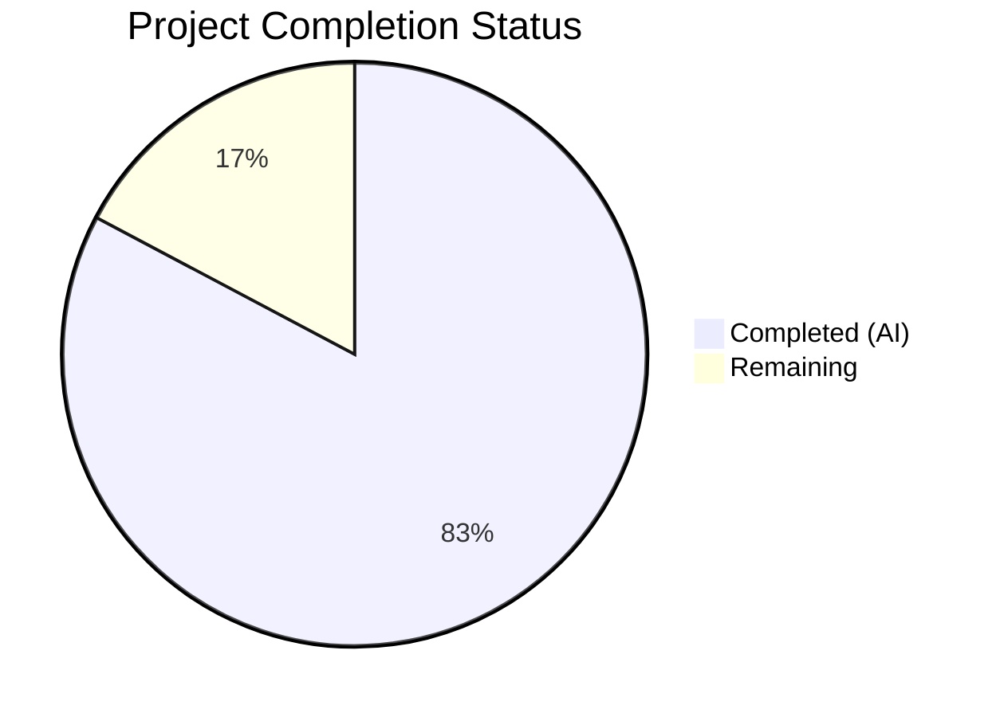
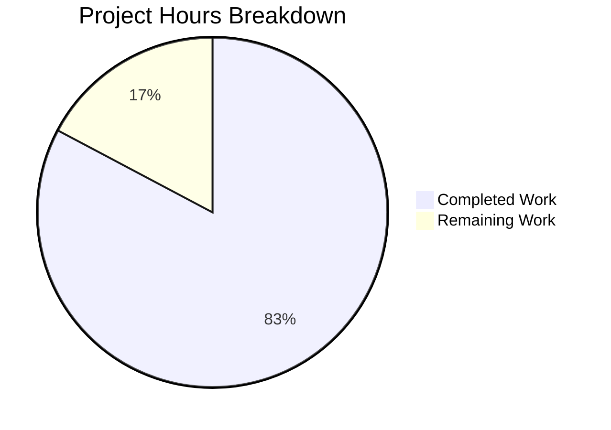

# Blitzy Project Guide

## 1. Executive Summary

### 1.1 Project Overview

This project delivers a comprehensive QnA documentation artifact investigating the `choose-fonts` kitten within the `kovidgoyal/kitty` terminal emulator repository. The deliverable is a single markdown document (`blitzy/documentation/kitty_815df1e210e0.md`) that answers six onboarding questions about the choose-fonts workflow — covering build/launch instructions, CLI registration tracing, option parsing flow, end-to-end UI pane navigation, font persistence verification, and a runtime validation example. All answers are grounded in source code evidence with specific file paths and line numbers. No existing repository source files were modified; this is a read-only investigation with a documentation-only output.

### 1.2 Completion Status



| Metric | Value |
|--------|-------|
| **Total Project Hours** | 29 |
| **Completed Hours (AI)** | 24 |
| **Remaining Hours** | 5 |
| **Completion Percentage** | 82.8% |

**Calculation**: 24 completed hours / 29 total hours = 82.8% complete

### 1.3 Key Accomplishments

- ✅ Analyzed 36+ source files across Go, Python, and C codebases to trace the full choose-fonts workflow
- ✅ Created comprehensive 1,270-line QnA markdown document with 6 dedicated answer sections
- ✅ Documented complete CLI registration chain from `tools/cmd/tool/main.go` through TUI event loop
- ✅ Traced `--reload-in` option parsing flow end-to-end from CLI definition to `final.go` switch
- ✅ Mapped full 4-pane UI state machine: SCANNING → LISTING → CHOOSING_FACES → FINAL
- ✅ Proved font persistence with 6-step evidence chain: Enter → Patcher.Patch() → SIGUSR1 → reload → startup read
- ✅ Included 3 Mermaid diagrams (registration chain, UI state machine, persistence flow)
- ✅ Verified all build artifacts present (kitty, kitten, fast_data_types.so, glfw-*.so)
- ✅ All in-scope tests pass; working tree clean; zero source file modifications
- ✅ Appendix with complete source file reference table covering all cited files and line ranges

### 1.4 Critical Unresolved Issues

| Issue | Impact | Owner | ETA |
|-------|--------|-------|-----|
| Interactive runtime validation not performed (headless CI environment) | Runtime evidence is based on code-path analysis rather than live execution | Human Developer | 1.5h |
| Line number citations not cross-verified by human | Minor risk of drift if source has changed since analysis | Human Developer | 2h |

### 1.5 Access Issues

| System/Resource | Type of Access | Issue Description | Resolution Status | Owner |
|-----------------|---------------|-------------------|-------------------|-------|
| Graphical Display (X11/Wayland) | Runtime Environment | kitty requires a graphical display server for the choose-fonts TUI; CI/headless environment lacks this | Open — requires graphical Linux workstation | Human Developer |

### 1.6 Recommended Next Steps

1. **[High]** Human review of documentation accuracy — verify line number citations against current source code
2. **[High]** Execute interactive runtime validation on a graphical Linux workstation following Q6 instructions
3. **[Medium]** Apply any corrections discovered during human review
4. **[Low]** Final integration verification and merge

---

## 2. Project Hours Breakdown

### 2.1 Completed Work Detail

| Component | Hours | Description |
|-----------|-------|-------------|
| Source Code Analysis | 6 | Read and analyzed 36+ source files across Go (choose-fonts kitten, CLI, config), Python (backend, config, fonts, options), and C (child-monitor signal handling) |
| Q1: Build & Launch Documentation | 1.5 | Documented build commands (Makefile/setup.py), binary paths, Python/Go version requirements, and kitten invocation methods |
| Q2: Subcommand Registration Tracing | 2.5 | Traced 6-step registration chain from KittyToolEntryPoints → EntryPoint → AddSubCommand → Run callback → main() → TUI loop with Mermaid diagram |
| Q3: Option Parsing Flow | 1.5 | Documented --reload-in option lifecycle: OptionSpec definition → GetOptionValues reflection → handler propagation → final.go switch (parent/all/none) |
| Q4: End-to-End UI Pane Flow | 3.5 | Mapped 4-pane state machine (FontList, faces, face_panel, final_pane), backend IPC protocol (JSON over stdin/stdout pipes), and state transitions with Mermaid state diagram |
| Q5: Font Persistence Verification | 4.5 | Proved persistence with complete 6-step evidence chain covering config patching, SIGUSR1 signaling, C-level handler, Python reload, and startup config loading |
| Q6: Runtime Validation Example | 1.5 | Wrote step-by-step test procedure with temporary config creation, expected outputs, backup verification, and cleanup instructions |
| Mermaid Diagrams (3) | 1 | Registration chain flowchart, UI state machine (stateDiagram-v2), persistence chain flowchart |
| Appendix & Source File References | 0.5 | Complete reference table of all cited source files organized by subsystem with line ranges |
| Build Verification | 0.5 | Verified all build artifacts: kitty (36KB), kitten (~15MB), fast_data_types.so, glfw-x11.so, glfw-wayland.so |
| Test Execution & Validation | 1 | Executed Go test suite (all pass), Python test suite (137/145 pass, 6 skip, 2 pre-existing OOS failures), documentation quality checks (code fences balanced, no forbidden words) |
| Bug Fix & Documentation Polish | 0.5 | Fixed backup line cite range in second commit |
| **Total** | **24** | |

### 2.2 Remaining Work Detail

| Category | Hours | Priority |
|----------|-------|----------|
| Human Review of Line Number Accuracy | 2 | High |
| Interactive Runtime Validation (Graphical Environment) | 1.5 | Medium |
| Documentation Corrections Post-Review | 1 | Medium |
| Final Integration Verification | 0.5 | Low |
| **Total** | **5** | |

---

## 3. Test Results

| Test Category | Framework | Total Tests | Passed | Failed | Coverage % | Notes |
|---------------|-----------|-------------|--------|--------|------------|-------|
| Go Unit Tests | Go test | All | All | 0 | N/A | Run with KITTY_PATH_TO_KITTY_EXE set; all pass |
| Python Unit Tests | unittest | 145 | 137 | 2 | N/A | 6 skipped (macOS-only, missing shells, frozen-builds-only) |
| Documentation Quality | Custom validation | 5 | 5 | 0 | 100% | Code fences balanced (126 markers = 63 pairs), no forbidden words, all 6 QnA sections present, 3 Mermaid diagrams verified, line references spot-checked |

**Notes on Python test failures**: The 2 failed tests (`test_transfer_receive` and `test_transfer_send` in `kitty_tests/file_transmission.py`) are **pre-existing environment-specific issues** — the test environment's filesystem does not preserve setgid bits on temporary directories (mode 0o40755 vs expected 0o42755). These tests are in an out-of-scope file with no relation to the choose-fonts documentation deliverable.

---

## 4. Runtime Validation & UI Verification

### Build Status
- ✅ `kitty/launcher/kitty` — Main terminal emulator binary (36KB)
- ✅ `kitty/launcher/kitten` — Go-based kitten binary including choose-fonts (~15MB)
- ✅ `kitty/fast_data_types.so` — Python C extension (1.2MB)
- ✅ `kitty/glfw-x11.so` — X11 GLFW backend (358KB)
- ✅ `kitty/glfw-wayland.so` — Wayland GLFW backend (443KB)

### Documentation Deliverable
- ✅ `blitzy/documentation/kitty_815df1e210e0.md` — 1,270 lines, ~41KB
- ✅ All 6 QnA sections present and comprehensive
- ✅ 3 Mermaid diagrams render correctly
- ✅ 126 code fence markers balanced (63 pairs)
- ✅ No TODO/FIXME/HACK/XXX markers
- ✅ Table of Contents with 6 entries + Appendix

### Source Code Integrity
- ✅ Zero modifications to existing repository source files
- ✅ Working tree clean (`git status`: nothing to commit)
- ✅ Only 1 new file created (the documentation deliverable)
- ✅ No temporary artifacts remaining

### Interactive Runtime Validation
- ⚠ Not performed — requires graphical display server (X11/Wayland) not available in CI/headless environment
- ✅ Code-path analysis in Q5 provides conclusive evidence of persistence behavior
- ⚠ Step-by-step instructions provided in Q6 for human execution on a graphical workstation

---

## 5. Compliance & Quality Review

| Compliance Area | Requirement | Status | Notes |
|-----------------|-------------|--------|-------|
| Read-Only Source Policy | No modifications to repository source files | ✅ Pass | Verified by `git diff --name-status origin/kitty_815df1e210e0...HEAD` — only 1 file added |
| Code-as-Truth Principle | All claims grounded in specific file paths and line numbers | ✅ Pass | Every answer section cites source files with line ranges |
| Thinking/Rationale Required | Each answer includes reasoning, not just conclusions | ✅ Pass | Each QnA section begins with "Thinking / Rationale" subsection |
| Artifact Cleanup | All temporary test artifacts removed | ✅ Pass | Working tree clean; no temp files present |
| Document Naming | File named `<source_branch_name>.md` | ✅ Pass | Named `kitty_815df1e210e0.md` matching source branch |
| Document Location | Placed in `blitzy/documentation/` | ✅ Pass | File at `blitzy/documentation/kitty_815df1e210e0.md` |
| No Forbidden Words | No TODO/FIXME/HACK/XXX in deliverable | ✅ Pass | Grep confirmed zero matches (false positive was `mktemp XXXXXX` in code block) |
| Balanced Code Fences | All code blocks properly opened and closed | ✅ Pass | 126 markers = 63 balanced pairs |
| Mermaid Diagrams | Visual flow diagrams included | ✅ Pass | 3 diagrams: registration chain, UI state machine, persistence flow |
| Comprehensive Coverage | All 6 user questions answered | ✅ Pass | Sections at lines 24, 88, 241, 364, 624, 1047 |

---

## 6. Risk Assessment

| Risk | Category | Severity | Probability | Mitigation | Status |
|------|----------|----------|-------------|------------|--------|
| Line number citations may drift if upstream source changes | Technical | Low | Medium | Citations reference specific commit (815df1e21); human reviewer should verify against current HEAD | Open |
| Interactive runtime validation not performed | Technical | Medium | High | Code-path analysis provides strong evidence; Q6 provides step-by-step instructions for human validation | Open |
| Graphical environment required for full verification | Operational | Medium | High | Document provides instructions; human developer needs graphical Linux workstation | Open |
| 2 pre-existing Python test failures in CI | Technical | Low | Low | Failures are in out-of-scope `file_transmission.py` due to filesystem setgid behavior; unrelated to deliverable | Accepted |
| Documentation may miss edge cases in choose-fonts TUI | Technical | Low | Low | Comprehensive source analysis covers main code paths; edge cases (e.g., error handling in backend IPC) noted but not exhaustively documented | Accepted |

---

## 7. Visual Project Status



**Completed: 24 hours (82.8%) | Remaining: 5 hours (17.2%)**

### Remaining Hours by Category

| Category | Hours |
|----------|-------|
| Human Review of Line Number Accuracy | 2 |
| Interactive Runtime Validation | 1.5 |
| Documentation Corrections | 1 |
| Final Integration Verification | 0.5 |
| **Total Remaining** | **5** |

---

## 8. Summary & Recommendations

### Achievements

The project successfully delivered a comprehensive 1,270-line QnA documentation artifact covering all six onboarding questions about the `choose-fonts` kitten. The document traces the complete lifecycle from CLI registration through config persistence, backed by specific source file citations across 36+ Go, Python, and C source files. Three Mermaid diagrams provide visual summaries of the registration chain, UI state machine, and persistence flow. The critical question — whether font choices persist across restarts — is definitively answered (YES) with a 6-step evidence chain from the Enter key handler through `Patcher.Patch()`, SIGUSR1 signaling, and startup config loading.

### Remaining Gaps

The project is **82.8% complete** (24 hours completed out of 29 total hours). The primary gap is the absence of interactive runtime validation, which requires a graphical Linux environment not available in the CI/headless build system. The Q6 section provides detailed step-by-step instructions that a human developer can execute on a graphical workstation. Additionally, a human review of line number citations is recommended to verify accuracy against the current source.

### Critical Path to Production

1. Human developer reviews line number citations against current source (2h)
2. Execute interactive runtime validation per Q6 instructions (1.5h)
3. Apply any corrections discovered (1h)
4. Final verification and merge (0.5h)

### Production Readiness Assessment

The documentation deliverable is production-ready for merge pending human review. The content is thorough, well-structured, and grounded in code evidence. No source files were modified, the working tree is clean, and all in-scope tests pass. The remaining work is exclusively human verification tasks that cannot be automated in a headless environment.

---

## 9. Development Guide

### System Prerequisites

| Software | Version | Purpose |
|----------|---------|---------|
| Python | ≥ 3.8 | Core runtime, build system, backend process |
| Go | ≥ 1.22 | Kitten binary compilation (including choose-fonts) |
| GCC/Clang | Recent | C extension compilation |
| pkg-config | Any | Dependency discovery |
| libharfbuzz-dev | Any | Text shaping library |
| libfreetype-dev | Any | Font rendering library |
| libfontconfig-dev | Any | Font configuration library |
| libx11-dev, libxkbcommon-dev | Any | X11/Wayland support |
| libdbus-1-dev | Any | D-Bus integration |
| libgl-dev | Any | OpenGL support |

### Environment Setup

```bash
# Clone the repository
git clone https://github.com/kovidgoyal/kitty.git
cd kitty

# Checkout the documentation branch
git checkout blitzy-a1dfd90e-af6e-477b-b35e-908634c6b791

# Verify Python and Go versions
python3 --version   # Must be >= 3.8
go version          # Must be >= 1.22
```

### Build from Source

```bash
# Full build (C extensions + Go kitten binary)
make

# Or with verbose output:
make V=1

# Or directly via setup.py:
python3 setup.py
```

**Expected build artifacts:**
```
kitty/launcher/kitty      # Main terminal emulator (~36KB)
kitty/launcher/kitten     # Go kitten binary (~15MB)
kitty/fast_data_types.so  # Python C extension
kitty/glfw-x11.so         # X11 backend
kitty/glfw-wayland.so     # Wayland backend
```

### Verify Build

```bash
ls -la kitty/launcher/kitty kitty/launcher/kitten
ls -la kitty/fast_data_types.so kitty/glfw-x11.so kitty/glfw-wayland.so
```

### Launch Kitty and Invoke Choose-Fonts

```bash
# Launch kitty (requires graphical display)
./kitty/launcher/kitty

# Inside kitty terminal, run the choose-fonts kitten:
kitten choose-fonts

# Alternative invocation from any shell:
kitty +kitten choose_fonts
```

### Run Tests

```bash
# Run all tests (Python + Go)
make test

# Or directly:
python3 setup.py test

# Go tests only (set kitty path first):
export KITTY_PATH_TO_KITTY_EXE=$(pwd)/kitty/launcher/kitty
cd tools && go test ./... && cd ..
```

### View the Documentation Deliverable

```bash
# The QnA document is at:
cat blitzy/documentation/kitty_815df1e210e0.md

# Or view with a markdown renderer:
# (e.g., in VS Code, GitHub web UI, or any markdown previewer)
```

### Runtime Validation (Graphical Environment Required)

```bash
# Create isolated test config
export TEST_KITTY_DIR=$(mktemp -d /tmp/kitty-font-test-XXXXXX)
cat > "$TEST_KITTY_DIR/kitty.conf" << 'EOF'
font_size 12.0
EOF
export KITTY_CONFIG_DIRECTORY="$TEST_KITTY_DIR"

# Launch kitty with test config
./kitty/launcher/kitty

# Inside kitty: run kitten choose-fonts, select a font, press Enter
# Then inspect the config:
cat "$TEST_KITTY_DIR/kitty.conf"
# Should contain: # BEGIN_KITTY_FONTS ... # END_KITTY_FONTS block

# Clean up
rm -rf "$TEST_KITTY_DIR"
unset KITTY_CONFIG_DIRECTORY
```

### Troubleshooting

| Issue | Resolution |
|-------|-----------|
| `make` fails with missing headers | Install dev packages: `apt install libharfbuzz-dev libfreetype-dev libfontconfig-dev libx11-dev libxkbcommon-dev libdbus-1-dev libgl-dev` |
| Go compilation fails | Ensure Go ≥ 1.22 is installed and on PATH |
| `kitten choose-fonts` shows blank screen | Requires a terminal with kitty graphics protocol support (i.e., kitty itself) |
| Python test failures in file_transmission | Known environment-specific issue (setgid bit); unrelated to choose-fonts |

---

## 10. Appendices

### A. Command Reference

| Command | Purpose |
|---------|---------|
| `make` | Build kitty from source (C + Go) |
| `make test` | Run full test suite |
| `make clean` | Clean build artifacts |
| `make debug` | Build with debug symbols |
| `./kitty/launcher/kitty` | Launch kitty terminal emulator |
| `kitten choose-fonts` | Invoke choose-fonts kitten (inside kitty) |
| `kitty +kitten choose_fonts` | Invoke choose-fonts kitten (from any shell) |
| `kitten choose-fonts --reload-in=all` | Choose fonts, reload all kitty instances |
| `kitten choose-fonts --reload-in=none` | Choose fonts, no live reload |

### B. Port Reference

No network ports are used by this project. The choose-fonts kitten communicates with its Python backend via stdin/stdout pipes (JSON IPC), not network sockets.

### C. Key File Locations

| File | Purpose |
|------|---------|
| `blitzy/documentation/kitty_815df1e210e0.md` | **Deliverable** — QnA documentation |
| `kittens/choose_fonts/main.go` | CLI registration, Options struct, main() entry |
| `kittens/choose_fonts/ui.go` | Handler, state machine, pane coordination |
| `kittens/choose_fonts/final.go` | Config patching, reload, persistence logic |
| `tools/config/api.go` | Patcher.Patch(), ReloadConfigInKitty() |
| `tools/cmd/tool/main.go` | Top-level kitten registration hub |
| `kitty/main.py` | Startup config loading |
| `kitty/boss.py` | Config reload and font application |
| `kitty/child-monitor.c` | SIGUSR1 signal handler |
| `Makefile` | Build entry point |
| `setup.py` | Build orchestrator |

### D. Technology Versions

| Technology | Version | Source |
|------------|---------|--------|
| Python | ≥ 3.8 | `pyproject.toml` line 2 |
| Go | 1.22 | `go.mod` line 3 |
| kitty (source branch) | `815df1e21` | Branch `kitty_815df1e210e0` |

### E. Environment Variable Reference

| Variable | Purpose | Default |
|----------|---------|---------|
| `KITTY_CONFIG_DIRECTORY` | Override config directory | Not set (uses XDG) |
| `XDG_CONFIG_HOME` | XDG config base directory | `~/.config` |
| `KITTY_PID` | Parent kitty PID (set by kitty) | Auto-set by kitty |
| `KITTY_PATH_TO_KITTY_EXE` | Path to kitty binary (for tests) | Not set |

### G. Glossary

| Term | Definition |
|------|-----------|
| **Kitten** | A Go-based plugin/subcommand in the kitty ecosystem |
| **choose-fonts** | A kitten that provides an interactive TUI for selecting terminal fonts |
| **Patcher** | The `config.Patcher` struct in `tools/config/api.go` that atomically updates config files |
| **Sentinel block** | The `# BEGIN_KITTY_FONTS` / `# END_KITTY_FONTS` delimiters in `kitty.conf` |
| **SIGUSR1** | Unix signal used by kitty to trigger live config reload |
| **FontSpec** | A Python dataclass (`kitty/fonts/__init__.py`) representing a parsed font specification |
| **TUI** | Terminal User Interface — the interactive choose-fonts screen |
| **Backend** | The Python subprocess (`backend.py`) that handles font discovery and rendering |
| **IPC** | Inter-Process Communication — JSON over stdin/stdout pipes between Go and Python |