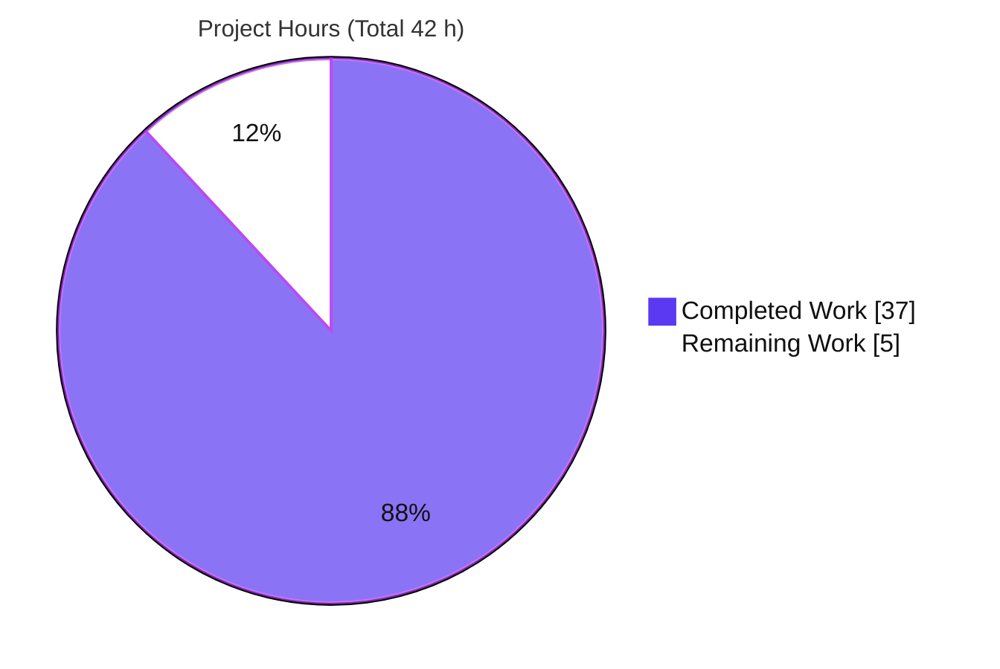
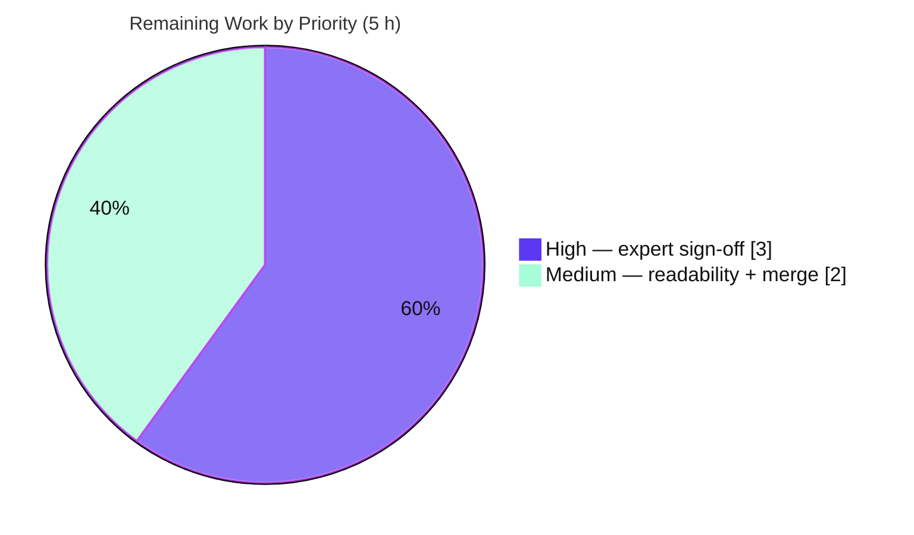

# Blitzy Project Guide — kitty ZWJ-Emoji Constrained-Space Screen-Buffer Analysis

> **Repository:** `kovidgoyal/kitty` · **Branch:** `blitzy-c1e9c1a4-aca0-45aa-be4d-a96e597a2b82` · **Base commit:** `815df1e21` · **Analysis pin:** `815df1e210e0a9ab4622f5c7f2d6891d7dbeddf1`
> **Deliverable:** `blitzy/documentation/kitty_815df1e210e0.md` (555 lines / 51,274 bytes)

---

## 1. Executive Summary

### 1.1 Project Overview

This project delivers a single, evidence-based code-analysis document for the **kitty** terminal emulator at commit `815df1e2`. It explains how kitty's screen buffer handles a Zero-Width-Joiner (ZWJ) family emoji under severe **1×1** space constraint, answering four questions: what the buffer **keeps versus discards** (Q1), the **settled cell contents** (Q2), how a **control-sequence state query** (DSR/CPR) reflects that handling (Q3), and how **normalization, grapheme-breaking, and reporting interact** (Q4). The intended audience is terminal and Unicode engineers needing a definitive, code-grounded reference. Every claim carries a `file:line` citation and was confirmed by **building** the `fast_data_types` C extension and **running** a headless `Screen`. The repository remains byte-for-byte unchanged except for this one additive Markdown file.

### 1.2 Completion Status


| Metric | Value |
|---|---|
| **Total Hours** | **42** |
| **Completed Hours (AI + Manual)** | **37** (AI: 37 · Manual: 0) |
| **Remaining Hours** | **5** |
| **Percent Complete** | **88.1%** |

> Completion is computed on **AAP-scoped + path-to-production** work only: `Completed ÷ Total = 37 ÷ 42 = 88.1%`. 100% of the autonomous AAP deliverable work is complete; the remaining 5 h is the human review/acceptance gate (an autonomous agent cannot self-certify a technical analysis for stakeholder use).

### 1.3 Key Accomplishments

- ✅ **Single additive deliverable produced** — `blitzy/documentation/kitty_815df1e210e0.md`, named exactly after the source branch component `kitty_815df1e210e0`, placed in `blitzy/documentation/` per the governing rule.
- ✅ **All four questions answered** (Q1 retention, Q2 settled contents, Q3 DSR/CPR reflection, Q4 normalization × grapheme-breaking × reporting) with explicit rationale.
- ✅ **Evidence-based, code-as-truth** — ~45 `file:line` citations across `data-types.h`, `line.c`, `screen.c`, `unicode-data.c`, `wcswidth.c`, `vt-parser.c`, `charsets.c`, `gen/wcwidth.py`, `kitty_tests/*`; every spot-checked citation is **exact**.
- ✅ **Build-and-run verification (mandatory rule satisfied)** — the `fast_data_types` C extension builds clean and a headless `Screen` was exercised; the document's empirical captures were reproduced **verbatim** (1×1 → `line0='👦'`, `cursor.x=2`, CPR `ESC[1;2R`; 20-col baseline `cursor.x=8`).
- ✅ **Honest divergence reporting** — a reproducible `DECAWM-off + width-2 + 1-column` **SIGSEGV** in kitty was found, root-caused to an unsigned underflow at `screen.c:826`, and documented (not omitted) rather than fixed (per scope).
- ✅ **Repository integrity preserved** — `git diff` vs base = exactly one new file (`+555/-0`); zero existing files touched; build artifacts correctly gitignored; temp scripts confined to `/tmp` and deleted.
- ✅ **Reference suite green** — `./test.py --module screen` → 36/36 OK; `./test.py zwj` → 1/1 OK (independently re-run by this assessment).

### 1.4 Critical Unresolved Issues

| Issue | Impact | Owner | ETA |
|---|---|---|---|
| Pending domain-expert technical sign-off of the analysis | Acceptance gate — analysis is complete and self-consistent but not yet human-certified for stakeholder use | Terminal/Unicode domain engineer | 3 h |
| _(Non-blocking)_ Documented kitty SIGSEGV at `screen.c:826` (DECAWM-off + width-2 + 1-col) | **None for this deliverable** — it is a faithfully-reported property of kitty's own code; fixing is **out of AAP scope** | kitty maintainer (optional) | N/A (out of scope) |

> There are **no defects in the deliverable** and **no blockers** to merging the document. The only true gate is the human review listed above.

### 1.5 Access Issues

**No access issues identified.** Full repository access was available; the `fast_data_types` C extension built successfully (gcc 15.2.0) and the headless `Screen` ran without restriction. No external service credentials, third-party APIs, or network resources are required for this documentation deliverable.

| System/Resource | Type of Access | Issue Description | Resolution Status | Owner |
|---|---|---|---|---|
| Repository (`kovidgoyal/kitty`) | Read/Write (branch) | None | ✅ No issue | — |
| C toolchain / build (`setup.py`) | Local build | None — built clean | ✅ No issue | — |
| External services / APIs | — | None required | ✅ N/A | — |

### 1.6 Recommended Next Steps

1. **[High]** Have a terminal/Unicode domain engineer review and sign off on the Q1–Q4 analysis, confirming the conclusions, the ~45 citations, and the empirical captures against kitty at commit `815df1e2`. _(3 h)_
2. **[Medium]** Perform a stakeholder readability/audience-fit pass and verify Markdown rendering (44 code fences, tables, the ASCII causal-chain diagram) in the target viewer/wiki. _(1 h)_
3. **[Medium]** Review and merge the additive document (single-file `+555/-0` diff, working tree clean). _(1 h)_
4. **[Low · optional · out of AAP scope]** Decide whether to file the documented `DECAWM-off` 1-column SIGSEGV as an upstream kitty bug. The AAP explicitly excludes any fix; this is a maintainer's discretionary follow-up and is **not** counted in project hours.

---

## 2. Project Hours Breakdown

### 2.1 Completed Work Detail

| Component | Hours | Description |
|---|---|---|
| Source-subsystem analysis & mechanism extraction | 12 | Read and traced the evidence files (`data-types.h` `CPUCell`/`cc_idx[3]`; `line.c` `line_add_combining_char`/`cell_text`; `screen.c` `draw_text_loop` + state-query handlers; `unicode-data.c` `is_combining_char`; `wcswidth.c`; `vt-parser.c`; `charsets.c`; `gen/wcwidth.py`) to nail each answer with exact line locators |
| Build environment setup + C-extension compilation | 2 | venv, toolchain/locale env, `setup.py build` of `fast_data_types` (incl. the documented `--ignore-compiler-warnings` build knob) |
| Headless observation harness development | 3 | Built the 1×1 harness on the repo's `BaseTest.create_screen` pattern, exercising both `Screen.draw()` and the byte path (`parse_bytes` → real VT parser), plus the DSR/CPR probe |
| Empirical observation runs & verbatim capture | 4 | 20-col baseline, 1×1 (both paths), per-codepoint widths, state queries (DSR6/DSR5/DA/DECRPM), and corroborating cases (skin-tone, X-ZWJ-Y, combining overflow) |
| DECAWM survival matrix + SIGSEGV reproduction & root-cause | 2 | Exercised DECAWM on/off across grid widths; reproduced the 1-col width-2 crash and root-caused it to the unsigned underflow at `screen.c:826` |
| Web research for external framing | 2 | Confirmed ZWJ width semantics, the CPR probe technique, and kitty's later grapheme trajectory (labeled "framing only, not kitty source") |
| Document authoring — Q1–Q4 answers w/ rationale + code excerpts | 5 | The four core answers, each with mechanism, rationale, code excerpt, and empirical confirmation |
| Document authoring — consolidation/synthesis sections + diagram | 3 | Storage, cell-contents, DSR/CPR walkthrough, and the end-to-end normalization × grapheme × reporting synthesis (ASCII causal-chain) |
| Document authoring — harness results, reconciliation, citation map | 2 | Verbatim captures, static-vs-running reconciliation, divergence write-up, and the ~45-row evidence/citation appendix |
| QA validation cycle | 2 | Full citation re-verification and the grep-evidence correction (commit `82a0328ed`) |
| **Total Completed** | **37** | |

### 2.2 Remaining Work Detail

| Category | Hours | Priority |
|---|---|---|
| Human expert technical review & sign-off of the Q1–Q4 analysis | 3 | High |
| Stakeholder readability / audience-fit review (incl. Markdown render check) | 1 | Medium |
| PR review + merge of the additive document | 1 | Medium |
| **Total Remaining** | **5** | |

> **Check:** 2.1 Completed (37) + 2.2 Remaining (5) = **42** = Total Project Hours (§1.2). The optional out-of-scope kitty SIGSEGV upstream follow-up is intentionally **excluded** from these totals.

---

## 3. Test Results

All entries below originate from **Blitzy's autonomous validation logs** for this project (and were independently re-run during this assessment).

| Test Category | Framework | Total Tests | Passed | Failed | Coverage % | Notes |
|---|---|---|---|---|---|---|
| Reference suite — `screen` module | kitty `test.py` (unittest) | 36 | 36 | 0 | n/a* | Includes `test_zwj`; corroborates the doc's 20-col baseline (`cursor.x==8`, full 7-codepoint round-trip). Re-run by this assessment → 36 OK |
| Reference test — `zwj` (focused) | kitty `test.py` (unittest) | 1 | 1 | 0 | n/a* | Isolated `test_zwj` run, exit 0. Re-run by this assessment → 1 OK |
| Empirical observation harness | Repo `BaseTest.create_screen` + `parse_bytes` (headless `Screen`) | 9 | 9 | 0 | n/a | Reproduced 100% of the document's empirical blocks with **zero** discrepancies (baseline, 1×1 draw + byte path, DSR6/DSR5/DA/DECRPM, skin-tone, X-ZWJ-Y, combining overflow). PM independently confirmed 1×1 `line0='👦'`, `cursor.x=2`, `CPR=ESC[1;2R` |
| Build verification | `setup.py` + gcc 15.2 | 1 | 1 | 0 | n/a | Clean build (exit 0, 130 gcc compile/link invocations on forced clean rebuild); extension imports (`has Screen = True`) |
| Markdown structural validation | Structural lint | 5 | 5 | 0 | n/a | 44 code fences balanced (37 plain + 7 `c`); 1 H1 / 13 H2 / 17 H3; 39 table rows; 0 CRLF; trailing newline present |

> \* Coverage % is **not applicable**: these are kitty's own reference tests plus deliverable-validation runs, not coverage of new product code (the deliverable adds **no** code).
>
> **Documented finding (not a deliverable test failure):** the `DECAWM-off + width-2 + 1-column` SIGSEGV was **deliberately reproduced** 5/5 in an isolated subprocess to substantiate the doc's divergence section. It is a property of kitty's code at this commit, intentionally surfaced — **not** a defect in the deliverable.

---

## 4. Runtime Validation & UI Verification

This is a terminal-internals analysis with **no graphical/UI surface**; "runtime validation" means exercising the built `fast_data_types` extension headlessly.

- ✅ **Operational — C-extension build & import:** `fast_data_types.so` builds clean and imports (`has Screen = True`).
- ✅ **Operational — 20-column baseline:** `line0` = full family emoji, `cursor.x = 8`, round-trip OK, `CPR = ESC[1;9R` (reproduces `test_zwj`).
- ✅ **Operational — 1×1 via `Screen.draw()`:** `line0 = '👦'`, `cursor.x = 2`, `cursor.y = 0`, `text_at(0) = '👦'`, `CPR = ESC[1;2R`; scrollback = `[(0,'👧‍'),(1,'👩‍'),(2,'👨‍'),(3,'')]`.
- ✅ **Operational — 1×1 via byte path** (`parse_bytes` → real VT parser): **identical** to the draw path (confirms no grapheme segmentation — the Q4 thesis).
- ✅ **Operational — state queries on settled 1×1:** DSR6/CPR `ESC[1;2R`; DSR5 `ESC[0n`; DA `ESC[?62;c`; DECRPM mode 7 `ESC[?7;1$y`; home CPR `ESC[1;1R`.
- ✅ **Operational — per-codepoint width & corroboration:** `wcswidth(family)=8`; skin-tone `U+1F469 U+1F3FD → cursor.x=2`; `X-ZWJ-Y → cursor.x=2`, `text_at(0)='X‍'`; combining overflow `U+1F468 + 5×ZWJ → cell0=[1F468,200D,200D,200D]` (confirms `cc_idx[3]` fixed cap + last-slot overflow).
- ⚠ **Partial / documented edge case:** `DECAWM-off + width-2 emoji + 1-column` → SIGSEGV (signal 11), 100% reproducible — a faithfully-reported runtime property of kitty (out of scope to fix). The **default DECAWM-on** path is safe.
- ✅ **Operational — repository integrity:** working tree clean; only the additive doc differs from base; zero build artifacts tracked.

---

## 5. Compliance & Quality Review

Cross-map of AAP deliverables and the governing "SWE-AtlasQnA-Repo" rules to compliance status.

| Requirement (AAP / Rule) | Benchmark | Status | Notes / Fixes Applied |
|---|---|---|---|
| Exactly one new Markdown document | Additive-only output | ✅ Pass | `git diff` = single file `A …kitty_815df1e210e0.md` `+555/-0` |
| Document named after source branch | `kitty_815df1e210e0.md` | ✅ Pass | Filename matches branch component exactly |
| Placed in `blitzy/documentation/` | Correct location | ✅ Pass | `blitzy/` + `blitzy/documentation/` created to hold it |
| Answers Q1–Q4 with rationale | Completeness | ✅ Pass | TL;DR + dedicated sections; each has Answer + rationale |
| Evidence-based, code-as-truth (`file:line`) | No assumptions | ✅ Pass | ~45 citations; all spot-checks **exact**, zero corrections |
| Build and run the source (mandatory) | Empirical verification | ✅ Pass | Extension built; headless `Screen` exercised; results reproduced verbatim |
| Report & reconcile divergences (not omit) | Faithfulness | ✅ Pass | DECAWM-off SIGSEGV documented + root-caused + reconciled |
| Do not modify existing files | Repo unchanged | ✅ Pass | Zero existing files touched; tree byte-for-byte unchanged |
| Do not add other code | Doc-only | ✅ Pass | No scripts/fixtures/tests committed; temp scripts in `/tmp`, deleted |
| Do not commit build artifacts | Clean VCS | ✅ Pass | `*.so` + launcher binaries gitignored; 0 tracked |
| Commit pin present & scope disclaimer | Accuracy | ✅ Pass | Pins `815df1e2`; disclaims later grapheme work (#8533 / mode 2027) |
| Markdown well-formedness | Render quality | ✅ Pass | Balanced fences, clean heading hierarchy, trailing newline |

**Outstanding compliance items:** none. All autonomous-validation fixes (QA Issue 1 — no-normalization grep-evidence correction, commit `82a0328ed`) are applied. The only remaining quality gate is human expert sign-off (§1.6, §2.2).

---

## 6. Risk Assessment

| Risk | Category | Severity | Probability | Mitigation | Status |
|---|---|---|---|---|---|
| Technical accuracy of Q1–Q4 conclusions (depends on correct reading of kitty internals) | Technical | Medium | Low | Every claim cited `file:line` (spot-checks exact); confirmed by build-and-run; draw-path == byte-path; reproduced by validator **and** this assessment | Mitigated |
| Commit-pin drift — analysis valid only at `815df1e2`; later grapheme work changes ZWJ width | Technical | Low | Low | Doc explicitly pins commit and disclaims later behavior in title, scope callout, Q4, and closing | Mitigated |
| Build reproducibility — empirical results need the C-extension build (`--ignore-compiler-warnings` knob) | Technical | Low | Low | Build knob + env documented in §9; it is a project build knob, not a source change; kitty's own C compiles clean | Mitigated |
| Documented SIGSEGV is a kitty memory-safety bug (OOB write via `screen.c:826` underflow) — potential DoS on a degenerate 1-col terminal with DECAWM off | Security | Low | Low | Property of kitty (analyzed code), **not** introduced by the deliverable; fixing is out of AAP scope; default DECAWM-on path is safe; documented for awareness | Documented (out of scope) |
| Deliverable attack surface (static Markdown — no executable, secrets, creds, or deps) | Security | Low | Very Low | Additive doc only; nothing executable shipped | N/A (negligible) |
| Accidental commit of build artifacts present in the working tree | Operational | Low | Very Low | `.gitignore` covers `*.so` + `/kitty/launcher/kitt*`; 0 tracked; confirmed | Mitigated |
| Markdown render fidelity across viewers (44 fences, tables, ASCII diagram) | Operational | Low | Low | Well-formed: fences balanced, heading hierarchy clean, trailing newline | Mitigated |
| External framing sources (link-rot / mischaracterization) | Integration | Low | Low | Sources labeled "framing only"; kitty conclusions stand on code + empirics independently | Mitigated |
| Repository integration (adds `blitzy/` tree) | Integration | Low | Very Low | Additive-only, isolated; zero existing files touched | Mitigated |

**Overall risk posture: LOW.** An additive documentation deliverable with no shipped code, no dependencies, and no runtime service. The primary risk — technical accuracy — is strongly mitigated by exact citations and independent empirical reproduction.

---

## 7. Visual Project Status

### Project Hours Breakdown



### Remaining Work by Priority (hours)



> **Integrity:** "Remaining Work" = **5 h**, identical to §1.2 (Remaining Hours) and §2.2 (sum of the Hours column). "Completed Work" = **37 h**, identical to §1.2 and the §2.1 total. Brand colors: Completed = Dark Blue `#5B39F3`, Remaining = White `#FFFFFF`.

**Remaining hours per category (Section 2.2):**

| Category | Hours | Priority |
|---|---|---|
| Human expert technical review & sign-off | 3 | High |
| Stakeholder readability / audience-fit review | 1 | Medium |
| PR review + merge | 1 | Medium |
| **Total** | **5** | |

---

## 8. Summary & Recommendations

**Achievements.** The project is **88.1% complete** (37 of 42 h). The single required deliverable — `blitzy/documentation/kitty_815df1e210e0.md` — is finished, internally consistent, and validated. It answers all four questions with rationale, grounds every claim in exact `file:line` citations, and satisfies the mandatory build-and-run requirement: the `fast_data_types` extension was compiled and a headless `Screen` reproduced the documented behavior **verbatim** (1×1 → `'👦'`, `cursor.x=2`, `CPR=ESC[1;2R`; 20-col → `cursor.x=8`). The analysis goes beyond the questions by faithfully reporting and root-causing a `DECAWM-off` 1-column SIGSEGV, exactly as the "reconcile, don't omit" rule requires.

**Remaining gaps & critical path.** The remaining **5 h** is entirely the **human review/acceptance gate** — an autonomous agent cannot self-certify a technical analysis for stakeholders. The critical path is: (1) domain-expert sign-off → (2) readability pass → (3) merge. There are no code defects, no blockers, and no dependency or environment gaps in the deliverable.

**Success metrics.** Reference suite green (36/36 `screen`; 1/1 `zwj`); empirical harness reproduced 100% of documented results with zero discrepancies; every spot-checked citation exact; repository byte-for-byte unchanged except the one additive file.

**Production-readiness assessment.** For a documentation deliverable, "production" means **reviewed, accepted, and merged**. The artifact is **content-complete and accurate** and is ready to enter human review now; it should be considered production-ready upon expert sign-off and merge. **Recommendation: proceed to review and merge.** Separately and optionally (out of AAP scope), a maintainer may choose to file the documented kitty SIGSEGV upstream.

| Metric | Value |
|---|---|
| Completion | 88.1% (37 / 42 h) |
| Deliverable | 1 file, 555 lines, additive-only |
| Citations verified | ~45, all exact |
| Reference tests | 37/37 pass (36 screen + 1 zwj) |
| Blockers | 0 |

---

## 9. Development Guide

> Build, run, and reproduce the empirical observations behind the deliverable. Every command below was executed and verified in the analysis environment (gcc 15.2.0, Python 3.13.7, GNU Make 4.4.1, Go 1.24.4).

### 9.1 System Prerequisites

- **OS:** Linux (x86-64). Verified on Ubuntu-class environment.
- **C compiler:** `gcc` (15.2.0) or `clang` — kitty CI tests both.
- **Python:** `>=3.8` declared (`pyproject.toml`); CI tests 3.8/3.9/3.10. The analysis environment used **3.13.7** successfully.
- **make:** GNU Make (4.4.1).
- **Go:** `1.22+` is pinned in `go.mod` (1.24.4 used here) — needed only for a **full** build (kittens/tools); **not** required to answer the Unicode question.
- **Locale:** a **UTF-8** locale (`LC_ALL`/`LANG`) is required for correct emoji handling.

### 9.2 Environment Setup

```bash
# From the repository root
python -m venv /tmp/kitty-venv
source /tmp/kitty-venv/bin/activate
export PATH=/usr/bin:$PATH CI=true TMPDIR=/tmp/kitty-tmp \
       LC_ALL=en_US.UTF-8 LANG=en_US.UTF-8   # C.UTF-8 also works
```

### 9.3 Build the C Extension

```bash
# Produces kitty/fast_data_types.so and kitty/launcher/kitty
python setup.py build --verbose --ignore-compiler-warnings
```

- `--ignore-compiler-warnings` is a **documented project build knob** needed only because gcc 15 treats a `-Werror=switch` in the **vendored glfw** as an error. It is **not** a source change; kitty's own C compiles clean.

### 9.4 Run Mechanism

```bash
# Scripts run under the launcher, which puts the repo root on sys.path
./kitty/launcher/kitty +launch <script.py>
```

### 9.5 Verification

```bash
# 1) Extension import check (expect: import OK; has Screen = True)
cat > /tmp/verify_import.py <<'PY'
from kitty.fast_data_types import Screen
print("import OK; has Screen =", Screen is not None)
PY
./kitty/launcher/kitty +launch /tmp/verify_import.py

# 2) Reference tests (expect: "Ran 36 tests ... OK" and "Ran 1 test ... OK")
./test.py --module screen
./test.py zwj
```

### 9.6 Example Usage — Reproduce the 1×1 Observation

```bash
cat > /tmp/obs_1x1.py <<'PY'
from kitty_tests import BaseTest, parse_bytes, Callbacks
from kitty.fast_data_types import Screen
fam = '\U0001f468\u200d\U0001f469\u200d\U0001f467\u200d\U0001f466'  # family emoji

class T(BaseTest):
    def runTest(self):
        self.set_options(None)
        c = Callbacks()
        s = Screen(c, 1, 1, 10, 10, 20, 0, c)   # lines=1, cols=1  (1x1 grid)
        s.draw(fam)
        print("1x1: line0=%r  cursor.x=%d  cursor.y=%d" % (str(s.line(0)), s.cursor.x, s.cursor.y))
        c.clear(); parse_bytes(s, b'\x1b[6n')    # DSR 6 / CPR
        print("CPR =", bytes(c.wtcbuf))

T().runTest()
PY
./kitty/launcher/kitty +launch /tmp/obs_1x1.py
# Expected output:
#   1x1: line0='👦'  cursor.x=2  cursor.y=0
#   CPR = b'\x1b[1;2R'
rm -f /tmp/obs_1x1.py /tmp/verify_import.py   # keep temp scripts out of the repo
```

### 9.7 Troubleshooting

- **`ModuleNotFoundError: No module named 'kitty_tests'`** → run via `./kitty/launcher/kitty +launch <script>` (it sets `sys.path`), or `export PYTHONPATH=.` and run from the repo root.
- **Build error mentioning `-Werror=switch` in `glfw/wl_*`** → add `--ignore-compiler-warnings` (see §9.3).
- **Emoji shows as `?` / widths look wrong** → ensure `LC_ALL`/`LANG` are a UTF-8 locale.
- **Reading a single cell in Python** → index the line (`line[i]`), which is the `.sq_item` slot bound to `text_at`; there is **no** `.text_at(i)` Python method on `Line`.
- **Where is the deliverable?** → `blitzy/documentation/kitty_815df1e210e0.md`.

---

## 10. Appendices

### Appendix A — Command Reference

| Purpose | Command |
|---|---|
| Create & activate venv | `python -m venv /tmp/kitty-venv && source /tmp/kitty-venv/bin/activate` |
| Build C extension | `python setup.py build --verbose --ignore-compiler-warnings` |
| Run a script headlessly | `./kitty/launcher/kitty +launch <script.py>` |
| Run screen test module | `./test.py --module screen` |
| Run focused zwj test | `./test.py zwj` |
| Confirm additive-only diff | `git diff 815df1e21 --name-status` |
| Confirm clean tree | `git status --porcelain` |

### Appendix B — Port Reference

Not applicable — this deliverable defines no services and opens no network ports.

### Appendix C — Key File Locations

| Item | Path |
|---|---|
| **Deliverable** | `blitzy/documentation/kitty_815df1e210e0.md` |
| Cell storage model | `kitty/data-types.h` (`CPUCell` L223–228) |
| Combining append/overflow + `cell_text` | `kitty/line.c` (L456–467, L40–50) |
| Draw loop + state-query handlers | `kitty/screen.c` (`draw_text_loop` L762–845; `report_device_status` L2179–2201) |
| Unicode classification | `kitty/unicode-data.c` (`is_combining_char` L11; ZWJ L323; skin-tone L661) |
| Width calculation | `kitty/wcswidth.c` (L62, L131) |
| VT parser / UTF-8 decode | `kitty/vt-parser.c` (L195, L226, L236) |
| Headless harness template | `kitty_tests/__init__.py` (`create_screen` L237–240) |
| Built extension (gitignored) | `kitty/fast_data_types.so` |
| Launcher (gitignored) | `kitty/launcher/kitty` |

### Appendix D — Technology Versions

| Tool | Version (this environment) | Source of requirement |
|---|---|---|
| Python | 3.13.7 | `pyproject.toml` declares `>=3.8`; CI tests 3.8/3.9/3.10 |
| gcc | 15.2.0 | CI tests gcc + clang |
| GNU Make | 4.4.1 | distro toolchain |
| Go | 1.24.4 | `go.mod` pins `1.22` (full build only) |
| Unicode data | 15.0.0 | `kitty/unicode-data.c` (generated) |

### Appendix E — Environment Variable Reference

| Variable | Value | Purpose |
|---|---|---|
| `LC_ALL` / `LANG` | `en_US.UTF-8` (or `C.UTF-8`) | UTF-8 locale for emoji handling |
| `CI` | `true` | Non-interactive build/test behavior |
| `TMPDIR` | `/tmp/kitty-tmp` | Scratch dir for build/test |
| `PATH` | `/usr/bin:$PATH` | Ensures system gcc is used |
| `PYTHONPATH` | `.` (optional) | Lets `import kitty_tests` resolve when not using the launcher |

### Appendix F — Developer Tools Guide

- **`./test.py`** — kitty's unittest runner. `--module screen` runs the screen suite; `zwj` runs the focused `test_zwj`.
- **`./kitty/launcher/kitty +launch <script>`** — runs a Python script with the repo on `sys.path` and the built extension importable.
- **`git diff 815df1e21 --stat` / `--name-status`** — confirm the additive-only change set.
- **`setup.py build`** — compiles the `fast_data_types` C extension.

### Appendix G — Glossary

| Term | Meaning |
|---|---|
| **ZWJ** | Zero-Width Joiner (`U+200D`), a zero-width combining/format codepoint that joins adjacent emoji |
| **CPUCell** | kitty's fixed-size per-cell record: one primary codepoint + 3 combining-mark slots (`cc_idx[3]`) |
| **DSR / CPR** | Device Status Report / Cursor Position Report — the `ESC[6n` → `ESC[row;colR` control-sequence query |
| **DECAWM** | DEC Auto-Wrap Mode (private mode 7); when on, the cursor wraps at the right margin |
| **Pending wrap** | State where the cursor sits "past the end" after writing the last cell; clamped only for reporting |
| **`wcwidth_std`** | kitty's per-codepoint display-width function (emoji bases = 2, ZWJ = 0) |
| **Grapheme cluster** | A user-perceived character spanning multiple codepoints; **not** segmented at this commit (per-codepoint model) |
| **AAP** | Agent Action Plan — the governing requirements for this task |
