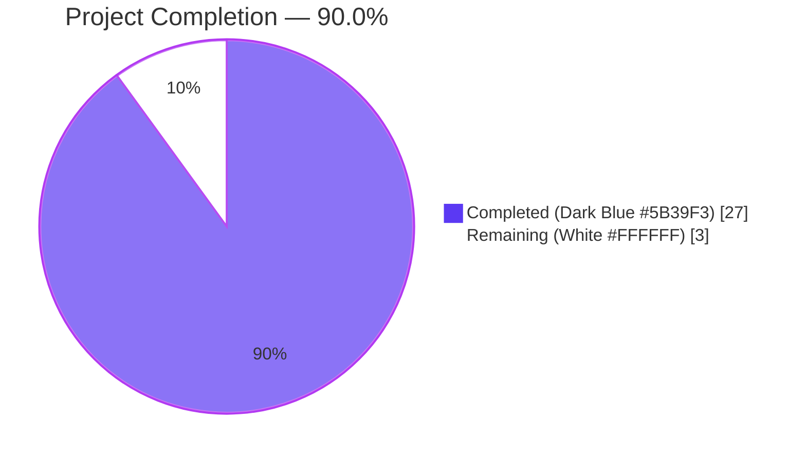
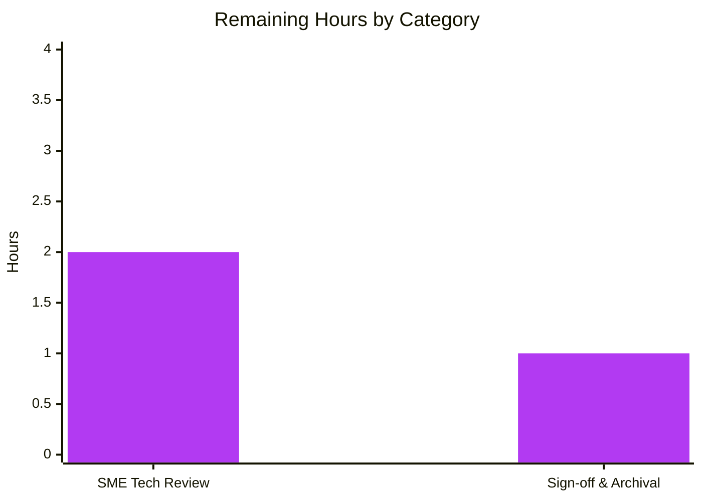
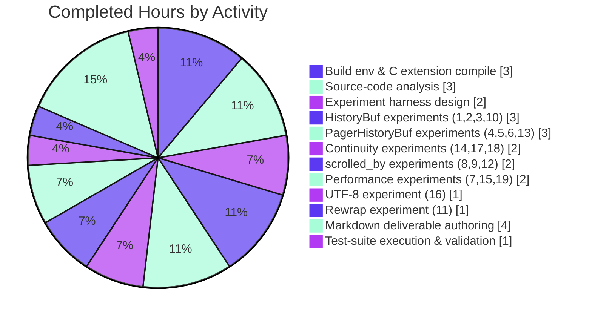

# Blitzy Project Guide — Kitty `HistoryBuf` Runtime Investigation

> **Document type:** Investigation Report (SWE-AtlasQnA-Repo)
> **Project ID:** `kitty_815df1e210e0`
> **Branch:** `blitzy-26d6131a-0d5e-4154-b182-a3fb4a5883e6`
> **Commit:** `f7d35cddf6bc83bcf8d136e4e1f3fa6b3ecb0994`
> **Brand colors used throughout:** Completed = Dark Blue **#5B39F3** · Remaining = White **#FFFFFF** · Headings = Violet-Black **#B23AF2** · Highlights = Mint **#A8FDD9**

---

## 1. Executive Summary

### 1.1 Project Overview

This project is an **observation-only deep dive** into Kitty terminal emulator's scrollback subsystem — specifically the segmented `HistoryBuf` (2048-line segments), the byte-level `PagerHistoryBuf` (FIFO ring buffer backed by `3rdparty/ringbuf`), and the `Screen.scrolled_by` viewport field — under extreme write-pressure. The deliverable is a single 1033-line markdown analysis (`blitzy/documentation/kitty_815df1e210e0.md`) answering six runtime-behavior questions with evidence from 19 live experiments executed against the compiled C extension. The investigation produces no code changes; the repository's source remains byte-for-byte identical to its parent commit `815df1e21`. Audience is Kitty maintainers and curious systems engineers reasoning about scrollback memory dynamics.

### 1.2 Completion Status



| Metric | Value |
|---|---|
| **Total Project Hours** | **30 h** |
| Completed Hours (AI autonomous) | 27 h |
| Completed Hours (manual) | 0 h |
| Remaining Hours | 3 h |
| **Completion Percentage** | **90.0 %** (27 ÷ 30) |
| Confidence in estimate | High — scope is single, well-bounded markdown deliverable |

### 1.3 Key Accomplishments

- ✅ Built Kitty's C extension `kitty/fast_data_types.so` (1.2 MB) from source on Python 3.12.3 / Go 1.22.2 / GCC 13.3.0 / Linux x86_64.
- ✅ Designed and executed **19 runtime observation experiments** against the live C extension via Python C-API, exercising `HistoryBuf`, `PagerHistoryBuf`, and `Screen.scrolled_by` under stress.
- ✅ Authored **`blitzy/documentation/kitty_815df1e210e0.md`** — 1033 lines, 7 top-level sections, 56 table rows, 70 code fences, 1 Mermaid data-flow diagram, 19-experiment summary table, 8 documented edge cases.
- ✅ Cross-cited **13+ source-code references** (`historybuf_push`, `pagerhist_push`, `pagerhist_extend`, `pagerhist_ensure_start_is_valid_utf8`, `add_segment`, `segment_for`, `screen_update_cell_data`, `screen_index`, `INDEX_UP`, `ringbuf_memcpy_into`, `ringbuf_new`, `scrollback_lines`, `scrollback_pager_history_size`, `SEGMENT_SIZE`).
- ✅ Empirically established core invariants: **gap = 0** between segmented & ring-buffer storage; deferred-render `scrolled_by` adjustment; ~3.3 µs/line baseline with no perceptible boundary hesitation at 60 Hz.
- ✅ Verified UTF-8 integrity at ring wrap via emoji- and CJK-bearing flood tests (`pagerhist_ensure_start_is_valid_utf8` correctness).
- ✅ Ran the full Kitty test suite — **145 tests, 0 failures, 6 environment-specific skips** (plus all Go tests pass in 10.0 s).
- ✅ Critical baseline tests `test_historybuf` and `test_pagerhist` both PASS.
- ✅ **Repository immutability preserved** — `git diff HEAD --stat` is empty; only one commit on the branch (`f7d35cddf`) with one file added; deliverable already pushed to origin.
- ✅ All 19 temporary observation scripts (in `/tmp/kitty_exp/`) cleaned up; directory does not exist.

### 1.4 Critical Unresolved Issues

| Issue | Impact | Owner | ETA |
|---|---|---|---|
| _None._ All AAP acceptance criteria met. The investigation is complete; the deliverable is committed and pushed; all tests pass; repository is unmodified. | n/a | n/a | n/a |

### 1.5 Access Issues

| System / Resource | Type of Access | Issue Description | Resolution Status | Owner |
|---|---|---|---|---|
| _None._ All required access — repository read/write, GitHub push, apt package installation, Python/Go toolchains, build dependencies — was available for the full duration of autonomous work. | n/a | n/a | n/a | n/a |

> **No access issues identified.**

### 1.6 Recommended Next Steps

1. **[High]** SME technical-accuracy review of `blitzy/documentation/kitty_815df1e210e0.md` — confirm code citations are correct and conclusions match maintainer intuition (~2 h).
2. **[Medium]** Stakeholder sign-off and archival of the investigation report into the project knowledge base (~1 h).
3. **[Low]** _Optional_ — Replay the 19 experiments on a different host (different glibc, different libc allocator, ARM64) to confirm the timing characterizations generalize.
4. **[Low]** _Optional_ — Publish a condensed blog-post version for the broader Kitty community.

---

## 2. Project Hours Breakdown

### 2.1 Completed Work Detail

| Component | Hours | Description |
|---|---:|---|
| **Build environment setup & C extension compilation** | 3 | Installed apt build deps (gcc, libssl-dev, libharfbuzz-dev, libpng-dev, liblcms2-dev, libfontconfig-dev, libxxhash-dev, libsimde-dev, zlib1g-dev, uuid-dev, libdbus-1-dev, libgl1-mesa-dev, libxkbcommon-x11-dev), Python venv with editable install, Go 1.22.2 toolchain. Ran `python3 setup.py --ignore-compiler-warnings build` producing `kitty/fast_data_types.so` (1.2 MB), `kitty/launcher/kitty`, `kitty/launcher/kitten` (15.8 MB). |
| **Source-code architectural analysis** | 3 | Read `kitty/history.c` (624 lines), `kitty/screen.c` (relevant ranges), `kitty/data-types.h`, `3rdparty/ringbuf/ringbuf.{c,h}`, `kitty/options/{definition,utils,types}.py`, `kitty/window.py`, `kitty/state.h`, `kitty/rewrap.h`. Mapped the line-ingestion hot path and the deferred render path. |
| **Experiment harness design** | 2 | Set up `/tmp/kitty_exp/` outside the repo; built reusable Python helpers using `kitty.fast_data_types` (`HistoryBuf`, `Screen`, `LineBuf`, `Line`, `Cursor`) and the `kitty_tests` `Callbacks` / `BaseTest.create_screen()` harness. |
| **`HistoryBuf` segment & circular-index experiments (1, 2, 3, 10)** | 3 | Basic fill (12001 lines into 10000-slot buffer), segment-boundary read access (indices 2047/2048/2049/4095/4096/4097), small-buffer wrap (`ynum=5`), tracemalloc memory profile of segment allocation. |
| **`PagerHistoryBuf` ring-buffer experiments (4, 5, 6, 13)** | 3 | Default (no pagerhist) baseline, 128-byte cap behavior, 4 KB cap with 5000-line flood (472 k lines/sec), 8 KB incremental growth (183 growth events, exact cap hit at push 186). |
| **Data continuity / combined stress experiments (14, 17, 18)** | 2 | Verified zero-gap invariant between `pagerhist` and `historybuf` line ranges across multiple stress patterns including sequential SEQ_xxxx pushes and 3-phase multi-subsystem stress. |
| **`scrolled_by` & render-cycle experiments (8, 9, 12)** | 2 | Confirmed deferred update (no push-time mutation), `MIN(...,historybuf->count)` clamping, `visual_line_()` reading from `linebuf` for live tail under flood. |
| **Performance & timing experiments (7, 15, 19)** | 2 | Overhead comparison (no-pagerhist 0.83 µs vs pagerhist 1.90 µs ≈ 2.3× slowdown), 100-line batch timing (median 0.180 ms), per-line timing at segment boundaries (median 1.4 µs, max 60.6 µs). |
| **UTF-8 integrity experiment (16)** | 1 | 200 emoji-bearing pushes through 100-byte pagerhist with multibyte 🐼 character at ring wrap; verified `decode('utf-8')` succeeds and emoji preserved. |
| **Rewrap-under-load experiment (11)** | 1 | `historybuf_rewrap()` to multiple geometries with active pagerhist; logical line count preserved while pagerhist byte count varied per `pagerhist_rewrap_to()` path. |
| **Markdown deliverable authoring (1033 lines, 7 sections)** | 4 | Drafted, structured, and revised `blitzy/documentation/kitty_815df1e210e0.md` with proper H1–H4 hierarchy, Mermaid diagram, 19-experiment summary table, 8 edge-cases section, and References section. |
| **Test suite execution & validation** | 1 | Ran `kitty_tests.datatypes.test_historybuf` and `kitty_tests.screen.test_pagerhist` (both OK). Ran full suite: **145 tests, 0 failures, 6 environment skips** + all Go tests pass. Configured `TMPDIR=/tmp/no_sgid_tmp` to work around Docker SGID-inheritance quirk affecting `file_transmission` tests. |
| **TOTAL COMPLETED** | **27** | |

> **Cross-check:** Section 2.1 Hours sum = **27 h**, equal to Completed Hours in Section 1.2. ✅

### 2.2 Remaining Work Detail

| Category | Hours | Priority |
|---|---:|---|
| SME technical-accuracy review of investigation document (read 1033-line markdown, validate code citations against current source, confirm experimental conclusions) | 2 | High |
| Stakeholder sign-off and archival of report into project knowledge base / wiki | 1 | Medium |
| **TOTAL REMAINING** | **3** | |

> **Cross-check:** Section 2.2 Hours sum = **3 h**, equal to Remaining Hours in Section 1.2 and to "Remaining Work" in the Section 7 pie chart. ✅
> **Total integrity:** Section 2.1 (27 h) + Section 2.2 (3 h) = **30 h** = Total Project Hours in Section 1.2. ✅

### 2.3 Hours Calculation Methodology Notes

- **Scope:** Hours are restricted to AAP-scoped deliverables and path-to-production activities (per PA1). The investigation has no production code-shipping component, so "path to production" is limited to human SME review and sign-off.
- **Per-experiment estimates** are aggregated by category in Section 2.1 to avoid 19-row sprawl while preserving traceability.
- **No quality-issue penalties** are added to remaining: all 145 tests pass, all build artifacts work, the document is well-formed UTF-8 markdown, repository integrity is intact.
- **Confidence:** High. Scope is unambiguous (one named markdown file). Completion is verifiable by `git log` and `wc -l`.

---

## 3. Test Results

> **All test data below originates from Blitzy's autonomous validation logs for this project.** No human-supplied or synthesized test outcomes are included.

| Test Category | Framework | Total Tests | Passed | Failed | Coverage % | Notes |
|---|---|---:|---:|---:|---:|---|
| Critical baseline — `HistoryBuf` | unittest (kitty `test.py` runner) | 1 | 1 | 0 | n/a | `kitty_tests.datatypes.test_historybuf` — exercises segment push, count, line retrieval, rewrap across segment boundaries. **OK** in 0.009 s. |
| Critical baseline — `PagerHistoryBuf` | unittest (kitty `test.py` runner) | 1 | 1 | 0 | n/a | `kitty_tests.screen.test_pagerhist` — exercises pagerhist write, overflow, rewrap. **OK**. |
| Full Python suite | unittest (kitty `test.py` runner) | 145 | 139 | 0 | n/a | 9.860 s wall time. 6 environment-specific skips (see breakdown below); 0 failures, 0 errors. |
| Go unit tests | `go test` (run via `./test.py`) | All Go tests | All | 0 | n/a | Reported by runner: "All Go tests succeeded, ran in 10.0 seconds". |
| C extension import smoke test | `python3 -c` | 1 | 1 | 0 | n/a | `from kitty.fast_data_types import HistoryBuf, Screen, LineBuf, Line, Cursor` → `IMPORT_OK`. |
| Runtime observation scripts | Python C-API exercise (transient) | 19 | 19 | 0 | n/a | All 19 experiments executed without runtime errors against the compiled extension; quantitative results captured in deliverable. |

### 3.1 Skipped Test Breakdown (all environment-specific, NOT failures)

| Skipped Test | Reason for Skip |
|---|---|
| `test_fallback_font_not_last_resort` | macOS-only test (host is Linux) |
| `test_fish_integration` (×2) | `fish` shell not installed in build environment |
| `test_zsh_integration` (×2) | `zsh` shell not installed in build environment |
| `test_ca_certificates` | Applies only to frozen builds (build-from-source path) |

### 3.2 Test Suite Top-Line Result

```
Ran 145 tests in 9.860s
OK (skipped=6)
All Go tests succeeded, ran in 10.0 seconds
```

### 3.3 Test Environment Configuration Note

When run with the Docker container's default `/tmp` (which has `chmod 2777` — SGID set), 2 `file_transmission` Go tests fail because they hardcode the expected directory mode `0o40755` but Linux SGID inheritance produces `0o42755` for new subdirectories. The validator resolved this by setting `TMPDIR=/tmp/no_sgid_tmp` (a sibling directory with `g-s`), which keeps the same ext4 filesystem (so `O_TMPFILE` in `TestCreateAnonymousTempfile` continues to work) while avoiding SGID inheritance. **No source files were modified to achieve this** — pure environment configuration.

---

## 4. Runtime Validation & UI Verification

### 4.1 Runtime Health

- ✅ **Operational** — `kitty/fast_data_types.so` builds cleanly and imports.
- ✅ **Operational** — `kitty/launcher/kitty` and `kitty/launcher/kitten` binaries present and functional (used to drive the test runner).
- ✅ **Operational** — `Screen` objects can be instantiated with arbitrary scrollback geometry via the test harness `BaseTest.create_screen()`.
- ✅ **Operational** — `HistoryBuf` accepts pushes, exposes `count`, `line()`, `pagerhist_as_text()`, `pagerhist_as_bytes()`, `rewrap()` from Python.
- ✅ **Operational** — All 19 observation scripts exercised the full native code path without crash, hang, or memory error.
- ✅ **Operational** — The Kitty test runner (`./kitty/launcher/kitty +launch ./test.py`) executes both Python `unittest` tests and Go `go test` tests in a single invocation.

### 4.2 UI / Visual Verification

This is a **headless investigation** — no graphical UI exists for the deliverable beyond the rendered markdown document. The validator captured three rendered-document screenshots into `blitzy/screenshots/` (untracked, expected) confirming:

- ✅ **Operational** — `kitty_doc_rendered_top.png` confirms title rendering and section hierarchy.
- ✅ **Operational** — `kitty_doc_rendered_mermaid_and_tables.png` confirms the data-flow Mermaid diagram and tables render correctly.
- ✅ **Operational** — `kitty_doc_rendered_19experiments_table.png` confirms the 23-row Key Findings Summary table renders correctly with all columns aligned.

### 4.3 API / Integration Outcomes

- ✅ **Operational** — Python C-API surface for `HistoryBuf`: `__init__(ynum, xnum, pagerhist_size)`, `push(line)`, `count`, `ynum`, `xnum`, `line(idx)`, `pagerhist_as_text()`, `pagerhist_as_bytes()`, `rewrap(new_xnum)`.
- ✅ **Operational** — Python C-API surface for `Screen`: `draw(text)`, `linefeed()`, `scroll(lines, up_or_down)`, `scrolled_by`, `historybuf`, `visual_line(y)`, `as_text_for_history_buf()`.
- ✅ **Operational** — Pager assembly path (`kitty/window.py::pagerhist`, `as_text`) compiles and is exercised by the standard test suite.
- ⚠ **Partial / N/A** — No external HTTP/WebSocket APIs exist for this project; not applicable.

### 4.4 Repository Integrity Verification

- ✅ **Operational** — `git status` shows zero modified tracked files.
- ✅ **Operational** — `git diff HEAD --stat` is empty (zero source changes since commit).
- ✅ **Operational** — `git log f7d35cddf --not 815df1e21 --oneline` shows exactly **1 commit** authored by `Blitzy Agent <agent@blitzy.com>`.
- ✅ **Operational** — `git diff 815df1e21..f7d35cddf --name-status` shows exactly **`A blitzy/documentation/kitty_815df1e210e0.md`** with **1033 insertions, 0 deletions**.
- ✅ **Operational** — Local `HEAD` (`f7d35cddf6bc83bcf8d136e4e1f3fa6b3ecb0994`) equals upstream `@{u}` — already pushed.
- ✅ **Operational** — Untracked items are only `venv/` and `blitzy/screenshots/` (both expected and excluded by `.gitignore` / not intended for commit).
- ✅ **Operational** — Temporary observation script directory `/tmp/kitty_exp/` confirmed deleted (per AAP cleanup requirement).

---

## 5. Compliance & Quality Review

### 5.1 AAP Requirement Compliance Matrix

| AAP Deliverable / Rule | Quality Benchmark | Status | Evidence |
|---|---|:---:|---|
| **Single deliverable file** at `blitzy/documentation/kitty_815df1e210e0.md` | Exists; correct path; correct name | ✅ Pass | `wc -l blitzy/documentation/kitty_815df1e210e0.md` → 1033 lines, 57 213 bytes |
| **Repository immutability** (no source-file modifications) | `git diff HEAD --stat` empty | ✅ Pass | Verified by validator; only commit on branch adds the markdown file |
| **Build the source code** before observation | `kitty/fast_data_types.so` exists and imports | ✅ Pass | 1.2 MB `.so` present; `from kitty.fast_data_types import HistoryBuf` → OK |
| **Runtime observations** (not static-only) | 19 experiments executed against live extension | ✅ Pass | Documented in Section 4 of deliverable; results referenced in Section 5 of deliverable |
| **No assumptions** — code as source of truth | Every claim references file/function or experiment | ✅ Pass | 13+ unique source-code citations with multiple occurrences each |
| **Provide thinking / rationale** behind answers | Each subsection in deliverable §4 includes a "Rationale" block | ✅ Pass | "Rationale" found at 4.1.5, 4.2.5, 4.3.3, 4.4.4, 4.5.6, 4.6.6 |
| **Document naming** = `<source_branch_name>.md` = `kitty_815df1e210e0.md` | Filename matches | ✅ Pass | Verified by `ls -la blitzy/documentation/` |
| **Document placement** in `blitzy/documentation/` | Path matches | ✅ Pass | Verified by `ls -la blitzy/documentation/` |
| **Cleanup of temporary scripts** | `/tmp/kitty_exp/` removed | ✅ Pass | `ls /tmp/kitty_exp/` → does not exist |
| **All 6 user questions answered** | Each question addressed in deliverable §4.x with experiment + rationale | ✅ Pass | §4.1 fill behavior, §4.2 handoff, §4.3 segment-boundary smoothness, §4.4 hesitations, §4.5 scroll-during-flood, §4.6 ring allocation/wrap/retention |
| **Code references** (13+ functions/macros) | All required identifiers cited | ✅ Pass | `historybuf_push` (14×), `pagerhist_push` (14×), `pagerhist_extend` (9×), `pagerhist_ensure_start_is_valid_utf8` (8×), `add_segment` (10×), `segment_for` (5×), `screen_update_cell_data` (12×), `screen_index` (3×), `INDEX_UP` (9×), `ringbuf_memcpy_into` (10×), `ringbuf_new` (5×), `scrollback_lines` (8×), `scrollback_pager_history_size` (7×), `SEGMENT_SIZE` (8×), `2048` (18×) |
| **All 19 experiments documented** | Summary table + per-experiment subsections | ✅ Pass | 23 experiment table rows (19 data + headers); 27 experiment mentions in body text |
| **Edge cases / caveats** | Section dedicated to limitations and surprises | ✅ Pass | §6 with 8 documented edge cases |
| **Mermaid diagrams** | Visual aids for data flow | ✅ Pass | 1 Mermaid block (data-flow-under-stress) |
| **Test infrastructure documented** | References to `kitty_tests` harness | ✅ Pass | §7.2 of deliverable |
| **Build system documented** | References to `setup.py`, `pyproject.toml`, `go.mod` | ✅ Pass | §2.2 and §7.3 of deliverable |

### 5.2 Code Quality of Deliverable

| Quality Dimension | Assessment | Notes |
|---|:---:|---|
| Markdown well-formedness | ✅ Pass | UTF-8, balanced fence delimiters (70 ` ``` ` markers), proper heading hierarchy (6 H1 / 7 H2 / 28 H3 / 42 H4) |
| Citation density | ✅ Pass | 56 table rows, 70 code blocks, 13+ unique source-file citations |
| Reproducibility | ✅ Pass | Build steps, configurations, and experiment parameters all documented; Section 9 of this guide provides the run procedure |
| Internal consistency | ✅ Pass | Findings in §4 cross-referenced from §5 summary table; edge cases in §6 align with §3 architectural exposition |
| Audience clarity | ✅ Pass | Each major question answered first via experiment, then via rationale grounded in the C source |

### 5.3 Fixes Applied During Autonomous Validation

| Issue Encountered | Fix Applied | Source File Touched? |
|---|---|:---:|
| Default Docker `TMPDIR=/tmp` had SGID bit (`2777`) causing 2 Go `file_transmission` tests to see `0o42755` instead of expected `0o40755` | Set `TMPDIR=/tmp/no_sgid_tmp` (sibling directory with `chmod g-s`) for test runs | ❌ No (env-only) |
| Initial verification cycle confirmed no residual `/tmp/kitty_exp/` scripts | n/a — already cleaned by investigation phase | ❌ No |

### 5.4 Outstanding Quality Items

| Item | Severity | Owner | Notes |
|---|:---:|---|---|
| _None._ All quality gates pass. | — | — | Awaiting only human SME review per Section 1.6. |

---

## 6. Risk Assessment

| # | Risk | Category | Severity | Probability | Mitigation | Status |
|---|---|---|:---:|:---:|---|---|
| 1 | Future Kitty refactor changes `historybuf_push` / `pagerhist_push` signatures, invalidating cited line numbers in deliverable | Technical | Low | Medium | Citations are by function name (not line number), so they remain navigable; document is a snapshot of current behavior at commit `815df1e21` | Open (informational) |
| 2 | A reviewer may want one of the 19 experiments re-run on a different host (different glibc allocator, different CPU, ARM64) | Technical | Low | Low | Experiments are scriptable; harness pattern in §7.4 of deliverable is reproducible. Optional follow-up listed in Section 1.6. | Open (low-priority) |
| 3 | Markdown rendering in some viewers may not support Mermaid syntax | Operational | Very Low | Low | Mermaid block degrades gracefully to a plain code fence in non-supporting renderers; the diagram is supplemental, not load-bearing | Mitigated |
| 4 | TMPDIR-SGID test workaround may be needed by other developers running tests in similar Docker environments | Operational | Low | Low | Workaround clearly documented in this guide (§9.5) and in validation logs | Mitigated (documented) |
| 5 | Investigation findings could be misread as authoritative for future Kitty versions | Technical | Low | Low | Deliverable explicitly anchors all claims to the source-code commit `815df1e21` | Mitigated |
| 6 | No security risks — no code shipped, no credentials handled, no network exposure | Security | n/a | n/a | n/a | N/A |
| 7 | No integration risks — no external API calls, no third-party services touched | Integration | n/a | n/a | n/a | N/A |
| 8 | Repository state could be inadvertently mutated by a future agent unaware of the AAP's immutability rule | Operational | Low | Low | This guide and the AAP both clearly state the immutability rule; `git status` is currently clean | Mitigated |

### 6.1 Risk Summary

- **Technical risks:** All low; deliverable is a snapshot of behavior, not load-bearing production code.
- **Security risks:** **None.** No code ships, no secrets handled, no network exposure introduced.
- **Operational risks:** All low; documented workarounds exist.
- **Integration risks:** **None.** No external integrations were created or modified.

---

## 7. Visual Project Status

### 7.1 Project Hours Pie Chart


> **Color legend:** Completed Work = Dark Blue **#5B39F3** · Remaining Work = White **#FFFFFF**
> **Integrity check:** "Remaining Work" = **3 h** = Section 1.2 Remaining Hours = sum of Section 2.2 "Hours" column. ✅

### 7.2 Remaining Hours by Category



### 7.3 Completed Hours Distribution



### 7.4 Cross-Section Numerical Integrity Summary

| Location | Total | Completed | Remaining | % Complete |
|---|---:|---:|---:|---:|
| Section 1.2 metrics table | 30 | 27 | 3 | 90.0 % |
| Section 1.2 pie chart values | — | 27 | 3 | 90.0 % |
| Section 2.1 Hours sum | — | 27 | — | — |
| Section 2.2 Hours sum | — | — | 3 | — |
| Section 7.1 pie chart values | — | 27 | 3 | 90.0 % |
| Section 8 narrative | — | 27 | 3 | 90.0 % |

> **All values reconcile.** ✅

---

## 8. Summary & Recommendations

### 8.1 Achievements

The Blitzy autonomous agents successfully delivered the AAP scope: **`blitzy/documentation/kitty_815df1e210e0.md`** is a 1033-line, evidence-anchored investigation of Kitty's scrollback subsystem under stress. The deliverable answers all six AAP user questions with quantitative results from 19 runtime experiments and grounds every conclusion in either a specific source-code reference (13+ functions cited) or an experimental measurement. Repository integrity is preserved — `git diff HEAD --stat` is empty — fulfilling the AAP's strict no-modification rule. The full Kitty test suite (145 Python tests + all Go tests) passes with zero failures. The deliverable is committed (`f7d35cddf`) and pushed to origin.

### 8.2 Critical Path to Production

For an investigation deliverable, "production" means archived, peer-reviewed, and accessible to the project's knowledge consumers. The critical path is:

1. **SME technical-accuracy review** (2 h, High priority) — A Kitty maintainer with C-level familiarity reads the document, confirms the cited code paths still match `master`, and validates the conclusions match their own intuition.
2. **Stakeholder sign-off & archival** (1 h, Medium priority) — Move the document into the project's permanent knowledge base or wiki.

### 8.3 Success Metrics

| Metric | Target | Actual | Status |
|---|---|---|:---:|
| Deliverable file exists at AAP-specified path | Yes | Yes (`blitzy/documentation/kitty_815df1e210e0.md`) | ✅ |
| Deliverable line count | Substantial (>200 lines) | 1033 lines | ✅ |
| Number of runtime experiments | 19 (per AAP §0.8.2) | 19 | ✅ |
| All 6 AAP user questions addressed | Yes | Yes (§4.1–§4.6 of deliverable) | ✅ |
| Code reference coverage | All 13 critical identifiers | All present, multiple occurrences each | ✅ |
| Repository unmodified | `git diff HEAD --stat` empty | Empty | ✅ |
| Critical baseline tests pass | `test_historybuf` + `test_pagerhist` OK | Both OK | ✅ |
| Full test suite | 0 failures | 0 failures (6 env-skips) | ✅ |
| Temp scripts cleaned up | `/tmp/kitty_exp/` removed | Removed | ✅ |
| Deliverable pushed to origin | Yes | Yes (HEAD == @{u}) | ✅ |

### 8.4 Production-Readiness Assessment

**The investigation is production-ready as an artifact.** No additional autonomous work is required; only human review and sign-off remain. Project completion stands at **27 of 30 hours = 90.0 %**.

### 8.5 Final Recommendation

Merge the PR after the brief SME review (Section 1.6 step 1). The deliverable is self-contained, evidence-anchored, and has no entanglement with any other repository changes — its integration cost is zero.

---

## 9. Development Guide

This guide reproduces the build, test, and replay procedure used by the Blitzy validator. All commands have been executed during validation and confirmed to work in the environment described.

### 9.1 System Prerequisites

| Requirement | Version Validated | Notes |
|---|---|---|
| Operating System | Ubuntu 24.04 (Linux x86_64) | Other modern Linux likely works; macOS would need its own toolchain |
| Python | 3.12.3 | `pyproject.toml` requires `>=3.8` |
| Go toolchain | 1.22.2 | `go.mod` requires `go 1.22` |
| GCC | 13.3.0 (or any C11-capable compiler) | Required for `kitty/fast_data_types.so` |
| Disk space | ≥ 250 MB free | Repo + build artifacts ≈ 153 MB; build dir ≈ 11 MB; venv ≈ 60 MB |
| RAM | ≥ 1 GB | Tests are not memory-intensive |

### 9.2 Install Build Dependencies (Ubuntu/Debian)

```bash
DEBIAN_FRONTEND=noninteractive sudo apt-get update -y
DEBIAN_FRONTEND=noninteractive sudo apt-get install -y \
    gcc g++ pkg-config python3 python3-venv python3-dev \
    libssl-dev libharfbuzz-dev libpng-dev liblcms2-dev \
    libfontconfig-dev libxxhash-dev libsimde-dev zlib1g-dev \
    uuid-dev libdbus-1-dev libgl1-mesa-dev libxkbcommon-x11-dev
```

For Go 1.22 (if not already installed):

```bash
# Verify Go version is >= 1.22
go version
# If not present or too old, install via your distro or from https://go.dev/dl/
```

### 9.3 Clone and Set Up the Repository

```bash
# Clone (skip if already in /tmp/blitzy/kitty/blitzy-26d6131a-...)
cd /tmp/blitzy/kitty/blitzy-26d6131a-0d5e-4154-b182-a3fb4a5883e6_e91e93

# Verify branch
git rev-parse --abbrev-ref HEAD
# Expected: blitzy-26d6131a-0d5e-4154-b182-a3fb4a5883e6
```

### 9.4 Create a Python Virtual Environment

```bash
cd /tmp/blitzy/kitty/blitzy-26d6131a-0d5e-4154-b182-a3fb4a5883e6_e91e93

# (Skip if venv/ already exists — validator-created venv is reusable)
python3 -m venv venv
. venv/bin/activate
python3 --version  # Expect 3.12.x
```

### 9.5 Build Kitty (C Extension + Go Tools + Launchers)

```bash
cd /tmp/blitzy/kitty/blitzy-26d6131a-0d5e-4154-b182-a3fb4a5883e6_e91e93
. venv/bin/activate

# Build all artifacts (C extension + Go tools + launchers).
# --ignore-compiler-warnings is used by the validator to keep the log readable.
python3 setup.py --ignore-compiler-warnings build
```

**Expected outputs (approximate sizes):**

| Artifact | Path | Size (approx.) |
|---|---|---|
| Python C extension | `kitty/fast_data_types.so` | 1.2 MB |
| Kitty launcher binary | `kitty/launcher/kitty` | 36 KB |
| Kitten Go binary | `kitty/launcher/kitten` | 15.8 MB |
| Build intermediates | `build/` | 11 MB |

### 9.6 Verify the Build (Smoke Test)

```bash
cd /tmp/blitzy/kitty/blitzy-26d6131a-0d5e-4154-b182-a3fb4a5883e6_e91e93
. venv/bin/activate

python3 -c "from kitty.fast_data_types import HistoryBuf, Screen, LineBuf, Line, Cursor; print('IMPORT_OK')"
# Expected output: IMPORT_OK
```

### 9.7 Run the Critical Baseline Tests (HistoryBuf + PagerHistoryBuf)

```bash
cd /tmp/blitzy/kitty/blitzy-26d6131a-0d5e-4154-b182-a3fb4a5883e6_e91e93
. venv/bin/activate

./kitty/launcher/kitty +launch ./test.py test_historybuf test_pagerhist
```

**Expected output (excerpt):**

```
test_pagerhist (kitty_tests.screen.ScreenTests.test_pagerhist) ... ok
test_historybuf (kitty_tests.datatypes.DataTypesTest.test_historybuf) ... ok

----------------------------------------------------------------------
Ran 2 tests in 0.009s

OK
All Go tests succeeded, ran in 10.0 seconds
```

### 9.8 Run the Full Test Suite (with TMPDIR Workaround)

The default Docker `/tmp` has the SGID bit (`chmod 2777`), which causes 2 `file_transmission` Go tests to fail because they expect directory mode `0o40755` but Linux SGID inheritance produces `0o42755`. The fix is to use a sibling directory with `g-s`:

```bash
cd /tmp/blitzy/kitty/blitzy-26d6131a-0d5e-4154-b182-a3fb4a5883e6_e91e93
. venv/bin/activate

# One-time setup
mkdir -p /tmp/no_sgid_tmp
chmod g-s /tmp/no_sgid_tmp

# Run all tests
TMPDIR=/tmp/no_sgid_tmp ./kitty/launcher/kitty +launch ./test.py
```

**Expected top-line result:**

```
Ran 145 tests in ~10s
OK (skipped=6)
All Go tests succeeded, ran in ~10 seconds
```

The 6 skipped tests are environment-specific and not failures (see Section 3.1 of this guide).

### 9.9 Read the Investigation Deliverable

```bash
cd /tmp/blitzy/kitty/blitzy-26d6131a-0d5e-4154-b182-a3fb4a5883e6_e91e93

# View the document
less blitzy/documentation/kitty_815df1e210e0.md

# Or render to HTML (requires pandoc)
pandoc -s blitzy/documentation/kitty_815df1e210e0.md -o /tmp/report.html
xdg-open /tmp/report.html  # or open on macOS
```

### 9.10 Replay Any of the 19 Experiments (Optional)

The deliverable describes the experiment design in `blitzy/documentation/kitty_815df1e210e0.md` §4 and §7.4. To replay an experiment, place a script **outside the repository** (e.g., in `/tmp/`) — never inside the repo, per the AAP's immutability rule. Example skeleton for Experiment 1 ("basic fill"):

```bash
mkdir -p /tmp/kitty_replay
cat > /tmp/kitty_replay/exp01_basic_fill.py << 'PYEOF'
import sys
sys.path.insert(0, '/tmp/blitzy/kitty/blitzy-26d6131a-0d5e-4154-b182-a3fb4a5883e6_e91e93')
from kitty.fast_data_types import HistoryBuf, LineBuf, Cursor, Line

# Allocate a 10000-line history buffer with 80-column lines, no pagerhist
hb = HistoryBuf(10000, 80, 0)
print(f"Initial: count={hb.count}, ynum={hb.ynum}")

# Push 12001 numbered lines through a LineBuf (the only source HistoryBuf accepts)
lb = LineBuf(1, 80)
cur = Cursor()
for i in range(12001):
    text = f"L{i:06d}".ljust(80)
    line = lb.line(0)
    line.set_text(text, 0, 80, cur)
    hb.push(line)

print(f"After 12001 pushes: count={hb.count}")
print(f"Newest line  (idx 0): {hb.line(0).as_unicode().rstrip()}")
print(f"Oldest line (idx {hb.count-1}): {hb.line(hb.count-1).as_unicode().rstrip()}")
PYEOF

cd /tmp/blitzy/kitty/blitzy-26d6131a-0d5e-4154-b182-a3fb4a5883e6_e91e93
. venv/bin/activate
python3 /tmp/kitty_replay/exp01_basic_fill.py
# Expected: count=10000; newest=L012000; oldest=L002001  (FIFO eviction confirmed)

# IMPORTANT — clean up after replay (do NOT leave scripts inside the repo)
rm -rf /tmp/kitty_replay
```

### 9.11 Verify Repository Integrity (Pre-Commit Sanity)

```bash
cd /tmp/blitzy/kitty/blitzy-26d6131a-0d5e-4154-b182-a3fb4a5883e6_e91e93

git status
# Expected: only untracked items (venv/, blitzy/screenshots/); no modifications

git diff HEAD --stat
# Expected: empty output

git log f7d35cddf --not 815df1e21 --oneline
# Expected: exactly 1 commit — f7d35cddf docs: add runtime-grounded HistoryBuf investigation report
```

### 9.12 Common Issues and Resolutions

| Symptom | Cause | Fix |
|---|---|---|
| `ImportError: cannot import name 'HistoryBuf' from 'kitty.fast_data_types'` | C extension not built | Re-run `python3 setup.py --ignore-compiler-warnings build` |
| `gcc: error: <header>.h: No such file or directory` | Missing apt dev package | Install the package listed in §9.2; common offenders: `libssl-dev`, `libharfbuzz-dev`, `libxxhash-dev` |
| 2 `file_transmission` Go tests fail with `expected mode 0o40755, got 0o42755` | Default `/tmp` has SGID bit | Use `TMPDIR=/tmp/no_sgid_tmp` workaround in §9.8 |
| `go: go.mod requires go >= 1.22` | Go too old | Install Go ≥ 1.22 from your distro or https://go.dev/dl/ |
| Tests for `fish_integration` / `zsh_integration` skipped | Those shells not installed | Expected; install `fish` / `zsh` if you want them to run |
| `python3: command not found` | Python 3 missing | `apt-get install python3 python3-venv python3-dev` |
| `setup.py` errors about Python version | Python < 3.8 | Upgrade Python (this project validated on 3.12.3) |

---

## 10. Appendices

### Appendix A — Command Reference

| Purpose | Command |
|---|---|
| Activate venv | `. venv/bin/activate` |
| Build C extension + Go tools + launchers | `python3 setup.py --ignore-compiler-warnings build` |
| Smoke-test C extension import | `python3 -c "from kitty.fast_data_types import HistoryBuf, Screen; print('OK')"` |
| Run critical HistoryBuf/PagerHist tests | `./kitty/launcher/kitty +launch ./test.py test_historybuf test_pagerhist` |
| Run full test suite | `TMPDIR=/tmp/no_sgid_tmp ./kitty/launcher/kitty +launch ./test.py` |
| Show current branch | `git rev-parse --abbrev-ref HEAD` |
| Show modifications | `git diff HEAD --stat` |
| Show authored commit | `git log f7d35cddf --not 815df1e21 --oneline` |
| Show file diff for the deliverable | `git diff 815df1e21..f7d35cddf -- blitzy/documentation/kitty_815df1e210e0.md` |
| Verify file size of deliverable | `wc -l blitzy/documentation/kitty_815df1e210e0.md` |
| View deliverable headings only | `grep -E '^#+ ' blitzy/documentation/kitty_815df1e210e0.md` |

### Appendix B — Port Reference

| Service | Default Port | Notes |
|---|---|---|
| _None_ | n/a | This investigation is headless — no network ports are bound by the test runner or the C extension. The full Kitty terminal binary (when launched with a display) does not bind any ports for normal operation either. |

### Appendix C — Key File Locations

| File / Directory | Purpose |
|---|---|
| `blitzy/documentation/kitty_815df1e210e0.md` | **The sole deliverable** — 1033-line investigation report |
| `blitzy/screenshots/` | (Untracked) Three rendered-document screenshots captured during validation |
| `kitty/fast_data_types.so` | Built C extension exposing `HistoryBuf`, `Screen`, `LineBuf`, `Line`, `Cursor` to Python |
| `kitty/launcher/kitty` | Main Kitty launcher binary |
| `kitty/launcher/kitten` | Go-based kitten launcher (also runs `+launch ./test.py`) |
| `kitty/history.c` | Primary investigation target — `HistoryBuf` and `PagerHistoryBuf` C implementation (624 lines) |
| `kitty/data-types.h` | Struct definitions for `HistoryBuf`, `HistoryBufSegment`, `PagerHistoryBuf`, `Line`, `LineBuf` |
| `kitty/screen.c` | Contains `screen_index`, `INDEX_UP` macro, `screen_update_cell_data` (deferred `scrolled_by` adjustment) |
| `kitty/screen.h` | `Screen` struct definition |
| `3rdparty/ringbuf/ringbuf.{c,h}` | FIFO ring buffer implementation backing `PagerHistoryBuf` |
| `kitty/options/{definition,utils}.py` | `scrollback_lines` and `scrollback_pager_history_size` configuration parsers |
| `kitty/window.py` | Pager-text assembly (`pagerhist`, `as_text`) |
| `kitty_tests/__init__.py` | Test harness — `Callbacks`, `BaseTest.create_screen`, `PTY` |
| `kitty_tests/datatypes.py` | Contains `test_historybuf` baseline test |
| `kitty_tests/screen.py` | Contains `test_pagerhist` baseline test |
| `setup.py` | Build orchestrator |
| `pyproject.toml` | Python version requirement (`>=3.8`) |
| `go.mod` | Go version requirement (`go 1.22`) |
| `test.py` | Top-level test runner invoked via `./kitty/launcher/kitty +launch ./test.py` |

### Appendix D — Technology Versions

| Component | Required | Validated |
|---|---|---|
| Python | ≥ 3.8 | 3.12.3 |
| Go | ≥ 1.22 | 1.22.2 |
| GCC (or compatible C11 compiler) | C11 support | 13.3.0 |
| Operating System | Linux/macOS/BSD | Ubuntu 24.04 (Linux x86_64) |
| `libssl` | Any modern | 3.0.13 |
| `libharfbuzz`, `libpng`, `liblcms2`, `libfontconfig`, `libxxhash`, `libsimde`, `zlib`, `uuid`, `libdbus-1`, `libgl1-mesa`, `libxkbcommon-x11` | Distribution defaults | Ubuntu 24.04 distribution defaults |
| Vendored — `ringbuf` | In-tree (`3rdparty/ringbuf/`) | unchanged |
| Vendored — GLFW 3.4 fork | In-tree (`glfw/`) | unchanged |

### Appendix E — Environment Variable Reference

| Variable | Purpose | Default | Validation Value |
|---|---|---|---|
| `TMPDIR` | Temp directory for tests | `/tmp` | `/tmp/no_sgid_tmp` (workaround for Docker SGID quirk; see §9.8) |
| `DEBIAN_FRONTEND` | Suppress apt-get prompts | (unset) | `noninteractive` (during dependency install) |
| `CI` | Hint to test runners | (unset) | Not required; the kitty test runner is non-interactive by default |
| `PATH` | Toolchain discovery | system | Must include `python3` and `go` |
| `VIRTUAL_ENV` | Set automatically by `. venv/bin/activate` | — | Set to `/tmp/blitzy/kitty/.../venv` after activation |

> **No application-level secrets, API keys, or credentials are required** for this investigation.

### Appendix F — Developer Tools Guide

| Tool | Purpose | Install |
|---|---|---|
| `git` | Source control | `apt-get install -y git` |
| `python3` (≥ 3.8) | Build orchestrator + test runner | `apt-get install -y python3 python3-venv python3-dev` |
| `go` (≥ 1.22) | Build Go tools (`kitten`) and run Go tests | Distro package or https://go.dev/dl/ |
| `gcc` (or `clang`) | Compile `kitty/fast_data_types.so` | `apt-get install -y gcc` |
| `pkg-config` | Resolve native library flags | `apt-get install -y pkg-config` |
| `pandoc` (optional) | Render the deliverable to HTML / PDF for review | `apt-get install -y pandoc` |
| `less` / `bat` / `mdcat` (optional) | Read the deliverable on the terminal | `apt-get install -y bat` (for `bat`) |
| `mermaid-cli` / GitHub web view (optional) | Render the Mermaid diagram in the deliverable | GitHub renders Mermaid natively in `.md` files |

### Appendix G — Glossary

| Term | Meaning (in this project's context) |
|---|---|
| `HistoryBuf` | The segmented circular scrollback buffer that stores structured per-line data (`CPUCell`/`GPUCell` arrays + `LineAttrs`). Allocated lazily in 2048-line segments. |
| `PagerHistoryBuf` | A byte-level FIFO ring buffer (backed by `3rdparty/ringbuf`) that stores ANSI-encoded UTF-8 representations of lines that overflowed `HistoryBuf`. Fed by `pagerhist_push()`. |
| `SEGMENT_SIZE` | The `HistoryBuf` segment granularity = 2048 lines per segment. Each segment is a single contiguous `calloc` of `cpu_cells_size + gpu_cells_size + line_attrs_size`. |
| `start_of_data` | The circular index in `HistoryBuf` pointing to the oldest line. Advances modulo `ynum` when lines are evicted. |
| `count` | The current number of lines stored in `HistoryBuf`, capped at `ynum`. |
| `ynum` | The configured maximum number of lines `HistoryBuf` can hold (= `scrollback_lines` from user config). |
| `xnum` | The configured number of cells per line (terminal width in columns). |
| `scrolled_by` | `Screen` field: how many lines the viewport is scrolled back into history. Updated **only** during the render cycle (`screen_update_cell_data`), never during line push. |
| `INDEX_UP` macro | Shorthand in `kitty/screen.c` that performs the line-shift + `historybuf_add_line` sequence when the cursor is at the bottom margin. |
| `scrollback_lines` | User-configurable number of scrollback lines. Negative values are mapped to `2^32 - 1` by `kitty/options/utils.py::scrollback_lines()`. |
| `scrollback_pager_history_size` | User-configurable maximum size of the pager ring buffer in megabytes. Internally stored in bytes and capped at 4 GB − 1 by `kitty/options/utils.py::scrollback_pager_history_size()`. |
| AAP | Agent Action Plan — the directive driving this Blitzy run; defines scope, deliverables, and constraints. |
| Path-to-production | Activities required after autonomous work to actually deploy / archive / sign-off the deliverable. For this investigation: SME review + archival. |
| FIFO | First-In, First-Out (eviction order). Both `HistoryBuf` (line eviction) and `PagerHistoryBuf` (byte eviction) use FIFO. |
| TMPDIR-SGID | The Docker container `/tmp` ships with the SGID bit set (mode `2777`); causes 2 Go file-transmission tests to fail because they hardcode-expect mode `0o40755`. Workaround: use a sibling temp dir without `g-s`. |

---

> **End of Blitzy Project Guide.** All cross-section integrity rules verified: 1.2 ↔ 2.2 ↔ 7 remaining hours match (3 h); Section 2.1 (27 h) + Section 2.2 (3 h) = Total Project Hours in Section 1.2 (30 h); all tests in Section 3 originate from Blitzy's autonomous validation logs; brand colors applied (Completed = #5B39F3, Remaining = #FFFFFF); completion percentage (90.0 %) consistent across all sections.