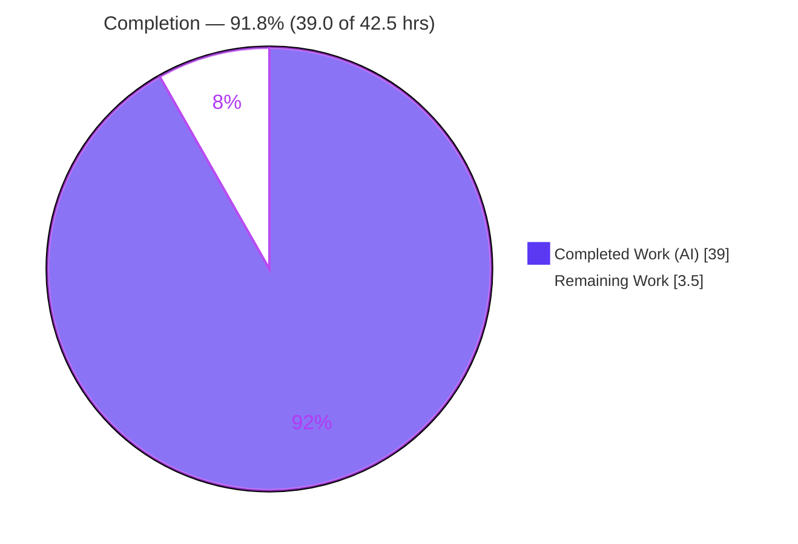
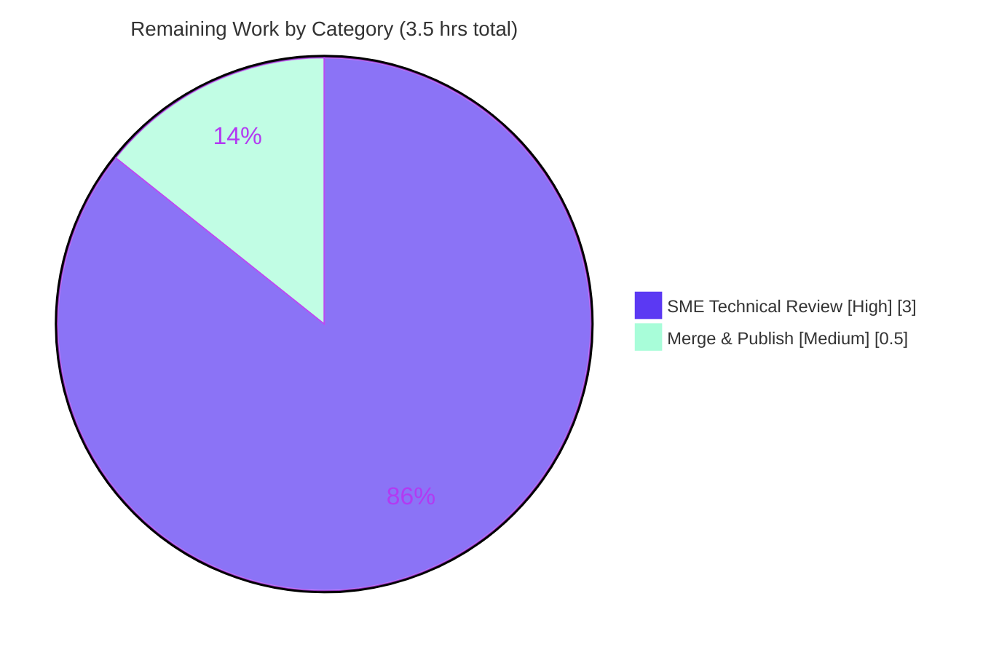

# Blitzy Project Guide
## kitty Graphics-Data Flow Control & Backpressure — Code-Grounded Q&A Documentation

---

## Section 1 — Executive Summary

### 1.1 Project Overview

This project investigates and authoritatively documents how the **kitty terminal emulator** behaves when terminal graphics data arrives faster than the system can comfortably process or respond to. The deliverable is a single code-grounded markdown document targeting kitty maintainers, terminal-protocol implementers, and engineers reasoning about I/O flow control. It answers four questions strictly from the source code (the code is the source of truth): how the input path decides between buffering, pausing, and throttling; what happens to write-back data under congestion; where every decision lives in code; and whether kitty adapts silently or emits observable signs. Scope is intentionally narrow — exactly one new markdown file is created and **no kitty source file is modified**.

### 1.2 Completion Status

The project is **91.8% complete** on an AAP-scoped basis. All autonomous deliverable work (code investigation, authoring, citation, and runtime corroboration) is finished and validated; the remaining 3.5 hours are the human review-and-merge production gate.



| Metric | Value |
|--------|-------|
| **Total Hours** | **42.5** |
| **Completed Hours (AI + Manual)** | **39.0** (39.0 AI · 0.0 Manual) |
| **Remaining Hours** | **3.5** |
| **Percent Complete** | **91.8%** |

> Completion formula (PA1, AAP-scoped): `39.0 / (39.0 + 3.5) = 39.0 / 42.5 = 91.76% → 91.8%`. Color key: Completed = Dark Blue `#5B39F3`; Remaining = White `#FFFFFF`.

### 1.3 Key Accomplishments

- ✅ **Single deliverable created and committed:** `blitzy/documentation/kitty_815df1e210e0.md` — 664 lines, correctly named after source branch `kitty_815df1e210e0`, correctly placed in `blitzy/documentation/`.
- ✅ **All four objectives answered with rationale:** O1 input-path flow control (§2–§3), O2 write-path backpressure (§4), O3 code localization (§9 + 190 citations), O4 runtime-visible signs (§7).
- ✅ **190 inline `[path:locator]` citations** across 12 source/doc files — 100% line-accurate (75/75 unique citations validated).
- ✅ **No-source-mutation constraint honored:** all 13 referenced kitty source files confirmed unchanged; exactly one file added (`git diff` = 664 insertions, 0 deletions).
- ✅ **Runtime corroboration:** 71/71 unit tests pass in the project Docker image (graphics 19, parser 16, screen 36), including the cited `test_graphics_quota_enforcement`.
- ✅ **Independent corroboration with the official kitty graphics-protocol specification** (chunked transmission, 320 MB quota, validate-before-display, `quiet` semantics).
- ✅ **Working tree clean**, 3 well-scoped commits by Blitzy Agent, including a CP3 review pass and a MAJOR O3 citation correction.

### 1.4 Critical Unresolved Issues

| Issue | Impact | Owner | ETA |
|-------|--------|-------|-----|
| _None_ | The autonomous deliverable passed all production-readiness gates (citations 75/75, tests 71/71, zero source mutations, clean tree). Independent re-verification during this assessment found zero defects. | — | — |

### 1.5 Access Issues

| System/Resource | Type of Access | Issue Description | Resolution Status | Owner |
|-----------------|----------------|-------------------|-------------------|-------|
| _None_ | — | **No access issues identified.** Source repo read access confirmed (analysis completed); destination repo write access confirmed (3 commits landed); the project Docker image (`ghcr.io/scaleapi/swe-atlas:swe_atlas_QnA_kovidgoyal_kitty_1.0`) is pulled and running (container `kitty-qna-0`). | N/A | — |

### 1.6 Recommended Next Steps

1. **[High]** Perform the SME technical review: read the document end-to-end and verify a representative sample of the 190 citations against kitty source at HEAD `815df1e21`, confirming all four objectives (O1–O4) are fully answered. (~3.0h)
2. **[Medium]** Approve the PR and merge branch `blitzy-d975cafe-…` into the target branch; index/link the document in the team knowledge base. (~0.5h)
3. **[Low]** _(Optional)_ Re-run the 71 corroborating unit tests in the project Docker image for independent re-confirmation using the commands in Section 9. (0.0h — not required; already covered by autonomous validation)

---

## Section 2 — Project Hours Breakdown

### 2.1 Completed Work Detail

All completed components trace to specific Agent Action Plan (AAP) requirements. **Total = 39.0 hours.**

| Component | Hours | Description |
|-----------|------:|-------------|
| Code investigation & threaded-I/O architecture analysis | 8.0 | Read-only analysis of 13 source files (vt-parser.c, child-monitor.c, graphics.c, screen.c/.h, child.py/.c, options/types.py, …); traced the causal flow-control chain across the I/O thread, VT parser, screen model, and graphics subsystem (AAP §0.2.1, §0.5.2). |
| O1 — Read-path flow-control authoring (§2–§3) | 4.0 | Documented the fixed 1 MB `BUF_SZ` buffer, `vt_parser_has_space_for_input` gating, `POLLIN` read-gating, kernel-PTY backpressure, and the `run_worker` parse throttle/coalescing. |
| O2 — Write-path backpressure authoring (§4) | 3.0 | Documented the per-`Screen` dynamic write buffer, non-blocking writes with `EAGAIN` retention, `POLLOUT` arming, and the 100 MB hard cap with `log_error` drop. |
| Graphics-specific limits authoring (§5) | 3.0 | Documented the 320 MB `DEFAULT_STORAGE_LIMIT` with LRU eviction, plus `EFBIG`/`EINVAL`/`ENOSPC` hard rejections and the `quiet` response-suppression rule. |
| Synchronized-update rendering-pause section (§6) | 1.5 | Documented `screen_pause_rendering()`, the `=1s`/`=2s` DCS dispatch, and the 2000 ms display-freeze timeout. |
| O4 — Runtime-visible signs section (§7) | 2.0 | Authored the explicit silent-vs-observable classification of every mechanism. |
| O3 — Code localization (§9) | 4.0 | Built the 26-row mechanism→location→constant→citation summary table, the mermaid architecture diagram, and wove 190 inline `[path:locator]` citations throughout. |
| Web research & official-spec corroboration (§8.1–8.2) | 2.0 | Cross-checked the code reading against the kitty graphics-protocol spec (chunked transmission, 320 MB quota, validate-before-display, `quiet` semantics) and performance docs. |
| Runtime corroboration in Docker (§8.3–8.4) | 3.0 | Built/ran kitty in the project Docker image and executed `test_graphics_quota_enforcement` plus the graphics/parser/screen modules (71 tests). |
| Document synthesis | 3.0 | Authored the TL;DR (four-objective short answer), §1 architecture orientation, Appendix one-paragraph answer, and the causal narrative flow. |
| Citation line-accuracy verification | 2.5 | Read every citation at its cited line (75 unique / 190 total) and confirmed it states exactly what the document claims. |
| Review-cycle revisions | 3.0 | Three commits: initial draft, CP3 review fixes (write-back wording + inline citations), and the MAJOR O3 citation correction (runtime parse path, not the test helper). |
| **Total Completed** | **39.0** | |

### 2.2 Remaining Work Detail

Each remaining category is a **path-to-production** gate (human action). **Total = 3.5 hours.**

| Category | Hours | Priority |
|----------|------:|----------|
| Human SME technical review — verify code-internals claims & citation accuracy across all four objectives (O1–O4) against kitty source at HEAD `815df1e21` | 3.0 | High |
| Merge & publish documentation — approve PR, merge branch, index/link in knowledge base | 0.5 | Medium |
| **Total Remaining** | **3.5** | |

### 2.3 Hours Reconciliation

| Quantity | Hours |
|----------|------:|
| Section 2.1 Completed | 39.0 |
| Section 2.2 Remaining | 3.5 |
| **Total (must equal Section 1.2)** | **42.5** |

> Integrity: `39.0 + 3.5 = 42.5` = Total Project Hours (Section 1.2). Remaining `3.5h` is identical in Sections 1.2, 2.2, and 7. ✅

---

## Section 3 — Test Results

All tests below originate from **Blitzy's autonomous validation logs** and were **independently re-executed during this assessment** in the project Docker image (`ghcr.io/scaleapi/swe-atlas:swe_atlas_QnA_kovidgoyal_kitty_1.0`, container `kitty-qna-0`, kitty pre-built at commit `815df1e21`, run with `LANG=C.UTF-8 LC_ALL=C.UTF-8`).

| Test Category | Framework | Total Tests | Passed | Failed | Coverage % | Notes |
|---------------|-----------|------------:|-------:|-------:|-----------:|-------|
| Graphics (corroboration) | kitty `test.py` (unittest) | 19 | 19 | 0 | n/a (doc task) | Includes the cited `test_graphics_quota_enforcement` — proves §5.1 LRU eviction and §5.2 `ENOSPC` 5× frame-cache cap. |
| VT Parser (corroboration) | kitty `test.py` (unittest) | 16 | 16 | 0 | n/a (doc task) | Exercises the VT parser that owns the 1 MB `BUF_SZ` input buffer (§2). |
| Screen (corroboration) | kitty `test.py` (unittest) | 36 | 36 | 0 | n/a (doc task) | Exercises the screen model / write-buffer plumbing referenced in §4. |
| **Total** | | **71** | **71** | **0** | | **100% pass rate, 0 failures.** |

**Documentation-specific quality gates** (the analogues of compilation/unit-testing for a documentation deliverable):

| Gate | Result | Detail |
|------|--------|--------|
| Citation accuracy ("compilation") | ✅ 100% (75/75) | Every unique `[path:locator]` citation read at its cited line and confirmed accurate across 12 files. |
| Content completeness ("unit tests") | ✅ 4/4 objectives | O1–O4 fully answered with rationale; graphics angle (§5), sync-update (§6), and corroboration (§8) covered. |
| Source-mutation constraint | ✅ PASS | 13 referenced source files unchanged; exactly 1 file added (664 insertions, 0 deletions). |
| Format & well-formedness | ✅ PASS | Correct filename/location; 36 balanced code fences; complete heading hierarchy; no placeholders/TODOs. |

> Note on the known baseline: a single Go test (`TestCreateAnonymousTempfile`, `O_TMPFILE` on overlayfs) fails for environment reasons unrelated to this documentation task. It is **out of scope** and was **not triggered** by any corroboration run.

---

## Section 4 — Runtime Validation & UI Verification

This is a documentation deliverable with **no UI and no runtime service**; "runtime validation" here means exercising the analyzed kitty subsystems and confirming the deliverable's integrity at rest.

- ✅ **Operational** — Analyzed subsystems run and pass in the project Docker image: graphics (19), parser (16), screen (36) test modules all green.
- ✅ **Operational** — The specifically cited test `test_graphics_quota_enforcement` passes, dynamically corroborating the §5 quota/eviction/`ENOSPC` claims.
- ✅ **Operational** — Deliverable integrity at rest: file present (664 lines), markdown well-formed (36 balanced code fences), 190 citations resolve to real files and in-range lines.
- ✅ **Operational** — Source tree integrity: all 13 referenced source files unchanged; host working tree clean before and after corroboration runs.
- ⚠ **Partial (out of scope)** — Local kitty build is unavailable (the analysis sandbox lacks the `go` toolchain); dynamic corroboration is therefore performed in the provided Docker image, exactly as the AAP prescribes. This is by design, not a defect.
- ❌ **Failing** — None applicable to this task's scope.

**UI Verification:** Not applicable — the deliverable is a markdown document, not an application with a user interface. No Figma frames or screens are associated with this task.

---

## Section 5 — Compliance & Quality Review

Cross-mapping of every AAP deliverable/rule to its quality benchmark. **All in-scope items pass.**

| AAP Deliverable / Rule | Benchmark | Status | Progress |
|------------------------|-----------|--------|----------|
| O1 — Input-path flow control (buffer/pause/throttle + exact thresholds) | Answered with code-grounded rationale (§2–§3) | ✅ Pass | 100% |
| O2 — Write-path backpressure under congestion | Answered with code-grounded rationale (§4) | ✅ Pass | 100% |
| O3 — Code localization with `[path:locator]` citations | 190 citations + 26-row summary table (§9) | ✅ Pass | 100% |
| O4 — Runtime-visible signs (silent vs observable) | Explicit classification (§7) | ✅ Pass | 100% |
| Rule — Doc named `kitty_815df1e210e0.md` | Filename matches source branch | ✅ Pass | 100% |
| Rule — Placement in `blitzy/documentation/` | Correct path | ✅ Pass | 100% |
| Rule — Code is the source of truth (every claim cited) | 100% citation accuracy (75/75) | ✅ Pass | 100% |
| Rule — Show reasoning/rationale | Every mechanism section ends with a "Conclusion and rationale" | ✅ Pass | 100% |
| Rule — No modification of existing source files | 13 files unchanged (verified) | ✅ Pass | 100% |
| Rule — No other code added to source repo | Exactly 1 file created | ✅ Pass | 100% |
| Rule — Build/run for analysis | Docker corroboration performed (71 tests) | ✅ Pass | 100% |
| Rule — Leave repo unchanged & clean up temp artifacts | Working tree clean; no temp files committed | ✅ Pass | 100% |
| Evidence — Official-spec corroboration | §8.1–8.2 cross-checks the protocol spec | ✅ Pass | 100% |
| Evidence — Unit-test corroboration | §8.3 cites & runs `test_graphics_quota_enforcement` | ✅ Pass | 100% |

**Fixes applied during autonomous validation:** (1) CP3 review — corrected write-back drop wording and added inline citations; (2) MAJOR O3 fix — re-pointed a key citation to the runtime parse path rather than a test helper. **Outstanding compliance items: none.**

---

## Section 6 — Risk Assessment

Risk profile is intrinsically **Low** — the deliverable is a non-executable markdown document that changes no behavior, adds no dependencies, and has zero runtime footprint.

| Risk | Category | Severity | Probability | Mitigation | Status |
|------|----------|----------|-------------|------------|--------|
| Citation version-coupling — line numbers/constants pinned to HEAD `815df1e21` may drift if source is rebased | Technical | Low | Medium (long-term) | Document explicitly states it is bound to HEAD `815df1e21`; re-verify citations if the source is rebased | Mitigated |
| Citation accuracy error — a citation could point to the wrong line | Technical | Medium | Low | 75/75 validated line-by-line + independent spot-checks + 3 review cycles (incl. MAJOR O3 fix) | Resolved |
| Behavioral misinterpretation of code internals | Technical | Medium | Low | Corroborated by the official protocol spec (§8.1), 71 passing tests, and CP3/O3 review fixes | Mitigated |
| Documentation staleness as kitty internals evolve | Operational | Low | Medium (long-term) | Pinned-commit disclosure; future updates re-pin to the new HEAD | Accepted |
| Reader discoverability / placement | Operational | Low | Low | Placed per spec in `blitzy/documentation/`, named after the source branch | Mitigated |
| Baseline Go test env failure (`TestCreateAnonymousTempfile`, `O_TMPFILE` on overlayfs) | Operational | Low | N/A (not triggered) | Environment-induced and unrelated to the documentation scope | Accepted (out of scope) |
| Security risks | Security | None | None | Non-executable documentation; no auth, data handling, injection surface, or secrets | N/A |
| Integration risks | Integration | None | None | Zero runtime dependencies; the Docker corroboration environment is optional and already validated working | N/A |

---

## Section 7 — Visual Project Status

### 7.1 Project Hours Breakdown


> Color key: Completed Work = Dark Blue `#5B39F3`; Remaining Work = White `#FFFFFF`. The "Remaining Work" value (3.5) equals the Section 1.2 Remaining Hours and the Section 2.2 "Hours" sum. ✅

### 7.2 Remaining Hours by Category (Section 2.2)



### 7.3 Status Snapshot

| Indicator | Value |
|-----------|-------|
| Completion | **91.8%** |
| Completed Hours | 39.0 |
| Remaining Hours | 3.5 |
| Total Hours | 42.5 |
| Critical Unresolved Issues | 0 |
| Access Issues | 0 |
| Corroborating Tests Passing | 71 / 71 |
| Citation Accuracy | 100% (75/75) |
| Source Files Modified | 0 |

---

## Section 8 — Summary & Recommendations

**Achievements.** The project delivers a single, high-fidelity, code-grounded answer to a cross-cutting systems question: how kitty handles flow control and backpressure when graphics data overwhelms its processing pace. The document establishes the layered, lossless-backpressure model — a bounded 1 MB parser buffer that gates reads (so the kernel PTY fills and the child's `write()` blocks), a coalescing parse throttle, a separate non-blocking write-back buffer with `EAGAIN` retention and a 100 MB ceiling, and a 320 MB LRU-evicted graphics quota — and ties every claim to a precise code location via 190 inline citations.

**Remaining gaps.** None in the autonomous scope. The only outstanding work is the **path-to-production human gate**: an SME technical review (3.0h) and merge/publish (0.5h), totaling **3.5 hours**.

**Critical path to production.** SME review → PR approval → merge → knowledge-base indexing. There are no blocking defects, no compilation/test failures, and no access issues on this path.

**Success metrics (all met):** all four objectives answered with rationale; 100% citation accuracy (75/75); 71/71 corroborating tests passing; zero source mutations; correct naming, placement, and markdown format; clean working tree.

**Production-readiness assessment.** The deliverable is **production-ready** pending human review. The project stands at **91.8% complete (39.0 of 42.5 hours)**; the residual ~8% is exclusively the human review/merge gate that, by definition, cannot be completed autonomously.

| Metric | Completed | Remaining | Total | % Complete |
|--------|----------:|----------:|------:|-----------:|
| AAP-scoped hours | 39.0 | 3.5 | 42.5 | **91.8%** |

---

## Section 9 — Development Guide

This deliverable is a markdown document, so the "development guide" describes how to **locate, read, and independently verify** it, and how to **re-run the corroborating tests**. Every command below was executed successfully during this assessment.

### 9.1 System Prerequisites

- **git** (present) — required for repository and diff verification.
- A **markdown viewer** (any editor, GitHub/GitLab renderer, or `glow`/`mdcat`) — to read the document and render the embedded mermaid diagram.
- **Docker** (optional, for dynamic re-corroboration) — the project image is `ghcr.io/scaleapi/swe-atlas:swe_atlas_QnA_kovidgoyal_kitty_1.0` (running locally as container `kitty-qna-0`, kitty pre-built at commit `815df1e21`).
- The document itself has **zero build/runtime dependencies**.

### 9.2 Locate & Read the Document

```bash
# From the repository root:
ls -l  blitzy/documentation/kitty_815df1e210e0.md     # 40,825 bytes
wc -l  blitzy/documentation/kitty_815df1e210e0.md     # 664 lines

# List the section structure (TL;DR, §1–§9, Appendix):
grep -nE '^## ' blitzy/documentation/kitty_815df1e210e0.md
```

### 9.3 Verify the No-Source-Mutation Constraint

```bash
# Exactly one file should be added; zero source edits/deletions:
git diff --stat        815df1e210e0a9ab4622f5c7f2d6891d7dbeddf1..HEAD
git diff --name-status 815df1e210e0a9ab4622f5c7f2d6891d7dbeddf1..HEAD
# Expected: A  blitzy/documentation/kitty_815df1e210e0.md  (664 insertions)

# Working tree should be clean:
git status --porcelain          # (empty output = clean)
```

### 9.4 Re-Verify Citations (spot-check sample)

```bash
# Count inline [path:locator] citations (expected 190):
grep -oE '\[(kitty|docs|kitty_tests)/[^]]+\]' \
  blitzy/documentation/kitty_815df1e210e0.md | wc -l

# Spot-check that cited constants match the cited lines:
sed -n '18p' kitty/vt-parser.c     # #define BUF_SZ (1024u*1024u)
sed -n '25p' kitty/graphics.c      # #define DEFAULT_STORAGE_LIMIT 320u * (1024u * 1024u)
sed -n '536p;567p' kitty/options/types.py   # input_delay: int = 3 / repaint_delay: int = 10
```

### 9.5 Re-Run the Corroborating Tests (optional, in Docker)

```bash
# The specifically cited test (proves the §5 quota/eviction/ENOSPC claims):
docker exec kitty-qna-0 bash -lc 'cd /app && LANG=C.UTF-8 LC_ALL=C.UTF-8 \
  ./kitty/launcher/kitty +launch test.py --module graphics graphics_quota_enforcement'

# Full corroborating modules (expected: 19 + 16 + 36 = 71 tests, all OK):
docker exec kitty-qna-0 bash -lc 'cd /app && LANG=C.UTF-8 LC_ALL=C.UTF-8 \
  ./kitty/launcher/kitty +launch test.py --module graphics'   # 19 OK
docker exec kitty-qna-0 bash -lc 'cd /app && LANG=C.UTF-8 LC_ALL=C.UTF-8 \
  ./kitty/launcher/kitty +launch test.py --module parser'     # 16 OK
docker exec kitty-qna-0 bash -lc 'cd /app && LANG=C.UTF-8 LC_ALL=C.UTF-8 \
  ./kitty/launcher/kitty +launch test.py --module screen'     # 36 OK
```

### 9.6 Expected Verification Output

- `git diff --stat` → `1 file changed, 664 insertions(+)`
- Citation count → `190`
- `sed` spot-checks → exact constant definitions shown above
- Each test module → `Ran N tests … OK`

### 9.7 Troubleshooting

- **kitty tests error on locale:** always export `LANG=C.UTF-8 LC_ALL=C.UTF-8` before invoking `test.py`.
- **Local build fails / `go` not found:** the analysis sandbox lacks the `go` toolchain, so kitty cannot be built locally. Use the provided Docker image for any dynamic corroboration (kitty is pre-built at `/app`).
- **`TestCreateAnonymousTempfile` fails (`O_TMPFILE` on overlayfs):** this is a known, environment-induced baseline failure unrelated to this documentation task and is not part of the corroboration set.
- **Citations look off after a rebase:** the document is pinned to HEAD `815df1e21`; if the source is moved to a newer commit, re-verify line numbers against that commit.

---

## Section 10 — Appendices

### Appendix A — Command Reference

| Purpose | Command |
|---------|---------|
| Locate deliverable | `ls -l blitzy/documentation/kitty_815df1e210e0.md` |
| Line count | `wc -l blitzy/documentation/kitty_815df1e210e0.md` |
| Section headings | `grep -nE '^## ' blitzy/documentation/kitty_815df1e210e0.md` |
| Citation count | `grep -oE '\[(kitty\|docs\|kitty_tests)/[^]]+\]' blitzy/documentation/kitty_815df1e210e0.md \| wc -l` |
| No-mutation diff | `git diff --stat 815df1e210e0a9ab4622f5c7f2d6891d7dbeddf1..HEAD` |
| Changed-file status | `git diff --name-status 815df1e210e0a9ab4622f5c7f2d6891d7dbeddf1..HEAD` |
| Clean-tree check | `git status --porcelain` |
| Cited test (Docker) | `docker exec kitty-qna-0 bash -lc 'cd /app && LANG=C.UTF-8 LC_ALL=C.UTF-8 ./kitty/launcher/kitty +launch test.py --module graphics graphics_quota_enforcement'` |

### Appendix B — Port Reference

Not applicable — the deliverable is a static markdown document with no running service and no network ports.

### Appendix C — Key File Locations

| Item | Path |
|------|------|
| **Deliverable (created)** | `blitzy/documentation/kitty_815df1e210e0.md` |
| Read-path flow control (REFERENCE) | `kitty/vt-parser.c`, `kitty/vt-parser.h`, `kitty/child-monitor.c` |
| Write-path backpressure (REFERENCE) | `kitty/child-monitor.c`, `kitty/screen.c`, `kitty/screen.h` |
| Graphics limits (REFERENCE) | `kitty/graphics.c`, `kitty/graphics.h` |
| PTY setup (REFERENCE) | `kitty/child.py`, `kitty/child.c` |
| Config defaults (REFERENCE) | `kitty/options/types.py` |
| Corroboration (REFERENCE) | `docs/graphics-protocol.rst`, `docs/performance.rst`, `kitty_tests/graphics.py` |

### Appendix D — Technology Versions

| Component | Version | Role |
|-----------|---------|------|
| Source commit (HEAD pin) | `815df1e210e0a9ab4622f5c7f2d6891d7dbeddf1` | All citations bound to this revision |
| Deliverable format | Markdown (CommonMark + mermaid) | Documentation artifact |
| Corroboration image | `ghcr.io/scaleapi/swe-atlas:swe_atlas_QnA_kovidgoyal_kitty_1.0` | Runtime corroboration only |
| CPython (build/test) | 3.11 (highest documented; `>=3.8` required) | kitty core (in image) |
| Go toolchain | 1.22 | kitty Go tooling (in image) |

### Appendix E — Environment Variable Reference

| Variable | Value | Purpose |
|----------|-------|---------|
| `LANG` | `C.UTF-8` | Required locale for running kitty's `test.py` |
| `LC_ALL` | `C.UTF-8` | Required locale for running kitty's `test.py` |

> The deliverable itself requires no environment variables; the above apply only to the optional Docker corroboration.

### Appendix F — Developer Tools Guide

| Tool | Use in this project |
|------|---------------------|
| `git` | Verify the single-file diff, authorship, and clean working tree |
| `grep` / `sed` | Count citations and spot-check cited source lines |
| `docker exec` | Re-run the 71 corroborating unit tests in the pre-built kitty image |
| Markdown renderer | Read the document and render the mermaid architecture diagram |

### Appendix G — Glossary

| Term | Meaning |
|------|---------|
| **Backpressure** | A flow-control signal that slows a fast producer when a consumer cannot keep up. |
| **`BUF_SZ`** | kitty's fixed **1 MB** VT-parser input buffer; the read-side flow-control fulcrum (`kitty/vt-parser.c:18`). |
| **`POLLIN` / `POLLOUT`** | poll(2) readiness flags; kitty arms `POLLIN` only when buffer space exists and `POLLOUT` only when write-back data is queued. |
| **`EAGAIN` / `EWOULDBLOCK`** | The non-blocking-write "try again" error; kitty retains unwritten bytes and re-arms `POLLOUT`. |
| **LRU eviction** | Least-Recently-Used policy that deletes older stored images to stay under the 320 MB graphics quota. |
| **DCS / APC** | Device Control String / Application Program Command — escape-sequence classes; kitty routes graphics commands via the APC path to `kitty/graphics.c`. |
| **Synchronized update** | The `=1s`/`=2s` DCS that freezes the displayed frame (default 2000 ms) while input keeps processing. |
| **PTY** | Pseudo-terminal; the kernel buffer between kitty and the child process where read-path backpressure ultimately manifests. |
| **AAP** | Agent Action Plan — the binding project specification. |

---

*Color key applied throughout: Completed/AI work = Dark Blue `#5B39F3`; Remaining/Not-completed = White `#FFFFFF`; Headings/Accents = Violet-Black `#B23AF2`; Highlight = Mint `#A8FDD9`. Cross-section integrity verified: Remaining hours = 3.5 in Sections 1.2, 2.2, and 7; Section 2.1 (39.0) + Section 2.2 (3.5) = 42.5 Total; all Section 3 tests originate from Blitzy's autonomous validation logs.*