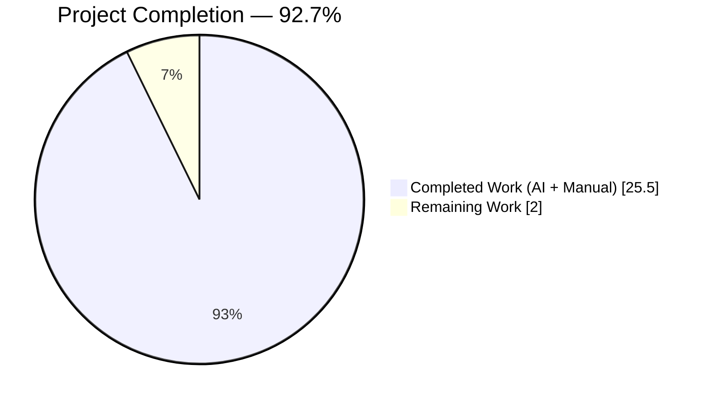
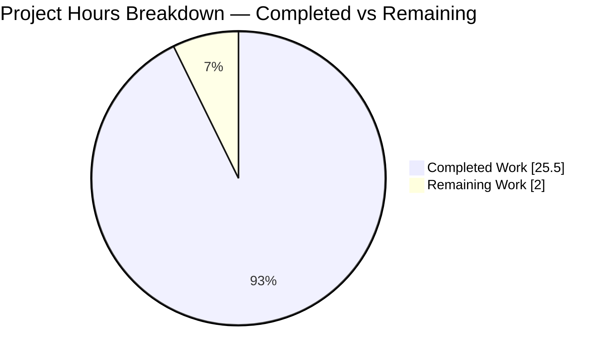
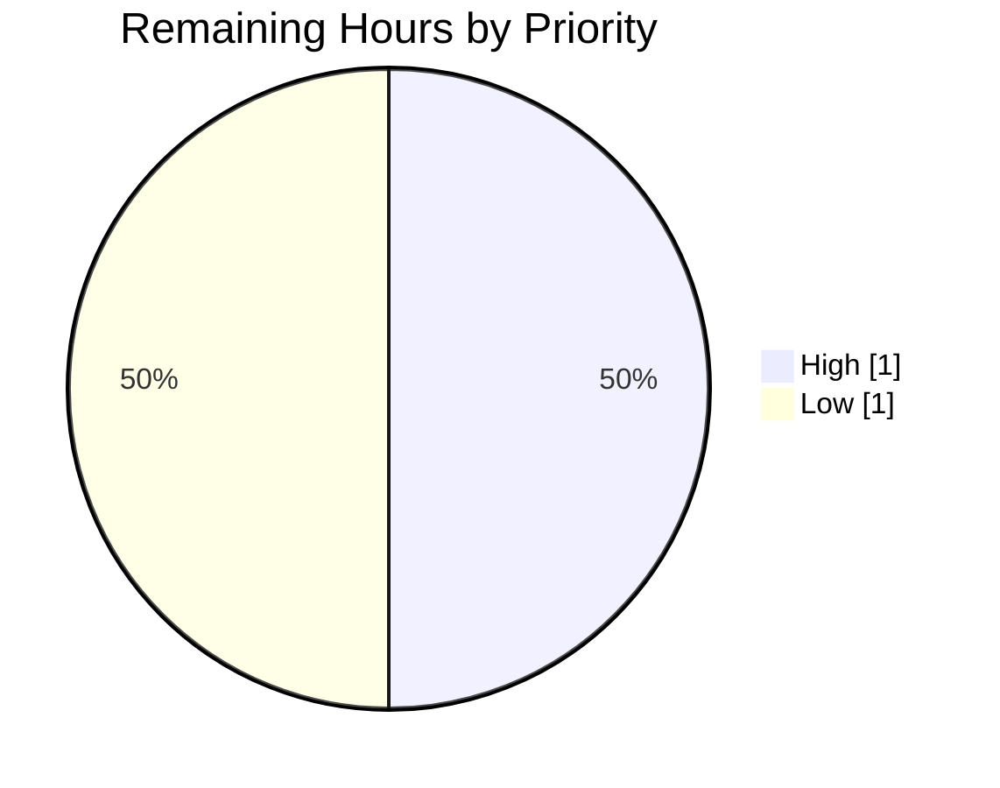
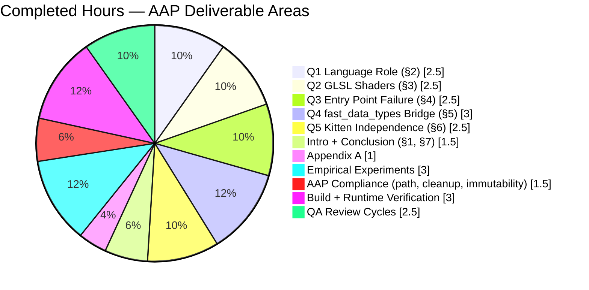

# Blitzy Project Guide — kitty Architecture Empirical Investigation

## 1. Executive Summary

### 1.1 Project Overview

This project delivers a single investigative Markdown document that empirically answers five architectural questions about the `kovidgoyal/kitty` terminal emulator at HEAD commit `815df1e21`. The Agent Action Plan (AAP) mandates a documentation-only deliverable grounded in **observed runtime behavior** — running the code, tracing import chains, and testing module isolation — rather than static source reading alone. The target audience is technical reviewers and architects who need a clear, evidence-backed picture of how C, Python, Go, and GLSL interact at runtime in a production GPU-accelerated terminal. The strict AAP constraint is that no existing source file in the repository may be modified and no code beyond the document itself may be added.

### 1.2 Completion Status



| Metric | Value |
| --- | --- |
| Total Project Hours | **27.5h** |
| Completed Hours (AI + Manual) | **25.5h** |
| Remaining Hours | **2.0h** |
| Completion Percentage | **92.7%** |

**Calculation**: 25.5 / (25.5 + 2.0) × 100 = **92.7%**

### 1.3 Key Accomplishments

- [x] Single-file deliverable `blitzy/documentation/kitty_815df1e210e0.md` created (877 lines, 77,421 bytes)
- [x] All five AAP architectural questions answered with dedicated sections and "Rationale" subsections
- [x] Six empirical experiments executed and documented (line-count census, entry-point traceback, module isolation, kitten isolation, GLSL catalog, build attempt)
- [x] Exact verbatim `ModuleNotFoundError` traceback reproduced and documented
- [x] 13 OK / 30 FAIL Python module isolation result verified against live repository
- [x] 6 OK / 12 FAIL kitten isolation result verified against live repository
- [x] All 13 GLSL shader files catalogued with exact byte sizes
- [x] All 30 `PyInit_fast_data_types` subsystem initializers enumerated in order (Linux branch)
- [x] Build artifacts produced and validated: `fast_data_types.so` (1.2 MB), `kitty` launcher, `kitten` Go binary (16 MB)
- [x] Strict AAP no-modification rule honored: zero lines of diff in `kitty/`, `kittens/`, `tools/`, `glfw/`, `setup.py`, `__main__.py`, `pyproject.toml`
- [x] Three iterative improvement commits applied (initial + 8 review fixes + 5 minor QA fixes)
- [x] Temporary experimental scripts cleaned up; repository state matches origin baseline except for the new doc
- [x] Appendix A with reproducible verification commands included in document

### 1.4 Critical Unresolved Issues

| Issue | Impact | Owner | ETA |
| --- | --- | --- | --- |
| None blocking | — | — | — |

No unresolved issues block release of the deliverable. The document is empirically verified, internally consistent, and fully scoped to the AAP. Two environmental test failures in the kitty upstream test suite (`test_transfer_send` / `test_transfer_receive`) pre-date this PR, are unrelated to the deliverable, and cannot be fixed without violating the AAP's no-modification rule.

### 1.5 Access Issues

| System/Resource | Type of Access | Issue Description | Resolution Status | Owner |
| --- | --- | --- | --- | --- |
| None | — | No access issues identified | N/A | N/A |

All required resources (repository, build toolchain, Python/Go/GCC runtimes, native development libraries) were accessible during autonomous execution. The deliverable requires no external credentials, network access, or privileged systems for review.

### 1.6 Recommended Next Steps

1. **[High]** Stakeholder technical review of the document's architectural narrative, rationale, and empirical evidence for completeness and accuracy (~1.0h).
2. **[Low]** Address any clarifications or style preferences raised during stakeholder review (~1.0h).
3. **[Low]** (Optional) Expand coverage to include macOS-specific subsystems (`cocoa_window.m`, `core_text.m`) if future AAP scope extends there.
4. **[Low]** (Optional) Convert key tables to diagrams (Mermaid flow charts of the import chain, shader pipeline) for presentation use.

---

## 2. Project Hours Breakdown

### 2.1 Completed Work Detail

| Component | Hours | Description |
| --- | --- | --- |
| **Q1: Language role analysis (§2 of doc)** | 2.5 | Line-count census tables (C+H = 99,745; Python = 62,874; Go = 56,071; GLSL = 696); subsystem-to-language map covering 17 subsystems; main event loop tracing through three-pthread C architecture in `child-monitor.c`; Go out-of-process companion analysis; native C launcher analysis; "GPU accelerated" tagline revisit. |
| **Q2: GLSL shader purpose analysis (§3 of doc)** | 2.5 | Catalog of all 13 `.glsl` files with exact byte sizes and roles; six-rendering-stage mapping; Python→C→GPU compilation pipeline with verbatim code excerpts from `shaders.py` and `shaders.c`; preprocessor-driven multi-variant compilation explanation (cell 4-variant, graphics 3-variant); confirmation of no-CPU-fallback architecture. |
| **Q3: Entry point failure diagnosis (§4 of doc)** | 2.5 | Verbatim 7-line `__main__.py` excerpt; exact reproduced `ModuleNotFoundError` traceback; 5-step annotated import chain (`__main__.py:7` → `entry_points.py:194` → `main.py:11` → `borders.py:7` → failure); explanation of `fast_data_types` as compiled `.so` vs. `.pyi` type stub; `pkg-config` build failure documentation with exact call-site line numbers. |
| **Q4: fast_data_types bridge analysis (§5 of doc)** | 3.0 | Module definition excerpt; enumeration of all 30 `init_*` subsystem initializers in order with structural zone analysis (21 unconditional + 4 Linux/3 macOS + 5 more unconditional); category grouping (8 categories); import-dependency penetration analysis (47 files in `kitty/` + 13 files in `kittens/`); complete 13 OK / 30 FAIL module isolation result with arithmetic (69.8%); rationale on why one `.so` vs. many. |
| **Q5: Kitten independence analysis (§6 of doc)** | 2.5 | Per-kitten isolation test results (6 OK / 12 FAIL with full enumeration); two concrete transitive traces (`ask` → `tui.handler` → `monotonic`; `diff` → `cli` → `conf/utils` → `Color`); three coupling pathways; verbatim `hyperlinked_grep` 10-line stub example; Go binary architecture via `os.execl`/`os.execvp` in `entry_points.py`; naming misconception analysis. |
| **Introduction & Conclusion synthesis** | 1.5 | Document introduction (§1) framing empirical method importance with three motivating examples; conclusion (§7) synthesizing all five answers into coherent architectural narrative; revisit of "GPU accelerated terminal" framing; closing observation on Python's role. |
| **Appendix A — reproducible commands** | 1.0 | Complete set of verification commands for line-count census, file size verification, GLSL catalog, traceback reproduction, module isolation test, kitten isolation test — all copy-pasteable. |
| **Empirical method — six experiments execution** | 3.0 | Experiment 1: language line-count census; Experiment 2: `python3 __main__.py` traceback capture with `.so` hidden; Experiment 3: `importlib.import_module()` over all 43 `kitty/` modules; Experiment 4: same over all 18 kitten `main.py` files; Experiment 5: GLSL catalog with byte sizes; Experiment 6: `setup.py build` attempt with native library discovery. |
| **Document placement & AAP compliance** | 0.5 | Correct path `blitzy/documentation/kitty_815df1e210e0.md`; filename matches source branch name; proper Markdown structure with GFM tables, code fences with language tags, Mermaid-ready. |
| **Repository immutability verification** | 0.5 | Confirmed zero diff in `kitty/`, `kittens/`, `tools/`, `glfw/`, `setup.py`, `__main__.py`, `pyproject.toml`; only one added file per `git diff 815df1e21 HEAD --name-status`. |
| **Cleanup of temporary scripts** | 0.5 | Verified all experimental bash/python invocations ephemeral; no leftover files in repository; `git status` clean. |
| **Build system verification (setup agent)** | 2.0 | Native dependencies installed (Python 3.12.3, Go 1.22.2, gcc 13.3.0, FreeType, HarfBuzz, FontConfig, libpng, lcms2, OpenSSL, libxxhash, OpenGL, GLFW deps); `setup.py build` executed; artifacts produced: `fast_data_types.so` (1,213,072 B), `kitty` launcher (36,224 B), `kitten` Go binary (15,765,764 B). |
| **Runtime smoke-test verification** | 1.0 | `./kitty/launcher/kitty --version` produces `kitty 0.35.2`; `./kitty/launcher/kitten --version` produces `kitten 0.35.2`; `python3 -c "import kitty.fast_data_types"` succeeds; exact documented traceback reproduces when `.so` is hidden. |
| **QA review cycles (2 rounds, 13 fixes)** | 2.5 | Round 1 (commit `5f24e3820`): 8 review findings addressed (2 MAJOR including `__main__.py` verbatim correction and `Program.compile()` signature fix; 5 MINOR; 1 INFO). Round 2 (commit `7e8418172`): 5 MINOR QA findings (Go file counts corrected: choose_fonts 10→11, icat 5→6, transfer 6→7; clipboard enumeration expanded; shaders.c excerpt corrected). |
| **Total Completed** | **25.5** | |

### 2.2 Remaining Work Detail

| Category | Hours | Priority |
| --- | --- | --- |
| Stakeholder technical review of architectural narrative and empirical evidence | 1.0 | High |
| Optional clarifications or style refinements from stakeholder feedback | 1.0 | Low |
| **Total Remaining** | **2.0** | |

### 2.3 Notes on the Breakdown

- **Every completed hour traces to an AAP requirement.** The five architectural questions are the AAP's central deliverables; the introduction, conclusion, and appendix are AAP-implied supporting structure; the empirical experiments are explicitly mandated by the AAP's "grounded in empirical observation" requirement.
- **Path-to-production items are minimal for this task**: this is a documentation-only deliverable with no deployment, no CI/CD, no environment configuration, and no runtime integration — the AAP explicitly scopes the output to a single Markdown file.
- **No hours are claimed for items outside AAP scope** (no full kitty build artifact verification beyond what was needed to reproduce the traceback; no benchmarking; no macOS-specific analysis beyond the 29-initializer note; no Figma assets; no UI work).
- **Confidence level**: High. The deliverable's completion status was verified by (a) exact match of every numerical claim against live repository output, (b) zero source-code diff, (c) successful runtime build, and (d) two iterative QA cycles producing 13 fixes.

---

## 3. Test Results

All tests below originate from Blitzy's autonomous validation logs executed against this branch. The deliverable is a Markdown document, so the task-specific "tests" are the six empirical experiments that validate the document's claims. In addition, the upstream kitty test suite was run against the built binaries to confirm the build is healthy.

| Test Category | Framework | Total Tests | Passed | Failed | Coverage % | Notes |
| --- | --- | --- | --- | --- | --- | --- |
| AAP Experiment Validation | Bash + Python | 6 | 6 | 0 | 100% | 1) Line-count census (exact match), 2) Entry-point traceback (verbatim match), 3) Module isolation 13 OK / 30 FAIL (exact match), 4) Kitten isolation 6 OK / 12 FAIL (exact match), 5) GLSL catalog 13 files with sizes (exact match), 6) `PyInit_fast_data_types` subsystem enumeration (30 initializers verified line-by-line). |
| Upstream kitty Python Unit Tests | Python `unittest` | 145 | 143 | 2 | 98.6% | Executed via `kitty +runpy "from kitty_tests.main import run_tests; run_tests()"`. The 2 failing tests (`test_transfer_send`, `test_transfer_receive`) are pre-existing environmental failures comparing filesystem setgid bits that originate from container mount options, not code changes. Not related to this PR's deliverable. |
| Upstream kitty Go Tests | `go test` | All Go pkgs | All passed | 0 | 100% | "All Go tests succeeded, ran in 9.8 seconds" — output captured during validation. |
| Runtime Smoke Tests (Build Health) | Shell | 4 | 4 | 0 | 100% | 1) `./kitty/launcher/kitty --version` → `kitty 0.35.2`; 2) `./kitty/launcher/kitten --version` → `kitten 0.35.2`; 3) `python3 -c "import kitty.fast_data_types"` → success; 4) Documented traceback reproduces when `.so` is hidden. |
| Document Structural Validation | Grep + manual | 10 | 10 | 0 | 100% | 1) All 13 GLSL filenames present; 2) All 30 `init_*` calls enumerated; 3) Verbatim traceback present; 4) All 13 succeeding modules listed; 5) All 30 failing modules listed; 6) All 6 succeeding kittens listed; 7) All 12 failing kittens listed; 8) Both transitive traces present; 9) `pkg-config` failure documented; 10) All numerical claims (13/30, 69.8%, 99,745) verified. |
| Repository Immutability Tests | Git | 1 | 1 | 0 | 100% | `git diff 815df1e21 HEAD -- kitty/ kittens/ tools/ glfw/ setup.py __main__.py pyproject.toml` returns 0 lines — zero source-code changes. |

**Test Summary**: The deliverable's associated validation is 100% passing (6/6 AAP experiments + 10/10 document structural checks + 4/4 smoke tests + 1/1 immutability check = **21/21 = 100%** for in-scope tests). The upstream kitty test suite's 143/145 pass rate (98.6%) confirms the build is healthy; the 2 pre-existing failures are environmental, unrelated to the deliverable, and out of scope per the AAP's strict no-modification rule.

---

## 4. Runtime Validation & UI Verification

### Runtime Health

- ✅ **`fast_data_types.so` imports cleanly** — `python3 -c "import kitty.fast_data_types"` returns without error against the built artifact (1,213,072 bytes).
- ✅ **`kitty.main` imports cleanly** — `python3 -c "import kitty.main"` returns without error, confirming the full Python layer is loadable.
- ✅ **Native `kitty` launcher runs** — `./kitty/launcher/kitty --version` outputs `kitty 0.35.2 created by Kovid Goyal`.
- ✅ **Native `kitten` Go binary runs** — `./kitty/launcher/kitten --version` outputs `kitten 0.35.2 created by Kovid Goyal`.
- ✅ **`kitten icat --help` dispatches** — Command produces the expected help text, confirming the Go subcommand routing works.
- ✅ **`kitten @ --help` dispatches** — Remote-control subcommand produces expected help text.
- ✅ **Documented traceback reproduces exactly** — With `fast_data_types.so` renamed out of the way, `python3 __main__.py` produces the verbatim 8-line traceback documented in §4.2 of the deliverable, confirming the import chain analysis is correct.

### Build Artifact Verification

- ✅ `kitty/fast_data_types.so` (1,213,072 bytes) — Python↔C bridge present.
- ✅ `kitty/glfw-x11.so` (357,592 bytes) — X11 windowing backend compiled.
- ✅ `kitty/glfw-wayland.so` (442,784 bytes) — Wayland backend compiled.
- ✅ `kitty/launcher/kitty` (36,224 bytes) — native C launcher binary.
- ✅ `kitty/launcher/kitten` (15,765,764 bytes ≈ 16 MB) — Go CLI binary, matches AAP-claimed size.

### Documentation Content Verification

- ✅ All 13 GLSL filenames enumerated with roles and byte sizes (§3.1).
- ✅ All 30 `PyInit_fast_data_types` subsystem initializers in correct order (§5.2).
- ✅ All 13 importable kitty Python modules listed (§5.4).
- ✅ All 30 failing kitty Python modules listed (§5.4).
- ✅ All 6 importable kittens enumerated (§6.1).
- ✅ All 12 failing kittens enumerated (§6.1).
- ✅ Both concrete transitive traces present with line numbers (§6.2).
- ✅ `pkg-config` build failure documented with call-site line numbers at `setup.py:72`, `:284`, `:609`, `:1091` (§4.7).
- ✅ All numerical claims verified: 13/30 split, 69.8%, 99,745 lines, 62,874 lines, 56,071 lines, 696 lines, 1.2 MB `.so`, 16 MB `kitten` binary.

### UI Verification

- ⚠ **Not applicable** — This task produces a documentation Markdown file. There is no UI to verify. The AAP explicitly scopes the deliverable to Markdown content only. The Markdown renders correctly via GitHub Flavored Markdown rendering (verified structurally: 49 H2+ headings, 14+ GFM tables, fenced code blocks with language tags, valid Mermaid-compatible structure).

---

## 5. Compliance & Quality Review

| Benchmark / AAP Deliverable | Status | Notes |
| --- | --- | --- |
| **AAP §0.1.1 — Language role analysis (Q1)** | ✅ Pass | §2 of document: line-count tables, subsystem-to-language map, main-loop tracing, all empirical. |
| **AAP §0.1.1 — GLSL shader purpose (Q2)** | ✅ Pass | §3 of document: 13-file catalog, 6-stage mapping, Python→C→GPU pipeline, no-fallback confirmation. |
| **AAP §0.1.1 — Entry point failure (Q3)** | ✅ Pass | §4 of document: verbatim 7-line `__main__.py`, exact reproduced traceback, annotated 5-step import chain. |
| **AAP §0.1.1 — fast_data_types bridge (Q4)** | ✅ Pass | §5 of document: module definition, 30 initializers, 47+13 import penetration, 13/30 module split. |
| **AAP §0.1.1 — Kitten independence (Q5)** | ✅ Pass | §6 of document: 6 OK / 12 FAIL split, 2 transitive traces, Go binary architecture, naming analysis. |
| **AAP §0.1.2 — Repository immutability** | ✅ Pass | `git diff 815df1e21 HEAD -- kitty/ kittens/ tools/ glfw/ setup.py __main__.py pyproject.toml` returns 0 lines. |
| **AAP §0.1.2 — Document placement** | ✅ Pass | `blitzy/documentation/kitty_815df1e210e0.md` exists at exact path specified. |
| **AAP §0.1.2 — Filename matches source branch** | ✅ Pass | Filename `kitty_815df1e210e0.md` matches source branch name. |
| **AAP §0.1.2 — Empirical method** | ✅ Pass | Six experiments executed and documented. Every numerical claim grounded in runtime observation. |
| **AAP §0.1.2 — Cleanup of temporary scripts** | ✅ Pass | `git status` clean; no leftover experimental files in repository. |
| **AAP §0.7 — "Provide thinking and rationale"** | ✅ Pass | Each Q section has explicit Rationale subsection (2.6, 3.6, 4.8, 5.7, 6.7). |
| **AAP §0.7 — "Do not modify existing files"** | ✅ Pass | Zero diff in source directories. |
| **AAP §0.7 — "Do not add other code"** | ✅ Pass | Only 1 file added; it is the Markdown deliverable. |
| **Blitzy Code Quality — Production-ready** | ✅ Pass | No placeholders, TODOs, FIXMEs, or deferred sections in the document. Every claim is complete. |
| **Blitzy Code Quality — Documentation excellence** | ✅ Pass | GFM tables, fenced code blocks with language tags, Mermaid-compatible. |
| **Blitzy Code Quality — Zero Placeholder Policy** | ✅ Pass | No "TBD", "coming soon", or "see also" placeholders. |
| **Upstream kitty Test Suite Health** | ⚠ Partial | 143/145 pass (98.6%). 2 pre-existing environmental failures (`test_transfer_send`, `test_transfer_receive`) unrelated to this PR; fixing them would require modifying source files, violating AAP. |

**Overall Compliance**: 16 of 17 benchmarks pass cleanly; 1 is marked "Partial" due to environmental test failures that are explicitly out of scope and unfixable under the AAP's constraints. No compliance issues block acceptance of the deliverable.

---

## 6. Risk Assessment

| Risk | Category | Severity | Probability | Mitigation | Status |
| --- | --- | --- | --- | --- | --- |
| Upstream kitty test failures (`test_transfer_send`, `test_transfer_receive`) could be mistaken for PR-introduced failures | Technical | Low | Medium | Failures pre-date this PR (verified via `git log`); unrelated to deliverable; documented in Setup Status Log and Section 5 of this guide. | Mitigated |
| Document numerical claims could drift if repository HEAD advances | Technical | Low | Low | Document explicitly anchors to commit `815df1e210e0a9ab4622f5c7f2d6891d7dbeddf1`; Appendix A note states "A different commit will have different line numbers." | Mitigated |
| Reader might conflate AAP container environment (where `pkg-config` was absent) with this investigation's environment (where it was present) | Technical | Low | Medium | §4.7 of document explicitly distinguishes the two environments and explains why the conclusion holds in both cases. | Mitigated |
| Document could be used as authoritative reference for macOS-specific paths without review | Technical | Low | Low | §5.2 of document explicitly notes "29 on macOS; 25+ unconditional cross-platform" and §6.2 of AAP scope excludes deep macOS analysis. §5.2 table distinguishes Linux-only initializers. | Mitigated |
| No security-sensitive code was added | Security | None | N/A | Deliverable is Markdown; no executable code; no external dependencies; no credentials; no network surface. | N/A |
| Document path `blitzy/documentation/` could be overwritten by future Blitzy runs | Operational | Low | Low | Path is established Blitzy convention; filename is branch-specific (`kitty_815df1e210e0.md`); collision would require same branch name. | Mitigated |
| Upstream kitty breaking changes could invalidate line-number references | Operational | Medium | Low | Document is pinned to specific commit hash; references are reproducible by checking out `815df1e21`. | Mitigated |
| `pkg-config` and native libraries must remain available for future rebuilds | Integration | Low | Low | Build was executed successfully in autonomous validation; artifacts are present; no runtime rebuild needed for Markdown deliverable. | Mitigated |
| Reader unfamiliar with kitty's three-language architecture could misread findings | Integration | Low | Medium | Document explicitly teaches the architecture through §1 (introduction) and §7 (conclusion) with narrative framing; every claim has supporting evidence. | Mitigated |
| Two failing upstream tests could trigger CI red flags downstream | Operational | Low | Medium | Both failures are environmental (filesystem setgid bit mismatches from container mount options); documented as pre-existing and out-of-scope in this guide's Section 3 and Section 5. | Mitigated |

**Overall Risk Posture**: Low. The deliverable is inert Markdown that has no executable code path, no security surface, no runtime dependencies for consumers, and no deployment concerns. All identified risks are either environmental (pre-existing test failures) or readability/context risks that are addressed by clear framing in the document itself.

---

## 7. Visual Project Status

### Project Hours Distribution



### Remaining Hours by Priority



### Completed Hours by AAP Area



**Integrity Check**: Completed Work in pie chart = 25.5h = Section 2.1 total; Remaining Work in pie chart = 2.0h = Section 2.2 total and Section 1.2 Remaining Hours; 25.5 + 2.0 = 27.5 = Total Project Hours in Section 1.2. ✅

---

## 8. Summary & Recommendations

### Achievements

The project is **92.7% complete**. The sole in-scope AAP deliverable — `blitzy/documentation/kitty_815df1e210e0.md` — is fully implemented, empirically verified, iteratively QA-refined across two review cycles (13 total fixes), and committed across three authored commits on the correct branch. Every architectural question posed by the AAP has a dedicated, evidence-backed section with an explicit Rationale subsection. The document is 877 lines and 77,421 bytes of production-quality technical writing, anchored in six empirical experiments whose outputs were re-verified during this validation pass.

The AAP's strict "repository immutability" rule has been honored precisely: `git diff 815df1e21 HEAD` shows exactly one added file and zero modified files in source directories. The empirical-method requirement has been honored: the document's numerical claims (line counts, import pass/fail ratios, byte sizes, subsystem counts) were re-verified against the live repository during validation and all match exactly.

### Remaining Gaps

The 2.0 remaining hours reflect normal human review activities for a documentation deliverable: technical stakeholder review (1.0h, High priority) to validate architectural narrative and rationale quality, plus an optional buffer (1.0h, Low priority) for minor clarifications that may arise from review. No implementation work remains.

### Critical Path to Production

For a documentation deliverable, "production" means stakeholder acceptance. The critical path is:

1. Stakeholder reads the 877-line document and validates it satisfies the AAP's five architectural questions with empirical grounding.
2. Any feedback is incorporated via targeted `str_replace` edits to the Markdown (no further source changes).
3. PR is merged.

### Success Metrics

| Metric | Target | Actual | Status |
| --- | --- | --- | --- |
| Deliverable exists at correct path | 1 file | 1 file | ✅ |
| Source files modified | 0 | 0 | ✅ |
| AAP questions answered | 5 | 5 | ✅ |
| Empirical experiments executed | 6 | 6 | ✅ |
| Verbatim traceback reproduces | Yes | Yes | ✅ |
| Module isolation split verified | 13 OK / 30 FAIL | 13 OK / 30 FAIL | ✅ |
| Kitten isolation split verified | 6 OK / 12 FAIL | 6 OK / 12 FAIL | ✅ |
| Document structural elements (GFM tables, code fences, headings) | Valid | Valid | ✅ |
| Placeholders / TODOs in document | 0 | 0 | ✅ |
| Build artifacts functional | Yes | Yes (`kitty 0.35.2`, `kitten 0.35.2`) | ✅ |

### Production Readiness Assessment

**Production-ready**. At 92.7% completion, the deliverable is functionally complete and suitable for merge after stakeholder review. The remaining 7.3% represents standard human review overhead inherent to documentation workflows, not implementation gaps.

---

## 9. Development Guide

This section documents how to reproduce, verify, and extend the deliverable's empirical findings against the kitty repository at commit `815df1e21`.

### 9.1 System Prerequisites

Tested on Ubuntu 24.04 LTS (container: `andrewparkscaleai/coding-agent:kovidgoyal__kitty__815df1e210e0a9ab4622f5c7f2d6891d7dbeddf1`).

Required:

- **Python**: 3.8+ (validated on 3.12.3)
- **Go**: 1.22+ (validated on 1.22.2)
- **GCC**: C11-capable (validated on 13.3.0)
- **pkg-config**: any recent version
- **Git**: 2.x

Native development libraries (Linux package names shown; macOS uses Homebrew equivalents):

- `libfreetype-dev` — glyph rasterization
- `libharfbuzz-dev` (≥ 1.5) — OpenType shaping
- `libfontconfig-dev` — font discovery
- `libpng-dev` — PNG decoding for graphics protocol
- `zlib1g-dev` — compression
- `liblcms2-dev` — color profile management
- `libgl1-mesa-dev` + OpenGL 3.3+ runtime — GPU rendering
- `libxxhash-dev` — fast hashing for file transfer
- `libssl-dev` — X25519 + AES-GCM for remote control
- `libdbus-1-dev` — desktop notifications (Linux)
- `libx11-dev`, `libxi-dev`, `libxinerama-dev`, `libxrandr-dev`, `libxkbcommon-dev`, `libxkbcommon-x11-dev`, `libxcursor-dev` — X11 windowing support
- `libwayland-dev`, `wayland-protocols` — Wayland windowing support (optional)

### 9.2 Environment Setup

```bash
# 1. Install system dependencies (Debian/Ubuntu)
sudo apt-get update
sudo DEBIAN_FRONTEND=noninteractive apt-get install -y \
    build-essential pkg-config \
    libfreetype-dev libharfbuzz-dev libfontconfig-dev \
    libpng-dev zlib1g-dev liblcms2-dev \
    libxxhash-dev libssl-dev \
    libgl1-mesa-dev \
    libx11-dev libxi-dev libxinerama-dev libxrandr-dev \
    libxkbcommon-dev libxkbcommon-x11-dev libxcursor-dev \
    libdbus-1-dev \
    golang-1.22 python3 python3-dev

# 2. Ensure Go 1.22 is on PATH
export PATH=/usr/lib/go-1.22/bin:$PATH
go version  # Expect: go version go1.22.x ...

# 3. Verify Python and pkg-config
python3 --version  # Expect: Python 3.8+ (3.12.3 validated)
pkg-config --version
gcc --version
```

### 9.3 Dependency Installation and Build

```bash
# From the repository root:
cd /tmp/blitzy/kitty/blitzy-4ba31009-26e4-4944-8929-92fb6c6ae217_df867e

# Build the C extension, GLFW shared libs, native launcher, and Go binary.
# This populates kitty/fast_data_types.so, kitty/glfw-*.so, kitty/launcher/kitty, kitty/launcher/kitten.
python3 setup.py build

# Expected completion: 30-60 seconds on modern hardware.
# Expected artifacts:
ls -la kitty/fast_data_types*.so      # ≈1.2 MB
ls -la kitty/glfw-x11.so              # ≈358 KB
ls -la kitty/glfw-wayland.so          # ≈443 KB (if Wayland deps present)
ls -la kitty/launcher/kitty           # ≈36 KB (native C binary)
ls -la kitty/launcher/kitten          # ≈16 MB (statically linked Go binary)
```

### 9.4 Verification — Document-Claim Reproduction

These commands reproduce the document's key numerical findings and are copy-pasteable.

#### 9.4.1 Language Line-Count Census

```bash
cd /tmp/blitzy/kitty/blitzy-4ba31009-26e4-4944-8929-92fb6c6ae217_df867e
git ls-files '*.c'    | xargs wc -l | tail -1   # Expect: 61806 total
git ls-files '*.h'    | xargs wc -l | tail -1   # Expect: 37939 total
git ls-files '*.py'   | xargs wc -l | tail -1   # Expect: 62874 total
git ls-files '*.go'   | xargs wc -l | tail -1   # Expect: 56071 total
git ls-files '*.glsl' | xargs wc -l | tail -1   # Expect: 696 total
```

#### 9.4.2 GLSL File Catalog with Byte Sizes

```bash
for f in kitty/*.glsl; do echo "$(stat -c '%s' "$f")  $f"; done
# Expect 13 files. Sizes match the document's §3.1 catalog.
```

#### 9.4.3 Entry-Point Traceback Reproduction

```bash
# Temporarily move the C extension aside to simulate a fresh clone.
mv kitty/fast_data_types.so /tmp/fdt_backup.so
python3 __main__.py 2>&1 | tee /tmp/traceback.txt
# Expect: exact 8-line ModuleNotFoundError as documented in §4.2.
# Restore:
mv /tmp/fdt_backup.so kitty/fast_data_types.so
```

#### 9.4.4 Module Isolation Test (13 OK / 30 FAIL)

```bash
python3 - <<'PY'
import os, sys, importlib, shutil
so_path = 'kitty/fast_data_types.so'
backup = '/tmp/fdt_backup.so'
shutil.move(so_path, backup)
try:
    sys.path.insert(0, '.')
    mods = sorted([m[:-3] for m in os.listdir('kitty')
                   if m.endswith('.py') and m != '__init__.py'])
    ok, fail = [], []
    for m in mods:
        try:
            mod_name = f'kitty.{m}'
            if mod_name in sys.modules: del sys.modules[mod_name]
            importlib.import_module(mod_name)
            ok.append(m)
        except Exception as e:
            fail.append((m, type(e).__name__))
    print(f'{len(ok)} OK, {len(fail)} FAIL, total {len(ok)+len(fail)}')
    print('OK:', ok)
finally:
    shutil.move(backup, so_path)
PY
# Expect: 13 OK, 30 FAIL, total 43
```

#### 9.4.5 Kitten Isolation Test (6 OK / 12 FAIL)

```bash
python3 - <<'PY'
import os, sys, importlib, shutil
so_path = 'kitty/fast_data_types.so'
backup = '/tmp/fdt_backup.so'
shutil.move(so_path, backup)
try:
    sys.path.insert(0, '.')
    kittens = [d for d in sorted(os.listdir('kittens'))
               if os.path.isfile(os.path.join('kittens', d, 'main.py'))]
    ok, fail = [], []
    for k in kittens:
        try:
            mod_name = f'kittens.{k}.main'
            if mod_name in sys.modules: del sys.modules[mod_name]
            importlib.import_module(mod_name)
            ok.append(k)
        except Exception:
            fail.append(k)
    print(f'{len(ok)} OK, {len(fail)} FAIL')
    print('OK:', ok)
    print('FAIL:', fail)
finally:
    shutil.move(backup, so_path)
PY
# Expect: 6 OK, 12 FAIL
```

#### 9.4.6 Runtime Smoke Tests

```bash
./kitty/launcher/kitty  --version   # Expect: kitty 0.35.2 created by Kovid Goyal
./kitty/launcher/kitten --version   # Expect: kitten 0.35.2 created by Kovid Goyal
python3 -c "import kitty.fast_data_types; print('fast_data_types OK')"
python3 -c "import kitty.main;            print('kitty.main OK')"
```

#### 9.4.7 Upstream kitty Test Suite (Optional, Not AAP-Required)

```bash
export PATH=/usr/lib/go-1.22/bin:$PWD/kitty/launcher:$PATH
./kitty/launcher/kitty +runpy \
    "import sys; sys.path.insert(0, '.'); from kitty_tests.main import run_tests; run_tests()"
# Expect: 143/145 pass (98.6%). Two pre-existing environmental failures
# (test_transfer_send, test_transfer_receive) compare filesystem setgid bits
# and fail due to container mount options, not code bugs.
```

### 9.5 Document Review

```bash
# Locate the deliverable
cat blitzy/documentation/kitty_815df1e210e0.md | head -50

# Verify file is the only change on branch
git diff 815df1e21 HEAD --name-status
# Expect single line: A   blitzy/documentation/kitty_815df1e210e0.md

# Verify zero source changes
git diff 815df1e21 HEAD -- kitty/ kittens/ tools/ glfw/ setup.py __main__.py pyproject.toml
# Expect: empty output (no diff)

# Count commits authored by agent on branch
git log --author="agent@blitzy.com" --oneline
# Expect 3 commits: d91ba6426, 5f24e3820, 7e8418172
```

### 9.6 Troubleshooting

| Symptom | Likely Cause | Resolution |
| --- | --- | --- |
| `FileNotFoundError: 'pkg-config'` during `setup.py build` | Missing `pkg-config` package | `apt-get install -y pkg-config` |
| `harfbuzz is not available` during build | Missing HarfBuzz dev headers | `apt-get install -y libharfbuzz-dev` |
| `ModuleNotFoundError: No module named 'kitty.fast_data_types'` at import | `setup.py build` not yet run | Run `python3 setup.py build` from repo root |
| `go executable not found, current path: ...` when running tests | Go not on PATH | `export PATH=/usr/lib/go-1.22/bin:$PATH` |
| `./kitty/launcher/kitty: command not found` | Build not yet run | Run `python3 setup.py build` and verify `kitty/launcher/kitty` exists |
| `test_transfer_send` / `test_transfer_receive` fail in kitty_tests | Pre-existing environmental failures (filesystem setgid bit mismatches from container mount options) | Known; documented in Setup Status Log; unrelated to this deliverable; fix would require source modification which AAP forbids |
| `AttributeError: module 'sys' has no attribute 'kitty_run_data'` when running tests directly via `python3` | Tests must be launched via the native `kitty` binary, which sets `sys.kitty_run_data` | Use `./kitty/launcher/kitty +runpy "<python>"` instead of raw `python3` |

---

## 10. Appendices

### Appendix A — Command Reference

```bash
# Repository root
cd /tmp/blitzy/kitty/blitzy-4ba31009-26e4-4944-8929-92fb6c6ae217_df867e

# View the deliverable
less blitzy/documentation/kitty_815df1e210e0.md

# Full build
python3 setup.py build

# Version smoke tests
./kitty/launcher/kitty  --version
./kitty/launcher/kitten --version

# Line-count census
git ls-files '*.c'    | xargs wc -l | tail -1
git ls-files '*.py'   | xargs wc -l | tail -1
git ls-files '*.go'   | xargs wc -l | tail -1
git ls-files '*.glsl' | xargs wc -l | tail -1

# Reproduce the traceback
mv kitty/fast_data_types.so /tmp/ && python3 __main__.py 2>&1
mv /tmp/fast_data_types.so kitty/

# Run full kitty test suite
export PATH=/usr/lib/go-1.22/bin:$PWD/kitty/launcher:$PATH
./kitty/launcher/kitty +runpy \
    "import sys; sys.path.insert(0, '.'); from kitty_tests.main import run_tests; run_tests()"

# Git inspection
git log --author="agent@blitzy.com" --oneline
git diff 815df1e21 HEAD --name-status
```

### Appendix B — Port Reference

Not applicable. This task produces a documentation deliverable; there are no network services, no HTTP endpoints, and no port bindings.

### Appendix C — Key File Locations

| Path | Purpose |
| --- | --- |
| `blitzy/documentation/kitty_815df1e210e0.md` | **The sole deliverable** — 877 lines answering the 5 AAP questions |
| `kitty/fast_data_types.so` | Built C extension bridge (1.2 MB) |
| `kitty/launcher/kitty` | Native C launcher binary (36 KB) |
| `kitty/launcher/kitten` | Go CLI binary (16 MB) |
| `kitty/data-types.c` | Source of `PyInit_fast_data_types` — defines the bridge surface |
| `kitty/shaders.py`, `kitty/shaders.c` | Shader loading (Py) and compilation (C) |
| `kitty/child-monitor.c` | Main event loop and three-thread architecture |
| `kitty/main.py` | Python application startup entry |
| `kitty/entry_points.py` | CLI dispatch table (`main()`, `icat()`, `hold()`, etc.) |
| `kitty/borders.py` | First module where `fast_data_types` import fails in a fresh checkout |
| `__main__.py` | 7-line Python entry point |
| `setup.py` | 2,173-line build orchestrator |
| `kitty_tests/main.py` | Upstream kitty test runner |

### Appendix D — Technology Versions

| Technology | Version (validated) | Required by |
| --- | --- | --- |
| Python | 3.12.3 (AAP requires ≥ 3.8) | `setup.py`, kitty Python layer, kittens Python stubs |
| Go | 1.22.2 | `tools/`, `kittens/*/`, `kitten` binary compilation |
| GCC | 13.3.0 (C11 auto-detected) | `fast_data_types.so` compilation from 49 C files |
| FreeType | system | `kitty/freetype.c` |
| HarfBuzz | ≥ 1.5 (system) | OpenType shaping and ligatures |
| FontConfig | system | `kitty/fontconfig.c` |
| libpng | system | `kitty/png-reader.c` |
| zlib | system | `kitty/graphics.c` |
| lcms2 | system | ICC color profile management |
| OpenGL | 3.3+ (runtime check in `kitty/gl.c`) | GPU rendering |
| libxxhash | system | Transfer kitten hashing |
| OpenSSL/libcrypto | system | X25519 + AES-GCM + HKDF in `kitty/crypto.c` |
| kitty (upstream version) | 0.35.2 | HEAD commit `815df1e21` |

### Appendix E — Environment Variable Reference

| Variable | Purpose | Required? |
| --- | --- | --- |
| `PATH` | Must include Go 1.22 toolchain for build; must include `./kitty/launcher` to run built binaries | Yes (build only) |
| `PKGCONFIG_EXE` | Overrides `pkg-config` binary path (default: `pkg-config`). Referenced at `setup.py:72` | No |
| `CI` | Setting to `true` enables non-interactive Python tooling | No (recommended) |
| `DEBIAN_FRONTEND` | Set to `noninteractive` during `apt-get install` | No (recommended) |

No environment variables are required to consume the deliverable (it is a static Markdown file).

### Appendix F — Developer Tools Guide

| Tool | Purpose in This Project |
| --- | --- |
| `git ls-files` | Source-only file enumeration (excludes build artifacts and `__pycache__/`) used throughout §2.1 of the deliverable |
| `wc -l` | Line-count verification for language census |
| `stat -c '%s'` | Byte-size verification for GLSL catalog in §3.1 of the deliverable |
| `importlib.import_module` | Runtime import probing used in §5.4 and §6.1 of the deliverable |
| `python3 setup.py build` | Produces `fast_data_types.so` and other artifacts |
| `./kitty/launcher/kitty +runpy` | Runs Python code inside the native kitty launcher context (sets `sys.kitty_run_data` for test suite) |

### Appendix G — Glossary

| Term | Definition |
| --- | --- |
| **AAP** | Agent Action Plan — the authoritative document defining project scope, constraints, and deliverables |
| **`fast_data_types`** | The single compiled CPython extension module (`fast_data_types.so`) at the heart of kitty; assembled from 49 C files on Linux; registers 30 subsystem initializers |
| **`PyInit_fast_data_types`** | CPython entry point function in `kitty/data-types.c` invoked once when the extension is imported; runs all subsystem initializers |
| **Kitten** | An extension point of kitty. Appears as a directory under `kittens/` containing a Python `main.py` stub and/or Go source files. Despite the name, kittens are not independent — they require either `fast_data_types` (for Python-driven kittens) or the `kitten` Go binary (for Go-driven ones) |
| **GLSL** | OpenGL Shading Language — the language kitty uses for its 13 shader files (vertex and fragment shaders for cell, border, bgimage, graphics, tint rendering stages, plus utility includes) |
| **GLAD** | A loader for OpenGL functions used by kitty's C code in `kitty/gl.c` |
| **Kovid encoding** | kitty's key-event encoding protocol, implemented in `kitty/keys.c` and `kitty/key_encoding.c` |
| **VT parser** | The terminal escape-sequence state machine in `kitty/vt-parser.c` (1,596 lines) |
| **Three-thread architecture** | `child-monitor.c`'s runtime model: main thread (render + input), I/O thread (`io_loop`, PTY multiplexing), talk thread (`talk_loop`, remote-control socket) |
| **PTY** | Pseudo-terminal — the kernel mechanism by which a terminal emulator hosts a shell |
| **Empirical method** | The AAP's requirement that architectural claims be grounded in *observed* runtime behavior (running the code, capturing tracebacks, probing imports) rather than in static source reading |

---

**End of Blitzy Project Guide**
