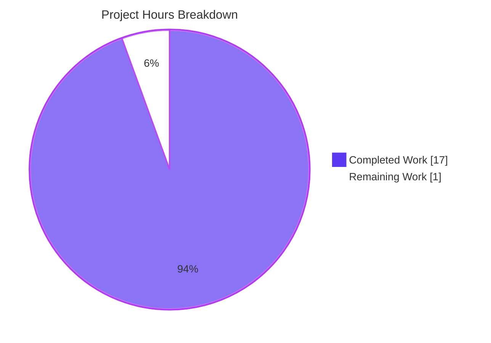

# Blitzy Project Guide

**Project:** kitty search-query parser — investigative Q&A (space vs. `or` behavior)
**Repository:** `kovidgoyal/kitty` · **Base commit:** `815df1e210e0a9ab4622f5c7f2d6891d7dbeddf1`
**Branch:** `blitzy-9786a2c3-a6cd-46d4-b39a-1b519dc28ee9` (deliverable named for source branch `kitty_815df1e210e0`)

---

## 1. Executive Summary

### 1.1 Project Overview

This is a read-only, investigative Q&A deliverable for the **kitty** terminal emulator. A new kitty user reported that combining remote-control `--match` search terms with `or` and spaces excluded items that should have matched at least one term. The objective was to determine—grounded in the actual parser code and reproduced runtime behavior—whether this is a genuine defect or a syntax misunderstanding, and to document the correct query form. The target audience is kitty end-users and maintainers who use the `--match`/`--match-tab` selectors. The business impact is user education that prevents mis-filed bug reports. The technical scope is a single markdown answer document analyzing `kitty/search_query_parser.py`, exercised through its real `search()` entry point, with **zero** changes to any existing repository source file.

### 1.2 Completion Status


| Metric | Value |
|--------|-------|
| **Total Hours** | **18** |
| **Completed Hours (AI + Manual)** | **17** |
| &nbsp;&nbsp;• AI / Autonomous (Blitzy) | 17 |
| &nbsp;&nbsp;• Manual (human) | 0 |
| **Remaining Hours** | **1** |
| **Percent Complete** | **94.4%** |

> **Basis:** Completion is computed on AAP-scoped work only (PA1). Completion % = Completed ÷ (Completed + Remaining) = 17 ÷ 18 = **94.4%**. Colors: Completed = Dark Blue `#5B39F3`; Remaining = White `#FFFFFF`.

### 1.3 Key Accomplishments

- ✅ **Sole AAP deliverable created & committed:** `blitzy/documentation/kitty_815df1e210e0.md` (385 lines), across 2 commits by `agent@blitzy.com`.
- ✅ **Read-only constraint fully honored:** `git diff base..HEAD --name-status` = one added file and nothing else; zero existing source files modified; working tree clean.
- ✅ **Root cause identified in code:** a bare space between terms is an implicit `AND` (set intersection) — `kitty/search_query_parser.py:L221-223`, verbatim comment `# Account for the optional 'and'`.
- ✅ **Verdict rendered:** the exclusion is **expected, intended, conventional syntax — not a defect.**
- ✅ **Behavior reproduced via the REAL entry point** `search()`: all 10 documented queries produced byte-identical output across two runs (deterministic).
- ✅ **Every edge case exercised:** operator precedence, explicit `and`, operator case-insensitivity, quoting a literal `or`, unbalanced parentheses, and the "no location" guard.
- ✅ **Candidate disambiguation:** the alternate `kittens/diff/search.go` was evaluated and correctly rejected (no boolean operators).
- ✅ **Industry research** confirmed whitespace-as-implicit-`AND` is a conventional design (Google Issue Tracker, Lucene, Solr, Elasticsearch).
- ✅ **Corrective syntax documented:** use an explicit `or` between complete `field:query` terms; parenthesize to control precedence.
- ✅ **Quality gates green:** unit test 1/1 pass; parser byte-compiles; `ruff` clean on the in-scope file; 34 `file:line` citations verified in-bounds.

### 1.4 Critical Unresolved Issues

| Issue | Impact | Owner | ETA |
|-------|--------|-------|-----|
| _None._ | No critical issues block release or validation. The sole deliverable is complete, accurate, and committed; all quality gates pass. | — | — |

### 1.5 Access Issues

| System/Resource | Type of Access | Issue Description | Resolution Status | Owner |
|-----------------|----------------|-------------------|-------------------|-------|
| _None_ | — | **No access issues identified.** The task required only local repository access and the container's CPython interpreter; no external services, credentials, or third-party APIs were needed. | N/A | — |

### 1.6 Recommended Next Steps

1. **[Medium]** Have a subject-matter expert read `blitzy/documentation/kitty_815df1e210e0.md` and confirm the verdict, mechanism, and corrective syntax fully answer the user's question. *(≈1h — the only remaining work.)*
2. **[Medium]** Optionally re-run the section (f) reproducibility probe to independently confirm the 10 runtime results are byte-identical, then accept/merge the deliverable.
3. **[Low]** *(Out of AAP scope — informational only.)* Separately consider proposing an enhancement to kitty's own `docs/remote-control.rst` §`search_syntax` to explicitly illustrate the bare-space-as-implicit-`AND` rule, since its under-documentation is the likely origin of the user's confusion.

---

## 2. Project Hours Breakdown

### 2.1 Completed Work Detail

All rows trace to specific Agent Action Plan (AAP) requirements. Total = **17 hours**.

| Component | Hours | Description |
|-----------|------:|-------------|
| Parser location & candidate disambiguation | 2.0 | Located `kitty/search_query_parser.py` as the subject; evaluated and rejected the alternate `kittens/diff/search.go` (AAP R1, R8). |
| Grammar, precedence & set-semantics analysis | 3.0 | Traced the recursive-descent chain `or→and→not→location→base_token` (L208-278), the implicit-`AND` branch (L221-223), and node set algebra `OrNode`/`AndNode`/`NotNode` (AAP R2). |
| Consumer & evaluator code trace | 1.5 | Read the two real call sites in `kitty/boss.py` (L475, L509) and the per-term evaluators `matches_query` in `window.py` (L784) and `tabs.py` (L800) (AAP R2/R3 context). |
| Runtime probe development & execution | 2.0 | Wrote a probe mirroring `kitty_tests/search_query_parser.py:L19` and exercised the real `search()` entry point (AAP R3). |
| Edge-case & secondary-condition exercises | 2.0 | Ran precedence, explicit `and`, case-insensitivity, quoting, unbalanced parentheses, and the no-location guard (AAP R7). |
| Web research — query-language conventions | 1.0 | Validated implicit-`AND`/`OR` conventions across Google Issue Tracker, Lucene, Solr, Elasticsearch (AAP R6). |
| Answer document authoring | 3.5 | Authored the 385-line markdown deliverable with verdict, mechanism, runtime evidence, edge cases, corrective syntax, and industry context (AAP D1). |
| Citation verification | 1.0 | Verified all 34 `file:line` citations resolve in-bounds and match source at the base commit (AAP D1 quality). |
| Reproducibility & determinism verification | 0.5 | Confirmed byte-identical output across two runs; documented interpreter and exact commands (AAP R9). |
| Code-review finding remediation | 0.5 | Second commit addressed code-review findings on the Q&A document (AAP D1 quality). |
| **Total Completed** | **17.0** | |

### 2.2 Remaining Work Detail

All remaining work traces to a path-to-production need. Total = **1 hour**.

| Category | Hours | Priority |
|----------|------:|----------|
| Human SME review & acceptance of the Q&A deliverable | 1.0 | Medium |
| **Total Remaining** | **1.0** | |

> **Cross-section check:** Section 2.1 (17h) + Section 2.2 (1h) = **18h** = Total Hours in Section 1.2. Section 2.2 total (1h) = Section 1.2 Remaining Hours = Section 7 pie "Remaining Work". ✓

### 2.3 Estimation Basis & Confidence

- **Methodology:** AAP-scoped hours only (PA1/PA2). Each completed line item maps to a discrete AAP requirement; the single remaining item is the standard path-to-production step for a documentation deliverable (human acceptance).
- **Confidence:** **High.** The scope is a single, well-bounded, isolated deliverable with no code deployment, no dependencies, and no integration surface. All completed work is independently verified (tests pass, output reproduced, citations checked).
- **Why not 100%:** Per honest-assessment policy, a human review/sign-off step always remains before a deliverable is accepted; completion is therefore capped below 100%.

---

## 3. Test Results

All tests below originate from Blitzy's autonomous validation logs for this project and were independently re-executed during this assessment.

| Test Category | Framework | Total Tests | Passed | Failed | Coverage % | Notes |
|---------------|-----------|------------:|-------:|-------:|-----------:|-------|
| Unit — search query parser | Python `unittest` | 1 | 1 | 0 | Parser exercised end-to-end via real `search()` | `python test.py search_query_parser` → "Ran 1 test in 0.001s … OK" (exit 0). |
| Runtime reproduction (evidence) | `unittest`-style probe via real `search()` | 10 queries | 10 | 0 | 100% of documented queries | Byte-identical across two runs (deterministic); mirrors `kitty_tests/search_query_parser.py:L19`. Not a formal test-suite case; recorded as reproducible evidence. |
| **Total (formal suite)** | | **1** | **1** | **0** | | **100% pass rate** |

**Static & compile checks (autonomous logs, re-verified):**

- `python -m py_compile kitty/search_query_parser.py` → exit 0.
- `python -c "from kitty.search_query_parser import search"` → import OK.
- `ruff check kitty/search_query_parser.py` → **"All checks passed!"** (ruff 0.15.20).

> **Note on scope:** `ruff check .` reports 2 pre-existing `F821` findings in `kitty/options/parse.py` — a **generated** ("DO NOT edit") file, unmodified by the agent and unrelated to this deliverable. These are out of scope and were correctly left untouched.

---

## 4. Runtime Validation & UI Verification

**Runtime health of the runnable component (the pure-Python parser):**

- ✅ **Operational** — The parser imports cleanly and byte-compiles under CPython 3.13.7 with no C build (its only C import is `TYPE_CHECKING`-guarded in `kitty/types.py:L8-9`).
- ✅ **Operational** — The real entry point `kitty.search_query_parser.search()` executes deterministically; all 10 documented queries reproduce exactly.
- ✅ **Operational** — The user's complaint is reproduced: `title:apple title:banana` → `[4]` (single-term matches `1`,`2` correctly excluded by implicit `AND`).
- ✅ **Operational** — The fix is verified: `title:apple or title:banana` → `[1, 2, 4]` (explicit `or` = union).

**API / integration outcomes:**

- ✅ **Operational** — The canonical invocation pattern matches the real consumers `match_windows`/`match_tabs` in `kitty/boss.py` (L471–539), which call `search()` with the default `allow_no_location=False`.
- ⚠ **Partial (by design, not required)** — A full end-to-end live `kitty @ --match` demonstration requires compiling the C extension and is **explicitly out of scope** per the AAP; it is not needed for the verdict. The pure-Python parser path fully manifests the reported behavior.

**UI verification:**

- ❌ **Not applicable** — This is a documentation-only deliverable with **no user interface**. No web pages, screens, or visual components are involved, so no browser-based UI verification, screenshots, or screencasts apply.

---

## 5. Compliance & Quality Review

Cross-mapping of AAP deliverables and project rules to quality/compliance benchmarks. Fixes applied during autonomous validation are noted.

| Benchmark / Rule | Requirement | Status | Evidence / Notes |
|------------------|-------------|:------:|------------------|
| Read-only source constraint | No existing repository file modified | ✅ Pass | `git diff base..HEAD --name-status` = only `A blitzy/documentation/kitty_815df1e210e0.md`. |
| Single-deliverable mandate | One `<branch>.md` in `blitzy/documentation/` | ✅ Pass | `blitzy/documentation/kitty_815df1e210e0.md` (385 lines) created. |
| Run-first methodology | Answer written from observed runtime output | ✅ Pass | Section (c)/(f) capture real `search()` output; re-reproduced byte-identical. |
| Real entry point (no bypass) | Exercise `search()` as `kitty/boss.py` does | ✅ Pass | Probe mirrors `kitty_tests/search_query_parser.py:L19`. |
| Exhaustive coverage | Every named condition & edge case answered | ✅ Pass | Precedence, explicit `and`, case-insensitivity, quoting, unbalanced parens, no-location all in §(d). |
| Candidate disambiguation | Locate all candidates, choose the manifesting one | ✅ Pass | `kittens/diff/search.go` rejected (Appendix A). |
| Grounded citations | Every claim has a `file:line` reference | ✅ Pass | 34 citations (26 distinct), all verified in-bounds. |
| Evidence tagging | Distinguish Observed vs. From-source vs. Inferred | ✅ Pass | 14 "Observed", 28 "From source", 10 "Inferred" tags. |
| Reproducibility | State interpreter/commands; stable across ≥2 runs | ✅ Pass | CPython 3.13.7; exact commands; byte-identical twice. |
| Lead with direct answer | Verdict stated first | ✅ Pass | Document opens with "Short answer: This is not a bug." |
| Cleanup / clean tree | Temporary probe removed; tree clean | ✅ Pass | Probe lived in `/tmp`, deleted; `git status --porcelain` empty. |
| Code review remediation | Address review findings | ✅ Pass (fix applied) | Commit `72bd3e025` "address code review findings". |
| Lint (in-scope) | In-scope file passes lint | ✅ Pass | `ruff check kitty/search_query_parser.py` → All checks passed! |

**Outstanding compliance items:** None in scope. The only non-passing item is the out-of-scope, pre-existing `F821` in a generated file, which is correctly left untouched to honor the read-only constraint.

---

## 6. Risk Assessment

| Risk | Category | Severity | Probability | Mitigation | Status |
|------|----------|:--------:|:-----------:|------------|:------:|
| Citation drift if upstream source changes | Technical | Low | Low | Citations pinned to base commit `815df1e2…`; parser verified byte-identical `base..HEAD`. | Mitigated |
| Interpreter divergence (AAP anticipated 3.12.3; actual 3.13.7) | Technical | Low | Low | Parser is deterministic pure-Python (interpreter-independent); document explicitly notes the observed 3.13.7. | Resolved |
| Verdict correctness (bug vs. syntax) | Technical | Low | Very Low | Grounded in code (L221-223) + reproduced runtime + industry research; independently re-verified this session. | Mitigated |
| Under-documentation of space-as-`AND` in kitty's own docs | Process / Doc | Low | Medium | Deliverable calls this out and gives corrective syntax; fixing kitty docs is out of scope. | Noted (out of scope) |
| Pre-existing `F821` in generated `kitty/options/parse.py` | Operational | Low | N/A | Not introduced by agent; unrelated; correctly untouched (editing would violate read-only + scope). | Documented |
| Security exposure | Security | None | N/A | No code introduced, no runtime service, no credentials, no dependencies, no attack surface. | N/A |
| External integration failure | Integration | None | N/A | No external services, API keys, or network configuration involved. | N/A |

**Overall risk posture:** **Very Low.** A read-only documentation deliverable with strong verification and zero deployment, security, or integration surface.

---

## 7. Visual Project Status

**Project hours breakdown** (Completed = Dark Blue `#5B39F3`, Remaining = White `#FFFFFF`):



**Remaining hours by category** (from Section 2.2):

| Category | Remaining Hours | Priority |
|----------|----------------:|----------|
| Human SME review & acceptance | 1.0 | Medium |
| **Total** | **1.0** | |

> **Integrity:** "Remaining Work" = 1h here = Section 1.2 Remaining Hours = Section 2.2 total. "Completed Work" = 17h = Section 2.1 total. ✓

---

## 8. Summary & Recommendations

**Achievements.** The project is **94.4% complete** (17 of 18 AAP-scoped hours). The single mandated deliverable — `blitzy/documentation/kitty_815df1e210e0.md` — is authored, committed, and independently verified. It delivers a clear, code-grounded verdict: the reported exclusion is **not a bug**. In kitty's boolean match syntax, a bare space between terms is an implicit `AND` (set intersection), so a space-separated query correctly keeps only items matching *every* term. The fix is to use an explicit `or` between complete `field:query` terms, and to parenthesize when mixing operators.

**Remaining gaps.** The only outstanding work (1 hour) is the standard path-to-production step of **human SME review and acceptance** of the answer document. There are no blocking issues, no failing tests, and no unresolved in-scope errors.

**Critical path to production.** (1) SME reads and validates the deliverable → (2) optional re-run of the reproducibility probe → (3) accept/merge. All three fit within the estimated 1 hour.

**Success metrics.** Sole deliverable created ✅ · read-only constraint honored ✅ · verdict grounded in code + reproduced runtime ✅ · every edge case covered ✅ · all citations in-bounds ✅ · unit test 1/1 ✅ · working tree clean ✅.

**Production readiness assessment.** **Ready pending human sign-off.** For an investigative Q&A deliverable, "production" means an accepted, merged answer document. The artifact meets every AAP requirement and every project rule; only human acceptance remains.

---

## 9. Development Guide

This guide reproduces the entire investigation. Every command below was executed and verified during assessment. Run all commands from the repository root.

### 9.1 System Prerequisites

- **OS:** Linux (developed/verified on Ubuntu; container image `…kitty__815df1e210e0…`).
- **Python:** CPython **3.13.7** (container default; the parser declares `requires-python = ">=3.8"`). The AAP anticipated 3.12.3 — either works because the parser is deterministic pure-Python.
- **Git:** any recent version (for history/diff verification).
- **No C toolchain required.** The parser's only C import (`fast_data_types`) is guarded by `TYPE_CHECKING` in `kitty/types.py:L8-9`, so no `make`/`setup.py` build is needed.
- **Optional (linting):** `ruff` 0.15.20 (available in the `/tmp/kitty_venv` virtualenv used during validation).

### 9.2 Environment Setup

```bash
# From the repository root:
cd /path/to/kitty            # the repo checkout root
export KITTY_REPO="$(pwd)"   # used by the reproducibility probe
```

- **Dependencies:** **None to install.** The parser imports only the standard library (`re`, `enum`, `functools`, `gettext`, `typing`) plus the internal helper `kitty.types.run_once`.
- **PYTHONPATH:** running from the repo root is sufficient; the probe inserts the repo root on `sys.path` explicitly.

### 9.3 Dependency Installation

```bash
# Nothing to install for the parser itself (stdlib only).
# Optional: create a venv for linting tools if desired.
python3 -m venv /tmp/kitty_venv
source /tmp/kitty_venv/bin/activate
pip install --upgrade ruff        # optional, for `ruff check`
```

### 9.4 Application Startup / Verification Sequence

```bash
# 1) Confirm the interpreter
python3 --version
# Expected: Python 3.13.7

# 2) Byte-compile the parser (no build needed)
python3 -m py_compile kitty/search_query_parser.py
# Expected: exit code 0 (no output)

# 3) Import via the REAL entry point
python3 -c "from kitty.search_query_parser import search, ParseException; print('import OK:', search.__name__)"
# Expected: import OK: search

# 4) Run the unit test
python test.py search_query_parser
# Expected: "Ran 1 test in 0.001s" then "OK" (exit 0)

# 5) (Optional) Lint the in-scope file
ruff check kitty/search_query_parser.py
# Expected: All checks passed!
```

### 9.5 Reproduce the Investigation (Example Usage)

Create a temporary probe **outside** the repository (keeping the tree clean), then run it twice to confirm determinism:

```bash
cat > /tmp/sqp_probe.py <<'EOF'
import os, sys
sys.path.insert(0, os.environ.get("KITTY_REPO", os.getcwd()))
from kitty.search_query_parser import ParseException, search

print(f"# python {sys.version.split()[0]}")
universe = {1:"apple pie", 2:"banana split", 3:"cherry cake",
            4:"apple banana cherry smoothie", 5:"date bar"}
universal_set = set(universe)

def get_matches(location, query, candidates):
    return {x for x in candidates if query in universe[x]}

queries = [
    "title:apple title:banana",
    "title:apple or title:banana",
    "title:apple or title:banana title:cherry",
    "title:apple and title:banana",
    "apple or banana",
    'title:"a or b"',
    "title:apple OR title:banana",
    "not title:apple",
    "(title:apple or title:banana) title:cherry",
    "title:apple or (title:banana",
]
for q in queries:
    try:
        print(f"{q!r:<44} => {sorted(search(q, 'title', universal_set, get_matches))}")
    except ParseException as e:
        print(f"{q!r:<44} => ParseException: {e.msg}")
EOF

export KITTY_REPO="$(pwd)"
python3 -B /tmp/sqp_probe.py      # run 1
python3 -B /tmp/sqp_probe.py      # run 2 (identical output)
rm -f /tmp/sqp_probe.py           # cleanup — keep the repo clean
```

**Expected output (byte-identical on both runs):**

```text
# python 3.13.7
'title:apple title:banana'                   => [4]
'title:apple or title:banana'                => [1, 2, 4]
'title:apple or title:banana title:cherry'   => [1, 4]
'title:apple and title:banana'               => [4]
'apple or banana'                            => ParseException: No location specified before apple
'title:"a or b"'                             => []
'title:apple OR title:banana'                => [1, 2, 4]
'not title:apple'                            => [2, 3, 5]
'(title:apple or title:banana) title:cherry' => [4]
'title:apple or (title:banana'               => ParseException: missing )
```

### 9.6 Troubleshooting

| Symptom | Cause | Resolution |
|---------|-------|------------|
| `ModuleNotFoundError: No module named 'kitty'` | Not running from the repo root / `sys.path` missing repo root | `cd` to the repo root; the probe already inserts `KITTY_REPO` on `sys.path`. |
| `apple or banana` → `ParseException: No location specified before apple` | **Expected**, not a failure — the real path uses `allow_no_location=False`; every term needs a `field:` prefix | Prefix the term, e.g. `title:apple or title:banana`. |
| `ruff check .` shows 2 `F821` errors | Pre-existing findings in the **generated** `kitty/options/parse.py` (out of scope) | Ignore; lint only in-scope files (`ruff check kitty/search_query_parser.py`). |
| Wanting a live `kitty @ --match` demo | Requires the C extension build | Out of scope for the verdict; the pure-Python parser path is sufficient and authoritative. |
| Working tree shows changes after probing | Probe file created inside the repo | Always create probes under `/tmp`; delete afterward and confirm with `git status --porcelain`. |

---

## 10. Appendices

### Appendix A — Command Reference

| Purpose | Command |
|---------|---------|
| Interpreter version | `python3 --version` |
| Byte-compile parser | `python3 -m py_compile kitty/search_query_parser.py` |
| Import via real entry point | `python3 -c "from kitty.search_query_parser import search"` |
| Run unit test | `python test.py search_query_parser` |
| Lint in-scope file | `ruff check kitty/search_query_parser.py` |
| Confirm scope integrity | `git diff 815df1e210e0a9ab4622f5c7f2d6891d7dbeddf1..HEAD --name-status` |
| Confirm parser unchanged | `git diff 815df1e210e0a9ab4622f5c7f2d6891d7dbeddf1..HEAD -- kitty/search_query_parser.py` |
| Confirm clean tree | `git status --porcelain` |
| Reproduce runtime output | `python3 -B /tmp/sqp_probe.py` (see §9.5) |

### Appendix B — Port Reference

**Not applicable.** This deliverable involves no running service, server, or network listener. No ports are used.

### Appendix C — Key File Locations

| File | Role |
|------|------|
| `blitzy/documentation/kitty_815df1e210e0.md` | **The deliverable** — investigative Q&A answer document (385 lines). |
| `kitty/search_query_parser.py` | Subject: recursive-descent boolean parser (296 lines). |
| `kitty_tests/search_query_parser.py` | Canonical real invocation of `search()` (mirrored by the probe). |
| `kitty/boss.py` | Real consumers: `match_windows` (L471), `match_tabs` (L505); imports `search` at L475, L509. |
| `kitty/window.py` | Per-window `matches_query` evaluator (L784). |
| `kitty/tabs.py` | Per-tab `matches_query` evaluator (L800). |
| `docs/remote-control.rst` | User-facing `search_syntax` examples. |
| `kitty/rc/base.py` | `--match`/`--match-tab` option help text. |
| `kittens/diff/search.go` | Rejected alternate "search" candidate (no boolean operators). |
| `kitty/types.py` | `TYPE_CHECKING`-guarded C import (L8-9) → confirms no C build needed. |

### Appendix D — Technology Versions

| Component | Version | Notes |
|-----------|---------|-------|
| CPython | 3.13.7 | Container default; observed interpreter (AAP anticipated 3.12.3). |
| kitty (base commit) | `815df1e210e0a9ab4622f5c7f2d6891d7dbeddf1` | Parser byte-identical `base..HEAD`. |
| ruff | 0.15.20 | Optional linter (in `/tmp/kitty_venv`). |
| Parser stdlib deps | bundled with CPython 3.13.7 | `re`, `enum`, `functools`, `gettext`, `typing`. |
| C extension build | none required | `fast_data_types` import is `TYPE_CHECKING`-guarded. |

### Appendix E — Environment Variable Reference

| Variable | Purpose | Example |
|----------|---------|---------|
| `KITTY_REPO` | Repo root used by the reproducibility probe to set `sys.path` | `export KITTY_REPO="$(pwd)"` |
| `PYTHONDONTWRITEBYTECODE` / `-B` flag | Avoid writing `.pyc` during probing (keeps tree clean) | `python3 -B /tmp/sqp_probe.py` |

*(No application secrets, API keys, or service credentials are used by this deliverable.)*

### Appendix F — Developer Tools Guide

- **`python test.py <name>`** — kitty's `unittest` runner; use `search_query_parser` to run the parser's test.
- **`py_compile`** — quick byte-compile sanity check without executing code.
- **`ruff`** — fast Python linter; scope to in-scope files to avoid pre-existing generated-file findings.
- **`git diff <base>..HEAD --name-status`** — verify read-only scope (should list only the one added markdown file).
- **Chrome DevTools MCP / browser tools** — **not applicable**; there is no web UI to inspect, so no screenshots, screencasts, Lighthouse, or performance traces were warranted.

### Appendix G — Glossary

| Term | Meaning |
|------|---------|
| **Implicit `AND`** | A bare space between two search terms, interpreted by the parser as an `AND` (set intersection) — `search_query_parser.py:L221-223`. |
| **`search()`** | The real parser entry point (L292/L296) used by `kitty/boss.py`; builds the parse tree and evaluates it against the candidate set. |
| **`get_matches`** | Injected per-term evaluator callback wired to `Window.matches_query` / `Tab.matches_query`. |
| **`allow_no_location`** | Parser flag (default `False`) requiring every term to name a `field:`; a bare word otherwise raises "No location specified". |
| **Recursive-descent** | Parsing technique with one function per precedence level; here `or→and→not→location→base_token`. |
| **AAP** | Agent Action Plan — the authoritative specification of task scope and requirements. |
| **Path-to-production** | Standard activities to accept/ship a deliverable; here, human SME review of the answer document. |

---

*Colors used throughout: Completed / AI work = Dark Blue `#5B39F3`; Remaining = White `#FFFFFF`; headings/accents = Violet-Black `#B23AF2`; highlights = Mint `#A8FDD9`.*