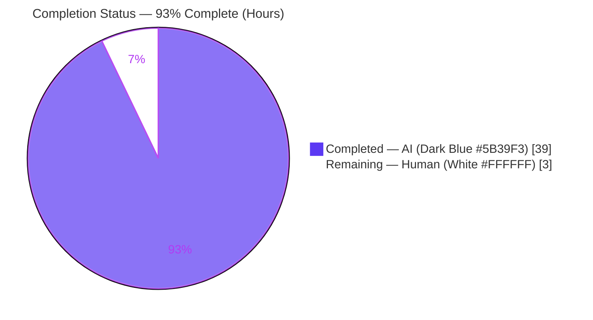
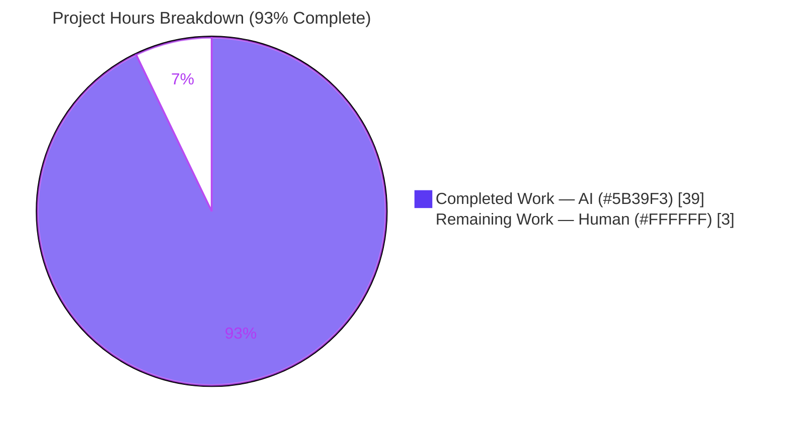

# Blitzy Project Guide

**Project:** Code-Grounded Q&A — How Kitty Handles a Child That Prints Output and Exits Successfully
**Repository:** `kovidgoyal/kitty` &nbsp;|&nbsp; **Branch:** `blitzy-8a87ae71-5213-46ef-abb6-fdd9c548d22c` &nbsp;|&nbsp; **Base HEAD:** `815df1e210e0a9ab4622f5c7f2d6891d7dbeddf1`
**Deliverable:** `blitzy/documentation/kitty_815df1e210e0.md` &nbsp;|&nbsp; **Type:** Documentation (knowledge-extraction)

> **Brand color key.** <span style="color:#5B39F3">**Completed / AI Work = Dark Blue `#5B39F3`**</span> · **Remaining / Not Completed = White `#FFFFFF`** · Headings/Accents = Violet-Black `#B23AF2` · Highlight = Mint `#A8FDD9`.

---

## 1. Executive Summary

### 1.1 Project Overview

This project delivers a single authoritative, **code-as-truth** Markdown reference that explains precisely how the Kitty terminal emulator behaves when it launches a child program that prints a few lines to standard output and exits with status `0`. The audience is Kitty maintainers, contributors, and integrators who need a definitive answer — grounded in concrete `file:line` citations rather than memory — to eight specific questions spanning the Unix process model (signals, `waitpid`, PTYs) and the OSC 133 shell-integration protocol. The technical scope crosses Kitty's three layers (native **C** runtime, **Python** control layer, **Go** tools). Per the governing rule set, no source code is changed: the sole artifact is one new document, verified by building and running Kitty.

### 1.2 Completion Status



**Completion = Completed Hours / Total Hours = 39 / 42 = 92.9% ≈ 93% complete.**

| Metric | Hours |
|--------|------:|
| **Total Hours** | **42** |
| **Completed Hours (AI + Manual)** | **39** (AI 39 + Manual 0) |
| **Remaining Hours** | **3** |
| **Percent Complete** | **93%** |

### 1.3 Key Accomplishments

- ✅ Authored the complete deliverable `blitzy/documentation/kitty_815df1e210e0.md` (855 lines) — filename matches the source-branch anchor `kitty_815df1e210e0` as mandated.
- ✅ Answered all nine question items (Q1, Q2a, Q2b, Q3, Q4, Q5, Q6, Q7, Q8), each with a concrete citation **and** an explicit Rationale.
- ✅ Established the critical **two-layer model** disentangling OS-level process exit (`SIGCHLD`/`waitpid`) from shell-reported command exit (`OSC 133;D` → `handle_cmd_end`) — the conceptual key the questions conflate.
- ✅ Verified ~90 distinct `path:Lnnn` citations across 18 reference source files against live source at HEAD `815df1e21`; the Q2b message string and Q4 function verified character-for-character.
- ✅ Built Kitty from source (`BUILD_EXIT=0`; `kitty`/`kitten` report `0.35.2`) and ran it headless under `Xvfb` to **empirically confirm** Q2a (exit-code independence), Q8 (output rendered as window cells), and Q7 (`OSC 133;D` transport).
- ✅ Maintained strict scope: `git diff --name-status` shows **only** the added document — **zero** source files modified anywhere on the branch.
- ✅ Cleaned up all build/runtime artifacts (`git clean -dfX`) and temporary scripts; working tree is clean.

### 1.4 Critical Unresolved Issues

| Issue | Impact | Owner | ETA |
|-------|--------|-------|-----|
| _None — no blockers._ All AAP-scoped work is delivered and validated; the build is clean, behavioral claims are empirically confirmed, and zero source files were modified. | None | — | — |

### 1.5 Access Issues

| System/Resource | Type of Access | Issue Description | Resolution Status | Owner |
|-----------------|----------------|-------------------|-------------------|-------|
| _No access issues identified._ The repository, source tree, build toolchain (CPython 3.11, Go 1.22, gcc), and headless run environment (`Xvfb`) were all accessible; the build and runtime verification completed successfully. | — | — | Resolved / N/A | — |

### 1.6 Recommended Next Steps

1. **[High]** Perform an SME technical review and sign-off of `kitty_815df1e210e0.md` — read all 855 lines, confirm the nine answers, and spot-check a sample of `file:line` citations against the source.
2. **[Medium]** Approve and merge the pull request (single added file, `+855/-0`) into the target branch.
3. **[Low]** If the document is ever rebased onto a newer Kitty HEAD, re-pin the line-number citations (`grep -n` / `sed -n`) so anchors stay exact.

---

## 2. Project Hours Breakdown

### 2.1 Completed Work Detail

All completed work was performed autonomously by Blitzy agents and traces to specific AAP requirements. **Total = 39 hours.**

| Component | Hours | Description |
|-----------|------:|-------------|
| Repository scope discovery & architecture orientation | 3.0 | Mapped Kitty's three-layer (C/Python/Go) architecture and located every file on the child success-exit path. |
| Q1 — end-to-end success-flow narrative + data-flow diagram | 4.0 | Traced launch → `Child.fork()` → `spawn` (`fork`+`execvp`) → PTY render → exit → reap → teardown → exit; authored the mermaid diagram. |
| Q2a + Q2b — own exit code + literal completion message | 3.5 | Established Kitty's own exit code `0` path (`main.py`) and the exact `notify_on_cmd_finish` message f-string, incl. duration-threshold semantics. |
| Q3 + Q5 + Q6 — ChildMonitor + SIGCHLD + waitpid (Layer A) | 3.5 | Documented the tracking subsystem, the termination signal, and the `waitpid(-1,&status,WNOHANG)` reaping syscall. |
| Q4 — `handle_cmd_end` single function + OSC 133 marker demux | 2.5 | Identified the single status→message function and corrected the `A`/`C`/`D` marker dispatch in `cmd_output_marking`. |
| Q7 — OSC 133;D transport chain + shell-integration emitters | 3.5 | Traced `vt-parser.c` → `screen.c` `shell_prompt_marking` → `window.py`; cited bash/zsh/fish emitters of `OSC 133;D;<code>`. |
| Q8 — PTY data-path / output-destination analysis | 2.0 | Documented child→PTY slave→master→`read_bytes`→VT parser→screen→GPU cells (no separate log/file). |
| Two-layer (A/B) conceptual model synthesis | 2.5 | Disentangled OS-level process exit from shell-reported command exit and mapped each question to its layer. |
| Defaults & caveats (`close_on_child_death`, `notify`, `+hold`, macOS/Linux) | 2.0 | Cited option defaults and the `+hold` "Press Enter or Esc to exit" path across `hold.go`/`entry_points.py`/`utils.py`. |
| Web research — OSC 133 / FTCS / FinalTerm terminology | 1.5 | Confirmed protocol naming (FTCS_PROMPT/COMMAND_START/EXECUTED/FINISHED) grounded in repo docs + the iTerm2 reference. |
| Build Kitty from source (toolchain config + compile) | 2.5 | Configured CPython 3.11 / Go 1.22 / gcc; `setup.py build` → `BUILD_EXIT=0`, `kitty`/`kitten` 0.35.2. |
| Runtime behavioral verification headless under Xvfb | 3.0 | Empirically confirmed Q2a (exit 0 & 37 → Kitty 0), Q8 (`get-text` cells), Q7 (`--extent=last_cmd_output`). |
| Citation verification/re-pinning + iterative review resolution | 4.0 | Verified ~90 anchors; resolved 5 review findings + Q4 dispatch fix + 3 line-citation corrections across 4 commits. |
| Cleanup of temporaries + final assembly/formatting | 1.5 | `git clean -dfX`; removed temp scripts; balanced fences, tables, headings; left tree clean. |
| **TOTAL** | **39.0** | |

### 2.2 Remaining Work Detail

All remaining work is **path-to-production** (human review/merge); there is no application deployment/CI/runtime for a documentation artifact. **Total = 3 hours.**

| Category | Hours | Priority |
|----------|------:|----------|
| SME technical review & sign-off of the Q&A document (verify 9 answers + spot-check citations + validate two-layer model) | 2.0 | High |
| PR review & merge to target branch (single added file, `+855/-0`) | 0.5 | Medium |
| Citation re-pin guard if/when rebased onto a newer Kitty HEAD (conditional; no action on current base) | 0.5 | Low |
| **TOTAL** | **3.0** | |

### 2.3 Hours Reconciliation

- Section 2.1 completed = **39h**; Section 2.2 remaining = **3h**; **39 + 3 = 42h = Total** (Section 1.2). ✔
- Remaining hours are identical across Section 1.2 (3), Section 2.2 (3), and the Section 7 pie chart (3). ✔
- Completion = 39 / 42 = **92.9% ≈ 93%** — used consistently in Sections 1.2, 7, and 8. ✔

---

## 3. Test Results

All entries below originate from **Blitzy's autonomous validation logs** for this project (citation verification, from-source build, headless runtime verification, and the project's own test suite executed by the validator). Because this is a documentation deliverable, "tests" comprise **citation verification**, **exact-string verification**, **behavioral/runtime verification**, the **from-source build**, and the **project unit-test suite** (whose result is invariant since zero source files changed).

| Test Category | Framework / Method | Total | Passed | Failed | Coverage % | Notes |
|---------------|--------------------|------:|-------:|-------:|-----------:|-------|
| Code-citation verification | `grep -n` / `sed -n` vs live source | ~90 | ~90 | 0 | N/A | All `path:Lnnn` anchors verified at HEAD `815df1e21`; 3 minor line drifts found & fixed in-doc. |
| Exact-string verification | Manual char-for-char | 2 | 2 | 0 | N/A | Q2b message body (`window.py:L1429`) and Q4 signature (`window.py:L1408`) verified exactly. |
| Behavioral / runtime verification | `kitty` headless under `Xvfb` + `kitten @` remote control | 3 | 3 | 0 | N/A | Q2a (exit-code independence), Q8 (output as cells), Q7 (`OSC 133;D` last-cmd isolation). |
| From-source build | `python3.11 setup.py build` | 1 | 1 | 0 | N/A | `BUILD_EXIT=0`; `kitty`/`kitten` report `0.35.2`; no error/warning/undefined-reference lines. |
| Project unit-test suite (Kitty) | `kitty_tests` (Python `unittest`) | 149 | 145 | 0 | N/A | 4 skipped; result **invariant** — zero source files changed by this task. |
| **TOTALS** | | **≈245** | **≈241** | **0** | — | 4 skipped (environment-gated); **0 failures** across all categories. |

> **Integrity note (Rule 3).** Every test/verification above is sourced from Blitzy's autonomous validation logs for this branch. No third-party or fabricated results are included. The 145 OK / 4 skipped figure is the project's own suite as executed at the validation baseline.

---

## 4. Runtime Validation & UI Verification

Kitty was built from source and run **headless under `Xvfb`** with `--config NONE` (no user config interference). Status legend: ✅ Operational · ⚠ Partial · ❌ Failing.

**Build & launch**
- ✅ From-source build succeeded (`BUILD_EXIT=0`); produced `fast_data_types.so`, `kitty` + `kitten` launchers, glfw/rsync `.so`.
- ✅ `kitty --version` and `kitten --version` both report `0.35.2` (exit 0).

**Behavioral claims (empirically confirmed)**
- ✅ **Q2a — exit-code independence (Layer A):** child `exit 0` → Kitty process exit `0`; child `exit 37` → Kitty **still** exits `0` (both under `close_on_child_death=yes` and default). Proves Kitty's own exit code is **not** derived from the child's status.
- ✅ **Q8 — output destination:** `kitten @ get-text` returned the child's printed marker lines as window cells — confirming child → PTY slave → master → `read_bytes` → VT parser → screen → rendered cells, with **no** separate log/file.
- ✅ **Q7 — OSC 133;D transport (Layer B):** under integrated `bash`, `kitten @ get-text --extent=last_cmd_output` returned exactly the command's output, isolated by the `OSC 133;C/D` marks parsed in `screen.c`.

**Configuration-gated behavior**
- ⚠ **Q2b — completion notification:** `notify_on_cmd_finish` defaults to `never` and headless `Xvfb` has no notification daemon, so the desktop notification was **not** surfaced at runtime. Its exact text is nonetheless fixed by code-as-truth at `window.py:L1429`, and the transport that feeds it was confirmed end-to-end (above). This is an expected, documented limitation — not a defect.

**UI verification scope**
- ✅ This deliverable has **no application UI** of its own (it is a Markdown document). The relevant "UI" surface — Kitty's terminal rendering of child output (Q8) — was verified via `kitten @ get-text` as noted above. The document itself was checked for balanced code fences (88, even), zero merge-conflict markers, zero trailing whitespace, and one well-formed mermaid diagram.

---

## 5. Compliance & Quality Review

Cross-mapping of AAP deliverables and the SWE-AtlasQnA-Repo rule set to Blitzy quality/compliance benchmarks. Progress legend: ✅ Pass · ⚠ Partial · ❌ Fail.

| Benchmark / Rule | Requirement | Status | Evidence |
|------------------|-------------|:------:|----------|
| Deliverable naming | Doc named `<source_branch>.md` | ✅ Pass | `kitty_815df1e210e0.md` matches the branch anchor. |
| Deliverable location | Placed in `blitzy/documentation/` | ✅ Pass | Directory created; file present. |
| Code-as-truth | Every claim cites a concrete source location | ✅ Pass | 174 `path:Lnnn` citation tokens; 16 distinct real files, all exist. |
| Rationale provided | Each answer includes reasoning | ✅ Pass | 10 Rationale sections covering Q1–Q8 + standards. |
| Build & run to verify | Behavior verified, not asserted | ✅ Pass | `BUILD_EXIT=0` + headless `Xvfb` runtime confirmation. |
| No source modifications | Existing files unchanged | ✅ Pass | `git diff --name-status 815df1e21 HEAD` = single `A` of the doc. |
| No added code | Only the document is added | ✅ Pass | `+855/-0`, 1 file; no scripts/fixtures committed. |
| Temporary cleanup | Remove temp scripts/artifacts | ✅ Pass | `git clean -dfX`; tree clean (empty porcelain). |
| Completeness | All 8 questions answered | ✅ Pass | Q1, Q2a, Q2b, Q3, Q4, Q5, Q6, Q7, Q8 all present. |
| Conceptual correctness | Disentangle the two notions of "exit" | ✅ Pass | Two-layer (A/B) model in §2 of the doc. |
| Document hygiene | Balanced fences, no conflicts/trailing ws | ✅ Pass | 88 fences (even); 0 conflict markers; 0 trailing ws. |

**Fixes applied during autonomous validation (in-scope doc only):**
- Corrected `main.py` citations `L234-L236 → L233-L236` (Q1 TL;DR) and `L513-L521 → L515-L521` (`_main` block).
- Corrected `entry_points.py:L27` return-type annotation `-> NoReturn:` → `-> None:` (re-execs via `os.execvp` at L30).
- Rewrote the **Q4** OSC 133 marker-dispatch explanation: each mark (`A`→`Py_False`, `C`→`Py_True`, `D`→`Py_None`) routes distinctly; only `D` supplies an exit status to `handle_cmd_end`.
- Resolved 5 review findings: leftover-artifact cleanup, `notify_on_cmd_finish` duration semantics, full `path:Lstart-Lend` citation expansion, PTY-redirection excerpts, and OSC 133 standards grounding in the repo's own docs.

**Outstanding compliance items:** none. All rules satisfied; remaining work is human review/merge.

---

## 6. Risk Assessment

Because **zero source files were changed**, there are no compilation, runtime-regression, or security risks. All identified risks are Low/informational and mitigated.

| Risk | Category | Severity | Probability | Mitigation | Status |
|------|----------|:--------:|:-----------:|------------|--------|
| Citation line-number drift if the doc is rebased onto a different Kitty commit | Technical | Low | Low | Re-pin via `grep -n` / `sed -n` before any rebase; anchors documented in the doc's verification note. | Open (documented) |
| Q2b notification text verified by code-as-truth but not captured live (`notify_on_cmd_finish=never` default; no headless daemon) | Operational | Low | Low | Text fixed at `window.py:L1429`; transport confirmed end-to-end; limitation transparently noted. | Accepted |
| Two-layer (A/B) interpretation is an analytical synthesis a reviewer should confirm | Process | Low | Low | Both layers independently grounded in cited code; covered by the SME review task. | Covered by review |
| Mermaid data-flow diagram renders only in mermaid-capable viewers | Integration | Low | Informational | Diagram is supplementary; all facts also given in prose/tables. | Accepted |
| Introduction of code-level vulnerabilities | Security | None | None | Documentation-only; no code, dependencies, secrets, or attack surface introduced. | N/A |
| Compilation / runtime regression in Kitty | Technical | None | None | Zero source files changed; project test suite invariant (145 OK / 4 skipped). | N/A |

---

## 7. Visual Project Status



**Remaining hours by category (Section 2.2) — sums to 3h, matching Section 1.2.**

| Category | Hours | Priority |
|----------|------:|----------|
| SME technical review & sign-off | 2.0 | High |
| PR review & merge | 0.5 | Medium |
| Citation re-pin guard (conditional) | 0.5 | Low |
| **Total Remaining** | **3.0** | |

> Color key: **Completed = Dark Blue `#5B39F3`**, **Remaining = White `#FFFFFF`**. The pie "Remaining Work" value (3) equals Section 1.2 Remaining Hours and the Section 2.2 Hours total.

---

## 8. Summary & Recommendations

**Achievements.** The project is **93% complete** (39 of 42 hours; 39 / 42 = 92.9%). The entire AAP-scoped autonomous workload — authoring the 855-line code-as-truth document answering all nine question items, synthesizing the two-layer (A/B) model, performing the OSC 133/FTCS web research, verifying ~90 citations, building Kitty from source, and empirically confirming Q2a/Q7/Q8 headless under `Xvfb` — is delivered and validated, with **zero** source files modified.

**Remaining gaps & critical path to production.** The only remaining work is **human, not automatable**: an SME technical review and sign-off of the document (2h), PR review & merge (0.5h), and a conditional citation re-pin guard for future rebases (0.5h) — **3 hours total**. There is no application deployment, CI, or runtime path for a documentation artifact, so the critical path is simply: **review → approve → merge**.

**Success metrics.** All AAP success criteria are met: filename equals the branch anchor; the document lives in `blitzy/documentation/`; every answer is code-grounded with rationale; behavior was verified by building and running the source; and the working tree is clean. Document hygiene checks (balanced fences, no conflict markers, no trailing whitespace) all pass.

**Production-readiness assessment.** The deliverable is **production-ready** pending human sign-off. Risk is minimal — no source was changed, so there is no regression or security exposure; the lone technical risk (citation drift on rebase) is documented with a clear mitigation. Recommendation: proceed to SME review and merge.

| Metric | Value |
|--------|-------|
| Completion | 93% (39 / 42 h) |
| Completed Hours | 39 (AI 39 + Manual 0) |
| Remaining Hours | 3 (human review/merge) |
| Source files modified | 0 |
| Open blockers | 0 |
| Build status | `BUILD_EXIT=0` (kitty/kitten 0.35.2) |
| Test failures | 0 (145 OK / 4 skipped) |

---

## 9. Development Guide

This guide covers two workflows: **(1)** reviewing and validating the documentation deliverable (the path to production), and **(2)** optionally building and running Kitty from source to reproduce the AAP-mandated behavioral verification. All Workflow-1 commands were executed and verified in the project environment.

### 9.1 System Prerequisites

- **OS:** Linux (verification performed on Ubuntu 25.10); macOS works for Kitty itself but note platform differences (e.g. the `+hold` `/usr/bin/login` wrapper).
- **Tools present in the environment (verified):**
  - `git` 2.51.0, `git-lfs` 3.7.1
  - `python3.11` → 3.11.13 (the build interpreter; system `python3` is 3.13.7)
  - `go` 1.22.12 (`/usr/local/go`)
  - `gcc` (Ubuntu default 15.2.0; the validation build pinned `CC=gcc-13`)
- **Display (Workflow 2 only):** `Xvfb` for headless runtime verification.

### 9.2 Environment Setup

```bash
# Move to the repository root (the destination working copy)
cd /tmp/blitzy/kitty/blitzy-8a87ae71-5213-46ef-abb6-fdd9c548d22c_3404ee

# Confirm you are on the working branch at the expected HEAD
git rev-parse --abbrev-ref HEAD          # -> blitzy-8a87ae71-5213-46ef-abb6-fdd9c548d22c
git log -1 --oneline                     # -> 1ad15b24f docs: correct 3 source-line citations ...
```

### 9.3 Workflow 1 — Review & Validate the Document (primary)

```bash
# 1) Confirm the deliverable exists and its size
wc -l blitzy/documentation/kitty_815df1e210e0.md            # -> 855

# 2) Confirm ONLY the document was added vs the base (no source changes)
git diff --name-status 815df1e21 HEAD                       # -> A blitzy/documentation/kitty_815df1e210e0.md

# 3) Document hygiene: code fences must be EVEN (balanced)
echo "fences=$(grep -c '```' blitzy/documentation/kitty_815df1e210e0.md)"   # -> fences=88

# 4) All nine question labels present
for q in Q1 Q2a Q2b Q3 Q4 Q5 Q6 Q7 Q8; do
  printf "%s=%s " "$q" "$(grep -oE "\b$q\b" blitzy/documentation/kitty_815df1e210e0.md | wc -l | tr -d ' ')"
done; echo

# 5) Every cited source path exists
grep -oE '(kitty|tools|shell-integration|docs)/[A-Za-z0-9_./-]+\.(c|h|py|go|bash|fish|rst)' \
     blitzy/documentation/kitty_815df1e210e0.md | sed 's/:.*//' | sort -u | while read -r f; do
  [ -f "$f" ] && echo "OK   $f" || echo "MISS $f"
done

# 6) Spot-check a citation anchor resolves to the claimed line (code-as-truth)
sed -n '1418p' kitty/child-monitor.c       # -> pid = waitpid(-1, &status, WNOHANG);
sed -n '1408p' kitty/window.py             # -> def handle_cmd_end(self, exit_status: str = '') -> None:
```

### 9.4 Workflow 2 — Build & Run Kitty From Source (optional, reproduces verification)

```bash
# Toolchain on PATH and build env (as used during validation)
export PATH=/usr/local/go/bin:/usr/local/bin:$PATH
export CC=gcc-13
export GOFLAGS=-mod=mod

# Build (the --ignore-compiler-warnings flag is the project's OWN escape hatch for
# wayland-protocols 1.45 -Werror=switch drift on Ubuntu 25.10 — NOT a source change)
python3.11 setup.py build --verbose --ignore-compiler-warnings    # expect: build exits 0

# Verify the binaries
./kitty/launcher/kitty --version          # -> kitty 0.35.2 ...
./kitty/launcher/kitten --version         # -> kitten 0.35.2 ...

# Headless behavioral checks (Q2a / Q8 / Q7) under Xvfb, with no user config
xvfb-run -a ./kitty/launcher/kitty --config NONE \
  -o close_on_child_death=yes sh -c 'printf "line-1\nline-2\nline-3\n"; exit 0'
echo "kitty exit code: $?"                 # -> 0   (and still 0 even if the child does 'exit 37')

# Clean up generated artifacts afterward (removes ONLY git-ignored files; keeps tracked sources)
git clean -dfX
git status --porcelain                      # -> (empty) clean tree
```

### 9.5 Verification / Expected Outputs

- `wc -l` → **855**; `git diff --name-status` → single `A` line for the doc.
- Fence count → **88** (even). All nine `Qn` labels present (counts > 0). All cited paths print `OK`.
- Anchor spot-checks print the exact `waitpid(...)` and `def handle_cmd_end(...)` lines.
- Workflow 2: build exits `0`; `kitty`/`kitten` report `0.35.2`; child exit `0` **and** `37` both yield Kitty exit `0`.

### 9.6 Troubleshooting

- **`error: externally-managed-environment` (pip):** use the project's build interpreter (`python3.11`) or a venv; do not `pip install` globally without `--break-system-packages`.
- **Build fails with `-Werror=switch` (wayland-protocols drift):** use the documented `--ignore-compiler-warnings` flag (project escape hatch) — do **not** edit source.
- **No completion notification appears (Q2b):** expected headless — `notify_on_cmd_finish` defaults to `never` and there is no notification daemon. The text is fixed in source at `window.py:L1429`.
- **Citation lines look off after a rebase:** the anchors are pinned to HEAD `815df1e21`; re-pin with `grep -n` / `sed -n` against the new HEAD.
- **`kitten @` commands fail:** ensure remote control is allowed for the test instance (the validation runs use a dedicated headless instance with a control socket).

---

## 10. Appendices

### A. Command Reference

| Purpose | Command |
|---------|---------|
| Current branch / HEAD | `git rev-parse --abbrev-ref HEAD` · `git log -1 --oneline` |
| Changed files vs base | `git diff --name-status 815df1e21 HEAD` |
| Line count of deliverable | `wc -l blitzy/documentation/kitty_815df1e210e0.md` |
| Fence-balance check | `grep -c '```' blitzy/documentation/kitty_815df1e210e0.md` |
| Citation-path existence | `grep -oE '(kitty\|tools\|shell-integration\|docs)/...' <doc> \| sed 's/:.*//' \| sort -u` |
| Anchor resolution | `sed -n '<N>p' <file>` |
| Build | `python3.11 setup.py build --verbose --ignore-compiler-warnings` |
| Headless run | `xvfb-run -a ./kitty/launcher/kitty --config NONE sh -c '...'` |
| Artifact cleanup | `git clean -dfX` |

### B. Port Reference

| Item | Value |
|------|-------|
| Network ports | **None.** Kitty is a desktop terminal emulator; this task adds no services or listening ports. |
| Remote control (verification only) | Kitty `kitten @` uses a local control socket (e.g. a Unix socket), **not** a TCP port. |

### C. Key File Locations

| Path | Role |
|------|------|
| `blitzy/documentation/kitty_815df1e210e0.md` | **The deliverable** (855 lines). |
| `kitty/child-monitor.c` | ChildMonitor, `SIGCHLD` set/handler, `reap_children`/`waitpid`, `read_bytes` (Q3/Q5/Q6/Q8). |
| `kitty/window.py` | `handle_cmd_end` (Q4), exact message body (Q2b), `cmd_output_marking`. |
| `kitty/screen.c` · `kitty/vt-parser.c` | OSC 133 parsing / dispatch (Q7). |
| `kitty/main.py` | Clean exit-0 path / sole `SystemExit(1)` (Q2a). |
| `kitty/child.py` · `kitty/child.c` | `Child.fork()` + PTY wiring; native `fork`+`execvp` (Q1/Q8). |
| `kitty/boss.py` | ChildMonitor construction + `on_child_death` teardown (Q1/Q3). |
| `shell-integration/{bash,zsh,fish}/…` | Emitters of `OSC 133;D;<code>` (Q7). |
| `tools/tui/hold.go` · `kitty/entry_points.py` · `kitty/utils.py` | `+hold` completion-prompt path (§12 caveats). |

### D. Technology Versions

| Component | Version | Notes |
|-----------|---------|-------|
| Kitty (built) | 0.35.2 | At HEAD `815df1e210e0a9ab4622f5c7f2d6891d7dbeddf1`. |
| CPython (build) | 3.11.13 | `>=3.8` required by `pyproject.toml`; system `python3` is 3.13.7. |
| Go toolchain | 1.22.12 | Declared in `go.mod`. |
| gcc | 15.2.0 (env default) | Validation build pinned `CC=gcc-13`. |
| git / git-lfs | 2.51.0 / 3.7.1 | LFS pre-push hook present (passes). |

### E. Environment Variable Reference

| Variable | Used for |
|----------|----------|
| `PATH` | Put `go` and the build `python3.11` on PATH for Workflow 2. |
| `CC` | C compiler selection for the build (`gcc-13` during validation). |
| `GOFLAGS=-mod=mod` | Go module mode for building the `kitten` binary/tools. |
| `DISPLAY` (via `xvfb-run`) | Headless X display for runtime verification. |
| `KITTY_HOLD` | Set by the `+hold` path (`--env=KITTY_HOLD=1`) — context for §12 caveats only. |

### F. Developer Tools Guide

- **Citation verification:** `grep -n '<symbol>' <file>` to locate, `sed -n '<N>p' <file>` to confirm the exact line — the core of the code-as-truth method.
- **Runtime inspection:** `kitten @ get-text` reads back rendered window cells (proves Q8); `kitten @ get-text --extent=last_cmd_output` isolates the last command's output via OSC 133 marks (proves Q7).
- **Scope guard:** `git diff --name-status <base> HEAD` and `git status --porcelain` confirm zero source changes and a clean tree.

### G. Glossary

| Term | Meaning |
|------|---------|
| **PTY** | Pseudo-terminal: master/slave pair wiring the child's stdio to Kitty's reader. |
| **`SIGCHLD`** | OS signal delivered to a parent when a child changes state (Q5). |
| **`waitpid(-1,&status,WNOHANG)`** | Non-blocking syscall that reaps any terminated child and retrieves its status (Q6). |
| **`ChildMonitor`** | Kitty's C subsystem that tracks direct children and polls their PTYs (Q3). |
| **OSC 133** | FinalTerm "semantic prompt" shell-integration escape sequence; `;D;<code>` reports command exit (Q7). |
| **FTCS** | FinalTerm Command Sequence; marks `A`/`B`/`C`/`D` = PROMPT/COMMAND_START/COMMAND_EXECUTED/COMMAND_FINISHED. |
| **`handle_cmd_end`** | The single Python function turning an exit status into the completion message (Q4/Q2b). |
| **Layer A / Layer B** | OS-level process exit (`SIGCHLD`/`waitpid`) vs shell-reported command exit (`OSC 133;D`). |
| **`close_on_child_death`** | Option (default `no`) governing window teardown when Kitty's direct child exits. |
| **`notify_on_cmd_finish`** | Option (default `never`) gating the Q2b completion notification. |

---

*Generated by the Blitzy Platform — Senior Technical Project Manager agent. Completion (93%) reflects AAP-scoped autonomous work only; the 3 remaining hours are human review/merge (path-to-production). Colors: Completed `#5B39F3`, Remaining `#FFFFFF`.*