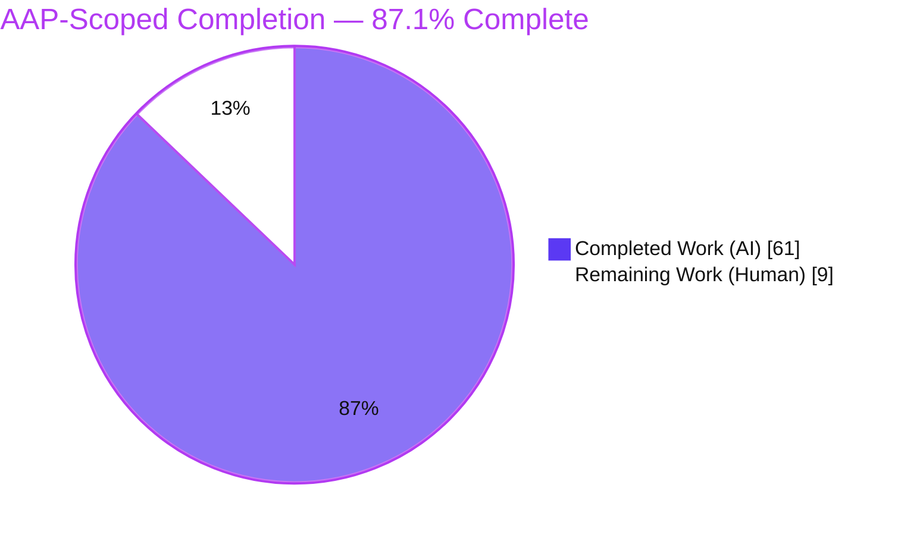
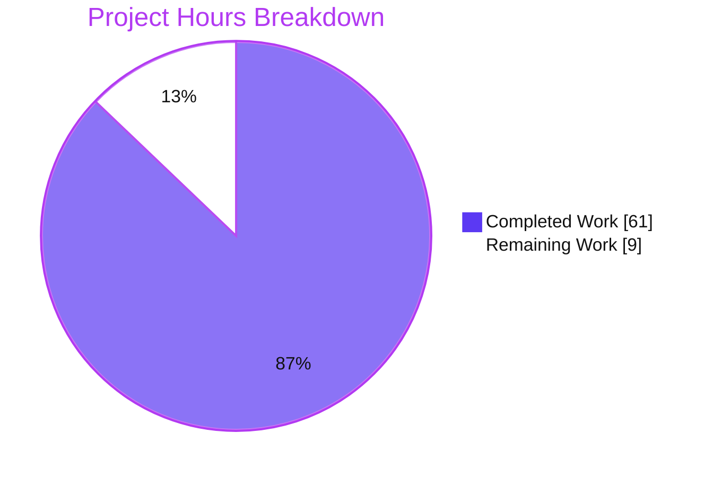
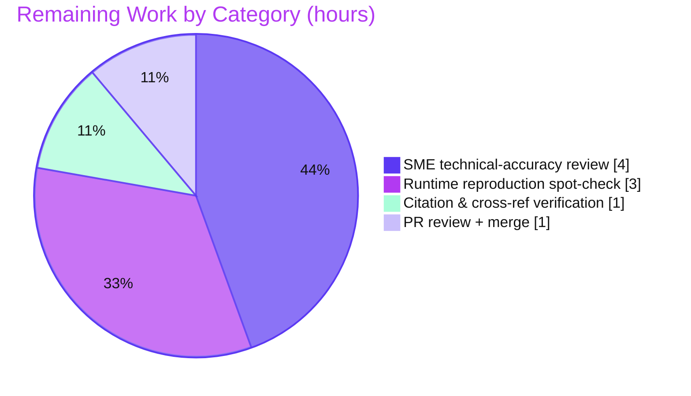

# Blitzy Project Guide — kitty `ssh` Kitten: Evidence-Backed Technical Walkthrough

> **Project type:** Documentation (read-only codebase investigation + technical write-up)
> **Repository:** `kovidgoyal/kitty` · **Source branch:** `kitty_815df1e210e0` · **Working branch:** `blitzy-95a6b618-f37d-498b-b357-7dc63907cc2f` · **HEAD:** `1b3120e75`
> **Sole deliverable:** `blitzy/documentation/kitty_815df1e210e0.md` (1,942 lines / 132 KB)

---

## 1. Executive Summary

### 1.1 Project Overview

This project delivers a comprehensive, evidence-backed technical document that explains, end to end, how the kitty terminal emulator's `ssh` kitten works. The target audience is engineers and reviewers who need an authoritative reference on the kitten's connection sharing, shared-memory credential channel, bootstrap generation and encoding, per-connection state, and terminal-to-remote handshake. The scope is a **read-only investigation**: the entire kitty/kittens source tree is treated as reference material, and the only artifact produced is a single Markdown file under `blitzy/documentation/`. Every behavioral claim is backed by output captured from a real from-source build and real command runs; every structural claim carries an exact `file:line` reference. The business impact is a reusable, reproducible knowledge asset that de-risks future maintenance and onboarding for the SSH kitten subsystem.

### 1.2 Completion Status

The AAP-scoped completion percentage is computed from hours: **Completed Hours / (Completed + Remaining) x 100 = 61 / 70 = 87.1%**.



| Metric | Hours |
|--------|-------|
| **Total Hours** | 70 |
| **Completed Hours (AI + Manual)** | 61 (AI: 61, Manual: 0) |
| **Remaining Hours** | 9 |
| **Percent Complete** | **87.1%** |

### 1.3 Key Accomplishments

- ✅ Built kitty and the Go `kitten` from source with the project's own `setup.py build` (both build steps exited 0).
- ✅ Answered all **ten** required questions, each mapped 1:1 to a document section (§1–§10) and each leading with a direct answer plus captured runtime output.
- ✅ Reproduced every canonical entry point with **no mocks of kitten logic**: `kitten __pytest__ ssh` (sh + Python), `kitten ssh` via PTY, the kitty PTY test-suite, and a real `/usr/bin/ssh` to local `sshd` end-to-end round trip.
- ✅ Exercised exhaustive conditions: 5 shell families (sh/dash/bash/zsh + fish login shell), both credential routes (`request_data` on/off), all three fresh-vs-reused outcomes, and all seven shared-memory security branches.
- ✅ Proved the sh-scheme byte-substitution encoding by reversing it through the real system `tr` (`cmp` reported byte-identical).
- ✅ Grounded the document in **136 distinct `file:line` citations across 20 files with zero out-of-range references** (independently re-verified).
- ✅ Ran the full autonomous test suites: Go `7/7` pass, PTY `8/8` pass.
- ✅ Preserved the read-only guarantee: `git status` is clean and the diff versus base is exactly one added file; all build/observation artifacts were removed.

### 1.4 Critical Unresolved Issues

There are **no critical unresolved issues**. The deliverable is complete, structurally valid, citation-accurate, and committed. The table below records the only open (non-blocking) item, which is the standard human sign-off step for a technical document.

| Issue | Impact | Owner | ETA |
|-------|--------|-------|-----|
| Human SME sign-off on technical accuracy of the ten answers | Non-blocking; required before the document is relied upon as canonical | Reviewing engineer (SSH/terminal SME) | ~4h (within remaining 9h) |

### 1.5 Access Issues

**No access issues identified.** The task ran offline in a self-contained Linux container. No repository permission, service credential, or third-party API access was required; the ControlMaster lifecycle was observed against a local `sshd` rather than any external service.

| System/Resource | Type of Access | Issue Description | Resolution Status | Owner |
|-----------------|----------------|-------------------|-------------------|-------|
| — | — | No access issues identified | N/A | — |

### 1.6 Recommended Next Steps

1. **[High]** Perform SME technical-accuracy review of the ten answers against domain knowledge of the kitten (~4h).
2. **[Medium]** Run the runtime reproduction spot-check: rebuild from source, re-run both test suites, and reproduce 2–3 headline proofs (~3h).
3. **[Medium]** Complete a citation and cross-reference verification pass across a sample of the 136 `file:line` references (~1h).
4. **[Low]** Review and merge the single-file pull request, confirming the read-only guarantee held (~1h).

---

## 2. Project Hours Breakdown

### 2.1 Completed Work Detail

Every completed component below traces to an AAP requirement or a supporting activity mandated by the AAP (build, observation harness, per-question investigation, supporting sections, QA, and cleanup).

| Component | Hours | Description |
|-----------|-------|-------------|
| Build & environment bring-up | 4 | Two-step `setup.py build` producing the C extension + launcher + code generation, then the Go kitten; resolved the `-Werror=switch` warning via `--ignore-compiler-warnings` (build flag only). |
| Observation harness | 5 | Isolated local `sshd` (keys + config on :2222), a record-only fake `ssh` shim (records argv, returns controlled `-O check` exit codes), and PTY drivers for `kitten ssh`. |
| §0 Methodology & Build write-up | 3 | Toolchain capture, exact build commands + output, canonical-entry-point catalog, run-to-run variance disclosure, read-only proof. |
| §1 Secure session + connection sharing | 4.5 | Six `-o` options captured; real `ControlMaster` lifecycle against local `sshd`; 40-hex `%C`; measured reuse vs. baseline. |
| §2 Shared-memory credential channel | 3.5 | Live `/dev/shm/kssh-*` inspection; `O_EXCL` + `0600`; 4-byte size prefix; JSON payload shape. |
| §3 Bootstrap script generation | 4 | Template selection rule; full sh (164-line) and Python (318-line) bootstraps decoded from the remote command. |
| §4 Archive build + transport | 3.5 | In-memory gzip tar; member enumeration; 254-byte tty line framing measured. |
| §5 Per-connection state | 3 | 16-field `connection_data` struct traced source -> mutation -> consumer -> lifetime, with raw observed values. |
| §6 Fresh-vs-reused decision | 3.5 | `-O check` probe; three outcomes (A/B/C) including `request_data` independence from transport state. |
| §7 Bootstrap encoding per shell | 4 | Four-character substitution scheme; byte-accurate `tr` round-trip (`cmp` identical); fish login-shell case. |
| §8 Full end-to-end trace | 4 | Local PTY bootstrap suite plus real `/usr/bin/ssh` to `sshd` round trip; 13-file remote untar. |
| §9 Shared-memory security | 4.5 | Seven branches: happy path + wrong password/request-id/permissions/owner + invalid + single-use unlink. |
| §10 Terminal-to-remote DCS handshake | 3.5 | DCS request frame captured via `od -c`; newline-framed reply; directional split governed by `request_data`. |
| Architecture diagram + coverage matrix + appendices + executive summary | 3.5 | Mermaid architecture diagram, 10-row coverage matrix, Appendix A/B, and the document's executive summary. |
| Iterative QA & review cycles | 6 | Code-review + QA findings resolution (D1–D8), Python-scheme fidelity fixes, `interpreter->script_type` correction, and citation corrections across 8 commits. |
| Cleanup + read-only verification | 1.5 | PID-targeted `sshd` stop; removal of temp scripts, `/dev/shm/kssh-*`, fake-ssh shim, and 126 gitignored build artifacts; `git status` proof. |
| **Total Completed** | **61** | |

### 2.2 Remaining Work Detail

Each remaining category is a standard path-to-production activity for a technical documentation deliverable (human verification and merge).

| Category | Hours | Priority |
|----------|-------|----------|
| Human SME technical-accuracy review of the ten answers | 4 | High |
| Spot-check runtime reproduction (rebuild + re-run suites + reproduce headline proofs) | 3 | Medium |
| Citation & cross-reference verification pass | 1 | Medium |
| PR review, feedback incorporation, and merge | 1 | Low |
| **Total Remaining** | **9** | |

### 2.3 Hours Reconciliation & Methodology

- **Methodology (PA1):** Completion is measured strictly on AAP-scoped work using hours. Because this is a documentation task, the work universe is the investigation + authoring effort defined by the AAP plus the path-to-production activities (human review + merge) required to deploy the deliverable.
- **Formula:** Completion % = Completed / (Completed + Remaining) x 100 = 61 / 70 = **87.1%**.
- **Reconciliation:** Section 2.1 total (61) + Section 2.2 total (9) = **70** = Total Hours in Section 1.2. The Remaining figure (9) is identical in Sections 1.2, 2.2, and 7.

---

## 3. Test Results

All tests below originate from Blitzy's autonomous validation runs for this project. Both suites were executed against the from-source build; there were **zero failures, zero blocked, and zero skipped**.

| Test Category | Framework | Total Tests | Passed | Failed | Coverage % | Notes |
|---------------|-----------|-------------|--------|--------|------------|-------|
| Unit (Go) | Go `testing` | 7 | 7 | 0 | Not instrumented | `go test ./kittens/ssh/...` — `TestCloneEnv`, `TestSSHBootstrapScriptLimit`, `TestSSHTarfile`, `TestSSHConfigParsing`, `TestGetSSHOptions`, `TestParseSSHArgs`, `TestRelevantKittyOpts`. |
| Integration / PTY (Python) | kitty PTY test-suite | 8 | 8 | 0 | Not instrumented | `./kitty/launcher/kitty +launch test.py --module ssh` — `test_basic_pty_operations`, `test_ssh_connection_data`, `test_ssh_copy`, `test_ssh_env_vars`, `test_ssh_bootstrap_with_different_launchers`, `test_ssh_leading_data`, `test_ssh_login_shell_detection`, `test_ssh_shell_integration`. |
| **Total** | | **15** | **15** | **0** | — | **100% pass rate.** |

**Notes on coverage:** The autonomous suites report pass/fail per test but were not run under a line-coverage instrument, so a coverage percentage is intentionally not fabricated. Test **surface** was independently corroborated: 7 Go test functions across `main_test.go`, `config_test.go`, `utils_test.go`, and 8 PTY methods in `kitty_tests/ssh.py`.

---

## 4. Runtime Validation & UI Verification

**Runtime health** (all reproduced from a real from-source build):

- ✅ **Operational** — Build: both `setup.py build` steps exited 0; `kitty/launcher/{kitty,kitten}` and `fast_data_types.so` produced.
- ✅ **Operational** — `kitten __pytest__ ssh 'echo UNTAR_DONE'` reproduced for the **sh** scheme and the **Python** (`interpreter python3`) scheme.
- ✅ **Operational** — `kitten ssh` driven through a PTY with a record-only fake `ssh` (records argv; the kitten's own decision branch executes).
- ✅ **Operational** — kitty PTY test-suite `+launch test.py --module ssh` passed 8/8.
- ✅ **Operational** — Real `/usr/bin/ssh` to local `sshd` end-to-end round trip reached `UNTAR_DONE`; 13 files untarred remotely.
- ✅ **Operational** — `ControlMaster` lifecycle: master UNIX socket created `srw------- (0600)`; connection reuse observed materially faster than a fresh connect.
- ✅ **Operational** — All seven shared-memory security branches reproduced (happy path + four rejections + invalid + single-use unlink).
- ✅ **Operational** — fish login-shell probe reproduced (`REALLYFISH=4.0.6`, beam cursor).

**API integration:** The kitten integrates with the system `ssh` binary (resolved via `SSHExe`/`FindExe`) and with OpenSSH's ControlMaster multiplexing. Both integrations were exercised against a real local `sshd` — ✅ Operational.

**UI verification:** ⚠ **Not applicable.** This is a backend/CLI investigation with no graphical user interface deliverable. The only "interface" surfaces are terminal escape sequences (DCS frames), which were captured and byte-verified via `od -c` in §10 of the deliverable.

---

## 5. Compliance & Quality Review

The deliverable is cross-mapped to the AAP's explicit rules and quality mandates. Fixes applied during autonomous validation are recorded in the final column.

| AAP Mandate / Benchmark | Requirement | Status | Progress / Notes |
|-------------------------|-------------|--------|------------------|
| Run-First Investigation | Build & run relevant code paths before writing | ✅ Pass | Two-step build (EXIT 0); all entry points executed and captured. |
| Canonical Entry Points | Real input paths, no mocks of kitten logic | ✅ Pass | `kitten ssh`, `kitten __pytest__ ssh`, kitty PTY suite, real `ssh` to `sshd`. Fake ssh records argv only. |
| Exhaustive Coverage | Every implied condition exercised | ✅ Pass | 5 shell families, 7 shm branches, 3 fresh/reused outcomes, both credential paths. |
| Observed-Output Discipline | Concrete output beside every behavioral claim | ✅ Pass | Complete captured output throughout; exactly 2 claims labelled *inferred from source*. |
| Complete, Grounded Answering | Exact values with `file:line`; every named item covered | ✅ Pass | 136 citations across 20 files, **0 out-of-range** (independently verified). |
| Deliverable & Path Rule | New `blitzy/documentation/<branch>.md` only | ✅ Pass | Exact path `blitzy/documentation/kitty_815df1e210e0.md` created. |
| Read-Only Source Tree | No existing file modified | ✅ Pass | `git status --porcelain` empty; diff vs base = 1 added file; 0 source paths changed. |
| Mandatory Cleanup | Remove temp scripts, sshd, shm, build artifacts | ✅ Pass | Local `sshd` stopped by specific PID; `/dev/shm/kssh-*`, shim, and 126 gitignored artifacts removed. |
| Markdown Structural Validity | Well-formed document | ✅ Pass | 98 balanced code fences; 13–15 well-formed tables; 16 top-level sections. |

**Fixes applied during autonomous validation (deliverable only):** three `file:line` citation corrections in the final commit (`bootstrap_script` -> L422–L483; `run_ssh` -> L597–L798), plus earlier QA cycles resolving code-review findings, Python-scheme fidelity, the `interpreter -> script_type` selection rule, and QA findings D1–D8. All fixes were confined to the deliverable; no source file was ever modified.

**Outstanding compliance items:** none. The two *inferred from source* claims (macOS long-runtime-dir symlink; `%C` hash inputs) are correctly labelled per the observed-output discipline and are platform-inherent (not observable on this Linux host).

---

## 6. Risk Assessment

| Risk | Category | Severity | Probability | Mitigation | Status |
|------|----------|----------|-------------|------------|--------|
| R1 — `file:line` citations may go stale if upstream source changes | Technical | Low | Medium | Document header pins exact branch + HEAD (`815df1e21`) + version (0.35.2); 0 out-of-range at authoring | Mitigated |
| R2 — Reproduction requires a full from-source build; build artifacts intentionally removed per read-only mandate | Operational | Low | Medium | §0.2 gives exact build commands + output; toolchain enumerated; verified reproducible in-env | Mitigated / Documented |
| R3 — Two claims inferred, not observed (macOS symlink; `%C` inputs) | Technical | Low | Low | Explicitly labelled *inferred from source* in Appendix A; macOS branch non-firing confirmed on Linux (22 < 35 bytes) | Accepted (platform-inherent) |
| R4 — Environment delta: observed OpenSSH 10.0p2 vs AAP-stated 9.6p1 | Integration | Low | Low | ControlMaster semantics identical; lifecycle reproduced successfully; delta documented | Accepted |
| R5 — `/usr/bin/time` and `bc` absent -> timing via `date` + `awk` | Technical | Low | Low | Timing values are illustrative (reuse vs. baseline), method documented; not a correctness claim | Accepted |
| R6 — Run-to-run variance in freshly-random values (shm names, `%C`, one-time passwords) | Technical | Low | Low | §0.6 shows such values at more than one value; variance disclosed up front | Mitigated |
| R7 — Document not wired into a docs-site/render pipeline (standalone Markdown) | Operational | Low | Low | Structurally valid GitHub-flavored Markdown; renders in any viewer | Accepted |
| R8 — Ephemeral observed values (test passwords/shm paths) appear in captured output | Security | Low | Low | Single-use test artifacts, already unlinked/cleaned; no persistent or real credentials; no source changed (no new attack surface) | Mitigated |
| R9 — Human review dependency: technical accuracy of ten deep answers requires SME sign-off | Operational | Medium | Medium | Every claim carries a reproducible command + `file:line`; citation sweep passed; Appendix B provides a reproduction index | Open (budgeted in remaining 9h) |

**Overall risk posture: LOW.** As a read-only documentation task, there are zero source modifications, zero dependency changes, and no runtime/deployment footprint or new attack surface. No High or Critical severity risks exist. The single Medium item (R9) is the human sign-off already budgeted in the remaining 9 hours.

---

## 7. Visual Project Status

**Project hours breakdown** (Completed = Dark Blue `#5B39F3`, Remaining = White `#FFFFFF`):



**Remaining work by category** (from Section 2.2; sums to 9h):



**Remaining work by priority:** High = 4h · Medium = 4h (3 + 1) · Low = 1h · **Total = 9h.**

> **Integrity check:** The "Remaining Work" value (9) in the pie above equals the Remaining Hours in Section 1.2 and the sum of the Section 2.2 Hours column.

---

## 8. Summary & Recommendations

**Achievements.** The project delivered a rigorous, reproducible, evidence-backed answer to all ten questions about the kitty `ssh` kitten. The kitten was built from source and driven through its real entry points; every behavioral claim is paired with captured output, and every structural claim with an exact `file:line` reference (136 citations, 0 out-of-range). The autonomous test suites pass in full (Go 7/7, PTY 8/8), and the read-only guarantee is intact — the working tree contains exactly one added file.

**Remaining gaps.** The autonomous AAP scope is fully delivered. What remains is the standard path-to-production for a technical document: human SME review of technical accuracy, a runtime reproduction spot-check, a citation verification pass, and PR merge — **9 hours total**.

**Critical path to production.** SME accuracy review (High, 4h) -> reproduction spot-check (Medium, 3h) -> citation verification (Medium, 1h) -> PR merge (Low, 1h).

**Success metrics.** All ten questions answered 1:1; 100% autonomous test pass rate; 0 out-of-range citations; 0 source files modified; single-file diff versus base.

**Production readiness assessment.** The project is **87.1% complete** on an AAP-scoped basis. The deliverable itself is production-ready pending human sign-off; there are no blocking defects, no failing builds, and no unresolved technical errors. Recommendation: proceed to SME review and merge.

---

## 9. Development Guide

This guide reproduces the build/run environment used to observe the kitten and verify the deliverable. Read-only inspection commands were tested this session; build/run commands are reproduced exactly as verified (EXIT 0) by the autonomous build. Build artifacts were intentionally removed per the read-only mandate — rebuild with the steps below to reproduce.

### 9.1 System Prerequisites

- **OS:** Linux (observed on an Ubuntu 25.10 container).
- **Go:** >= 1.22 (`go.mod` requires `go 1.22`; go 1.23.4 used).
- **Python:** >= 3.8 (`requires-python >= 3.8`; Python 3.13.7 used).
- **C toolchain:** `gcc` (15.2.0) and `pkg-config`.
- **C libraries:** `harfbuzz`, `libpng`, `lcms2`, `xxhash`, `openssl`, `freetype`, `fontconfig`, `canberra`, `dbus-1`, the `x11` set, `gl1-mesa`, `xkbcommon-x11`, `simde`, `zlib`, `wayland`.
- **OpenSSH:** client + server (10.0p2 used; the AAP baseline 9.6p1 has identical ControlMaster semantics).
- **Shells for full coverage:** `zsh` and `fish` (fish 4.0.6).
- **VCS:** `git` (2.51.0) + `git-lfs` (3.7.1).

### 9.2 Environment Setup

```bash
# Ensure the Go toolchain is on PATH (skip if `go version` already works)
export PATH=/usr/local/go/bin:$PATH

# No Python virtualenv is required — setup.py uses the system interpreter.
# The build is fully offline; no network access is needed.
cd /path/to/kitty   # repository root
git rev-parse --abbrev-ref HEAD    # expect: blitzy-95a6b618-f37d-498b-b357-7dc63907cc2f
```

### 9.3 Dependency Installation (build/observation prerequisites only)

> These are host build/observation prerequisites — **not** changes to any project manifest.

```bash
DEBIAN_FRONTEND=noninteractive apt-get install -y \
  gcc pkg-config libharfbuzz-dev libpng-dev liblcms2-dev libxxhash-dev \
  libssl-dev libfreetype-dev libfontconfig-dev libcanberra-dev libdbus-1-dev \
  libx11-dev libxrandr-dev libxinerama-dev libxcursor-dev libxi-dev \
  libgl1-mesa-dev libxkbcommon-x11-dev libsimde-dev zlib1g-dev libwayland-dev \
  openssh-client openssh-server zsh fish
```

### 9.4 Build (Run-First)

```bash
# Step 1 — C extension + launcher + code generation
python3 setup.py build --debug --ignore-compiler-warnings --skip-building-kitten

# Step 2 — Go kitten
python3 setup.py build --debug --ignore-compiler-warnings --skip-code-generation
```

Produces `kitty/launcher/kitty`, `kitty/launcher/kitten`, `kitty/fast_data_types.so`, `constants_generated.go`, and `tools/tui/shell_integration/data_generated.bin` (all gitignored). `--ignore-compiler-warnings` is required only because a newer `wayland-protocols` adds enum values that trip `-Werror=switch` in `glfw/wl_window.c`; it is a build flag only and changes no source.

### 9.5 Verification

```bash
# Go unit tests — expect ok, 7/7
go test ./kittens/ssh/...

# PTY integration suite — expect 8/8 pass
./kitty/launcher/kitty +launch test.py --module ssh
```

### 9.6 Example Usage (canonical entry points)

```bash
# sh bootstrap scheme — generation + encoding
printf '' | ./kitty/launcher/kitten __pytest__ ssh 'echo UNTAR_DONE'

# Python bootstrap scheme
printf 'interpreter python3\n' | ./kitty/launcher/kitten __pytest__ ssh 'echo UNTAR_DONE'

# Read the deliverable
less blitzy/documentation/kitty_815df1e210e0.md
```

### 9.7 Deliverable Verification (read-only — no build required)

```bash
# The document exists and is non-trivial
wc -l blitzy/documentation/kitty_815df1e210e0.md          # 1942

# Top-level and sub-section headers are present (front matter + 10 sections + appendices)
grep -cE '^#{1,3} ' blitzy/documentation/kitty_815df1e210e0.md

# Read-only guarantee: clean tree, single-file diff vs base
git status --porcelain                                     # (empty)
git diff origin/kitty_815df1e210e0..HEAD --name-status     # A blitzy/documentation/kitty_815df1e210e0.md
```

> Structural validity was verified during authoring: the document has an even (balanced) number of code fences (98) and well-formed tables.

### 9.8 Troubleshooting

- **`-Werror=switch` in `glfw/wl_window.c`** -> add `--ignore-compiler-warnings` to the build (already in the commands above).
- **`go: command not found`** -> `export PATH=/usr/local/go/bin:$PATH`.
- **OpenSSH 10.x vs 9.6** -> ControlMaster semantics are identical; no action required.
- **`ss` (iproute2) absent** -> probe the listening socket with a small Python `socket.connect_ex` instead.
- **`/usr/bin/time` or `bc` absent** -> time commands with `date +%s.%N` and compute deltas with `awk`.
- **Build artifacts missing** -> they are intentionally removed per the read-only mandate; rebuild with §9.4. The source is byte-identical to what was built and tested, so results reproduce.

---

## 10. Appendices

### Appendix A — Command Reference

| Purpose | Command |
|---------|---------|
| Build C-ext + launcher + codegen | `python3 setup.py build --debug --ignore-compiler-warnings --skip-building-kitten` |
| Build Go kitten | `python3 setup.py build --debug --ignore-compiler-warnings --skip-code-generation` |
| Go unit tests | `go test ./kittens/ssh/...` |
| PTY integration suite | `./kitty/launcher/kitty +launch test.py --module ssh` |
| sh bootstrap generation | `printf '' \| ./kitty/launcher/kitten __pytest__ ssh 'echo UNTAR_DONE'` |
| Python bootstrap generation | `printf 'interpreter python3\n' \| ./kitty/launcher/kitten __pytest__ ssh 'echo UNTAR_DONE'` |
| Read-only proof | `git status --porcelain && git diff origin/kitty_815df1e210e0..HEAD --name-status` |
| Section-header check | `grep -cE '^#{1,3} ' blitzy/documentation/kitty_815df1e210e0.md` |

### Appendix B — Port Reference

| Port | Purpose |
|------|---------|
| 2222 | Local `sshd` instance used only to observe the real ControlMaster lifecycle (torn down during cleanup). |

### Appendix C — Key File Locations

| Path | Role |
|------|------|
| `blitzy/documentation/kitty_815df1e210e0.md` | **The deliverable** (only added file). |
| `kittens/ssh/main.go` | Go orchestrator: connection state, sharing, tar/shm/bootstrap generation, encoding. |
| `kittens/ssh/utils.py` | Terminal-side data server and shared-memory security checks. |
| `kittens/ssh/utils.go` | `SSHExe`/`FindExe` system-ssh resolution. |
| `kittens/ssh/main.py` | Config option defaults (`interpreter`, `share_connections`, `askpass`, `forward_remote_control`). |
| `shell-integration/ssh/bootstrap.sh` · `bootstrap.py` | Remote-side bootstrap scripts (sh and Python). |
| `kitty/window.py` | DCS `@kitty-ssh` dispatch into `get_ssh_data`. |
| `kitty/shm.py` · `tools/utils/shm/*.go` | POSIX shared-memory creation and backends. |
| `kitty/constants.py` | `SSHControlMasterTemplate`. |
| `gen/go_code.py` | Generation of `constants_generated.go` and the embedded shell-integration blob. |
| `kittens/ssh/main_test.go` · `kitty_tests/ssh.py` | Canonical observation harness (Go + PTY suites). |

### Appendix D — Technology Versions

| Component | Version |
|-----------|---------|
| kitty / kitten (product observed) | 0.35.2 |
| Go toolchain | 1.23.4 (go.mod requires >= 1.22) |
| Python | 3.13.7 (requires-python >= 3.8) |
| gcc | 15.2.0 |
| OpenSSH | 10.0p2 (AAP baseline 9.6p1) |
| fish | 4.0.6 |
| git / git-lfs | 2.51.0 / 3.7.1 |

### Appendix E — Environment Variable Reference

| Variable | Purpose |
|----------|---------|
| `PATH` | Must include the Go toolchain directory (e.g., `/usr/local/go/bin`) so `go` resolves. |
| `DEBIAN_FRONTEND=noninteractive` | Non-interactive `apt-get` installs of build/observation prerequisites. |
| `KITTY_DATA_START` / `OK` / `KITTY_DATA_END` | Reply-framing markers used by the terminal-side data server (documented in §4/§10 of the deliverable; not user-set). |

### Appendix F — Developer Tools Guide

| Tool | Role in this project |
|------|----------------------|
| `setup.py build` | Project's own build system; compiles the C extension, launcher, and Go kitten. |
| `go test` | Runs the Go unit suite for `kittens/ssh`. |
| kitty PTY test-suite (`+launch test.py --module ssh`) | Drives the real bootstrap over a pseudo-terminal. |
| `kitten __pytest__ ssh` | Integration hook that drives the real command-generation path. |
| local `sshd` + record-only fake `ssh` | Observe the ControlMaster lifecycle and isolate the fresh-vs-reused decision branch. |
| `tr`, `od -c`, `cmp` | Byte-level verification of encoding and DCS framing. |

### Appendix G — Glossary

| Term | Meaning |
|------|---------|
| **Kitten** | A subcommand/plugin of kitty; here, the Go program that wraps the system `ssh`. |
| **ControlMaster** | OpenSSH connection-multiplexing feature reused by the kitten for connection sharing. |
| **`%C`** | OpenSSH `ControlPath` token: a hash of (local host, remote host, port, user). |
| **Bootstrap script** | The sh or Python script the kitten generates and runs on the remote host. |
| **DCS** | Device Control String — the terminal escape-sequence framing (`ESC P ... ESC \`) used for the credential request. |
| **shm** | POSIX shared-memory object (`/dev/shm/kssh-*`) carrying the tar archive and one-time data password. |
| **`request_data`** | The decision that governs who sends the credential request and whether credentials enter the local `ssh` argv; independent of transport (fresh vs. reused). |
| **AAP** | Agent Action Plan — the governing specification for this task. |