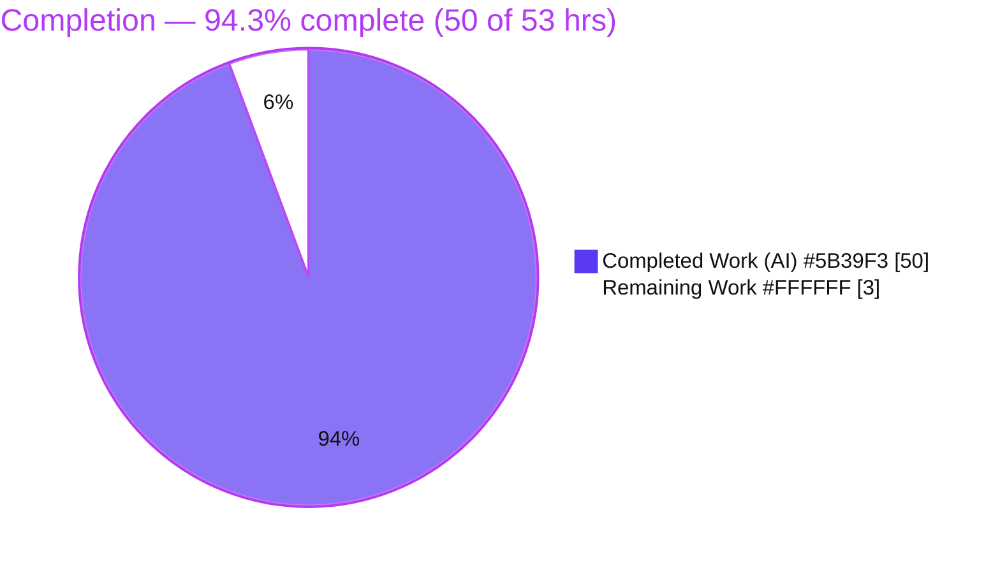
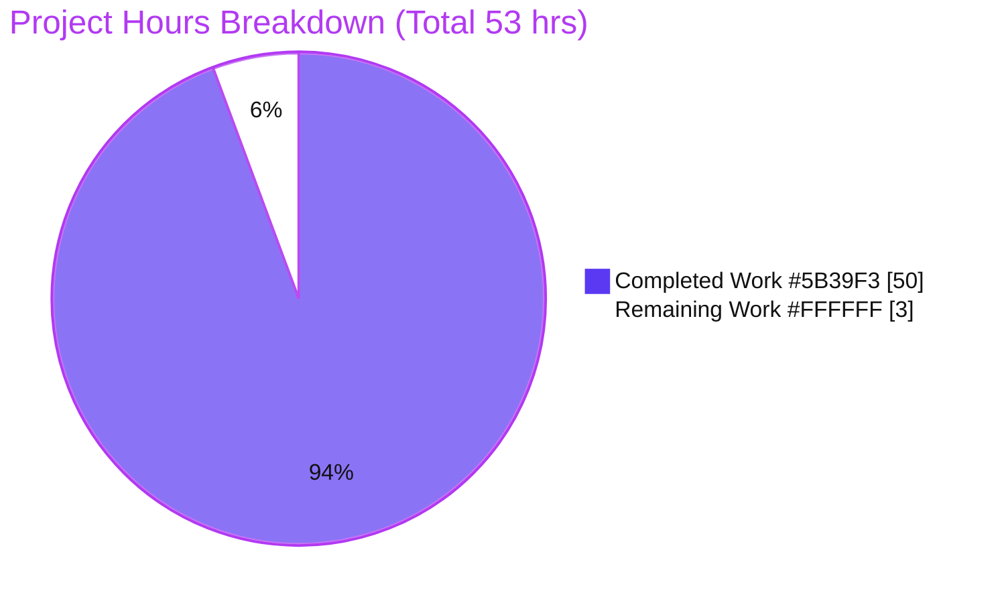
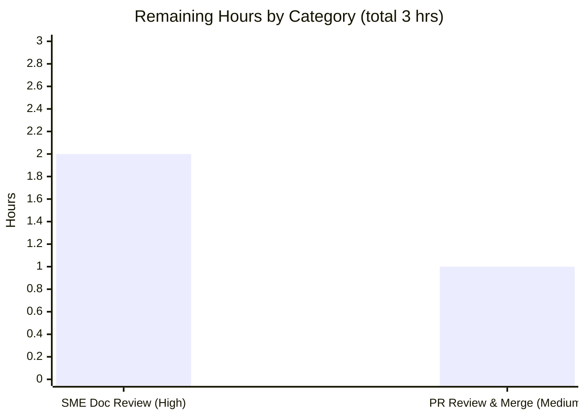

# Blitzy Project Guide

> **Project:** Runtime-observed Q&A — kitty terminal emulator ZWJ multi-codepoint emoji screen-buffer handling & control-sequence state reporting
> **Repository:** kitty (terminal emulator) — subject version **0.35.2** (`kitty/constants.py:L25`)
> **Branch:** `blitzy-58316137-f8ee-4a85-9107-fba2a709facb` &nbsp;•&nbsp; **HEAD:** `efbf4518bd5d7eb87398e6e92b891bb2f7ac6268` &nbsp;•&nbsp; **Base:** `815df1e210e0a9ab4622f5c7f2d6891d7dbeddf1`
> **Task type:** Read-only investigative documentation (SWE-AtlasQnA)
>
> **Legend / Blitzy brand colors:** <span style="color:#5B39F3">■</span> Completed / AI Work = **Dark Blue `#5B39F3`** &nbsp;•&nbsp; <span style="color:#B23AF2">■</span> Remaining / Not Completed = **White `#FFFFFF`** &nbsp;•&nbsp; Headings/Accents = Violet-Black `#B23AF2` &nbsp;•&nbsp; Highlight = Mint `#A8FDD9`

---

## 1. Executive Summary

### 1.1 Project Overview

This project delivers a single, evidence-backed Markdown document that answers, from **observed runtime behavior**, how kitty v0.35.2 stores a stream of ZWJ-joined multi-codepoint emoji in its screen buffer under extreme space constraints (a 1×1 cell) and how a control-sequence state query reflects that handling. The audience is engineers and reviewers investigating terminal Unicode/grapheme behavior. Every claim was produced by driving kitty's real VT byte-parser (`kitty_tests.parse_bytes`) against the compiled `kitty/fast_data_types.so` C extension — not by reading code alone. The task is strictly read-only: the source tree is untouched and exactly one new documentation file is produced, satisfying the mandated Run-First, grounded-citation, and cleanup constraints.

### 1.2 Completion Status



| Metric | Value |
|---|---|
| **Total Hours** | **53** |
| Completed Hours — AI / Autonomous | 50 |
| Completed Hours — Manual | 0 |
| **Completed Hours — Total** | **50** |
| **Remaining Hours** | **3** |
| **Percent Complete** | **94.3%** |

> Completion is computed with the AAP-scoped, hours-based (PA1) formula: `Completed ÷ (Completed + Remaining) × 100 = 50 ÷ 53 × 100 = 94.3%`. Only work scoped in the Agent Action Plan plus its path-to-production activities is counted; out-of-scope items (fixing the discovered crash, the GLFW/Wayland backend, Go/kittens paths) are deliberately excluded.

### 1.3 Key Accomplishments

- ✅ **Run-First core established** — compiled `kitty/fast_data_types.so` (deterministic **1,253,792 bytes**), exposing the genuine `Screen` object and the real VT parser; the C core compiles cleanly.
- ✅ **All four questions answered explicitly** — each with a "Direct answer", complete captured output, and cause→effect explanation.
- ✅ **Q1 (1×1 retention):** only the last base emoji `👦` / `U+1F466` survives; cursor `x=2`.
- ✅ **Q2 (settled contents):** 1×1 = one double-width `👦`; 20-column = four **separate** width-2 cells (never merged), cursor `x=8`.
- ✅ **Q3 (state query):** `CSI 6 n` → `ESC[1;2R` (1×1) / `ESC[1;9R` (20×1) via `report_device_status`.
- ✅ **Q4 (interaction):** normalization = **none**; grapheme breaking = **width-based, not UAX #29**; state reporting = **passive mirror**.
- ✅ **Exhaustive edge coverage** — combining-mark 3-slot overflow, VS16/VS15 variation selectors, regional-indicator flag pairs, autowrap on/off, and static proofs (no NFC/NFD, no UAX #29 code).
- ✅ **Boundary defect reproduced & documented** — deterministic SIGSEGV (3/3) with full `gdb` backtrace, root-caused to `kitty/screen.c:L826` unsigned underflow; a 2-column control survives.
- ✅ **Grounding & stability** — 53 `file:locator` citations verified accurate; observed values byte-identical across four runs (MD5 `3295e96955793ff089e5c8c07bfc3b17`).
- ✅ **Read-only + cleanup compliance perfect** — 0 source files modified; temporary scripts kept outside the tree and removed; build artifacts gitignored; working tree clean.

### 1.4 Critical Unresolved Issues

| Issue | Impact | Owner | ETA |
|---|---|---|---|
| No release-blocking issues within AAP scope | None — all 13 AAP requirements delivered, independently validated, and committed | Blitzy (complete) | N/A |
| *(Non-blocking, out-of-scope)* Documented SIGSEGV in `kitty/screen.c:L826` (1-col screen, autowrap off, width-2 char → unsigned underflow) | None on the deliverable; it is an **upstream kitty** defect. Fixing is explicitly out of scope (would require editing read-only source) | Upstream kitty maintainers / future task | Not scheduled (out of scope) |

### 1.5 Access Issues

**No access issues identified.** The task ran entirely within the provided container against the local checkout; it required no repository permissions beyond the working tree, no service credentials, and no third-party API access.

| System/Resource | Type of Access | Issue Description | Resolution Status | Owner |
|---|---|---|---|---|
| None | N/A | No access issues encountered | N/A | N/A |

### 1.6 Recommended Next Steps

1. **[High]** SME/technical review of the answer document — confirm each of Q1–Q4 is answered to satisfaction and that all six named concepts are covered (HT-1 … HT-3).
2. **[Medium]** Review the single-file additive PR diff and confirm read-only compliance — `git diff 815df1e210e0..HEAD` must show only `A blitzy/documentation/kitty_815df1e210e0.md` (HT-4).
3. **[Medium]** Merge the PR / integrate the deliverable into the target branch (HT-5).
4. **[Low]** *(Optional, out of scope)* File an upstream kitty bug report for the documented SIGSEGV at `kitty/screen.c:L826` (OPT-1). Not counted in project hours.

---

## 2. Project Hours Breakdown

### 2.1 Completed Work Detail

Every completed component traces to a specific AAP requirement. All hours are AI/autonomous (manual completed = 0).

| Component | Hours | Description |
|---|---|---|
| Run-First environment build | 4 | Compile `kitty/fast_data_types.so` via a fast-data-types-only build path (`build_fdt.py`); install ~25 apt build deps; work around the out-of-scope GLFW/Wayland build failure. Result: deterministic 1,253,792-byte `.so`. |
| Observation harness (`obs.py`) | 4 | Deterministic, byte-comparable harness driving the **real** entry point `kitty_tests.parse_bytes`; cell/cursor readback and `CSI 6 n` reply capture from `Callbacks.wtcbuf`. |
| Q1 — 1×1 retention investigation | 4 | Codepoint-by-codepoint family-emoji feed into a 1×1 screen; discovered and documented the scroll-then-redraw refinement (§2.2). |
| Q2 — settled-cell observations | 2 | 1×1 single `👦` vs 20-column four-separate-cells contrast (proves no clustering). |
| Q3 — CPR state-query investigation | 3 | `CSI 6 n` capture and tracing of `report_device_status` clamp logic (`ESC[1;2R` vs `ESC[1;9R`). |
| Q4 — subsystem-interaction synthesis | 3 | Normalization=none behavioral test; width-based grapheme-breaking analysis; passive state-reporting synthesis. |
| Edge cases §6.1–6.4 | 4 | Combining-mark 3-slot overflow, VS16/VS15 promotion/demotion, regional-indicator flag pair, runtime width table. |
| Boundary-defect crash reproduction §6.6 | 4 | Deterministic SIGSEGV (3/3), full `gdb` backtrace, surviving 2-column control, root-cause identification. |
| Static proofs §6.5 | 1 | Greps proving no `grapheme`/`uax29` code (exit 1) and that all `nfd`/`nfc` matches are the `infd` substring. |
| Citation grounding + coverage pass | 4 | 53 `file:locator` citations verified against source; §7 coverage-pass table. |
| Run-First stability + crash determinism | 1.5 | 4-run byte-identical output (MD5 `3295e969…`); crash confirmed 3/3. |
| Read-only compliance + cleanup | 1 | 0 source files modified; temp scripts outside tree removed; `.so`/`build/` gitignored; clean tree. |
| Answer-document authoring | 6 | 819-line Markdown (TL;DR + §1–§7) with careful inferred-vs-observed labeling. |
| QA refinement passes | 4.5 | Resolved 12 code-review findings + 3 captured-output/build-fidelity fixes across 4 follow-up commits. |
| Independent end-to-end validation | 4 | Final Validator 5-gate rebuild/reproduction/citation verification. |
| **Total** | **50** | **= Completed Hours in §1.2** |

### 2.2 Remaining Work Detail

Each remaining category is a path-to-production human-gate activity (the autonomous work is complete and validated).

| Category | Hours | Priority |
|---|---|---|
| Documentation technical/SME review & acceptance sign-off | 2 | High |
| PR review, read-only-compliance confirmation & merge | 1 | Medium |
| **Total** | **3** | **= Remaining Hours in §1.2 = §7 "Remaining Work"** |

> Out-of-scope follow-ups (e.g., fixing the SIGSEGV, filing an upstream bug) are **not** included in these hours, per PA1 (completion counts only AAP-scoped + path-to-production work).

### 2.3 Hours Reconciliation & Completion Methodology

| Check | Result |
|---|---|
| Completed Hours (§2.1 total) | 50 |
| Remaining Hours (§2.2 total) | 3 |
| §2.1 + §2.2 | 53 = Total Hours (§1.2) ✓ |
| Completion formula | 50 ÷ (50 + 3) × 100 = **94.3%** ✓ |
| §7 pie chart | Completed 50 / Remaining 3 ✓ (matches §1.2 & §2.2) |
| Human task list (Section for HT items) | 3.0h counted ✓ (reconciles with §2.2) |
| Below 99% cap (RG2) | Yes — human acceptance gate remains ✓ |

---

## 3. Test Results

All tests below originate from Blitzy's autonomous validation logs for this project (Final Validator Gate 4 and Gate 3), and were re-confirmed against the freshly built extension. Coverage instrumentation is not applicable to a read-only investigative task, so a formal coverage % is not reported (marked N/A).

| Test Category | Framework | Total | Passed | Failed | Coverage % | Notes |
|---|---|---|---|---|---|---|
| Unit — Screen buffer (`kitty_tests.screen`) | Python `unittest` | 36 | 36 | 0 | N/A | Broad health check; includes cited `test_zwj` (Q1/Q2 corroboration) |
| Unit — Data types (`kitty_tests.datatypes`) | Python `unittest` | 18 | 18 | 0 | N/A | Broad health check; includes cited `test_line` (3-slot overflow corroboration) |
| Unit — Fonts (`kitty_tests.fonts`) | Python `unittest` | 1 | 1 | 0 | N/A | Cited `test_emoji_presentation` (VS16/VS15 corroboration) |
| Runtime observation — Run-First (`obs.py` → `kitty_tests.parse_bytes`) | kitty real VT parser | 4 runs | 4 | 0 | N/A | Byte-identical across 4 runs; MD5 `3295e96955793ff089e5c8c07bfc3b17` |
| Boundary-defect reproduction (`crash_standalone.py` + `gdb`) | kitty real VT parser | 3 runs | 3 | 0 | N/A | Deterministic SIGSEGV (exit 139); 2-column control survives (exit 0) |
| **Total (unit)** | — | **55** | **55** | **0** | **N/A** | 100% pass rate across cited + module health checks |

> **Integrity note (Rule 3):** every row above is drawn from Blitzy's autonomous test-execution logs. The three cited corroboration tests (`test_zwj`, `test_line`, `test_emoji_presentation`) are the specific tests the deliverable references; the 36/18 module figures are the broader health checks the validator ran. Independent re-execution of the three cited tests reproduced a clean 3/3 pass.

---

## 4. Runtime Validation & UI Verification

Runtime behavior was validated by driving kitty's real VT byte-parser end-to-end. **UI verification is not applicable**: this is a headless investigation of the terminal's screen-buffer C core; the GUI/GPU renderer and the GLFW/Wayland windowing backend are explicitly out of scope and were not exercised. There is no HTTP/network API surface.

**Runtime health & behavioral integration outcomes:**

- ✅ **Operational** — `kitty/fast_data_types.so` builds and imports; the C core compiles cleanly.
- ✅ **Operational** — Real entry point `kitty_tests.parse_bytes` feeds raw UTF-8 bytes through the genuine parser chain (`test_parse_written_data` → `run_worker` → `consume_normal` → `screen_draw_text` → `draw_text_loop`).
- ✅ **Operational** — Q1 reproduced: 1×1 family emoji → `line0='👦'`, cursor `x=2` (stable across runs).
- ✅ **Operational** — Q2 reproduced: 20-column → four separate width-2 cells `👨‍👩‍👧‍👦`, cursor `x=8` (`str(line)==input`).
- ✅ **Operational** — Q3 reproduced: `CSI 6 n` → `ESC[1;2R` (1×1) and `ESC[1;9R` (20-column).
- ✅ **Operational** — Q4 reproduced: decomposed `[U+0065 U+0301]` ≠ precomposed `[U+00E9]` (no normalization); width-based attachment of ZWJ/VS/second regional indicator; CPR mirrors geometry.
- ✅ **Operational** — Edge cases reproduced: combining 3-slot overflow (slot 3 overwritten), VS16 promote / VS15 demote, regional-indicator flag-pair merge.
- ⚠ **Partial (documented, not fixed)** — Boundary defect: 1-column screen + autowrap off + width-2 emoji → deterministic SIGSEGV (3/3). Correctly documented as an out-of-scope upstream defect; a 2-column control survives, confirming the trigger is `columns < char_width` in the no-wrap path.
- ❌ **Not exercised (out of scope)** — GUI/GPU rendering, font shaping (HarfBuzz), GLFW/Wayland windowing.

> **Independent corroboration:** during this assessment the core Q1/Q2/Q3 scenario was re-run via the real parser and matched the documented values byte-for-byte across two runs.

---

## 5. Compliance & Quality Review

AAP deliverables and governing rules mapped to quality/compliance benchmarks. Fixes applied during autonomous validation are noted; no in-scope items remain outstanding.

| Benchmark / AAP Requirement | Status | Progress | Notes |
|---|---|---|---|
| Run-First methodology (build & observe the real path first) | ✅ Pass | 100% | `fast_data_types.so` built; values from live runs, not code-reading |
| Canonical entry point only (no mock/debug hook) | ✅ Pass | 100% | `kitty_tests.parse_bytes`, explicitly not `Screen.draw()` |
| Q1–Q4 each answered explicitly | ✅ Pass | 100% | Each has a "Direct answer" (doc L431/L485/L510/L533) |
| All six named concepts covered by name | ✅ Pass | 100% | ZWJ, multi-codepoint emoji, screen-buffer cell, grapheme breaking, normalization, control-sequence state reporting |
| Exhaustive condition coverage | ✅ Pass | 100% | Combining overflow, VS16/VS15, flag pair, autowrap on/off, before/intermediate/after states |
| `file:locator` grounding for every claim | ✅ Pass | 100% | 53 citations verified accurate (independent 4/4 spot-check confirmed) |
| Complete, unedited captured output + command per block | ✅ Pass | 100% | Every output block records the command that produced it |
| ≥2-run stability confirmation | ✅ Pass | 100% | 4-run byte-identical (MD5 `3295e969…`); crash 3/3 |
| Read-only source repository | ✅ Pass | 100% | 0 source files modified; `git diff` shows only the deliverable |
| Single deliverable at exact path | ✅ Pass | 100% | `blitzy/documentation/kitty_815df1e210e0.md` (matches `<source_branch>.md`) |
| Cleanup of temporary scripts / no repo pollution | ✅ Pass | 100% | Temp scripts kept outside tree & removed; `.so`/`build/` gitignored; clean tree |
| Inferred-vs-observed labeling discipline | ✅ Pass | 100% | Only the crash underflow *explanation* is labeled inferred; all values observed |
| Markdown integrity | ✅ Pass | 100% | 819 lines, 62 balanced code fences, 0 unfilled template markers |

**Fixes applied during autonomous validation:** the QA/refinement passes resolved **12 code-review findings** plus **3 captured-output / build-methodology fidelity fixes** across commits `a5952ae34`, `24bfcd9f5`, `6b77be1d0`, and `efbf4518b`. The independent Final Validator required **zero** additional fixes.

**Outstanding (in scope):** none. **Out of scope (documented, not addressed):** SIGSEGV fix at `kitty/screen.c:L826`; GLFW/Wayland build.

---

## 6. Risk Assessment

| Risk | Category | Severity | Probability | Mitigation | Status |
|---|---|---|---|---|---|
| Documented boundary-condition SIGSEGV in kitty (`screen.c:L826` unsigned underflow when `columns < char_width` in the autowrap-off path) | Technical | Medium (High as an upstream defect; Low risk to this deliverable) | Present upstream | Reproduced 3/3 with full `gdb` backtrace + root cause + surviving 2-column control; fix deliberately out of scope; recommend filing upstream bug | Documented, Not Fixed (by design) |
| Reproduction build fragility — full `setup.py build` fails on out-of-scope GLFW/Wayland (`wl_window.c`) | Technical | Low | Low | Doc §1c specifies the `fast_data_types`-only build and labels the GLFW failure out of scope; C core compiles clean | Mitigated |
| Toolchain / Unicode-data drift could alter observed widths on a divergent environment | Technical | Low | Low | Pinned to kitty 0.35.2 @ commit `815df1e210e0`; gcc 15.2.0 / Python 3.13.7 recorded; 4-run byte-identical MD5 | Mitigated |
| Temporary observation scripts intentionally absent from the repo (cleanup) — reviewer must reconstruct to reproduce | Operational | Low | Medium | Complete `obs.py` / `build_fdt.py` / `crash_standalone.py` listings embedded verbatim in the doc | Mitigated |
| Memory-safety implication of the underflow (potential crash/DoS vector in kitty) | Security | Low (informational; upstream, not introduced here) | Low | Noted as an upstream concern; this read-only doc adds zero attack surface, zero deps, zero secrets | Documented |
| PR merge / branch integration | Integration | Very Low | Low | Single additive file (+819 / -0), clean tree, zero source touched → negligible conflict risk | Open (pending human merge) |
| SME acceptance — doc must satisfy reviewer expectations for Q1–Q4 | Operational / Process | Low | Low | 53 verified citations, complete captured output, 4-run stability, independent 5-gate validation, explicit "Direct answer" per question | Open (pending review) |

> **Security posture:** read-only Markdown deliverable — no authentication, network, data handling, or secrets; **zero dependency changes**; no new attack surface introduced. **Integration posture:** no external services/APIs/credentials; the only integration point is the additive PR merge.

---

## 7. Visual Project Status

**Project hours — completed vs remaining** (Blitzy colors: Completed `#5B39F3`, Remaining `#FFFFFF`):



**Remaining hours by category** (from §2.2 — sums to 3, matching §1.2 Remaining):



> **Integrity check:** the pie chart's "Remaining Work" (3) equals §1.2 Remaining Hours (3) and the §2.2 "Hours" total (3). "Completed Work" (50) equals §1.2 Completed Hours (50). 50 + 3 = 53 = Total.

---

## 8. Summary & Recommendations

**Achievements.** The project delivers a thorough, runtime-grounded answer to all four questions about kitty's handling of ZWJ-joined multi-codepoint emoji under extreme space constraints. The single through-line — **kitty's screen buffer is width-driven, not grapheme-cluster-driven** — is demonstrated with live output: under a 1×1 constraint only the last base emoji `👦` (`U+1F466`) survives (cursor `x=2`), a wide screen keeps four separate width-2 cells, and a `CSI 6 n` state query faithfully mirrors that geometry (`ESC[1;2R` vs `ESC[1;9R`). The document also proves kitty performs no Unicode normalization and no UAX #29 segmentation, and it reproduces and root-causes a deterministic boundary-condition crash.

**Remaining gaps & critical path to production.** The autonomous work is complete and independently validated with zero defects; the critical path to production is purely a **human acceptance gate**: (1) SME/technical review and sign-off of the document, then (2) PR review with read-only-compliance confirmation and merge. This is **3 hours** of work.

**Success metrics.** All 13 AAP requirements COMPLETED; all 6 named concepts covered; 53/53 citations accurate; 55/55 autonomous unit tests passing; observations byte-stable across 4 runs; read-only compliance perfect (0 source files modified, clean tree).

**Production readiness assessment.** The deliverable is **production-ready** and the project is **94.3% complete** (50 of 53 hours). It is held below the 99% cap only because the human review/merge gate has not yet occurred. The one notable finding — a real upstream SIGSEGV in kitty — is correctly **documented, not fixed** (out of scope); filing an upstream bug is recommended as an optional, uncounted follow-up.

| Metric | Value |
|---|---|
| AAP requirements completed | 13 / 13 |
| Named concepts covered | 6 / 6 |
| `file:locator` citations verified | 53 / 53 |
| Autonomous unit tests passing | 55 / 55 |
| Source files modified | 0 |
| Completion | **94.3%** (50 / 53 hrs) |

---

## 9. Development Guide

This guide reproduces the exact environment and commands used to generate every observed value. All commands were tested in the assessment environment. Temporary scripts live **outside** the repository tree to preserve read-only compliance.

### 9.1 System Prerequisites

- **OS:** Linux (Ubuntu 25.10 container used here; any modern Linux works)
- **Compiler:** `gcc` (tested: `gcc (Ubuntu 15.2.0-4ubuntu4) 15.2.0`)
- **Python:** 3.13 (tested: `Python 3.13.7`)
- **kitty:** version 0.35.2, from commit `815df1e210e0a9ab4622f5c7f2d6891d7dbeddf1`

### 9.2 Environment Setup

```bash
# From the repository root:
export KITTY_REPO="$PWD"
export CI=true                       # non-interactive tooling
export DEBIAN_FRONTEND=noninteractive
```

### 9.3 Dependency Installation (environment-only; never committed)

```bash
sudo apt-get update
sudo apt-get install -y \
  build-essential pkg-config libfreetype-dev libharfbuzz-dev libfontconfig1-dev libpng-dev \
  liblcms2-dev libxxhash-dev libxkbcommon-dev libdbus-1-dev libssl-dev zlib1g-dev \
  libgl1-mesa-dev libglvnd-dev
```

### 9.4 Build — `kitty/fast_data_types.so`

The C extension is what exposes the real `Screen` and VT parser. The full canonical build compiles the C core cleanly but fails **only** in the out-of-scope GLFW/Wayland windowing backend, which is not needed for headless screen-buffer testing:

```bash
# Canonical (C core compiles clean; expected exit=1 only on out-of-scope GLFW):
CI=true python3 setup.py build ; echo "exit=$?"

# Verify the extension is present and importable:
ls -l kitty/fast_data_types.so          # ~1,253,792 bytes in the tested build
python3 -c "import kitty.fast_data_types; print('fast_data_types import: OK')"
```

> **Troubleshooting:** if the full build's GLFW failure is a problem, build only the extension (the deliverable's §1c documents a `build_fdt.py` helper that compiles just `kitty.fast_data_types`, skipping GLFW and the Go kittens). The `.so` and `build/` outputs are `.gitignore`-covered and never pollute tracked state.

### 9.5 Run & Verify — reproduce the core observation

Create a small harness **outside** the repo (so the tree stays read-only), then run it. The real entry point is `kitty_tests.parse_bytes` — **not** the module attribute and **not** `Screen.draw()`.

```bash
mkdir -p /tmp/kitty_verify
cat > /tmp/kitty_verify/reproduce.py <<'PYEOF'
import os, sys
sys.path.insert(0, os.environ["KITTY_REPO"])
from kitty.fast_data_types import Screen
from kitty_tests import parse_bytes, Callbacks

FAMILY = "\U0001F468\u200d\U0001F469\u200d\U0001F467\u200d\U0001F466"  # family emoji

def make_screen(cols, lines=1, scrollback=100):
    c = Callbacks()
    # Screen(callbacks, lines, cols, scrollback, cell_width, cell_height, 0, callbacks)
    return Screen(c, lines, cols, scrollback, 10, 20, 0, c), c

def run(cols):
    s, c = make_screen(cols)
    parse_bytes(s, FAMILY.encode("utf-8"))
    line0, x = str(s.line(0)), s.cursor.x
    c.wtcbuf = b""
    parse_bytes(s, b"\x1b[6n")          # CSI 6 n -> Cursor Position Report
    return line0, x, bytes(c.wtcbuf)

for cols in (1, 20):
    line0, x, reply = run(cols)
    print(f"cols={cols:>2}: line0={line0!r}  cursor.x={x}  CPR={reply!r}")
PYEOF

KITTY_REPO="$PWD" python3 /tmp/kitty_verify/reproduce.py
```

**Expected output (stable across runs):**

```
cols= 1: line0='👦'  cursor.x=2  CPR=b'\x1b[1;2R'
cols=20: line0='👨\u200d👩\u200d👧\u200d👦'  cursor.x=8  CPR=b'\x1b[1;9R'
```

### 9.6 Corroboration Tests

```bash
# The three tests the document cites as corroboration:
python3 -c "
import unittest
from kitty_tests.screen import TestScreen
from kitty_tests.datatypes import TestDataTypes
from kitty_tests.fonts import Rendering
s = unittest.TestSuite()
s.addTest(TestScreen('test_zwj'))
s.addTest(TestDataTypes('test_line'))
s.addTest(Rendering('test_emoji_presentation'))
unittest.TextTestRunner(verbosity=2).run(s)
"
# Expected: test_zwj ok, test_line ok, test_emoji_presentation ok — 3 tests, OK
```

### 9.7 Read-Only Compliance & Doc Integrity Checks

```bash
git diff --name-status 815df1e210e0..HEAD     # expect only: A blitzy/documentation/kitty_815df1e210e0.md
git status --porcelain                        # expect empty (clean tree)
grep -c '```' blitzy/documentation/kitty_815df1e210e0.md   # expect 62 (even = balanced)
wc -l blitzy/documentation/kitty_815df1e210e0.md           # expect 819
```

### 9.8 Cleanup

```bash
rm -rf /tmp/kitty_verify            # remove temporary harness (keeps repo unchanged)
```

### 9.9 Common Issues & Resolutions

- **`ModuleNotFoundError: kitty.fast_data_types`** → the extension is not built; run §9.4. Ensure you run from a Python that can import the checkout (set `KITTY_REPO` / `sys.path`).
- **`AttributeError` on `parse_bytes`** → import it from `kitty_tests`, not from `kitty.fast_data_types`.
- **Full build fails on `glfw/wl_window.c`** → expected and out of scope; the C core still compiles and the `.so` links for headless testing.
- **Different observed widths** → verify you are on kitty 0.35.2 @ commit `815df1e210e0`; width tables are version-specific.

---

## 10. Appendices

### A. Command Reference

| Purpose | Command |
|---|---|
| Set repo path | `export KITTY_REPO="$PWD"` |
| Build extension | `CI=true python3 setup.py build ; echo "exit=$?"` |
| Verify import | `python3 -c "import kitty.fast_data_types; print('OK')"` |
| Reproduce Q1/Q2/Q3 | `KITTY_REPO="$PWD" python3 /tmp/kitty_verify/reproduce.py` |
| Run cited tests | see §9.6 |
| Read-only diff check | `git diff --name-status 815df1e210e0..HEAD` |
| Clean-tree check | `git status --porcelain` |
| Code-fence balance | `grep -c '\`\`\`' blitzy/documentation/kitty_815df1e210e0.md` |
| Static proof (no UAX29) | `grep -rnE 'grapheme\|uax29\|grapheme_break' kitty/*.c kitty/*.h ; echo "exit=$?"` |

### B. Port Reference

**Not applicable — no network ports are used.** This is a headless screen-buffer investigation driven in-process through the compiled C extension; there is no server, client, or listening socket.

### C. Key File Locations

| Item | Path |
|---|---|
| **Deliverable (only created file)** | `blitzy/documentation/kitty_815df1e210e0.md` |
| Draw / segmentation / CPR | `kitty/screen.c` (`draw_text_loop`, `draw_combining_char`, `report_device_status`, crash line L826) |
| Combining attachment / readback | `kitty/line.c` (`line_add_combining_char` L457–L467) |
| Cell storage model | `kitty/data-types.h` (`CPUCell.cc_idx[3]` L223–L227; `index_type` L65) |
| Width & classification | `kitty/wcswidth.c`, `kitty/unicode-data.c` |
| Real input path (VT parser) | `kitty/vt-parser.c` |
| Version constant | `kitty/constants.py:L25` |
| Design rationale | `docs/changelog.rst` (ZWJ-as-combining L3272–L3275; 3 combining chars L962) |
| Test harness / corroboration | `kitty_tests/__init__.py`, `kitty_tests/screen.py`, `kitty_tests/datatypes.py`, `kitty_tests/fonts.py` |
| Build artifact (gitignored) | `kitty/fast_data_types.so` |

### D. Technology Versions

| Component | Version |
|---|---|
| kitty | 0.35.2 (`kitty/constants.py:L25`), commit `815df1e210e0a9ab4622f5c7f2d6891d7dbeddf1` |
| gcc | Ubuntu 15.2.0-4ubuntu4 (15.2.0) |
| Python | 3.13.7 |
| Test framework | Python `unittest` (stdlib) |
| VT parser entry | `kitty_tests.parse_bytes` (real byte-stream parser) |

### E. Environment Variable Reference

| Variable | Value / Purpose |
|---|---|
| `KITTY_REPO` | Absolute path to the checkout; consumed by the observation harness to locate imports |
| `CI` | `true` — forces non-interactive build/test tooling |
| `DEBIAN_FRONTEND` | `noninteractive` — prevents apt prompts during dependency install |

### F. Developer Tools Guide

| Tool | Use in this project |
|---|---|
| `python3` + `unittest` | Run cited corroboration tests and the observation harness |
| `gdb` | Capture the SIGSEGV backtrace for the boundary defect (`draw_text_loop` → `draw_text` → `run_worker` → `test_parse_written_data`) |
| `git` | `diff`/`log`/`status` for read-only-compliance and authorship verification (`agent@blitzy.com`) |
| `md5sum` | Confirm byte-identical observation output across 4 runs (`3295e969…`) |
| `grep` | Static proofs that no NFC/NFD or UAX #29 code exists in the C core |

### G. Glossary

| Term | Meaning |
|---|---|
| **ZWJ** | Zero-Width Joiner (`U+200D`); width 0; kitty stores it as a combining mark on the preceding base rather than collapsing sequences |
| **Multi-codepoint emoji** | An emoji formed from several codepoints joined by ZWJ (e.g., the family `👨‍👩‍👧‍👦`) |
| **Screen-buffer cell (`CPUCell`)** | One primary codepoint `ch` plus up to three combining marks `cc_idx[3]`; display width is a 2-bit field |
| **Grapheme breaking (kitty)** | Width-based segmentation (classification + `wcwidth_std`), **not** UAX #29 cluster segmentation |
| **UAX #29** | Unicode Standard Annex #29 grapheme-cluster segmentation — **not implemented** in kitty's C core |
| **Normalization (NFC/NFD)** | Unicode canonical composition/decomposition — **not performed** by kitty; codepoints stored as received |
| **CPR / DSR** | Cursor Position Report / Device Status Report; `CSI 6 n` → `ESC[<row>;<col>R` (1-based) via `report_device_status` |
| **VS16 / VS15** | Variation selectors `U+FE0F` (emoji, promotes to width 2) / `U+FE0E` (text, demotes to width 1) |
| **Regional indicator** | Codepoints `U+1F1E6`–`U+1F1FF`; a pair merges into one double-width flag cell |
| **Autowrap / DECAWM** | Auto-wrap mode (`CSI ?7h`/`CSI ?7l`); with it off and `columns < char_width`, the underflow at `screen.c:L826` triggers the documented crash |
| **`wcwidth_std`** | kitty's width function driving width-based segmentation (`kitty/wcwidth-std.h`, called from `kitty/wcswidth.c`) |
