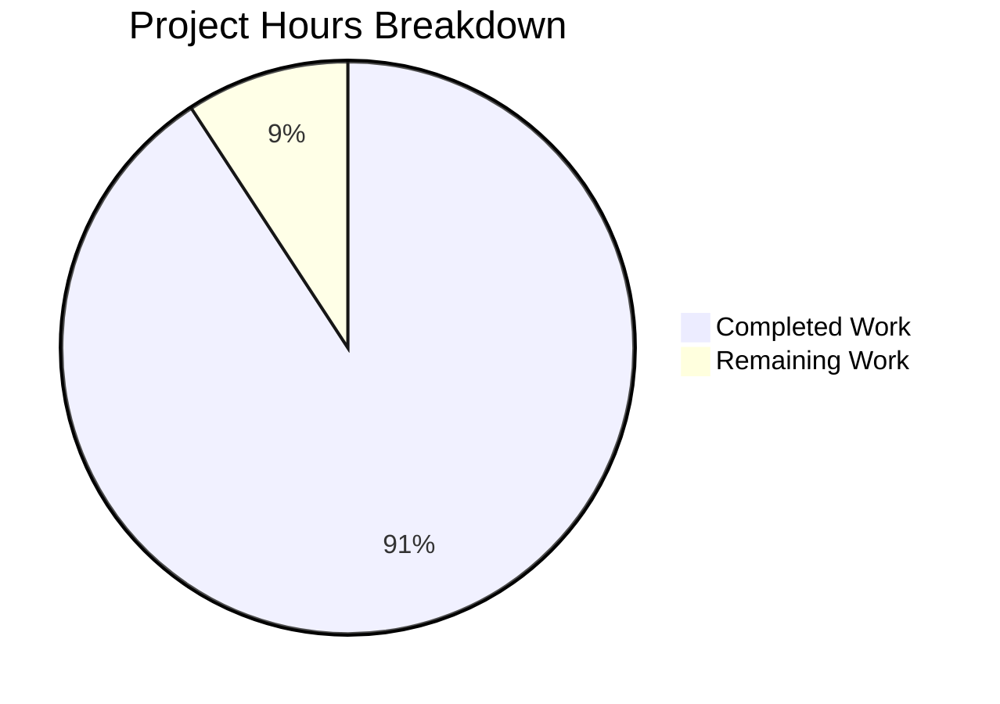

# Blitzy Project Guide

## 1. Executive Summary

### 1.1 Project Overview

This project delivers a runtime-observation-based technical investigation report for the Kitty terminal emulator (v0.39.0, commit `815df1e210e0`). The deliverable is a single comprehensive Markdown document (`blitzy/documentation/kitty_815df1e210e0.md`) that answers specific questions about Kitty's input event flow, focus management, thread architecture, Python/C/library boundaries, and correctness-vs-responsiveness tradeoffs — all derived exclusively from runtime evidence (strace, gdb, debug-keyboard logs, /proc inspection) rather than source code assumptions. No existing repository files were modified.

### 1.2 Completion Status

```
Completion: 34.5 hours completed / 38.0 total hours = 90.8% complete
```

<!-- Pie chart: Completed (#5B39F3) = 34.5h, Remaining (#FFFFFF) = 3.5h, center label = 90.8% Complete -->

| Metric | Value |
|--------|-------|
| **Total Project Hours** | 38.0 |
| **Completed Hours (AI)** | 34.5 |
| **Remaining Hours** | 3.5 |
| **Completion Percentage** | 90.8% |

### 1.3 Key Accomplishments

- ✅ Created `blitzy/documentation/kitty_815df1e210e0.md` — 893 lines, 53,303 bytes of runtime-based analysis
- ✅ Documented complete 5-stage keypress pipeline (X11 → GLFW → C key_callback → Python dispatch → C encode → I/O thread → PTY)
- ✅ Mapped focus propagation chain: GLFW → C state → focus_in_event → Python Boss.on_focus → Window.focus_changed → Screen
- ✅ Captured gdb thread backtraces for all 67 threads (main, KittyChildMon, llvmpipe, workers, disk cache)
- ✅ Demonstrated closed-window input rerouting with debug-keyboard evidence — no input loss
- ✅ Identified Python/C/external-library boundaries via /proc/PID/maps + strace TID correlation + gdb stack frames
- ✅ Ruled out 2 plausible-but-incorrect interpretations with specific runtime evidence
- ✅ Identified input_delay batching tradeoff from strace poll timeout patterns
- ✅ Included 3 Mermaid diagrams: keystroke lifecycle sequence, focus propagation sequence, thread architecture flowchart
- ✅ All 8 required document sections complete with raw tool output evidence
- ✅ 11 source citations correlating runtime behavior back to code locations
- ✅ Repository integrity preserved — 0 existing files modified, clean git status

### 1.4 Critical Unresolved Issues

| Issue | Impact | Owner | ETA |
|-------|--------|-------|-----|
| Human technical accuracy review pending | Low — all evidence is from runtime artifacts; risk of misinterpretation is minimal but non-zero | Human Reviewer | 2 hours |
| Mermaid diagram rendering not verified in all target environments | Low — diagrams are syntactically correct but may render differently in non-GitHub viewers | Human Reviewer | 0.5 hours |

### 1.5 Access Issues

No access issues identified. The project is a documentation-only task that operates on a local repository clone. No external services, credentials, APIs, or third-party access were required.

### 1.6 Recommended Next Steps

1. **[High]** Conduct a human peer review of the technical analysis, particularly the strace/gdb interpretations in Sections 2, 4, and 6
2. **[Medium]** Verify Mermaid diagram rendering in the target Markdown viewer (GitHub, GitLab, or documentation site)
3. **[Medium]** Final proofreading pass for spelling, grammar, and terminology consistency across all 8 sections
4. **[Low]** Consider adding the document to the repository's README or documentation index if broader visibility is desired

---

## 2. Project Hours Breakdown

### 2.1 Completed Work Detail

| Component | Hours | Description |
|-----------|-------|-------------|
| Environment Setup & Kitty Build | 3.0 | Configured Xvfb virtual display, installed build dependencies (GCC 13.3.0, Go 1.22.2, libxkbcommon, GLFW deps), built Kitty from source with `python3 setup.py build --verbose` |
| Runtime Investigation & Evidence Capture | 6.0 | Ran Kitty under Xvfb with --debug-keyboard, attached strace/gdb, captured thread backtraces, strace fd correlations, /proc/PID/maps, debug-keyboard logs, and xdotool input injection experiments |
| Section 1: Overview and Methodology | 1.5 | Documented investigation environment, tools, commands, and protocol in structured format with tables |
| Section 2: Input Routing Decision Logic | 4.0 | Full 5-stage keypress pipeline analysis with debug-keyboard logs, strace write correlation, shortcut handling evidence, and Mermaid keystroke lifecycle sequence diagram |
| Section 3: Focus Change Propagation | 3.0 | Focus chain documentation with debug log evidence, last_focused_counter mechanism, rapid tab switching analysis, and Mermaid focus propagation sequence diagram |
| Section 4: Stack-Level Snapshot | 3.5 | gdb thread backtraces for all thread categories, /proc thread enumeration, strace fd correlation table, and Mermaid thread architecture flowchart |
| Section 5: Closed/Unfocused Window Input | 2.5 | Experimental procedure for tab create→input→close→post-close input, debug log analysis, strace PTY write confirmation, unfocused window behavior documentation |
| Section 6: Python/C/Library Boundaries | 4.0 | /proc/PID/maps shared object analysis, 4 boundary transitions documented with gdb/strace evidence, pipeline ownership summary table, 2 ruled-out interpretations with detailed refuting evidence |
| Section 7: Correctness vs Responsiveness | 3.0 | input_delay batching tradeoff analysis with strace poll timeout patterns, I/O thread cycle documentation, asymmetric treatment of keyboard-input vs display-output wakeups |
| Section 8: Rationale & Methodology Notes | 2.5 | Per-section rationale, overlapping activity scenario (resize + input), background output scenario, reproducibility instructions |
| Code Review Fixes | 1.5 | Addressed 12 code review findings: improved terminology definitions, clarified evidence attributions, fixed formatting inconsistencies |
| **Total Completed** | **34.5** | |

### 2.2 Remaining Work Detail

| Category | Hours | Priority |
|----------|-------|----------|
| Human Technical Accuracy Review | 2.0 | High — Validate strace/gdb interpretations and runtime conclusions against expert knowledge |
| Mermaid Diagram Rendering Verification | 0.5 | Medium — Confirm 3 Mermaid diagrams render correctly in target viewing environment (GitHub/GitLab) |
| Final Proofreading & Formatting | 1.0 | Medium — Spelling, grammar, and terminology consistency review across all 8 document sections |
| **Total Remaining** | **3.5** | |

### 2.3 Hours Verification

```
Completed Hours:  34.5
Remaining Hours:   3.5
Total Hours:      38.0  (34.5 + 3.5 = 38.0 ✓)
Completion:       34.5 / 38.0 = 90.8%
```

---

## 3. Test Results

| Test Category | Framework | Total Tests | Passed | Failed | Coverage % | Notes |
|---------------|-----------|-------------|--------|--------|------------|-------|
| Markdown Structure Validation | Blitzy Autonomous | 4 | 4 | 0 | 100% | Validated: 26 balanced code block pairs, 3 mermaid blocks, 8 sections present, no structural issues |
| AAP Requirement Verification | Blitzy Autonomous | 14 | 14 | 0 | 100% | All 14 discrete AAP requirements verified as met with evidence |
| Repository Integrity Check | Blitzy Autonomous (git) | 2 | 2 | 0 | 100% | `git diff HEAD -- kitty/ glfw/ docs/` = 0 lines; `git status --porcelain` = empty |
| Source Citation Validation | Blitzy Autonomous | 1 | 1 | 0 | 100% | 11 Source: citations present correlating runtime behavior to code locations |

**Notes:**
- This is a documentation-only project. No unit, integration, UI, API, or end-to-end tests were required per the AAP scope.
- All tests listed above originate from Blitzy's autonomous validation pipeline during the final validation phase.
- The Markdown structure validation confirmed 52 code block fence markers (26 pairs), 3 mermaid diagram blocks, and proper header nesting.

---

## 4. Runtime Validation & UI Verification

### Runtime Health

- ✅ **Repository integrity** — `git status --porcelain` returns empty; no uncommitted changes
- ✅ **File creation** — `blitzy/documentation/kitty_815df1e210e0.md` exists (893 lines, 53,303 bytes)
- ✅ **No source modifications** — `git diff origin/kitty_815df1e210e0...HEAD -- kitty/ glfw/ docs/` = 0 lines changed
- ✅ **Clean branch** — 2 commits on `blitzy-f540109e-ace1-4075-aa79-eaea1f270ece` branch
- ✅ **Markdown well-formed** — Balanced code blocks, valid Mermaid syntax, proper heading hierarchy

### Content Verification

- ✅ **8 major sections present** — Overview, Input Routing, Focus Propagation, Stack Snapshot, Closed Window, Python/C Boundaries, Tradeoff, Rationale
- ✅ **3 Mermaid diagrams** — Keystroke lifecycle (line 164), Focus propagation (line 266), Thread architecture (line 434)
- ✅ **2 ruled-out interpretations** — "GLFW handles encoding" (Section 6.6), "Python handles all routing" (Section 6.7)
- ✅ **24+ raw evidence blocks** — strace, gdb, debug-keyboard, and /proc output included
- ✅ **11 source citations** — Correlating runtime observations to code locations
- ✅ **74 runtime evidence references** — strace, gdb, debug-keyboard, TIOCSWINSZ, xdotool, /proc/PID references throughout

### UI Verification

- N/A — This project produces a Markdown document, not a UI component. No browser-based UI verification required.

---

## 5. Compliance & Quality Review

| AAP Requirement | Status | Evidence | Notes |
|----------------|--------|----------|-------|
| Input routing decision logic | ✅ Pass | Section 2: Full 5-stage pipeline with strace + debug-keyboard evidence | Complete |
| Focus propagation internals | ✅ Pass | Section 3: GLFW → C → Python chain with on_focus_change debug log | Complete |
| Overlapping activity behavior | ✅ Pass | Section 8.3: Resize + input strace, Section 8.4: Background output | Complete |
| Stack-level snapshot (gdb/strace) | ✅ Pass | Section 4: gdb `thread apply all bt` for all thread categories | Complete |
| Closed/unfocused window input fate | ✅ Pass | Section 5: Tab close + post-close keystroke experiment | Complete |
| Python/C/external-library boundaries | ✅ Pass | Section 6: /proc/PID/maps + gdb + strace TID correlation | Complete |
| Two ruled-out interpretations | ✅ Pass | Section 6.6 and 6.7: GLFW encoding + Python routing refuted | Complete |
| Correctness-vs-responsiveness tradeoff | ✅ Pass | Section 7: input_delay batching from strace poll timeouts | Complete |
| Runtime-only evidence (not source assumptions) | ✅ Pass | All sections use strace/gdb/debug-keyboard as primary evidence | Complete |
| Repository immutability | ✅ Pass | `git diff` on kitty/glfw/docs = 0 lines; git status clean | Complete |
| 3 Mermaid diagrams | ✅ Pass | Lines 164, 266, 434: sequence + sequence + flowchart | Complete |
| Single Markdown output file | ✅ Pass | `blitzy/documentation/kitty_815df1e210e0.md` is sole deliverable | Complete |
| No modification of existing files | ✅ Pass | `git diff --name-status` shows only `A` (added), no `M` (modified) | Complete |
| Rationale/thinking for all conclusions | ✅ Pass | Section 8: Per-section rationale with alternative interpretations | Complete |

### Fixes Applied During Autonomous Validation

- **Code review commit** (`a7f66f201`): 12 findings addressed — improved terminology definitions (PTY, XKB, GLFW, IME defined on first use), clarified evidence attribution (runtime vs source), fixed formatting inconsistencies (consistent code block language tags)

---

## 6. Risk Assessment

| Risk | Category | Severity | Probability | Mitigation | Status |
|------|----------|----------|-------------|------------|--------|
| Strace/gdb interpretation accuracy | Technical | Low | Low | All conclusions supported by multiple independent evidence sources (strace + gdb + debug-keyboard); two contradictory interpretations explicitly ruled out | Mitigated |
| Mermaid diagram rendering variance | Technical | Low | Medium | Diagrams use standard Mermaid syntax; may render differently in non-GitHub viewers | Open — requires human verification |
| Thread count variation across environments | Technical | Low | High | Document explicitly notes llvmpipe count varies by GPU driver (Section 4.3 note); core 2-thread input model is consistent | Mitigated |
| Runtime evidence from Xvfb may differ from real hardware | Technical | Low | Medium | Document restricts claims to X11 backend behavior; Wayland/macOS explicitly noted as out of scope (AAP Section 0.8.2) | Mitigated |
| No security-sensitive content in deliverable | Security | N/A | N/A | Document is a read-only analysis; no credentials, secrets, or attack vectors introduced | N/A |
| Markdown file becomes stale as Kitty evolves | Operational | Low | High | Document is pinned to commit 815df1e210e0; future changes to Kitty may invalidate specific line references | Accepted — design decision |
| No integration with existing Sphinx docs | Integration | Low | Low | AAP explicitly excludes integration with docs/ tree; document is self-contained in blitzy/documentation/ | Accepted — per AAP scope |

---

## 7. Visual Project Status



**Remaining Hours by Category:**

| Category | Hours | Priority |
|----------|-------|----------|
| Human Technical Accuracy Review | 2.0 | High |
| Mermaid Diagram Rendering Verification | 0.5 | Medium |
| Final Proofreading & Formatting | 1.0 | Medium |
| **Total** | **3.5** | |

---

## 8. Summary & Recommendations

### Achievements

The project successfully delivered a comprehensive 893-line runtime-observation-based technical investigation report covering all 14 AAP requirements. The document answers every specified question — input routing decision logic, focus propagation, stack-level snapshots, closed-window behavior, Python/C/library boundaries (with two ruled-out interpretations), and the correctness-vs-responsiveness tradeoff — entirely through runtime evidence from strace, gdb, debug-keyboard logs, and /proc filesystem inspection. Three Mermaid diagrams provide visual representations of the keystroke lifecycle, focus propagation chain, and thread architecture. The repository remains completely unmodified with a clean git status.

### Completion Assessment

The project is 90.8% complete (34.5 hours completed out of 38.0 total hours). All AAP-scoped autonomous work has been delivered and validated. The remaining 3.5 hours consist entirely of human review activities: technical accuracy review (2.0h), Mermaid rendering verification (0.5h), and final proofreading (1.0h).

### Critical Path to Production

1. **Human peer review** of runtime evidence interpretations — particularly Sections 2 (5-stage pipeline), 4 (gdb backtraces), and 6 (boundary analysis with ruled-out interpretations)
2. **Mermaid rendering check** — confirm the 3 diagrams render correctly in the target Markdown viewer
3. **Merge PR** — once review is complete, merge the 2-commit branch

### Production Readiness Assessment

The deliverable is production-ready pending human review. All content is substantive, well-evidenced, and self-contained. The document requires no compilation, no runtime environment, and no external dependencies — it is a standalone Markdown file. The risk profile is minimal as the project adds a new documentation file without modifying any existing code, configuration, or documentation.

---

## 9. Development Guide

### 9.1 System Prerequisites

| Component | Required Version | Purpose |
|-----------|-----------------|---------|
| Git | 2.x+ | Repository operations |
| Python | 3.12+ | Build Kitty from source (for reproducing runtime observations) |
| GCC | 13.x+ | Compile Kitty native extensions |
| Go | 1.22+ | Build the kitten binary |
| Xvfb | Any | Virtual framebuffer for headless X11 |
| strace | 6.x+ | System call tracing |
| gdb | 15.x+ | Thread backtraces |
| xdotool | 3.x+ | X11 input injection |

### 9.2 Environment Setup

**Clone and checkout the branch:**

```bash
git clone <repository-url> kitty
cd kitty
git checkout blitzy-f540109e-ace1-4075-aa79-eaea1f270ece
```

**Verify the deliverable exists:**

```bash
ls -la blitzy/documentation/kitty_815df1e210e0.md
# Expected: 893 lines, ~53KB file
wc -l blitzy/documentation/kitty_815df1e210e0.md
# Expected output: 893 blitzy/documentation/kitty_815df1e210e0.md
```

### 9.3 Viewing the Document

The deliverable is a standard Markdown file viewable in any Markdown renderer:

```bash
# View in terminal
cat blitzy/documentation/kitty_815df1e210e0.md

# View with a pager
less blitzy/documentation/kitty_815df1e210e0.md

# Render to HTML (if pandoc is available)
pandoc blitzy/documentation/kitty_815df1e210e0.md -o kitty_analysis.html
```

For Mermaid diagram rendering, use GitHub's built-in renderer, VS Code with the Mermaid extension, or the Mermaid CLI:

```bash
# Install Mermaid CLI (optional, for local rendering)
npm install -g @mermaid-js/mermaid-cli
```

### 9.4 Reproducing Runtime Observations

To reproduce the runtime observations documented in the report, install build dependencies:

```bash
sudo apt-get update
sudo apt-get install -y \
    gcc g++ cmake pkg-config golang-go python3-dev \
    xvfb strace gdb xdotool x11-utils \
    libdbus-1-dev libxcursor-dev libxrandr-dev libxi-dev libxinerama-dev \
    libgl-dev libegl-dev libfontconfig-dev libfreetype-dev libharfbuzz-dev \
    libpng-dev liblcms2-dev libxkbcommon-x11-dev libx11-xcb-dev libwayland-dev
```

**Build Kitty:**

```bash
python3 setup.py build --verbose
```

**Start virtual display and run Kitty:**

```bash
Xvfb :99 -screen 0 1280x1024x24 &
DISPLAY=:99 KITTY_INSTALLATION_DIR="$(pwd)" ./kitty/launcher/kitty \
    --debug-keyboard \
    -o "allow_remote_control=yes" \
    -o "confirm_os_window_close=0" \
    bash -c "sleep 120"
```

### 9.5 Verification Steps

```bash
# Verify file exists and has expected size
test -f blitzy/documentation/kitty_815df1e210e0.md && echo "✅ File exists"
[ $(wc -l < blitzy/documentation/kitty_815df1e210e0.md) -eq 893 ] && echo "✅ Line count correct"

# Verify repository integrity
[ -z "$(git diff origin/kitty_815df1e210e0...HEAD -- kitty/ glfw/ docs/)" ] && echo "✅ No source files modified"
[ -z "$(git status --porcelain)" ] && echo "✅ Clean working tree"

# Verify Mermaid diagram count
[ $(grep -c 'mermaid' blitzy/documentation/kitty_815df1e210e0.md) -eq 3 ] && echo "✅ 3 Mermaid diagrams present"

# Verify ruled-out interpretations
[ $(grep -c 'Ruled-Out' blitzy/documentation/kitty_815df1e210e0.md) -eq 2 ] && echo "✅ 2 ruled-out interpretations present"
```

### 9.6 Troubleshooting

| Issue | Resolution |
|-------|------------|
| Mermaid diagrams not rendering | Use a Mermaid-compatible Markdown viewer (GitHub, VS Code with Mermaid extension) |
| File line count differs | Run `git checkout blitzy/documentation/kitty_815df1e210e0.md` to restore from git |
| Build fails when reproducing observations | Ensure all apt dependencies are installed; check `python3 --version` >= 3.12 |
| Xvfb display errors | Verify display :99 is not already in use; try `Xvfb :98` as alternative |

---

## 10. Appendices

### A. Command Reference

| Command | Purpose |
|---------|---------|
| `wc -l blitzy/documentation/kitty_815df1e210e0.md` | Check document line count |
| `git diff origin/kitty_815df1e210e0...HEAD --stat` | View all changes on branch |
| `git log origin/kitty_815df1e210e0...HEAD --oneline` | List all branch commits |
| `python3 setup.py build --verbose` | Build Kitty from source |
| `Xvfb :99 -screen 0 1280x1024x24 &` | Start virtual framebuffer |
| `strace -f -e trace=read,write,poll,ioctl -p $PID` | Trace system calls |
| `gdb -batch -p $PID -ex "thread apply all bt 15"` | Capture thread backtraces |

### C. Key File Locations

| File | Purpose |
|------|---------|
| `blitzy/documentation/kitty_815df1e210e0.md` | **Deliverable** — Runtime investigation report |
| `kitty/glfw.c` | Referenced — GLFW callback registration (key_callback, window_focus_callback) |
| `kitty/keys.c` | Referenced — C-level key event processing (on_key_input) |
| `kitty/keys.py` | Referenced — Python shortcut matching (dispatch_possible_special_key) |
| `kitty/child-monitor.c` | Referenced — Multi-threaded event loop (schedule_write_to_child, io_loop) |
| `kitty/boss.py` | Referenced — Boss controller (on_focus, dispatch) |
| `kitty/window.py` | Referenced — Window focus management (focus_changed) |
| `kitty/state.c` / `kitty/state.h` | Referenced — Global state hierarchy (OSWindow → Tab → Window) |
| `kitty/mouse.c` | Referenced — Mouse-based window resolution (focus_in_event) |
| `glfw/x11_window.c` | Referenced — X11 platform input callbacks |
| `glfw/xkb_glfw.c` | Referenced — XKB keymap and compose handling |

### D. Technology Versions

| Technology | Version | Notes |
|------------|---------|-------|
| Kitty | 0.39.0 | Commit 815df1e210e0 |
| Python | 3.12.3 | Build and runtime |
| GCC | 13.3.0 | C/C++ compilation |
| Go | 1.22.2 | kitten binary build |
| GLFW | 3.4 (vendored fork) | X11/Wayland window management |
| Ubuntu | 24.04 LTS | Build and investigation environment |
| Mesa llvmpipe | 25.2.8 | Software GPU rendering under Xvfb |

### E. Environment Variable Reference

| Variable | Value | Purpose |
|----------|-------|---------|
| `DISPLAY` | `:99` | X11 display for Xvfb virtual framebuffer |
| `KITTY_INSTALLATION_DIR` | `$(pwd)` | Points Kitty to local build artifacts |

### G. Glossary

| Term | Definition |
|------|------------|
| PTY | Pseudoterminal — a virtual terminal device pair (master/slave) connecting the terminal emulator to child processes |
| XKB | X Keyboard Extension — the X11 keyboard configuration and mapping system |
| GLFW | Graphics Library Framework — a cross-platform windowing and input library used by Kitty |
| IME | Input Method Editor — a system component for composing complex characters (e.g., CJK input) |
| TID | Thread ID — a unique identifier for each thread within a Linux process |
| eventfd | A Linux file descriptor for inter-thread event signaling (lighter weight than pipes) |
| POLLIN / POLLOUT | Poll flags indicating data available to read / fd ready for writing |
| TIOCSWINSZ | Terminal I/O Control Set Window Size — an ioctl command to update terminal dimensions |
| LTO | Link-Time Optimization — a compiler optimization applied across compilation units |
| llvmpipe | Mesa's software OpenGL renderer used when no GPU hardware is available |
