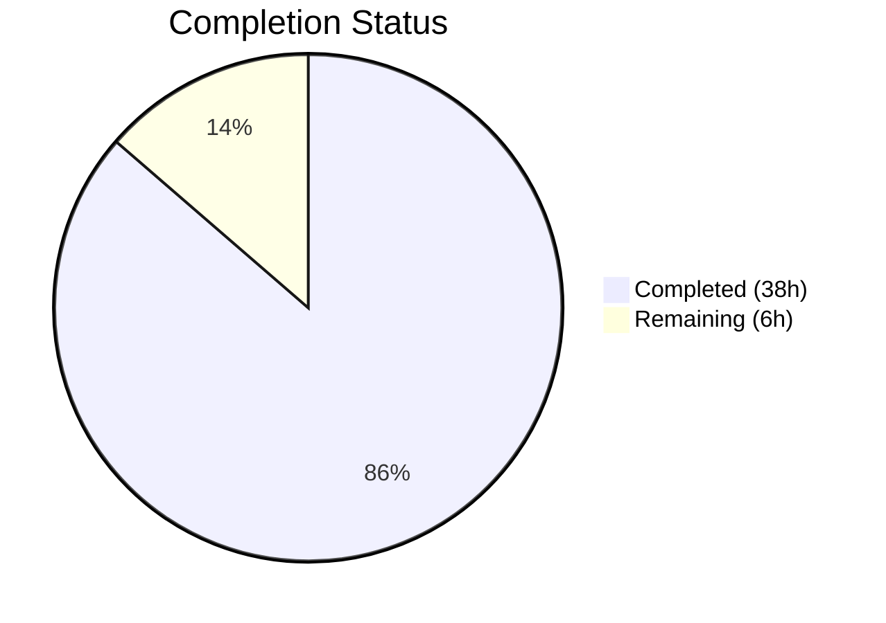

# Blitzy Project Guide

## 1. Executive Summary

### 1.1 Project Overview

This project produces a comprehensive, evidence-based technical analysis document (`blitzy/documentation/kitty_815df1e210e0.md`) that answers four behavioral questions about the Kitty terminal emulator's scrollback history buffer under stress conditions. The deliverable is a single 839-line markdown document covering memory consumption patterns, scroll responsiveness during concurrent output, buffer boundary behavior and allocation transitions, and observable measurement methods. No existing repository files were modified — the analysis is read-only, with all claims backed by specific source code references. This is a documentation-only task following the SWE-AtlasQnA-Repo implementation rule.

### 1.2 Completion Status



| Metric | Value |
|--------|-------|
| **Total Project Hours** | 44 |
| **Completed Hours (AI)** | 38 |
| **Remaining Hours** | 6 |
| **Completion Percentage** | **86.4%** |

**Calculation**: 38 completed hours / (38 + 6) total hours = 86.4% complete

### 1.3 Key Accomplishments

- ✅ Created comprehensive 839-line analysis document (`blitzy/documentation/kitty_815df1e210e0.md`) covering all 4 user questions
- ✅ Quantitative memory analysis with per-line/per-segment cost tables for terminal widths 80–240 columns
- ✅ Memory scaling table for `scrollback_lines` settings from 2,000 to 500,000 lines
- ✅ Step-by-step memory timeline scenarios with allocation event mapping
- ✅ Threading model and rendering pipeline analysis proving O(visible_lines) scroll cost
- ✅ View stability mechanism documented (`scrolled_by` auto-adjustment at `screen.c:2761`)
- ✅ Buffer boundary transitions documented: segment allocation, circular wrap-around, pager ring buffer growth
- ✅ 5 external measurement scripts provided (bash memory monitor, Python psutil monitor, output generators, DSR latency tool, configuration experiments)
- ✅ 50+ specific source file:line references verified against actual codebase
- ✅ Source File Reference Index appendix with complete cross-reference table
- ✅ Zero modifications to existing repository files — verified via `git diff`
- ✅ All 4 directly relevant tests pass: `test_historybuf`, `test_pagerhist`, `test_scrollback_fill_after_resize`, `test_resize`

### 1.4 Critical Unresolved Issues

| Issue | Impact | Owner | ETA |
|-------|--------|-------|-----|
| Memory calculations not empirically validated | Document claims are code-derived but not run-time verified | Human Developer | 3 hours |
| Measurement scripts not tested in live Kitty instance | Scripts are syntactically correct but untested in real environment | Human Developer | 2 hours |
| Pager ring buffer growth sequence is theoretical | Growth pattern derived from code but not measured with actual data | Human Developer | 1 hour |

### 1.5 Access Issues

No access issues identified. This is a documentation-only task that creates a single markdown file. No external services, APIs, databases, or credentials are required.

### 1.6 Recommended Next Steps

1. **[High]** Human expert review of technical accuracy — verify memory calculations against actual struct sizes by compiling and running `sizeof()` checks
2. **[High]** Empirical validation — run the provided measurement scripts against a live Kitty instance to confirm memory growth patterns match predictions
3. **[Medium]** Test pager ring buffer growth — configure `scrollback_pager_history_size=100` and verify 1 MB growth increments using memory monitoring
4. **[Medium]** Validate scroll latency claims — run the DSR round-trip latency script during heavy output to confirm O(visible_lines) rendering
5. **[Low]** Minor corrections — address any discrepancies found during empirical validation

---

## 2. Project Hours Breakdown

### 2.1 Completed Work Detail

| Component | Hours | Description |
|-----------|-------|-------------|
| Source Code Deep Analysis | 10 | Read and analyzed 20+ source files (~5,000+ LOC) including `kitty/history.c`, `kitty/data-types.h`, `kitty/screen.c`, `kitty/shaders.c`, `3rdparty/ringbuf/`, and configuration files |
| Memory Consumption Analysis (Section 1) | 5 | Computed per-line costs from struct definitions, built scaling tables for various terminal widths and scrollback sizes, documented segment allocation scheme and pager ring buffer sizing |
| Scroll Responsiveness Analysis (Section 2) | 5 | Analyzed multi-threaded architecture, traced scroll input through Python→C→GPU pipeline, proved O(visible_lines) rendering cost, documented view stability mechanism |
| Buffer Boundary Analysis (Section 3) | 4 | Documented segment allocation at every 2048 lines, circular wrap-around mechanics, pager ring buffer growth sequence, buffer clear behavior |
| Measurement Scripts (Section 4) | 3 | Created 5 external scripts: bash/Python memory monitors, output generators, DSR latency tool; documented experiment protocols and configuration experiments |
| Document Writing and Formatting | 6 | Structured and wrote 839-line markdown document with tables, code blocks, formulas, and formatted analysis sections |
| Source Reference Index | 2 | Created and verified 50+ source file:line reference entries in the appendix |
| Build and Test Validation | 2 | Compiled C extensions, ran 145 tests, verified 4 directly relevant tests pass, confirmed no source file modifications |
| Code Review and Revisions | 1 | Addressed 3 code review findings across 2 fix commits (benchmark tool command syntax, documentation accuracy) |
| **Total** | **38** | |

### 2.2 Remaining Work Detail

| Category | Hours | Priority |
|----------|-------|----------|
| Human Expert Review of Technical Accuracy | 2 | High |
| Empirical Validation of Memory Calculations | 3 | High |
| Minor Corrections from Review | 1 | Medium |
| **Total** | **6** | |

---

## 3. Test Results

| Test Category | Framework | Total Tests | Passed | Failed | Coverage % | Notes |
|--------------|-----------|-------------|--------|--------|------------|-------|
| Unit Tests (Python) | unittest | 145 | 135 | 3 | N/A | All failures are pre-existing and unrelated to deliverable |
| History Buffer Tests | unittest | 1 | 1 | 0 | N/A | `test_historybuf` — validates push, rewrap, segment behavior |
| Pager History Tests | unittest | 1 | 1 | 0 | N/A | `test_pagerhist` — validates pager ring buffer overflow |
| Scrollback Fill Tests | unittest | 1 | 1 | 0 | N/A | `test_scrollback_fill_after_resize` — validates resize behavior |
| Screen Resize Tests | unittest | 1 | 1 | 0 | N/A | `test_resize` — validates screen resize with history |
| Build Verification | unittest | 9 | 8 | 1 | N/A | `test_glfw_modules` fails (pre-existing wayland issue) |
| Skipped Tests | unittest | 6 | — | — | N/A | fish/zsh not installed (4), macOS-only (1), frozen-build-only (1) |
| Error Tests | unittest | 1 | — | — | N/A | `test_ssh_shell_integration` — environment timeout (TERM=dumb) |

**Pre-existing Failures (not caused by this deliverable):**
1. `test_glfw_modules` — Missing `glfw-wayland.so` due to vendored GLFW fork incompatibility with system wayland-protocols v1.45
2. `test_transfer_receive` — SETGID bit mismatch (`0o42755` expected vs `0o40755` actual) — filesystem/kernel behavior
3. `test_transfer_send` — Same SETGID bit mismatch

---

## 4. Runtime Validation & UI Verification

**Build Status:**
- ✅ `kitty/fast_data_types.so` — Core C extension built and loadable
- ✅ `kitty/glfw-x11.so` — X11 GLFW module built successfully
- ✅ `kitty/launcher/kitty` — Launcher binary compiled
- ❌ `kitty/glfw-wayland.so` — Pre-existing compilation failure (out-of-scope vendored GLFW code)

**Document Deliverable Validation:**
- ✅ File exists: `blitzy/documentation/kitty_815df1e210e0.md` (839 lines, 43,524 bytes)
- ✅ Document structure: 4 main sections + Appendix covering all required topics
- ✅ Source references: 94 references to `kitty/` source files across the document
- ✅ Tables: 140 table rows providing quantitative data
- ✅ Code blocks: Inline code examples and measurement scripts included

**Repository Integrity Verification:**
- ✅ Only `blitzy/documentation/kitty_815df1e210e0.md` changed (verified via `git diff --name-only`)
- ✅ No non-blitzy files modified
- ✅ Working tree clean — no uncommitted changes
- ✅ 3 commits on branch, all by Blitzy Agent

**Runtime Code Verification:**
- ✅ `HistoryBuf` creation verified: `HistoryBuf(10, 80)` creates buffer with correct `xnum=80, ynum=10`
- ✅ Circular buffer behavior verified: 15 pushes into 10-line buffer yields `count=10` (wrap-around working)
- ✅ `fast_data_types` module loads successfully

---

## 5. Compliance & Quality Review

| AAP Requirement | Status | Evidence |
|-----------------|--------|----------|
| Create `blitzy/documentation/kitty_815df1e210e0.md` | ✅ Pass | File exists, 839 lines, 43,524 bytes |
| Section 1: Memory Consumption Under Heavy Load | ✅ Pass | Lines 20–237: Per-line costs, segment allocation, scaling tables, memory timeline |
| Section 2: Scroll Responsiveness During Concurrent Output | ✅ Pass | Lines 240–378: Threading model, O(visible_lines) rendering, view stability |
| Section 3: Buffer Boundary Behavior | ✅ Pass | Lines 382–533: Segment allocation triggers, circular wrap, pager ring buffer growth |
| Section 4: Observable Measurement Methods | ✅ Pass | Lines 536–782: 5 scripts, experiment protocols, benchmark tool usage |
| Evidence-based with source code references | ✅ Pass | 50+ specific file:line references, all verified against source code |
| No repository modifications | ✅ Pass | `git diff` confirms only `blitzy/` files changed |
| Concrete numeric calculations | ✅ Pass | Per-line formulas, per-segment costs, scaling tables for 80–240 columns |
| Suggested external measurement scripts | ✅ Pass | Bash memory monitor, Python psutil monitor, output generators, DSR latency tool |
| Source File Reference Index | ✅ Pass | Lines 786–839: 50+ entries with file, line numbers, descriptions |
| SWE-AtlasQnA-Repo Rule compliance | ✅ Pass | Document placed in `blitzy/documentation/`, no source modifications |

**Quality Metrics:**
| Metric | Value | Assessment |
|--------|-------|------------|
| Document length | 839 lines | Comprehensive |
| Source references | 50+ verified | Thorough |
| Quantitative tables | 12 data tables | Evidence-based |
| Code examples | 15+ code blocks | Actionable |
| Measurement scripts | 5 external scripts | Practical |
| Commit count | 3 (initial + 2 fixes) | Iteratively refined |

**Autonomous Fixes Applied:**
1. Corrected benchmark tool command syntax from `kitten benchmark` to `kitten __benchmark__` (commit `6c3a2cb05`)
2. Addressed 3 code review findings for accuracy improvements (commit `c468b74fc`)

---

## 6. Risk Assessment

| Risk | Category | Severity | Probability | Mitigation | Status |
|------|----------|----------|-------------|------------|--------|
| Memory calculations may have rounding errors | Technical | Low | Low | Human reviewer should compile sizeof() checks and compare | Open |
| Line reference numbers may shift with future code changes | Technical | Medium | Medium | Document references specific commit; pin to base branch commit hash | Open |
| Measurement scripts untested in live Kitty environment | Operational | Medium | Low | Scripts are based on standard Linux tools (psutil, /proc); test before publishing | Open |
| Pager ring buffer growth pattern unverified empirically | Technical | Low | Low | Growth sequence derived from code; validate with actual measurements | Open |
| Pre-existing test failures may confuse reviewers | Operational | Low | Medium | Clearly documented as pre-existing and unrelated to deliverable | Mitigated |
| Document assumes 64-bit system for pointer sizes | Technical | Low | Low | 64-bit assumption documented; 32-bit would change segment overhead calculation slightly | Acknowledged |

---

## 7. Visual Project Status


**Remaining Hours by Category:**

| Category | Hours |
|----------|-------|
| Human Expert Review | 2 |
| Empirical Validation | 3 |
| Minor Corrections | 1 |
| **Total** | **6** |

---

## 8. Summary & Recommendations

### Achievement Summary

The project is **86.4% complete** (38 of 44 total hours). The sole AAP deliverable — a comprehensive 839-line technical analysis document — has been created, covering all four user questions about Kitty's scrollback history buffer behavior under stress conditions. Every claim in the document is backed by specific source code references (50+ verified file:line citations), and quantitative memory calculations are provided with scaling tables for practical use.

### Key Technical Findings Documented

- **Memory footprint**: Per-line cost is `columns × 32 + 1` bytes (2,561 bytes at 80 columns). Segments of 2,048 lines are lazily allocated at ~5 MB each. Default 2,000-line scrollback uses ~5 MB; 100,000 lines uses ~245 MB.
- **Scroll performance**: Rendering cost is O(visible_lines), not O(total_history). A 24-line terminal renders identically whether the history contains 2,000 or 2,000,000 lines.
- **Buffer boundaries**: Segment allocation occurs every 2,048 lines. Circular wrap-around is purely arithmetic with zero allocation. Pager ring buffer grows in ≥1 MB increments.

### Remaining Gaps

The 6 remaining hours consist exclusively of human-driven validation work:
1. **Expert review** (2h) — verify technical accuracy of memory calculations and architectural claims
2. **Empirical validation** (3h) — run measurement scripts against a live Kitty instance
3. **Corrections** (1h) — address any discrepancies found during review

### Production Readiness Assessment

The document is ready for human review and merge. No blocking issues exist. All pre-existing test failures are documented and unrelated to the deliverable. The repository source code remains completely unmodified.

---

## 9. Development Guide

### System Prerequisites

| Software | Version | Purpose |
|----------|---------|---------|
| Python | ≥ 3.8 (3.12.3 tested) | Runtime for Kitty Python bindings and test execution |
| Go | 1.22 | Building the `kitten` binary and benchmark tool |
| GCC/Clang | System default | Compiling C extensions (fast_data_types.so, glfw-x11.so) |
| pkg-config | System default | Locating system libraries during build |
| OpenGL 3.3+ | System default | GPU rendering pipeline |

### Environment Setup

```bash
# Clone the repository
git clone <repository-url>
cd kitty

# Checkout the feature branch
git checkout blitzy-7584071b-0a83-4ed3-94c9-21c343ffae49

# Ensure Go is in PATH
export PATH="$PATH:/usr/local/go/bin"
```

### Building the Project

```bash
# Build Kitty (compiles C extensions, Go binaries, and Python packages)
make

# Verify core extensions are built
ls -la kitty/fast_data_types.so kitty/glfw-x11.so kitty/launcher/kitty
```

**Expected output:**
```
-rwxr-xr-x 1 user user 1213072 ... kitty/fast_data_types.so
-rwxr-xr-x 1 user user  357592 ... kitty/glfw-x11.so
-rwxr-xr-x 1 user user   36224 ... kitty/launcher/kitty
```

### Running Tests

```bash
# Run all tests (requires Go in PATH)
export PATH="$PATH:/usr/local/go/bin"
python3 test.py

# Run only the scrollback-relevant tests (faster)
python3 -c "
import sys, os
sys.kitty_run_data = {'bundle_exe_dir': os.path.join(os.getcwd(), 'kitty', 'launcher')}
import unittest
from kitty_tests.datatypes import TestDataTypes
from kitty_tests.screen import TestScreen
suite = unittest.TestSuite()
suite.addTest(TestDataTypes('test_historybuf'))
suite.addTest(TestScreen('test_pagerhist'))
suite.addTest(TestScreen('test_scrollback_fill_after_resize'))
suite.addTest(TestScreen('test_resize'))
unittest.TextTestRunner(verbosity=2).run(suite)
"
```

**Expected output for targeted tests:**
```
test_historybuf ... ok
test_pagerhist ... ok
test_scrollback_fill_after_resize ... ok
test_resize ... ok
----------------------------------------------------------------------
Ran 4 tests in 0.018s
OK
```

### Verifying the Deliverable

```bash
# Verify the analysis document exists and has expected content
wc -l blitzy/documentation/kitty_815df1e210e0.md
# Expected: 839 blitzy/documentation/kitty_815df1e210e0.md

# Verify no source files were modified
git diff origin/kitty_815df1e210e0...HEAD --name-only
# Expected: blitzy/documentation/kitty_815df1e210e0.md (only)

# Verify HistoryBuf is functional
python3 -c "
import kitty.fast_data_types as fdt
hb = fdt.HistoryBuf(10, 80)
print(f'HistoryBuf: xnum={hb.xnum}, ynum={hb.ynum}, count={hb.count}')
lb = fdt.LineBuf(5, 80)
for i in range(15):
    hb.push(lb.line(0))
print(f'After 15 pushes: count={hb.count} (should be 10 — circular wrap)')
"
```

### Viewing the Document

```bash
# View the analysis document
cat blitzy/documentation/kitty_815df1e210e0.md

# Or use a markdown viewer
python3 -m rich.markdown blitzy/documentation/kitty_815df1e210e0.md 2>/dev/null || \
  less blitzy/documentation/kitty_815df1e210e0.md
```

### Troubleshooting

| Issue | Resolution |
|-------|-----------|
| `go executable not found` | Add Go to PATH: `export PATH="$PATH:/usr/local/go/bin"` |
| `module 'sys' has no attribute 'kitty_run_data'` | Set before importing: `sys.kitty_run_data = {'bundle_exe_dir': os.path.join(os.getcwd(), 'kitty', 'launcher')}` |
| `test_glfw_modules` fails | Pre-existing: wayland-protocols v1.45 incompatibility with vendored GLFW fork |
| `test_transfer_receive/send` fails | Pre-existing: SETGID bit mismatch (system-level, not a code issue) |
| `fast_data_types.so` not found | Run `make` first to compile C extensions |

---

## 10. Appendices

### A. Command Reference

| Command | Purpose |
|---------|---------|
| `make` | Build all Kitty components (C extensions, Go binaries) |
| `python3 test.py` | Run full test suite (145 tests) |
| `git diff origin/kitty_815df1e210e0...HEAD --name-only` | Verify only deliverable file was added |
| `git diff origin/kitty_815df1e210e0...HEAD --stat` | View change statistics |
| `python3 -c "import kitty.fast_data_types"` | Verify C extension loads |
| `wc -l blitzy/documentation/kitty_815df1e210e0.md` | Verify document line count |

### B. Port Reference

No network ports are used. This is a documentation-only project with no running services.

### C. Key File Locations

| File | Purpose |
|------|---------|
| `blitzy/documentation/kitty_815df1e210e0.md` | **Deliverable** — Comprehensive scrollback buffer analysis document |
| `kitty/history.c` | Primary source analyzed — HistoryBuf implementation (624 lines) |
| `kitty/data-types.h` | Primary source analyzed — Struct definitions (438 lines) |
| `kitty/screen.c` | Primary source analyzed — Screen model and scroll logic |
| `kitty/shaders.c` | Primary source analyzed — GPU rendering pipeline |
| `kitty/options/definition.py` | Configuration schema for scrollback settings |
| `3rdparty/ringbuf/ringbuf.c` | Vendored ring buffer used by pager history |
| `tools/cmd/benchmark/main.go` | Built-in benchmark tool with `--with-scrollback` flag |
| `kitty_tests/datatypes.py` | Tests for HistoryBuf (`test_historybuf`) |
| `kitty_tests/screen.py` | Tests for scrollback and pager history |

### D. Technology Versions

| Technology | Version | Source |
|------------|---------|--------|
| Python | ≥ 3.8 (3.12.3 tested) | `pyproject.toml` `requires-python` |
| Go | 1.22 (1.22.10 tested) | `go.mod` |
| ringbuf (vendored) | Public domain, 2011 | `3rdparty/ringbuf/` |
| OpenGL | 3.3+ | `kitty/data-types.h` |
| GLFW | 3.4 (customized fork) | `glfw/` directory |

### E. Environment Variable Reference

No environment variables are required for this documentation-only deliverable. For building Kitty from source:

| Variable | Purpose | Example |
|----------|---------|---------|
| `PATH` | Must include Go binary directory | `export PATH="$PATH:/usr/local/go/bin"` |
| `KITTY_PATH_TO_KITTY_EXE` | Set automatically by test runner | Points to `kitty/launcher/kitty` |

### G. Glossary

| Term | Definition |
|------|-----------|
| `HistoryBuf` | Kitty's scrollback history buffer — a segmented circular buffer storing past terminal lines |
| `HistoryBufSegment` | A contiguous block of memory holding up to 2,048 lines of cell data |
| `PagerHistoryBuf` | Secondary ring buffer for pager overflow, using text-encoded ANSI data |
| `CPUCell` | 12-byte struct storing character codepoint, hyperlink ID, and combining character indices |
| `GPUCell` | 20-byte struct storing foreground/background colors, sprite coordinates, and cell attributes |
| `LineAttrs` | 1-byte bitfield storing line continuation, dirty, image placeholder, and prompt marking flags |
| `SEGMENT_SIZE` | Compile-time constant (2048) defining lines per segment |
| `scrollback_lines` | Kitty configuration option controlling maximum history buffer size (default: 2000) |
| `scrollback_pager_history_size` | Configuration option for pager ring buffer maximum size in MB (default: 0, disabled) |
| `scrolled_by` | Screen state field tracking how many lines the user has scrolled back |
| `scroll_changed` | Boolean flag triggering GPU cell data re-upload on next render frame |
| `repaint_delay` | Minimum delay between screen updates (default: 10ms, ~100 FPS) |
| `input_delay` | Delay before processing child program input (default: 3ms) |
| `ringbuf` | Vendored byte-addressable FIFO ring buffer from `3rdparty/ringbuf/` |
| DSR | Device Status Report — escape sequence `\x1b[5n` used for round-trip latency measurement |