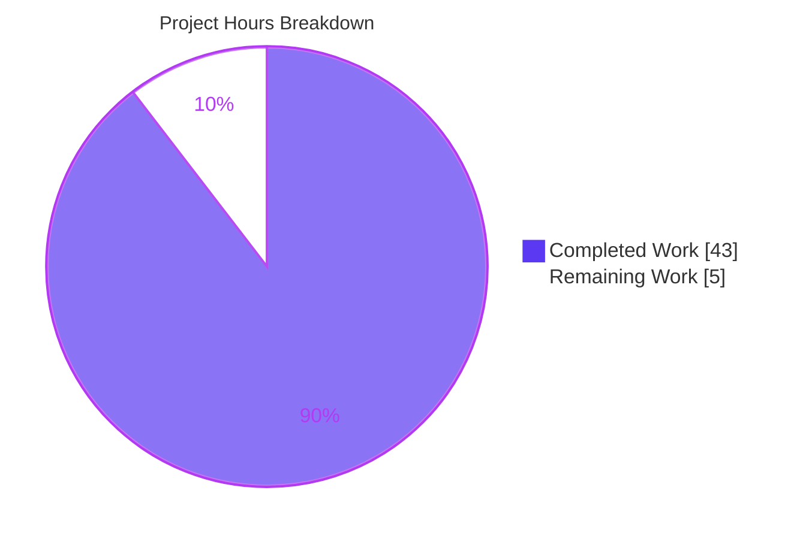
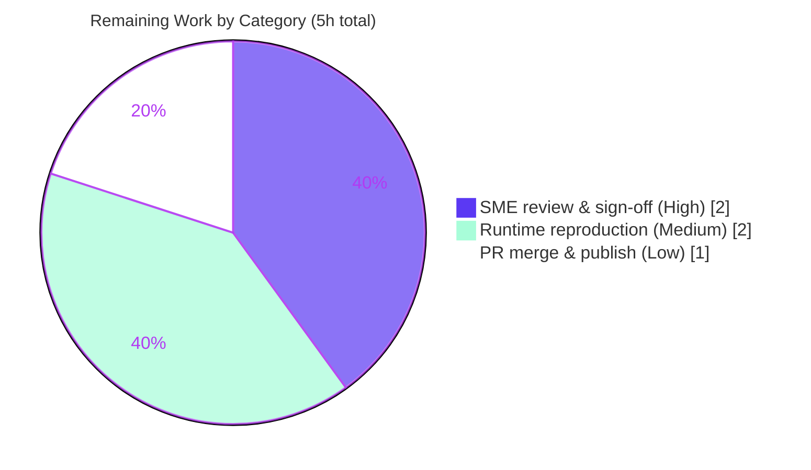

# Blitzy Project Guide
## Kitty Keyboard-Input Runtime Q&A — Evidence-Backed Documentation Deliverable

---

## 1. Executive Summary

### 1.1 Project Overview

This project delivers a single, evidence-backed technical answer document that explains **how the Kitty terminal emulator handles keyboard input during normal use**, grounded in *observed runtime behavior* rather than static code reading. Kitty was built in its default configuration and run with its own built-in tracing flags; keys were pressed through the real windowing path and the emitted traces and dumped bytes were captured, correlated to source, and confirmed stable across repeated runs. The audience is engineers seeking a runtime-verified mental model of Kitty's input-to-display pipeline. Technical scope spans the C core, the Python orchestration layer, and the GLFW platform layer. The sole persistent output is one Markdown document; no Kitty source was modified.

### 1.2 Completion Status

The completion percentage is computed using the AAP-scoped hours methodology: `Completed ÷ (Completed + Remaining) × 100`. All Agent Action Plan (AAP) requirements are complete and independently validated; the remaining hours represent the human acceptance path-to-production only.


> **Color key (Blitzy brand):** Completed / AI Work = Dark Blue **`#5B39F3`**; Remaining / Not Completed = White **`#FFFFFF`** (outlined in Violet-Black `#B23AF2`).

| Metric | Hours |
|---|---|
| **Total Hours** | **48** |
| Completed Hours (AI) | 43 |
| Completed Hours (Manual) | 0 |
| **Completed Hours (AI + Manual)** | **43** |
| **Remaining Hours** | **5** |
| **Percent Complete** | **89.6%** |

*Calculation:* `43 ÷ (43 + 5) × 100 = 43 ÷ 48 × 100 = 89.6%`.

### 1.3 Key Accomplishments

- ✅ Built Kitty in its default, canonical configuration with a debug build (`python3 setup.py build --debug`, exit `0`, 122 compile units, version `kitty 0.35.2`).
- ✅ Launched the **real GUI binary** with all three built-in tracing flags (`--debug-input`, `--debug-rendering`, `--dump-bytes`) in a headless OpenGL context.
- ✅ Drove input through the **genuine** GLFW → `keys.c` → PTY → VT-parser → screen → GPU path (via `xdotool` XTEST), not `show-key` or `send-text`.
- ✅ Exercised **every implied input condition**: printable `a`, Enter, Ctrl-C, Up arrow, F1, bare Shift, and release events.
- ✅ Captured **before / during / after** screen state, including a framebuffer delta confined to a single glyph cell.
- ✅ Confirmed behavior is **consistently observed across three identical runs** (full `dump.bytes` MD5 identical; `on_key_input` decision lines byte-identical), with the one honest run-to-run difference (an XKB keymap reload) reported, not hidden.
- ✅ Authored a **1,337-line** answer document with verbatim, unedited evidence beside every claim and **91 unique `file:line` references verified accurate**.
- ✅ Preserved repository integrity: **zero Kitty source files modified**, all temporary artifacts removed, working tree clean.

### 1.4 Critical Unresolved Issues

No critical unresolved issues were identified during autonomous validation. All five production-readiness gates (Dependencies, Compilation, Runtime, In-Scope Files, Zero-Errors/References) passed at 100%.

| Issue | Impact | Owner | ETA |
|---|---|---|---|
| *None* — no unresolved blocking issues | None | — | — |

### 1.5 Access Issues

**No access issues identified.** The provided container image supplied the full toolchain (C11 gcc, Go, Python), all required C libraries, and a headless GUI/OpenGL context. The task requires no external services, credentials, API keys, or network access.

| System/Resource | Type of Access | Issue Description | Resolution Status | Owner |
|---|---|---|---|---|
| *None* | — | No access dependencies | N/A | — |

### 1.6 Recommended Next Steps

1. **[High]** Perform an SME technical-accuracy review of the answer document and sign off (read end-to-end; spot-check a sample of the 91 `file:line` references and byte-exact claims). — *2h*
2. **[Medium]** Independently reproduce the runtime evidence by re-running the documented build/launch/key-injection commands in the container and confirming the trace + dump-byte outputs. — *2h*
3. **[Low]** Approve the pull request, merge the single-file addition, and (optionally) index the document into the internal knowledge base. — *1h*

---

## 2. Project Hours Breakdown

### 2.1 Completed Work Detail

Every completed component traces to a specific AAP requirement (`[R#]`) or explicitly-scoped activity. Completed hours = **43** (all autonomous; manual = 0).

| Component | Hours | Description |
|---|---:|---|
| Environment provisioning & canonical debug build `[R1]` | 4 | Verified container toolchain + C libs; ran `setup.py build --debug` (122 units, exit 0); captured 380-line build log + exact `keys.c` compile command |
| Instrumented launch & default-config confirmation `[R1]` | 3 | Headless Xvfb + Mesa llvmpipe GL; launched real GUI binary with `--debug-input`/`--debug-rendering`/`--dump-bytes`; confirmed no config file present (defaults) |
| Debug-flag semantics research (web search) `[§0.2.2]` | 2 | Validated `--debug-keyboard`/`--debug-input`, `--debug-rendering`, `--dump-bytes` semantics + expected trace shape against authoritative sources |
| Real-path input exercise — all 7 conditions `[R2]` | 4 | Injected canonical keys via `xdotool` XTEST through genuine GLFW path: `a`, Enter, Ctrl-C, Up, F1, bare Shift, release events |
| Pipeline capture & component correlation `[R3]` | 5 | Collected trace lines + dumped bytes (`od -An -c`), parser-command stream; correlated each observed line to its source component |
| Three-stage answer construction `[R4]` | 4 | Structured receipt / intermediate / display stages; authored mermaid flow; mapped every component |
| Before/during/after state capture `[R4 + implicit]` | 2 | Framebuffer before/after keypress; one-cell bbox; pixel-metric distribution tracked to cursor blink phase |
| Stability across ≥2 runs (3 runs performed) `[R5]` | 3 | 3 identical runs; MD5 byte-identity; `on_key_input` line diffs; honest reporting of the single XKB-reload difference |
| Evidence discipline: byte-exact + `file:line` grounding `[Rules]` | 3 | 91 unique references verified; byte-exact reporting (ESC as `^[`); complete/unedited captures |
| Document authoring — 1,337-line deliverable `[R4 / Deliverable]` | 6 | Wrote the full 10-section Markdown, component→source map, methodology/integrity notes |
| QA remediation cycles (3 commits) `[Quality]` | 3 | Resolved review findings: verbatim compile cmd, true framebuffer delta, pixel-metric distribution, parser-stream provenance, full-path citations |
| Repository integrity & cleanup `[R6]` | 1 | Confined temp scripts outside repo; removed dumps/scripts; verified clean tree (one self-correction) |
| Autonomous validation & 145-test suite (Final Validator) | 3 | Reproduced build (exit 0) + 3-run runtime; ran Kitty test suite (145 OK); verified 91 references; 5 gates |
| **Total Completed** | **43** | *Matches Completed Hours in §1.2* |

### 2.2 Remaining Work Detail

Every remaining category traces to a path-to-production (human acceptance) need. There are **no** compilation errors, failing tests, or missing functionality — all AAP work is complete and validated.

| Category | Hours | Priority |
|---|---:|---|
| SME technical-accuracy review & sign-off | 2 | High |
| Independent runtime-evidence reproduction | 2 | Medium |
| PR approval, merge & knowledge-base publish | 1 | Low |
| **Total Remaining** | **5** | — |

> **Cross-section check:** §2.1 Completed (43) + §2.2 Remaining (5) = **48** = Total Hours in §1.2. §2.2 Remaining (5) = §1.2 Remaining (5) = §7 pie "Remaining Work" (5). ✅

### 2.3 Hours Methodology

Estimates reflect equivalent skilled-engineer effort for a runtime-investigation-and-documentation task: environment/build, multi-run byte-exact observation of 7 input conditions, framebuffer analysis, correlation to ~91 source locations, a 1,337-line evidence-backed document, three QA cycles, and full independent validation including a 145-test suite. Confidence is **High** — the scope is a single, well-defined deliverable and all validation gates passed. The completion percentage is intentionally below 100% because human review, acceptance, and merge cannot be performed autonomously.

---

## 3. Test Results

All tests below originate from Blitzy's autonomous validation logs for this project. They were executed to confirm codebase health and to reproduce the runtime evidence backing the document; the deliverable itself is a documentation artifact (no new application code, hence no new-code coverage metric).

| Test Category | Framework | Total Tests | Passed | Failed | Coverage % | Notes |
|---|---|---:|---:|---:|:---:|---|
| Unit & Integration (Kitty core) | Python `unittest` via `setup.py test` | 149 | 145 | 0 | N/A | 4 skipped (fish shell absent); exit `0`; confirms codebase healthy and unaffected by the doc-only change |
| Go module tests | Go `testing` | All | All | 0 | N/A | Validator reported "All Go tests succeeded"; individual count not enumerated in logs |
| Runtime byte-exact reproduction | `--debug-input` / `--dump-bytes` + `md5sum` | 3 runs | 3 | 0 | N/A | Full `dump.bytes` MD5 identical across all 3 runs; `on_key_input` decision lines diff **IDENTICAL** |
| Compilation (canonical debug build) | `setup.py build --debug` (gcc) | 122 units | 122 | 0 | N/A | exit `0`; all input-to-display pipeline units compiled |

**Summary:** 145 automated unit/integration tests passed (0 failed, 4 skipped), all Go tests passed, compilation succeeded (122/122 units), and runtime behavior reproduced byte-for-byte across 3 independent runs. No test failures.

---

## 4. Runtime Validation & UI Verification

Runtime health and the observed input-to-display behavior that backs the document's claims:

- ✅ **Operational** — Canonical debug build (`setup.py build --debug`), exit `0`, 122 compile units, `kitty 0.35.2`.
- ✅ **Operational** — Real GUI binary launched with `--debug-input --debug-rendering --dump-bytes` in default configuration (no config file present).
- ✅ **Operational** — OpenGL context: `4.5 (Core Profile) Mesa 25.2.8`; **zero GL errors** across all renders.
- ✅ **Operational** — Stage 1 (Receipt): GLFW/XKB backend → `kitty/glfw.c:430` `key_callback` → `:439` `on_key_input` observed for every keypress.
- ✅ **Operational** — Stage 2 (Intermediate): encode (`keys.c:251`) → PTY write → child echo → `read_bytes` (I/O thread) → `parse_input` (main thread) → VT parser → `screen.c:850 is_dirty = true`.
- ✅ **Operational** — Stage 3 (Display): dirty guard (`shaders.c:418`) → `send_cell_data_to_gpu` (`:970`) → `draw_cells` (`:1009`) → `swap_window_buffers` (`child-monitor.c:810`).
- ✅ **Operational** — UI/framebuffer verification: keypress produced a change **confined to a single glyph cell** at the cursor, **zero pixels changed outside** that cell, **exactly one byte** of dump growth (invariants stable across runs).
- ✅ **Operational** — Per-condition input branches all reproduced byte-exact: `a`→text `a`; Enter→`0xd`; Ctrl-C→`0x3`; Up→`^[[A`; F1→`^[OP`; bare Shift→ignored (unencodable).
- ✅ **Operational** — Stability: identical behavior across 3 runs; the single run-to-run difference (one-time XKB keymap reload from a shared Xvfb) is documented with root cause.

No partial (⚠) or failing (❌) items.

---

## 5. Compliance & Quality Review

Cross-mapping of AAP deliverables and governing-ruleset constraints to their validation status. All fixes were applied during authoring/QA (three remediation commits); no items remain outstanding.

| Benchmark / Requirement | Status | Progress | Notes |
|---|:---:|:---:|---|
| `[R1]` Instrumented startup (build + launch with debug flags) | ✅ Pass | 100% | Exact commands in §2/§10 of the doc; build exit 0 reproduced |
| `[R2]` Exercise real input path (simple + secondary conditions) | ✅ Pass | 100% | 7 conditions via genuine GLFW→keys.c→PTY path |
| `[R3]` Capture observable pipeline (traces + bytes) | ✅ Pass | 100% | Full startup trace, per-condition captures, parser-command stream |
| `[R4]` Answer three-part question (receipt/intermediate/display) | ✅ Pass | 100% | Direct answer + staged sections + mermaid |
| `[R5]` Ground in consistent behavior (≥2 runs) | ✅ Pass | 100% | 3 runs; MD5 identity; honest inconsistency disclosure |
| `[R6]` Preserve repository integrity | ✅ Pass | 100% | 0 source mods; temp artifacts removed; clean tree |
| Read-only source mandate | ✅ Pass | 100% | `git diff` = exactly 1 file added (+1,337/−0) |
| Canonical path only (not `show-key`/`send-text`) | ✅ Pass | 100% | XTEST through real windowing path; non-canonical paths labeled in §9 |
| Byte-exact evidence discipline | ✅ Pass | 100% | ESC shown as `^[`; complete/unedited captures |
| `file:line` reference per claim | ✅ Pass | 100% | 91 unique references verified accurate; zero discrepancies |
| Deliverable name & location (`<branch>.md`) | ✅ Pass | 100% | `blitzy/documentation/kitty_815df1e210e0.md` |
| Zero placeholders / TODO / elision | ✅ Pass | 100% | 0 TODO/FIXME/placeholder; 0 `// ...` elisions |
| Well-formed Markdown (balanced fences, valid mermaid) | ✅ Pass | 100% | 102 fence lines (balanced); 1 valid mermaid flowchart |

**Fixes applied during autonomous validation:** verbatim `keys.c` compile command, true framebuffer delta, pixel-metric distribution tied to blink phase, parser-stream provenance (buffered-stdout flush explanation), and full-path citations. **Outstanding items:** none.

---

## 6. Risk Assessment

Overall risk profile is **Low** — a read-only documentation task introduces no code, dependencies, or credentials. No High or Critical risks.

| Risk | Category | Severity | Probability | Mitigation | Status |
|---|---|:---:|:---:|---|:---:|
| Environment-dependent runtime metrics (pixel counts/timings vary with headless Mesa/blink phase) | Technical | Low | Medium | Doc separates environment-dependent values from invariants (one-cell redraw, zero-pixels-outside, one-byte growth) that hold every run | Mitigated |
| Source-line drift (references pinned to commit `815df1e21`) | Technical | Low | Medium (long-term) | Doc states exact commit hash + names each function (resilient to line shifts) | Mitigated |
| No security exposure (zero deps, no code beyond prose, no secrets) | Security | None | — | N/A — nothing introduced to secure | N/A |
| Knowledge-artifact staleness as upstream evolves | Operational | Low | Low–Medium | Pinned to commit; recommend re-validation if the input pipeline changes | Accepted |
| Reproduction toolchain dependency (needs container + Xvfb + Mesa + xdotool) | Integration | Low | Low | Doc §2 documents exact image, env vars, and commands | Mitigated |

---

## 7. Visual Project Status



> **Colors:** Completed Work = Dark Blue `#5B39F3`; Remaining Work = White `#FFFFFF` (Violet-Black `#B23AF2` outline).

**Remaining hours by category (from §2.2):**



> **Integrity:** "Remaining Work" = **5h**, equal to §1.2 Remaining Hours and the sum of the §2.2 Hours column. "Completed Work" = **43h**, equal to §1.2 Completed Hours and the sum of the §2.1 Hours column.

---

## 8. Summary & Recommendations

**Achievements.** The project delivers a runtime-verified, evidence-backed answer to how Kitty handles keyboard input during normal use. Kitty was built and run in its canonical configuration with its own tracing flags; input was driven through the genuine windowing path; and the observed traces, dumped bytes, and framebuffer changes were captured, correlated to 91 verified source locations, and confirmed stable across three runs. The document answers all three named parts of the question (first receipt, intermediate processing, display production), exercises every implied condition, and captures before/during/after state — all while leaving the repository unmodified except for the single answer file.

**Remaining gaps.** None in autonomous scope. The outstanding **5 hours** are the human acceptance path-to-production: SME technical-accuracy review and sign-off, an optional independent reproduction of the runtime evidence, and PR approval/merge/publish.

**Critical path to production.** SME review (High) → reproduction (Medium) → merge/publish (Low). No engineering rework is required.

**Success metrics.** Build exit `0`; 145 tests passing (0 failed); 3-run byte-exact reproduction; 91/91 references accurate; zero source files modified; clean working tree.

**Production-readiness assessment.** The deliverable is **production-ready pending human sign-off**. The project is **89.6% complete** (43 of 48 hours) — reflecting that all AAP-scoped autonomous work is finished and fully validated, with only human review, acceptance, and merge remaining.

| Metric | Value |
|---|---|
| Completion | 89.6% |
| Completed / Total Hours | 43 / 48 |
| Remaining Hours | 5 |
| Validation Gates Passed | 5 / 5 |
| Source Files Modified | 0 |
| Confidence | High |

---

## 9. Development Guide

This guide documents how to reproduce the runtime observations and how to inspect/verify the deliverable. The **build and launch** steps must run inside the provided container image (which supplies the C/Go/Python toolchain and a headless OpenGL context); these commands are reproduced from Blitzy's validator-confirmed run instructions. The **verification** commands were tested live and can be run wherever the repository is checked out.

### 9.1 System Prerequisites

- **OS/Runtime:** Linux container image `kitty-qna-runtime:local` (derived from `ghcr.io/scaleapi/swe-atlas:swe_atlas_QnA_kovidgoyal_kitty_1.0`).
- **Toolchain:** C11 compiler (`gcc`), Go (1.22+), Python (≥3.8; container uses 3.12).
- **C libraries (via pkg-config):** `harfbuzz`, `libpng`, `lcms2`, `libcrypto` (OpenSSL), `fontconfig`, `freetype2`, `xkbcommon`, plus OpenGL/`egl`.
- **Headless display:** `Xvfb` + Mesa `llvmpipe` software OpenGL; `xdotool` for synthetic key injection.
- Kitty declares **no third-party Python runtime dependencies** (standard library + its own compiled `fast_data_types` extension).

### 9.2 Environment Setup

```bash
# Headless virtual display + software OpenGL (already provided by the container)
export DISPLAY=:99
export LIBGL_ALWAYS_SOFTWARE=1
export GALLIUM_DRIVER=llvmpipe
# If not already running:
# Xvfb :99 -screen 0 1280x800x24 -ac +extension GLX +render -noreset &
```

Kitty runs in its **default, canonical configuration** — confirm no config file overrides defaults:

```bash
ls -l ~/.config/kitty/kitty.conf   # expected: No such file or directory
ls -l /etc/xdg/kitty/kitty.conf    # expected: No such file or directory
```

### 9.3 Build (canonical debug build)

```bash
cd /app
python3 setup.py clean
python3 setup.py build --debug     # Makefile `debug:` target; expected exit code 0
```
Expected artifacts: `kitty/launcher/kitty`, `kitten`, `kitty/fast_data_types.so`. Expected banner includes `kitty 0.35.2 created by Kovid Goyal`; build log ~380 lines, 122 compile units.

### 9.4 Launch with built-in tracing + inject keys

```bash
DISPLAY=:99 ./kitty/launcher/kitty --debug-input --debug-rendering \
    --dump-bytes /tmp/dump.bytes -o confirm_os_window_close=0 \
    --title kitty-dbg > /tmp/trace.log 2>&1 &

WID=$(xdotool search --sync --name kitty-dbg | head -1)
xdotool windowfocus --sync "$WID"
xdotool key a Return ctrl+c Up F1 Shift_L

# Graceful shutdown flushes the block-buffered parsed-command stdout stream:
xdotool type --window "$WID" exit
xdotool key  --window "$WID" Return
```

### 9.5 Verification Steps

```bash
# Inspect captured traces and byte dump
grep on_key_input /tmp/trace.log            # per-key decision lines
od -An -c /tmp/dump.bytes | head            # raw echoed bytes (ESC visible, etc.)

# Run Kitty's own test suite (confirms codebase health)
TMPDIR=/exectmp python3 setup.py test       # expected: 145 tests OK (4 skipped), Go tests pass, exit 0
```

**Verify the deliverable itself (runnable anywhere the repo is checked out):**

```bash
cd /tmp/blitzy/kitty/blitzy-939b992e-3db9-45a4-ae05-0c9b3c7446f1_4b1f6d
test -f blitzy/documentation/kitty_815df1e210e0.md && echo "deliverable present"
wc -l blitzy/documentation/kitty_815df1e210e0.md          # expected: 1337
git diff --name-status 815df1e21..HEAD                    # expected: A  blitzy/documentation/kitty_815df1e210e0.md
git status --porcelain                                     # expected: (empty = clean)

# Spot-check a cited file:line reference against source
sed -n '850p' kitty/screen.c                               # expected: self->is_dirty = true;
```

### 9.6 Example Usage (interpreting the evidence)

Pressing a printable key yields the text branch; pressing Enter yields a single encoded byte:

```text
on_key_input: ... action: PRESS ... text: 'a' ...
sent key as text to child: a
...
sent encoded key to child: 0xd     # Enter (carriage return)
```

### 9.7 Troubleshooting

- **`go` / `pkg-config` not found:** you are not in the container. Build inside `kitty-qna-runtime:local`; the authoring sandbox intentionally lacks the full toolchain.
- **Build fails on a missing C library:** install the missing `pkg-config` dependency (e.g., `harfbuzz`, `freetype2`, `xkbcommon`) and re-run `python3 setup.py build --debug`.
- **`xdotool` finds no window:** ensure `Xvfb :99` is running and `DISPLAY=:99` is exported before launching Kitty.
- **The parsed VT-command stream (`§10.4b`) is missing from the log:** shut Kitty down *gracefully* (`exit` + Enter, Ctrl-D, or `kill <pid>`/SIGTERM). A hard `kill -9` (SIGKILL) drops the block-buffered stdout; the stderr traces and `--dump-bytes` file are unaffected.
- **GL errors / no context:** set `LIBGL_ALWAYS_SOFTWARE=1` and `GALLIUM_DRIVER=llvmpipe` for Mesa software rendering.

---

## 10. Appendices

### A. Command Reference

| Purpose | Command |
|---|---|
| Clean build tree | `python3 setup.py clean` |
| Canonical debug build | `python3 setup.py build --debug` |
| Launch with tracing | `./kitty/launcher/kitty --debug-input --debug-rendering --dump-bytes /tmp/dump.bytes -o confirm_os_window_close=0 --title kitty-dbg` |
| Find window id | `xdotool search --sync --name kitty-dbg \| head -1` |
| Inject keys | `xdotool key a Return ctrl+c Up F1 Shift_L` |
| Graceful shutdown | `xdotool type --window "$WID" exit; xdotool key --window "$WID" Return` |
| Run test suite | `TMPDIR=/exectmp python3 setup.py test` |
| Inspect byte dump | `od -An -c /tmp/dump.bytes` |
| Verify deliverable diff | `git diff --name-status 815df1e21..HEAD` |

### B. Port Reference

Kitty is a terminal emulator, not a network service; it opens **no listening TCP ports** in this configuration. The only network-adjacent resource is the X display socket.

| Resource | Value | Purpose |
|---|---|---|
| X display | `:99` (Xvfb, 1280×800×24) | Headless GUI/OpenGL surface for the real GUI binary |

### C. Key File Locations

| Path | Role |
|---|---|
| `blitzy/documentation/kitty_815df1e210e0.md` | **The deliverable** (1,337 lines) |
| `kitty/glfw.c` (`:430`, `:439`) | First kitty-side receipt: `key_callback` → `on_key_input` |
| `kitty/keys.c` (`:166`, `:176`, `:251`) | Core input handler, `--debug-keyboard` trace, key encoding |
| `kitty/key_encoding.c` | Legacy vs. Kitty-protocol (CSI u) encoding |
| `kitty/child-monitor.c` (`:451`, `:810`, `:871`, `:1337`) | `parse_input`, `swap_window_buffers`, `render`, `read_bytes` |
| `kitty/vt-parser.c` (`:236`, `:1417`) | Byte classification → `screen_draw_text`, `run_worker` |
| `kitty/screen.c` (`:849`, `:850`) | `draw_text`, `is_dirty = true` |
| `kitty/shaders.c` (`:418`, `:970`, `:1009`) | Dirty guard, `send_cell_data_to_gpu`, `draw_cells` |
| `kitty/options/definition.py` (`:866`, `:878`) | `repaint_delay`, `input_delay` timing knobs |
| `kitty/cli.py` (`:985`–`:1004`) | Debug-flag definitions |
| `setup.py`, `Makefile` (`:22`–`:23`) | Canonical build commands |

### D. Technology Versions

| Component | Version (canonical container) |
|---|---|
| Kitty | 0.35.2 (source at commit `815df1e21`) |
| Python | 3.12.3 |
| gcc | 13.3.0 |
| Go | 1.23.4 |
| pkg-config | 1.8.1 |
| make | 4.3 |
| OpenGL (Mesa) | 4.5 (Core Profile) Mesa 25.2.8 (llvmpipe) |

### E. Environment Variable Reference

| Variable | Value | Purpose |
|---|---|---|
| `DISPLAY` | `:99` | Target the Xvfb virtual display |
| `LIBGL_ALWAYS_SOFTWARE` | `1` | Force Mesa software OpenGL |
| `GALLIUM_DRIVER` | `llvmpipe` | Select the llvmpipe software rasterizer |
| `TMPDIR` | `/exectmp` | Isolated temp dir for the test suite |
| `SHELL` | user default (`/bin/bash --posix` observed) | Resolves the default shell Kitty spawns (`kitty/child.py:229`) |

### F. Developer Tools Guide (Kitty's built-in observability)

| Flag | Effect (per `kitty/cli.py`) |
|---|---|
| `--debug-input` / `--debug-keyboard` | Print key and mouse events as they are received (drives `on_key_input` traces) |
| `--debug-rendering` / `--debug-gl` | Debug rendering commands; print miscellaneous debug information |
| `--dump-bytes <path>` | Store the raw bytes received from the child process |
| `--dump-commands` | Dump the parsed VT-command stream (screen mutations) |
| `--replay-commands` | Replay a previously dumped command stream |

### G. Glossary

| Term | Meaning |
|---|---|
| **PTY** | Pseudo-terminal; the bidirectional byte channel between Kitty and the child shell |
| **VT parser** | The state machine (`kitty/vt-parser.c`) that classifies raw bytes into screen commands |
| **GLFW** | The windowing/input library layer that delivers native key events into Kitty's C core |
| **XKB** | X Keyboard extension; resolves native key codes into symbolic key events |
| **CSI u** | The Kitty keyboard protocol's escape-sequence encoding for keys (vs. legacy encoding) |
| **`is_dirty`** | Screen flag set when the model changes, gating the next GPU render cycle |
| **Sprite atlas** | The GPU texture holding rasterized glyph cells uploaded during rendering |
| **Child Monitor** | Kitty's three-thread engine (Main = parse/render, I/O = PTY poll/read/write, Talk = peer/remote control) |
| **Receipt / Intermediate / Display** | The three pipeline stages the document answers: who sees input first, who transforms it, how the screen updates |

---

*Generated by the Blitzy Platform. Completion measured against AAP-scoped work and path-to-production only. Brand colors — Completed `#5B39F3`, Remaining `#FFFFFF`, Accent `#B23AF2`, Highlight `#A8FDD9`.*