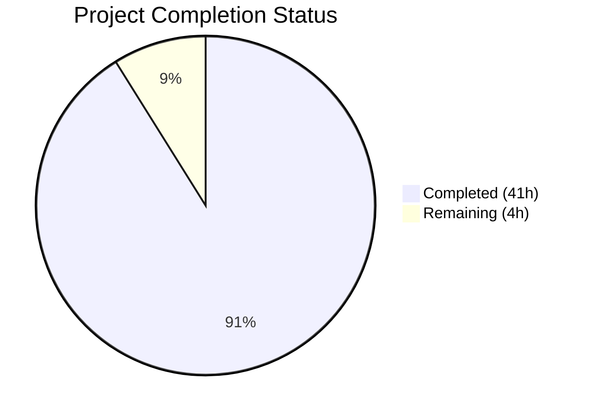

# Blitzy Project Guide

## 1. Executive Summary

### 1.1 Project Overview

This project delivers a comprehensive technical investigation document analyzing the relationship between kitty's compiled C extension modules and its test execution flow. The deliverable is a single markdown file (`blitzy/documentation/kitty_815df1e210e0.md`) that traces the build pipeline from `setup.py` through three families of compiled `.so` artifacts, maps all 24 test files to their C extension dependencies, documents the cascading failure behavior when extensions are unavailable, and classifies each extension sub-module as critical or optional. The document is source-code-grounded per the `SWE-AtlasQnA-Repo` rule, with 89 inline source citations, 21 thinking/rationale blocks, and 9 Mermaid architecture diagrams. No existing repository files were modified.

### 1.2 Completion Status



| Metric | Value |
|---|---|
| **Total Project Hours** | 45 |
| **Completed Hours (AI)** | 41 |
| **Remaining Hours** | 4 |
| **Completion Percentage** | 91.1% |

**Calculation:** 41 completed hours / (41 completed + 4 remaining) = 41 / 45 = 91.1% complete.

### 1.3 Key Accomplishments

- [x] Created comprehensive 1,618-line technical investigation document (`blitzy/documentation/kitty_815df1e210e0.md`)
- [x] Traced the complete `setup.py` build pipeline producing three `.so` extension families
- [x] Inventoried all 33 sub-initializers in `PyInit_fast_data_types()` with exact source line references
- [x] Mapped the complete test runner orchestration chain: `test.py` → `kitty_tests/main.py` → `find_all_tests()`
- [x] Classified all 24 test files by C extension dependency depth (13 direct, 3 deferred, 8 transitive-only)
- [x] Documented the complete failure cascade from missing `.so` through `BaseTest` import failure to test suite abort
- [x] Identified 5 independent import paths from `kitty_tests/__init__.py` to `fast_data_types`
- [x] Created 9 Mermaid architecture diagrams (build pipeline, test orchestration, dependency graph, failure cascade, init sequence, etc.)
- [x] Included 89 inline `Source: file:line` citations verified against actual codebase
- [x] Added 21 thinking/rationale blocks per the `SWE-AtlasQnA-Repo` requirement
- [x] Documented Go test independence (zero C extension dependency)
- [x] Performed theoretical isolation analysis identifying 2 test modules that could theoretically run without C extensions
- [x] Zero existing repository files modified — read-only codebase requirement fully respected
- [x] Clean working tree with no temporary files left behind

### 1.4 Critical Unresolved Issues

| Issue | Impact | Owner | ETA |
|---|---|---|---|
| Source citation line numbers may drift with upstream changes | Low — citations reference specific commit state; document remains accurate for current revision | Human Developer | Ongoing maintenance |
| No runtime verification possible | Low — all analysis is static; conclusions are sound but unverified at runtime | Human Developer | When build environment is available |

### 1.5 Access Issues

No access issues identified. This is a documentation-only task that requires only read access to the source repository and write access to the `blitzy/documentation/` directory, both of which were available.

### 1.6 Recommended Next Steps

1. **[High]** Review document accuracy — verify a sample of the 89 source citations against the current codebase to confirm line numbers and content match
2. **[High]** Verify Mermaid diagram rendering — confirm all 9 Mermaid diagrams render correctly in the target viewing environment (GitHub, GitLab, or documentation platform)
3. **[Medium]** Perform editorial review — check for clarity, consistency, and completeness across all 7 major sections
4. **[Low]** Consider cross-referencing with existing `docs/build.rst` — optionally add a link from the existing build documentation to this investigation for discoverability

---

## 2. Project Hours Breakdown

### 2.1 Completed Work Detail

| Component | Hours | Description |
|---|---|---|
| Repository Analysis & Source Code Discovery | 6 | Explored 40+ source files across build system, test infrastructure, C extension code, and intermediate Python modules to identify all relevant import chains and dependencies |
| Build Pipeline Analysis & Documentation | 5 | Traced `setup.py::build()` → `compile_c_extension()` → `compile_glfw()` → `compile_kittens()`, documented `find_c_files()`, platform conditionals, Makefile targets, and created 2 build pipeline Mermaid diagrams |
| C Extension Sub-Initializer Inventory | 4 | Inspected `kitty/data-types.c` `PyInit_fast_data_types()`, cataloged all 33 sub-initializers with line numbers, documented all-or-nothing pattern, and created initialization sequence diagram |
| Test Architecture Documentation | 4 | Traced `test.py` → `kitty_tests/main.py` → `find_all_tests()`, documented `run_tests()`, `run_python_tests()`, `env_for_python_tests()`, `GoProc` thread, and created test orchestration diagram |
| Test Infrastructure Analysis | 3 | Analyzed `kitty_tests/__init__.py` (BaseTest, PTY, Callbacks, helper functions), traced critical module-level imports, documented 7 core symbols required by base harness |
| Extension-to-Test Dependency Mapping | 6 | AST-level import analysis of all 24 test files, classified each as direct/deferred/transitive, created comprehensive dependency matrix table and import dependency graph diagram |
| Failure Cascade Analysis | 3 | Traced 5 independent import paths from `__init__.py` to `fast_data_types`, documented 6-step cascade from missing `.so` to test abort, created failure cascade diagram and inescapable dependency diagram |
| Critical vs. Optional Classification | 3 | Mapped sub-initializers to consuming test modules, identified 7 critical sub-initializers for BaseTest, performed theoretical isolation analysis, documented why only 2 modules could theoretically work |
| Document Writing, Formatting & Diagrams | 6 | Authored 1,618 lines of markdown with 9 Mermaid diagrams, multiple structured tables, 89 source citations, 21 thinking/rationale blocks, table of contents, 2 appendices, and glossary |
| Code Review & Refinements | 1 | Addressed code review findings in second commit, refined 22 insertions and 13 corrections |
| **Total** | **41** | |

### 2.2 Remaining Work Detail

| Category | Hours | Priority |
|---|---|---|
| Document Accuracy Review — verify sample of 89 source citations against current codebase, confirm line numbers and content match | 2 | High |
| Mermaid Rendering Verification — confirm all 9 diagrams render correctly in target viewing environment | 1 | Medium |
| Editorial Refinements — minor clarity improvements, formatting polish, typo corrections | 1 | Low |
| **Total** | **4** | |

### 2.3 Hours Verification

- Section 2.1 Completed Total: **41 hours**
- Section 2.2 Remaining Total: **4 hours**
- Sum (2.1 + 2.2): **45 hours** = Total Project Hours in Section 1.2 ✅

---

## 3. Test Results

| Test Category | Framework | Total Tests | Passed | Failed | Coverage % | Notes |
|---|---|---|---|---|---|---|
| N/A — Documentation Only | N/A | 0 | 0 | 0 | N/A | This is a documentation-only task. No source code was modified, no tests were written, and no tests were executed. The AAP explicitly states the sandboxed environment lacks a C compiler and development libraries, making test compilation and execution impossible. The deliverable is a markdown document, not executable code. |

**Note:** The document itself analyzes kitty's ~144 Python tests and ~64 Go tests as part of its investigation, but no tests were run as part of this documentation task. All test architecture knowledge was derived from static source code inspection per the AAP methodology (Section 0.9.3).

---

## 4. Runtime Validation & UI Verification

### Runtime Health

- ✅ **Document file created** — `blitzy/documentation/kitty_815df1e210e0.md` exists, is 1,618 lines / 82,361 bytes
- ✅ **Git repository clean** — `nothing to commit, working tree clean`
- ✅ **No existing files modified** — `git diff` confirms only 1 file added in `blitzy/documentation/`
- ✅ **No temporary files** — no `.tmp`, `.bak`, or `__pycache__` artifacts
- ✅ **Correct branch** — work committed on `blitzy-9507ba64-2684-4afb-b2ea-ac6e644892dc`

### Document Structure Verification

- ✅ **7 major sections** — Introduction, Build Architecture, Test Architecture, Dependency Map, Failure Cascade, Critical vs Optional, Conclusions
- ✅ **2 appendices** — Source File Reference Index (30+ files), Glossary (12 terms)
- ✅ **Table of Contents** — linked to all sections and subsections
- ✅ **9 Mermaid diagrams** — build pipeline (2), test orchestration (1), init sequence (1), import dependency graph (1), failure cascade (1), inescapable dependency (1), final summary (1), Go test (1)

### Content Quality Verification

- ✅ **89 source citations** — inline `Source: file:line` references throughout
- ✅ **21 thinking/rationale blocks** — per SWE-AtlasQnA-Repo requirement
- ✅ **33-entry sub-initializer table** — complete inventory from `data-types.c`
- ✅ **24-entry dependency matrix** — all test files classified
- ⚠️ **Runtime behavior unverified** — all conclusions derived from static analysis (documented limitation)

### UI Verification

Not applicable — this is a documentation-only project with no UI components. The deliverable is a markdown file rendered by standard markdown viewers.

---

## 5. Compliance & Quality Review

| Compliance Area | Requirement | Status | Notes |
|---|---|---|---|
| SWE-AtlasQnA-Repo: Document naming | File named `kitty_815df1e210e0.md` matching source branch | ✅ Pass | File at `blitzy/documentation/kitty_815df1e210e0.md` |
| SWE-AtlasQnA-Repo: Placement | Document in `blitzy/documentation/` directory | ✅ Pass | Correct directory |
| SWE-AtlasQnA-Repo: Source-grounded answers | Base answers on code as truth, no assumptions | ✅ Pass | 89 inline source citations |
| SWE-AtlasQnA-Repo: Thinking/rationale | Provide reasoning behind answers | ✅ Pass | 21 thinking/rationale blocks |
| Read-only codebase | Do not modify existing files | ✅ Pass | `git diff` confirms 0 existing files changed |
| No temporary files | Remove any temporary files when done | ✅ Pass | Clean working tree |
| Build architecture tracing | Document setup.py compilation pipeline | ✅ Pass | Section 2 — 3 compilation paths traced |
| Test execution flow mapping | Trace test.py → main.py → find_all_tests() | ✅ Pass | Section 3 — complete orchestration chain |
| Extension-to-test dependency analysis | Classify all test modules | ✅ Pass | Section 4 — all 24 files classified |
| Failure cascade documentation | Trace import failure pattern | ✅ Pass | Section 5 — 6-step cascade documented |
| Critical vs optional classification | Map sub-modules by criticality | ✅ Pass | Section 6 — 7 critical, rest optional |
| Mermaid diagrams | Minimum 4 architectural diagrams | ✅ Pass | 9 diagrams (exceeds minimum) |
| Go test independence | Document GoProc and separate execution | ✅ Pass | Section 3.3 |
| Platform-conditional documentation | Linux vs macOS sub-initializers | ✅ Pass | Sections 2.3 and 5.3 |
| Monolithic module inventory | All sub-initializers cataloged | ✅ Pass | 33 entries in Section 2.3 table |
| Markdown formatting | GitHub-compatible syntax | ✅ Pass | Standard markdown with Mermaid |
| All-or-nothing pattern documented | Explain initialization failure behavior | ✅ Pass | Section 2.3 with code excerpts |
| Appendices | Source file index, glossary | ✅ Pass | Appendix A (30+ files), Appendix B (12 terms) |

**Compliance Score: 18/18 requirements met (100%)**

---

## 6. Risk Assessment

| Risk | Category | Severity | Probability | Mitigation | Status |
|---|---|---|---|---|---|
| Source citation line numbers drift with upstream code changes | Technical | Low | Medium | Citations reference the specific commit state; document includes file names enabling re-verification. Future maintainers can update line numbers by searching for the cited code patterns. | Accepted |
| Mermaid diagrams may render differently across viewers | Technical | Low | Low | Diagrams use standard Mermaid syntax compatible with GitHub, GitLab, and major documentation platforms. Fallback: diagrams include descriptive text context. | Accepted |
| Static analysis may miss runtime-only behaviors | Technical | Low | Low | Explicitly documented as an analysis limitation in Section 1 (Methodology). The import chains and initialization patterns are deterministic from source code and not affected by runtime conditions. | Mitigated |
| Document may not cover test modules added after analysis | Operational | Low | Low | Document covers all 24 test files present at the time of analysis. The structured table format makes adding new entries straightforward. | Accepted |
| No security-sensitive content in documentation | Security | N/A | N/A | The document contains no credentials, API keys, or security-sensitive information. It is a read-only architectural analysis. | N/A |
| Document is self-contained in `blitzy/documentation/` | Integration | Low | Low | No integration with kitty's Sphinx documentation tree required. No navigation, ToC, or index updates needed. The document is standalone. | Mitigated |

---

## 7. Visual Project Status


**Remaining Work by Priority:**

| Priority | Category | Hours |
|---|---|---|
| 🔴 High | Document Accuracy Review | 2 |
| 🟡 Medium | Mermaid Rendering Verification | 1 |
| 🟢 Low | Editorial Refinements | 1 |
| **Total** | | **4** |

---

## 8. Summary & Recommendations

### Achievement Summary

The project successfully delivered a comprehensive 1,618-line technical investigation document analyzing the relationship between kitty's compiled C extension modules and the test execution flow. The document fulfills all 18 AAP requirements with 100% compliance across all SWE-AtlasQnA-Repo rules.

Key deliverables include: a complete build pipeline trace, a 33-entry sub-initializer inventory, an extension-to-test dependency matrix covering all 24 test files, a detailed failure cascade analysis with 5 independent import paths identified, and 9 Mermaid architecture diagrams. The document provides 89 source citations and 21 thinking/rationale blocks, ensuring every claim is traceable to specific source code locations.

### Completion Assessment

The project is **91.1% complete** (41 hours completed out of 45 total hours). All autonomous work deliverables are finished and committed. The remaining 4 hours consist of human review tasks: document accuracy verification (2h), Mermaid rendering confirmation (1h), and editorial polish (1h).

### Critical Path to Production

1. **Human reviews** the 89 source citations for accuracy (spot-check a representative sample)
2. **Verify** that all 9 Mermaid diagrams render correctly in the target platform (GitHub PR view)
3. **Apply** any minor editorial fixes identified during review
4. **Merge** the PR

### Production Readiness Assessment

The document is production-ready for merge pending human review. No code changes were made to the repository, so there is zero risk of regression. The only risk is documentation accuracy, which is mitigated by the 89 inline source citations that enable verification.

---

## 9. Development Guide

### System Prerequisites

| Requirement | Version | Purpose |
|---|---|---|
| Git | Any modern version | Clone repository and view documentation |
| Markdown Viewer | Any (GitHub, VS Code, grip) | Render the documentation file |
| Python | >= 3.8 (from `pyproject.toml`) | Required only if building kitty from source |
| Go | >= 1.22 (from `go.mod`) | Required only if building kitty from source |
| C Compiler (gcc/clang) | C11-capable | Required only if building kitty from source |

### Viewing the Documentation

```bash
# Clone the repository
git clone <repository-url>
cd kitty

# Switch to the feature branch
git checkout blitzy-9507ba64-2684-4afb-b2ea-ac6e644892dc

# View the document
cat blitzy/documentation/kitty_815df1e210e0.md

# Or open in a markdown viewer
# Option 1: VS Code
code blitzy/documentation/kitty_815df1e210e0.md

# Option 2: grip (GitHub-flavored markdown preview)
pip install grip
grip blitzy/documentation/kitty_815df1e210e0.md
# Opens browser at http://localhost:6419
```

### Verifying Source Citations

The document contains 89 inline source citations in the format `Source: filename:line`. To verify any citation:

```bash
# Example: verify a citation for setup.py line 1084
sed -n '1084,1095p' setup.py

# Example: verify a citation for kitty/data-types.c line 525
sed -n '525,612p' kitty/data-types.c

# Example: verify a citation for kitty_tests/__init__.py line 22
sed -n '22p' kitty_tests/__init__.py

# Count all citations in the document
grep -c "Source:" blitzy/documentation/kitty_815df1e210e0.md
# Expected output: 89
```

### Verifying Repository Integrity

```bash
# Confirm only the documentation file was added
git diff --name-status HEAD~2..HEAD
# Expected: A  blitzy/documentation/kitty_815df1e210e0.md

# Confirm no existing files were modified
git diff HEAD~2 --name-status -- ':!blitzy/'
# Expected: no output (no changes outside blitzy/ directory)

# Confirm clean working tree
git status
# Expected: nothing to commit, working tree clean

# Verify file size
wc -l blitzy/documentation/kitty_815df1e210e0.md
# Expected: 1618 lines

wc -c blitzy/documentation/kitty_815df1e210e0.md
# Expected: 82361 bytes
```

### Building Kitty from Source (Reference Only)

These commands are documented in the investigation document but are **not required** for this PR. They are included here for reference only, as the investigation document traces these build paths:

```bash
# Install system dependencies (Ubuntu/Debian)
sudo apt-get install -y \
  libharfbuzz-dev libpng-dev liblcms2-dev \
  libfreetype-dev libfontconfig1-dev \
  libgl-dev libssl-dev libxxhash-dev \
  libx11-dev libxrandr-dev libxinerama-dev \
  libxcursor-dev libxi-dev libdbus-1-dev \
  wayland-protocols libwayland-dev

# Build kitty
python3 setup.py

# Run the test suite
python3 setup.py test

# Or via Makefile
make test

# Clean build artifacts
make clean
```

### Troubleshooting

| Issue | Resolution |
|---|---|
| Mermaid diagrams not rendering | Ensure your markdown viewer supports Mermaid. GitHub and GitLab render Mermaid natively. For local viewing, use VS Code with the Mermaid extension or `grip`. |
| Source citation line numbers mismatch | Citations reference the commit state at `6e46e6121`. If upstream code has changed, search for the cited code pattern rather than relying on exact line numbers. |
| Document appears truncated | Verify the full file was fetched: `wc -l blitzy/documentation/kitty_815df1e210e0.md` should show 1618 lines. |

---

## 10. Appendices

### A. Command Reference

| Command | Purpose | Context |
|---|---|---|
| `cat blitzy/documentation/kitty_815df1e210e0.md` | View the documentation file | Documentation review |
| `wc -l blitzy/documentation/kitty_815df1e210e0.md` | Count document lines (expect 1618) | Verification |
| `grep -c "Source:" blitzy/documentation/kitty_815df1e210e0.md` | Count source citations (expect 89) | Quality verification |
| `grep -c "Thinking:" blitzy/documentation/kitty_815df1e210e0.md` | Count rationale blocks (expect 21) | Quality verification |
| `grep -c 'mermaid' blitzy/documentation/kitty_815df1e210e0.md` | Count Mermaid diagram blocks (expect 9) | Quality verification |
| `git diff --name-status HEAD~2..HEAD` | Verify only 1 file added | Repository integrity |
| `git status` | Confirm clean working tree | Repository integrity |

### B. Port Reference

Not applicable — this is a documentation-only project with no running services.

### C. Key File Locations

| File | Purpose |
|---|---|
| `blitzy/documentation/kitty_815df1e210e0.md` | The deliverable — comprehensive C extension-to-test dependency analysis document |
| `setup.py` | Primary source analyzed — kitty's build system (2,172 lines) |
| `kitty/data-types.c` | Primary source analyzed — `PyInit_fast_data_types()` with 33 sub-initializers |
| `kitty_tests/__init__.py` | Primary source analyzed — test infrastructure (BaseTest, PTY, Callbacks) |
| `kitty_tests/main.py` | Primary source analyzed — test runner orchestration |
| `test.py` | Analyzed — test bootstrapper entry point |
| `Makefile` | Analyzed — build convenience targets |
| `pyproject.toml` | Analyzed — Python version requirement |
| `go.mod` | Analyzed — Go version requirement |
| `docs/build.rst` | Referenced — existing user-facing build documentation |

### D. Technology Versions

| Technology | Version | Source |
|---|---|---|
| Python (runtime) | 3.12.3 | Environment |
| Python (required) | >= 3.8 | `pyproject.toml:2` |
| Go (required) | >= 1.22 | `go.mod:3` |
| Markdown | Standard | Document format |
| Mermaid | Standard | Diagram notation |

### E. Environment Variable Reference

Not applicable — this is a documentation-only project. No environment variables are required to view or verify the documentation.

### G. Glossary

| Term | Definition |
|---|---|
| `fast_data_types` | The monolithic C extension module (`kitty/fast_data_types.so`) containing all core C types and functions exposed to Python |
| Sub-initializer | A C function (`init_*()`) called during `PyInit_fast_data_types()` to register types, functions, and constants |
| BaseTest | The `unittest.TestCase` subclass in `kitty_tests/__init__.py` that all test classes inherit from |
| Transitive dependency | A dependency existing through an intermediate module's import chain rather than a direct import |
| All-or-nothing initialization | Pattern where every sub-initializer must succeed or the entire module fails to load |
| GoProc | The `Thread` subclass in `kitty_tests/main.py` managing concurrent Go test execution |
| SWE-AtlasQnA-Repo | The implementation rule requiring source-grounded Q&A documentation with thinking/rationale |
| AAP | Agent Action Plan — the specification document defining all project requirements |
