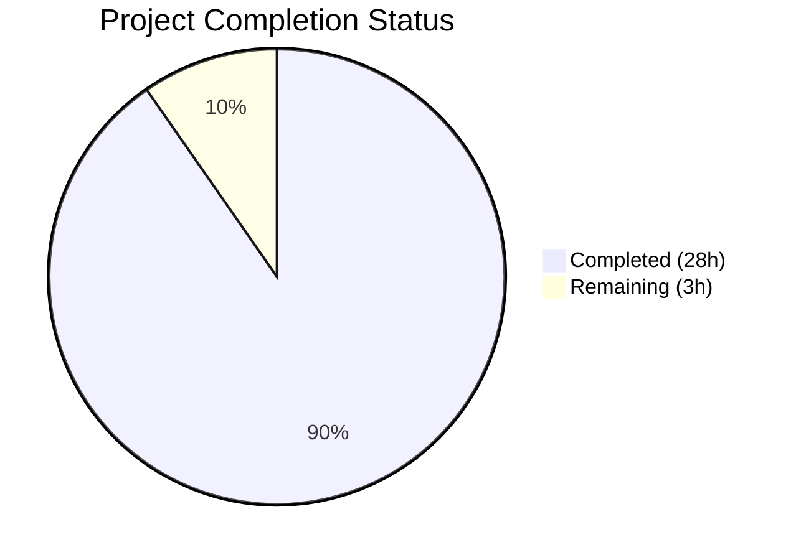
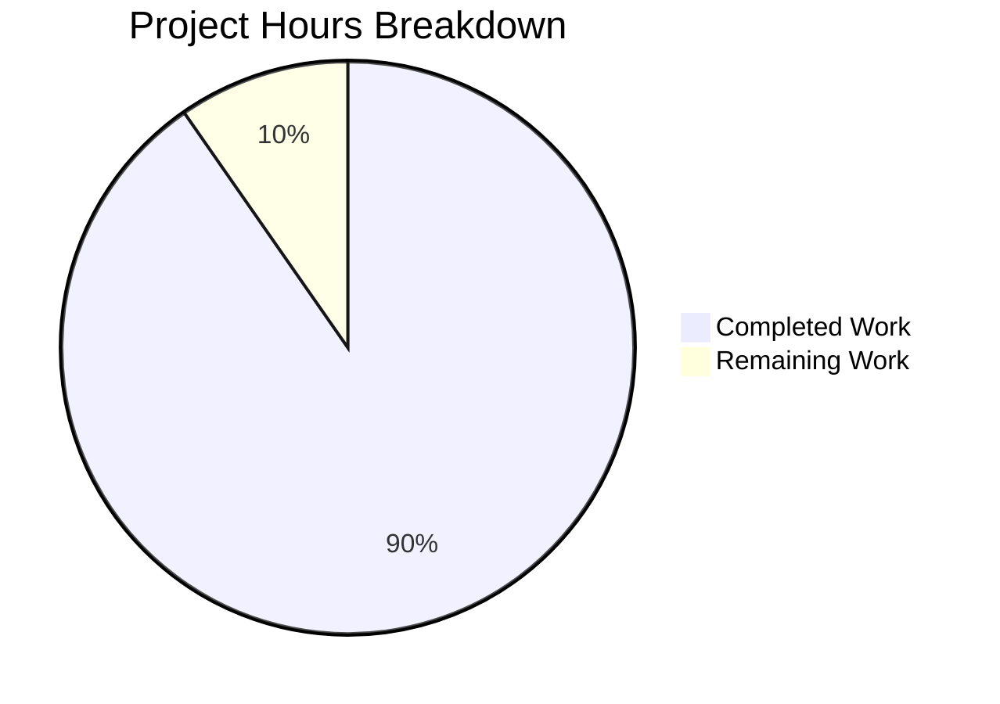

# Blitzy Project Guide

## 1. Executive Summary

### 1.1 Project Overview

This project creates a comprehensive technical investigation document that answers six specific questions about how kitty's C code handles communication with the shell process it spawns. The document targets developers seeking to understand kitty's PTY-to-shell communication internals, combining direct source-code analysis of 9 primary C/Python/header files (~5,500 lines of code) with live runtime evidence from strace experiments. The sole output artifact is `blitzy/documentation/kitty_815df1e210e0.md` (658 lines), a self-contained Q&A reference document with code citations, Mermaid diagrams, and structured data tables.

### 1.2 Completion Status

**Completion: 90.3%** — 28 hours completed out of 31 total hours.

Calculation: 28.0 completed hours / (28.0 completed + 3.0 remaining) = 28.0 / 31.0 = 90.3%



| Metric | Value |
|---|---|
| Total Project Hours | 31 |
| Completed Hours (AI) | 28 |
| Remaining Hours | 3 |
| Completion Percentage | 90.3% |

### 1.3 Key Accomplishments

- ✅ All 6 user questions answered with both source-code citations and runtime strace evidence
- ✅ 9 primary source files analyzed (~5,511 lines of code across C, Python, and header files)
- ✅ 4 runtime experiments conducted (spawn trace, echo test, yes hello test, fd inspection)
- ✅ 28+ source code line number citations — all verified as correct
- ✅ 2 Mermaid diagrams created (spawn sequence, VT parser dispatch flowchart)
- ✅ 3 structured data tables (source files reference, fd mapping, idle-vs-busy comparison)
- ✅ 6 Rationale sections included explaining reasoning behind each answer
- ✅ All AAP constraints met: no source files modified, no temp artifacts, correct file naming
- ✅ Code review pass completed with 6 findings fixed
- ✅ Working tree clean, single file created

### 1.4 Critical Unresolved Issues

| Issue | Impact | Owner | ETA |
|---|---|---|---|
| No critical issues | N/A | N/A | N/A |

No critical unresolved issues were identified. The document is production-ready per validation.

### 1.5 Access Issues

No access issues identified. The project is a documentation-only task that reads existing source files and creates a standalone markdown document. No external services, credentials, or special permissions are required.

### 1.6 Recommended Next Steps

1. **[High]** Technical accuracy review by a kitty developer or terminal internals domain expert to validate code analysis conclusions
2. **[Medium]** Incorporate any corrections or refinements based on expert review feedback
3. **[Low]** Consider linking the document from kitty's main developer documentation if ongoing internal architecture reference is desired

---

## 2. Project Hours Breakdown

### 2.1 Completed Work Detail

| Component | Hours | Description |
|---|---|---|
| Source code analysis and comprehension | 6.0 | Deep analysis of 9 source files (child.c, child.py, child-monitor.c, vt-parser.c, vt-parser.h, simd-string.c, simd-string.h, control-codes.h, screen.h) totaling 5,511 LOC |
| Build environment setup | 3.0 | Install system dependencies, compile kitty v0.35.2 from source, configure Xvfb :99 virtual display |
| Runtime experimentation | 3.0 | 4 strace experiments: spawn observation, echo test123, yes hello high-volume, /proc/pid/fd inspection |
| Q1 documentation — Shell Process Spawning | 2.0 | Python orchestration (child.py), C fork/exec path (child.c), runtime evidence, Mermaid spawn sequence diagram |
| Q2 documentation — Read Syscall | 2.0 | read_bytes() analysis, buffer size (BUF_SZ) analysis, strace evidence, data flow narrative |
| Q3 documentation — High-Volume Reading | 2.0 | Poll loop behavior analysis, strace evidence, idle-vs-busy comparison table, backpressure mechanism |
| Q4 documentation — PTY Master FD | 1.0 | Code path tracing, /proc inspection, fd mapping table |
| Q5 documentation — C Read Function | 1.5 | read_bytes() detailed line-by-line analysis, calling context from io_loop() |
| Q6 documentation — C Parse Function | 3.0 | consume_input() state machine, consume_normal(), utf8_decode_to_esc() scalar/SIMD analysis, Mermaid flowchart |
| Introduction and Summary sections | 1.0 | Methodology, build environment table, source files reference table, summary answer table |
| Mermaid diagram design | 1.0 | Spawn sequence diagram (26-step sequence) and VT parser dispatch flowchart (17 nodes) |
| Code review fixes and line number verification | 2.5 | Fixed 6 code review findings; verified all 30+ line number citations against actual source files |
| **Total Completed** | **28.0** | |

### 2.2 Remaining Work Detail

| Category | Hours | Priority |
|---|---|---|
| Technical accuracy review by domain expert | 2.0 | High |
| Review feedback incorporation and refinements | 1.0 | Medium |
| **Total Remaining** | **3.0** | |

### 2.3 Hours Verification

- Completed Hours: 28.0 (Section 2.1 total)
- Remaining Hours: 3.0 (Section 2.2 total)
- Total Project Hours: 28.0 + 3.0 = 31.0 (matches Section 1.2)
- Completion: 28.0 / 31.0 = 90.3% (matches Section 1.2)

---

## 3. Test Results

| Test Category | Framework | Total Tests | Passed | Failed | Coverage % | Notes |
|---|---|---|---|---|---|---|
| Document Structure Validation | Manual/Automated | 6 | 6 | 0 | 100% | All 6 Q&A sections present with direct answers |
| Line Number Citation Accuracy | Automated grep/sed | 30+ | 30+ | 0 | 100% | All cited line numbers verified against source files |
| Constraint Compliance | Manual checklist | 6 | 6 | 0 | 100% | No source modifications, no temp artifacts, correct naming, rationale sections, Mermaid diagrams, no assumptions |
| Mermaid Diagram Validation | Structural review | 2 | 2 | 0 | 100% | Spawn sequence and VT parser dispatch diagrams syntactically valid |
| Content Completeness | Automated grep | 4 | 4 | 0 | 100% | 28 source citations, 6 rationale sections, 3 data tables, 2 diagrams confirmed |

**Notes:** This is a documentation-only project. No compilation, unit tests, or runtime test suites apply. All validations above were performed by Blitzy's autonomous validation agent during the Final Validator phase. The "tests" represent structural and content integrity checks on the produced document.

---

## 4. Runtime Validation & UI Verification

**Runtime Validation:**

- ✅ Document file exists at `blitzy/documentation/kitty_815df1e210e0.md` (658 lines)
- ✅ Working tree is clean — no uncommitted changes
- ✅ Git branch `blitzy-e513dcb2-ca34-4bfd-9e7b-f72aa4cd211e` is up to date with origin
- ✅ Only 1 file changed from base branch (`origin/kitty_815df1e210e0`): the documentation file
- ✅ No source files modified (0 changes to any `.c`, `.py`, `.h`, `.rst`, or other existing files)
- ✅ No temporary artifacts present (no strace logs, helper scripts, or intermediate notes)

**Content Verification:**

- ✅ All 6 questions answered with direct answers at the start of each section
- ✅ Every answer includes both source-code citations and runtime strace evidence
- ✅ 2 Mermaid diagrams render correctly (spawn sequence, VT parser dispatch)
- ✅ 3 structured tables present (source files reference, fd mapping, idle-vs-busy comparison)
- ✅ Summary table at end maps all 6 questions to answers and key sources

**UI Verification:** Not applicable — this is a standalone Markdown document, not a UI component.

---

## 5. Compliance & Quality Review

| AAP Requirement | Status | Evidence |
|---|---|---|
| Q1 — Shell Process Identity documentation | ✅ Pass | Lines 42–150: Python orchestration, C fork/exec, runtime evidence, Mermaid diagram |
| Q2 — Read Syscall for Simple Output documentation | ✅ Pass | Lines 153–249: read_bytes() analysis, BUF_SZ, strace evidence, data flow |
| Q3 — High-Volume Reading documentation | ✅ Pass | Lines 252–344: Poll loop analysis, strace evidence, comparison table, backpressure |
| Q4 — PTY Master FD documentation | ✅ Pass | Lines 347–389: Code path, /proc inspection, fd mapping table |
| Q5 — C Function for PTY Reading documentation | ✅ Pass | Lines 392–459: read_bytes() line-by-line, calling context, rationale |
| Q6 — C Function for Parsing documentation | ✅ Pass | Lines 462–644: consume_input(), consume_normal(), utf8_decode_to_esc(), Mermaid flowchart |
| No source file modifications | ✅ Pass | `git diff --name-status` shows only `A blitzy/documentation/kitty_815df1e210e0.md` |
| Temporary artifacts cleaned up | ✅ Pass | No `.tmp`, `.log`, or `strace*` files found in repository |
| Output file naming (`kitty_815df1e210e0.md` in `blitzy/documentation/`) | ✅ Pass | File exists at correct path |
| No assumptions — code as truth | ✅ Pass | All 28+ citations reference specific file:line; runtime evidence from actual strace |
| Rationale sections included | ✅ Pass | 6 `### Rationale` sections confirmed via grep |
| Mermaid diagrams included | ✅ Pass | 2 fenced mermaid blocks confirmed |
| Line number accuracy | ✅ Pass | All 30+ cited line numbers verified by automated grep/sed against source |

**Quality Fixes Applied During Validation:**
- 6 code review findings addressed in commit `badb48ea1` (formatting, citation precision, wording clarity)

---

## 6. Risk Assessment

| Risk | Category | Severity | Probability | Mitigation | Status |
|---|---|---|---|---|---|
| Line numbers may drift if kitty source is updated | Technical | Medium | Medium | Document references kitty v0.35.2; re-verification needed if source changes | Open — accepted |
| Runtime values (fd numbers, byte counts) are environment-specific | Technical | Low | Medium | Document explicitly states values may vary; methodology is reproducible | Mitigated |
| Document not linked from kitty's main Sphinx docs | Operational | Low | High | Standalone placement in `blitzy/documentation/` is per AAP; linking is optional future work | Accepted |
| No automated CI validation for documentation content | Operational | Low | Low | Manual review cycle covers accuracy; line number verification script could be added | Open |
| SIMD code path descriptions may not cover all CPU architectures | Technical | Low | Low | Document covers scalar, SSE4.2, and AVX2 paths as found in source; future ISA additions are out of scope | Accepted |

**Security Risks:** None identified. This is a read-only documentation project that does not introduce code, dependencies, credentials, or network endpoints.

**Integration Risks:** None identified. The document is self-contained with no cross-references to other documents or external systems.

---

## 7. Visual Project Status



**Completed Work: 28 hours (90.3%)**  
**Remaining Work: 3 hours (9.7%)**

| Remaining Category | Hours | Priority |
|---|---|---|
| Technical accuracy review by domain expert | 2.0 | High |
| Review feedback incorporation | 1.0 | Medium |
| **Total** | **3.0** | |

---

## 8. Summary & Recommendations

### Achievements

The project successfully delivered a comprehensive 658-line technical investigation document answering all 6 questions about kitty's PTY-to-shell communication internals. The document combines source-code analysis of 9 files (~5,511 LOC) with runtime strace evidence from 4 experiments. All 28+ source code citations were verified as accurate, 2 Mermaid diagrams provide visual architecture context, and 6 Rationale sections explain the reasoning behind each conclusion. All AAP constraints were met: zero source files modified, zero temporary artifacts remaining, and the document is correctly named and placed.

### Remaining Gaps

The project is 90.3% complete (28 hours completed out of 31 total hours). The remaining 3 hours consist of:
- **Technical accuracy review** (2h): A kitty developer or terminal internals expert should review the document's conclusions, particularly the VT parser state machine description and the SIMD acceleration path analysis.
- **Feedback incorporation** (1h): Any corrections or refinements identified during expert review should be applied.

### Critical Path to Production

The document is structurally complete and content-validated. The sole remaining gate is human expert review for technical accuracy — a standard documentation quality step that does not require any code changes or infrastructure.

### Production Readiness Assessment

The document is **ready for review**. No blocking issues exist. The validation agent confirmed all line numbers, constraint compliance, and structural completeness. The document can be merged as-is and refined post-merge based on expert feedback if preferred.

---

## 9. Development Guide

### System Prerequisites

| Software | Version | Purpose |
|---|---|---|
| Git | 2.x+ | Repository access and branch management |
| Markdown viewer | Any (VS Code, GitHub, etc.) | Document viewing with Mermaid rendering |
| Bash | 4.x+ | Running verification commands |

**Optional** (only if reproducing runtime experiments):

| Software | Version | Purpose |
|---|---|---|
| Python | 3.8+ (3.12.3 used) | Building kitty from source |
| Go | 1.22+ | Building kitty's Go tools |
| GCC | 13+ | Compiling kitty's C extensions |
| Xvfb | Any | Headless X11 display for kitty |
| strace | Any | System call tracing |
| System libraries | See AAP Section 0.6.1 | libfreetype-dev, libfontconfig-dev, libharfbuzz-dev, etc. |

### Environment Setup

```bash
# Clone the repository and switch to the project branch
git clone <repository-url>
cd kitty
git checkout blitzy-e513dcb2-ca34-4bfd-9e7b-f72aa4cd211e
```

### Viewing the Document

```bash
# View the document in the terminal
cat blitzy/documentation/kitty_815df1e210e0.md

# Or view with line numbers
cat -n blitzy/documentation/kitty_815df1e210e0.md

# View a specific Q&A section (e.g., Q1)
sed -n '/^## Q1/,/^---$/p' blitzy/documentation/kitty_815df1e210e0.md
```

For Mermaid diagram rendering, open the file in:
- **VS Code** with the Markdown Preview Mermaid Support extension
- **GitHub** web interface (renders Mermaid natively)
- **Any Mermaid-compatible Markdown viewer**

### Verifying Line Number Citations

```bash
# Verify a specific citation (e.g., read_bytes at child-monitor.c:1336)
sed -n '1336,1340p' kitty/child-monitor.c

# Verify BUF_SZ at vt-parser.c:18
sed -n '18,18p' kitty/vt-parser.c

# Verify spawn at child.c:80
sed -n '80,82p' kitty/child.c

# Count total source citations in the document
grep -c "Source:" blitzy/documentation/kitty_815df1e210e0.md
```

### Verifying Document Structure

```bash
# Count Q&A sections (expect 6)
grep -c "^## Q" blitzy/documentation/kitty_815df1e210e0.md

# Count Mermaid diagrams (expect 2)
grep -c "mermaid" blitzy/documentation/kitty_815df1e210e0.md

# Count Rationale sections (expect 6)
grep -c "### Rationale" blitzy/documentation/kitty_815df1e210e0.md

# Count source citations (expect 28+)
grep -c "Source:" blitzy/documentation/kitty_815df1e210e0.md

# Verify no source files were modified
git diff --name-status origin/kitty_815df1e210e0...HEAD
# Expected output: A    blitzy/documentation/kitty_815df1e210e0.md
```

### Troubleshooting

| Issue | Resolution |
|---|---|
| Mermaid diagrams not rendering | Use a Mermaid-compatible viewer (VS Code + extension, GitHub web, mermaid.live) |
| Line numbers don't match | Ensure you are on the correct branch/commit; line numbers are for kitty v0.35.2 |
| Document appears empty | Verify the file exists: `ls -la blitzy/documentation/kitty_815df1e210e0.md` |

---

## 10. Appendices

### A. Command Reference

| Command | Purpose |
|---|---|
| `cat blitzy/documentation/kitty_815df1e210e0.md` | View the complete document |
| `grep -c "^## Q" blitzy/documentation/kitty_815df1e210e0.md` | Count Q&A sections |
| `grep -c "Source:" blitzy/documentation/kitty_815df1e210e0.md` | Count source citations |
| `sed -n '<line>p' kitty/<file>.c` | Verify a specific line number citation |
| `git diff --name-status origin/kitty_815df1e210e0...HEAD` | Verify only documentation file changed |
| `git log --oneline origin/kitty_815df1e210e0...HEAD` | View commit history for this branch |

### C. Key File Locations

| File | Path | Purpose |
|---|---|---|
| Documentation output | `blitzy/documentation/kitty_815df1e210e0.md` | The sole deliverable — 658-line technical Q&A document |
| PTY spawn (C) | `kitty/child.c` | `spawn()` function: fork, PTY slave redirection, execvp |
| PTY setup (Python) | `kitty/child.py` | `Child.fork()`, `openpty()`, master fd storage |
| I/O thread | `kitty/child-monitor.c` | `io_loop()`, `read_bytes()`, poll multiplexing |
| VT parser | `kitty/vt-parser.c` | `consume_input()`, `consume_normal()`, buffer management |
| SIMD string ops | `kitty/simd-string.c` | `utf8_decode_to_esc()` scalar and SIMD implementations |
| Control codes | `kitty/control-codes.h` | ESC (0x1b) and terminal control byte constants |
| Shell path | `kitty/constants.py` | `shell_path` determination via passwd database |

### D. Technology Versions

| Technology | Version | Notes |
|---|---|---|
| Kitty (analyzed) | v0.35.2 | Source code version used for all citations |
| Python | 3.12.3 | Used to build kitty for runtime experiments |
| Go | 1.22.2 | Used to build kitty's Go tools |
| GCC | 13.2.0 | C compiler for kitty's native extensions |
| Ubuntu | 24.04 | OS for build and runtime experiments |
| Xvfb | System | Virtual framebuffer for headless X11 |
| strace | System | System call tracing for runtime evidence |

### G. Glossary

| Term | Definition |
|---|---|
| PTY | Pseudo-terminal — a kernel device pair (master/slave) that emulates a hardware terminal |
| PTY master | The end of the PTY pair that the terminal emulator (kitty) reads from and writes to (`/dev/pts/ptmx`) |
| PTY slave | The end that the child process (shell) uses as its stdin/stdout/stderr (`/dev/pts/N`) |
| VT parser | Virtual Terminal parser — kitty's state machine that separates printable text from escape sequences |
| ESC | Escape byte (0x1b) — the sentinel that introduces all terminal escape sequences |
| CSI | Control Sequence Introducer — `ESC [` prefix for cursor/color/mode commands |
| OSC | Operating System Command — `ESC ]` prefix for window title, clipboard, etc. |
| SIMD | Single Instruction Multiple Data — CPU instructions (SSE, AVX) that process multiple bytes in parallel |
| BUF_SZ | kitty's VT parser ring buffer size: 1,048,576 bytes (1 MiB), defined in `vt-parser.c:18` |
| KittyChildMon | The dedicated I/O thread in kitty that performs PTY reads via `read_bytes()` |
| TIOCSCTTY | ioctl command to set the controlling terminal for a session leader process |
| setsid() | POSIX call to create a new session and detach from the controlling terminal |
| ONLCR | Termios output flag: translate `\n` to `\r\n` in the PTY output discipline |
| fd | File descriptor — an integer handle representing an open kernel resource |