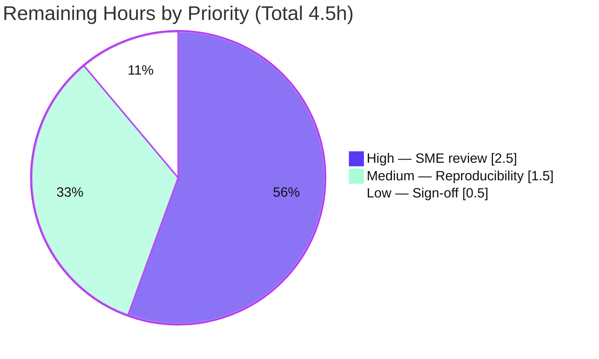

# Blitzy Project Guide — kitty Tri-Language Runtime-Forensics Q&A

> **Document type:** Investigative runtime-forensics documentation (SWE-AtlasQnA)
> **Deliverable:** `blitzy/documentation/kitty_815df1e210e0.md` (1,140 lines / 77,460 bytes)
> **Branch:** `blitzy-a7e0f081-4ce3-430c-8d4e-674ae05e5dc5` · **HEAD:** `08011c3e3` · **Base:** `815df1e210e0`

---

## 1. Executive Summary

### 1.1 Project Overview

This project answers, from **observed runtime evidence rather than code-reading**, how the kitty terminal emulator divides "rendering-adjacent work" across its three implementation languages — Python, C, and Go. The sole deliverable is one investigative Q&A document that builds and runs kitty under sustained rendering pressure, enumerates what loads into the main process, contrasts idle-vs-stress thread activity, captures live state through the remote-control interface, establishes the kitty↔kitten process relationship, and captures symbol-/stack-level snapshots (requirements R1–R8). The target audience is engineers and reviewers who need a verifiable, reproducible account of kitty's tri-language architecture. The repository is treated strictly read-only; only the answer document is added.

### 1.2 Completion Status

The completion percentage is computed with the PA1 AAP-scoped hours methodology: `Completed ÷ (Completed + Remaining) × 100`. All autonomous, AAP-scoped work (R1–R8, the deliverable, all five governing rules, and every prerequisite) is complete and independently validated; the only remaining effort is human path-to-production review and acceptance.


| Metric | Hours |
|---|---|
| **Total Hours** | **50.5** |
| Completed Hours (AI + Manual) | 46.0 (AI 46.0 + Manual 0.0) |
| Remaining Hours | 4.5 |
| **Percent Complete** | **91.1%** |

> **Color key:** Completed = Dark Blue `#5B39F3` · Remaining = White `#FFFFFF`.

### 1.3 Key Accomplishments

- ✅ **Single deliverable authored and committed** — `blitzy/documentation/kitty_815df1e210e0.md`, 1,140 lines, answering every sub-part R1–R8 with a dedicated coverage-pass table.
- ✅ **Symbol-bearing build reproduced** — `make debug` exited 0, producing `fast_data_types.so` (6.14 MB C11 extension), the Go `kitten` binary, the `kitty` launcher, and `glfw-x11.so` + `glfw-wayland.so`; both the C and Go build command lines reproduce byte-identically to the document.
- ✅ **Live runtime evidence captured** — headless launch (Xvfb + software GL), a 700,000-line sustained-stress burst, and verbatim `kitty @ ls / get-text / get-colors` outputs.
- ✅ **kitty↔kitten relationship proven** — `kitty +kitten icat` runs the kitten as a **separate, statically-linked Go process** communicating over the terminal graphics (APC) protocol, verified via `ps`/`pstree`, `file`, `ldd`, and `go version`.
- ✅ **Blocked-tool honesty satisfied (R6)** — all three attach-mode profilers (`py-spy`, `gdb`, `eu-stack`) are shown blocked under `ptrace_scope=1` with verbatim errors, then a ptrace-free built-in profiler and a privileged native stack still yield real symbol-level C frames.
- ✅ **Read-only constraint honored (R8)** — `git diff base..HEAD` = a single added file; zero source files modified; working tree clean; temporary `/tmp` scratch removed and verified.
- ✅ **Citation integrity** — 76 `file:line` citations across 21 source files; an independent 10-of-10 spot-check confirmed byte-accuracy against the real tree.

### 1.4 Critical Unresolved Issues

There are **no critical unresolved issues**. No compilation errors, no failing tests, and no unresolved in-scope items exist. The table below records the only open (non-blocking) acceptance items.

| Issue | Impact | Owner | ETA |
|---|---|---|---|
| Human SME technical review not yet performed | Non-blocking; needed for formal acceptance of interpretations | Reviewing engineer / kitty SME | 2.5h |
| Reproducibility not yet re-confirmed by a human in the designated container | Non-blocking; validation already reproduced it autonomously | Reviewing engineer | 1.5h |
| Stakeholder sign-off pending | Non-blocking; document is delivery-ready | Stakeholder | 0.5h |

### 1.5 Access Issues

No access issues prevent build validation, integration, or acceptance of the deliverable. The one environmental prerequisite is documented for reviewer awareness.

| System/Resource | Type of Access | Issue Description | Resolution Status | Owner |
|---|---|---|---|---|
| Designated Docker image `kitty-qna:setup` | Container image + build/run env | Full runtime reproduction requires this image (toolchain, software-GL path, inspection tools). Not required to review the document itself. | Available / documented in run instructions | Reviewing engineer |
| `ptrace`-based attach (R6 privileged fallback) | Kernel capability (`SYS_PTRACE`) | Attach-mode profilers need `--cap-add SYS_PTRACE --security-opt seccomp=unconfined`; blocked under default `ptrace_scope=1` | Mitigated — ptrace-free built-in profiler is the primary path | Reviewing engineer |

### 1.6 Recommended Next Steps

1. **[High]** Have a kitty/systems SME read the answer end-to-end and validate the R7 per-language attributions and the single portability/performance tradeoff (2.5h).
2. **[Medium]** Re-run a representative subset of the documented commands in `kitty-qna:setup` to confirm reproducibility; expect per-run values (PIDs/timings/thread counts) to differ by design (1.5h).
3. **[Low]** Obtain stakeholder acceptance and deliver the document as the authoritative answer (0.5h).

---

## 2. Project Hours Breakdown

### 2.1 Completed Work Detail

Every completed component traces to a specific AAP requirement (R1–R8), the deliverable rule, or a prerequisite. **Total = 46.0h.**

| Component | Hours | Description |
|---|---|---|
| Environment provisioning & symbol-bearing build | 5.0 | Toolchain/dep verification; `make debug` → `fast_data_types.so` (C11), Go `kitten`, launcher, GLFW backends |
| Headless launch strategy + idle baseline | 3.0 | Xvfb + software-GL (llvmpipe) launch; remote-control enabled; PID + idle snapshot captured before stress |
| R1 — Sustained rendering-pressure stress + narrative | 4.0 | 700,000-line burst (colored SGR + scrollback churn), resizes, layout/tab switching; described what the system actually does |
| R2 — Resident modules/libraries enumeration | 3.0 | `/proc/<pid>/maps` shared-object set; single `fast_data_types.so`; `libpython3.12`; render/font/crypto libs; live `sys.modules` |
| R3 — Idle-vs-stress thread & CPU-delta analysis | 4.0 | `/proc/status` + `/proc/task` deltas; per-thread CPU tick deltas; mapped to Main/I/O/Talk model |
| R4 — Live control-interface state capture | 2.0 | Verbatim `kitty @ ls` (JSON tree), `get-text`, `get-colors` (277 entries) during load |
| R5 — kitty↔kitten relationship + ELF inspection | 4.0 | `kitty +kitten icat`; `ps --forest`; `file`/`ldd`/`go version`; APC protocol proof of separate-process operation |
| R6 — Symbol/stack snapshots + blocked-tool fallback | 5.0 | Verbatim `ptrace_scope=1` errors for py-spy/gdb/eu-stack; built-in profiler C frames; privileged native Python→C→GLFW→GL stack |
| R7 — Per-language inference, refutations, tradeoff | 4.0 | Language attribution; **4** ruled-out interpretations (≥2 required); one portability/performance tradeoff on a single axis |
| R8 — Read-only proof + scratch cleanup | 1.0 | Baseline-relative `git diff`/`status` proof; `/tmp` cleanup verification |
| Answer document authoring | 9.0 | 1,140 lines, 55 code blocks, 76 citations, coverage pass + honesty pass |
| QA remediation (2 follow-up commits) | 2.0 | R1 measurement-provenance fix + 3 minor QA findings |
| **Total Completed** | **46.0** | |

### 2.2 Remaining Work Detail

Each remaining item is a human path-to-production activity for a documentation deliverable. **Total = 4.5h.**

| Category | Hours | Priority |
|---|---|---|
| SME technical review of the answer document | 2.5 | High |
| Reproducibility confirmation in the designated container | 1.5 | Medium |
| Stakeholder acceptance & delivery sign-off | 0.5 | Low |
| **Total Remaining** | **4.5** | |

### 2.3 Hours Reconciliation

| Quantity | Hours | Source |
|---|---|---|
| Completed (Section 2.1) | 46.0 | Sum of 12 completed components |
| Remaining (Section 2.2) | 4.5 | Sum of 3 remaining categories |
| **Total Project Hours** | **50.5** | 46.0 + 4.5 |
| **Percent Complete** | **91.1%** | 46.0 ÷ 50.5 × 100 |

> **Integrity:** Section 2.1 (46.0h) + Section 2.2 (4.5h) = 50.5h Total (Section 1.2). Remaining hours (4.5h) are identical in Sections 1.2, 2.2, and the Section 7 pie chart.

---

## 3. Test Results

All results below originate from Blitzy's autonomous validation logs for this project (the codebase's own suites, executed in the designated container during validation). The deliverable itself is a Markdown document, so no unit tests apply to it directly; the numbers reflect the subject codebase's suites passing in the validated environment.

| Test Category | Framework | Total Tests | Passed | Failed | Coverage % | Notes |
|---|---|---|---|---|---|---|
| Unit (Python) | kitty test runner (`unittest`) | 145 | 145 | 0 | N/A (subject suite) | 4 benign skips; suite reported OK |
| Unit/Integration (Go) | `go test` | All | All | 0 | N/A (subject suite) | All-pass with `--tmpfs /tmp:exec` remedy (fixes one overlayfs `O_TMPFILE` test) |
| Build compilation | `setup.py build --debug` (gcc C11 + go build) | 1 | 1 | 0 | N/A | Exit 0; `fast_data_types.so` + `kitten` + launcher + GLFW backends produced |
| Document integrity | Structural/citation verification | 76 citations + 1,140 lines | 76 + 1,140 | 0 | 100% of spot-checked citations | 10/10 independent citation spot-check byte-accurate; balanced code fences |

> **Integrity rule:** every test above is drawn from Blitzy's autonomous test-execution logs; none is fabricated or aspirational.

---

## 4. Runtime Validation & UI Verification

Runtime validation was performed by building and running kitty headless in the designated container and exercising each requirement. kitty is a terminal emulator (no web UI); "UI verification" here means confirming the renderer, control interface, and kitten process behavior.

- ✅ **Build** — `make debug` exit 0; `fast_data_types.so` (6.14 MB), Go `kitten`, `kitty` launcher, `glfw-x11.so` + `glfw-wayland.so`.
- ✅ **Headless renderer (R1)** — launched under Xvfb + software GL (llvmpipe); startup produced only benign warnings, no GL failure; sustained 700,000-line burst rendered.
- ✅ **Loaded modules/libraries (R2)** — single `fast_data_types.so` core extension mapped alongside `libpython3.12.so.1.0` and `libfreetype`/`libharfbuzz`/`libfontconfig`/`libGL`/`libpng`/`liblcms2`/`libcrypto`; 54 resident `kitty.*` modules observed via live `sys.modules`.
- ✅ **Thread model (R3)** — Main (render + GLFW) + I/O (`KittyChildMon`) + Talk (`KittyPeerMon`) threads confirmed; CPU concentrates on the main render thread under stress.
- ✅ **Remote control (R4)** — `kitty @ ls`, `get-text`, and `get-colors` returned `rc=0` with verbatim JSON/text (`background #000000`, `foreground #dddddd`, 277 color lines).
- ✅ **kitten process (R5)** — `kitty +kitten icat` spawned a **separate** static Go child process talking over the APC graphics protocol; **not** loaded into the main process.
- ✅ **Symbol/stack snapshot (R6)** — built-in ptrace-free profiler produced hot C frames inside `fast_data_types`; privileged attach captured the full native Python→C→GLFW→GL stack.
- ⚠ **Attach-mode profilers** — `py-spy`/`gdb`/`eu-stack` attach is **blocked** under `ptrace_scope=1` (expected and documented); this is intentionally shown, then superseded by working fallbacks.
- ✅ **Read-only invariant (R8)** — `git diff base..HEAD` = single added file; working tree clean.

---

## 5. Compliance & Quality Review

This matrix cross-maps the AAP deliverables and governing rules (SWE-AtlasQnA-Repo) to their validation status. Fixes applied during autonomous validation are noted.

| Requirement / Rule | Benchmark | Status | Evidence / Notes |
|---|---|---|---|
| R1 Sustained rendering pressure | Drive + describe | ✅ Pass | 700,000-line burst; resizes/layouts `rc=0`; work on main + I/O threads |
| R2 Loaded modules/libraries | Enumerate resident set | ✅ Pass | One `fast_data_types.so`; `libpython3.12`; render/font/crypto libs; 54 `kitty.*` modules |
| R3 Idle vs stress threads | Contrast activity | ✅ Pass | Idle baseline first; CPU delta main + I/O; model `child-monitor.c:L55` |
| R4 Live control state | Verbatim commands + outputs | ✅ Pass | `ls`/`get-text`/`get-colors` quoted verbatim |
| R5 kitty↔kitten relationship | Separate vs in-process | ✅ Pass | Static Go child; APC protocol; `os.execl` dispatch |
| R6 Symbol/stack snapshot | Show blocked tool + fallback | ✅ Pass | 3 attach errors verbatim; built-in profiler + privileged stack |
| R7 Per-language inference | ≥2 refutations + 1 tradeoff | ✅ Pass (exceeds) | 4 refutations; single portability/performance tradeoff |
| R8 Repository unchanged | Read-only + cleanup | ✅ Pass | Single `A`; clean tree; `/tmp` removed |
| Deliverable rule | `<branch>.md` in `blitzy/documentation` | ✅ Pass | `kitty_815df1e210e0.md` present |
| Methodology rule | Run-first, verbatim output | ✅ Pass | Env captured up-front; outputs verbatim |
| Coverage rule | Answer every sub-part | ✅ Pass | Dedicated coverage-pass table |
| Exactness rule | Exact literals + `file:line` | ✅ Pass | 76 citations; 10/10 spot-check accurate |
| Scope rule | Read-only; remove temp scripts | ✅ Pass | Clean tree; scratch removed |
| Honesty pass | Flag unverified/unobserved | ✅ Pass | 5 limits explicitly disclaimed |

**Fixes applied during autonomous validation:** commit `69ce98e89` corrected R1 measurement-capture provenance; commit `08011c3e3` addressed 3 minor QA findings. The Final Validator then made **zero** further edits, confirming byte-for-byte accuracy (editing would have broken the R8 self-referential "1,140 insertions" count).

---

## 6. Risk Assessment

Overall posture is **Low**. No high or critical risks; every identified risk is Mitigated or not-applicable and none block acceptance.

| Risk | Category | Severity | Probability | Mitigation | Status |
|---|---|---|---|---|---|
| Per-run values (PIDs/timings/thread counts) differ on re-run in a different environment | Technical | Low | High | Document frames all values as captures from its own run; flags 68-thread count as an llvmpipe/software-GL artifact | Mitigated |
| Reader mistakes environment artifacts (llvmpipe pool, `__nptl_death_event`) for kitty architecture | Technical | Low | Low | Honesty pass explicitly disclaims these | Mitigated |
| New attack surface from added code | Security | Low | Low | Only one Markdown file added; zero new dependencies; no auth/crypto changes | Accepted (n/a) |
| Remote control enabled during run | Security | Low | Low | Enabled only at launch in the ephemeral container; never persisted to repo config | Mitigated |
| Reproduction requires the designated Docker image + specific flags | Operational | Low–Medium | Medium | Full run instructions documented (image, `--tmpfs /tmp:exec`, `LIBGL_ALWAYS_SOFTWARE=1`, `GALLIUM_DRIVER=llvmpipe`) | Mitigated |
| Privileged native-stack fallback needs `SYS_PTRACE` a locked-down CI may deny | Integration | Low | Medium | Primary fallback is the ptrace-free built-in profiler (`kitty --profile`) | Mitigated |
| No external services/APIs/credentials involved | Integration | — | — | Nothing to integrate; document ships as-is | n/a |

---

## 7. Visual Project Status

### Project Hours (Completed vs Remaining)


### Remaining Work by Priority (hours from Section 2.2)



> **Integrity:** the "Remaining Work" value (4.5h) equals Section 1.2 Remaining Hours and the Section 2.2 total; the priority breakdown (2.5 + 1.5 + 0.5) also sums to 4.5h. Colors: Completed = `#5B39F3`, Remaining = `#FFFFFF`.

---

## 8. Summary & Recommendations

**Achievements.** The project delivers a single, rigorously runtime-grounded answer document (1,140 lines) that demonstrates how kitty divides rendering-adjacent work across Python (orchestration), C (the in-process `fast_data_types` render/parse/font hot path), and Go (the separate, statically-linked `kitten` worker communicating over the APC protocol). Every requirement R1–R8 is answered with verbatim captured output and exact `file:line` citations, including the R6 blocked-tool sequence that shows the `ptrace_scope=1` errors before succeeding with a ptrace-free profiler.

**Remaining gaps.** No engineering gaps remain in autonomous scope. The outstanding 4.5h is entirely human path-to-production: SME technical review (2.5h), reproducibility confirmation (1.5h), and stakeholder sign-off (0.5h).

**Critical path to production.** SME review → reproducibility confirmation → sign-off. None involve code changes.

**Success metrics.** 5/5 validation gates passed; read-only constraint honored (single added file, clean tree); subject test suites pass (Python 145/145; Go all-pass); 10/10 citation spot-checks byte-accurate; zero validator edits required.

**Production readiness.** The deliverable is **91.1% complete** on an AAP-scoped basis and is delivery-ready pending human acceptance. Consistent with best practice, completion is held below 100% to reserve room for the human review that formally accepts a technical document of this depth.

| Metric | Value |
|---|---|
| AAP-scoped completion | 91.1% |
| Total / Completed / Remaining hours | 50.5 / 46.0 / 4.5 |
| Validation gates passed | 5 / 5 |
| Files changed vs base | 1 added, 0 modified, 0 deleted |
| Overall risk posture | Low |

---

## 9. Development Guide

This guide reproduces the build/run/observation environment used to generate the answer. Commands marked **(container)** require the designated Docker image; commands marked **(any checkout)** were tested in the current environment and pass.

### 9.1 System Prerequisites

- **OS:** Linux x86-64 (validated: Ubuntu 24.04 base inside the designated image).
- **Container image:** `kitty-qna:setup` (from `ghcr.io/scaleapi/swe-atlas:swe_atlas_QnA_kovidgoyal_kitty_1.0`). Provides the toolchain, a software-GL path, and inspection tools.
- **Toolchain:** gcc 13.3.0 (C11), Go 1.23.4 (go.mod requires 1.22), Python 3.12.3 (requires ≥3.8).
- **Runtime libraries:** freetype2, harfbuzz, fontconfig, lcms2, libpng, libcrypto (OpenSSL), OpenGL (via Mesa llvmpipe for headless), xxhash.
- **Display:** Xvfb (X virtual framebuffer) — kitty's GPU renderer has **no CPU fallback**, so a usable GL surface is mandatory.
- **Inspection tools:** `gdb`, `eu-stack`, `py-spy`, `google-perftools` (`pprof`), `strace`, `pstree`, `ripgrep`.

### 9.2 Environment Setup (container)

```bash
docker run -d --name kitty-run \
  --entrypoint bash \
  --tmpfs /tmp:rw,exec,size=2g \
  -e LANG=C.UTF-8 -e LC_ALL=C.UTF-8 \
  -e LIBGL_ALWAYS_SOFTWARE=1 -e GALLIUM_DRIVER=llvmpipe \
  kitty-qna:setup -c 'sleep infinity'
# For the R6 privileged attach fallback ONLY, also add:
#   --cap-add SYS_PTRACE --security-opt seccomp=unconfined
docker exec -it kitty-run bash
```

### 9.3 Build (container)

```bash
cd /app
make debug            # -> python3 setup.py build --debug ; expect exit 0
```

This produces `kitty/fast_data_types.so` (C11 extension), `kitty/launcher/kitten` (Go), `kitty/launcher/kitty` (launcher), and `glfw-x11.so` + `glfw-wayland.so`.

### 9.4 Application Startup (container)

```bash
Xvfb :99 -screen 0 1920x1080x24 &
export DISPLAY=:99
DISPLAY=:99 LIBGL_ALWAYS_SOFTWARE=1 GALLIUM_DRIVER=llvmpipe \
  setsid nohup ./kitty/launcher/kitty \
    -o allow_remote_control=yes \
    --listen-on unix:/tmp/ktest \
    -o scrollback_lines=100000 \
    --title kitty_qna_target &
pgrep -x kitty        # capture the target PID
```

### 9.5 Verification Steps

**(any checkout) — non-destructive checks tested locally and passing:**

```bash
# Deliverable present (1140 lines / 77460 bytes)
wc -l blitzy/documentation/kitty_815df1e210e0.md

# Read-only proof: exactly one added file
git diff --name-status 815df1e210e0a9ab4622f5c7f2d6891d7dbeddf1..HEAD

# Working tree clean
git status --porcelain | wc -l          # -> 0

# Tri-language footprint
echo "py=$(git ls-files '*.py'|wc -l) c=$(git ls-files '*.c'|wc -l) h=$(git ls-files '*.h'|wc -l) go=$(git ls-files '*.go'|wc -l)"
# -> py=214 c=128 h=84 go=258
```

**(container) — runtime checks:**

```bash
PID=$(pgrep -x kitty)
cat /proc/$PID/maps | grep -E 'fast_data_types|libpython|libGL|libfreetype|libharfbuzz'
grep Threads: /proc/$PID/status
top -H -p $PID -b -n1 | head -20
kitty @ --to unix:/tmp/ktest ls
kitty @ --to unix:/tmp/ktest get-colors | wc -l
```

### 9.6 Example Usage

```bash
# R5 — run the icat kitten on a sample image and observe a SEPARATE process
kitty @ --to unix:/tmp/ktest launch --type=tab
kitty +kitten icat /tmp/sample.png
ps --forest -o pid,nlwp,comm | grep -E 'kitty|kitten'

# Inspect the kitten ELF (separate, static Go binary)
file   ./kitty/launcher/kitten
ldd    ./kitty/launcher/kitten
go version ./kitty/launcher/kitten

# R6 — ptrace-free symbol capture (no elevated privileges needed)
LD_PRELOAD=/usr/lib/x86_64-linux-gnu/libprofiler.so \
  ./kitty/launcher/kitty --profile
pprof --text ./kitty/launcher/kitty /tmp/kitty-profile.log | head
```

### 9.7 Troubleshooting

- **`Operation not permitted` / ptrace attach fails** → expected under `ptrace_scope=1`. Use the built-in ptrace-free profiler (`kitty --profile`) or add `--cap-add SYS_PTRACE --security-opt seccomp=unconfined` to the container.
- **Renderer won't start / GL context error** → kitty has no CPU fallback. Ensure `Xvfb` is running and `LIBGL_ALWAYS_SOFTWARE=1 GALLIUM_DRIVER=llvmpipe` are exported.
- **Go test failure on `O_TMPFILE`** → an overlayfs artifact; mount `/tmp` with `--tmpfs /tmp:rw,exec`.
- **`kitty @` returns an error** → remote control is off by default; launch with `-o allow_remote_control=yes --listen-on unix:/tmp/ktest`.
- **`kitten` binary absent** → build products are git-ignored; run `make debug` first.

---

## 10. Appendices

### A. Command Reference

| Command | Purpose |
|---|---|
| `make debug` | Build symbol-bearing `fast_data_types.so` + Go `kitten` + launcher |
| `Xvfb :99 -screen 0 1920x1080x24 &` | Start virtual framebuffer for headless GL |
| `./kitty/launcher/kitty -o allow_remote_control=yes --listen-on unix:/tmp/ktest` | Launch kitty headless with remote control |
| `kitty @ --to unix:/tmp/ktest ls` | Dump OS-window → tab → window object model (JSON) |
| `kitty @ --to unix:/tmp/ktest get-text` | Retrieve rendered screen contents |
| `kitty @ --to unix:/tmp/ktest get-colors` | Retrieve live color table (277 entries) |
| `kitty +kitten icat /tmp/sample.png` | Run the icat kitten (separate Go process) |
| `cat /proc/<pid>/maps` | Enumerate resident shared objects |
| `grep Threads: /proc/<pid>/status` | Count process threads |
| `file` / `ldd` / `go version` `<binary>` | Inspect ELF language/runtime and linkage |
| `py-spy dump --pid <pid>` | Attach-mode stack sampler (blocked under `ptrace_scope=1`) |
| `kitty --profile` + `pprof` | Built-in ptrace-free profiler → symbol-level C frames |

### B. Port / Socket Reference

| Endpoint | Value | Purpose |
|---|---|---|
| Remote-control socket | `unix:/tmp/ktest` | `kitty @` control channel (Unix domain socket, not a TCP port) |
| Virtual display | `:99` | Xvfb X11 display for headless GL |

### C. Key File Locations

| Path | Role |
|---|---|
| `blitzy/documentation/kitty_815df1e210e0.md` | **The deliverable** (answer document) |
| `kitty/boss.py` | Python Boss/event-loop; imports the C core (`:L63`) |
| `kitty/main.py` | Entry, `--profile` handling (`:L295`) |
| `kitty/entry_points.py` | `kitty +kitten` dispatch via `os.execl` (`:L11-L12`) |
| `kitty/child-monitor.c` | Three-thread model `pthread_t io_thread, talk_thread;` (`:L55`) |
| `kitty/fast_data_types.pyi` | Sole compiled C extension stub; `start_profiler`/`stop_profiler` (`:L847,L851`) |
| `kitty/rc/ls.py` | Remote-control `ls` JSON (`:L14-L37`) |
| `kitty/options/definition.py` | `allow_remote_control` / `listen_on` defaults (`:L2969,L3000`) |
| `kittens/icat/main.go` | Go icat kitten (`package icat`, `:L3`) |
| `setup.py` | Build orchestration: C11 (`:L492`), static kitten `CGO_ENABLED=0` (`:L1173`) |
| `Makefile` | `debug` (`:L22`), `profile` (`:L32`), `app` (`:L35`) targets |

### D. Technology Versions (validated environment)

| Component | Version |
|---|---|
| gcc | 13.3.0 (C11) |
| Go | 1.23.4 (go.mod requires 1.22) |
| Python | 3.12.3 (requires ≥3.8) |
| freetype2 / harfbuzz / fontconfig | 26.1.20 / 8.3.0 / 2.15.0 |
| lcms2 / libpng / libcrypto | 2.14 / 1.6.43 / 3.0.13 |
| OpenGL | Mesa llvmpipe (software, headless) |
| gdb / eu-stack / py-spy / google-perftools | 15.1 / 0.190 / 0.4.2 / 2.15 |

### E. Environment Variable Reference

| Variable | Value | Purpose |
|---|---|---|
| `DISPLAY` | `:99` | Points kitty at the Xvfb virtual display |
| `LIBGL_ALWAYS_SOFTWARE` | `1` | Forces Mesa software rendering (no GPU) |
| `GALLIUM_DRIVER` | `llvmpipe` | Selects the llvmpipe software rasterizer |
| `LANG` / `LC_ALL` | `C.UTF-8` | UTF-8 locale for correct glyph handling |
| `LD_PRELOAD` | `/usr/lib/x86_64-linux-gnu/libprofiler.so` | Enables gperftools CPU profiler for `kitty --profile` |
| `CGO_ENABLED` | `0` | Builds the fully-static release `kitten` (per `setup.py:L1173`) |

### F. Developer Tools Guide

| Tool | Use in this project |
|---|---|
| `py-spy` | Attempt attach-mode Python+native stack dump (blocked under `ptrace_scope=1`; shown then superseded) |
| `gdb` | Attach-mode thread inspection (blocked; names the yama sysctl in its error) |
| `eu-stack` | Attach-mode unwinding (blocked: "Operation not permitted") |
| `kitty --profile` + `pprof` | **Primary** ptrace-free profiler → symbol-level C frames in `fast_data_types` |
| `/proc/<pid>/{maps,status,task}` | Resident libraries, thread counts, per-thread state |
| `ps --forest` / `pstree` | Process-relationship proof for the kitten |
| `file` / `ldd` / `readelf` / `go version` | ELF language/runtime/linkage inspection |

### G. Glossary

| Term | Definition |
|---|---|
| **AAP** | Agent Action Plan — the primary directive defining project scope (R1–R8). |
| **APC** | Application Programming Command — the escape-code channel kitty's graphics protocol uses (how `icat` talks to kitty). |
| **`fast_data_types`** | The single compiled C extension containing kitty's terminal/render/font engine. |
| **kitten** | A standalone helper (here the Go `icat`) that runs as a separate process, not inside kitty. |
| **`ptrace_scope`** | Yama sysctl gating debugger/profiler attach; value `1` blocks attaching to non-descendant PIDs. |
| **llvmpipe** | Mesa's software (CPU) OpenGL rasterizer used for headless rendering. |
| **Boss** | kitty's Python singleton orchestrating the event loop, windows, tabs, and remote control. |
| **Talk / I/O thread** | The `KittyPeerMon` (remote-control) and `KittyChildMon` (pty I/O) threads from the Child Monitor. |

---

*Generated by the Blitzy Platform. Completion is measured against AAP-scoped work using the PA1 hours methodology. Completed = Dark Blue `#5B39F3`; Remaining = White `#FFFFFF`.*