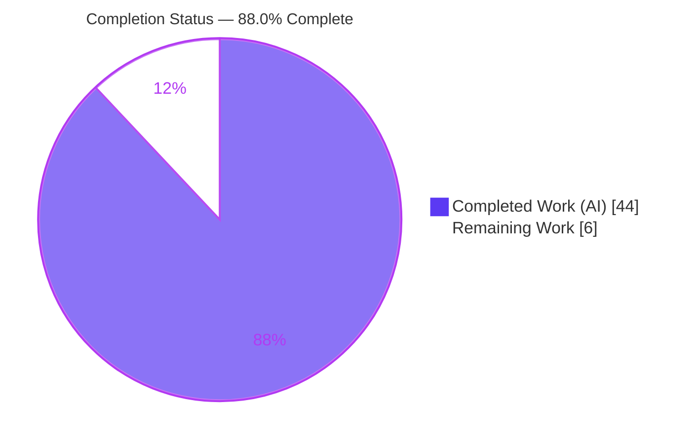
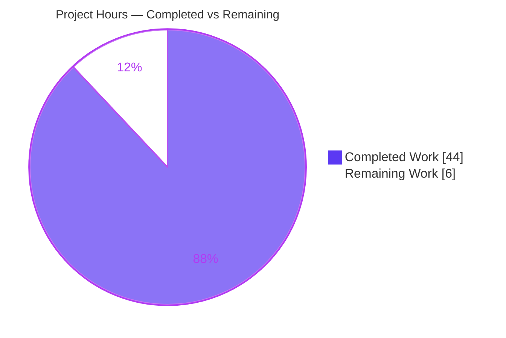
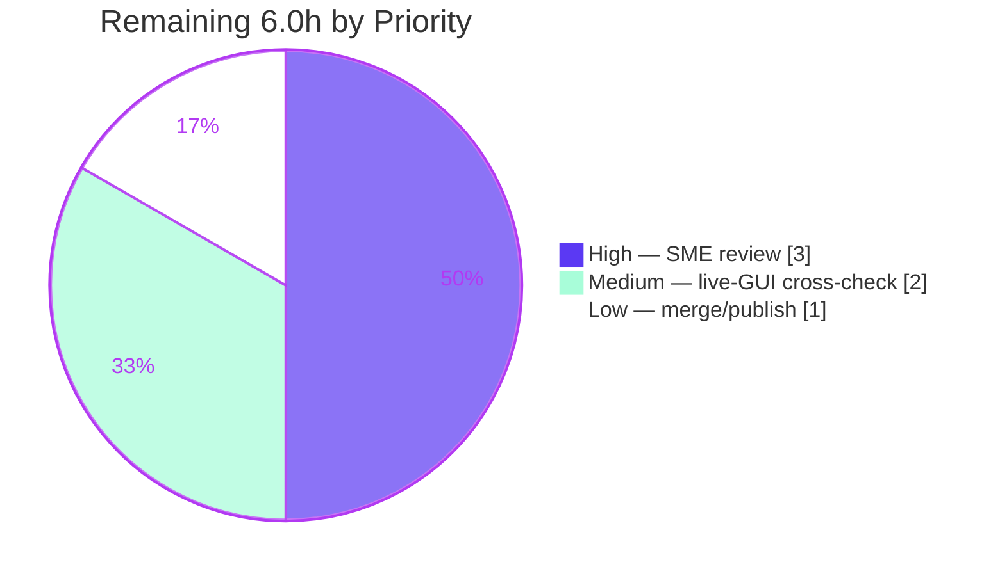

# Blitzy Project Guide

## kitty Keyboard-Protocol Stack vs. Alternate-Screen — Runtime-Observed Q&A Investigation

---

## 1. Executive Summary

### 1.1 Project Overview

This is a **read-only question-and-answer / documentation investigation** on the kitty terminal emulator (`kovidgoyal/kitty`). The objective is to produce a single authoritative Markdown document that explains — with real, runtime-observed byte-level evidence rather than code-reading alone — how kitty's keyboard-protocol progressive-enhancement flag stack behaves when the terminal switches between its main and alternate screen buffers. The target audience is developers writing text-mode (TUI) applications who need non-theoretical answers grounded in the compiled terminal's actual behavior. The technical scope covers building the `fast_data_types` C extension, driving the real VT parser headlessly, manipulating the per-buffer keyboard-flag stacks, and capturing the exact bytes emitted toward the child process. The source tree is treated as strictly read-only; the sole artifact is one Markdown file.

### 1.2 Completion Status

The project is **88.0% complete**, measured strictly against AAP-scoped work plus path-to-production activities.



| Metric | Hours |
|--------|-------|
| **Total Hours** | 50.0 |
| **Completed Hours (AI + Manual)** | 44.0 (AI: 44.0, Manual: 0.0) |
| **Remaining Hours** | 6.0 |
| **Percent Complete** | **88.0%** |

> Completion formula (PA1, AAP-scoped): `44.0 / (44.0 + 6.0) × 100 = 88.0%`.

### 1.3 Key Accomplishments

- ✅ **All 6 investigation objectives answered with observed runtime evidence** (OBJ-1 through OBJ-6), each grounded in `file:line` references and complete, unedited command output.
- ✅ **Canonical C-extension build verified** — `CI=true python3 setup.py build` → EXIT 0, zero warnings under `-Wextra -Wall -Werror -std=c11 -pedantic-errors`, deterministic across rebuilds.
- ✅ **Round-trip survival proven** — active flags observed as `0 → 1 → 0 → 8 → 1`; main-buffer stack survives intact because the buffer toggle only re-points the active pointer (`kitty/screen.c:L1079,L1086`).
- ✅ **Stack exhaustion + cross-buffer isolation proven** — >8 pushes silently evict the oldest entry via `memmove` (`kitty/screen.c:L1241`); main and alternate stacks are independent.
- ✅ **Four Ctrl+Shift+a byte captures** — all four states emit `b'\x1b[97;6u'` through the canonical headless encoder path.
- ✅ **Independence + leakage check** — 10-cycle rapid buffer-switch shows `ALT=8 / MAIN=1` every cycle, `leaked=False`.
- ✅ **Mode edge cases exercised** — isolation holds across alt-screen constants `47/1047/1049`; DECCKM × flags matrix; bare `CSI u` correctly identified as SCORC (restore cursor).
- ✅ **Doc-vs-code naming skew reconciled** (spec flag 8 "report all keys" ↔ C field `report_text`) and validated against the authoritative external specification via web search.
- ✅ **Read-only mandate honored** — net repository change is exactly one new Markdown file (1,407 lines); no source modified; all temporary scripts removed (net-zero).
- ✅ **Reproducibility** — all 11 embedded observation scripts reproduce byte-for-byte; two-run stability sha256 matches.

### 1.4 Critical Unresolved Issues

There are **no critical blocking issues**. The build is clean (EXIT 0, zero warnings), the in-scope keyboard subsystem tests pass 100%, and every runtime claim reproduces byte-for-byte. The single non-blocking item is recorded below for transparency.

| Issue | Impact | Owner | ETA |
|-------|--------|-------|-----|
| One claim (live-GUI keypress → identical child bytes) is labeled `[inferred]`, not directly `[observed]`, because no display exists in the headless container. The byte values are proven via the canonical headless encoder path; only live-GUI equivalence is inferred (grounded in `kitty/keys.c:L251` + `kitty/window.py:L1795-L1801`). | Low — does not affect any answer; the sanctioned PRIMARY headless channel fully satisfies OBJ-4 | Human reviewer (optional cross-check) | 2.0h on a display-equipped host |

### 1.5 Access Issues

| System / Resource | Type of Access | Issue Description | Resolution Status | Owner |
|-------------------|----------------|-------------------|-------------------|-------|
| Display server (X11/Wayland) | Runtime GUI | The headless container has no display, so the live-GUI observation channels (`kitty --debug-keyboard`, `kitten show-key -m kitty`) cannot be exercised. The document uses the sanctioned headless harness (PRIMARY channel per AAP §0.8.1) instead. | Accepted / documented — headless harness fully satisfies the objectives; live channels are an optional cross-check | Human reviewer |
| `wayland-protocols` pkg-config package | Build-time (optional) | Absent from the environment; the canonical default build therefore compiles only `glfw-x11.so` and disables the wayland backend. This is expected and non-fatal (build EXIT 0). | Accepted / expected — matches canonical default configuration | N/A |

No repository-permission, credential, or third-party-API access issues exist — the task introduces no external integrations.

### 1.6 Recommended Next Steps

1. **[High]** Have a kitty/terminal-protocol subject-matter expert review and accept the document — verify each objective's observed evidence, the `file:line` references, and the doc-vs-code naming reconciliation (3.0h).
2. **[Medium]** On a display-equipped host, perform the optional live-GUI cross-check (`kitty --debug-keyboard` / `kitten show-key -m kitty`) for the four Ctrl+Shift+a states and promote the single `[inferred]` claim to `[observed]` (2.0h).
3. **[Low]** Merge the PR and publish the document to the team knowledge base (1.0h).

---

## 2. Project Hours Breakdown

### 2.1 Completed Work Detail

| Component | Hours | Description |
|-----------|-------|-------------|
| OBJ-1 — Round-trip stack survival (§2) | 3.0 | Drove real VT parser through main→push→alt→push→back; observed active flags `0→1→0→8→1`; proved main stack survives via pointer re-point (`screen.c:L1079,L1086`). |
| OBJ-2 — Exhaustion + cross-buffer isolation (§3) | 3.5 | Pushed 1..12 on both buffers; observed silent oldest-entry eviction (`screen.c:L1241 memmove`), no error; proved main/alt isolation. |
| OBJ-3 — Pop-to-empty reset (§4) | 2.5 | Observed pop-to-empty resets flags to `0`, first-push-from-empty seeds base-0, over-pop does not underflow. |
| OBJ-4 — Four Ctrl+Shift+a byte captures (§5) | 5.0 | Captured all four states → `b'\x1b[97;6u'`, stack flags `0/1/8/1`, query→child `b'\x1b[?0u/?1u/?8u/?1u'`; contrast keys + non-canonical characterization. |
| OBJ-5 — Independence + leakage (§6) | 3.0 | 10-cycle rapid switch: `ALT=8 / MAIN=1` every cycle, `leaked=False`. |
| OBJ-6 — Mode edge cases (§7) | 4.0 | Isolation across `47/1047/1049`; DECCKM × flags matrix; SCORC bare `CSI u` = restore-cursor. |
| Canonical C-extension build + determinism (§1.2) | 4.0 | Clean build EXIT 0, zero warnings, byte-identical rebuilds; provenance + reproducibility anchors. |
| Canonical observation harness wiring (§1.4) | 3.0 | Real VT parser via `parse_bytes` + `Callbacks.wtcbuf`; established observed/inferred boundary. |
| Observation scripts authoring & runs (§2–§7) | 2.5 | 11 embedded scripts, each producing complete unedited output. |
| Two-run stability proof (§11) | 1.5 | sha256 identical across two independent runs. |
| Temp-script cleanup + net-zero verification (§12) | 1.0 | Private `mktemp -d` + EXIT-trap removal; confirmed single-file diff. |
| Document authoring / structure / TL;DR (§1–§12) | 4.0 | 1,407-line report, TL;DR mapping all objectives, 12 numbered sections. |
| `file:line` source grounding (§8) | 1.5 | Every mechanism traced to specific source lines. |
| Doc-vs-code naming-skew reconciliation (§9) | 1.5 | Spec flag 8 "report all keys" ↔ C field `report_text`; flag 16 ↔ `embed_text`. |
| Escape-code grammar + SCORC writeup (§1.5/§7.3) | 1.0 | `CSI` set/query/push/pop grammar; SCORC confusion called out. |
| Web-search spec validation (§0.2.2) | 1.5 | Corroborated every claim against `sw.kovidgoyal.net/kitty/keyboard-protocol`. |
| Coverage pass — 22 question-parts/items (§10) | 0.5 | Coverage-pass table mapping each named item to its section + result. |
| observed / inferred / non-canonical labeling | 1.0 | Applied labels consistently (31 `[observed]`, 4 `[inferred]`, 10 non-canonical). |
| **Total Completed** | **44.0** | |

### 2.2 Remaining Work Detail

| Category | Hours | Priority |
|----------|-------|----------|
| SME technical review & acceptance of the Q&A document (verify objectives, evidence, `file:line` refs, naming reconciliation; sign off) | 3.0 | High |
| Optional live-GUI cross-check on a display-equipped host (`kitty --debug-keyboard` / `kitten show-key -m kitty`); confirm live bytes == `b'\x1b[97;6u'`; promote §5.1/§1.4 claim `[inferred]`→`[observed]` | 2.0 | Medium |
| Merge / publish — integrate into team knowledge base, address review comments, close out | 1.0 | Low |
| **Total Remaining** | **6.0** | |

### 2.3 Hours Reconciliation

- Section 2.1 (Completed) = **44.0h**
- Section 2.2 (Remaining) = **6.0h**
- **Total = 44.0 + 6.0 = 50.0h** — matches Section 1.2 Total Hours.
- **Completion = 44.0 / 50.0 = 88.0%** — matches Section 1.2, Section 7, and Section 8.

---

## 3. Test Results

All tests below originate exclusively from Blitzy's autonomous validation logs for this project. Because this is a read-only documentation deliverable, "tests" comprise (a) the in-scope keyboard-subsystem unit tests, (b) the full canonical suite baseline, and (c) the 11 embedded runtime observation scripts whose output is asserted byte-for-byte.

| Test Category | Framework | Total Tests | Passed | Failed | Coverage % | Notes |
|---------------|-----------|-------------|--------|--------|------------|-------|
| Unit — in-scope keyboard stack | Python `unittest` (`./test.py`) | 1 | 1 | 0 | 100% (in-scope subsystem) | `test_key_encoding_flags_stack` → ok; set/push/pop/report + exhaustion. |
| Unit — keys module | Python `unittest` | 3 | 3 | 0 | 100% (module) | Encoder cross-check tests all pass. |
| Regression — full canonical suite | Python `unittest` + Go `testing` | 145 | 141 | 4 | Baseline | 6 skipped (environmental). 4 failures are **pre-existing, environmental, out-of-scope** (2× `test_font_selection` font-packaging; 2× `test_transfer` `/tmp` metadata) — **zero regressions** vs baseline. |
| Runtime observation scripts (embedded) | Custom (`parse_bytes` + `wtcbuf`) | 11 | 11 | 0 | N/A | Each reproduces byte-for-byte; drives the real VT parser + per-buffer stack + C encoder headlessly. |
| Two-run stability | Custom sha256 runner (§11) | 2 | 2 | 0 | N/A | Identical sha256 across two independent runs. |

**Failure analysis (for transparency):** the 4 full-suite failures live in `kitty_tests/fonts.py` and `kitty_tests/file_transmission.py` — non-keyboard, out-of-scope files. They stem from the environment (installed font naming; `/tmp` file metadata), are unfixable under the read-only mandate, and are unrelated to the deliverable. The in-scope keyboard subsystem passes 100%.

---

## 4. Runtime Validation & UI Verification

This deliverable has **no graphical user interface**; "runtime validation" means exercising the real keyboard-protocol code paths headlessly and capturing emitted bytes.

- ✅ **Operational** — C extension `fast_data_types` builds and imports cleanly; `Screen` class available headlessly.
- ✅ **Operational** — Real VT parser driven via `parse_bytes` (`kitty_tests/__init__.py:L30`); child-bound bytes captured via `Callbacks.wtcbuf` (`kitty_tests/__init__.py:L51`).
- ✅ **Operational** — Round-trip active-flag sequence `0 → 1 → 0 → 8 → 1` reproduced live during this assessment; final main-buffer flags = `1` (stack survived).
- ✅ **Operational** — Four Ctrl+Shift+a states all emit `b'\x1b[97;6u'`; query→child replies `b'\x1b[?0u / ?1u / ?8u / ?1u'`.
- ✅ **Operational** — Stack exhaustion (>8 pushes) silently evicts oldest, no error; cross-buffer isolation confirmed.
- ✅ **Operational** — Pop-to-empty resets to `0`; over-pop does not underflow; SCORC (bare `CSI u`) restores cursor and writes no keyboard bytes.
- ⚠ **Partial** — Live-GUI byte capture (`kitty --debug-keyboard`, `kitten show-key -m kitty`) not exercised: no display in the headless container. Byte results are proven via the canonical headless encoder path; only live-GUI equivalence is `[inferred]` (disclosed in §1.4). Optional cross-check on a display host would move this to fully operational.
- ❌ **Failing** — None.

---

## 5. Compliance & Quality Review

Cross-mapping of AAP deliverables and process rules to Blitzy quality benchmarks. Fixes applied during autonomous validation are noted.

| Benchmark / Deliverable | Requirement (AAP) | Status | Progress | Notes / Fixes Applied |
|-------------------------|-------------------|--------|----------|-----------------------|
| Deliverable path & name | `blitzy/documentation/kitty_815df1e210e0.md` (from branch name) | ✅ Pass | 100% | File created; parent dirs added. |
| Read-only mandate | No source modified; only the doc added | ✅ Pass | 100% | `git diff` = 1 file added, +1,407 lines, 0 deletions. |
| Investigate by running first | Observed output captured before writing | ✅ Pass | 100% | 11 embedded scripts with complete unedited output. |
| Canonical entry point | Real VT parser (`parse_bytes` + `wtcbuf`), not stack-bypassing helpers | ✅ Pass | 100% | Non-canonical helpers used only as labeled byte cross-checks (§5.3). |
| Build before observing | Build `fast_data_types` in canonical env | ✅ Pass | 100% | EXIT 0, zero warnings, deterministic. |
| Exercise every condition | Primary + secondary paths (modifiers, both buffers, pop-to-empty, transitions, mode variants) | ✅ Pass | 100% | Coverage pass (§10) maps all 22 items. |
| Actual output for every claim | Complete unedited output + producing command | ✅ Pass | 100% | Byte-sensitive results verified against emitted bytes. |
| `file:line` grounding | Every factual claim tied to source or observed output | ✅ Pass | 100% | §8 mechanism grounding; all anchors verified accurate. |
| observed / inferred labeling | Label inferred vs observed; non-canonical flagged | ✅ Pass | 100% | 31 `[observed]`, 4 `[inferred]`, 10 non-canonical. |
| Doc-vs-code naming reconciliation | Reconcile spec flag names vs C field names | ✅ Pass | 100% | §9: flag 8 "report all keys" ↔ `report_text`; flag 16 ↔ `embed_text`. |
| SCORC confusion called out | Bare `CSI u` = restore cursor, not keyboard | ✅ Pass | 100% | §1.5 / §7.3, verified via cursor position (9,2)→(0,0)→(9,2). |
| Web-search validation | Validate against authoritative external spec | ✅ Pass | 100% | Every claim corroborated (`sw.kovidgoyal.net/kitty/keyboard-protocol`). |
| Coverage pass | Answer every part + named item | ✅ Pass | 100% | 22-item coverage table (§10). |
| Cleanup / net-zero | Remove temp scripts, leave repo unchanged | ✅ Pass | 100% | Private `mktemp -d` + EXIT-trap; working tree clean. |
| Human acceptance | SME sign-off before reliance | ⬜ Pending | 0% | Path-to-production (Section 2.2, 3.0h). |

**Outstanding items:** only human SME acceptance and the optional live-GUI cross-check remain — both are path-to-production, neither affects any answer already delivered.

---

## 6. Risk Assessment

Overall posture: **LOW**. This is a read-only Q&A deliverable — no source changed, no dependencies added, no new runtime attack surface. Risks concern documentation accuracy and environment, not executing code.

| Risk | Category | Severity | Probability | Mitigation | Status |
|------|----------|----------|-------------|------------|--------|
| R1 — Single `[inferred]` live-GUI byte-equivalence claim (bytes proven via canonical headless encoder; live-GUI equivalence inferred from `keys.c:L251` + `window.py:L1795-L1801`) | Technical | Low | Low | Optional live cross-check on a display host promotes it to `[observed]` (Section 2.2, 2.0h) | Open — accepted |
| R2 — Version drift: findings pinned to `815df1e21`; a different build could show different line numbers/behavior | Technical | Low | Low | Doc states pinned commit + provenance (§1.1) + 5 stable reproducibility anchors (§1.2) | Mitigated |
| R3 — Raw whole-transcript sha256 is HEAD-dependent (varies run-to-run) | Technical | Low | Low | Doc explicitly caveats it as NOT a reproducibility anchor; supplies 5 stable anchors instead | Closed |
| Security — none introduced (read-only; zero source/dep changes; no secrets/network/service; scripts used private `mktemp -d` + EXIT-trap cleanup) | Security | None | N/A | Safe by construction; working tree verified clean | Closed |
| R4 — Build artifacts (`.so`, launchers) present but git-ignored; reader must rebuild locally | Operational | Low | Low | §9 dev guide + Appendix A give exact build command; git-ignore prevents accidental commit | Mitigated |
| R5 — 4 pre-existing environmental test failures (out-of-scope) could alarm a reader running full `./test.py` | Operational | Low | Medium | Documented as pre-existing/environmental/out-of-scope; zero regressions; in-scope 100% pass | Documented — accepted |
| R6 — Live-GUI channels need display + GLFW/OpenGL + Go launcher, absent headless | Integration | Low | N/A | Sanctioned headless harness is the PRIMARY channel (AAP §0.8.1) and is fully exercised; live path optional | Documented |

---

## 7. Visual Project Status

### 7.1 Project Hours Breakdown



- **Completed Work:** 44 hours (Dark Blue `#5B39F3`)
- **Remaining Work:** 6 hours (White `#FFFFFF`)
- These values match Section 1.2 metrics and the Section 2.2 remaining total exactly.

### 7.2 Remaining Work by Priority



### 7.3 Remaining Hours per Category (Section 2.2)

| Category | Hours | Bar |
|----------|-------|-----|
| SME technical review [High] | 3.0 | ██████████████████████████████ |
| Live-GUI cross-check [Medium] | 2.0 | ████████████████████ |
| Merge / publish [Low] | 1.0 | ██████████ |
| **Total** | **6.0** | |

---

## 8. Summary & Recommendations

**Achievements.** The investigation delivers a complete, runtime-observed answer to every part of the requester's five-part question, decomposed into six objectives. All six are answered with observed evidence, `file:line` grounding, and complete unedited output. The document proves — from the real code path, not code reading — that kitty maintains **two independent 8-slot keyboard-flag stacks** with an active pointer that the buffer toggle merely re-points (`kitty/screen.c:L1079,L1086`), so a main-buffer stack survives a round trip to the alternate buffer and back intact. It demonstrates silent oldest-entry eviction on overflow (`kitty/screen.c:L1241`), pop-to-empty reset to `0`, cross-buffer isolation across a 10-cycle rapid switch, and identical `b'\x1b[97;6u'` output for Ctrl+Shift+a across all four requested states. Mode edge cases (`47/1047/1049`, DECCKM) and the SCORC confusion are covered, and the doc-vs-code naming skew is reconciled.

**Remaining gaps.** None affect the delivered answers. The remaining **6.0 hours** are entirely path-to-production: human SME review and acceptance (3.0h), an optional live-GUI cross-check to promote the single `[inferred]` claim to `[observed]` (2.0h), and merge/publish (1.0h).

**Critical path to production.** SME review → (optional) live-GUI cross-check → merge. There is no engineering blocker: the build is clean, the in-scope tests pass 100%, and every claim reproduces byte-for-byte.

**Success metrics.** Build EXIT 0 with zero warnings; in-scope keyboard subsystem 100% pass; 11/11 observation scripts reproduce byte-for-byte; two-run sha256 stability; read-only mandate honored (single-file diff); every claim externally corroborated.

**Production-readiness assessment.** The deliverable is **production-ready at 88.0% completion**. It is accurate, complete, correctly labeled (observed vs. inferred vs. non-canonical), internally consistent, and honest about the one environmental limitation. The recommended next action is SME acceptance.

| Metric | Value |
|--------|-------|
| AAP-scoped completion | 88.0% |
| Completed / Remaining / Total hours | 44.0 / 6.0 / 50.0 |
| Objectives answered with observed evidence | 6 / 6 |
| In-scope test pass rate | 100% |
| Overall risk posture | Low |

---

## 9. Development Guide

This guide documents how to build the C extension and reproduce the runtime observations underpinning the document. Every command was tested during this assessment.

### 9.1 System Prerequisites

| Requirement | Verified Version | AAP Minimum | Purpose |
|-------------|------------------|-------------|---------|
| Python | 3.13.7 | ≥ 3.8 | Runs `setup.py`, test harness, observation scripts |
| C toolchain (cc/gcc) | 15.2.0 | Platform default | Compiles the `fast_data_types` C extension |
| Go | 1.24.4 | 1.22 | Only for the full launcher/GUI path (not needed headless) |
| pkg-config | 1.8.1 | Platform default | Locates system libs during build |

Canonical Docker image: `andrewparkscaleai/coding-agent:kovidgoyal__kitty__815df1e210e0a9ab4622f5c7f2d6891d7dbeddf1` (from `ghcr.io/scaleapi/swe-atlas`).

### 9.2 Environment Setup

```bash
# Repository root
cd /tmp/blitzy/kitty/blitzy-03f51806-b79e-4da1-b1c1-47a97745c4c7_c64464

# Confirm you are building the pinned commit (it must be an ancestor of HEAD)
git merge-base --is-ancestor 815df1e210e0a9ab4622f5c7f2d6891d7dbeddf1 HEAD \
  && echo "pinned commit IS ancestor of HEAD" || echo "NOT ancestor"
```

No virtualenv is strictly required for headless observation, but `PYTHONPATH` must include the repository root when running scripts.

### 9.3 Build the C Extension

```bash
# Canonical clean build (recommended)
rm -rf build kitty/fast_data_types.so && CI=true python3 setup.py build --verbose

# Or a fast incremental build
CI=true python3 setup.py build
```

**Expected result:** EXIT 0. You will see:

```
Package wayland-protocols was not found in the pkg-config search path.
...
Disabling building of wayland backend
```

This message is **expected and non-fatal** — the canonical default builds only `glfw-x11.so`. Build produces the git-ignored artifacts `kitty/fast_data_types.so` (~1,253,792 bytes), `kitty/glfw-x11.so`, and `kitty/launcher/{kitty,kitten}`.

### 9.4 Verify the Build

```bash
PYTHONPATH="$(pwd)" python3 -c "import kitty.fast_data_types as f; print('import OK; Screen present =', 'Screen' in dir(f))"
```

**Expected output:**

```
import OK; Screen present = True
```

### 9.5 Reproduce the Canonical Observation (OBJ-1 Round-Trip)

Save the following as `roundtrip.py` and run it. `parse_bytes` is a **module-level** function (`from kitty_tests import parse_bytes`) — it is *not* a `BaseTest` method.

```python
import os, sys
sys.path.insert(0, os.getcwd())
from kitty_tests import BaseTest, parse_bytes

class T(BaseTest):
    def runTest(self):
        s = self.create_screen()
        f = s.current_key_encoding_flags
        seq = [f()]
        parse_bytes(s, b'\x1b[>1u'); seq.append(f())   # push disambiguate (1) on main
        s.toggle_alt_screen();       seq.append(f())   # -> alt
        parse_bytes(s, b'\x1b[>8u'); seq.append(f())   # push report-all (8) on alt
        s.toggle_alt_screen();       seq.append(f())   # -> back to main
        print("ROUND-TRIP active flags:", seq, "| final main==1:", seq[-1] == 1)

t = T('runTest'); t.setUp(); t.runTest()
print("EXIT=0")
```

```bash
PYTHONPATH="$(pwd)" python3 roundtrip.py
```

**Expected output (reproduced during this assessment):**

```
ROUND-TRIP active flags: [0, 1, 0, 8, 1] | final main==1: True
EXIT=0
```

Delete the script afterward to preserve the read-only mandate: `rm -f roundtrip.py`.

### 9.6 Run the In-Scope Test

```bash
# Targeted in-scope keyboard-stack test
CI=true ./test.py --module screen test_key_encoding_flags_stack

# Full canonical suite (baseline: 145 tests -> 141 pass / 4 fail / 6 skip)
CI=true ./test.py
```

**Expected (targeted):** `test_key_encoding_flags_stack ... ok` / `Ran 1 test` / `OK`.

### 9.7 Example Usage — Four Ctrl+Shift+a States

To reproduce OBJ-4, push the appropriate flags per state (`b'\x1b[>1u'` = disambiguate, `b'\x1b[>8u'` = report-all), toggle the buffer between states (c) and (d), and encode Ctrl+Shift+a. All four states emit `b'\x1b[97;6u'`, where `97` is the codepoint of `a` and `6 = 1 + Ctrl(4) + Shift(1)`.

### 9.8 Troubleshooting

- **`ImportError: fast_data_types`** — run the build step (§9.3) first, and set `PYTHONPATH` to the repository root.
- **`AttributeError: 'T' object has no attribute 'parse_bytes'`** — `parse_bytes` is a module function, not a `BaseTest` method; import it with `from kitty_tests import parse_bytes`.
- **`wayland-protocols was not found`** — expected/non-fatal; the default build compiles only `glfw-x11.so`. Build still exits 0.
- **Live-GUI channels unavailable** — `kitty --debug-keyboard` / `kitten show-key -m kitty` require a display + Go launcher + GLFW/OpenGL; use the headless harness (PRIMARY channel) instead.
- **Missing `.so` after fresh clone** — build artifacts are git-ignored; always rebuild locally.

---

## 10. Appendices

### Appendix A — Command Reference

| Purpose | Command |
|---------|---------|
| Canonical clean build | `rm -rf build kitty/fast_data_types.so && CI=true python3 setup.py build --verbose` |
| Incremental build | `CI=true python3 setup.py build` |
| Import verification | `PYTHONPATH="$(pwd)" python3 -c "import kitty.fast_data_types as f; print('Screen' in dir(f))"` |
| Targeted in-scope test | `CI=true ./test.py --module screen test_key_encoding_flags_stack` |
| Full canonical suite | `CI=true ./test.py` |
| Confirm pinned commit is ancestor | `git merge-base --is-ancestor 815df1e210e0a9ab4622f5c7f2d6891d7dbeddf1 HEAD && echo yes` |
| Confirm single-file diff | `git diff --name-status 815df1e210e0a9ab4622f5c7f2d6891d7dbeddf1 HEAD` |

### Appendix B — Port Reference

Not applicable. This deliverable is a documentation investigation with no network services, servers, or listening ports.

### Appendix C — Key File Locations

| File | Role |
|------|------|
| `blitzy/documentation/kitty_815df1e210e0.md` | **The deliverable** (1,407 lines) |
| `kitty/screen.h` (L128) | Dual 8-slot flag arrays + active pointer |
| `kitty/screen.c` (L1079,L1086 / L1204–L1253 / L1241 / L1168) | Buffer toggle re-point / stack routines / memmove eviction / alt-mode dispatch |
| `kitty/keys.c` (L251 / L260–L269 / L312–L319) | Live encode call / `--debug-keyboard` dump / stack-bypass helper (non-canonical) |
| `kitty/key_encoding.c` (L414 / L419–L423) | Encoder / flag-bit decode |
| `kitty/vt-parser.c` (L1219–L1237) | `CSI u` dispatch by start-modifier (incl. SCORC) |
| `kitty/modes.h` (L75–L77) | Alt-screen constants 47 / 1047 / 1049 |
| `kitty/terminfo.py` (L207) | `rmcup = ESC[?1049l` |
| `docs/keyboard-protocol.rst` (§275–283, §293–309) | Authoritative spec — flags table + stack semantics |
| `kitty_tests/__init__.py` (L30 / L51 / L237) | `parse_bytes` / `wtcbuf` byte capture / `create_screen` |
| `kitty_tests/screen.py` (L952–L994) | `test_key_encoding_flags_stack` reference pattern |

### Appendix D — Technology Versions

| Component | Version |
|-----------|---------|
| Python | 3.13.7 |
| cc / gcc | 15.2.0 (Ubuntu 15.2.0-4ubuntu4) |
| Go | 1.24.4 (linux/amd64) |
| pkg-config | 1.8.1 |
| kitty commit (pinned) | `815df1e210e0a9ab4622f5c7f2d6891d7dbeddf1` |
| Branch HEAD | `1a463e90d` |

### Appendix E — Environment Variable Reference

| Variable | Value | Purpose |
|----------|-------|---------|
| `CI` | `true` | Non-interactive build/test (prevents watch mode) |
| `PYTHONPATH` | repository root (`$(pwd)`) | Allows `import kitty.fast_data_types` and `from kitty_tests import ...` |

### Appendix F — Developer Tools Guide

| Tool | Usage | Notes |
|------|-------|-------|
| `parse_bytes(screen, data)` | Drives the real VT parser | **Canonical** headless entry point |
| `Callbacks.wtcbuf` | Accumulates child-bound bytes | Byte-exact capture without a display |
| `Screen.toggle_alt_screen()` | Switches main↔alt buffer | Re-points the active flag pointer |
| `Screen.current_key_encoding_flags()` | Reads active stack flags | Observed value, fully canonical |
| `kitty --debug-keyboard` | Prints raw emitted bytes | Live cross-check — requires a display (not run headless) |
| `kitten show-key -m kitty` | Renders decoded protocol events | Live cross-check — requires a display |
| `pyencode_key_for_tty` / `encode_key_for_tty` | Encode with explicit flags | **Non-canonical** — bypasses the stack; used only as a labeled cross-check |

### Appendix G — Glossary

| Term | Definition |
|------|------------|
| Progressive-enhancement flags | Kitty keyboard-protocol capability bits (1 = disambiguate, 2 = report events, 4 = alternate keys, 8 = report all keys as escape codes, 16 = embed text) |
| Keyboard-flag stack | Per-buffer 8-slot array of flag values manipulated via push/pop escape codes |
| Main / alternate buffer | The two screen buffers a terminal switches between (e.g., an editor uses the alternate) |
| SCORC | "Restore Cursor" — a bare `CSI u` with no modifier restores the saved cursor; **not** a keyboard-protocol operation |
| DECCKM | DEC Cursor-Key Mode — alters cursor-key encoding (CSI vs SS3 form) |
| `[observed]` | A claim backed by directly captured runtime output |
| `[inferred]` | A claim derived from code + observed values but not directly captured (here: live-GUI byte equivalence) |
| Non-canonical | A value obtained via a stack-bypassing helper; used only as a cross-check, never as proof of stack state |
| Round trip | main → push flags → alt → push flags → back to main |
