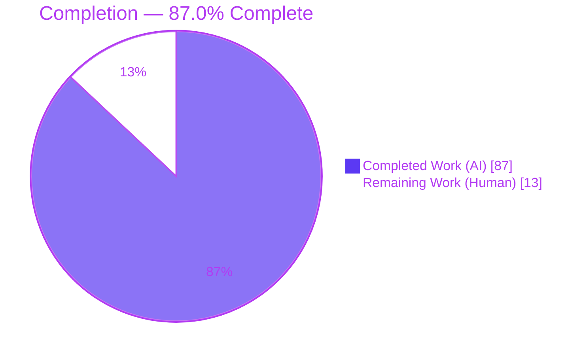
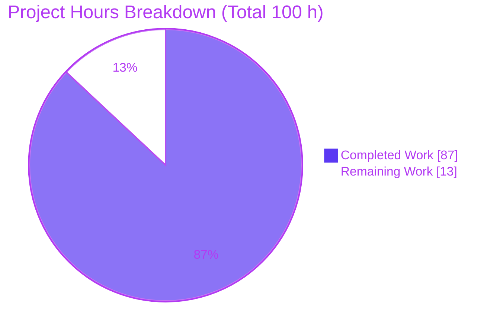
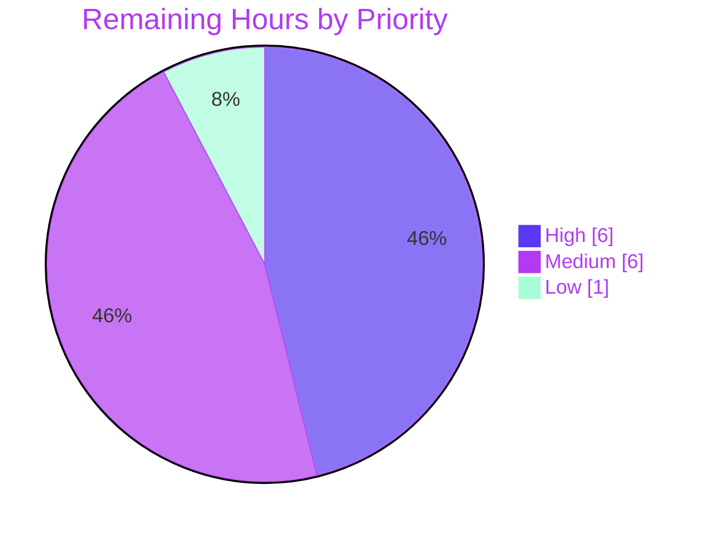

# Blitzy Project Guide
## Kitty Input-Event Flow & Focus Management — Runtime-Evidenced Investigation

> **Branch:** `blitzy-44a45bf2-93ca-49f0-962c-1283cdddd2a4` · **HEAD:** `1382dbbc1` · **Base:** `815df1e210e0`
> **Deliverable:** `blitzy/documentation/kitty_815df1e210e0.md` (2,555 lines) · **Source tree:** byte-for-byte unchanged
> **Brand palette:** Completed / AI = Dark Blue `#5B39F3` · Remaining = White `#FFFFFF` · Headings = Violet-Black `#B23AF2` · Highlight = Mint `#A8FDD9`

---

## 1. Executive Summary

### 1.1 Project Overview

This project produces a single runtime-evidenced Q&A document explaining how the **kitty** terminal emulator handles input-event flow and focus management across windows, tabs, and child processes — grounded exclusively in observed runtime behavior, not source-reading assumptions. The target audience is engineers who need an authoritative, evidence-backed mental model of kitty's hybrid Python/C/GLFW input pipeline. The deliverable answers seven mandated sub-questions (Q1–Q7) from live traces, native stack snapshots, and controlled experiments. The technical scope is read-only dynamic analysis of a CPython process embedding a compiled C extension plus a patched GLFW windowing layer; the sole write surface is one Markdown file outside the source tree.

### 1.2 Completion Status



| Metric | Value |
|--------|-------|
| **Total Hours** | **100 h** |
| **Completed Hours (AI + Manual)** | **87 h** (AI = 87 h · Manual = 0 h) |
| **Remaining Hours** | **13 h** |
| **Percent Complete** | **87.0 %**  →  87 / (87 + 13) × 100 |

> **Color key:** Completed = Dark Blue `#5B39F3` · Remaining = White `#FFFFFF`.
> Completion % is computed per the AAP-scoped, hours-based methodology: `Completed ÷ (Completed + Remaining) × 100`. All AAP-scoped autonomous work is complete; the remaining 13 h is human path-to-production effort (review / reproduction / acceptance / publish) that cannot be autonomously self-certified.

### 1.3 Key Accomplishments

- ✅ **All seven sub-questions (Q1–Q7) answered from live runtime evidence** — each with the exact command, raw output, and `file:line` citation.
- ✅ **kitty built and launched from the checkout through its canonical entry point** `./kitty/launcher/kitty` under a headless Xvfb + software-GL display (`python3 setup.py`, EXIT=0, ~41 s, 0 warnings under `-Werror`/`-pedantic`).
- ✅ **All five overlapping-activity scenarios (S1–S5) exercised** through the real windowing/input path (Xvfb + XTEST injection): multi-tab/window creation, rapid focus switching, typing during resize/scroll, background flood while another window is focused, and input to an unfocused/just-closed window.
- ✅ **Stack/symbol snapshot captured with a blocked-then-remediated attach** — first `ptrace` attach authentically failed (EPERM, no `CAP_SYS_PTRACE`); after container-scoped remediation, `py-spy dump --native` captured all three layers, a `gdb` conditional breakpoint captured the exact C→Python shortcut-dispatch frame, and `eu-stack` enumerated the 67-thread set including the `KittyChildMon` `io_loop`. Frame-stable across 2 runs.
- ✅ **Three incorrect interpretations refuted with evidence** (exceeds the ≥2 requirement) — Go-router, Python-encoder, and per-window-thread hypotheses each ruled out via snapshot + thread-inventory data.
- ✅ **One correctness-vs-responsiveness tradeoff characterized from observed behavior** — the single `io_loop` thread keeps per-child delivery correct/ordered/isolated while focused-key latency rises under background flood (~7.5× median), stable across 2 runs.
- ✅ **Read-only invariant preserved** — source tree byte-for-byte unchanged (0 files modified); all temporary observation scratch removed; build artifacts gitignored.
- ✅ **Deliverable validated end-to-end** — all 56 `file:line` citations verified against the pinned source; markdown structurally sound (144 balanced code fences); committed at `1382dbbc1`.

### 1.4 Critical Unresolved Issues

| Issue | Impact | Owner | ETA |
|-------|--------|-------|-----|
| _None._ All AAP-scoped autonomous work is complete and validated (5/5 gates green). No compilation errors, no failing tests, no missing deliverable content, and no unresolved autonomous defects. | — | — | — |

> The only outstanding work is standard human path-to-production review/acceptance of the knowledge artifact (see §1.6 and §2.2). These are not defects or blockers.

### 1.5 Access Issues

| System / Resource | Type of Access | Issue Description | Resolution Status | Owner |
|-------------------|----------------|-------------------|-------------------|-------|
| `ptrace` (Q4 live attach) | Kernel capability `CAP_SYS_PTRACE` | First attach authentically **blocked** (EPERM); host `kernel.yama.ptrace_scope=1` was never modified | **Resolved** — container-scoped `--cap-add=SYS_PTRACE` used transiently for observation only; host untouched; not part of deliverable runtime | Blitzy (autonomous) |
| Mandated Docker toolchain image (`ghcr.io/scaleapi/swe-atlas`) | Registry pull | Required for build/run and for independent reproduction | **Available** — image digest recorded in deliverable §1.1; used successfully by autonomous validation | Reviewer (for reproduction) |

> No unresolved access issues prevent build validation, integration, or deployment. Both items above were resolved during autonomous work; the second is informational for reviewers who wish to reproduce.

### 1.6 Recommended Next Steps

1. **[High]** Perform a technical review of the deliverable — read the 2,555-line Q&A end-to-end, verify Q1–Q7 runtime claims are grounded in the shown commands/output, and spot-check the 56 `file:line` citations against the pinned source (**HT-1, 6 h**).
2. **[Medium]** Independently reproduce key findings in the mandated container — build (`python3 setup.py`, ~40 s), launch headless, and re-run 1–2 scenarios plus one `py-spy`/`gdb` snapshot per Appendix Z (**HT-2, 4 h**).
3. **[Medium]** Obtain stakeholder / SME acceptance sign-off confirming all seven sub-questions are answered to satisfaction (**HT-3, 2 h**).
4. **[Low]** Publish / distribute the document — integrate into the knowledge base or wiki and verify Markdown / Mermaid / caret-ANSI rendering on the target platform (**HT-4, 1 h**).

---

## 2. Project Hours Breakdown

### 2.1 Completed Work Detail

Every completed component traces to a specific AAP requirement (build/launch foundation, scenarios S1–S5, sub-questions Q1–Q7, methodology, and the read-only/cleanup invariants). All hours below were delivered autonomously by Blitzy agents (Manual = 0 h).

| Component | Hours | Description |
|-----------|:----:|-------------|
| Build environment & toolchain setup | 8 | Mandated Docker image, Xvfb headless display, Mesa software GL (llvmpipe), `py-spy` install, XTEST C injector compile, container-scoped `CAP_SYS_PTRACE` remediation, dual default + `--debug` builds. |
| Runtime investigation harness suite | 12 | Scenario drivers (S1–S5), `label.py` raw byte-loggers, background flood producers, `xinj` XTEST injector, `pair_lat.py` latency-pairing, and `run_*.sh` orchestration — all hardened for reproducibility. |
| Q1 — Focus arbitration | 4 | S1 nested split/tab hierarchy; per-event target resolution via `active_window()` (`kitty/keys.c:106`); byte-landing proof. |
| Q2 — Focus-change propagation | 5 | Path A (GLFW `window_focus_callback` → `Boss.on_focus` → `Screen.focus_changed`) vs. Path B (Python-only internal switch); DECSET-1004 focus bytes. |
| Q3 — Input routing to child | 9 | Branch matrix (plain / Shift / Ctrl / Alt / Enter), arrow-key encodings, consumed-shortcut zero-bytes, Ctrl+C byte-vs-SIGINT, S3 typing interleaved with genuine scroll + resize. |
| Q4 — Stack / symbol snapshot | 9 | Blocked-attach capture + remediation; `py-spy dump --native` (3 layers); `gdb` conditional breakpoint on shortcut dispatch; `eu-stack` 67-thread dump; 2-run frame stability. |
| Q5 — Unfocused / just-closed window | 5 | Unfocused-but-live + four post-close timing offsets (0/10/50/200 ms) × 2 runs = 8 trials; reap-latency (~33–35 ms) measurement. |
| Q6 — Layer attribution + 3 refutations | 6 | External/C/Python ownership; before/after thread inventory (67→67 vs. children 1→4); Go-frame absence across 3 tools; positive control. |
| Q7 — Correctness-vs-responsiveness tradeoff | 7 | Quiet vs. flood per-key latency measurement; correctness/order/isolation invariant; 2-run stability. |
| Deliverable authoring & structure | 8 | 2,555-line document — executive summary, methodology, three-layer pipeline diagram, Q1–Q7 prose, Appendices (harness / R / Z). |
| QA revision cycles | 12 | Seven commits: 17-findings code-review round, F1/F2 reproducibility, F-A/B/C findings, final-acceptance appendix expansion (+1,722 lines), harness reproducibility, flood-rate correction. |
| Read-only invariant enforcement & cleanup | 2 | Verified 0 source changes; deleted 142 container scratch files + host `/tmp`; gitignored build artifacts. |
| **Total Completed** | **87** | **Matches Completed Hours in §1.2.** |

### 2.2 Remaining Work Detail

Every remaining item is standard human path-to-production effort. No item is an autonomous defect or rework — all AAP-scoped autonomous work is complete.

| Category | Hours | Priority |
|----------|:----:|:--------:|
| Technical review of the deliverable (verify Q1–Q7 runtime claims; spot-check 56 `file:line` citations; validate Q7 tradeoff + 3 refutations) | 6 | High |
| Independent reproduction of key findings (build in mandated container; launch headless; re-run 1–2 scenarios + one snapshot) | 4 | Medium |
| Stakeholder / SME acceptance sign-off (confirm all 7 sub-questions answered to satisfaction) | 2 | Medium |
| Publish / distribute the document (knowledge-base/wiki integration; verify rendering on target platform) | 1 | Low |
| **Total Remaining** | **13** | **Matches Remaining Hours in §1.2 and §7.** |

### 2.3 Hours Reconciliation

| Check | Result |
|-------|--------|
| §2.1 Completed sum | 87 h |
| §2.2 Remaining sum | 13 h |
| §2.1 + §2.2 | **100 h** = Total Hours (§1.2) ✔ |
| §2.2 sum = §1.2 Remaining = §7 "Remaining Work" | 13 = 13 = 13 ✔ |
| Completion | 87 / 100 = **87.0 %** ✔ |

---

## 3. Test Results

All tests below originate from Blitzy's autonomous validation logs for this project. Because the deliverable is read-only documentation, testing served two purposes: (a) confirm the read-only build is sound by running kitty's own regression suite as a health gate, and (b) validate the deliverable itself by reproducing every Q1–Q7 runtime scenario through the real input path.

| Test Category | Framework | Total Tests | Passed | Failed | Coverage % | Notes |
|---------------|-----------|:----:|:----:|:----:|:----:|-------|
| Python unit / integration (regression health gate) | kitty test runner (`python3 setup.py test`, unittest-based) | 145 | 141 | 0 | Pass/fail gate | 4 legitimate skips (absent optional tools); 0 FAILED / 0 ERROR / 0 Traceback. |
| Go unit tests (regression health gate) | `go test` (Go 1.23.4) | All | All | 0 | Pass/fail gate | Entire Go suite passes; 0 Go-FAIL. |
| Runtime Q&A validation — Q1–Q7 scenarios | Live runtime (Xvfb + XTEST injection through canonical entry point) | 7 (Q1–Q7) | 7 | 0 | Evidence-reproduced | Every sub-question reproduced from live runtime; frame/behavior-stable across ≥2 runs. |
| Deliverable integrity — citations & structure | Static validation (source cross-check + fence balance) | 56 refs | 56 | 0 | 100 % verified | All `file:line` refs exist, in-range, and content-matched; 144 balanced code fences. |

**Summary:** `setup.py test` EXIT=0; the runtime investigation reproduced all seven sub-questions; and every deliverable citation was verified. Coverage is reported as a pass/fail gate rather than a line-coverage percentage because the source tree is unchanged (the regression suite is a build-health signal, not a coverage target for new code).

---

## 4. Runtime Validation & UI Verification

kitty is a GPU/GLFW application; it was launched headless under Xvfb with Mesa software GL (llvmpipe). Because the deliverable is a terminal-emulator investigation (no product UI is built), "UI verification" here means confirming the real windowing/input path executes and produces the observed signals.

- ✅ **Build** — `python3 setup.py` EXIT=0 (~41 s); artifacts `kitty/fast_data_types.so` (1,213,072 B) and `kitty/launcher/kitty` (36,224 B) produced (gitignored, not committed).
- ✅ **Canonical launch** — `./kitty/launcher/kitty --config NONE --debug-keyboard` verified as *our* launcher via `/proc/<pid>/cmdline`; clean startup and shutdown; 0 error-like lines.
- ✅ **First-party trace** — `--debug-keyboard` emits `on_focus_change`, mouse `Move`, and "sent encoded key to child" lines (lossless caret notation for control bytes).
- ✅ **S1 multi-tab/window** — nested split + tab hierarchy created; typed bytes land in the active tab's active window.
- ✅ **S2 rapid focus switching** — two propagation paths distinguished by presence/absence of the `on_focus_change` trace line.
- ✅ **S3 typing during resize + scroll** — SGR wheel events + `SIGWINCH` interleave with keystrokes; keystrokes still reach the focused child.
- ✅ **S4 background flood while another window focused** — output goes to the producing child; keystrokes only to the focused child (~210–238k lines/s flood).
- ✅ **S5 input to unfocused / just-closed window** — input strictly follows focus; post-close bytes re-route to the survivor; victim child reaped (~33–35 ms).
- ✅ **Q4 live stack snapshot** — `py-spy dump --native` (3 layers), `gdb` conditional breakpoint (C→Python dispatch frame), `eu-stack` (67 threads incl. `KittyChildMon io_loop`); frame-stable across 2 runs.
- ⚠ **Q7 latency magnitude is environment-dependent** — the qualitative tradeoff (correctness invariant; latency rises under flood) is stable, but the exact multiplier (~7.5×–17×) varies with host throughput; explicitly caveated in the deliverable.
- ✅ **API / IPC integration** — remote-control and the Go `kitten` binary confirmed *out of* the interactive keystroke path (0 Go frames in any backtrace); no external network integration is on the input path.

**Overall runtime status: ✅ Operational** — all scenarios executed through the real path; the single environment-dependent magnitude is documented as ⚠ Partial for numeric reproducibility (not a defect).

---

## 5. Compliance & Quality Review

Cross-mapping of AAP deliverables and governing rules to their fulfillment status, including fixes applied during autonomous validation.

| AAP Requirement / Rule | Benchmark | Status | Evidence / Progress |
|------------------------|-----------|:------:|---------------------|
| MainRule — single deliverable, read-only source | Exactly 1 file added; 0 source files changed | ✅ Pass | `git diff base..HEAD` = `A blitzy/documentation/kitty_815df1e210e0.md`; 0 changes in `kitty/`, `glfw/`, `setup.py`, `pyproject.toml`, `go.mod`. |
| Rule 1 — run-first via canonical entry point | Build + launch through `kitty/launcher/kitty`; report exact commands | ✅ Pass | §1.2 build (`python3 setup.py`, EXIT=0) + launch verified via `/proc/<pid>/cmdline`; no remote-control/debug-hook used to originate input. |
| Rule 2 — exhaustive condition & evidence coverage | Primary + secondary paths; before/intermediate/after; unedited output | ✅ Pass | Q3 branch matrix (plain/Shift/Ctrl/Alt/Enter + arrows + Ctrl+C byte-vs-signal); before/after thread inventory; raw output shown verbatim. |
| Rule 3 — observed-output discipline; label inferred | Output next to every claim; inferred items labeled | ✅ Pass | 17 inferred/source-assisted items explicitly labeled (deliverable §2545 region); all other claims shown with captured output. |
| Rule 4 — complete, precise, grounded answering | Every Q + named item answered by name with `file:line` | ✅ Pass | Q1–Q7 each led by a direct answer; 56 `file:line` refs verified; coverage pass enumerates Q1–Q7 with ✔. |
| Q4 — snapshot with blocked-then-fallback | Show error + alternative with commands & raw output | ✅ Pass | EPERM shown; remediation + `py-spy`/`gdb`/`eu-stack` all captured with commands + raw output. |
| Q6 — ≥2 refutations with evidence | At least two incorrect interpretations ruled out | ✅ Pass (exceeds) | 3 refutations (A Go-router, B Python-encoder, C per-window-thread), each evidence-backed. |
| Q7 — tradeoff from behavior, not comments | Observed, stable across ≥2 runs | ✅ Pass | Per-event latency measured quiet vs. flood; invariant correctness; stable across 2 runs. |
| Cleanup — temp scripts removed | Repository left unchanged | ✅ Pass | Container `/kqna` (142 files) and host `/tmp` scratch deleted; working tree clean. |
| Build hygiene — artifacts not committed | `.so` / launcher gitignored | ✅ Pass | `git check-ignore` confirms `*.so`, `kitty/launcher/kitt*`, `/build/`. |

**Fixes applied during autonomous validation:** one internal-consistency correction — the Q7 background-flood figure originally stated "~0.9 M lines/s" (a total-over-burst value) was aligned to the correct rate "~210–238k lines/s" in both the executive summary and the tradeoff paragraph (commit `1382dbbc1`); no measured value or conclusion changed. Earlier QA rounds resolved 17 code-review findings, harness-reproducibility findings (F1/F2), and final-acceptance findings (F-A/B/C).

**Outstanding compliance items:** none. All rules satisfied.

---

## 6. Risk Assessment

| Risk | Category | Severity | Probability | Mitigation | Status |
|------|----------|:--------:|:-----------:|------------|:------:|
| Q7 latency *magnitude* is environment-dependent (host-throughput sensitive) | Technical | Low | Medium | Deliverable explicitly caveats magnitude; the qualitative tradeoff and correctness invariant are stable across runs | Accepted / Documented |
| Findings pinned to commit `815df1e210e0`; future kitty versions may diverge from cited `file:line` | Technical | Low | Low | All references commit-pinned; the pinned base is stated up front | Mitigated |
| 17 claims are "inferred / source-assisted" rather than directly observed | Technical | Low | Low | Each is explicitly labeled per Rule 3; all core claims are directly observed | Mitigated |
| Q4 required transient `CAP_SYS_PTRACE` for live attach | Security | Low | Low | Used only in an isolated container for observation; host `ptrace_scope` never modified; capability not committed | Contained |
| Zero source changes → no new attack surface | Security | Low (N/A) | — | Read-only investigation; single documentation file added | N/A |
| Reproduction requires the mandated Docker image + Xvfb + software GL | Operational | Low | Medium | Appendix Z provides clean-room reproduction with exact image digests and commands | Mitigated |
| Build artifacts gitignored; a fresh clone must rebuild before reproduction | Operational | Low | Low | §1.2 gives the exact one-line build command (~40 s) | Mitigated |
| No CI/CD integration is required by the AAP (standalone knowledge artifact) | Integration | Low (N/A) | — | Out of scope by design; no downstream system depends on this artifact at runtime | N/A |
| Markdown / Mermaid / caret-ANSI rendering on the target publishing platform | Integration | Low | Low | 144 balanced fences validated; a single Mermaid block; verify at publish time | Verify-at-publish |

**Risk posture:** All identified risks are **Low** severity, consistent with a fully-validated, read-only documentation deliverable. There are no High or Medium severity risks and no blocking issues.

---

## 7. Visual Project Status

**Project hours breakdown** (Completed = Dark Blue `#5B39F3` · Remaining = White `#FFFFFF`):



> **Integrity:** "Remaining Work" = **13 h** equals §1.2 Remaining Hours and the §2.2 Hours sum. "Completed Work" = **87 h** equals §1.2 Completed Hours and the §2.1 sum. 87 + 13 = 100 h total.

**Remaining work by priority** (13 h total):



**Remaining hours per category (§2.2):**

| Category | Hours | Bar |
|----------|:----:|-----|
| Technical review (High) | 6 | ██████████████ |
| Independent reproduction (Medium) | 4 | █████████ |
| Acceptance sign-off (Medium) | 2 | ████ |
| Publish / distribute (Low) | 1 | ██ |
| **Total** | **13** | |

---

## 8. Summary & Recommendations

**Achievements.** The project is **87.0 % complete** (87 h of 100 h). Every AAP-scoped autonomous deliverable is finished and validated: kitty was built and launched from the checkout through its canonical entry point; all five overlapping-activity scenarios (S1–S5) were exercised through the real windowing/input path; all seven sub-questions (Q1–Q7) are answered from live runtime evidence with commands, raw output, and verified `file:line` citations; a stack/symbol snapshot was captured with an authentic blocked-then-remediated attach and corroborated across `py-spy`, `gdb`, and `eu-stack`; three incorrect interpretations (exceeding the ≥2 requirement) were refuted with evidence; and one correctness-vs-responsiveness tradeoff was characterized strictly from observed behavior. The read-only invariant holds — the source tree is byte-for-byte unchanged and all temporary scratch was removed.

**Remaining gaps.** The outstanding **13 h** is entirely human path-to-production effort, not autonomous rework: technical review (6 h), independent reproduction (4 h), stakeholder acceptance sign-off (2 h), and optional publication (1 h). No compilation errors, failing tests, missing content, or unresolved defects exist.

**Critical path to production.** (1) Technical review of the deliverable → (2) independent reproduction of key findings in the mandated container → (3) stakeholder acceptance → (4) publish. Because a knowledge artifact's runtime claims must be verified by a human expert before they are trusted for production use, this review chain — though modest — is the honest remaining work that keeps completion below 100 %.

**Success metrics.**

| Metric | Target | Actual |
|--------|--------|--------|
| Sub-questions answered from runtime evidence | 7 / 7 | ✅ 7 / 7 |
| Incorrect interpretations refuted | ≥ 2 | ✅ 3 |
| Correctness-vs-responsiveness tradeoffs | 1 | ✅ 1 |
| Source files modified | 0 | ✅ 0 |
| Autonomous validation gates passed | 5 / 5 | ✅ 5 / 5 |
| `file:line` citations verified | 56 / 56 | ✅ 56 / 56 |

**Production readiness assessment.** The deliverable is **production-ready pending human acceptance**. It is complete, internally consistent, fully grounded in reproduced runtime evidence, and committed. Recommended action: approve after the §1.6 review steps.

---

## 9. Development Guide

This guide covers building, running, and reproducing the investigation. Commands are copy-pasteable. Build/run/snapshot commands execute inside the mandated Docker toolchain container (the orchestration environment is not the build container).

### 9.1 System Prerequisites

- **OS / toolchain (mandated container):** Ubuntu 24.04 LTS · Python 3.12.3 (repo requires `>=3.8`) · gcc 13.3 · Go 1.23.4 (repo `go.mod` requires `1.22`).
- **Build libraries (pkg-config):** harfbuzz `>=1.5`, fontconfig, libpng, lcms2, OpenGL, wayland / x11 / xkbcommon, libcanberra, libxxhash.
- **Headless display:** Xvfb + Mesa software GL (llvmpipe).
- **Observation tooling (for Q4 reproduction):** `py-spy` 0.4.x, `gdb` 15.x, `eu-stack` (elfutils 0.190), plus container-scoped `CAP_SYS_PTRACE`.

### 9.2 Environment Setup

```bash
# 1) Start the mandated toolchain container (repo bind-mounted read-write at /work).
#    --cap-add=SYS_PTRACE is needed only for Q4's live attach.
docker run -d --name kqna \
  --cap-add=SYS_PTRACE \
  --tmpfs /tmp:exec,size=1g \
  -v <REPO>:/work -w /work \
  --entrypoint bash \
  andrewparkscaleai/coding-agent:kovidgoyal__kitty__815df1e210e0a9ab4622f5c7f2d6891d7dbeddf1 \
  -lc 'mkdir -p /tmp/.X11-unix; sleep infinity'

# 2) Headless display: Xvfb + software GL
docker exec kqna bash -lc 'export DISPLAY=:99; Xvfb :99 -screen 0 1280x800x24 -nolisten tcp & sleep 1'
```

### 9.3 Build (canonical, default configuration)

```bash
# Compiles the C core into kitty/fast_data_types.so and links kitty/launcher/kitty (~40 s).
docker exec -w /work kqna bash -lc 'python3 setup.py'
# Expected: EXIT=0; artifacts (gitignored):
#   kitty/fast_data_types.so   (~1,213,072 B)
#   kitty/launcher/kitty       (~36,224 B)

# Optional symbol-rich build for gdb:
docker exec -w /work kqna bash -lc 'python3 setup.py build --debug'
```

### 9.4 Application Startup

```bash
# Launch through the canonical entry point under the headless display.
docker exec -w /work kqna bash -lc \
  'export DISPLAY=:99; ./kitty/launcher/kitty --config NONE --debug-keyboard python3 /path/to/child.py'
```

### 9.5 Verification Steps

```bash
# Confirm the running process is OUR launcher (not a pre-installed binary):
docker exec kqna bash -lc 'cat /proc/<KPID>/cmdline | tr "\0" " "; echo'
# Expect: ./kitty/launcher/kitty --config NONE --debug-keyboard ...

# Run the regression health gate (source tree unchanged):
docker exec -w /work kqna bash -lc \
  'export DISPLAY=:99; python3 setup.py test'
# Expect: EXIT=0; 141 Python passed + 4 skips; all Go tests pass.

# Confirm the read-only invariant (from the repo root):
git diff --name-status 815df1e210e0a9ab4622f5c7f2d6891d7dbeddf1..HEAD
# Expect exactly: A  blitzy/documentation/kitty_815df1e210e0.md
```

### 9.6 Reproducing the Investigation (Q4 stack snapshot)

```bash
# Primary: Python + native-C frames of the live process.
docker exec kqna bash -lc 'py-spy dump --native --pid <KPID>'

# Fallback if attach is blocked (EPERM): remediate with container-scoped CAP_SYS_PTRACE
# (already added in §9.2), then use gdb / eu-stack:
docker exec kqna bash -lc \
  'gdb -p <PID> -batch -ex "set debuginfod enabled off" -ex "thread apply all bt"'
docker exec kqna bash -lc 'eu-stack -p <PID>'
```

### 9.7 View the Deliverable

```bash
less blitzy/documentation/kitty_815df1e210e0.md   # 2,555 lines; Appendix Z has full clean-room repro
```

### 9.8 Troubleshooting

- **`ptrace: Operation not permitted` (EPERM):** start the container with `--cap-add=SYS_PTRACE` (container-scoped; do not modify the host `ptrace_scope`).
- **`cannot open display` / GL errors:** ensure Xvfb is running and `export DISPLAY=:99`; Mesa software GL (llvmpipe) is used for headless rendering.
- **Missing `fast_data_types.so` / launcher:** re-run `python3 setup.py`; artifacts are gitignored and not present in a fresh clone.
- **`Failed to open systemd user bus`:** benign container noise; appears in every `--debug-keyboard` trace and does not affect behavior.
- **`go: command not found` in the orchestration shell:** Go lives in the mandated build container; run build/test there, not in the orchestration environment.

---

## 10. Appendices

### A. Command Reference

| Purpose | Command |
|---------|---------|
| Build (canonical) | `python3 setup.py` |
| Build (debug symbols) | `python3 setup.py build --debug` |
| Test (health gate) | `python3 setup.py test` |
| Launch (canonical entry point) | `./kitty/launcher/kitty --config NONE [--debug-keyboard] <cmd>` |
| Start headless display | `Xvfb :99 -screen 0 1280x800x24 -nolisten tcp &` |
| Stack snapshot (primary) | `py-spy dump --native --pid <PID>` |
| Stack snapshot (fallback) | `gdb -p <PID> -batch -ex 'set debuginfod enabled off' -ex 'thread apply all bt'` |
| Stack snapshot (fallback) | `eu-stack -p <PID>` |
| Verify our launcher | `cat /proc/<PID>/cmdline` |
| Verify read-only invariant | `git diff --name-status 815df1e210e0a9ab4622f5c7f2d6891d7dbeddf1..HEAD` |
| Verify artifacts gitignored | `git check-ignore kitty/launcher/kitty kitty/fast_data_types.so build/` |

### B. Port / Display Reference

| Resource | Value | Notes |
|----------|-------|-------|
| Network ports | None | Interactive input uses no network ports; the keystroke path is in-process (GLFW→C→Python) + PTY. |
| X display | `:99` | Headless Xvfb display for the GPU/GLFW application. |
| PTY | per-child master fd | Each `Window` owns a `Child` holding the PTY master fd; input routed by integer window id. |

### C. Key File Locations

| Path | Role |
|------|------|
| `blitzy/documentation/kitty_815df1e210e0.md` | **The deliverable** (2,555 lines) — sole write surface. |
| `kitty/launcher/kitty` | Canonical launcher (built artifact, gitignored). |
| `kitty/fast_data_types.so` | Compiled C core extension (built artifact, gitignored). |
| `setup.py` | Build entry point (`python3 setup.py`). |
| `kitty/glfw.c` | GLFW callbacks — `key_callback` (L430), `window_focus_callback` (L515). |
| `kitty/keys.c` | `on_key_input` (L166), `active_window()` (L106), encode+write. |
| `kitty/key_encoding.c` | Legacy vs. Kitty Keyboard Protocol byte encoding. |
| `kitty/child-monitor.c` | `io_loop`, `schedule_write_to_child` (L372), `mark_for_close`. |
| `kitty/state.c` | Two-level focus model (OSWindow `is_focused` + Tab `active_window`). |
| `kitty/boss.py` | `dispatch_possible_special_key`, `on_focus`, `active_window`. |
| `kitty/window_list.py`, `kitty/tabs.py` | Internal (Path B) focus/active-window bookkeeping. |

### D. Technology Versions (build container, per deliverable §1.1)

| Component | Version |
|-----------|---------|
| OS | Ubuntu 24.04.2 LTS |
| Python | 3.12.3 (repo requires `>=3.8`) |
| gcc | 13.3.0 |
| Go | 1.23.4 (repo `go.mod` `go 1.22`) |
| py-spy | 0.4.2 |
| gdb | 15.1 |
| eu-stack (elfutils) | 0.190 |
| Xvfb | 21.1.12 |
| Mesa (libgl1-mesa-dri) | 25.2.8 (llvmpipe, LLVM 20.1.2) |

### E. Environment Variable Reference

| Variable | Value / Purpose |
|----------|-----------------|
| `DISPLAY` | `:99` — targets the headless Xvfb display. |
| `CI` | `true` — non-interactive mode for Node/JS tooling (general hygiene). |
| `DEBIAN_FRONTEND` | `noninteractive` — for apt operations during container setup. |
| `DBUS_SESSION_BUS_ADDRESS` | `/dev/null` — suppresses D-Bus session lookups in-container. |
| `KITTY_WINDOW_ID` | Set per child by kitty; used by harness byte-loggers to name output files. |

### F. Developer Tools Guide

| Tool | Use in this project |
|------|---------------------|
| `--debug-keyboard` (alias `--debug-input`) | First-party in-process trace of input/focus (`on_focus_change`, key encoding). Observes, does not originate, input. |
| `py-spy dump --native` | Primary Q4 snapshot — captures Python + native-C frames of the live process without restarting it. |
| `gdb thread apply all bt` | Fallback native backtrace on a `--debug` build; also used for a conditional breakpoint on the C→Python shortcut dispatch. |
| `eu-stack -p` | Fallback per-thread stack enumeration (elfutils); captured the full 67-thread set. |
| `Xvfb` + Mesa llvmpipe | Headless display + software GL so the real GLFW/GL path runs without a physical GPU/display. |
| XTEST (via `xinj`) | Injects real OS key/pointer events through the X server — canonical input path, not a bypass. |

### G. Glossary

| Term | Meaning |
|------|---------|
| **GLFW** | Vendored, kitty-patched windowing library (`glfw/`) — the boundary against the OS; delivers raw key/focus/resize events. |
| **`fast_data_types`** | The C core compiled into a CPython extension; owns encoding, routing, and focus state. |
| **PTY** | Pseudo-terminal; each child process is attached to a PTY master fd owned by its `Window`'s `Child`. |
| **`io_loop`** | The single dedicated I/O thread (`KittyChildMon`) that drains/fills every child PTY (POLLOUT-driven). |
| **DECSET-1004** | Terminal escape sequence for focus-in/focus-out reporting; observed as the bytes sent to a child on focus change. |
| **MRU counter** | Monotonic "most-recently-used" focus counter stamped on OS-window focus (`last_focused_counter`). |
| **`ptrace` / `CAP_SYS_PTRACE`** | Kernel tracing mechanism / capability required to attach a profiler/debugger to a running process. |
| **LTO** | Link-Time Optimization; inlined `schedule_write_to_child`, explaining why that frame is not separately visible in Q4. |
| **Refutation** | An incorrect interpretation explicitly ruled out with runtime evidence (Q6 provides A/B/C). |

---

*This Blitzy Project Guide reflects the AAP-scoped, hours-based completion methodology. All figures are internally consistent: Total 100 h = Completed 87 h + Remaining 13 h; Completion = 87.0 %. Completed = Dark Blue `#5B39F3`; Remaining = White `#FFFFFF`.*