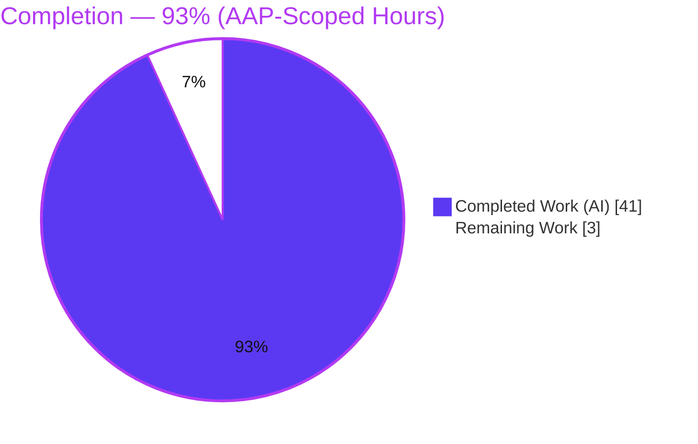
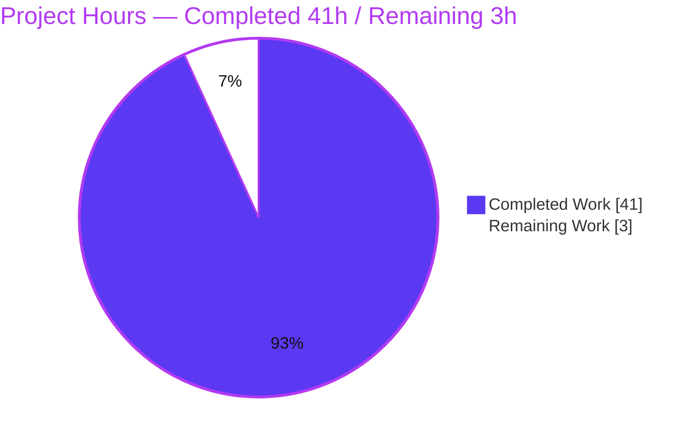
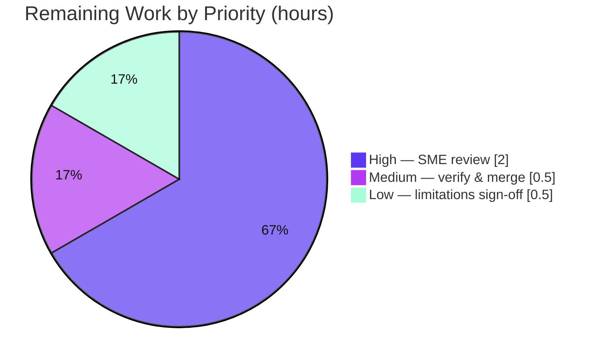

# Blitzy Project Guide — Kitty Terminal-Interaction Pipeline Q&A

> **Brand legend.** Completed / AI Work = **Dark Blue `#5B39F3`** · Remaining / Not Completed = **White `#FFFFFF`** · Headings / Accents = **Violet-Black `#B23AF2`** · Highlight = **Mint `#A8FDD9`**.

---

## 1. Executive Summary

### 1.1 Project Overview

This project delivers a single, source-grounded technical Q&A document — `blitzy/documentation/kitty_815df1e210e0.md` — that explains, end-to-end, how the Kitty terminal emulator's runtime terminal-interaction pipeline behaves. It answers four sub-questions (byte entry & pause/resume; the "unseen conductor" scheduling threads; alignment under mixed hints/backpressure/unstable-remote; and the full arrival-to-settle lifecycle). The audience is engineers reasoning about Kitty's parser, scheduling, flow-control, and synchronized-output internals. This is a strictly **read-only investigation-and-documentation** task: it adds exactly one Markdown artifact, changes no existing Kitty source, and grounds every claim in exact `file:line` citations plus verbatim output captured by building and running the real C extension.

### 1.2 Completion Status



| Metric | Value |
|--------|-------|
| **Total Hours** | **44** |
| Completed Hours (AI + Manual) | 41 (AI: 41 · Manual: 0) |
| Remaining Hours | 3 |
| **Percent Complete** | **93%** |

> Completion is computed per PA1 (AAP-scoped hours only): `41 / (41 + 3) = 41 / 44 = 93.2% → 93%`. The 7% remaining is a human review/acceptance gate, not development work — the deliverable passed all autonomous validation gates with zero fixes.

### 1.3 Key Accomplishments

- ✅ **Single AAP deliverable authored & committed** — `blitzy/documentation/kitty_815df1e210e0.md` (675 lines), across 3 `agent@blitzy.com` commits.
- ✅ **C extension built & runnable** — `kitty/fast_data_types.so` compiled (**1,253,792 bytes**); `IMPORT OK; has Screen: True; has Parser: True`.
- ✅ **Run-first methodology honored** — build → observe → quote → cite → write; every behavioral claim backed by verbatim captured output.
- ✅ **All four sub-questions (Q1–Q4) answered** as distinct, addressable sections, plus a coverage-pass checklist.
- ✅ **79 distinct `file:line` citations across 13 files verified accurate**; asked-for literals quoted exactly (`input_delay=3`, `repaint_delay=10`, `BUF_SZ=1 MiB`, pending timeout `2000` ms).
- ✅ **Central thesis empirically proven** — one serialized parser dispatches hint + text + pause-control in arrival order (3-line trace reproduced verbatim this session).
- ✅ **Strict read-only compliance** — `git status --porcelain` empty; only 1 file added; no existing file touched.
- ✅ **Honest Limitations section** — transparently discloses what was not runtime-exercised (GPU frame, monitor sync, 2000 ms wall-clock).

### 1.4 Critical Unresolved Issues

| Issue | Impact | Owner | ETA |
|-------|--------|-------|-----|
| _None._ Deliverable passed all 5 autonomous validation gates with zero fixes required. | No release blocker | — | — |

### 1.5 Access Issues

| System/Resource | Type of Access | Issue Description | Resolution Status | Owner |
|-----------------|----------------|-------------------|-------------------|-------|
| _No access issues identified._ | — | Repository, build toolchain, test harness, and C-extension build all accessible; no external credentials, APIs, or network services are required for a read-only documentation deliverable. | Resolved / N/A | — |

### 1.6 Recommended Next Steps

1. **[High]** SME / senior-engineer technical-accuracy review of the Q&A pipeline narrative (Q1–Q4) and a spot-check of the 79 `file:line` citations against source at HEAD `815df1e210e0` (~2h).
2. **[Medium]** Re-verify read-only compliance (`git status --porcelain` empty; only the one file added) and merge/accept branch `blitzy-d5231f89-bfc4-44ed-9e95-28aa50acc183` (~0.5h).
3. **[Low]** Sign off on the disclosed headless limitations — decide whether the intentionally out-of-scope GPU-frame / monitor-sync / 2000 ms wall-clock runtime confirmation is acceptable as-is (per AAP it is out of scope) (~0.5h).

---

## 2. Project Hours Breakdown

### 2.1 Completed Work Detail

| Component | Hours | Description |
|-----------|-------|-------------|
| Build environment & C-extension compilation | 3 | Compile `kitty/fast_data_types.so` (1,253,792 bytes); resolve `--ignore-compiler-warnings` for the Wayland `-Werror` case; verify import sanity (Screen + Parser present). |
| Headless observation harness & run-first evidence capture | 5 | Drive the real compiled parser/screen via `parse_bytes` + `CmdDump`; capture the mixed-input dispatched-command trace and test-runner markers; read measured literals from source. |
| Web research — DEC 2026 synchronized-output terminology | 1 | Confirm the "pause/resume" mechanism is the industry "synchronized output" feature (DEC private mode 2026, `\x1b[?2026h/l`) to name Kitty's implementation precisely. |
| Q1 — Entry / surge / pause-resume investigation & authoring | 5 | Read & cite the I/O-thread read path (`read_bytes()`, ring-buffer write) and the synchronized-output pause/resume entry. |
| Q2 — The "unseen conductor" investigation & authoring | 6 | Document `ChildMonitor` + three threads, the fixed `poll()` descriptor ordering, and `input_delay` wake-up batching. |
| Q3 — Alignment / backpressure / unstable-remote investigation & authoring | 6 | Show hints & text share one serialized parser; the `POLLIN` backpressure gate on parser buffer space; the pending-mode 2000 ms timeout auto-resume. |
| Q4 — Full lifecycle investigation & authoring | 5 | Synthesize arrival-to-settle narrative + the Mermaid lifecycle flowchart. |
| Citation anchoring & verification | 4 | Establish and verify 79 distinct `file:line` citations across 13 files; quote asked-for literals exactly. |
| Introduction, coverage pass, Limitations & document assembly | 3 | Environment table, run-first methodology, headless-surface description, Q1–Q4 coverage checklist, honest Limitations section. |
| Code-review & QA reconciliation cycle | 2 | Two follow-up commits addressing review findings (`4a617bfb8`) and reconciling the Q3 trace listing (`d296f0ca7`). |
| Read-only compliance verification | 1 | Confirm `git status --porcelain` empty; only 1 file added; temp scripts kept outside the repo and removed; re-verify after each observation step. |
| **Total Completed** | **41** | **Matches Section 1.2 Completed Hours.** |

### 2.2 Remaining Work Detail

| Category | Hours | Priority |
|----------|-------|----------|
| SME technical-accuracy review (Q1–Q4 narrative + citation spot-check + reproduce observed output) | 2 | High |
| Read-only compliance re-verification & branch merge/acceptance | 0.5 | Medium |
| Sign-off on disclosed headless limitations (GPU frame / monitor sync / 2000 ms wall-clock — out of AAP scope) | 0.5 | Low |
| **Total Remaining** | **3** | **Matches Section 1.2 Remaining & Section 7 pie "Remaining Work".** |

### 2.3 Hours Reconciliation

| Check | Result |
|-------|--------|
| Section 2.1 total (Completed) | 41 h |
| Section 2.2 total (Remaining) | 3 h |
| 2.1 + 2.2 = Total Project Hours | 41 + 3 = **44 h** ✅ (equals Section 1.2 Total) |
| Completion % = 41 / 44 | **93%** ✅ (equals Section 1.2 & Section 7) |

---

## 3. Test Results

All tests below originate from **Blitzy's autonomous validation logs** for this project and were re-confirmed this session. The suite is Python `unittest`, driven headlessly via `test.py` against the real compiled C extension. The kitty unittest harness does not emit a line-coverage metric, so Coverage % is reported as N/A.

| Test Category | Framework | Total Tests | Passed | Failed | Coverage % | Notes |
|---------------|-----------|-------------|--------|--------|------------|-------|
| Parser module (`kitty_tests.parser`) | Python unittest | 16 | 16 | 0 | N/A | Includes doc-referenced `test_parser_threading`, `test_simple_parsing`. |
| Screen module (`kitty_tests.screen`) | Python unittest | 36 | 36 | 0 | N/A | Includes doc-referenced `test_prompt_marking`. |
| Doc-referenced focused subset | Python unittest | 3 | 3 | 0 | N/A | `test_parser_threading`, `test_simple_parsing`, `test_prompt_marking` — **subset** of the two rows above (not additive). Verbatim: `Ran 3 tests in 0.045s` / `OK`. |
| **Total (distinct)** | Python unittest | **52** | **52** | **0** | N/A | 100% pass rate. Focused 3 are counted within the 52 distinct tests. |

**Verbatim focused-suite markers (reproduced this session):**

```
test_parser_threading (kitty_tests.parser.TestParser.test_parser_threading) ... ok
test_simple_parsing (kitty_tests.parser.TestParser.test_simple_parsing) ... ok
test_prompt_marking (kitty_tests.screen.TestScreen.test_prompt_marking) ... ok
----------------------------------------------------------------------
Ran 3 tests in 0.045s
OK
```

> **Integrity note.** No tests were authored or committed by this task (read-only scope). These are the project's own harness tests exercised by Blitzy's autonomous validation to confirm the observed code paths execute cleanly. `test_parser_threading` validates the cross-commit parser handoff the I/O and main threads rely on (not thread concurrency), as the deliverable's coverage pass discloses.

---

## 4. Runtime Validation & UI Verification

This is a **headless documentation** deliverable — a Markdown artifact, not a running service or graphical application. "Runtime" here means the observation surface (the compiled C parser/screen driven via the test harness). There is no web/desktop UI, no HTTP API, and no network service in scope; GPU rendering and the windowing backend are explicitly out of AAP scope.

**Observation-surface runtime health:**

- ✅ **Operational** — C extension builds: `CI=true python3 setup.py build --ignore-compiler-warnings` → exit `0` (from-scratch: 122 compile + 5 link steps, 0 warnings).
- ✅ **Operational** — Extension imports: `IMPORT OK; has Screen: True; has Parser: True`.
- ✅ **Operational** — Real parser/screen driven headlessly; mixed-input dispatched-command trace reproduced **verbatim** this session:
  ```
  MIXED_INPUT_REPR: b'\x1b]133;A\x1b\\$ \x1bP=1s\x1b\\'
  ('shell_prompt_marking', 133, 'A')
  ('draw', '$ ')
  ('screen_start_pending_mode',)
  ```
- ✅ **Operational** — Focused tests pass: `Ran 3 tests in 0.045s` / `OK`.

**UI verification:**

- ⚠ **Not applicable** — No graphical UI is in scope. The deliverable renders as standard Markdown (30 headings, 32 balanced code fences, 1 Mermaid flowchart; plain Markdown, not an LFS pointer). Kitty's GPU frame path and windowing backend are intentionally **not** exercised (headless observation), a limitation the deliverable discloses explicitly.

**API / integration verification:**

- ⚠ **Not applicable** — No external APIs, endpoints, or third-party services. The only "integration" is the build toolchain used to compile the C extension for observation.

---

## 5. Compliance & Quality Review

The AAP's governing rule set is **"SWE-AtlasQnA-Repo"**. Each directive is cross-mapped to its verification below. All items **PASS**.

| # | AAP Requirement / Rule | Benchmark | Status | Evidence |
|---|------------------------|-----------|--------|----------|
| 1 | Deliverable name & location | `blitzy/documentation/<source_branch_name>.md` | ✅ Pass | `blitzy/documentation/kitty_815df1e210e0.md` present (675 lines). |
| 2 | Run-first methodology (build & run before writing) | Build + observe precede prose | ✅ Pass | Build log, import, test markers, and trace captured & quoted in the doc's methodology section. |
| 3 | Quote observed output verbatim | Real log lines / traces / measured values | ✅ Pass | Build steps, `IMPORT OK…`, `Ran 3 tests…`, 3-line dispatched-command trace all quoted verbatim. |
| 4 | Answer every sub-question (Q1–Q4) | 4 distinct addressable sections | ✅ Pass | Q1 (L123), Q2 (L216), Q3 (L359), Q4 (L534) + Coverage Pass (L622). |
| 5 | Exact `file:line` citations | Every existing-system claim cited | ✅ Pass | 79 distinct citations across 13 files verified accurate (spot-checked independently). |
| 6 | Never paraphrase an asked-for value | Literals quoted exactly | ✅ Pass | `input_delay=3` [definition.py:L878], `repaint_delay=10` [L866], `BUF_SZ=1 MiB` [vt-parser.c:L18], `2000` ms [screen.c:L2521]. |
| 7 | Coverage pass before finishing | Explicit Q1–Q4 checklist | ✅ Pass | Coverage Pass section checks all four as `[x]`. |
| 8 | Read-only scope | No existing file modified; repo pristine | ✅ Pass | `git status --porcelain` empty; all 3 commits touch only the deliverable. |
| 9 | Remove temporary scripts | No temp artifacts committed | ✅ Pass | Observation scripts kept in `/tmp` and deleted; 0 remain in repo. |
| 10 | No placeholders / TODO / FIXME | Production-ready content | ✅ Pass | Grep for TODO/FIXME/placeholder → clean. |
| 11 | Honest disclosure of unverifiable claims | Limitations stated explicitly | ✅ Pass | Limitations section discloses headless-only scope (GPU/monitor-sync/2000 ms). |

**Fixes applied during autonomous validation:** None required — the deliverable was already accurate when the Final Validator ran. Earlier agent commits (`4a617bfb8`, `d296f0ca7`) addressed code-review findings and reconciled the Q3 trace listing prior to final validation.

**Outstanding compliance items:** None.

---

## 6. Risk Assessment

Overall risk profile: **LOW**, consistent with a validated read-only documentation deliverable. No blocking risks.

| Risk | Category | Severity | Probability | Mitigation | Status |
|------|----------|----------|-------------|------------|--------|
| Headless-only verification: GPU frame, monitor sync, and 2000 ms wall-clock expiry are asserted from source, not runtime-measured | Technical | Low | Low | Deliverable's Limitations section discloses this transparently; GPU/windowing is explicitly out of AAP scope | Disclosed / Accepted |
| Citation line-number pinning: 79 citations are pinned to `file:line` at HEAD `815df1e210e0` and could drift if Kitty source changes | Technical | Low | Low | Citations pinned to a specific commit; doc records the exact HEAD | Accepted |
| Build-flag dependency: build requires `--ignore-compiler-warnings` to bypass a Wayland `-Werror` warning under newer gcc (15.2.0) | Technical | Low | Low | Documented in the doc and in the Development Guide (Section 9) | Mitigated |
| Documentation currency: a static doc could become stale if Kitty's pipeline changes over time | Operational | Low | Low | Pinned to commit `815df1e210e0`; scope is a point-in-time explanation | Accepted |
| Observation reproducibility requires the build toolchain (gcc, HarfBuzz, FreeType, FontConfig, xxHash, OpenSSL, SIMDe, xkbcommon/Wayland/GL) | Integration | Low | Low | Prerequisites listed in Section 9 + canonical Docker image provided | Mitigated |
| Security exposure | Security | None | None | Read-only Markdown deliverable introduces zero code, dependencies, endpoints, credentials, or auth surface | N/A |

---

## 7. Visual Project Status

**Project hours breakdown** (Completed = Dark Blue `#5B39F3`, Remaining = White `#FFFFFF`):



**Remaining hours by priority** (sums to 3h — equals Section 1.2 Remaining and Section 2.2 total):



> **Integrity check.** Pie "Remaining Work" = **3h** = Section 1.2 Remaining Hours = Section 2.2 "Hours" column sum. Pie "Completed Work" = **41h** = Section 1.2 Completed Hours = Section 2.1 total. Completion = 41 / 44 = **93%**.

---

## 8. Summary & Recommendations

**Achievements.** The project delivers exactly what the AAP mandates: one comprehensive, source-grounded, run-first Q&A document at `blitzy/documentation/kitty_815df1e210e0.md`. It answers all four sub-questions as distinct sections, anchors every existing-system claim to an exact `file:line` citation (79 across 13 files, verified), backs every behavioral assertion with verbatim captured output, and honors the strict read-only constraint (repository pristine; only one file added). The C extension builds and imports cleanly, the focused tests pass, and the central thesis — one serialized parser dispatching a shell-integration hint, ordinary text, and a pause/resume control in arrival order — is empirically reproduced.

**Remaining gaps.** None are development gaps. The 7% remaining (**3h**) is a human review/acceptance gate: a subject-matter-expert accuracy review of the pipeline narrative and citations, a read-only compliance re-verification plus merge, and an optional sign-off on the transparently disclosed headless limitations.

**Critical path to production.** Production for this artifact = acceptance and merge. Path: (1) SME technical review → (2) read-only compliance re-verification & merge → (3) limitations sign-off. There is no build/deploy pipeline to stand up because the deliverable is a static document, not a running service.

**Success metrics.** All 5 autonomous validation gates pass at 100% (compilation, tests, runtime observation, zero unresolved errors + citation accuracy, in-scope file completeness); 52/52 harness tests pass; artifact reproduces at a deterministic 1,253,792 bytes; `git status --porcelain` empty.

**Production-readiness assessment.** The project is **93% complete** and production-ready pending human acceptance. Confidence is **High**: the scope is well-defined, the deliverable is validated end-to-end with zero fixes, and the only remaining work is review/merge. The one substantive risk (headless-only verification of GPU/monitor-sync/2000 ms) is explicitly out of AAP scope and disclosed in the document.

| Metric | Value |
|--------|-------|
| AAP-scoped completion | 93% |
| Completed / Remaining / Total hours | 41 / 3 / 44 |
| Validation gates passed | 5 / 5 |
| Harness tests passing | 52 / 52 |
| Files changed (all read-only-safe) | 1 added, 0 modified, 0 deleted |
| Overall risk | Low |
| Confidence | High |

---

## 9. Development Guide

This guide documents how to reproduce the build and the observations that ground the deliverable. Every command was tested this session from the repository root. **Nothing here modifies the repository** — build artifacts are gitignored and observation scripts live outside the tree.

### 9.1 System Prerequisites

- **OS:** Linux (verified on Ubuntu 25.10 container; canonical image `ghcr.io/scaleapi/swe-atlas` → `kovidgoyal__kitty__815df1e210e0`).
- **Python:** ≥ 3.8 (`requires-python = ">=3.8"` [pyproject.toml:L2]); observed 3.13.7.
- **Go:** pinned `go 1.22` [go.mod:L3]; observed toolchain 1.24.4 (builds the `kitten` binary during `setup.py build`).
- **C toolchain:** C11 compiler; observed gcc 15.2.0.
- **git:** observed 2.51.0 (used to confirm branch name and verify the tree stays pristine).

### 9.2 Environment Setup

Install the build prerequisites (Debian/Ubuntu; these are Kitty's already-documented build inputs, not new dependencies):

```bash
DEBIAN_FRONTEND=noninteractive apt-get install -y \
  build-essential libharfbuzz-dev libfreetype-dev libfontconfig-dev \
  libxxhash-dev libssl-dev libsimde-dev \
  libxkbcommon-dev libxkbcommon-x11-dev libwayland-dev wayland-protocols libgl1-mesa-dev
```

Optional but recommended — use an isolated Python environment (Ubuntu 25 marks system Python PEP-668 externally-managed):

```bash
python3 -m venv .venv && source .venv/bin/activate
```

### 9.3 Build (Dependency Compilation)

From the repository root:

```bash
CI=true python3 setup.py build --ignore-compiler-warnings
```

- **Expected:** exit code `0`. A from-scratch build runs **122 compile steps + 5 link steps** with no warnings/errors and produces `kitty/fast_data_types.so` (**1,253,792 bytes**). An incremental re-run prints no compile lines (add `--full` to force a full rebuild).
- **Why the flag:** `--ignore-compiler-warnings` drops `-pedantic-errors -Werror` [setup.py:L491] — required only to bypass a Wayland windowing-backend warning under newer gcc; the terminal parser/screen paths compile cleanly.

### 9.4 Verification

**1. Import sanity:**

```bash
python3 -c "import kitty.fast_data_types as f; print('IMPORT OK; has Screen:', hasattr(f,'Screen'), '; has Parser:', hasattr(f,'Parser'))"
```
Expected: `IMPORT OK; has Screen: True ; has Parser: True`

**2. Focused tests** (the three the deliverable references):

```bash
LANG=C.UTF-8 LC_ALL=C.UTF-8 python3 test.py parser_threading simple_parsing prompt_marking
```
Expected (elapsed time will vary):
```
test_parser_threading ... ok
test_simple_parsing ... ok
test_prompt_marking ... ok
Ran 3 tests in 0.045s
OK
```

**3. Broader module health (optional):**

```bash
LANG=C.UTF-8 LC_ALL=C.UTF-8 python3 test.py --module parser   # 16/16 OK
LANG=C.UTF-8 LC_ALL=C.UTF-8 python3 test.py --module screen   # 36/36 OK
```

### 9.5 Example Usage — Reproduce the Central Observation

Create a temporary script **outside** the repository (read-only discipline) and run it with the repo root on `PYTHONPATH`:

```bash
cat > /tmp/observe_pipeline.py << 'PYEOF'
from kitty_tests import BaseTest, parse_bytes
from kitty_tests.parser import CmdDump

class _Obs(BaseTest):
    def runTest(self):
        pass

t = _Obs()
s = t.create_screen()
cd = CmdDump()
data = b'\x1b]133;A\x1b\\$ \x1bP=1s\x1b\\'   # OSC 133;A hint + text "$ " + DCS =1s pending start
print('MIXED_INPUT_REPR:', repr(data))
parse_bytes(s, data, cd)
for cmd in cd.get_result():
    print(cmd)
PYEOF

PYTHONPATH="$(pwd)" LANG=C.UTF-8 LC_ALL=C.UTF-8 python3 /tmp/observe_pipeline.py
rm -f /tmp/observe_pipeline.py
```

Expected output (reproduced verbatim this session):
```
MIXED_INPUT_REPR: b'\x1b]133;A\x1b\\$ \x1bP=1s\x1b\\'
('shell_prompt_marking', 133, 'A')
('draw', '$ ')
('screen_start_pending_mode',)
```

### 9.6 Read-Only Verification

```bash
git status --porcelain    # expect empty output = pristine tree
```

### 9.7 Troubleshooting

| Symptom | Cause | Resolution |
|---------|-------|------------|
| Build fails with `-Werror` on a Wayland/windowing file | Newer gcc promotes a backend warning to an error | Add `--ignore-compiler-warnings` to the build command |
| `ModuleNotFoundError: No module named 'kitty_tests'` when running the observation script from `/tmp` | Repo root not on `sys.path` | Prefix the run with `PYTHONPATH="$(pwd)"` from the repo root |
| `ImportError` for `kitty.fast_data_types` | Extension not built yet | Run the build command first (Section 9.3) |
| Incremental build prints nothing / stale objects | Build is incremental by design | Add `--full` to force a rebuild of unchanged files |
| `pip install` fails with "externally-managed-environment" | Ubuntu 25 PEP-668 system Python | Use a venv (Section 9.2) or pass `--break-system-packages` |

---

## 10. Appendices

### Appendix A — Command Reference

| Purpose | Command |
|---------|---------|
| Build C extension | `CI=true python3 setup.py build --ignore-compiler-warnings` |
| Force full rebuild | `CI=true python3 setup.py build --ignore-compiler-warnings --full` |
| Import sanity | `python3 -c "import kitty.fast_data_types as f; print(hasattr(f,'Screen'), hasattr(f,'Parser'))"` |
| Focused tests | `LANG=C.UTF-8 LC_ALL=C.UTF-8 python3 test.py parser_threading simple_parsing prompt_marking` |
| Parser module tests | `python3 test.py --module parser` |
| Screen module tests | `python3 test.py --module screen` |
| Read-only verify | `git status --porcelain` |
| Confirm branch | `git branch --show-current` |
| Artifact size | `stat -c%s kitty/fast_data_types.so` |

### Appendix B — Port Reference

Not applicable. The task is headless and adds no running service — **no network ports are opened or required**. Kitty's GPU/windowing runtime is out of scope for this documentation deliverable.

### Appendix C — Key File Locations

| Path | Role |
|------|------|
| `blitzy/documentation/kitty_815df1e210e0.md` | **The deliverable** (only committed artifact) |
| `kitty/child-monitor.c` | I/O + main + talk threads; PTY read/write; `poll()` scheduling; `read_bytes()`; wake-up batching |
| `kitty/vt-parser.c` | VT parser ring buffer (`BUF_SZ`); worker; DCS/OSC dispatch; `vt_parser_has_space_for_input()` flow control |
| `kitty/screen.c` | Screen model; synchronized-update (pending) snapshot/resume; OSC 133 prompt marking |
| `kitty/loop-utils.c` / `.h` | Cross-thread wake-up (eventfd) + signal delivery (signalfd) |
| `kitty/options/definition.py` | Timing config source of truth (`input_delay`, `repaint_delay`, `sync_to_monitor`) |
| `kitty/shell_integration.py` | Per-shell env setup that injects OSC 133 integration scripts |
| `kitty_tests/__init__.py` | Headless observation surface (`parse_bytes`, `create_screen`) |
| `kitty_tests/parser.py` | `CmdDump` callback + `parse_bytes_dump` trace helper |
| `kitty/fast_data_types.so` | Compiled C extension (build artifact, gitignored) |

### Appendix D — Technology Versions

| Component | Version | Reference |
|-----------|---------|-----------|
| Python | 3.13.7 (requires `>=3.8`) | [pyproject.toml:L2] |
| Go | 1.24.4 installed; pinned `go 1.22` | [go.mod:L3] |
| gcc | 15.2.0 (Ubuntu) | observed |
| git | 2.51.0 | observed |
| Repo HEAD | `815df1e210e0a9ab4622f5c7f2d6891d7dbeddf1` | `git rev-parse HEAD` |
| Build artifact | `kitty/fast_data_types.so`, 1,253,792 bytes | `stat -c%s` |

### Appendix E — Environment Variable Reference

| Variable | Value | Purpose |
|----------|-------|---------|
| `CI` | `true` | Non-interactive build behavior for `setup.py` |
| `PYTHONPATH` | repo root (`$(pwd)`) | Makes `kitty_tests` importable when running an observation script from `/tmp` |
| `LANG` / `LC_ALL` | `C.UTF-8` | Stable UTF-8 locale for the test harness |

### Appendix F — Developer Tools Guide

- **Build system:** custom `setup.py` (emits the C extension and the Go `kitten` binary). The parser is compiled twice — a second time with `DUMP_COMMANDS` defined [setup.py:L722] — producing the dump-enabled worker that makes the dispatched-command trace observable.
- **Test harness:** `test.py` + `kitty_tests/` package (Python `unittest`). Exposes a fully headless path (`parse_bytes` + `create_screen`) to drive the real parser/screen with no GPU/windowing system.
- **Observation callback:** `CmdDump` [kitty_tests/parser.py:L29] collects each dispatched-command tuple; `get_result()` coalesces consecutive `draw` commands.

### Appendix G — Glossary

| Term | Meaning |
|------|---------|
| **AAP** | Agent Action Plan — the authoritative scope definition for this project |
| **PTY** | Pseudo-terminal; the child process's byte source read by the I/O thread |
| **VT parser** | Kitty's virtual-terminal byte parser (ring-buffered, `BUF_SZ = 1 MiB`) |
| **OSC 133** | Operating System Command sequence used for shell-integration prompt marking |
| **DCS** | Device Control String; carries the `=1s` pending-mode (synchronized output) start |
| **Synchronized output / pending mode** | DEC private mode 2026; freezes rendering while updates apply atomically, with a 2000 ms auto-resume safety net |
| **Backpressure** | Flow control: PTY reads pause when the parser buffer is full, blocking the child |
| **`ChildMonitor`** | The "unseen conductor": three threads (I/O, main, talk) coordinated by `poll()` |
| **`input_delay`** | Wake-up coalescing interval (default `3` ms) that batches input surges |
| **Headless observation** | Driving the compiled parser/screen without a GPU or windowing system |

---

*Generated by the Blitzy Platform. Completion (93%) reflects AAP-scoped and path-to-production work only. Completed = Dark Blue `#5B39F3`; Remaining = White `#FFFFFF`.*