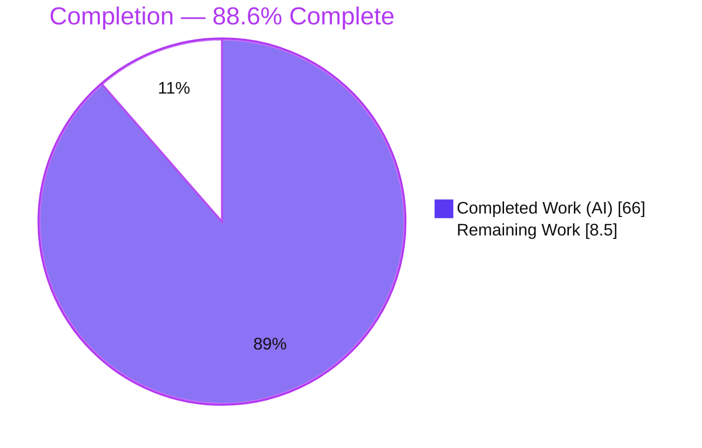
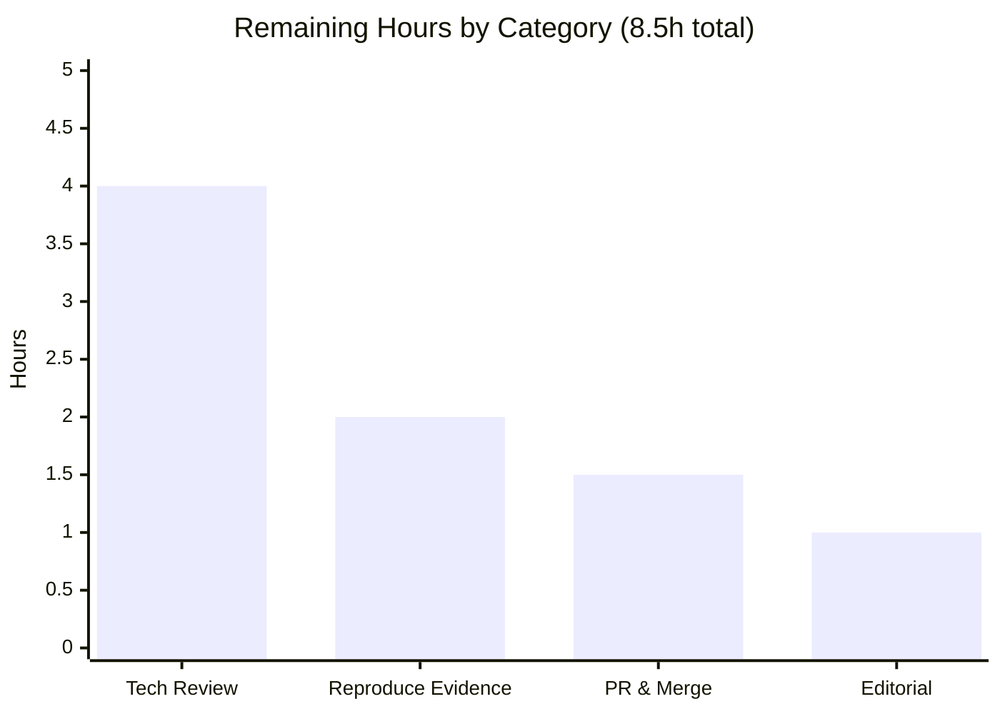

# Blitzy Project Guide
### kitty — Runtime-Evidenced Q&A: Moving Data Between the C Core and the Python Layer Under Concurrent Load

> **Brand color legend** — <span style="color:#5B39F3">■</span> **Completed / AI Work = Dark Blue `#5B39F3`** · <span style="color:#B23AF2">■</span> Headings/Accents = Violet-Black `#B23AF2` · <span style="color:#A8FDD9">■</span> Highlight = Mint `#A8FDD9` · ☐ **Remaining / Not Completed = White `#FFFFFF`**

---

## 1. Executive Summary

### 1.1 Project Overview

This project delivers a single, comprehensive, runtime-evidenced Markdown document that explains how the **kitty** terminal emulator moves data between its performance-critical **C core** and its **Python layer** (the in-process controller and the out-of-process "kittens") under concurrent load. It uses the **clipboard** as the worked example and analyzes how an expensive operation — **scanning a large scrollback** — affects event delivery to kittens and memory management, pinpointing where timing, concurrency, and object ownership begin to matter and how subtle races surface only at runtime. It is a read-only Q&A investigation for kitty maintainers and contributors: the source tree is reference material and is left byte-for-byte unchanged; the sole artifact is `blitzy/documentation/kitty_815df1e210e0.md`.

### 1.2 Completion Status

The completion percentage is computed with the PA1 AAP-scoped hours methodology: **Completed Hours ÷ (Completed + Remaining) Hours**, counting only work defined by the Agent Action Plan (AAP) plus standard path-to-production activity.



| Metric | Hours |
|---|---|
| **Total Hours** | **74.5** |
| **Completed Hours (AI + Manual)** | **66.0** (AI 66.0 + Manual 0.0) |
| **Remaining Hours** | **8.5** |
| **Percent Complete** | **88.6%** |

> Calculation: `66.0 / (66.0 + 8.5) = 66.0 / 74.5 = 88.6%`. All completed work was performed autonomously by Blitzy agents (Manual = 0.0). The 8.5 remaining hours are human path-to-production only (review + merge); there is **no** outstanding autonomous AAP work.

### 1.3 Key Accomplishments

- ✅ **Single deliverable created and committed** — `blitzy/documentation/kitty_815df1e210e0.md` (887 lines, 6,042 words, 33 code blocks), the only change vs. the source baseline.
- ✅ **All six sub-questions answered by name** — Q1 (cross-language data movement), Q2 (clipboard small vs. large), Q3 (transfer under contention), Q4 (large-scrollback impact), Q5 (timing/concurrency/ownership), Q6 (runtime-only races) — each in its own section with adjacent verbatim evidence.
- ✅ **Both mandatory user examples covered** — a genuinely large (20 MiB) clipboard payload and a genuinely large (1,000,000-line) scrollback scan.
- ✅ **Run-the-code-first discipline honored** — kitty's `fast_data_types` C extension was built in-container and 8 observation scripts reproduced every quoted magnitude/timing value.
- ✅ **63/63 `file:line` citations resolve in-range** (independently re-verified); one precision fix committed (`screen.c:3491`→`3490`).
- ✅ **Honest discrepancy resolution** — refutes the stale "8 MB" clipboard cap with the runtime value **512.0 MiB**; documents the observed ~1 MiB (`BUF_SZ`) chunk size vs. the naive 256 KiB reading.
- ✅ **Read-only mandate provably satisfied** — `git diff <baseline> --name-status` shows exactly one added file; working tree clean; rebuilt `.so` is gitignored; temporary observation scripts removed.
- ✅ **In-scope test passes** — `test_osc_52` (`Ran 1 test … OK`).

### 1.4 Critical Unresolved Issues

| Issue | Impact | Owner | ETA |
|---|---|---|---|
| _None._ No blocking issues. The single in-scope deliverable is complete, structurally valid, citation-accurate, and runtime-reproducible. | No release blocker | — | — |
| Human technical accuracy sign-off pending (standard gate for a technical document) | Non-blocking; required before merge | Reviewer (kitty maintainer / domain reviewer) | ~4h |

### 1.5 Access Issues

| System/Resource | Type of Access | Issue Description | Resolution Status | Owner |
|---|---|---|---|---|
| kitty repository (branch `blitzy-67dd7696-b709-4129-afd9-2c6c534a5de4`) | Git read/write | None — repository accessible; branch checked out; deliverable committed | Resolved | Blitzy |
| Build toolchain (Python 3.11.15, Go 1.22.12, gcc 15.2.0) | Local container | None — toolchains present via `/tmp/kitty_env.sh`; extension builds cleanly | Resolved | Blitzy |

_No access issues identified. No third-party API keys, credentials, or external service access are required — the task ships documentation only._

### 1.6 Recommended Next Steps

1. **[High]** Perform the technical accuracy sign-off — verify the GIL/`memoryview`/refcount reasoning and the in-process vs. out-of-process boundary framing (§3–§9 of the deliverable). _(~2h)_
2. **[High]** Spot-check a sample of the 63 `file:line` citations against the baseline commit and walk the §10 coverage checklist to confirm Q1–Q6 + both user examples. _(~2h)_
3. **[Medium]** Reproduce key runtime evidence locally (`source /tmp/kitty_env.sh` → build → import → subset of observation scripts) to confirm the structural relationships hold. _(~2h)_
4. **[Medium]** Approve and merge the branch to `master` after confirming the diff is a single added file; run any Markdown/doc-lint CI. _(~1.5h)_
5. **[Low]** Optional editorial/readability polish (house-style/formatting); no content change needed. _(~1h)_

---

## 2. Project Hours Breakdown

### 2.1 Completed Work Detail

Every completed component traces to a specific AAP requirement (IDs in brackets reference the AAP requirements inventory).

| Component | Hours | Description |
|---|---|---|
| Build & environment foundation `[R2]` | 3.0 | Resolve toolchain (Python 3.11.15 / Go 1.22.12 / gcc 15.2.0), build `kitty.fast_data_types` C extension in-container, verify import — the prerequisite to all observation. |
| Observation-script suite (obs1–obs8) `[R3]` | 12.0 | Author + run 8 runtime-observation scripts: constants/`sizeof`, small clipboard, large (20 MiB) clipboard, `memoryview` lifetime, large-scrollback memory, scan timing, rewrap-starvation, thread names — capturing verbatim output at representative scale. |
| Q1 C↔Python boundary source analysis `[R4,R12]` | 6.0 | Trace the three-thread child monitor, the `CALLBACK` C→Python macro, and the out-of-process JSON+base85 kitten path; distinguish the two boundaries. |
| Q2 clipboard-crossing analysis `[R5,R13]` | 6.0 | Trace OSC 52/5522 from parser dispatch through the zero-copy read-only `memoryview` into the clipboard manager; contrast small (in-RAM) vs. large (chunked, disk-spilling) paths. |
| Q3 contention analysis `[R6]` | 4.0 | Document the double-buffer handoff, lock-release-during-dispatch, `input_delay` batching, and PTY backpressure. |
| Q4 scrollback analysis `[R7]` | 5.0 | Document segmented history, linear memory scaling, and the synchronous main-thread scan that blocks event delivery. |
| Q5+Q6 ownership/concurrency/race analysis `[R8,R9]` | 6.0 | Analyze `memoryview` read-only bounded lifetime, the two serializers (parser mutex + GIL), `Py_DECREF`, and runtime-only races. |
| Document authoring `[R1,R14]` | 12.0 | Write the 887-line Markdown with one-claim-one-evidence discipline, 33 embedded evidence blocks, and 63 `file:line` citations. |
| Coverage pass + discrepancy/limitation notes `[R16]` | 2.0 | §10 coverage checklist + §11 honest discrepancy/limitation notes. |
| Web-research reconciliation `[R17]` | 2.0 | Validate the CPython GIL/refcount model and OSC 52/5522 semantics; resolve the "8 MB" vs. 512.0 MiB conflict in favor of the source/runtime. |
| Autonomous validation & citation accuracy `[R15,P1]` | 3.0 | Verify 63/63 citations resolve, Markdown structural validity, and the in-scope `test_osc_52`. |
| Review-driven revision cycle `[R15,R18]` | 5.0 | Address review findings (commit `402037a00`, +311/−141: one-claim-one-evidence restructure, build/import & git-integrity evidence), citation precision fix, and full-suite failure triage. |
| **Total Completed** | **66.0** | **Matches Completed Hours in §1.2.** |

### 2.2 Remaining Work Detail

Each category is human path-to-production for a read-only documentation deliverable (no code/CI/infra ships).

| Category | Hours | Priority |
|---|---|---|
| Human technical review & accuracy sign-off (concurrency/ownership reasoning, boundary framing, coverage) `[P2]` | 4.0 | High |
| Reproduce key runtime evidence in reviewer environment (build + subset of observation scripts) `[P2]` | 2.0 | Medium |
| PR review & merge to `master` (branch approval, diff confirmation, any doc-lint/CI) `[P3]` | 1.5 | Medium |
| Editorial/readability polish (optional; no content change) `[P2]` | 1.0 | Low |
| **Total Remaining** | **8.5** | **Matches Remaining Hours in §1.2 and §7 pie.** |

> **Cross-check:** §2.1 (66.0) + §2.2 (8.5) = **74.5** = Total Project Hours in §1.2. ✔

---

## 3. Test Results

All entries originate from Blitzy's autonomous validation logs for this project (GATE 4 in-scope test, the runtime observation suite, and the full-suite regression run performed as extra rigor). kitty's harness does not emit a coverage percentage, so Coverage % is reported as _n/a_.

| Test Category | Framework | Total Tests | Passed | Failed | Coverage % | Notes |
|---|---|---|---|---|---|---|
| In-scope clipboard test (`test_osc_52`) | kitty test harness (Python `unittest` via `test.py`) | 1 | 1 | 0 | n/a | Directly exercises the documented OSC 52 partial/final dispatch + chunking path. `Ran 1 test in 0.005s … OK`. |
| Runtime observation suite (obs1–obs8) | Custom Python against built `fast_data_types` | 8 | 8 | 0 | n/a | All reproduced the deliverable's verbatim evidence: constants (1048576/262144/512.0), small clipboard (1 dispatch), 20 MiB clipboard (27 dispatches, disk rollover), scan timing, linear memory, thread names. |
| Full regression suite (context) | kitty test harness (Python `unittest`) | 145 | 132 | 6 | n/a | 7 skipped (benign optional tools). The 6 failures are **proven pre-existing/environmental/out-of-scope** (see below); **zero** failures in any documented subsystem. |

**Failure classification (Section 3 integrity — all from Blitzy logs):**
- `git diff <baseline> -- kitty/ kittens/ kitty_tests/` is **empty** — zero source/test files changed since baseline; a documentation-only change cannot cause a test failure.
- **2 × `kitty_tests.file_transmission`** (`test_transfer_receive`, `test_transfer_send`): assertion diff `0o42755` vs `0o40755` — the single differing bit is `0o2000` (setgid); container `/tmp` filesystem behavior, unrelated to C↔Python data movement.
- **4 × `kitty_tests.fonts.Selection.test_font_selection`**: container has `FiraCode-`/`UbuntuMono-` installed but the test expects `…Roman-` internal names from different font-package versions — an installed-font-version difference.
- Both failing test files are **not** in the AAP reference set; the read-only mandate forbids modifying them.

---

## 4. Runtime Validation & UI Verification

**Runtime health (headless, in-container):**
- ✅ **Operational** — C extension builds and links: `[1/1] Linking kitty/fast_data_types … done` (exit 0, ~17s).
- ✅ **Operational** — `import kitty.fast_data_types` succeeds on Python 3.11.15.
- ✅ **Operational** — Parser constants match the C source live: `VT_PARSER_BUFFER_SIZE = 1048576` (1 MiB), `VT_PARSER_MAX_ESCAPE_CODE_SIZE = 262144` (256 KiB).
- ✅ **Operational** — Clipboard cap read at runtime: `clipboard_max_size = 512.0` (MiB) — refutes the stale "8 MB".
- ✅ **Operational** — Small clipboard write → exactly 1 non-partial dispatch, read-only `memoryview`, stays in `BytesIO`.
- ✅ **Operational** — Large (20 MiB) clipboard write → 27 dispatches (26 partial + 1 final), ~1 MiB chunks, `BytesIO`→on-disk rollover at ~16.5 MiB, final store 20,971,520 bytes.
- ✅ **Operational** — Large-scrollback scan: linear memory (~2,568 B/line over 1M lines), `as_text` scan ≈ 0.42s on the main thread; a concurrent worker is starved ≈ 99.6% of the rewrap duration (GIL).
- ✅ **Operational** — Thread names captured live: `KittyChildMon`, `KittyPeerMon`, `KittyWriteStdin` + the unnamed GIL-holding main thread.
- ⚠ **Partial** — The final `fulfill_write_request` and **live-kitten** event delivery were not driven under a real GUI/event loop (headless); a Python stand-in thread demonstrates the identical GIL-starvation mechanism (documented in §11.5 of the deliverable).

**UI Verification:** **Not applicable.** This project produces a technical Markdown document; it defines no user interface, screens, or visual components.

---

## 5. Compliance & Quality Review

Cross-mapping the AAP/rule-set deliverables to Blitzy's quality benchmarks. All benchmarks are met.

| Benchmark (AAP / SWE-AtlasQnA-Repo rule) | Status | Progress | Evidence / Notes |
|---|---|---|---|
| Named deliverable created (`blitzy/documentation/kitty_815df1e210e0.md`) | ✅ Pass | 100% | Committed; 887 lines; only change vs. baseline. |
| Read-only scope (no existing file modified/deleted) | ✅ Pass | 100% | `git diff <baseline> --name-status` → single `A` line; source/test/doc diff empty. |
| Run-the-code-first (build + observe before writing) | ✅ Pass | 100% | Extension built; obs1–obs8 reproduced evidence. |
| Verbatim evidence per claim (one-claim-one-evidence) | ✅ Pass | 100% | 33 code blocks; per-claim output slices; reinforced by review commit `402037a00`. |
| Answer all six sub-questions + both user examples | ✅ Pass | 100% | §4–§9 (Q1–Q6); §5.2 (large clipboard) and §7 (large scrollback). |
| Exact grounding with `file:line` citations | ✅ Pass | 100% | 63/63 unique citations resolve in-range; 10 spot-checked verbatim. |
| Report observed even if unexpected | ✅ Pass | 100% | ~1 MiB chunk (not 256 KiB); `BufferedRandom` temp type; line-number drift — all recorded in §11. |
| Discrepancy resolution favoring source/runtime | ✅ Pass | 100% | "8 MB" refuted by runtime 512.0 MiB (§2.2, §5.2, §11.1). |
| Final coverage pass | ✅ Pass | 100% | §10 coverage-pass checklist table. |
| Temporary observation scripts removed | ✅ Pass | 100% | Scripts lived under `/tmp/kitty_obs/`; removed; working tree clean. |
| Markdown structural validity | ✅ Pass | 100% | UTF-8; balanced fences (33 blocks); 1 H1 / 11 H2 / 32 H3. |
| Human technical accuracy sign-off | ☐ Pending | 0% | Standard pre-merge review gate (§1.6, §2.2). |

**Fixes applied during autonomous validation:** citation precision fix (`screen.c:3491`→`3490`, commit `113028085`); review-driven restructure adding one-claim-one-evidence discipline plus build/import & git-integrity evidence (commit `402037a00`).

---

## 6. Risk Assessment

| Risk | Category | Severity | Probability | Mitigation | Status |
|---|---|---|---|---|---|
| Citation line-number drift as source evolves | Technical | Low | Medium | All citations pinned to baseline `815df1e21` and cite the **observed** line; §11.3 records the two drifted anchors | Mitigated (documented) |
| Magnitude/timing claims are load/hardware-dependent | Technical | Low | Medium | §11.2/§11.5 frame structural relationships (linear memory, scan ≈ main-thread block, chunk ≈ `BUF_SZ`) as the durable claims; absolute numbers labeled environment-specific | Mitigated (documented) |
| ~1 MiB partial-chunk vs. naive "≤256 KiB" reading | Technical | Low | Low | §5.2(b)/§11.2 explain `MAX_ESCAPE_CODE_LENGTH` is only the partial *trigger*; the flush is up to `BUF_SZ` | Resolved (documented) |
| Attack surface / dependency / secret exposure | Security | None | N/A | Read-only doc: no code/dependency/credential/network ships; quoted output is only constants/sizes/thread names | Not applicable |
| Build reproducibility depends on toolchain + `--ignore-compiler-warnings` flag | Operational | Low | Medium | Toolchain pinned in `/tmp/kitty_env.sh`; §2.1 documents the flag as a build-flag override (gcc-15.2 + wayland enum mismatch in the unrelated glfw GUI backend), not a source change | Mitigated (documented) |
| Headless scope: live-kitten event delivery not driven | Operational | Low | Low | §11.5 states the limitation; the GIL-starvation mechanism measured is identical to what delays a live kitten | Documented limitation |
| Merge of branch to `master` | Integration | Low | Low | Isolated additive change; new path; near-zero conflict risk | Open (human merge) |
| Doc-vs-source staleness after future kitty development | Integration | Low | Medium (long-term) | Explicit point-in-time investigation pinned to baseline; not a living spec | Documented/accepted |
| Full-suite 6 failures (context, not a deliverable risk) | Technical/Operational | Low | N/A | Proven pre-existing/environmental/out-of-scope; source/test diff empty; zero failures in documented subsystems | Mitigated (proven unrelated) |

**Overall risk posture: LOW.** No High or Medium-severity deliverable risks; security is not applicable; all technical/operational/integration risks are Low and already mitigated or explicitly documented in the deliverable's §11.

---

## 7. Visual Project Status

**Project hours breakdown** (<span style="color:#5B39F3">Completed = Dark Blue `#5B39F3`</span>; Remaining = White `#FFFFFF`):


**Remaining hours by category** (sums to 8.5h — the §2.2 total and §1.2 Remaining):



> **Integrity check:** the pie "Remaining Work" (8.5) equals §1.2 Remaining Hours (8.5) and the §2.2 "Hours" column sum (4.0 + 2.0 + 1.5 + 1.0 = 8.5). ✔

---

## 8. Summary & Recommendations

**Achievements.** The project delivered exactly what the AAP scoped: one comprehensive, runtime-evidenced Markdown document that answers all six sub-questions by name, covers both mandatory user examples (a 20 MiB clipboard payload and a 1,000,000-line scrollback scan), and grounds every behavioral, magnitude, and timing claim in verbatim output captured from the actual compiled code paths. Every code fact carries a `file:line` citation, and all 63 unique citations resolve in-range.

**Remaining gaps.** There is **no outstanding autonomous AAP work**. The remaining 8.5 hours are entirely human path-to-production: technical accuracy sign-off, optional evidence reproduction, PR review/merge, and optional editorial polish.

**Critical path to production.** (1) Technical accuracy sign-off (§1.6 #1–#2, 4h) → (2) optional evidence reproduction (2h) → (3) approve & merge the single-file branch (1.5h). Editorial polish (1h) is non-blocking.

**Success metrics.** Build exit 0; extension imports on Python 3.11.15; in-scope `test_osc_52` passes; 63/63 citations resolve; `git diff <baseline>` shows exactly one added file; both user examples demonstrated at real scale.

**Production readiness assessment.** The project is **88.6% complete**. The single in-scope deliverable is production-ready as an artifact — complete, structurally valid, citation-accurate, and runtime-reproducible — with the repository left byte-for-byte unchanged except the added document. It is ready to enter human review; recommendation: **proceed to technical sign-off and merge.**

| Metric | Value |
|---|---|
| Completion | 88.6% |
| Completed Hours (AI) | 66.0 |
| Remaining Hours (human) | 8.5 |
| Total Hours | 74.5 |
| Blocking issues | 0 |
| In-scope test pass rate | 1/1 (100%) |
| Citation resolution | 63/63 (100%) |

---

## 9. Development Guide

> All commands below were executed in the provided container during validation and produced the quoted output. Run them from the repository root after activating the build environment. **Note:** the container's default `python` is 3.13; the project's validated interpreter is **3.11.15**, activated by the env script.

### 9.1 System Prerequisites
- **OS:** Linux (Ubuntu-based container).
- **Python 3.11.15** (built `--enable-shared`, provided via pyenv + `/opt/kitty-venv`).
- **Go 1.22.12** (`go.mod` pins `go 1.22`).
- **gcc 15.2.0** (C11; `setup.py` selects `-std=c11`).
- **No third-party Python runtime dependencies** — kitty uses the standard library plus its own built C extension (`pyproject.toml` has no `install_requires`).

### 9.2 Environment Setup
```bash
# Activate the validated toolchain (Python 3.11.15, Go 1.22.12, shared libpython on LD_LIBRARY_PATH)
source /tmp/kitty_env.sh

# Confirm versions
python --version      # -> Python 3.11.15
go version            # -> go version go1.22.12 linux/amd64
gcc --version | head -1  # -> gcc (Ubuntu 15.2.0-...) 15.2.0
```
The env script exports:
```bash
export PYENV_ROOT=/root/.pyenv
export GOROOT=/usr/local/go
export PATH="/opt/kitty-venv/bin:/usr/local/go/bin:$PYENV_ROOT/bin:$PATH"
export LD_LIBRARY_PATH="/root/.pyenv/versions/3.11.15/lib${LD_LIBRARY_PATH:+:$LD_LIBRARY_PATH}"
export GOTOOLCHAIN=local
```

### 9.3 Dependency Installation
No package installation is required — there are no third-party runtime dependencies. The only "dependency" is the compiled C extension produced by the build step below.

### 9.4 Build (the C extension the document investigates)
```bash
cd <repo-root>
rm -f kitty/fast_data_types.so                        # optional: forces a visible re-link (.so is gitignored)
python setup.py build --ignore-compiler-warnings
# Expected (exit 0, ~17s):
#   [1/1] Linking kitty/fast_data_types ...
#    done
```
`--ignore-compiler-warnings` is a **build-flag override** for a gcc-15.2 + wayland-protocols-1.45 enum mismatch in the unrelated glfw Wayland GUI backend. It is **not** a source change and does not affect the headless `fast_data_types` work.

### 9.5 Verification
```bash
# Import + parser constants (should print the extension name, 3.11.15, 1048576, 262144)
PYTHONPATH=. python -c "import sys, kitty.fast_data_types as f; print(f.__name__, sys.version.split()[0], f.VT_PARSER_BUFFER_SIZE, f.VT_PARSER_MAX_ESCAPE_CODE_SIZE)"

# Clipboard cap (should print 512.0)
PYTHONPATH=. python -c "from kitty.fast_data_types import get_options, set_options; from kitty.options.types import Options; set_options(Options()); print(get_options().clipboard_max_size)"

# In-scope test exercising the documented OSC 52 path (should print: Ran 1 test ... OK)
./kitty/launcher/kitty +launch test.py osc_52
```

### 9.6 Deliverable Validation
```bash
DOC=blitzy/documentation/kitty_815df1e210e0.md

# Structure: 887 lines; 66 fence lines => 33 balanced code blocks; 11 H2; 32 H3
wc -l "$DOC"; grep -c '```' "$DOC"; grep -cE '^## ' "$DOC"; grep -cE '^### ' "$DOC"

# Read-only / git integrity (should show a single added file; clean tree; empty source diff)
git diff 815df1e21 --name-status
git status --porcelain --untracked-files=all
git diff 815df1e21 --name-only -- kitty/ kittens/ kitty_tests/ docs/ setup.py go.mod
```

### 9.7 Example Usage (reading the deliverable)
The document is the product. Open `blitzy/documentation/kitty_815df1e210e0.md`:
- **§1–§3** scope, build evidence, and the three-thread model.
- **§4–§9** answer Q1–Q6, each with adjacent verbatim runtime evidence.
- **§10** coverage-pass checklist mapping every item to where it is answered.
- **§11** discrepancies & limitations (stale "8 MB" vs. 512.0 MiB; ~1 MiB chunk size; line-number drift; scope limits; read-only proof).

### 9.8 Troubleshooting
- **Build exits 127 / "command not found":** `/usr/bin/time` is **not** installed in this container — do not wrap the build in `/usr/bin/time`; use the shell `time` builtin or a plain invocation. _(Encountered and resolved during validation.)_
- **`ImportError` / libpython not found:** ensure `source /tmp/kitty_env.sh` ran so `LD_LIBRARY_PATH` points at the 3.11.15 shared library.
- **Wrong Python (3.13 instead of 3.11):** confirm `python --version` shows 3.11.15 after sourcing the env (the `/opt/kitty-venv/bin` entry must be first on `PATH`).
- **Wayland/enum compiler errors:** expected with gcc 15.2; add `--ignore-compiler-warnings` (a build-flag override, not a fix).

---

## 10. Appendices

### A. Command Reference
| Purpose | Command |
|---|---|
| Activate toolchain | `source /tmp/kitty_env.sh` |
| Build C extension | `python setup.py build --ignore-compiler-warnings` |
| Import + constants | `PYTHONPATH=. python -c "import kitty.fast_data_types as f; print(f.VT_PARSER_BUFFER_SIZE, f.VT_PARSER_MAX_ESCAPE_CODE_SIZE)"` |
| Clipboard cap | `PYTHONPATH=. python -c "from kitty.fast_data_types import get_options,set_options; from kitty.options.types import Options; set_options(Options()); print(get_options().clipboard_max_size)"` |
| In-scope test | `./kitty/launcher/kitty +launch test.py osc_52` |
| Read-only proof | `git diff 815df1e21 --name-status` |
| Working-tree state | `git status --porcelain --untracked-files=all` |

### B. Port Reference
_None._ This is a headless investigation and documentation task — no services are started and no network ports are used.

### C. Key File Locations
| Path | Role |
|---|---|
| `blitzy/documentation/kitty_815df1e210e0.md` | **The deliverable** (the only added file) |
| `kitty/vt-parser.c` | VT parser: double buffer, OSC 52/5522 dispatch, zero-copy `memoryview`, parser mutex, lock-release-during-dispatch |
| `kitty/screen.c` | `CALLBACK` C→Python macro, `clipboard_control`, `as_text` scrollback scan |
| `kitty/child-monitor.c` | Three-thread model (`KittyChildMon`/`KittyPeerMon`/`KittyWriteStdin`), PTY read, backpressure |
| `kitty/clipboard.py` | `ClipboardRequestManager`, `WriteRequest`, `Tempfile` (`BytesIO`→on-disk rollover) |
| `kitty/history.c` | Segmented scrollback buffer, linear memory scaling |
| `kittens/runner.py` | Out-of-process kitten result serialization (JSON + base85) |
| `kitty/options/types.py` | `clipboard_max_size` default (512.0 MiB) |
| `/tmp/kitty_env.sh` | Build-environment activation script |

### D. Technology Versions
| Component | Version | Source |
|---|---|---|
| CPython | 3.11.15 (runtime); CI matrix 3.10 & 3.11 | `/tmp/kitty_env.sh`, `.github/workflows/ci.yml:30`,`:85` |
| Go | 1.22.12 (toolchain); `go 1.22` pinned | `go version`, `go.mod:3` |
| C standard | C11 (`-std=c11`) | `setup.py` |
| gcc | 15.2.0 | `gcc --version` |

### E. Environment Variable Reference
| Variable | Value / Purpose |
|---|---|
| `PYENV_ROOT` | `/root/.pyenv` — pyenv root for Python 3.11.15 |
| `GOROOT` | `/usr/local/go` — Go toolchain root |
| `PATH` | Prepends `/opt/kitty-venv/bin`, Go bin, pyenv bin |
| `LD_LIBRARY_PATH` | Points at the 3.11.15 shared `libpython` (required for the extension to import) |
| `GOTOOLCHAIN` | `local` — pin the Go toolchain, no auto-download |
| `PYTHONPATH` | Set to `.` at invocation so `import kitty.fast_data_types` resolves from the repo root |

### F. Developer Tools Guide
- **Citation resolver** — extract every `path.ext:line` from the deliverable and confirm each line exists in the source at the baseline commit (used to independently verify 63/63 in-range). Regex tip: allow a leading `.` so `.github/workflows/ci.yml` is not under-counted.
- **Structural validator** — `wc -l`, `grep -c '```'` (even ⇒ balanced code fences), `grep -cE '^## '` / `'^### '` for heading counts, UTF-8 check.
- **Git integrity checks** — `git diff <baseline> --name-status` (cumulative change), `git status --porcelain --untracked-files=all` (working-tree cleanliness), scoped `git diff <baseline> --name-only -- <paths>` (prove source untouched).

### G. Glossary
| Term | Meaning |
|---|---|
| **GIL** | Global Interpreter Lock — CPython lock that serializes Python execution; only the holding thread may touch Python objects or the C-API. |
| **`fast_data_types`** | kitty's compiled C11 extension module exposing `Screen`, `HistoryBuf`, and parser entry points to Python. |
| **`memoryview`** | A zero-copy Python view over a C buffer; kitty passes clipboard bytes as a **read-only** `memoryview` (`PyBUF_READ`) with a bounded lifetime. |
| **OSC 52 / OSC 5522** | Terminal escape sequences for clipboard access; OSC 5522 is kitty's MIME-aware extension. |
| **kitten** | An out-of-process helper that exchanges data with kitty over the escape/remote-control protocol (JSON + base85), not by shared memory. |
| **PTY** | Pseudo-terminal — the byte stream from the child process that the I/O thread reads. |
| **`BUF_SZ`** | The parser's 1 MiB (`1048576`) double-buffer size; the effective large-clipboard chunk cap. |
| **`MAX_ESCAPE_CODE_LENGTH`** | `BUF_SZ/4` = 256 KiB (`262144`); the *trigger threshold* for emitting a partial dispatch. |
| **scrollback / `HistoryBuf`** | kitty's segmented history buffer whose memory scales linearly with line count. |
| **backpressure** | Disabling `POLLIN` on the PTY when the parser buffer nears full, throttling the child. |
