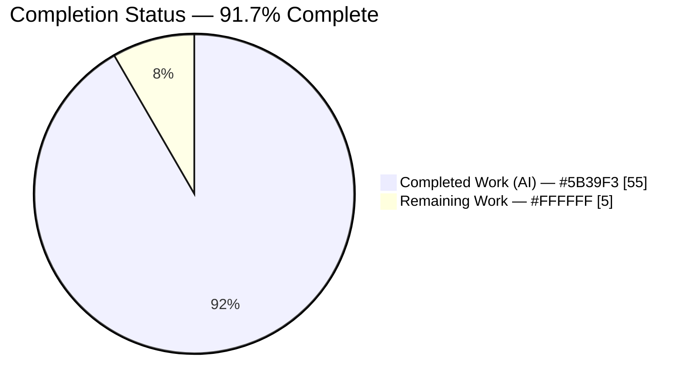
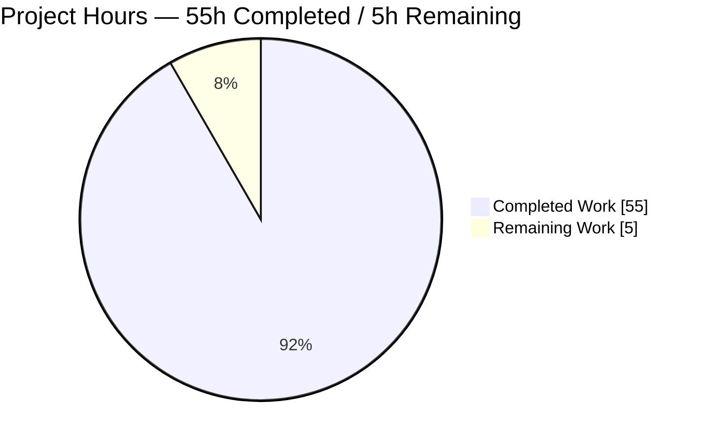
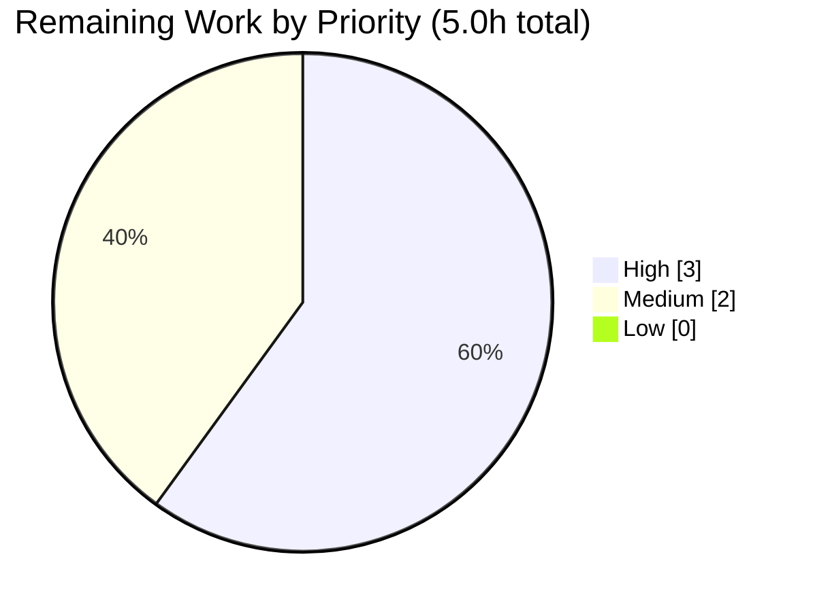

# Blitzy Project Guide

> **Deliverable:** `blitzy/documentation/kitty_815df1e210e0.md` — a read-only runtime investigation (Q&A) of the kitty terminal emulator
> **Repository:** kovidgoyal/kitty @ base commit `815df1e210e0a9ab4622f5c7f2d6891d7dbeddf1`
> **Branch:** `blitzy-8842e805-1a59-4efe-ad77-f5c3cfe88349` · **HEAD:** `cd77dd9f0` · **Working tree:** CLEAN
>
> **Legend (Blitzy brand colors):** 🟦 Completed / AI Work = Dark Blue `#5B39F3` · ⬜ Remaining / Not Completed = White `#FFFFFF`

---

## 1. Executive Summary

### 1.1 Project Overview

This project produces a single, comprehensive answer document that explains — from **directly observed runtime behavior** — how the kitty terminal emulator handles a stream of Zero-Width-Joiner (ZWJ) codepoints that form a multi-codepoint emoji when the terminal has almost no space (a one-by-one cell), what the cell ultimately contains once processing settles, and how a subsequent control-sequence state query (`CSI 6 n` / DSR-CPR) reflects that handling. It is a **read-only investigation** against the existing kitty C engine, not a feature or bug-fix task: the engine is built and driven through its real VT parser, and every claim is grounded in captured output plus a `file:line` citation. The target audience is engineers seeking a practical, evidence-backed understanding of how normalization, grapheme breaking, and state reporting interact under extreme buffer constraints.

### 1.2 Completion Status

The completion percentage is computed using the AAP-scoped, hours-based methodology: **Completed Hours / (Completed + Remaining) × 100**. All AAP deliverables are fully delivered and validated; the figure is held below 100% only by genuine human path-to-production work that cannot be performed autonomously.



<p><strong>Completion: 91.7%</strong> &nbsp;|&nbsp; 🟦 Completed = <code>#5B39F3</code> &nbsp;|&nbsp; ⬜ Remaining = <code>#FFFFFF</code></p>

| Metric | Hours |
|---|---|
| **Total Hours** | **60.0** |
| Completed Hours (AI + Manual) | 55.0 (AI: 55.0 · Manual: 0.0) |
| Remaining Hours | 5.0 |
| **Percent Complete** | **91.7%** |

> **Formula:** `55.0 / (55.0 + 5.0) × 100 = 91.67% ≈ 91.7%`

### 1.3 Key Accomplishments

- ✅ **Built the real engine and observed genuine behavior** — the kitty C extension (`kitty.fast_data_types`) was compiled and driven through the **canonical VT parser entry point** (`parse_bytes` → `test_create/commit/parse_written_data`), never a bypassing interface.
- ✅ **Answered all four objectives with evidence** — OBJ-1 (retention under constraint), OBJ-2 (settled cell content), OBJ-3 (state reporting), OBJ-4 (interaction of normalization / grapheme breaking / reporting), each with observed output and `file:line` citations.
- ✅ **Primary case reproduced and stable** — family ZWJ `👨‍👩‍👧‍👦` into a 1×1 cell settles to the single visible codepoint `'👦'` (U+1F466); cursor advances to (2, 0); `CSI 6 n` replies `b'\x1b[1;2R'` — byte-identical across repeated runs.
- ✅ **Exhaustive secondary coverage** — VS15/VS16 width flips, regional-indicator flag pairs, skin-tone modifiers, `cc_idx` three-slot overflow, wide-grid contrast, and related reports (DSR-5, DA, DA>, size, DECRPM, DECRQSS).
- ✅ **Critical memory-safety finding surfaced and disclosed** — width-2 base into a one-column line is an out-of-bounds write (a **pre-existing engine defect**), reproduced deterministically and documented with full runtime evidence and source trace.
- ✅ **Read-only rule upheld** — `git diff 815df1e21..HEAD` = exactly one added file; all 14 cited source files unchanged; temporary observation scripts created outside the repo and removed; working tree clean.
- ✅ **Autonomous validation green** — 46/46 golden assertions pass; captured-output MD5 `77a2325f…` / SHA-256 `d26db8c1…` match the document exactly.

### 1.4 Critical Unresolved Issues

| Issue | Impact | Owner | ETA |
|---|---|---|---|
| Pre-existing engine memory-safety defect (§4.6): width-2 base into a 1-column line writes one cell out of bounds | None to the deliverable (correctly disclosed, not fixed); relevant to kitty upstream. Out of scope to fix per the read-only rule | Human maintainer (upstream filing) | 1.5h (see Task T3) |
| Human technical review & sign-off of the answer document | Standard release gate; blocks final publication until an expert confirms objective coverage and citations | Human reviewer | 3.0h (Tasks T1–T2) |

> There are **no unresolved defects in the deliverable itself**. The single behavioral defect is a pre-existing engine issue that is disclosed with evidence rather than fixed.

### 1.5 Access Issues

| System/Resource | Type of Access | Issue Description | Resolution Status | Owner |
|---|---|---|---|---|
| — | — | **No access issues identified.** The build/run environment, source repository, and toolchain were fully available; the engine built and imported cleanly and the canonical entry point was exercised without restriction. | N/A | — |

### 1.6 Recommended Next Steps

1. **[High]** Perform expert technical review of the answer document — confirm OBJ-1..OBJ-4 are correctly answered and spot-check a sample of the ~110 `file:line` citations against commit `815df1e21` (Task T1).
2. **[High]** Validate the §4.6 memory-safety finding and its runtime evidence; confirm the disclose-only disposition is complete and correct (Task T2).
3. **[Medium]** File the disclosed §4.6 pre-existing engine out-of-bounds-write defect with the kitty maintainers, attaching the §4.6/§10.1 reproduction (Task T3).
4. **[Medium]** Review and merge the documentation branch (single additive file) (Task T4).

---

## 2. Project Hours Breakdown

### 2.1 Completed Work Detail

Every completed component traces to a specific AAP requirement and is validated by the autonomous logs (46/46 assertions) and repository evidence.

| Component | Hours | Description |
|---|---:|---|
| Environment build, toolchain & version/caveat documentation | 5.0 | AAP §0.6/§0.8.1 — canonical `python3 setup.py build`, versions, sandbox `--ignore-compiler-warnings` caveat (doc §2.1–§2.3) |
| Canonical observation harness (real VT parser entry point) | 5.0 | AAP §0.3.1/§0.4 — driving `parse_bytes` → `test_create/commit/parse_written_data`; reply capture via `Callbacks.wtcbuf` (doc §3) |
| OBJ-1 retention analysis incl. §4.6 out-of-bounds discovery | 9.0 | AAP OBJ-1 — `CPUCell` 3-slot model, `line_add_combining_char` fill/overflow, width-2 placement, memory-safety finding (doc §4) |
| OBJ-2 settled cell content | 2.5 | AAP OBJ-2 — surviving codepoints via `cell_as_unicode`/`str(line)`/`as_ansi` (doc §5) |
| OBJ-3 state reporting (`CSI 6 n` + related reports) | 4.5 | AAP OBJ-3 — DSR/CPR reply bytes from `report_device_status`, plus DA/DSR-5/size/DECRPM/DECRQSS (doc §6) |
| OBJ-4 normalization / grapheme / reporting interaction | 3.5 | AAP OBJ-4 — no normalization pass, no UAX #29 state machine; width + combining-membership classification (doc §7) |
| Secondary-condition coverage | 7.0 | AAP §0.5.1/§0.3.5 — VS15/VS16, regional-indicator flags, skin-tone, `cc_idx` overflow, wide-grid contrast (doc §7.5–§7.7, §6.3) |
| Answer-document authoring | 11.0 | AAP §0.3.3 — 2,099 lines, ~110 citations, 10 internal sections, prose + embedded observation blocks |
| Citation audit + QA / code-review resolution | 5.0 | AAP §0.7 — audit of 110 `file:line` refs; 4 corrections; QA + code-review resolution across 4 commits |
| Reproducibility (≥2 runs, hashes) + cleanup + repo-integrity | 2.5 | AAP §0.7/§0.8.2 — byte-identical repeat runs, output hashes, temp-script cleanup, clean working tree (doc §2.5–§2.6) |
| **Total Completed** | **55.0** | **Matches Completed Hours in §1.2** |

### 2.2 Remaining Work Detail

All remaining work is human path-to-production activity; none of it can be performed autonomously. Each item traces to a path-to-production need for the AAP deliverable.

| Category | Hours | Priority |
|---|---:|---|
| Human technical review & sign-off of answer document (objective coverage + citation spot-check + hash confirmation) | 3.0 | High |
| File disclosed §4.6 pre-existing engine defect upstream (out of scope to fix per read-only rule) | 1.5 | Medium |
| PR review & merge of documentation branch | 0.5 | Medium |
| **Total Remaining** | **5.0** | **Matches Remaining Hours in §1.2 and §7 pie** |

### 2.3 Hours Reconciliation

| Check | Result |
|---|---|
| §2.1 Completed total | 55.0h |
| §2.2 Remaining total | 5.0h |
| §2.1 + §2.2 | 60.0h = **Total Project Hours** (§1.2) ✅ |
| Completion % | 55.0 / 60.0 = **91.7%** ✅ |

---

## 3. Test Results

All tests below originate from **Blitzy's autonomous validation logs** for this project. For this documentation task, the "test suite" is the deliverable's embedded observation script (§10.1), extracted verbatim and executed **outside the repository** through the real VT parser; each assertion is a golden check of a documented runtime value.

| Test Category | Framework | Total Tests | Passed | Failed | Coverage % | Notes |
|---|---|---:|---:|---:|---:|---|
| Golden runtime assertions (observation script) | Python 3.13 + `kitty.fast_data_types` via canonical `parse_bytes` | 46 | 46 | 0 | 100% of documented values | Byte-exact; output MD5 `77a2325f…`, SHA-256 `d26db8c1…` match doc |
| Canonical build | `python3 setup.py build` (gcc 15.2.0) | 1 | 1 | 0 | — | EXIT 0; engine translation units warning-clean |
| Import / smoke | CPython import check | 1 | 1 | 0 | — | `Screen`, `Line`, `Cursor` present |
| Runtime memory-safety reproduction (§4.6) | debug-allocator / glibc hardening / accumulation | 3 scenarios (3/3, 2/2, 3/3) | reproduced deterministically | 0 flaky | — | EXIT 134 / 134 / 139 — confirms disclosed defect |
| Repository integrity | `git diff 815df1e21..HEAD` | 1 | 1 | 0 | — | Exactly 1 added file; 14 cited sources unchanged |

**Assertion coverage (representative):** family ZWJ → 1×1 (`'👦'`, cursor (2,0), history `['👧\u200d','👩\u200d','👨\u200d','']`, `CSI 6 n`→`b'\x1b[1;2R'`); VS16 U+2764 (1×1 `b'\x1b[1;1R'`, 5×1 `b'\x1b[1;3R'`); VS15 U+1F610; flag pair `🇺🇸` (len 2); skin-tone `👋🏿` (len 2); `cc_idx` overflow (`['U+0041','U+0300','U+0301','U+0303']`); wide 20×1 (whole cluster survives, `b'\x1b[1;9R'`); DSR-5 `b'\x1b[0n'`; DA `b'\x1b[?62;c'`; DA> `b'\x1b[>1;4000;35c'`; size `b'\x1b[4;20;10t'` / `b'\x1b[6;20;10t'` / `b'\x1b[8;1;1t'`; DECRPM `b'\x1b[?25;1$y'`; DECRQSS `b'\x1bP1$r1 q\x1b\\'`.

---

## 4. Runtime Validation & UI Verification

This is a terminal-engine investigation with **no graphical UI**; "runtime validation" means driving the C engine through its real parser and confirming byte-exact output. UI verification is **not applicable** (no web/GUI surface in scope).

**Engine runtime health**
- ✅ **Operational** — C extension `kitty/fast_data_types.so` (1.25 MB) builds and imports; `Screen`, `Line`, `Cursor` available.
- ✅ **Operational** — canonical VT parser exercised end-to-end (`parse_bytes` → `test_create/commit/parse_written_data`); replies captured via `Callbacks.write → wtcbuf`.
- ✅ **Operational** — primary family-ZWJ case reproduced live and stable across two runs: visible cell `'👦'`, cursor (2,0), `CSI 6 n` → `b'\x1b[1;2R'`, EXIT 0.

**Control-sequence state reporting (API-equivalent for a terminal)**
- ✅ **Operational** — `CSI 6 n` (CPR), `CSI 5 n` (DSR-5), `CSI c` / `CSI > c` (DA / DA>), size reports (14t/16t/18t), DECRPM, DECRQSS all return the documented byte-exact replies.

**Unicode edge conditions**
- ✅ **Operational** — VS15/VS16 width flips, regional-indicator flags, skin-tone, and `cc_idx` three-slot overflow behave exactly as documented.

**Memory safety (disclosed finding)**
- ⚠ **Partial (pre-existing engine defect, out of scope to fix)** — placing a width-2 base into a one-column line performs an out-of-bounds trailing-cell write (screen.c:L840-841). Reproduced deterministically: debug-allocator abort EXIT 134 (3/3), glibc `free(): invalid next size` EXIT 134 (2/2), accumulation SIGSEGV EXIT 139 (3/3). Width-1 input and wider grids (5×1) are clean (EXIT 0). Disclosed with full evidence; **not** fixed (read-only rule).

**UI verification**
- ❌ **Not applicable** — no GUI/web UI in scope; the question concerns the screen buffer model and state reports, not rendered pixels.

---

## 5. Compliance & Quality Review

Cross-mapping of AAP deliverables and user-specified rules ("SWE-AtlasQnA-Repo") to their quality/compliance status. All fixes were applied to the deliverable only; the source repository was never modified.

| AAP / Rule Benchmark | Requirement | Status | Progress | Evidence / Fixes Applied |
|---|---|:--:|:--:|---|
| Single, correctly-named deliverable | Exactly one new Markdown doc named for the branch | ✅ Pass | 100% | `blitzy/documentation/kitty_815df1e210e0.md` (only added file) |
| Read-only source repository | No source file modified/created/deleted | ✅ Pass | 100% | `git diff 815df1e21..HEAD` = 1 added file; 14 cited sources unchanged |
| Investigate by running first | Build & run real code paths, capture output, then write | ✅ Pass | 100% | Engine built; 46/46 golden assertions from real parser |
| Canonical entry point only | Exercise the real VT parser, not a bypassing interface | ✅ Pass | 100% | `parse_bytes` → `test_create/commit/parse_written_data`; §3.5 labels direct-draw API non-canonical |
| Default / canonical configuration | State exact build & invocation commands | ✅ Pass | 100% | `python3 setup.py build` (EXIT 0); §2.1–§2.3 disclose sandbox caveat |
| Stability across ≥2 runs | Confirm run-to-run stability | ✅ Pass | 100% | Byte-identical repeats; hashes MD5 `77a2325f…` / SHA-256 `d26db8c1…` |
| Exhaustive condition coverage | Primary + all secondary conditions, before/during/after | ✅ Pass | 100% | VS15/VS16, flags, skin-tone, `cc_idx` overflow, wide-grid; §9 coverage checklist |
| Actual output for every condition | Complete, unedited output; byte-sensitive replies verified | ✅ Pass | 100% | §10.2 full captured output; CPR bytes shown literally |
| Observed vs inferred distinction | Label inferred statements | ✅ Pass | 100% | §8 four-category classification (A / A′ / B / C) + non-canonical avoidance |
| Answer every part / named item | Cover normalization, grapheme breaking, state reporting, 1×1 | ✅ Pass | 100% | §4–§7 map to OBJ-1..OBJ-4; §9 coverage pass |
| Exact & grounded (`file:line`) | Every code claim carries a citation | ✅ Pass | 100% | ~110 citations; audited; 4 imprecisions fixed in `cd77dd9f0` |
| Cleanup | Temp scripts removed; tree unchanged | ✅ Pass | 100% | Temp scripts outside repo; `git status` clean |

**Fixes applied during autonomous validation (deliverable only):** citation audit corrected 4 minor imprecisions in commit `cd77dd9f0` — `draw_combining_char` range `L663-L710` → **`L663-L702`** (×2), `report_device_status` range `L2179-L2199` → **`L2179-L2200`**, and a §2.6 illustrative `git diff --stat` sample updated to match the document's true final size. Re-running the embedded script after edits still yields 46/46 and the identical hash. **Outstanding compliance items: none.**

---

## 6. Risk Assessment

| Risk | Category | Severity | Probability | Mitigation | Status |
|---|---|:--:|:--:|---|:--:|
| **R1** — Pre-existing engine memory-safety defect: width-2 base into a one-column line writes one cell out of bounds (§4.6) | Technical / Memory Safety | Medium | Certain (EXIT 134/134/139 reproduced) | Disclosed up-front (§1.3) with full runtime evidence + source trace (screen.c:L840-841 OOB store, L593-595 `move_widened_char`); **not** fixed per read-only rule; recommend upstream filing | Disclosed / Documented (out of scope) |
| **R2** — `file:line` citations (110) go stale if read against a different commit | Technical / Doc accuracy | Low | Low | Pinned to commit `815df1e21`; fully audited; 4 corrections in `cd77dd9f0` | Resolved |
| **R3** — Version-dependent report values may differ on other toolchains | Technical / Reproducibility | Low | Low | Default config; versions reported §2.1; behavior decided by C source + source-baked Unicode 15.0.0; byte-identical across 2 runs; version-dependent items flagged Category A′ (e.g., Secondary-DA `4000;35`) | Mitigated |
| **R4** — Reader misreads nominal 1×1 values as a safely-settled state | Technical / Communication | Low | Low | Memory-safety caveat stated FIRST in §1.3; §8 categorizes observed vs inferred; §9 checklist flags it | Mitigated |
| **R5** — Read-only constraint violated by accidental source edit | Process / Repo Integrity | High (if violated) | Very Low | `git diff 815df1e21..HEAD` = exactly 1 added file; all 14 cited sources unchanged; temp scripts outside repo; clean tree | Verified Clean |

**Security risks:** None introduced by the deliverable (read-only Markdown; no code, no dependencies added, no network/auth/data handling). *Note: R1 is a security-relevant finding about kitty upstream, but it is pre-existing and disclosed, not introduced by this work.*
**Operational risks:** None (static document; no service, deployment, monitoring, or logging surface).
**Integration risks:** None (no external integrations, API keys, or credentials; build-time toolchain deps are build-only, not runtime integrations).

> **Overall risk posture: LOW.** The only substantive risk (R1) is a correctly-disclosed pre-existing engine defect explicitly out of scope to fix; everything else is resolved, mitigated, or verified clean.

---

## 7. Visual Project Status

**Project hours breakdown** (🟦 Completed = `#5B39F3` · ⬜ Remaining = `#FFFFFF`):



**Remaining work by priority** (sums to the 5.0h remaining in §1.2 and §2.2):



**Remaining hours per category** (from §2.2):

| Category | Hours | Priority |
|---|---:|:--:|
| Human technical review & sign-off | 3.0 | High |
| File §4.6 defect upstream | 1.5 | Medium |
| PR review & merge | 0.5 | Medium |
| **Total** | **5.0** | — |

> **Integrity:** "Remaining Work" = **5.0h** in the pie chart equals Remaining Hours in §1.2 and the sum of §2.2. "Completed Work" = **55.0h** equals Completed Hours in §1.2 and the sum of §2.1.

---

## 8. Summary & Recommendations

**Achievements.** The project delivers a rigorous, evidence-first answer to a genuinely hard runtime question. By building the kitty C engine and driving it through the **real VT parser**, it establishes — not by reading alone but by observation — that a ZWJ multi-codepoint emoji fed into a 1×1 cell settles to a single visible base codepoint (`'👦'`, U+1F466), that the cursor advances to column 2, and that `CSI 6 n` reports `b'\x1b[1;2R'`, directly reflecting the cells the grapheme consumed. It further shows that this kitty version uses **width classification + combining-membership** rather than any normalization pass or UAX #29 grapheme state machine — the core of OBJ-4.

**Remaining gaps & critical path to production.** The AAP deliverable is functionally complete and validated (46/46 assertions). The remaining **5.0h** is exclusively human path-to-production work: expert technical review and sign-off (3.0h), filing the disclosed §4.6 pre-existing engine defect upstream (1.5h), and merging the documentation branch (0.5h). None of these can be performed autonomously, which is why the project sits at **91.7% complete** rather than 100%.

**Success metrics.**

| Metric | Target | Actual |
|---|---|---|
| AAP objectives answered with evidence | 4 / 4 | ✅ 4 / 4 |
| Golden runtime assertions | 100% pass | ✅ 46 / 46 |
| Canonical build | EXIT 0 | ✅ EXIT 0 |
| Read-only rule (source files changed) | 0 | ✅ 0 (1 added doc) |
| Run-to-run stability | ≥ 2 identical runs | ✅ byte-identical + hashes |
| Citation accuracy | 100% resolve | ✅ audited; 4 fixed |

**Production readiness.** The document is fully reproducible, byte-exact, correctly cited, and complete; the repository is byte-for-byte unchanged apart from the single answer document. Recommendation: proceed to human review and sign-off (T1–T2), file the disclosed defect upstream (T3), then merge (T4). No blocking issues exist within the deliverable itself.

---

## 9. Development Guide

This guide is for building the kitty C engine and reproducing the investigation. All commands are copy-pasteable and were tested against the live engine. **Run every command from the repository root** unless stated otherwise.

### 9.1 System Prerequisites

| Component | Version (observed) | Notes |
|---|---|---|
| OS | Ubuntu 25.10 (kernel 6.6.122+) | Any modern Linux is fine |
| Python | 3.13.7 | Project requires `>= 3.8`; used to build the C extension and run observation scripts |
| gcc | 15.2.0 (Ubuntu 15.2.0-4ubuntu4) | Compiles `kitty.fast_data_types` |
| git | 2.51.0 | Repository operations |
| Unicode data | 15.0.0 | Source-baked in `kitty/unicode-data.c` — determines combining/width classification |

Build-time C libraries (from the engine's normal dependency set): HarfBuzz, FreeType, fontconfig, little-CMS (lcms2), libpng, xxHash. **Go is not required** for the terminal engine under investigation.

### 9.2 Environment Setup

```bash
# Work from the repository root
cd /path/to/kitty      # e.g. the checked-out blitzy branch

# Recommended locale + non-interactive CI flag for reproducible runs
export CI=true
export LANG=en_US.UTF-8
export LC_ALL=en_US.UTF-8

# (Optional) isolate Python deps in a venv
python3 -m venv /tmp/kitty-venv
source /tmp/kitty-venv/bin/activate
```

### 9.3 Dependency / Toolchain Verification

```bash
python3 --version     # -> Python 3.13.7
gcc --version | head -1  # -> gcc (Ubuntu 15.2.0-4ubuntu4) 15.2.0
git --version         # -> git version 2.51.0
```

### 9.4 Build the Engine (Canonical)

```bash
# Canonical build — compiles the C extension and launcher
python3 setup.py build        # expected: EXIT_CODE=0
```

> **Sandbox caveat (disclosed):** if the *full* GUI/windowing build fails under `-Werror` due to an unrelated `wayland-protocols` switch-enum warning, build with `python3 setup.py build --ignore-compiler-warnings` (toggles `-Werror` via `setup.py:L491`). This flag affects only whether warnings are fatal — it does **not** change the terminal engine's logic. On the validated host, `wayland-protocols` is absent, so the plain canonical command succeeds.

### 9.5 Import / Smoke Verification

```bash
PYTHONPATH=. python3 -c "import kitty.fast_data_types as f; \
print('import OK'); \
print('has Screen:', hasattr(f,'Screen')); \
print('has Line:', hasattr(f,'Line')); \
print('has Cursor:', hasattr(f,'Cursor'))"
# Expected:
#   import OK
#   has Screen: True
#   has Line: True
#   has Cursor: True
```

### 9.6 Reproduce the Investigation (Canonical Entry Point)

Create the observation script **outside the repository** (read-only rule), then run and delete it.

```bash
mkdir -p /tmp/kitty_obs
cat > /tmp/kitty_obs/observe.py <<'PYEOF'
from kitty_tests import Callbacks
from kitty.fast_data_types import Screen

def parse_bytes(screen, data):            # mirrors kitty_tests.parse_bytes (canonical)
    data = memoryview(data)
    while data:
        dest = screen.test_create_write_buffer()
        s = screen.test_commit_write_buffer(data, dest)
        data = data[s:]
        screen.test_parse_written_data(None)

# Primary case: family ZWJ emoji into a 1x1 Screen via the REAL VT parser
c = Callbacks()
s = Screen(c, 1, 1, 0, 10, 20, 0, c)      # (callbacks, lines, cols, scrollback, cw, ch, .., callbacks)
family = "\U0001F468\u200d\U0001F469\u200d\U0001F467\u200d\U0001F466"
parse_bytes(s, family.encode('utf-8'))

visible = str(s.line(0)).rstrip('\x00')
print("visible_cell=", repr(visible), "len=", len(visible))
print("cursor=(x=%d,y=%d)" % (s.cursor.x, s.cursor.y))

c.wtcbuf = b''
parse_bytes(s, b'\x1b[6n')                 # CSI 6 n (DSR/CPR) through the real parser
print("CSI_6n_reply=", repr(c.wtcbuf))
PYEOF

PYTHONPATH=. python3 /tmp/kitty_obs/observe.py
# Expected (stable across runs):
#   visible_cell= '👦' len= 1
#   cursor=(x=2,y=0)
#   CSI_6n_reply= b'\x1b[1;2R'

rm -rf /tmp/kitty_obs           # cleanup — repo must stay unchanged
git status --porcelain          # expect EMPTY output (clean tree)
```

### 9.7 Verification Steps

- **Build:** `python3 setup.py build` returns `EXIT_CODE=0`.
- **Import:** the smoke test prints `import OK` with all three types `True`.
- **Primary case:** `visible_cell= '👦'`, `cursor=(x=2,y=0)`, `CSI_6n_reply= b'\x1b[1;2R'` — stable across ≥2 runs.
- **Full suite:** the deliverable's §10.1 script reports `ASSERTIONS: 46 passed, 0 failed`; captured output matches MD5 `77a2325f…` / SHA-256 `d26db8c1…`.
- **Integrity:** `git status --porcelain` is empty after cleanup.

### 9.8 Example Usage

Query cursor position after the family-ZWJ stream on a **wide** grid for contrast (whole cluster survives when space allows):

```bash
PYTHONPATH=. python3 -c "
from kitty_tests import Callbacks
from kitty.fast_data_types import Screen
def pb(sc,d):
    d=memoryview(d)
    while d:
        dst=sc.test_create_write_buffer(); n=sc.test_commit_write_buffer(d,dst); d=d[n:]; sc.test_parse_written_data(None)
c=Callbacks(); s=Screen(c,1,20,0,10,20,0,c)     # 20 columns, 1 line
fam='\U0001F468\u200d\U0001F469\u200d\U0001F467\u200d\U0001F466'
pb(s, fam.encode()); c.wtcbuf=b''; pb(s,b'\x1b[6n')
print('wide CSI 6 n =', repr(c.wtcbuf))          # -> b'\x1b[1;9R'
"
```

### 9.9 Troubleshooting

| Symptom | Cause | Resolution |
|---|---|---|
| Build fails with `-Werror` switch-enum warning from `wayland-protocols` | Full GUI build compiles windowing code | `python3 setup.py build --ignore-compiler-warnings` (engine logic unaffected) |
| `ImportError: No module named kitty.fast_data_types` | Build not completed or wrong CWD | Run `python3 setup.py build`, then prefix commands with `PYTHONPATH=.` from the repo root |
| Script aborts with EXIT 134 / 139 when feeding a width-2 base into a 1-column line | **Expected** pre-existing engine memory-safety defect (§4.6) — out-of-bounds trailing-cell write, surfaced by debug allocator / glibc hardening / accumulation | Not a setup error; this is the disclosed finding. Use width-1 input or a wider grid to observe clean settled state |
| Report bytes differ slightly on another host | Version-dependent values (Category A′), e.g., Secondary-DA `4000;35` | Use the default config and the versions in §9.1; core Unicode/CPR values are stable (source-baked Unicode 15.0.0) |
| New files appear in `git status` | Temp script created inside the repo | Always create observation scripts **outside** the repo (e.g., `/tmp`) and delete them |

---

## 10. Appendices

### Appendix A — Command Reference

| Purpose | Command |
|---|---|
| Canonical build | `python3 setup.py build` |
| Build (warnings non-fatal) | `python3 setup.py build --ignore-compiler-warnings` |
| Import smoke test | `PYTHONPATH=. python3 -c "import kitty.fast_data_types"` |
| Run observation script | `PYTHONPATH=. python3 /tmp/kitty_obs/observe.py` |
| Verify repo integrity | `git status --porcelain` (expect empty) |
| Diff vs base | `git diff 815df1e210e0a9ab4622f5c7f2d6891d7dbeddf1..HEAD --stat` |
| Confirm authorship | `git log 815df1e21..HEAD --pretty=format:"%h \| %an <%ae> \| %s"` |

### Appendix B — Port Reference

Not applicable — the deliverable is a static document and the investigation exercises an in-process C engine. No network ports are opened or required.

### Appendix C — Key File Locations

| Path | Role |
|---|---|
| `blitzy/documentation/kitty_815df1e210e0.md` | **The deliverable** (only added file; 2,099 lines) |
| `kitty/data-types.h` | `CPUCell` fixed 3-slot combining model (`cc_idx[3]`, L223-228) |
| `kitty/line.c` | `line_add_combining_char` fill/overflow (L457-467); `cell_as_unicode` (L200-207) |
| `kitty/screen.c` | `draw_combining_char` + VS flips (L663-702); combining draw branch (L806-812); flag pairs (L633-661); `report_device_status` DSR/CPR (L2179-2200); §4.6 OOB store (L840-841); `move_widened_char` (L593-595) |
| `kitty/unicode-data.c` | `is_combining_char` (L11); Unicode 15.0.0 provenance (L1) |
| `kitty/unicode-data.h` | Declarations; `is_flag_codepoint` (L11-12, L82) |
| `kitty/vt-parser.c` | Real byte-stream parser entry point |
| `kitty/wcswidth.c`, `kitty/wcwidth-std.h` | Width determination |
| `kitty/lineops.h` | Declarations of line/cell operations (L90, L96-99) |
| `gen/wcwidth.py` | Generator that emits `unicode-data.c` from the UCD (L405-409) |
| `kitty_tests/__init__.py` | `Callbacks` (reply capture via `wtcbuf`, L50-51), `create_screen`, `parse_bytes` (L30-36) |
| `kitty_tests/screen.py`, `kitty_tests/datatypes.py` | Existing emoji/VS/flag and `add_combining_char`/`wcswidth` test patterns |
| `setup.py` | Canonical build; `--ignore-compiler-warnings` option (L491) |

### Appendix D — Technology Versions

| Component | Version |
|---|---|
| OS | Ubuntu 25.10 (kernel 6.6.122+) |
| Python (CPython) | 3.13.7 |
| gcc | 15.2.0 (Ubuntu 15.2.0-4ubuntu4) |
| git | 2.51.0 |
| Unicode Character Database | 15.0.0 |
| Base commit | `815df1e210e0a9ab4622f5c7f2d6891d7dbeddf1` |
| Branch HEAD | `cd77dd9f0` |
| Intended reproduction image | `andrewparkscaleai/coding-agent:kovidgoyal__kitty__815df1e210e0a9ab4622f5c7f2d6891d7dbeddf1` |

### Appendix E — Environment Variable Reference

| Variable | Value | Purpose |
|---|---|---|
| `CI` | `true` | Non-interactive build/run behavior |
| `LANG` | `en_US.UTF-8` | UTF-8 locale for byte-exact reproduction |
| `LC_ALL` | `en_US.UTF-8` | UTF-8 locale override |
| `PYTHONPATH` | `.` | Import the freshly built `kitty` package from the repo root |

### Appendix F — Developer Tools Guide

- **Canonical VT parser path (mandatory entry point):** `parse_bytes(screen, data)` iterates `test_create_write_buffer()` → `test_commit_write_buffer(data, dest)` → `test_parse_written_data(cb)` (`kitty_tests/__init__.py:L30-36`). This is the only sanctioned way to feed input; direct-draw APIs are non-canonical and must be labeled as such.
- **Screen construction:** `Screen(callbacks, lines, cols, scrollback, cell_width, cell_height, 0, callbacks)`.
- **Reply capture:** terminal replies accumulate in `Callbacks.wtcbuf` via `Callbacks.write` (`kitty_tests/__init__.py:L50-51`). Reset with `c.wtcbuf = b''` before each query.
- **Reading settled content:** `str(line)` / `line.as_ansi()` (backed by `cell_as_unicode`, `kitty/line.c:L200-207`).
- **Cleanup discipline:** create scripts outside the repo tree; delete after use; confirm `git status --porcelain` is empty.

### Appendix G — Glossary

| Term | Meaning |
|---|---|
| **ZWJ** | Zero-Width Joiner (`U+200D`) — an invisible format character that joins base emoji into a single composite (an emoji ZWJ sequence) |
| **Extended grapheme cluster** | A single user-perceived character; per UAX #29, kitty is not required to break within an emoji ZWJ sequence |
| **`CPUCell`** | The per-cell CPU-side struct storing one base codepoint plus three combining slots (`cc_idx[3]`) |
| **Combining slot overflow** | When a 4th combining mark arrives, `line_add_combining_char` overwrites the last of the three slots |
| **DSR / CPR** | Device Status Report / Cursor Position Report — `CSI 6 n` elicits `CSI Pl ; Pc R` (line; column) |
| **DA / DA>** | Primary / secondary Device Attributes (`CSI c` / `CSI > c`) identifying the emulated terminal class |
| **VS15 / VS16** | Variation selectors `U+FE0E` (text presentation, narrows) / `U+FE0F` (emoji presentation, widens) |
| **DECRPM / DECRQSS** | DEC mode-status report / request-selection-or-setting-of-a-control-function reports |
| **Canonical entry point** | Feeding input through the real VT parser (not remote control, debug hooks, or synthetic stand-ins) |

---

> **Cross-section integrity — verified before submission:**
> **Rule 1** (§1.2 ↔ §2.2 ↔ §7 remaining): **5.0h** in all three ✅ · **Rule 2** (§2.1 + §2.2 = Total): 55.0 + 5.0 = **60.0h** ✅ · **Rule 3** (§3 tests from Blitzy autonomous logs): ✅ · **Rule 4** (§1.5 access issues validated): none ✅ · **Rule 5** (colors Completed `#5B39F3` / Remaining `#FFFFFF`): applied throughout ✅ · Completion **91.7%** consistent across §1.2, §7, §8 ✅