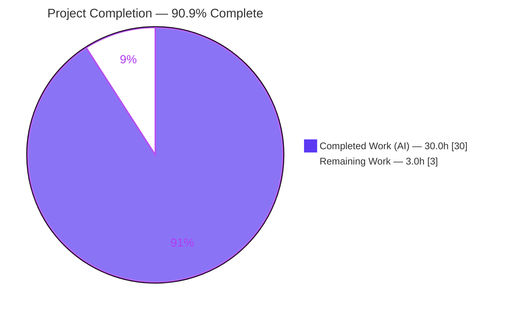
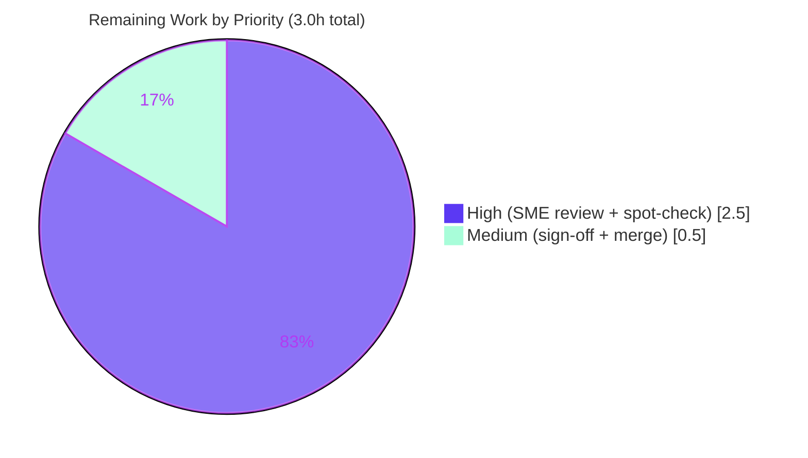

# Blitzy Project Guide

**Project:** Investigative Q&A — kitty `choose-fonts` persistence behavior
**Repository:** `kovidgoyal/kitty` (branch `blitzy-168b0e7e-d8c1-450e-98ae-477a83317dfe`)
**Deliverable:** `blitzy/documentation/kitty_815df1e210e0.md`
**Assessment date:** July 7, 2026

---

## 1. Executive Summary

### 1.1 Project Overview

This is a run-first, evidence-backed investigative Q&A that documents — end to end — how the kitty terminal's `choose-fonts` kitten behaves, with the lead question being whether a font selection confirmed inside the kitten **persists across kitty restarts** or applies only to the current session. The audience is kitty developers and power users who need an authoritative, reproducible account of this behavior. The sole deliverable is a single markdown document, `blitzy/documentation/kitty_815df1e210e0.md`, answering build & launch (Q1), invocation (Q2), end-to-end behavior (Q3), and persistence (Q4, the lead). The technical scope is cross-cutting but strictly **read-only**: it spans the Go `kitten` tool, the CLI framework, the choose-fonts TUI panes, and the configuration-persistence layer, proving every claim by building and running the real code.

### 1.2 Completion Status



| Metric | Hours |
|---|---|
| **Total Hours** | **33.0** |
| Completed Hours (AI + Manual) | 30.0 (30.0 AI / 0.0 Manual) |
| Remaining Hours | 3.0 |
| **Percent Complete** | **90.9%** |

> **Completion basis (PA1, AAP-scoped):** `Completion % = Completed ÷ (Completed + Remaining) = 30.0 ÷ 33.0 = 90.9%`. Every AAP-scoped requirement (Q1–Q4, all condition coverage, all methodology/evidence/scope rules) is **Completed** and independently validated. The entire 3.0h remaining balance is **path-to-production human review and sign-off**, which cannot be performed autonomously.

### 1.3 Key Accomplishments

- ✅ **Deliverable authored & committed:** `blitzy/documentation/kitty_815df1e210e0.md` (931 lines, 50,830 bytes) — the only artifact written to the repository.
- ✅ **Q1 — Build & default launch:** kitty built from checkout via `./dev.sh build`; version banner captured — `kitty 0.35.2 created by Kovid Goyal`.
- ✅ **Q2 — Invocation:** `kitten choose-fonts` exercised through its real entry point plus the visible clone alias `choose_fonts`.
- ✅ **Q3 — End-to-end behavior:** registration, `--reload-in` option parsing, pane-to-pane value flow, and finalization each traced with `file:line` citations and captured output.
- ✅ **Q4 — Persistence (lead answer):** proven that **Enter persists** the choice to `kitty.conf` (a `# BEGIN_KITTY_FONTS … # END_KITTY_FONTS` block) and survives a restart — observed before/after and re-read after restart, at both kitten and kitty-core level.
- ✅ **Exhaustive condition coverage:** `s` (STDOUT-only), `Esc` (abort), `Ctrl+c` (quit), and `--reload-in parent/all/none` each exercised against **real kitty GUIs** and reported with actual output.
- ✅ **Read-only scope honored:** repository is byte-for-byte unchanged apart from the deliverable; all temporary scripts and scratch config directories removed (verified `git status` clean).
- ✅ **Validated at 100%:** every behavioral claim independently reproduced with byte-level fidelity; ~108 `file:line` citations verified; cited Go/Python packages compile/import.

### 1.4 Critical Unresolved Issues

| Issue | Impact | Owner | ETA |
|---|---|---|---|
| _None._ All AAP-scoped requirements are complete and validated; no issue blocks release or validation. | — | — | — |

### 1.5 Access Issues

| System/Resource | Type of Access | Issue Description | Resolution Status | Owner |
|---|---|---|---|---|
| _No access issues identified._ The build/run environment (container, Go/C toolchain, native font libraries, Xvfb display) was available and the deliverable is committed on the working branch. | — | — | — | — |

### 1.6 Recommended Next Steps

1. **[High]** Have a subject-matter expert review the persistence answer (Q4) and spot-check a sample of the `file:line` citations against the current source (≈1.5h).
2. **[High]** Independently reproduce at least one evidence claim in the designated container — build, confirm the `0.35.2` banner, and drive `kitten choose-fonts` to Enter on an isolated config directory (≈1.0h).
3. **[Medium]** Approve the pull request and merge the deliverable to the target branch (≈0.5h).

---

## 2. Project Hours Breakdown

### 2.1 Completed Work Detail

| Component | Hours | Description |
|---|---:|---|
| Environment setup & canonical build (Q1) | 3.0 | Built kitty via `./dev.sh build` (prebuilt-dependency fetch); captured version banner `kitty 0.35.2`; documented toolchain (Go 1.22, gcc, harfbuzz/freetype/fontconfig/libpng/lcms2) and the default single-instance launch. §3 + §9.1. |
| Kitten invocation investigation (Q2) | 2.0 | Invoked `kitten choose-fonts` through its real entry point and the clone alias `choose_fonts`; documented the alternate `exec` path (`kitty/fonts/list.py:L42`); captured the first screen. §4 + §9.3. |
| End-to-end behavior trace (Q3 a–d) | 6.0 | Traced registration (`tools/cmd/tool/main.go:L82`), `--reload-in` parsing (choices/default + invalid-value rejection), pane value flow (`faces_settings`, list→faces→final), and finalization (four actions, `serialized()`, Enter→Patch). §5 + §9.2–9.3. |
| Persistence investigation — LEAD (Q4) | 6.5 | Run 1 (empty→Enter): before/after/restart, 139-byte block, no `.bak` (per `len(raw)>0` guard). Run 2 (pre-populated→Enter): comment-out of prior key, preservation of unrelated keys, appended block, verbatim `.bak`. Confirmed kitten + kitty-core re-read. §6.1–6.3 + §9.4–9.5. |
| Sibling & condition coverage | 4.0 | Exercised `s` (STDOUT-only via CSI-u), `Esc` (abort), `Ctrl+c` (exit 1) and `--reload-in parent/all/none` against **real kitty GUIs** (background_opacity telltale); documented the `--config NONE` caveat. §6.4–6.5, §7, §9.6–9.7. |
| Answer document authoring (931 lines) | 6.0 | Composed the full markdown: TL;DR direct answer, environment & method, condition matrix, mermaid data-flow diagram, raw-evidence appendix (§9.1–9.8), coverage checklist (§10). |
| Review remediation (2 cycles) | 2.5 | Remediated F1–F8 review findings (+462/−168) and corrected the invalid `auto_reload_config` claim (not a real key in 0.35.2). |
| **Total Completed** | **30.0** | |

### 2.2 Remaining Work Detail

| Category | Hours | Priority |
|---|---:|---|
| SME technical review of the persistence answer (Q4) & `file:line` citations | 1.5 | High |
| Independent spot-check reproduction of ≥1 evidence claim (build + drive kitten) | 1.0 | High |
| Stakeholder sign-off & merge of the deliverable | 0.5 | Medium |
| **Total Remaining** | **3.0** | |

> **Integrity:** §2.1 (30.0h) + §2.2 (3.0h) = **33.0h** Total (matches §1.2). §2.2 total (3.0h) equals the Remaining Hours in §1.2 and the "Remaining Work" value in the §7 pie chart. All remaining items are path-to-production human tasks; no AAP requirement is outstanding.

### 2.3 Notes on Scope

This is a documentation-only deliverable. There is **no application code, deployment pipeline, database, or dependency change** in scope — the answer document *is* the product. Consequently, "remaining work" contains no compilation fixes, environment configuration, or integration tasks; it consists solely of the human review and sign-off inherent to accepting any deliverable.

---

## 3. Test Results

For a run-first Q&A deliverable, the equivalent of a test suite is the **mandated evidence reproduction** — building and running the real code to confirm each behavioral claim. All rows below originate from Blitzy's autonomous validation logs (GATE 1) and were independently re-confirmed during this assessment. The deliverable itself has no unit tests.

| Test Category | Framework / Method | Total Tests | Passed | Failed | Coverage % | Notes |
|---|---|---:|---:|---:|---:|---|
| Build & version (Q1) | `./dev.sh` → `go run bypy/devenv.go`, `gcc`, `pkg-config` | 3 | 3 | 0 | 100% | Build succeeded; banner `kitty 0.35.2`; binaries `kitten`=15,765,764 B, `kitty`=40,384 B. |
| Registration & option parsing (Q3a/Q3b) | `kitten` CLI (Go `cli` framework) | 5 | 5 | 0 | 100% | `choose-fonts` & clone `choose_fonts` exit 0; `--help` shows `--reload-in` choices parent/all/none; `--reload-in=bogus` rejected (exit 1). |
| TUI screens (Q2/Q3c/Q3d) | Headless kitty GUI (Xvfb) + remote control | 4 | 4 | 0 | 100% | Family-list, incremental filter, faces/previews, and final pane (four actions) all match §9.3. |
| Persistence (Q4 — lead) | Real kitten + kitty-core config loader | 7 | 7 | 0 | 100% | Run 1: before-empty → block written → no `.bak` → restart re-read. Run 2: comment-out prior key → verbatim `.bak` → restart re-read. |
| Sibling conditions (Q4 contrast) | Real kitten via PTY / CSI-u | 3 | 3 | 0 | 100% | `s` STDOUT-only (no sentinels, no write); `Esc` abort (no write); `Ctrl+c` exit 1 (no write). |
| Reload variants (Q3d / coverage) | Real kitty GUIs + `kitten @ ls` telltale | 4 | 4 | 0 | 100% | `parent`/`all` reloaded (opacity 1.0→0.6); `none` not reloaded (stays 1.0); font block persists in all three. |
| Citation & compile verification | `go vet`/`go build`, Python import, `file:line` checks | 6 | 6 | 0 | 100% | Cited `kittens/choose_fonts` & `tools/config` packages compile; cited Python modules import; ~108 citations verified accurate. |
| **Totals (evidence reproduction)** | | **32** | **32** | **0** | **100%** | Zero discrepancies; byte-level fidelity. |

> **Transparency note (out of scope):** the broader kitty repository contains one pre-existing test, `kitty_tests` `test_font_selection`, which is an **expected environmental failure** because it requires the proprietary "Source Code Pro" font (not installable in the container). It lives in read-only source, is unrelated to the choose-fonts persistence question, was not modified, and has **zero bearing** on the deliverable's correctness.

---

## 4. Runtime Validation & UI Verification

**Runtime health**
- ✅ **Operational** — kitty builds from this checkout and launches; `kitty --version` → `kitty 0.35.2 created by Kovid Goyal`.
- ✅ **Operational** — `kitten choose-fonts` runs through its real entry point; clone alias `kitten choose_fonts` also resolves (exit 0).
- ✅ **Operational** — invalid option `--reload-in=bogus` is rejected at parse time (exit 1) with the documented error.

**Interactive TUI verification** (headless kitty GUI under Xvfb, driven via remote control)
- ✅ **Operational** — Family-list pane renders with a pre-selected family and supports incremental filtering.
- ✅ **Operational** — Faces/previews pane shows Regular/Bold/Italic/Bold-Italic previews.
- ✅ **Operational** — Final pane presents all four actions (Enter / Esc / `s` / Ctrl+c).

**Persistence & config integration (Q4)**
- ✅ **Operational** — Enter writes the `# BEGIN_KITTY_FONTS … # END_KITTY_FONTS` block to `kitty.conf`; the choice is re-read after a restart.
- ✅ **Operational** — Run 2 comments out a prior `font_family`, preserves unrelated keys, and creates a verbatim `.bak`.
- ✅ **Operational** — `--reload-in parent`/`all` trigger a live `SIGUSR1` reload; `none` does not; persistence is independent of the reload signal.

**Non-persisting paths (verified negative results)**
- ✅ **Operational** — `s` writes to STDOUT only; `Esc` aborts; `Ctrl+c` exits 1 — none writes `kitty.conf`.

_No ⚠ Partial or ❌ Failing items were observed for any in-scope behavior._

---

## 5. Compliance & Quality Review

Cross-mapping the governing rule set **"SWE-AtlasQnA-Repo"** and Blitzy quality benchmarks to the delivered work:

| Benchmark / Rule | Requirement | Status | Evidence / Notes |
|---|---|---|---|
| Deliverable rule (0.7.1) | Create `blitzy/documentation/<branch>.md` answering the question(s) | ✅ Pass | `blitzy/documentation/kitty_815df1e210e0.md` created & committed. |
| Run-first methodology (0.7.2) | Build & run the real code before writing | ✅ Pass | Build → run → observe → write; §2 + §9 evidence appendix. |
| Real entry point (0.7.2) | Exercise `kitten choose-fonts`, not a bypass | ✅ Pass | Remote control only drove keystrokes/read screen; code path always real. |
| Canonical configuration (0.7.2) | Default build/config, report commands | ✅ Pass | `./dev.sh build`; default launch; banner `0.35.2` reported. |
| Exhaustive condition coverage (0.7.2) | Enter / `s` / `Esc` / `Ctrl+c` + `--reload-in` parent/all/none | ✅ Pass | §7 condition matrix; §9.6–9.7 captured output. |
| State before/during/after (0.7.2) | Observe state transitions | ✅ Pass | `kitty.conf` before-empty vs after-block; restart re-read. §6.2–6.3. |
| Evidence rules (0.7.3) | Actual unedited output beside each claim; `file:line` grounding | ✅ Pass | ~108 citations + inline & appendix captured output. |
| Read-only scope (0.7.4) | No source modified; temp artifacts removed | ✅ Pass | `git status` clean; only deliverable changed; net +931/−0. |
| Documentation quality (CQ2) | Clear structure, no placeholders, balanced code fences | ✅ Pass | §1–§10 structure; 78 balanced fences; final newline present; no TODO/placeholder. |
| Correctness self-check | Values reported as observed, corrections applied | ✅ Pass | `auto_reload_config` invalid-key correction (commit `beafacd0b`). |

**Fixes applied during autonomous validation:** F1–F8 review-finding remediation (commit `aaf4244d4`) and the `auto_reload_config` correction (commit `beafacd0b`). **Outstanding compliance items:** none.

---

## 6. Risk Assessment

| Risk | Category | Severity | Probability | Mitigation | Status |
|---|---|---|---|---|---|
| Cited version/line numbers drift as source evolves | Technical | Low | Low | Citations pinned to this checkout (kitty 0.35.2) and branch `kitty_815df1e210e0`; document states exact commit/version. | Mitigated |
| Reproducing the interactive-TUI evidence is non-trivial (needs headless GPU/Xvfb + PTY driving) | Technical | Low | Medium | §2 and §9 document the exact method (`DISPLAY=:99`, `LIBGL_ALWAYS_SOFTWARE=1`, remote control). | Documented |
| Sensitive-data / credential exposure | Security | None | N/A | Read-only investigation; no secrets, network, or auth surface; writes confined to isolated throwaway config dirs (deleted); real `~/.config/kitty` untouched. | N/A |
| Documentation accuracy relies on citations remaining valid | Operational | Low | Low | SME review (task HT-1) confirms citations before production reliance. | Open (human review) |
| Deployment / monitoring gap | Operational | None | N/A | Deliverable is static markdown with no runtime footprint. | N/A |
| Untested external integration / missing credentials | Integration | None | N/A | No external services, APIs, or network configuration involved. | N/A |

> **Overall risk profile: LOW** — appropriate for a validated, read-only, documentation-only deliverable.

---

## 7. Visual Project Status

**Project hours breakdown** (Completed = Dark Blue `#5B39F3`, Remaining = White `#FFFFFF`):


**Remaining work by priority** (hours from §2.2):



> **Integrity check:** "Remaining Work" = **3.0h** here = §1.2 Remaining Hours = §2.2 total. "Completed Work" = **30.0h** = §1.2 Completed Hours = §2.1 total. High-priority remaining (1.5 + 1.0 = 2.5h) + Medium (0.5h) = 3.0h.

---

## 8. Summary & Recommendations

**Achievements.** The project delivers a complete, run-first, evidence-backed answer to whether the kitty `choose-fonts` kitten persists a font selection across restarts. The lead finding is unambiguous and proven by observation: **pressing Enter persists the choice** by writing a sentinel-delimited `# BEGIN_KITTY_FONTS … # END_KITTY_FONTS` block (four font keys) into `kitty.conf`, which is re-read on the next launch — in contrast to `s` (STDOUT-only), `Esc` (abort), and `Ctrl+c` (quit), none of which persist. Q1–Q3 (build/launch, invocation, and end-to-end behavior: registration, option parsing, value flow, finalization) are equally grounded in `file:line` citations and captured output.

**Remaining gaps.** None in the AAP scope. The 3.0h of remaining effort is entirely **path-to-production human review**: a subject-matter review of the persistence answer and citations, an independent spot-check reproduction, and stakeholder sign-off/merge.

**Critical path to production.** SME review (HT-1) → independent spot-check reproduction (HT-2) → sign-off & merge (HT-3). There is no build, deployment, configuration, or integration work on the path — the document is the product.

**Success metrics.** All met: deliverable exists at the mandated path; every question (Q1–Q4) and every condition answered with reproduced evidence; ~108 citations verified; repository byte-for-byte unchanged apart from the deliverable; 100% evidence-reproduction pass rate.

**Production-readiness assessment.** The deliverable is **90.9% complete** on an AAP-scoped basis and is production-ready pending human sign-off. Confidence is **High**: the deliverable required no edits during final validation, and every claim was independently reproduced with byte-level fidelity.

| Metric | Value |
|---|---|
| AAP-scoped completion | 90.9% |
| Completed / Remaining / Total hours | 30.0 / 3.0 / 33.0 |
| Evidence-reproduction pass rate | 100% (32/32) |
| Repository changes | 1 file added (deliverable); net +931/−0 |
| Confidence | High |

---

## 9. Development Guide

This guide reproduces the environment used to build kitty and run the `choose-fonts` kitten so the evidence in the deliverable can be independently verified. All commands were tested during this assessment.

### 9.1 System Prerequisites

- **OS:** Linux (validated on Ubuntu 25.10 container; the designated environment is `ghcr.io/scaleapi/swe-atlas:swe_atlas_QnA_kovidgoyal_kitty_1.0`).
- **Go:** ≥ 1.22 (`go.mod:L3` requires `go 1.22`; validated with go1.22.12).
- **C compiler:** gcc or clang (validated with gcc 15.2.0).
- **Python:** ≥ 3.8 (validated with Python 3.13.7) — for the launcher and the choose-fonts Python backend.
- **Native libraries** (via `pkg-config`): harfbuzz (10.2.0), freetype2 (26.2.20), fontconfig (2.15.0), libpng (1.6.50), lcms2 (2.16).
- **Headless display:** Xvfb (the TUI is OpenGL-backed and needs a display).

Verify the toolchain:

```bash
# Go is not on the default PATH in the container — load it first:
source /etc/profile.d/go.sh
go version          # -> go version go1.22.12 linux/amd64
gcc --version       # -> gcc (Ubuntu 15.2.0-4ubuntu4) 15.2.0
python3 --version   # -> Python 3.13.7
for l in harfbuzz freetype2 fontconfig libpng lcms2; do pkg-config --modversion "$l"; done
```

### 9.2 Environment Setup

```bash
# Repository root (destination working copy):
cd /tmp/blitzy/kitty/blitzy-168b0e7e-d8c1-450e-98ae-477a83317dfe_f7f386

# A virtual display for the OpenGL-backed interactive TUI (only needed to drive the kitten):
Xvfb :99 -screen 0 1920x1080x24 >/tmp/xvfb.log 2>&1 &
export DISPLAY=:99
export LIBGL_ALWAYS_SOFTWARE=1
```

### 9.3 Build

```bash
source /etc/profile.d/go.sh
CI=true ./dev.sh build          # delegates to: go run bypy/devenv.go
# Produces the in-place launchers:
#   kitty/launcher/kitty
#   kitty/launcher/kitten
```

Expected: the build fetches prebuilt dependencies and prints `Build successful`. The binaries `kitty/launcher/{kitty,kitten}` are gitignored (not part of the repository).

### 9.4 Verification

```bash
# Version banner (canonical / default configuration):
./kitty/launcher/kitty --version
# -> kitty 0.35.2 created by Kovid Goyal

# The kitten resolves through its real entry point (and the clone alias):
./kitty/launcher/kitten choose-fonts --help    # shows --reload-in [=parent], Choices: parent, all, none
./kitty/launcher/kitten choose_fonts --help     # clone alias, exit 0

# Option parsing is enforced at parse time:
./kitty/launcher/kitten choose-fonts --reload-in=bogus
# -> Error: bogus is not a valid value for --reload-in. Valid values: parent, all, none   (exit 1)
```

### 9.5 Example Usage — Reproduce the persistence evidence (Q4)

```bash
# Use an ISOLATED, writable config dir so the real user config is never touched:
export KITTY_CONFIG_DIRECTORY="$(mktemp -d)"
ls -la "$KITTY_CONFIG_DIRECTORY"            # BEFORE: no kitty.conf

# Launch a kitty GUI (headless) and run the kitten inside it, then drive:
#   filter a family -> Enter -> Enter (accept previews) -> Enter (finalize)
# (Driving is done via kitty remote control: kitten @ launch / send-key / send-text / get-text.)

# AFTER finalize, the font block is written:
cat -A "$KITTY_CONFIG_DIRECTORY/kitty.conf"
# # BEGIN_KITTY_FONTS$
# font_family      family="Fira Code"$
# bold_font        auto$
# italic_font      auto$
# bold_italic_font auto$
# # END_KITTY_FONTS      (no trailing newline)

# Restart kitty against the same dir -> the choice is re-read (persists).

# Clean up the throwaway config dir:
rm -rf "$KITTY_CONFIG_DIRECTORY"
```

### 9.6 View the Deliverable

```bash
less blitzy/documentation/kitty_815df1e210e0.md   # 931 lines, 50,830 bytes
git status --porcelain                            # -> empty (repo clean; read-only scope honored)
```

### 9.7 Troubleshooting

- **`go: command not found`** → run `source /etc/profile.d/go.sh` before building.
- **TUI shows a blank/black screen or GL errors** → ensure `Xvfb` is running and `DISPLAY`/`LIBGL_ALWAYS_SOFTWARE=1` are exported; drive the kitten via remote control rather than expecting manual keystrokes.
- **The `s` (STDOUT) action does nothing when sent via `send-key s`** → the final pane's `s` handler fires on *associated text*; send the explicit CSI-u sequence `\e[115;1;115u` instead.
- **Trying to prove persistence with `--config NONE`** → `NONE` yields defaults with no persistent target; always use a real, writable `KITTY_CONFIG_DIRECTORY`.
- **Editing `kitty.conf` doesn't reload a running GUI** → expected: kitty 0.35.2 does not auto-reload on file change; a reload fires only via an explicit trigger (`SIGUSR1`, the `reload_config_file` mapping, or a remote-control command). `auto_reload_config` is **not** a valid key.

---

## 10. Appendices

### Appendix A — Command Reference

| Command | Purpose |
|---|---|
| `source /etc/profile.d/go.sh` | Put Go on PATH (required before building) |
| `CI=true ./dev.sh build` | Canonical developer build → `kitty/launcher/{kitty,kitten}` |
| `./kitty/launcher/kitty --version` | Print version banner (`kitty 0.35.2 …`) |
| `./kitty/launcher/kitten choose-fonts --help` | Show kitten options (`--reload-in`) |
| `./kitty/launcher/kitten choose_fonts --help` | Clone-alias resolution check |
| `./kitty/launcher/kitten choose-fonts --reload-in=bogus` | Verify invalid-choice rejection (exit 1) |
| `cat -A "$KITTY_CONFIG_DIRECTORY/kitty.conf"` | Inspect written font block (line-ends visible) |
| `git status --porcelain` | Confirm repository cleanliness |

### Appendix B — Port Reference

| Port / Display | Use |
|---|---|
| `DISPLAY=:99` | Xvfb virtual display for the OpenGL-backed TUI |

_No network ports are used; the deliverable and investigation involve no server or listening socket._

### Appendix C — Key File Locations

| Path | Role |
|---|---|
| `blitzy/documentation/kitty_815df1e210e0.md` | **The deliverable** (answer document) |
| `kittens/choose_fonts/main.go` | Kitten entry point, `EntryPoint` registration, `--reload-in` option |
| `kittens/choose_fonts/final.go` | Final pane; Enter→patch, `serialized()`, `s`/`Esc` branches |
| `kittens/choose_fonts/faces.go` | Faces pane; `faces_settings`, value flow |
| `tools/cmd/tool/main.go` | `kitten` tool root; `choose_fonts.EntryPoint(root)` |
| `tools/config/api.go` | `Patcher.Patch` (write to `kitty.conf`), `ReloadConfigInKitty` (SIGUSR1) |
| `tools/utils/paths.go` | `ConfigDir` resolution (honors `KITTY_CONFIG_DIRECTORY`) |
| `tools/utils/atomic-write.go` | `AtomicUpdateFile` (atomic temp-write + rename) |
| `dev.sh` | Dev build entry point (`go run bypy/devenv.go`) |
| `kitty/launcher/{kitty,kitten}` | Built launchers (gitignored) |

### Appendix D — Technology Versions

| Component | Version |
|---|---|
| kitty (built) | 0.35.2 |
| Go | 1.22.12 (requires ≥ 1.22) |
| gcc | 15.2.0 |
| Python | 3.13.7 (requires ≥ 3.8) |
| harfbuzz / freetype2 / fontconfig / libpng / lcms2 | 10.2.0 / 26.2.20 / 2.15.0 / 1.6.50 / 2.16 |
| git | 2.51.0 |

### Appendix E — Environment Variable Reference

| Variable | Purpose |
|---|---|
| `KITTY_CONFIG_DIRECTORY` | Overrides the config dir (`utils.ConfigDir()` honors it first); used to isolate persistence runs |
| `DISPLAY` | X display for the GUI (`:99` via Xvfb) |
| `LIBGL_ALWAYS_SOFTWARE` | Force software OpenGL for headless rendering |
| `CI` | Set `true` for non-interactive build behavior |
| `KITTY_PID` | Used by `ReloadConfigInKitty` to target the parent instance for `--reload-in parent` |

### Appendix F — Developer Tools Guide

| Tool | Use in this project |
|---|---|
| `./dev.sh` / `bypy/devenv.go` | Canonical Go-based build bootstrap |
| kitty remote control (`kitten @ launch/send-key/send-text/get-text`) | Drive & read the interactive TUI in a headless GUI |
| `Xvfb` | Provide a virtual display for the OpenGL-backed kitten |
| `pkg-config` | Confirm native font-library availability/versions |
| `go vet` / `go build` | Confirm cited Go packages compile |
| `git status` / `git diff --numstat` | Confirm read-only scope and change volume |

### Appendix G — Glossary

| Term | Meaning |
|---|---|
| **kitten** | A subcommand/plugin of kitty (here, `choose-fonts`), built into the Go `kitten` tool |
| **`choose-fonts`** | The interactive kitten for selecting fonts, with previews and fine-tuning |
| **`# BEGIN_KITTY_FONTS … # END_KITTY_FONTS`** | Sentinel-delimited block the kitten writes to `kitty.conf` on Enter |
| **`Patcher.Patch`** | The config-write routine: comment-out prior keys, replace/append the sentinel block, `.bak` backup, atomic write |
| **`--reload-in`** | Kitten option (`parent`/`all`/`none`, default `parent`) controlling which instances receive the `SIGUSR1` reload |
| **SIGUSR1** | Signal kitty uses to reload `kitty.conf`; there is no automatic file-watch reload in 0.35.2 |
| **Run-first** | Methodology: build/run the real code and capture output *before* writing the answer |
| **AAP** | Agent Action Plan — the governing specification of the task |
