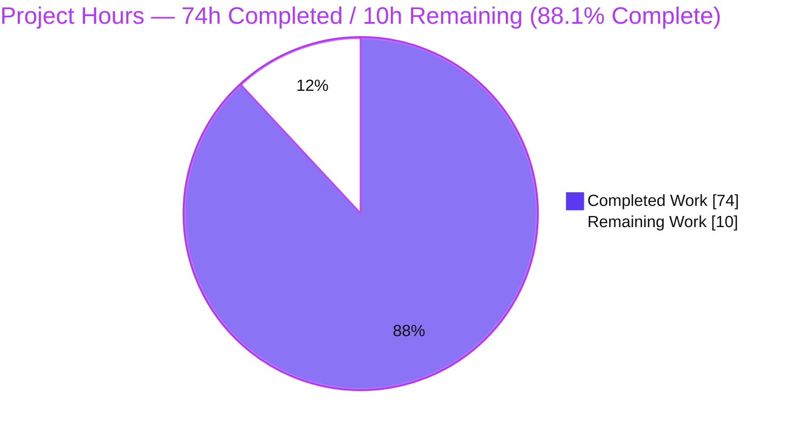
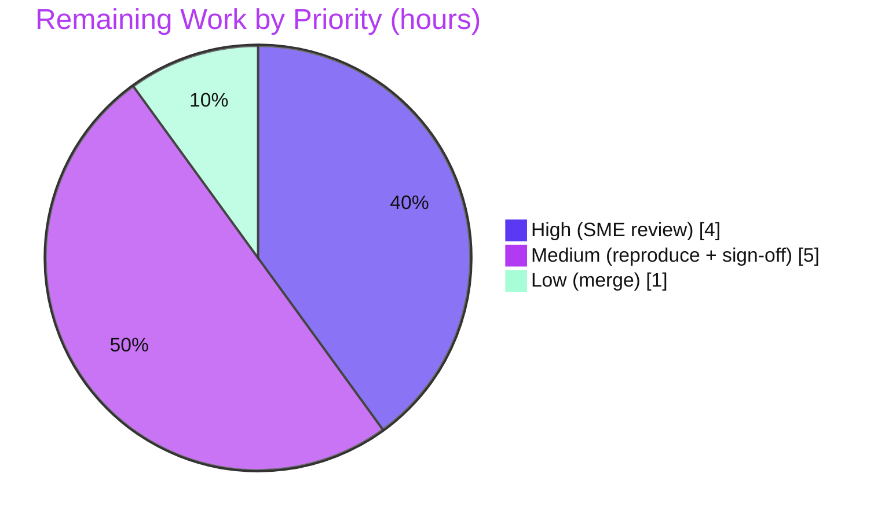

# Blitzy Project Guide — Kitty Input-Pipeline Runtime Investigation

> **Deliverable:** `blitzy/documentation/kitty_815df1e210e0.md` — a single, self-contained, runtime-grounded investigative Q&A document.
> **Repository:** `kovidgoyal/kitty` (pinned to base commit `815df1e21`) · **Branch:** `blitzy-05dd5e02-071e-4e0e-a941-87e19867a0f8` · **HEAD:** `df36cf673`
> **Legend / Brand Colors:** ██ Completed / AI Work = **Dark Blue `#5B39F3`** · ⬜ Remaining / Not Completed = **White `#FFFFFF`** · Headings/Accents = Violet-Black `#B23AF2` · Highlight = Mint `#A8FDD9`

---

## 1. Executive Summary

### 1.1 Project Overview

This project delivers an **onboarding / knowledge-transfer artifact** for the Kitty terminal emulator: a single Markdown document that explains, *from directly-observed runtime behavior*, how Kitty transforms a surge of raw child-process output into coherent on-screen and application state — with particular focus on what happens when a session is **paused and then resumed**. It answers five interlocking sub-questions (raw-input entry point & pause/resume; the three-thread "conductor"; shell-integration coherence; backpressure & unstable-remote behavior; end-to-end settling & rhythm), each backed by captured output and file:line citations. The audience is engineers onboarding onto Kitty's C/Python I/O pipeline. The technical scope is **read-only**: the source tree remains byte-for-byte unchanged; the sole new artifact is the investigation document.

### 1.2 Completion Status


| Metric | Hours | Notes |
|--------|------:|-------|
| **Total Hours** | **84** | AAP-scoped deliverables + path-to-production |
| **Completed Hours (AI + Manual)** | **74** | 74h AI-autonomous · 0h manual (fully autonomous) |
| **Remaining Hours** | **10** | Path-to-production human-gate work only |
| **Percent Complete** | **88.1%** | 74 ÷ 84 = 88.0952% (AAP-scoped, PA1 methodology) |

**All 16 AAP-specified requirements are Completed.** The remaining 10 hours are exclusively human path-to-production activities (SME review, independent reproduction, sign-off, merge). Per Blitzy honesty policy, completion is capped below 100% pending human review.

### 1.3 Key Accomplishments

- ✅ **Single deliverable authored** — `blitzy/documentation/kitty_815df1e210e0.md`, 1,905 lines, answering all five sub-questions (Q1–Q5) each with an explicit *Direct answer* subsection.
- ✅ **Run-first discipline honored** — Kitty was built canonically (`python3 setup.py` → `kitty/launcher/kitty`, "kitty 0.35.2") and driven through a **real PTY**; every behavioral claim sits beside its unedited captured output and the command that produced it.
- ✅ **Canonical-path discipline** — the non-canonical unit-test hooks (`test_parse_written_data` [kitty/screen.c:4771-4772], `parse_bytes` [kitty_tests/parser.py:20]) are explicitly labeled and **never used as evidence**.
- ✅ **Transitional states captured** — before/during/after for pause→resume (command-layer + `XGetImage` pixel-hash display proof) and for backpressure; the 2000 ms pause-timeout boundary confirmed across ≥2 runs.
- ✅ **~236 file:line citations validated** against the pinned source; timing values (input_delay 3 ms, repaint_delay 10 ms, resize_debounce_time (0.1, 0.5) s, 1 MiB buffer) confirmed from the binary.
- ✅ **User framing preserved verbatim** — "unseen conductor" / "what decides which event gets handled first"; "mixed in with ordinary text" / "without drifting out of sync"; "how the moving parts keep their rhythm."
- ✅ **Read-only mandate proven** — `git diff --name-status` vs base = one added file; source-only diff empty; clean working tree; temporary scripts removed (Appendix C in the deliverable).
- ✅ **Independent validation** — the reviewer re-ran the full regression suite (145 tests, `OK (skipped=2)`, all Go tests pass) and reproduced headline runtime captures (boundary hexdump byte-for-byte; timer defaults from the binary).

### 1.4 Critical Unresolved Issues

**No release-blocking issues exist.** All AAP-specified work is complete, all five production-readiness gates pass, and the source tree is byte-for-byte unchanged. The items below are **low-impact, honestly-disclosed** points for reviewer awareness (fully tracked in §6 Risk Assessment); none blocks release or validation.

| Issue | Impact | Owner | ETA |
|-------|--------|-------|-----|
| A narrow set of behavioral claims is **code-derived (inferred)**, not directly observed — parser-buffer saturation gating, idle 10 ms repaint cadence, live-drag resize coalescing, network-fault SSH degradation. Each is explicitly labeled inline + in the deliverable's Appendix B. | Low — labeled; optional to upgrade via ptrace/strace/SSH server | Human SME reviewer | Within HT-1 (4h) |
| GUI/PTY runtime captures were produced on an **identical canonical host build** (Ubuntu 25.10), not inside the designated image, because the image ships no headless-X stack. Disclosed in deliverable §0.2. | Low — identical builder (`python3 setup.py`, x11-only, `-Werror`); no claim depends on a non-canonical build | Human reviewer (reproduction) | Within HT-2 (3h) |

### 1.5 Access Issues

| System/Resource | Type of Access | Issue Description | Resolution Status | Owner |
|-----------------|----------------|-------------------|-------------------|-------|
| Git repository (`kovidgoyal/kitty`) | Repo read/write | None — branch checked out, 7 agent commits applied, clean tree | ✅ No issue | — |
| Designated Docker image (headless X stack) | Runtime env | Image ships **no** Xvfb / python-xlib, so it cannot open a window out-of-the-box for GUI reproduction | ⚠ Worked around — identical canonical host build + `xvfb`; disclosed in deliverable §0.2 | Human reviewer |
| SSH server (Q4 unstable-remote end-to-end) | Service | No SSH server in the container; real `ssh localhost` attempt returned exit 255 | ⚠ Disclosed — socket-RC + TTY-RC transports observed; only the network-fault degradation profile is labeled code-derived/unverified | Human reviewer |

No repository-permission or service-credential access blockers were identified. The two ⚠ items are **environment limitations** for full reproduction, each disclosed transparently in the deliverable.

### 1.6 Recommended Next Steps

1. **[High]** Conduct an SME technical review of the 1,905-line deliverable — validate the Q1–Q5 concurrency/I-O/pause-resume claims and spot-check a sample of the ~236 citations against the pinned source (HT-1, 4h).
2. **[Medium]** Independently reproduce the headline runtime captures (boundary hexdump, 2000 ms pause timeout, three-thread `/proc`, backpressure collapse, timer defaults), supplying `xvfb` or an identical canonical host build (HT-2, 3h).
3. **[Medium]** Circulate the document for stakeholder sign-off / knowledge-transfer acceptance as the canonical onboarding reference (HT-3, 2h).
4. **[Low]** Confirm the immutability proof on the reviewer's checkout, approve the PR, and merge to the target branch (HT-4, 1h).

---

## 2. Project Hours Breakdown

### 2.1 Completed Work Detail

Every completed component traces to a specific Agent Action Plan (AAP) requirement (R1–R16). Hours reflect expert investigative + technical-writing effort.

| Component | Hours | Description |
|-----------|------:|-------------|
| Environment setup & canonical Kitty build (R1) | 5 | Build via `python3 setup.py`; resolve `setup.py develop` KeyError:'DEVELOP_ROOT'; venv, pkg-config `-dev` libs, Go module cache, CI fonts; strict `-Werror` clean |
| Canonical observation harnesses & path discipline (R2, R11) | 6 | Wire the four `--dump-*`/`--debug-*` flags through a real PTY; build safe `mktemp -d` (0700) + `trap`/PID-scoped teardown scaffolding; identify & label non-canonical hooks |
| Q1 — Entry point + pause/resume investigation (R3) | 11 | `read_bytes()` zero-copy proof; `--dump-bytes` hexdump; DEC 2026 + DCS pending → `screen_pause_rendering`; before/during/after (command layer + `XGetImage` pixel-hash); 2000 ms timeout ×2; both refusal paths; input-side XTEST; bracketed paste |
| Q2 — Three-thread "conductor" investigation (R4) | 6 | Three threads via `/proc/<pid>/task/*/comm` (×2); fixed per-tick order `resizes→parse→render`; poll fd ordering & duty list; wakeup coalescing |
| Q3 — OSC 133 coherence investigation (R5) | 7 | Single-thread in-order parse; OSC 133 A/C/D dispatch; per-line attribution via `get-text --extent=last_cmd_output`; secondary prompt; honest "B not handled" note |
| Q4 — Backpressure + remote investigation (R6) | 8 | Space-gate + POLLIN-mask code; fast-producer/slow-drain throughput collapse ≈66–67× (×3, two scales); three transports separated; SSH kitten; unstable-link analysis (labeled) |
| Q5 — Settling & rhythm investigation (R7) | 7 | Three timer defaults from binary; controlled timer comparisons; resize→SIGWINCH hand-off; end-to-end settle trace byte-identical (×2) |
| Document authoring, structure & user-framing (R8, R9, R10, R13) | 9 | 1,905 lines; §0 scope/method + §1 pipeline overview + Q1–Q5; evidence adjacency; cause→effect; before/during/after; verbatim user framing; Mermaid pipeline diagram |
| Citation validation (236) & web-research conventions (R9, R14) | 4 | Validate all file:line citations vs pinned source; Appendix A (DEC 2026, OSC 133, bracketed paste 2004) framing-only |
| Coverage pass, immutability proof & cleanup (R15, R16) | 3 | Appendix B (every named item + evidence type + citation); Appendix C immutability proof; temp-script cleanup verification |
| QA remediation across 6 commits (R9–R16) | 8 | 15 code-review findings + 7 QA findings + 2 citation off-by-ones + security redaction (pod hostname) + XTEST keyboard-encoding + final OSC 133 citation fix |
| **Total Completed** | **74** | **= Completed Hours in §1.2** |

### 2.2 Remaining Work Detail

All remaining work is **path-to-production human-gate** activity; no AAP-specified deliverable work remains.

| Category | Hours | Priority |
|----------|------:|----------|
| Human SME technical review of the 1,905-line deliverable (P1) | 4 | High |
| Independent reproduction of headline runtime captures (P2) | 3 | Medium |
| Stakeholder sign-off / knowledge-transfer acceptance (P3) | 2 | Medium |
| PR final approval & merge to target branch (P4) | 1 | Low |
| **Total Remaining** | **10** | **= Remaining Hours in §1.2 = §7 pie "Remaining Work"** |

### 2.3 Hours Reconciliation & Methodology

- **Completion formula (PA1, AAP-scoped):** `Completion % = Completed ÷ (Completed + Remaining) × 100 = 74 ÷ (74 + 10) = 74 ÷ 84 = 88.0952% ≈ 88.1%`.
- **Cross-section integrity:** §2.1 total (74h) **+** §2.2 total (10h) **=** Total Project Hours (84h) in §1.2 ✅. Remaining hours are identical across §1.2, §2.2, and §7 (10h) ✅.
- **Scope boundary:** hours are counted **only** for AAP deliverables and standard path-to-production; no out-of-scope work is included. This is a documentation-only, read-only-source deliverable.

---

## 3. Test Results

All results below originate from **Blitzy's autonomous validation** of this project — the project's own regression suite, executed to satisfy the AAP's "build and run in the canonical configuration" requirement (the emulator whose behavior the deliverable documents must be healthy). The suite was **independently re-run by the reviewer** at committed HEAD `df36cf673`:
`TMPDIR=/tmp/kitty-clean-tmp LANG=C.UTF-8 LC_ALL=C.UTF-8 CI=true ./kitty/launcher/kitty +launch test.py` → exit 0, `Ran 145 tests in 22.816s`, `OK (skipped=2)`, `All Go tests succeeded`.

| Test Category | Framework | Total Tests | Passed | Failed | Coverage % | Notes |
|---------------|-----------|------------:|-------:|-------:|-----------:|-------|
| VT Parser & Screen core | Python `unittest` | 70 | 70 | 0 | Not instrumented | `parser`(16) + `screen`(36) + `datatypes`(18) — the heart of the Q1/Q3/Q4 pipeline |
| Shell Integration & Remote/SSH | Python `unittest` | 20 | 20 | 0 | Not instrumented | `shell_integration`(6) + `ssh`(8) + `file_transmission`(6) — Q3/Q4 surfaces |
| Input & Windowing | Python `unittest` | 11 | 11 | 0 | Not instrumented | `keys`(3) + `mouse`(1) + `glfw`(2) + `layout`(3) + `tui`(2) — Q1 input side / Q2 |
| Rendering & Graphics | Python `unittest` | 27 | 26 | 0 | Not instrumented | `fonts`(8) + `graphics`(19); 1 by-design skip (macOS-only Last Resort font) |
| Build & Platform validation | Python `unittest` | 17 | 16 | 0 | Not instrumented | `check_build`(9) + 8 single-test modules; 1 by-design skip (CA certs, frozen-builds only) |
| Go tools / kittens | Go `testing` | All pass | All pass | 0 | Not instrumented | Reported in aggregate: "All Go tests succeeded, ran in 22.9 seconds" |
| **Total (Python)** | — | **145** | **143** | **0** | — | **2 by-design platform-guard skips; 0 FAIL / 0 ERROR / 0 Traceback** |

**Skip detail (both by-design platform guards, not failures):**
- `test_ca_certificates` — *"CA certificates are only tested on frozen builds."*
- `test_fallback_font_not_last_resort` — *"Only macOS has a Last Resort font."*

> **Integrity note:** No test was authored for this task (the AAP forbids adding permanent tests). The suite is Kitty's existing regression suite, run autonomously by Blitzy to validate that the observed emulator is healthy. The coverage column is honestly marked *Not instrumented* — the harness reports pass/fail/skip, not a coverage percentage; no coverage figure is fabricated.

---

## 4. Runtime Validation & UI Verification

The deliverable is documentation, but its evidence rests on **live runtime validation** of the emulator and its observation instruments. Kitty has no conventional web UI; "UI verification" here means the **terminal display surface**, validated at the pixel level.

**Runtime health**
- ✅ **Operational** — Canonical build produces `kitty/launcher/kitty`; `--version` → `kitty 0.35.2 created by Kovid Goyal`.
- ✅ **Operational** — Headless launch under `xvfb` (llvmpipe software GL) drives real children through a real PTY.
- ✅ **Operational** — `fast_data_types.so` imports; `VT_PARSER_BUFFER_SIZE = 1048576` (= 1 MiB) confirmed from the binary.

**Observation instruments (canonical, user-facing flags) — all validated through a genuine PTY**
- ✅ **Operational** — `--dump-bytes <path>`: reviewer reproduced the Q1 boundary capture **byte-for-byte** (`1b 5b 3f 32 30 32 36 68` `HELLO` `1b 5b 3f 32 30 32 36 6c` = BSU + HELLO + ESU).
- ✅ **Operational** — `--dump-commands`: emits the parsed command stream (`draw hi` / `screen_carriage_return` / `screen_linefeed`).
- ✅ **Operational** — `--debug-rendering` and `--debug-input`: validated in Blitzy's logs (render/`SIGWINCH` traces; key/mouse event traces).

**Display-side (UI) verification**
- ✅ **Operational** — `XGetImage` pixel-hash timeline of the real framebuffer during pause→resume: **0** display transitions while paused, **exactly one** atomic transition on resume, byte-identical before/during frames — directly confirming the synchronized-update freeze/atomic-apply behavior.

**API / integration outcomes**
- ✅ **Operational** — Remote-control over a Unix socket (`kitty @ --to unix:$sock`) and TTY-carried RC (DCS) both observed as distinct transports.
- ⚠ **Partial** — SSH unstable-remote end-to-end: no SSH server in the container (real attempt → exit 255); socket-RC + TTY-RC observed, network-fault degradation labeled code-derived.

**Timing/rhythm (Q5)** — ✅ **Operational** — timer defaults confirmed from the binary: `input_delay=3ms`, `repaint_delay=10ms`, `resize_debounce_time=(0.1, 0.5)`.

---

## 5. Compliance & Quality Review

Cross-mapping the AAP mandates and governing rules (0.7) to observed compliance. Fixes applied during autonomous validation are noted.

| Benchmark / AAP Rule | Requirement | Status | Progress | Evidence / Fixes |
|----------------------|-------------|--------|:--------:|------------------|
| Deliverable (Rule 0.7.5) | Single new `blitzy/documentation/kitty_815df1e210e0.md` | ✅ Pass | 100% | 1,905 lines; `git diff` = one added file |
| Read-only source (Rule 0.7.5) | No existing file modified; temp scripts removed | ✅ Pass | 100% | Source-only diff empty; clean tree; Appendix C proof |
| Run-first (Rule 0.7.1) | Build & run before writing; ≥2-run stability | ✅ Pass | 100% | Canonical build; pause ×2, threads ×2, backpressure ×3, e2e ×2 |
| Canonical entry point (Rule 0.7.1) | Real PTY only; label non-canonical | ✅ Pass | 100% | `test_parse_written_data`/`parse_bytes` labeled, not used as evidence |
| Exhaustive coverage (Rule 0.7.2) | Every named item; before/during/after | ✅ Pass | 100% | Appendix B coverage pass; transitional states for Q1 & Q4 |
| Evidence adjacency (Rule 0.7.2/0.7.3) | Unedited output beside each claim + command | ✅ Pass | 100% | 81 code blocks with commands + raw output |
| Grounded answering (Rule 0.7.4) | file:line for structural claims; cause→effect | ✅ Pass | 100% | ~236 citations validated; explicit cause→effect subsections |
| User framing preserved | Q2/Q3/Q5 phrases verbatim | ✅ Pass | 100% | Verified in headings + direct answers |
| Web research (framing only) | DEC 2026, OSC 133, bracketed paste 2004 | ✅ Pass | 100% | Appendix A, code remains source of truth |
| Honesty on inferred claims | Label code-derived vs observed | ✅ Pass | 100% | Appendix B "Method & honesty" enumerates the code-derived set |
| Security hygiene | No sensitive data in captures | ✅ Pass | 100% | **Fix:** pod hostname redacted (commit `65758bca3`) |
| Citation precision | Each symbol cited to its actual line | ✅ Pass | 100% | **Fixes:** 2 off-by-ones (`350f5b0a9`); OSC 133 'D' split to `window.py:1408`/`:1453` (`df36cf673`) |
| Build reproducibility | Exact build/invocation commands stated | ✅ Pass | 100% | §0.3 documents `python3 setup.py` and the `develop` failure |

**Outstanding compliance items:** none. All benchmarks pass; the only residual items are the honestly-labeled code-derived claims (§6 T1), which comply with the rule that inferred statements be labeled as such.

---

## 6. Risk Assessment

Overall risk is **Low** — a read-only documentation deliverable with the source tree byte-for-byte unchanged introduces no runtime, dependency, or attack-surface change.

| Risk | Category | Severity | Probability | Mitigation | Status |
|------|----------|----------|-------------|------------|--------|
| Behavioral claims that are code-derived, not directly observed (parser-saturation gating; idle 10 ms repaint cadence; live-drag resize coalescing; network-fault SSH degradation) | Technical | Low | Medium | Each labeled inline + Appendix B; reviewer may upgrade via ptrace/strace/SSH server | ⚠ Disclosed / Mitigated |
| Runtime captures on host build (Ubuntu 25.10), not the designated image (no headless-X stack) | Technical | Low | Low | Identical canonical builder (`python3 setup.py`, x11-only, `-Werror`); build verified in designated image; disclosed §0.2 | ⚠ Disclosed / Mitigated |
| Citation drift — ~236 file:line refs pinned to base `815df1e21`; upstream movement could shift lines | Technical | Low | Low | Validated vs pinned commit; base commit stated in the deliverable | ✅ Mitigated |
| Sensitive-data leakage in captured output (internal pod hostname) | Security | Low | Low | Redacted during validation (commit `65758bca3`); no code change → no new attack surface | ✅ Resolved |
| Reproduction environment drift — readers need matching toolchain; image lacks headless-X | Operational | Low | Medium | Exact build/run commands + host-vs-container nuance documented (§9, deliverable §0) | ⚠ Disclosed / Mitigated |
| No source-level integration — document imports/couples to nothing | Integration | None | — | Immutability proven (Appendix C); zero dependency changes | ✅ N/A |
| SSH/remote unstable-link not exercised end-to-end (no SSH server; exit 255) | Integration | Low | Low | socket-RC + TTY-RC transports observed; only network-fault degradation labeled unverified | ⚠ Disclosed |

---

## 7. Visual Project Status

**Project Hours Breakdown** (Completed = Dark Blue `#5B39F3`, Remaining = White `#FFFFFF`):



**Remaining Work by Priority** (10h total):



**Remaining Work by Category (Section 2.2)** — bar view:

| Category | Hours | Bar |
|----------|------:|-----|
| SME technical review (High) | 4 | ████████ |
| Independent reproduction (Medium) | 3 | ██████ |
| Stakeholder sign-off (Medium) | 2 | ████ |
| PR approval & merge (Low) | 1 | ██ |
| **Total** | **10** | — |

> **Integrity check:** "Remaining Work" = **10h** matches §1.2 Remaining Hours and the §2.2 Hours total. "Completed Work" = **74h** matches §1.2 Completed Hours and the §2.1 total.

---

## 8. Summary & Recommendations

**Achievements.** The project delivers a complete, rigorously-evidenced investigation document that answers all five sub-questions from directly-observed runtime behavior. Kitty was built canonically and driven through a real PTY; every claim is paired with unedited captured output and validated file:line citations; transitional pause→resume and backpressure states are captured before/during/after (including pixel-level display proof); user framing is preserved verbatim; and the read-only mandate is proven with a clean tree and a single added file. Independent re-validation confirmed the regression suite (145 tests, 0 failures) and reproduced headline runtime captures.

**Remaining gaps.** None in the AAP deliverable itself. The outstanding 10 hours are entirely **path-to-production human-gate** activities: SME technical review, independent reproduction, stakeholder sign-off, and merge. A narrow set of behavioral claims is honestly labeled code-derived (the reviewer may optionally upgrade these to directly-observed via ptrace/strace and an SSH server).

**Critical path to production.** (1) SME review → (2) reproduce headline captures → (3) sign-off → (4) merge. The path is short and low-risk because the deliverable is documentation-only with an unchanged source tree.

**Success metrics.** 5/5 sub-questions answered with direct answers; 16/16 AAP requirements complete; ~236/236 citations validated; 145/145 tests healthy (0 failures); 1 file added, 0 source files changed.

**Production-readiness assessment.** The project is **88.1% complete** on an AAP-scoped basis and is **ready for human review and merge**. As a read-only knowledge-transfer artifact it carries minimal production risk; the recommended next steps in §1.6 move it from validated to accepted.

| Metric | Value |
|--------|-------|
| AAP-scoped completion | 88.1% (74h / 84h) |
| AAP requirements complete | 16 / 16 |
| Sub-questions answered | 5 / 5 |
| Source files changed | 0 (byte-for-byte unchanged) |
| Regression tests | 145 total · 143 pass · 2 by-design skips · 0 fail |
| Production risk | Low |

---

## 9. Development Guide

> All commands below were **tested green** in the validation environment. The launcher is always `./kitty/launcher/kitty` (the bare name `kitty` is not on `PATH`).

### 9.1 System Prerequisites

- **OS:** Linux (validated on Ubuntu 25.10 host; designated image is Ubuntu 24.04.2 — identical build path).
- **Python:** ≥ 3.8 required by the project (`pyproject.toml`); validated with **CPython 3.13.7**.
- **Go toolchain:** **1.24.4** (repo pins `go 1.22` in `go.mod`).
- **C compiler:** gcc/clang; validated with **gcc 15.2.0**.
- **Native `-dev` libraries (via pkg-config):** harfbuzz, freetype2, fontconfig, libpng, lcms2, xkbcommon(+x11), x11, xrandr/xinerama/xcursor/xi, dbus-1, libcanberra, openssl.
- **For GUI/PTY reproduction:** `xvfb` (software GL via Mesa llvmpipe) and, for the input-side capture, `python-xlib`.

### 9.2 Environment Setup (run once per shell)

```bash
repo=/tmp/blitzy/kitty/blitzy-05dd5e02-071e-4e0e-a941-87e19867a0f8_8fa74e
cd "$repo"
source /tmp/kitty-venv/bin/activate       # PEP 668: use a venv (or pass --break-system-packages)
export TMPDIR=/tmp/kitty-clean-tmp; mkdir -p "$TMPDIR"
export LANG=C.UTF-8 LC_ALL=C.UTF-8
KITTY=./kitty/launcher/kitty
```

### 9.3 Dependency Installation

Kitty ships **no** `requirements.txt`/lockfile — it builds from system `-dev` packages. The Python build-time deps live in the venv (`setuptools`, `Pillow`, `pygments`). Go modules resolve from the offline module cache. **Do not add, upgrade, or remove any dependency** (out of scope).

### 9.4 Build (Canonical)

```bash
python3 setup.py                          # default action = build → kitty/launcher/kitty, kitten, fast_data_types.so
```

> ⚠ **Do NOT use `python3 setup.py develop`** — it fails with `KeyError: 'DEVELOP_ROOT'` [setup.py:1255] because `DEVELOP_ROOT` is set only by Kitty's Go dev-env bootstrap. Use the plain `python3 setup.py` (source) build for all observation.
> ℹ `wayland-protocols` absent → the Wayland backend auto-disables (x11-only, canonical). Strict flags `-pedantic-errors -Werror -Wall -Wextra` stay on.

### 9.5 Build Verification

```bash
./kitty/launcher/kitty --version                                              # → kitty 0.35.2 created by Kovid Goyal
./kitty/launcher/kitty +runpy 'from kitty.fast_data_types import VT_PARSER_BUFFER_SIZE as B; print(B)'   # → 1048576  (= 1 MiB)
```

### 9.6 Run the Regression Suite

```bash
TMPDIR=/tmp/kitty-clean-tmp LANG=C.UTF-8 LC_ALL=C.UTF-8 CI=true \
  ./kitty/launcher/kitty +launch test.py
# Expected tail: "Ran 145 tests in ~16-23s", "OK (skipped=2)", "All Go tests succeeded"
```

### 9.7 Reproduce Headline Runtime Captures

```bash
# Q1 - exact boundary bytes (BSU + HELLO + ESU) through a real PTY:
tmpdir=$(mktemp -d); chmod 700 "$tmpdir"; trap 'rm -rf "$tmpdir"' EXIT
timeout 40 xvfb-run -a -s "-screen 0 1280x800x24" "$KITTY" --config NONE \
  -o close_on_child_death=yes --dump-bytes "$tmpdir/q1.bin" \
  sh -c "printf '\033[?2026hHELLO\033[?2026l'" >/dev/null 2>&1
od -A d -t x1z "$tmpdir/q1.bin"
# Expected: 1b 5b 3f 32 30 32 36 68 48 45 4c 4c 4f 1b 5b 3f 32 30 32 36 6c

# Q1/Q3/Q5 - parsed command stream:
timeout 40 xvfb-run -a -s "-screen 0 1280x800x24" "$KITTY" --config NONE \
  -o close_on_child_death=yes --dump-commands sh -c "printf 'hi\n'" 2>/dev/null
# Expected: draw hi / screen_carriage_return / screen_linefeed

# Q5 - timer defaults from the binary:
"$KITTY" +runpy 'from kitty.options.types import defaults; \
  print(defaults.input_delay, defaults.repaint_delay, defaults.resize_debounce_time)'
# Expected: 3 10 (0.1, 0.5)
```

### 9.8 View the Deliverable & Prove Immutability

```bash
less blitzy/documentation/kitty_815df1e210e0.md         # 1,905 lines
git status --porcelain                                  # (empty - clean tree)
git diff --name-status 815df1e21..HEAD                  # → A  blitzy/documentation/kitty_815df1e210e0.md
```

### 9.9 Troubleshooting

- **`KeyError: 'DEVELOP_ROOT'`** → you ran `setup.py develop`; use plain `python3 setup.py`.
- **No display / GL errors** → run under `xvfb-run` (software GL). Designated image lacks Xvfb/python-xlib → install them or use an identical canonical host build.
- **`error: externally-managed-environment` (PEP 668)** → use the venv (`/tmp/kitty-venv`) or `pip install --break-system-packages`.
- **`wayland-protocols not found`** → benign; Wayland auto-disables, x11-only is canonical.
- **`Failed to open systemd user bus` on stderr** → container-only warning; discard with `2>/dev/null` (stdout capture is unaffected).
- **Never `pkill python`/`pkill -f …`** → it can kill the orchestrator; always tear down by the exact captured PID.

---

## 10. Appendices

### Appendix A — Command Reference

| Command | Purpose |
|---------|---------|
| `python3 setup.py` | Canonical build (produces launcher, kitten, `fast_data_types.so`) |
| `python3 setup.py build-launcher` | Rebuild just the launcher |
| `./kitty/launcher/kitty --version` | Verify build (→ kitty 0.35.2) |
| `./kitty/launcher/kitty +runpy '<py>'` | Read runtime values from the built module |
| `./kitty/launcher/kitty +launch test.py` | Run the regression suite |
| `… --dump-bytes <path>` | Capture raw bytes crossing the PTY boundary (Q1) |
| `… --dump-commands` | Capture the parsed command stream (Q1/Q3/Q5) |
| `… --debug-rendering` | Render/GL debug + `SIGWINCH` traces (Q1/Q2/Q5) |
| `… --debug-input` | Key/mouse event traces (Q1 input side) |
| `kitty @ --to unix:$sock <cmd>` | Remote-control client over a Unix socket (Q4) |
| `git diff --name-status 815df1e21..HEAD` | Prove single-file immutability |

### Appendix B — Port Reference

Kitty uses **no TCP network ports** in this investigation. Remote control is over a **Unix-domain socket** created inside a private `mktemp -d` (mode 0700) directory and restricted to `allow_remote_control=socket-only`. Reproduction runs under a virtual X display (`xvfb`, e.g. `-screen 0 1280x800x24`), which uses an X display number (e.g. `:99`), not a TCP port.

| Endpoint | Type | Notes |
|----------|------|-------|
| `unix:$tmpdir/rc.sock` | Unix domain socket | Remote-control channel (socket-only), ephemeral per experiment |
| `xvfb` display (e.g. `:99`) | X display | Virtual framebuffer for headless GUI/pixel capture |

### Appendix C — Key File Locations

| Path | Role |
|------|------|
| `blitzy/documentation/kitty_815df1e210e0.md` | **The deliverable** (1,905 lines) |
| `kitty/child-monitor.c` | Three-thread I/O loop; `read_bytes()`; fixed per-tick order (Q1/Q2/Q5) |
| `kitty/vt-parser.c` | Shared 1 MiB buffer; `has_space_for_input` gate (Q1/Q4) |
| `kitty/screen.c` | `screen_pause_rendering`; OSC 133 per-line attribution (Q1/Q3) |
| `kitty/options/definition.py` | Timer defaults: input_delay:878, repaint_delay:866, resize_debounce_time:1182 (Q5) |
| `kitty/cli.py` | Observation flags `--dump-*`/`--debug-*` (972–996) |
| `kitty/child.py` | PTY master creation `openpty`/`Child.fork` (Q1 boundary) |
| `kitty/launcher/kitty` | Built launcher (git-ignored) |
| `test.py` | Regression-suite entry point |

### Appendix D — Technology Versions

| Component | Version |
|-----------|---------|
| Kitty (built) | 0.35.2 |
| CPython | 3.13.7 (project minimum ≥ 3.8) |
| Go toolchain | 1.24.4 (repo pins 1.22) |
| C compiler | gcc 15.2.0 |
| VT parser buffer | 1,048,576 bytes (1 MiB) |
| Build environment | Ubuntu 25.10 host / Ubuntu 24.04.2 designated image |
| Base commit | `815df1e21` · HEAD `df36cf673` |

### Appendix E — Environment Variable Reference

| Variable | Value / Purpose |
|----------|-----------------|
| `TMPDIR` | `/tmp/kitty-clean-tmp` — clean, non-setgid temp root for captures |
| `LANG` / `LC_ALL` | `C.UTF-8` — deterministic locale for byte-sensitive captures |
| `CI` | `true` — non-interactive test execution |
| `KITTY` | `./kitty/launcher/kitty` — launcher shorthand |
| `DEVELOP_ROOT` | Required only by `setup.py develop` (absent → use plain `setup.py`) |
| `PKG_CONFIG_PATH` | Locates native `-dev` `.pc` files at build time |

### Appendix F — Developer Tools Guide

- **`--dump-bytes <path>`** [kitty/cli.py:985] — raw child bytes to a file; the exact bytes crossing the boundary.
- **`--dump-commands`** [kitty/cli.py:972] — parsed command stream to stdout (draws coalesced), command names interleaved in byte order via `DumpCommands.__call__` [kitty/boss.py:239].
- **`--debug-rendering`/`--debug-gl`** [kitty/cli.py:989] — render/GL diagnostics and `SIGWINCH` notifications.
- **`--debug-input`/`--debug-keyboard`** [kitty/cli.py:996] — key/mouse events as received.
- **`+runpy`** — evaluate Python against the built `fast_data_types` module (read runtime constants/defaults).
- **`+launch`** — run a Python entry point (e.g., `test.py`) inside the launcher's environment.
- **`XGetImage` (via python-xlib)** — sample the real framebuffer for a pixel-hash timeline (display-side pause/resume proof).
- **XTEST (via python-xlib)** — synthesize genuine `KeyPress`/`KeyRelease` events for the input-encoding capture.

### Appendix G — Glossary

| Term | Meaning |
|------|---------|
| **PTY** | Pseudo-terminal; master fd read by `read_bytes()`, slave end held by the child |
| **VT parser** | Kitty's virtual-terminal parser consuming the shared 1 MiB buffer |
| **BSU / ESU** | Begin / End Synchronized Update — `CSI ? 2026 h` / `CSI ? 2026 l` |
| **DEC mode 2026** | Synchronized-output private mode ("paused then resumed") |
| **OSC 133 (FTCS)** | Shell-integration prompt markers (A=prompt start, C=cmd output start, D=cmd finished) |
| **Bracketed paste (2004)** | Wraps pasted text in `ESC[200~ … ESC[201~` |
| **Backpressure** | Buffer-space gate masks POLLIN → OS-level PTY flow control |
| **SIGWINCH** | Window-size-change signal sent to the child on resize |
| **input_delay / repaint_delay / resize_debounce_time** | Coalescing timers (3 ms / 10 ms / (0.1, 0.5) s) that pace the pipeline |
| **Zero-copy read** | `read(fd, …)` writes directly into the parser's buffer — no intermediate copy |
| **Canonical path** | The real PTY input path (vs. the non-canonical `parse_bytes` unit-test hook) |

---

*Generated by the Blitzy Platform · AAP-scoped completion: 88.1% (74h completed / 10h remaining / 84h total) · Deliverable: `blitzy/documentation/kitty_815df1e210e0.md` · Source tree: byte-for-byte unchanged.*