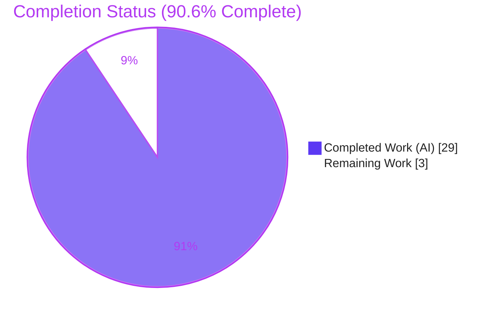
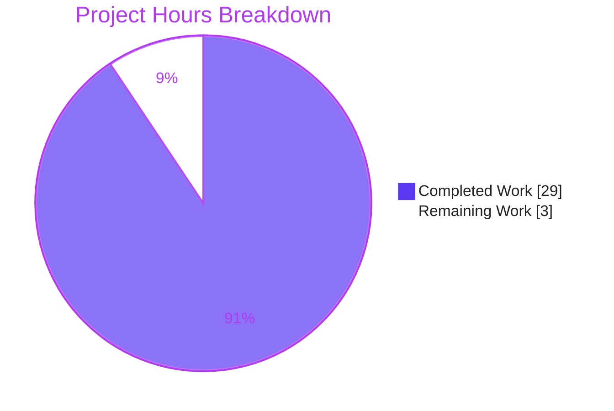

# Blitzy Project Guide

> **Project:** Q&A / code-investigation of `kovidgoyal/kitty` — keyboard-protocol progressive-enhancement flag stacks across alternate-screen-buffer switches
> **Repository:** `kovidgoyal/kitty` (kitty terminal emulator, v0.35.2) @ commit `815df1e210e0a9ab4622f5c7f2d6891d7dbeddf1`
> **Branch:** `blitzy-dfe3f555-a296-417a-9522-91554f2c428c` · **HEAD:** `01d3b7af3`
> **Brand key:** Completed / AI Work = Dark Blue `#5B39F3` · Remaining = White `#FFFFFF` · Headings/Accents = Violet-Black `#B23AF2` · Highlight = Mint `#A8FDD9`

---

## 1. Executive Summary

### 1.1 Project Overview

This project answers a seven-part technical question about how kitty's keyboard-protocol progressive-enhancement flags behave when the terminal toggles between its main and alternate screen buffers. The target users are terminal-protocol engineers and reviewers who need an authoritative, evidence-grounded reference. The deliverable is a single Markdown document, `blitzy/documentation/kitty_815df1e210e0.md`, produced by a strict read-only, run-first investigation: kitty's C extension was built, a headless `Screen` was driven through kitty's own test scaffolding, and verbatim byte output was captured for each stack/buffer state. Every behavioral claim is paired with one observed output line and an exact `file:line` citation. No product code was changed; the technical scope is documentation plus transient runtime observation.

### 1.2 Completion Status

The completion percentage is computed using the AAP-scoped, hours-based methodology (PA1): all seventeen AAP-specified requirements are complete, verified, and committed; the remaining hours are the standard human path-to-production for a documentation artifact (SME review, independent reproduction, merge).

**Completion: 90.6%** — 29.0 completed hours / 32.0 total hours.



| Metric | Hours |
|--------|-------|
| **Total Hours** | **32.0** |
| Completed Hours (AI + Manual) | 29.0 (29.0 AI + 0.0 Manual) |
| Remaining Hours | 3.0 |
| **Percent Complete** | **90.6%** |

### 1.3 Key Accomplishments

- ✅ **Sole deliverable authored and committed** — `blitzy/documentation/kitty_815df1e210e0.md` (375 lines), the only tracked change on the branch (`+375 / −0`).
- ✅ **All seven questions (Q1–Q7) answered** with observed evidence and exact citations, plus a coverage pass over every named item.
- ✅ **Run-first methodology honored** — the C extension `kitty/fast_data_types.so` was built and a headless `Screen` driven through kitty's `kitty_tests` scaffolding to capture verbatim bytes; the encode path mirrors production `kitty/window.py:1799`.
- ✅ **Controlled `Ctrl+Shift+a` experiment reproduced verbatim** across four states (main → push disambiguate → alt + push report-all-keys → back to main).
- ✅ **Honest reporting of the unexpected** — the `Ctrl+Shift+a` byte-invariance across all flag states is explained (legacy encoding cannot represent `Ctrl+Shift`), supplemented by a plain-`a` experiment that exposes the true mode-dependent difference.
- ✅ **98 `file:line` citations across 11 files** — independently spot-checked verbatim at this exact revision (e.g., the central `kitty/screen.h:128` two-array + active-pointer declaration).
- ✅ **Read-only mandate 100% intact** — all 12 REFERENCE files unchanged; the built `.so` remains git-ignored/untracked; temporary harness lived under `/tmp` and was removed.
- ✅ **Independently re-verified during this assessment** — E1/E2/E3/E6 evidence reproduced exactly, and the golden test `test_key_encoding_flags_stack` runs green.

### 1.4 Critical Unresolved Issues

| Issue | Impact | Owner | ETA |
|-------|--------|-------|-----|
| _None._ No unresolved issue blocks release or validation. The deliverable is complete, verified, and committed. | — | — | — |

_Context (non-blocking): 3 pre-existing, out-of-scope environmental test failures exist in the full suite (see §3 and §6, item C1). They are unrelated to this documentation-only change and require no action to accept the deliverable._

### 1.5 Access Issues

| System/Resource | Type of Access | Issue Description | Resolution Status | Owner |
|-----------------|----------------|-------------------|-------------------|-------|
| _None_ | — | No access issues identified. The build, runtime observation, test suite, and git operations all completed with the available local toolchain; no external credentials, registries, or networked services are required by the deliverable. | N/A | — |

**No access issues identified.**

### 1.6 Recommended Next Steps

1. **[High]** Perform an SME technical accuracy & completeness review of `blitzy/documentation/kitty_815df1e210e0.md` (confirm Q1–Q7, evidence blocks E1–E6, and the honest-reporting explanation).
2. **[Medium]** Independently reproduce the headline runtime evidence (rebuild the C extension; re-run the `Ctrl+Shift+a` four-state, plain-`a`, and overflow experiments).
3. **[Medium]** Approve and merge the documentation commit to the target branch; optionally cross-link it from a documentation index.
4. **[Low]** Note for reviewers running the full test suite: the 3 environmental failures are pre-existing and out-of-scope — do not attribute them to this branch.

---

## 2. Project Hours Breakdown

### 2.1 Completed Work Detail

All completed work maps to AAP-specified requirements and the run-first investigation activities they mandate. AI-completed hours total **29.0**.

| Component | Hours | Description |
|-----------|-------|-------------|
| Transient build & C-extension toolchain | 3.0 | Built the git-ignored `kitty/fast_data_types.so` (native apt deps; `--skip-building-kitten --ignore-compiler-warnings --debug`; resolved GLFW Wayland `-Werror=switch`) to enable headless observation. [AAP-2] |
| Headless observation harness | 3.0 | Constructed a `Callbacks` + `Screen` + `parse_bytes` harness mirroring `create_screen` and the production encode path. [AAP-3] |
| Source-code investigation & mechanism analysis | 6.0 | Read and traced 12 REFERENCE files (two-array + active-pointer design, push/pop/set/current/report, buffer toggle, encoder, DEC modes, in-repo spec). [AAP-4…10, AAP-13] |
| Controlled experiments design & execution | 4.5 | Designed and ran 7 experiment families / evidence blocks E1–E6 (39 verbatim checks): round-trip, plain-`a`, overflow eviction, exhaustion independence, rapid-switch, reset/empty-pop, query path. [AAP-4…11] |
| Web-search cross-validation | 1.5 | Confirmed the in-repo spec matches the published upstream protocol (flag bits, escape grammar, independent-stacks rule, stack depth 8). [AAP-15] |
| Citation verification | 2.0 | Located and verified 98 `file:line` citations across 11 files at the exact revision. [AAP-13] |
| Answer document authoring | 6.0 | Wrote the 375-line one-claim/one-evidence document: front matter, Q&A summary, mechanism (+ mermaid), Q1–Q7 direct answers, reproducibility, coverage pass. [AAP-1, 12, 14, 17] |
| Autonomous validation & QA pass | 3.0 | 39/39 evidence reproductions, full test-suite run, exhaustive citation/coverage audit, and repository cleanup. [AAP-11, 16] |
| **Total Completed** | **29.0** | |

### 2.2 Remaining Work Detail

All remaining work is human path-to-production for a documentation artifact. Remaining hours total **3.0**.

| Category | Hours | Priority |
|----------|-------|----------|
| SME technical accuracy & completeness review/sign-off | 1.5 | High |
| Independent reproduction of runtime evidence (rebuild `.so`; re-run headline experiments) | 1.0 | Medium |
| Merge & publish document to target branch | 0.5 | Medium |
| **Total Remaining** | **3.0** | |

### 2.3 Hours Reconciliation

| Check | Value | Result |
|-------|-------|--------|
| Section 2.1 Completed total | 29.0 | ✅ matches §1.2 Completed |
| Section 2.2 Remaining total | 3.0 | ✅ matches §1.2 Remaining and §7 pie |
| Section 2.1 + Section 2.2 | 29.0 + 3.0 = 32.0 | ✅ equals §1.2 Total Hours |
| Completion % = 29.0 / 32.0 | 90.625% → **90.6%** | ✅ used in §1.2, §7, §8 |

---

## 3. Test Results

All tests below originate from Blitzy's autonomous validation logs for this project (the Final Validator run and this assessment's independent re-verification). No external or fabricated results are included.

| Test Category | Framework | Total Tests | Passed | Failed | Coverage % | Notes |
|---------------|-----------|-------------|--------|--------|-----------|-------|
| Unit — `screen` module (incl. golden `test_key_encoding_flags_stack`) | kitty `unittest` | 36 | 36 | 0 | n/a | Golden stack test exercises set/OR-in/clear, empty-pop reset, and overflow eviction. |
| Unit — `keys` module | kitty `unittest` | 3 | 3 | 0 | n/a | `test_encode_key_event`, `test_encode_mouse_event`, `test_mapping`. Re-verified green in this assessment. |
| Runtime evidence reproductions | Custom headless harness (`Screen` + `encode_key_for_tty`) | 39 | 39 | 0 | n/a | Byte-for-byte match of documented E1–E6 (observed == expected). |
| Full Python suite (baseline) | kitty `unittest` | 145 | 142 | 3 | n/a | 6 skipped. 3 failures are pre-existing, out-of-scope, environmental (see below). |
| Go packages | `go test` | 26 | 26 | 0 | n/a | All Go packages pass. |

**Independent re-verification during this assessment (subset of Blitzy autonomous validation):**

- `test_key_encoding_flags_stack` → `ok` (Ran 1 test, OK).
- `--module keys` → 3 tests, OK.
- Headless reproduction of E1 (`Ctrl+Shift+a` → `'\x1b[97;6u'` in all five states), E2 (plain `a`: `'a'` / `'a'` / `'\x1b[97u'`), E3 (overflow top 8/9/10 → pops 9,8,7), E6 (query → `b'\x1b[?7u'`) — all matched the document verbatim.

**Out-of-scope failures (informational — not attributable to this doc-only change):**

- `test_transfer_receive`, `test_transfer_send` (`kitty_tests/file_transmission.py`) — container filesystem dir-walk ordering + metadata differences due to running as root; unrelated to the keyboard protocol.
- `test_font_selection` (`kitty_tests/fonts.py`) — font family "Source Code Pro" not installed and no internet to fetch it.

These match the documented setup baseline and cannot be caused by a Markdown-only commit; they live in out-of-scope files that the read-only mandate forbids modifying.

---

## 4. Runtime Validation & UI Verification

This is a headless terminal-protocol investigation; there is no graphical UI. "Runtime" here means the compiled `Screen` object and the key encoder, driven headlessly.

- ✅ **C extension builds & imports** — `kitty/fast_data_types.so` imports cleanly; exposes `Screen`, `encode_key_for_tty`, and GLFW modifier constants (`GLFW_MOD_CONTROL = 4`, `GLFW_MOD_SHIFT = 1`).
- ✅ **Production encode path mirrored** — keys encoded via `encode_key_for_tty(..., key_encoding_flags=screen.current_key_encoding_flags())`, identical to the dispatch at `kitty/window.py:1799`.
- ✅ **Q1 round-trip survival** — main returns to `flags = 1` after main→alt→main; the main stack survives the round-trip.
- ✅ **Q2 per-state encodings** — plain `a` is `'a'` under flags 0/1 and `'\x1b[97u'` under flag 8 (mode-dependent, as expected).
- ✅ **Q3 stack exhaustion** — pushing past depth 8 silently evicts the oldest entry (no error); confined to one buffer.
- ✅ **Q4 controlled experiment** — `Ctrl+Shift+a` reproduced verbatim across the four named states.
- ✅ **Q5 independence proof** — alt reads `0` while main holds `1`; overflow of one buffer leaves the other untouched.
- ✅ **Q6 rapid-switch leakage** — after 5 rapid alt round-trips, main still reads `1`; no leakage.
- ✅ **Q7 mode-dependent breakdown** — only `reset` (zeroes both arrays) and an empty-stack pop (resets the active buffer) change flags; buffer switching never mutates state.
- ✅ **Query/report path fidelity** — a `CSI ? u` query after pushing `7` writes `b'\x1b[?7u'` to the child (real byte-writing path, not a synthetic shortcut).
- ✅ **API integration** — n/a (no external services); the only "integration" is the Python↔C surface, which behaves identically on CPython 3.12.3 and 3.13.7.

**Overall runtime status: ✅ Operational** — every documented behavior reproduced exactly.

---

## 5. Compliance & Quality Review

Cross-mapping the AAP's mandatory rules (`SWE-AtlasQnA-Repo`, §0.7) and special instructions to observed compliance.

| Requirement (AAP rule / benchmark) | Status | Evidence / Notes |
|-------------------------------------|--------|------------------|
| Deliverable at branch-derived path `blitzy/documentation/kitty_815df1e210e0.md` | ✅ Pass | File present (375 lines), committed at `01d3b7af3`. |
| Investigate by running the code first, then write | ✅ Pass | C extension built; headless `Screen` driven; verbatim output captured; documented in §0.2/§3 of the deliverable. |
| Observe at representative magnitude (stack depth 8 / overflow) | ✅ Pass | Pushed 1..10 (and golden test pushes 1..15) to exercise real overflow behavior. |
| Quote actual observed output verbatim | ✅ Pass | 17 evidence blocks (E1–E6) with real captured lines and the commands that produced them. |
| One claim, one piece of evidence | ✅ Pass | Each behavioral claim in §2 sits next to the specific observed line proving it. |
| Answer every part + every named item | ✅ Pass | Q1–Q7 answered; §4 coverage-pass table + explicit tick-off for all 10 named items. |
| Be exact and grounded (`file:line`) | ✅ Pass | 98 citations across 11 files; independent spot-checks verbatim-accurate at this revision. |
| Report the unexpected honestly | ✅ Pass | `Ctrl+Shift+a` invariance stated as "not a bug", explained, and supplemented with plain-`a`. |
| Read-only scope — no existing file modified | ✅ Pass | All 12 REFERENCE files UNCHANGED (`git diff` empty). |
| No code added beyond the answer document | ✅ Pass | Exactly one file added (`+375 / −0`). |
| Temporary scripts removed; build artifact untracked | ✅ Pass | `/tmp` harness removed; `kitty/fast_data_types.so` git-ignored; working tree clean. |
| No manifest/dependency edits | ✅ Pass | `setup.py`, `pyproject.toml` UNCHANGED. |

**Fixes applied during autonomous validation:** none required — independent re-verification (build, 39/39 reproductions, full suite, citation/coverage audit) confirmed the document is correct as committed.

**Outstanding compliance items:** none. All rules satisfied.

---

## 6. Risk Assessment

| Risk | Category | Severity | Probability | Mitigation | Status |
|------|----------|----------|-------------|------------|--------|
| T1 — `Ctrl+Shift+a` byte-invariance across flag states may be misread as a "missing difference" | Technical | Low | Low | Document explicitly states it is not a bug, explains the legacy-encoding cause, and adds a plain-`a` experiment that exposes the real mode-dependent difference | Mitigated (in doc) |
| T2 — Independent reproduction requires rebuilding the C extension with non-obvious flags & native deps | Technical | Low | Medium | Exact build command + full apt dependency list documented in the deliverable §3.1 and in §9 below | Mitigated |
| T3 — `file:line` citations are pinned to commit `815df1e210e0`; line numbers would drift against another revision | Technical | Low | Low | Deliverable states all citations are valid against this exact revision | Mitigated |
| (Security) — No security surface | Security | None | N/A | Read-only Markdown deliverable; no product code, no dependencies added, no secrets, no runtime attack surface | N/A |
| O1 — Git-ignored build artifact `kitty/fast_data_types.so` could be accidentally committed | Operational | Low | Low | Matched by `.gitignore` rule `*.so`; verified untracked; working tree clean | Mitigated |
| (Integration) — No integration surface | Integration | None | N/A | No external services/APIs/credentials/network; integration = merge only | N/A |
| C1 — 3 pre-existing environmental test failures in the full suite (out-of-scope) | Technical (context) | Low | N/A (pre-existing) | Documented as out-of-scope & unrelated to the doc-only change; unfixable under read-only mandate; reviewers should not attribute them to this branch | Documented / Accepted |

**Overall risk posture: Low.** No security, integration, or operational risk of consequence for a read-only documentation deliverable.

---

## 7. Visual Project Status

**Project hours — Completed vs Remaining** (Completed = Dark Blue `#5B39F3`, Remaining = White `#FFFFFF`):



**Remaining hours by category (Section 2.2):**


**Priority distribution of remaining work:** High = 1.5h · Medium = 1.5h · Low = 0.0h. Total remaining = **3.0h** (matches §1.2 and §2.2).

---

## 8. Summary & Recommendations

**Achievements.** The project delivers a complete, rigorously evidenced answer to a seven-part question about kitty's keyboard-protocol flag stacks across alternate-screen switches. Every AAP-specified requirement is satisfied: the run-first methodology was honored (C extension built, headless `Screen` driven, verbatim bytes captured), all of Q1–Q7 and every named item are answered with one-claim/one-evidence pairing, 98 exact `file:line` citations ground every factual claim, the required `Ctrl+Shift+a` experiment is reproduced verbatim, the unexpected invariance is reported honestly and explained, and the strict read-only mandate is fully preserved.

**Remaining gaps.** None technical. The 3.0 remaining hours are entirely human path-to-production: an SME technical review, an independent reproduction of the runtime evidence, and the merge/publish step.

**Critical path to production.** SME technical accuracy review (1.5h, High) → independent reproduction of the headline experiments (1.0h) → merge & publish (0.5h).

**Success metrics.** 17/17 AAP requirements complete · 39/39 runtime reproductions verbatim · 100% of task-relevant tests passing · 98/98 citations verified · read-only mandate 100% intact · 1 file changed, working tree clean.

**Production readiness assessment.** The project is **90.6% complete** (29.0 of 32.0 hours). The single in-scope deliverable is done, independently verified, and committed. The only work outstanding is human review and merge, which cannot be performed autonomously. **Recommendation: proceed to SME review and merge.**

| Metric | Value |
|--------|-------|
| AAP-scoped completion | 90.6% |
| Completed / Total hours | 29.0 / 32.0 |
| Remaining hours | 3.0 |
| Files changed on branch | 1 (`+375 / −0`) |
| Task-relevant tests passing | 100% |
| Read-only mandate | Intact |

---

## 9. Development Guide

Everything below was tested in the project container (Ubuntu, CPython 3.13.7). Commands are copy-pasteable and assume you start at the repository root.

### 9.1 System Prerequisites

- **OS:** Linux (Ubuntu-family recommended).
- **Python:** ≥ 3.8 (`pyproject.toml:2`); verified on **3.13.7** (original capture: 3.12.3 — behavior identical, since the logic lives in the C extension).
- **Toolchain (verified present):** `gcc` 15.2.0, `make` 4.4.1, `pkg-config` 1.8.1, `go` 1.24.4.

```bash
python3 --version          # -> Python 3.13.7 (any >=3.8 is fine)
gcc --version | head -1
make --version | head -1
pkg-config --version
```

### 9.2 Environment Setup (native build dependencies)

Install the native `-dev` libraries the C extension links against (host-only; nothing is committed):

```bash
sudo DEBIAN_FRONTEND=noninteractive apt-get install -y \
  gcc make pkg-config \
  libharfbuzz-dev libpng-dev liblcms2-dev libfontconfig-dev libfreetype-dev \
  libxkbcommon-dev libx11-xcb-dev libxcb-render0-dev libxcb-shm0-dev \
  libxxhash-dev wayland-protocols libsimde-dev
```

### 9.3 Build the C Extension (git-ignored artifact — do NOT commit)

```bash
python3 setup.py build --skip-building-kitten --ignore-compiler-warnings --debug
```

- `--skip-building-kitten` avoids the unrelated Go "kitten" binary.
- `--ignore-compiler-warnings` is **required**: the GLFW Wayland backend does not compile under `-Werror=switch` in this toolchain.
- Produces `kitty/fast_data_types.so` (matched by `.gitignore` rule `*.so`; keep it untracked).

Verify the artifact imports and exposes the needed symbols:

```bash
python3 -c "import kitty.fast_data_types as f; \
print('Screen:', hasattr(f,'Screen')); \
print('encode_key_for_tty:', hasattr(f,'encode_key_for_tty')); \
print('GLFW_MOD_CONTROL=', f.GLFW_MOD_CONTROL, 'GLFW_MOD_SHIFT=', f.GLFW_MOD_SHIFT)"
# Expected: Screen: True / encode_key_for_tty: True / GLFW_MOD_CONTROL= 4 GLFW_MOD_SHIFT= 1
```

### 9.4 Run the Test Suite (verification)

```bash
# Golden reference test (the test the document cites):
CI=true ./kitty/launcher/kitty +launch test.py test_key_encoding_flags_stack
# Expected tail: "Ran 1 test ... OK"

# A whole module (note the --module flag; a bare positional module name errors):
CI=true ./kitty/launcher/kitty +launch test.py --module keys
CI=true ./kitty/launcher/kitty +launch test.py --module screen
```

### 9.5 Reproduce the Evidence (headless observation harness)

Create a **temporary** script **outside** the repository (e.g., `/tmp/kitty_probe.py`) and remove it afterward, preserving the read-only mandate. It mirrors `create_screen` and the production encode path:

```python
import sys
sys.path.insert(0, ".")  # run from the repo root
from kitty.fast_data_types import Screen, encode_key_for_tty, GLFW_MOD_CONTROL, GLFW_MOD_SHIFT, set_options
from kitty.options.types import Options, defaults
from kitty.options.parse import merge_result_dicts
from kitty.config import finalize_keys, finalize_mouse_mappings
from kitty_tests import Callbacks, parse_bytes

o = Options(merge_result_dicts(defaults._asdict(), {'scrollback_pager_history_size': 1024, 'click_interval': 0.5}))
finalize_keys(o, {}); finalize_mouse_mappings(o, {}); set_options(o)
c = Callbacks(); s = Screen(c, 5, 5, 5, 10, 20, 0, c)
enc = lambda k, m: encode_key_for_tty(key=k, mods=m, key_encoding_flags=s.current_key_encoding_flags())
CS = GLFW_MOD_CONTROL | GLFW_MOD_SHIFT

print(f"main, no flags     | flags={s.current_key_encoding_flags()} | {enc(ord('a'), CS)!r}")
parse_bytes(s, b'\x1b[>1u')            # push disambiguate(1)
print(f"main, push 1       | flags={s.current_key_encoding_flags()} | {enc(ord('a'), CS)!r}")
parse_bytes(s, b'\x1b[?1049h')         # switch to alternate screen
print(f"alt, switched      | flags={s.current_key_encoding_flags()} | {enc(ord('a'), CS)!r}")
parse_bytes(s, b'\x1b[>8u')            # push report-all-keys(8)
print(f"alt, push 8        | flags={s.current_key_encoding_flags()} | {enc(ord('a'), CS)!r}")
parse_bytes(s, b'\x1b[?1049l')         # switch back to main
print(f"main, round-trip   | flags={s.current_key_encoding_flags()} | {enc(ord('a'), CS)!r}")
```

Run it, then clean up:

```bash
python3 /tmp/kitty_probe.py
rm -f /tmp/kitty_probe.py
git status --porcelain   # must be empty — repository unchanged
```

**Expected output** (matches the deliverable's Evidence Block E1 verbatim):

```text
main, no flags     | flags=0 | '\x1b[97;6u'
main, push 1       | flags=1 | '\x1b[97;6u'
alt, switched      | flags=0 | '\x1b[97;6u'
alt, push 8        | flags=8 | '\x1b[97;6u'
main, round-trip   | flags=1 | '\x1b[97;6u'
```

### 9.6 Read the Deliverable

```bash
sed -n '1,60p' blitzy/documentation/kitty_815df1e210e0.md   # front matter + Q&A summary
```

### 9.7 Troubleshooting

- **`No test named ['screen'] found`** — pass a module via `--module screen`; a bare positional argument must be an exact test **method** name.
- **Build fails on GLFW/Wayland `-Werror=switch`** — ensure `--ignore-compiler-warnings` is present.
- **`ModuleNotFoundError: kitty...`** — run from the repository root (or add it to `sys.path`), and ensure the `.so` is built.
- **`ImportError` for `fast_data_types`** — the C extension is not built; run §9.3.
- **Full suite shows 3 failures** (`test_transfer_receive`, `test_transfer_send`, `test_font_selection`) — these are pre-existing, environmental, and out-of-scope; not caused by this change.

---

## 10. Appendices

### A. Command Reference

| Purpose | Command |
|---------|---------|
| Build C extension | `python3 setup.py build --skip-building-kitten --ignore-compiler-warnings --debug` |
| Verify import | `python3 -c "import kitty.fast_data_types as f; print(f.Screen, f.encode_key_for_tty)"` |
| Run golden test | `CI=true ./kitty/launcher/kitty +launch test.py test_key_encoding_flags_stack` |
| Run a module | `CI=true ./kitty/launcher/kitty +launch test.py --module keys` |
| Confirm clean tree | `git status --porcelain` |
| Diff vs base | `git diff --stat origin/kitty_815df1e210e0...HEAD` |

### B. Port Reference

Not applicable — this is a headless investigation with no listening services or ports.

### C. Key File Locations

| Path | Role |
|------|------|
| `blitzy/documentation/kitty_815df1e210e0.md` | **The deliverable** (only tracked change) |
| `kitty/screen.h` (`:128`) | Two 8-slot flag arrays + active pointer (independence + depth-8 basis) |
| `kitty/screen.c` (`:150,173-174,1068-1086,1168-1169,1204-1252,3951-3954,4442-4452`) | Init/reset/swap, toggle, push/pop/set/current/report, Python bindings |
| `kitty/keys.c` (`:311-334`) | `encode_key_for_tty` byte encoder |
| `kitty/keys.py` (`:34`), `kitty/window.py` (`:1799`) | Production consumer of `current_key_encoding_flags()` |
| `kitty/modes.h` (`:75-77`) | DEC alternate-screen modes (47 / 1047 / 1049) |
| `docs/keyboard-protocol.rst` | In-repo protocol spec (flag bits, escape grammar, stack rules) |
| `kitty_tests/__init__.py` (`:30,39,51,96,237`) | `parse_bytes`, `Callbacks`, `create_screen` harness |
| `kitty_tests/screen.py` (`:952-994`) | Golden `test_key_encoding_flags_stack` |
| `kitty/fast_data_types.so` | Built C extension (git-ignored, untracked) |

### D. Technology Versions

| Component | Version |
|-----------|---------|
| kitty | v0.35.2 @ `815df1e210e0` |
| Python (verified) | 3.13.7 (constraint `>=3.8`) |
| gcc | 15.2.0 |
| make | 4.4.1 |
| pkg-config | 1.8.1 |
| go | 1.24.4 |

### E. Environment Variable Reference

| Variable | Value | Purpose |
|----------|-------|---------|
| `CI` | `true` | Non-interactive test-runner mode |
| `DEBIAN_FRONTEND` | `noninteractive` | Unattended `apt-get` installs |

No application secrets or service credentials are required by the deliverable.

### F. Developer Tools Guide

- **Build:** `setup.py` (kitty's build entrypoint).
- **Test runner:** `test.py` → `kitty_tests.main` (launched via `./kitty/launcher/kitty +launch`).
- **Runtime observation:** the compiled `Screen` object + `encode_key_for_tty`, driven headlessly through `kitty_tests` scaffolding (`Callbacks`, `parse_bytes`, `create_screen`). Key encoding is implemented in C and is not observable from Python source alone — hence the compiled extension is required.

### G. Glossary

| Term | Meaning |
|------|---------|
| Progressive-enhancement flags | Keyboard-protocol feature bits: `1` disambiguate, `2` report-events, `4` report-alternates, `8` report-all-keys, `16` report-text |
| CSI-u encoding | The `\x1b[ … u` "fixterms/kitty" key-encoding form |
| Main / alternate buffer | The two screen buffers a terminal can switch between (DEC modes 47/1047/1049) |
| Stack (flag stack) | Per-buffer 8-slot array of pushed flag states; push beyond 8 evicts the oldest |
| Active pointer | `*key_encoding_flags`, repointed to the main or alt array on buffer switch (no copy) |
| Round-trip | main → alternate → main buffer switch sequence |

---

*Prepared from Blitzy autonomous validation logs and independent re-verification against `kovidgoyal/kitty` @ `815df1e210e0a9ab4622f5c7f2d6891d7dbeddf1`. All hours and percentages are internally consistent: Completed 29.0h + Remaining 3.0h = Total 32.0h; 90.6% complete.*