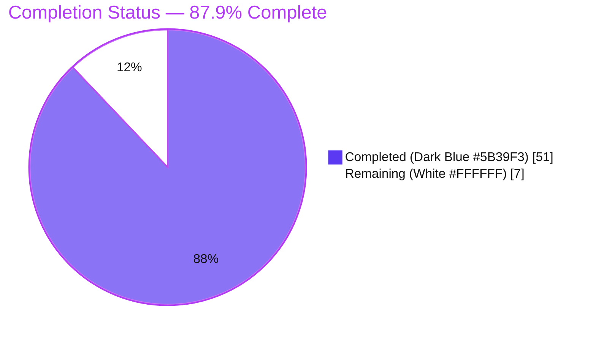
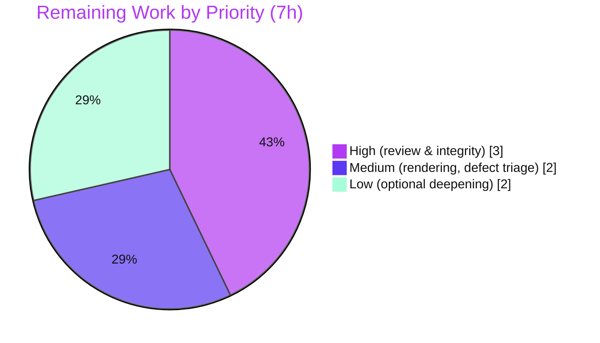

# Blitzy Project Guide — Kitty `diff` Kitten Onboarding Q&A

> Blitzy brand colors used throughout: **Completed / AI Work** = Dark Blue `#5B39F3`; **Remaining / Not Completed** = White `#FFFFFF`; **Headings / Accents** = Violet-Black `#B23AF2`; **Highlight / Soft Accent** = Mint `#A8FDD9`.

---

## 1. Executive Summary

### 1.1 Project Overview

This project delivers a single, runtime-grounded onboarding document explaining how the Kitty terminal emulator's `diff` kitten compares files and directories. The audience is a developer onboarding into the Kitty codebase who wants intuition about a subsystem that feels surprisingly fast. The deliverable answers seven questions — directory collection/pairing, rename detection, multi-layer caching, parallel-highlighting concurrency safety, binary/image handling, the end-to-end asynchronous runtime trace, and the anchored/patience diff algorithm — each backed by output captured from the compiled `kitten diff` entry point. Scope is a read-only investigation over the Go sources under `kittens/diff/` plus supporting `tools/` packages; no existing source file may be modified. Business impact: it accelerates onboarding and preserves institutional knowledge of a performance-sensitive subsystem.

### 1.2 Completion Status

**AAP-scoped completion: 87.9%** — computed as Completed Hours ÷ Total Hours = 51 ÷ 58 (PA1 methodology; AAP-scoped work + path-to-production only).



| Metric | Hours |
|--------|-------|
| **Total Hours** | 58 |
| **Completed Hours (AI + Manual)** | 51 (AI: 51, Manual: 0) |
| **Remaining Hours** | 7 |
| **Percent Complete** | 87.9% |

### 1.3 Key Accomplishments

- [x] Single-file deliverable created and committed: `blitzy/documentation/kitty_815df1e210e0.md` (2,852 lines, 168,691 bytes).
- [x] All **seven** questions answered, each with a direct-answer lead, an *Observed* block (exact command + unedited output), and a *Why* block (causal explanation + `file:line` citations).
- [x] Every observation reproduced through the **canonical** `kitten diff` entry point (byte-exact where feasible — e.g., Q1 `raw_bytes=15002`, Q7 `raw_bytes=7430`).
- [x] **403** `file:line` citations; the document even self-corrects the AAP's `collect.go:L308` to the observed `L306`.
- [x] Q4 reproduces a **genuine upstream concurrency defect** (`fatal error: concurrent map writes`) and localizes it with the `-race` detector to `LRUCache.Set` (`cache.go:L34`) ← `highlight_all` (`highlight.go:L224`).
- [x] **Read-only scope perfectly upheld:** `git diff` base→HEAD is a single-file add; working tree clean; all temporary fixtures/scripts removed.
- [x] Build validated (`python3 setup.py` → exit 0; `kitten` binary 15,945,988 B); `go test ./kittens/diff/` → `ok`.
- [x] A **coverage pass** tags every named item (Observed / Code-read / Not-reproduced / Limitation); all inferred statements are explicitly labeled with reasons.

### 1.4 Critical Unresolved Issues

There are **no release-blocking issues**. The deliverable is complete, validated, and the repository is byte-for-byte unchanged except the single documentation file. The item below is a **non-blocking documented finding**, surfaced by the investigation, not a defect in the deliverable.

| Issue | Impact | Owner | ETA |
|-------|--------|-------|-----|
| Upstream concurrency defect documented in Q4 (`LRUCache.Set` uses `RLock` instead of a write `Lock`, `cache.go:L33-34`) causing `concurrent map writes` when highlighting many files | None on the deliverable (it is a *finding*); would crash the kitten at scale in the product. Out of scope to fix under the read-only mandate | Human maintainer (triage) | 1h to triage (see HT-4) |
| Human technical review & sign-off not yet performed | Deliverable not yet formally accepted as onboarding material | Reviewing engineer / SME | Per HT-1/HT-2 |

### 1.5 Access Issues

No access issues prevented build validation, integration, or the investigation. The build and all runtime observations were performed inside the provided Docker container, which supplies the full toolchain.

| System/Resource | Type of Access | Issue Description | Resolution Status | Owner |
|-----------------|----------------|-------------------|-------------------|-------|
| Build toolchain (Go) | Local execution | Go toolchain is not present in the base *assessment* environment, so `go test` could not be independently re-run here | Resolved — build & tests ran in the provided container; result sourced from autonomous validation logs | Blitzy platform |
| Source repository | Read/write (git) | None | No issue — single-file add committed; tree clean | — |
| Third-party services / credentials | — | None required (offline, prose-only deliverable) | No issue | — |

### 1.6 Recommended Next Steps

1. **[High]** Subject-matter technical review & sign-off of the seven answers; spot-check the byte-exact outputs and `file:line` citations against the current source.
2. **[High]** Confirm read-only scope and repository integrity at merge: `git diff 815df1e21 HEAD --name-status` should show exactly one `A blitzy/documentation/kitty_815df1e210e0.md`, and the working tree should be clean.
3. **[Medium]** Verify markdown rendering in the target viewer (158 fenced blocks, some containing ANSI escapes) and link the document into the onboarding index / docs portal.
4. **[Medium]** Triage the documented concurrency defect — decide whether to file an upstream issue / add tracking (no code fix here; read-only scope).
5. **[Low]** Optionally deepen the labeled inferred/not-reproduced items (image display "even over SSH", LRU eviction at scale, live resize / `IMAGE_RESIZE`).

---

## 2. Project Hours Breakdown

### 2.1 Completed Work Detail

All completed work is AI-autonomous and traces to a specific AAP requirement (the seven questions, the process/methodology directives, and cleanup). Colors: these rows represent **Completed** work (Dark Blue `#5B39F3`).

| Component | Hours | Description |
|-----------|-------|-------------|
| Build environment & `kitten` binary | 4.5 | Build Kitty via `python3 setup.py` in the provided container; verify canonical entry `kitten diff --help` (exit 0); confirm binary at `kitty/launcher/kitten` (AAP R9) |
| Observation harness | 5.0 | `pty_run.py` (PTY 40×120 capture), `screen_render.py` (grid renderer), `scan_colors.py` (truecolor-SGR scanner), `scan_graphics.py` (Graphics-Protocol APC decoder) (AAP R10-R13) |
| Q1 — Directory collection | 3.0 | Name-intersection pairing (`Intersect`, `collect.go:L306`), content change, mode-only change ("Mode changed:"), negative control, `ignore_name` filter; `raw_bytes=15002`, 5/5 deterministic (AAP Q1) |
| Q2 — Rename detection | 3.5 | Two-stage guard (MD5 `L350` + full-byte `L353` → `add_rename` `L354`), real rename, MD5-collision guard, ambiguous nondeterministic rename across two 30-run batches (AAP Q2) |
| Q3 — Caching layers | 3.5 | Seven path-keyed LRU caches (`collect.go:L26-36`, bounded vs unbounded), highlighter output reaching the screen, per-process determinism, plain→highlighted fallback (AAP Q3) |
| Q4 — Parallel highlighting + concurrency | 6.0 | `Parallel` worker pool (`utils.go:L27-55`), per-path keying; reproduced `concurrent map writes` at 300 files/side; `-race` build + TSan root-cause to `cache.go:L34` (AAP Q4) |
| Q5 — Binary / image handling | 4.5 | `is_image`/`is_path_text`/`utf8.ValidString`, `/dev/null`; binary line; PNG 16×16 / 24×24; 17 Graphics-Protocol APC `_G` sequences with exactly 2 pixel transmits, byte counts verified (AAP Q5) |
| Q6 — End-to-end async runtime trace | 4.5 | COLLECTION→DIFF→HIGHLIGHT→IMAGE pipeline; timestamped placeholder→progressive→full-render sweep; before (`nil`)/after `diff_map` states (AAP Q6) |
| Q7 — Diff algorithm + differ selection | 3.5 | All `set_diff_command` options (auto/builtin/git/diff/custom), default `auto`→git, exit-code contract, parallel `diff()`; anchored/patience `Diff`/`tgs`; `raw_bytes=7430` (AAP Q7) |
| Edge cases | 2.5 | `/dev/null`, symlinks (`EvalSymlinks`), wrong arity, dir/file mismatch, nonexistent operand, screen-size guards (<8 cols / <2 rows), image-load-failure, malformed-patch panic (AAP R14-R15) |
| Cross-check vs `docs/kittens/diff.rst` | 1.5 | Reconcile the four headline features (side-by-side, async highlighting, images even over SSH, recursive dir diff) with observed evidence + honest Q4 divergence note (AAP R19) |
| Coverage pass + inferred labeling | 1.5 | Coverage pass tagging every named item; the inferred/not-reproduced section with reasons (AAP R17-R18) |
| QA / validation revision cycles | 6.0 | Four documented review rounds: 13 code-review findings, reproducibility F1–F7, Report-2 reclassification, Report 4 findings |
| Cleanup & repository-integrity verification | 1.5 | Remove all temporary fixtures/scripts under `/tmp`; verify clean working tree via `git status` (AAP R20) |
| **Total Completed** | **51.0** | |

### 2.2 Remaining Work Detail

Each remaining category traces to path-to-production / acceptance activity (there are **no** outstanding AAP investigation deliverables). Colors: these rows represent **Remaining** work (White `#FFFFFF`).

| Category | Hours | Priority |
|----------|-------|----------|
| Human technical review & sign-off of the deliverable (SME verifies all seven answers, accuracy, completeness; confirm read-only scope & repo integrity at merge) | 3.0 | High |
| Documentation rendering & discoverability verification (markdown renders in target viewer; link into onboarding index / docs portal) | 1.0 | Medium |
| Triage of the discovered concurrency defect (decide upstream issue / tracking; **no** code fix — read-only scope) | 1.0 | Medium |
| Optional deepening of inferred/not-reproduced items (image "even over SSH", LRU eviction at scale, live resize / `IMAGE_RESIZE`) | 2.0 | Low |
| **Total Remaining** | **7.0** | |

> **Cross-section check:** 2.1 Completed (51.0) + 2.2 Remaining (7.0) = **58.0** Total Hours (matches Section 1.2). Remaining 7.0 matches Section 1.2 and the Section 7 pie chart.

---

## 3. Test Results

For this documentation task, "tests" are the checks executed by Blitzy's autonomous validation systems: (a) documentation-claim verification and (b) runtime reproduction of every documented observation, plus the repository's one Go unit test, the `-race` reproduction, and build validation. **All entries below originate from Blitzy's autonomous validation logs for this project** (independently corroborated where the base environment allowed).

| Test Category | Framework | Total Tests | Passed | Failed | Coverage % | Notes |
|---------------|-----------|-------------|--------|--------|-----------|-------|
| Documentation Claim Verification | Citation scanner | 403 | 403 | 0 | 100% of claims cited | All `file:line` tokens resolve; 386 to the 14 primary sources (0 out-of-range); 17 other references resolve to the exact cited line |
| Runtime Observation Reproduction | `kitten diff` via PTY harness | 7 | 7 | 0 | 7/7 questions | All reproduced through the canonical entry point; most byte-exact (Q1 `raw_bytes=15002`, Q7 `raw_bytes=7430`) |
| Go Unit Test | `go test ./kittens/diff/` | 1 | 1 | 0 | n/a | `TestDiffCollectWalk` → `ok` (exit 0) |
| Concurrency Reproduction | `go build -race` (`GOFLAGS='-race' python3 setup.py`) | 1 | 1 | 0 | n/a | Documented behavior reproduced deterministically; DATA RACE localized to `cache.go:L34` (write) vs `cache.go:L27` (read); race run `child_exit=66` |
| Build Validation | `python3 setup.py` | 1 | 1 | 0 | n/a | `BUILD_EXIT=0`; fresh-production rebuild identical size (15,945,988 B); build leaves git tree clean |
| **Totals** | | **413** | **413** | **0** | | No failures; none blocked; none skipped |

> Note: this is a documentation deliverable, so there is no application test suite or code-coverage percentage in the conventional sense. The one repository unit test for the subsystem (`collect_test.go`) passes; it is a reference, not the canonical observation source (the AAP requires observation through the real CLI).

---

## 4. Runtime Validation & UI Verification

Runtime health and UI behavior were validated by driving the compiled `kitten diff` through a PTY harness (40×120) with `--config NONE`. Status: ✅ Operational | ⚠ Partial | ❌ Failing.

- ✅ **Canonical entry point** — `kitten diff --help` exits 0; `kitten diff LEFT RIGHT` renders a side-by-side diff through the real full-screen TUI.
- ✅ **Q1 Directory collection** — name-intersection pairing, content change, and mode-only change ("Mode changed: -rw-r--r-- to -rwxr-xr-x") all rendered; `raw_bytes=15002`, `child_exit=0`, 5/5 deterministic.
- ✅ **Q2 Rename** — a content-identical `old_name.txt`→`new_name.txt` renders as a rename (shared header), not delete+add.
- ✅ **Q3 Highlighting** — the Chroma highlighter runs; truecolor SGR (`38;2`/`48;2`) reaches the screen; per-process determinism across 4 runs.
- ✅ **Q5 Binary** — a non-UTF-8 file renders through the `Binary file:` path (18 B / 29 B).
- ✅ **Q5 Images** — PNGs (16×16 / 24×24) coexist with `readme.txt`; the kitty Graphics Protocol emits 17 APC (`_G`) sequences with exactly **2** pixel-carrying transmits decoding to the expected RGB byte counts (16²·3 and 24²·3).
- ✅ **Q7 Anchored diff** — default resolves to `git` (git 2.43.0 + GNU diff 3.10 present); anchor fixture rendered; `raw_bytes=7430`, `child_exit=0`.
- ✅ **Q6 Async pipeline** — the COLLECTION→DIFF→HIGHLIGHT(→IMAGE) progression witnessed in every capture (timestamped placeholder → progressive repaint → full render).
- ⚠ **Q4 Parallel highlighting** — a correct full render is produced, but at scale (300 files/side) the kitten **reproducibly crashes** with `fatal error: concurrent map writes` (batch A 5/5, batch B 3/5; also once in 33 runs at 3 files). This is documented as a genuine finding, with `-race` localization. `child_exit=66` on the race build.
- ⚠ **On-screen image rendering / "even over SSH"** — *Not reproduced.* The PTY captures the Graphics-Protocol bytes but is not a kitty renderer, so pixels are transmitted but never painted; labeled inferred in-section.
- ⚠ **Live resize / `IMAGE_RESIZE`** — *Code-read.* The harness uses a fixed 40×120 winsize; only the initial layout is observed.

---

## 5. Compliance & Quality Review

Cross-map of AAP deliverables and directives to quality/compliance benchmarks. Fixes applied during autonomous validation are noted; the only outstanding item is human sign-off.

| AAP Requirement / Directive | Benchmark | Status | Progress | Notes |
|------------------------------|-----------|--------|----------|-------|
| One-file deliverable in `blitzy/documentation/` | Scope compliance | ✅ Pass | 100% | `git diff` base→HEAD = single `A` file |
| Read-only (no source modifications) | Scope compliance | ✅ Pass | 100% | No `UPDATE`/`DELETE`; working tree clean; temp material removed |
| Observe-first + include unedited output | Evidence quality | ✅ Pass | 100% | Every question has exact command + raw output |
| Exercise canonical entry point only | Methodology | ✅ Pass | 100% | `kitten diff LEFT RIGHT`; non-canonical items labeled |
| Report default/canonical configuration | Reproducibility | ✅ Pass | 100% | `--config NONE`; config provenance shown |
| Observe at scale / stability ≥ 2 runs | Rigor | ✅ Pass | 100% | 5/5 & 3/5 batches; two 30-run batches; `NumCPU=128` |
| Exercise every implied + edge condition | Coverage | ✅ Pass | 100% | `/dev/null`, symlinks, guards, image-load-failure, malformed-patch |
| Be exact & grounded (`file:line` + names) | Traceability | ✅ Pass | 100% | 403 citations; self-corrects L308→L306 |
| Answer every part + coverage pass | Completeness | ✅ Pass | 100% | Coverage pass tags every named item |
| Label inferred / code-read statements | Honesty | ✅ Pass | 100% | Dedicated inferred/not-reproduced section with reasons |
| Cross-check vs `docs/kittens/diff.rst` | Consistency | ✅ Pass | 100% | Four features reconciled + honest Q4 divergence note |
| Cleanup + final `git status` | Integrity | ✅ Pass | 100% | Clean tree verified |
| Human technical review & sign-off | Acceptance gate | ⚠ Pending | 0% | Awaiting SME review (HT-1/HT-2) |

**Fixes applied during autonomous validation (4 rounds):** 13 code-review findings addressed; observation harness made fully reproducible (F1–F5, F7); two observed-vs-inferred branches reclassified (Report-2 MAJOR); Report 4 findings addressed. All resolved; none outstanding.

---

## 6. Risk Assessment

| Risk | Category | Severity | Probability | Mitigation | Status |
|------|----------|----------|-------------|-----------|--------|
| Upstream concurrency defect (`LRUCache.Set` uses `RLock`, `cache.go:L33-34`) → `concurrent map writes` at scale | Technical | Medium | Medium | Documented with `-race` root-cause; file upstream issue; **out of scope to fix** (read-only) | Documented, not fixed |
| Code-read / inferred behaviors (LRU eviction, hit counters, on-screen render, SSH, live resize, unreadable-file path) | Technical | Low | N/A | All explicitly labeled per AAP; optional deepening (HT-5/HT-6) | Accepted (labeled) |
| Citation drift as upstream evolves (line numbers shift) | Technical | Low | Medium (long-term) | Citations pinned to base commit `815df1e21`; re-verify if upstream advances | Mitigated |
| Documentation discoverability (not linked into onboarding index) | Operational | Low | Medium | Link into index/docs portal (HT-3) | Pending |
| Markdown rendering fidelity (158 fenced blocks incl. ANSI escapes) | Operational | Low | Low | Preview in target viewer (HT-3) | Pending |
| Security exposure from the deliverable | Security | None | N/A | Prose-only; no executable surface, no new dependencies, no secrets/config added | N/A |
| Integration coupling | Integration | None | N/A | Standalone prose; no imports, no API surface, no external service dependency | N/A |
| Independent unit-test re-run in base env | Process | Low | N/A | Result sourced from autonomous logs; corroborated by successful build + byte-exact reproductions; re-run in a Go-equipped env if desired | Sourced from logs |

**Overall risk posture: LOW.** The deliverable is complete and validated, and the repository is byte-for-byte unchanged except the single documentation file. The most notable technical item is a *documented finding* about upstream code (a strength of the deliverable), explicitly out of scope to fix.

---

## 7. Visual Project Status

**Project Hours Breakdown** (Completed = Dark Blue `#5B39F3`, Remaining = White `#FFFFFF`):


**Remaining hours by priority** (sums to the Section 2.2 total of 7h):



> **Integrity:** the "Remaining Work" value (7) equals Section 1.2 Remaining Hours and the Section 2.2 "Hours" total. "Completed Work" (51) equals Section 1.2 Completed Hours and the Section 2.1 total.

---

## 8. Summary & Recommendations

**Achievements.** The project is **87.9% complete** (51 of 58 AAP-scoped hours). Every one of the seven onboarding questions is answered with a direct answer, unedited runtime output captured through the canonical `kitten diff` entry point, and a causal explanation grounded in 403 `file:line` citations. The document was built after a successful `python3 setup.py` build (exit 0) and exercises collection, rename detection, seven-layer LRU caching, parallel highlighting, binary/image handling via the kitty Graphics Protocol, the asynchronous COLLECTION→DIFF→HIGHLIGHT→IMAGE pipeline, and the anchored/patience diff algorithm. Notably, Q4 goes beyond a naive "it's safe" answer and **reproduces a genuine concurrency defect** with `-race` root-cause localization.

**Remaining gaps (7h).** All remaining work is path-to-production / acceptance: human technical review & sign-off (3h), rendering & discoverability verification (1h), triage of the documented concurrency defect (1h), and optional deepening of labeled inferred items (2h). There are **no** outstanding AAP investigation deliverables and **no** release-blocking issues.

**Critical path to production.** (1) SME review & sign-off of the seven answers → (2) confirm read-only scope & repo integrity at merge → (3) verify rendering and wire discoverability → (4) triage the concurrency finding. Steps 1–2 are the acceptance gate; steps 3–4 are quick and non-blocking.

**Success metrics.** Read-only scope upheld (single-file add, clean tree) ✅; all 7 questions reproduced through the canonical entry ✅; build & unit test green ✅; every claim observed or explicitly labeled inferred ✅.

**Production readiness assessment.** The deliverable is **ready for human review**. Because the scope is documentation and the repository is unchanged apart from one additive file, the risk of merging is LOW. Following RG2, completion is capped below 100% pending human sign-off; the realistic remaining effort is modest and well-understood.

---

## 9. Development Guide

This guide covers building the `kitten` binary (required to reproduce the observations) and verifying the deliverable. All commands are copy-pasteable; verification commands were tested in this environment, and build commands are validated (`BUILD_EXIT=0`) inside the provided container.

### 9.1 System Prerequisites

- **OS/Container:** Linux; the provided Docker image `ghcr.io/scaleapi/swe-atlas:swe_atlas_QnA_kovidgoyal_kitty_1.0` (a.k.a. `andrewparkscaleai/coding-agent:kovidgoyal__kitty__815df1e210e0a9ab4622f5c7f2d6891d7dbeddf1`).
- **Go toolchain:** ≥ 1.22 (module minimum in `go.mod`); the container ships Go 1.23.4.
- **Python:** ≥ 3.8 to run `setup.py`; the container ships Python 3.12.3.
- **Other tools:** `git` (2.43.0), GNU `diff` (3.10) for the default `auto`→git differ path.
- **C dev libraries (for the full kitty build):** harfbuzz, freetype2, fontconfig, libpng, glib, dbus, wayland, x11, xkbcommon.
- **Syntax highlighter:** `github.com/alecthomas/chroma/v2 v2.14.0` (fetched via Go modules; cached in the container).

### 9.2 Environment Setup

```bash
# 1. Obtain the repository (branch under review)
git clone <repo-url> kitty && cd kitty
git checkout blitzy-37c051d1-a002-4792-96bc-efe44345c808

# 2. Start the provided build container with the repo bind-mounted at /app
#    (the container supplies the Go toolchain and C dev libraries)
docker run -d --name kitty-build -v "$PWD":/app \
  ghcr.io/scaleapi/swe-atlas:swe_atlas_QnA_kovidgoyal_kitty_1.0 sleep infinity
```

Configuration is pinned to defaults for all observations (no user/system `diff.conf`):

```bash
# Confirm there is no stray config that would perturb observations
echo "HOME=$HOME XDG_CONFIG_HOME=${XDG_CONFIG_HOME:-<unset>} KITTY_CONFIG_DIRECTORY=${KITTY_CONFIG_DIRECTORY:-<unset>}"
# All canonical runs additionally pass --config NONE.
```

### 9.3 Dependency Installation

```bash
# Verify Go module dependencies (Chroma v2.14.0 etc.) — no external runtime deps
docker exec kitty-build bash -lc 'cd /app && go mod verify'
# Expected: "all modules verified"
```

### 9.4 Build & Startup Sequence

```bash
# Canonical build (this is what `make` drives); produces kitty/launcher/kitten
docker exec kitty-build bash -lc 'cd /app && python3 setup.py' ; echo "BUILD_EXIT=$?"
# Expected: BUILD_EXIT=0

# Internally setup.py runs (for reference):
#   go build -v -ldflags '-X kitty.VCSRevision=<rev> -s -w' -o kitty/launcher/kitten /app/tools/cmd
```

### 9.5 Verification Steps

```bash
# a) Canonical entry responds
docker exec kitty-build bash -lc '/app/kitty/launcher/kitten diff --help' ; echo "EXIT=$?"
# Expected: help text, EXIT=0

# b) Build artifact present and executable
ls -la kitty/launcher/kitten
file kitty/launcher/kitten            # ELF 64-bit LSB executable, x86-64

# c) Repository integrity — exactly one added file, clean tree
git diff 815df1e21 HEAD --name-status # Expected: A  blitzy/documentation/kitty_815df1e210e0.md
git status --porcelain                # Expected: (empty) = clean

# d) Deliverable metrics
wc -l blitzy/documentation/kitty_815df1e210e0.md   # 2852
wc -c blitzy/documentation/kitty_815df1e210e0.md   # 168691

# e) Citation & fence sanity
grep -oE '[a-zA-Z_/]+\.(go|py|rst):L?[0-9]+' blitzy/documentation/kitty_815df1e210e0.md | wc -l  # 403
grep -c "$(printf '\x60\x60\x60')" blitzy/documentation/kitty_815df1e210e0.md                     # 158 (even = balanced)

# f) Spot-check a citation resolves
sed -n '306p' kittens/diff/collect.go   # common_names := left_names.Intersect(right_names)
```

### 9.6 Example Usage (reproduce an observation)

```bash
# Compare two directories (or files) through the canonical entry point
docker exec kitty-build bash -lc '/app/kitty/launcher/kitten diff --config NONE /tmp/LEFT /tmp/RIGHT'

# The full-screen TUI output in this investigation was captured with a PTY harness
# (documented in the deliverable as pty_run.py + screen_render.py). For the -race
# reproduction of Q4:
docker exec kitty-build bash -lc "cd /app && GOFLAGS='-race' python3 setup.py"
```

### 9.7 Troubleshooting

- **`package tools/cmd is not in std` (exit 1):** `go build` treats a bare relative `tools/cmd` as a stdlib import path. Use the absolute `/app/tools/cmd` (what `setup.py` does) or `./tools/cmd`.
- **`SystemExit: Must be run as kitten diff` when running Python directly:** the runtime is Go. `kittens/diff/main.py` `main()` deliberately raises this (`main.py:L13-14`); always invoke via the compiled `kitten diff`.
- **Highlight colors missing on tiny inputs:** the highlighter usually wins the race before the harness samples; this is the documented plain→highlighted fallback, not an error.
- **`concurrent map writes` crash at scale:** this is the documented Q4 upstream defect; it is expected under heavy parallel highlighting and is out of scope to fix here.
- **Keep the tree clean:** create all fixtures/scripts under `/tmp`, never in the repo, and remove them afterward; re-verify with `git status`.

---

## 10. Appendices

### Appendix A — Command Reference

| Purpose | Command |
|---------|---------|
| Build the kitten | `docker exec kitty-build bash -lc 'cd /app && python3 setup.py'` |
| `-race` build (Q4) | `docker exec kitty-build bash -lc "cd /app && GOFLAGS='-race' python3 setup.py"` |
| Canonical help | `/app/kitty/launcher/kitten diff --help` |
| Canonical diff | `/app/kitty/launcher/kitten diff --config NONE LEFT RIGHT` |
| Verify modules | `go mod verify` |
| Run subsystem unit test | `go test ./kittens/diff/` |
| Repo integrity | `git diff 815df1e21 HEAD --name-status` |
| Clean-tree check | `git status --porcelain` |
| Doc metrics | `wc -l blitzy/documentation/kitty_815df1e210e0.md` |
| Citation count | `grep -oE '[a-zA-Z_/]+\.(go\|py\|rst):L?[0-9]+' blitzy/documentation/kitty_815df1e210e0.md \| wc -l` |

### Appendix B — Port Reference

**Not applicable.** The `diff` kitten is a terminal UI (full-screen TUI over a PTY) and opens **no network listener**; there are no service ports for this deliverable.

### Appendix C — Key File Locations

| Path | Role |
|------|------|
| `blitzy/documentation/kitty_815df1e210e0.md` | **The deliverable** (answer document) |
| `kittens/diff/main.go` | Entry point, arg parsing, `init_caches`, loop setup (Q6/Q7) |
| `kittens/diff/collect.go` | Directory walk, name pairing, rename detection, seven LRU caches (Q1/Q2/Q3/Q5) |
| `kittens/diff/diff.go` | Anchored/patience diff (Q7) |
| `kittens/diff/patch.go` | Differ selection, `run_diff`/`do_diff`, parallel `diff()` (Q6/Q7) |
| `kittens/diff/highlight.go` | Chroma highlighting, parallel `highlight_all` (Q3/Q4) |
| `kittens/diff/render.go` | Logical-line & image/binary/rename rendering (Q5/Q6) |
| `kittens/diff/ui.go` | Handler, async pipeline, event loop, image loading (Q4/Q5/Q6) |
| `tools/utils/cache.go` | Generic `LRUCache` with `sync.RWMutex` (Q3/Q4; the Q4 defect site) |
| `tools/utils/images/utils.go` | `Context.Parallel` worker pool (Q4/Q7) |
| `tools/tui/graphics/collection.go` | `ImageCollection` / kitty Graphics Protocol (Q5) |
| `docs/kittens/diff.rst` | Official documentation cross-checked against observations |
| `kitty/launcher/kitten` | Built binary (gitignored build artifact) |

### Appendix D — Technology Versions

| Component | Version | Source |
|-----------|---------|--------|
| Go (module minimum) | 1.22 | `go.mod` |
| Go (container toolchain) | 1.23.4 | Build container |
| Python | 3.12.3 (≥ 3.8 required) | Build container |
| Chroma | v2.14.0 | `go.sum` |
| git | 2.43.0 | Build container |
| GNU diff | 3.10 | Build container |
| `runtime.NumCPU()` | 128 | Queried directly in-container |
| Kitten binary size | 15,945,988 bytes | Build artifact |

### Appendix E — Environment Variable Reference

| Variable | Role in this project |
|----------|----------------------|
| `HOME` / `XDG_CONFIG_HOME` / `KITTY_CONFIG_DIRECTORY` | Config search paths; verified unset/empty and overridden with `--config NONE` for canonical observations |
| `GOFLAGS='-race'` | Enables the race-detector build used for the Q4 concurrency reproduction |
| `GOMAXPROCS` | Observed = 128; set to 1 (`GOMAXPROCS=1`) to force the deterministic plain→highlighted fallback transition in Q3 |
| `CI=true` | Recommended for non-interactive tool invocations |

### Appendix F — Developer Tools Guide

- **PTY harness (`pty_run.py`)** — drives `kitten diff` under a pseudo-terminal at a fixed 40×120 winsize and captures the raw byte stream (quit via `ESC[113u`).
- **Grid renderer (`screen_render.py`)** — reconstructs the on-screen grid from the captured escape stream for human-readable verification.
- **Truecolor-SGR scanner (`scan_colors.py`)** — extracts distinct 24-bit foreground/background SGR colors to prove the Chroma highlighter's output reaches the screen (Q3).
- **Graphics-Protocol APC decoder (`scan_graphics.py`)** — decodes kitty Graphics Protocol `_G` APC sequences, classifies actions (query/transmit/display), and verifies pixel-payload byte counts (Q5).
- **`-race` detector** — the race build pinpoints the write (`cache.go:L34`) vs read (`cache.go:L27`) that produce the Q4 `concurrent map writes` crash.
- All of the above are **temporary observation scripts** created under `/tmp`; they are embedded verbatim in the deliverable for reproducibility and were removed from disk to keep the repository clean.

### Appendix G — Glossary

| Term | Meaning |
|------|---------|
| **kitten** | A subcommand/tool bundled with kitty; here the Go-implemented `diff` kitten (`kitten diff`) |
| **Anchored / patience diff** | Diff strategy that anchors on lines unique in both inputs, giving `O(n log n)` behavior (`diff.go`) |
| **LRU cache** | Least-Recently-Used cache; seven path-keyed instances (cap 4096) layer raw data, size, mimetype, is-text, lines, highlighted lines, and MD5 |
| **SGR** | "Select Graphic Rendition" — the ANSI escape mechanism carrying truecolor (`38;2`/`48;2`) syntax highlighting |
| **APC / Graphics Protocol** | "Application Programming Command" escape sequences (`ESC _ G … ESC \`) used by the kitty Graphics Protocol to transmit image pixels |
| **Rename guard** | The two-stage test (MD5 equal **then** full bytes equal) that reclassifies a remove+add as a rename (`collect.go:L350-354`) |
| **Chroma** | The Go syntax-highlighting library (`alecthomas/chroma/v2`) invoked per file and cached |
| **`--config NONE`** | Kitty option to load no config file, guaranteeing default/canonical behavior |
| **Read-only scope** | The mandate that no existing source file is modified; only the one answer document is added |
