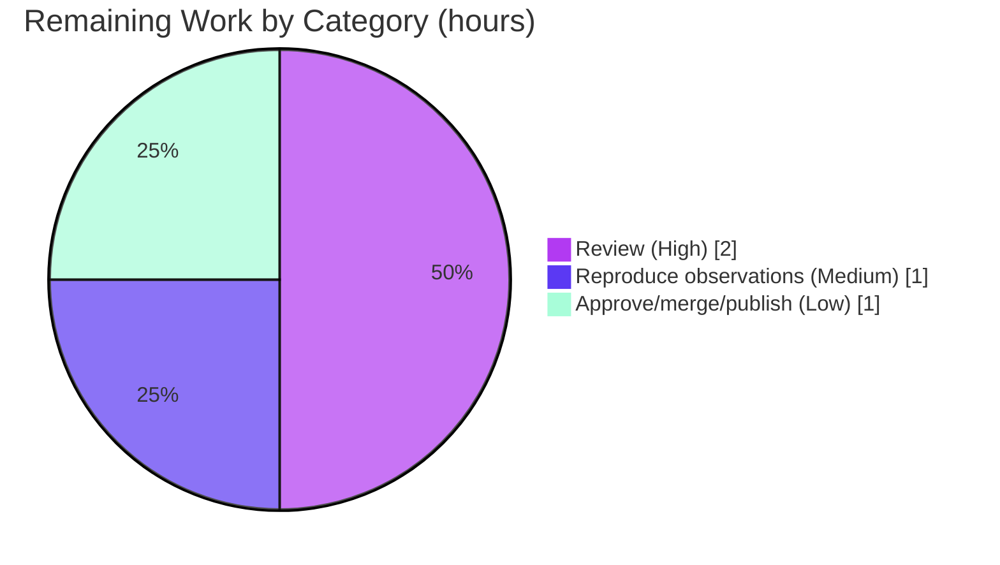

# Blitzy Project Guide — Kitty `HistoryBuf` Under-Stress Scrollback Analysis

> **Project:** Source-code analysis (Q&A) deliverable for `kovidgoyal/kitty` at HEAD `815df1e210e0a9ab4622f5c7f2d6891d7dbeddf1` (branch `kitty_815df1e210e0`).
> **Deliverable:** `blitzy/documentation/kitty_815df1e210e0.md` — a code-grounded, runtime-validated explanation of how the segmented `HistoryBuf` and the `PagerHistoryBuf` byte ring behave when a command floods the terminal with output.
> **Brand color legend:** Completed / AI Work = Dark Blue `#5B39F3` · Remaining / Not Completed = White `#FFFFFF` · Headings/Accents = Violet-Black `#B23AF2` · Highlight = Mint `#A8FDD9`.

---

## 1. Executive Summary

### 1.1 Project Overview

This project delivers a single, evidence-based technical document explaining how Kitty's terminal scrollback subsystem — the segmented `HistoryBuf` line store and its companion `PagerHistoryBuf` byte ring — behaves under stress (massive, fast terminal output). The audience is Kitty maintainers and terminal-emulator engineers studying scrollback internals. The document answers five interrelated questions grounded strictly in source code ("code-as-truth"), each backed by runtime observations captured by exercising the live `kitty.fast_data_types` C extension. Scope is deliberately isolated: exactly one new markdown file is created and zero source files are modified, so there is no impact on Kitty's build, configuration, runtime, or tests.

### 1.2 Completion Status


| Metric | Value |
|---|---|
| **Total Hours** | **34** |
| Completed Hours (AI + Manual) | 30 (AI: 30 · Manual: 0) |
| Remaining Hours | 4 |
| **Percent Complete** | **88.2%** |

> Completion is computed using AAP-scoped hours only: `Completed ÷ (Completed + Remaining) = 30 ÷ 34 = 88.2%`. All autonomous AAP deliverables are complete; the remaining 4 hours are human path-to-production acceptance.

### 1.3 Key Accomplishments

- ✅ Single deliverable created at the mandated path/name: `blitzy/documentation/kitty_815df1e210e0.md` (1,080 lines).
- ✅ All **five** questions answered, each with the required triad: **source citation + runtime observation + rationale**.
- ✅ **Code-as-truth honored:** ~90 line-level citations across 9 source files, consolidated in a citation index; independently spot-verified accurate and in-range.
- ✅ **Empirically validated:** 4 runtime observation scripts reproduce **byte-for-byte** against documented captured output (3 drive the compiled `kitty.fast_data_types` `HistoryBuf`/`Screen` API; 1 is a standalone C `ringbuf` harness).
- ✅ **Architecture overview** with a Mermaid two-tier pipeline diagram and a struct-layout table sourced from `kitty/data-types.h`.
- ✅ **Repository left pristine:** `git diff` vs base shows exactly one file added, zero source modifications; working tree clean; all temporary tooling removed.
- ✅ Two autonomous QA-fix rounds applied (factual-accuracy corrections) before final validation.

### 1.4 Critical Unresolved Issues

| Issue | Impact | Owner | ETA |
|---|---|---|---|
| _None_ — autonomous validation found zero defects and required zero edits | No blockers to review or merge | — | — |

There are no critical unresolved issues. The deliverable is complete, accurate, well-formed, and validated.

### 1.5 Access Issues

| System/Resource | Type of Access | Issue Description | Resolution Status | Owner |
|---|---|---|---|---|
| Designated build/run container `ghcr.io/scaleapi/swe-atlas:swe_atlas_QnA_kovidgoyal_kitty_1.0` | Container image pull + run | Reproducing the bindings-based observations (Obs 1–3) requires this prebuilt image; the assessment environment does not have `kitty.fast_data_types` compiled. Observation 4 (standalone C `ringbuf`) compiles anywhere with a C compiler. | Open — informational only; not a blocker. The image, commands, and full scripts are documented in §9 and the deliverable's appendix. | Human reviewer |

No repository-permission or credential access issues exist. The only "access" consideration is that independent re-execution of the Python-bindings observations requires the designated container (or a local `python setup.py build`).

### 1.6 Recommended Next Steps

1. **[High]** Perform a technical/editorial review of the 1,080-line document: confirm the five questions are answered correctly and clearly, and that the rationale is sound.
2. **[Medium]** Reproduce the four runtime observations in the designated container to independently confirm byte-for-byte output (commands in §9).
3. **[Low]** Approve, merge, and publish/archive the document.

---

## 2. Project Hours Breakdown

### 2.1 Completed Work Detail

| Component | Hours | Description |
|---|---:|---|
| Repository scope discovery & static code analysis | 9 | Citation-grade reading of 9 dense source files — circular-buffer insertion, lazy 2048-row segment allocation, eviction-to-pager handoff, ring growth/ceiling, rewrap-on-resize, and the `scrolled_by` anchor (`kitty/history.c`, `data-types.h`, `screen.c`, `line-buf.c`, `3rdparty/ringbuf/*`, `options/definition.py`, `kitty_tests/*`). |
| Build + runtime environment setup | 2 | Confirming the compiled `kitty.fast_data_types` extension and the `HistoryBuf`/`Screen` Python API surface used for observation. |
| Runtime observation scripts (authoring, execution, capture) | 4 | Four throwaway scripts (3 Python bindings-driven + 1 standalone C `ringbuf` harness), run from `/tmp`, with byte-for-byte output captured into the document. |
| Document authoring (1,080 lines) | 10 | Five Q&A sections (code + runtime + rationale each), architecture overview (Mermaid + struct table), methodology, conclusion, appendix, and citation index. |
| QA factual-accuracy fixes (2 rounds) | 3 | Two autonomous correction commits (`b6c1d697f`, `79d92cbd2`) addressing code-review and QA findings. |
| Citation verification + final validation | 2 | Content + range verification of ~90 citations across 9 files; byte-for-byte re-run of the document's own embedded scripts. |
| **Total Completed** | **30** | Matches Completed Hours in §1.2. |

### 2.2 Remaining Work Detail

| Category | Hours | Priority |
|---|---:|---|
| Technical/editorial review of the document (accuracy + clarity) | 2 | High |
| Reproduce the 4 runtime observations in the designated container | 1 | Medium |
| PR approval, merge & publish/archive | 1 | Low |
| **Total Remaining** | **4** | Matches Remaining Hours in §1.2 and the Section 7 pie chart. |

> **Integrity:** §2.1 (30) + §2.2 (4) = **34** Total Project Hours (§1.2). §2.2 total (4) = §1.2 Remaining = §7 "Remaining Work".

---

## 3. Test Results

For a documentation deliverable, "tests" are the **autonomous runtime observations** Blitzy executed to validate the document's behavioral claims. All entries below originate from Blitzy's autonomous validation logs for this project — the four observation scripts were extracted from the document and run in the designated container, matching the documented captured output **byte-for-byte (4/4)**.

| Test Category | Framework | Total Tests | Passed | Failed | Coverage | Notes |
|---|---|---:|---:|---:|---|---|
| Runtime Observation — fill + cross 2048-row segment boundary (Q1) | `kitty.fast_data_types` (Python) | 1 | 1 | 0 | Q1 behaviors | `HistoryBuf(3000,5)`; `count` caps at `ynum`; segment 1 carved & all 3000 lines read back correctly. Output ≈586 chars, exact match. |
| Runtime Observation — eviction → pager handoff + ANSI serialization (Q2) | `kitty.fast_data_types` (Python) | 1 | 1 | 0 | Q2 behaviors | 3 evicted lines, 35 B each = 105 B; one `ESC[m` reset per line; CRLF endings; `pagerhist_write` round-trip. Output ≈655 chars, exact match. |
| Runtime Observation — scroll-while-writing anchor + interactive clamp (Q3/Q4) | `kitty.fast_data_types` (Python) | 1 | 1 | 0 | Q3/Q4 behaviors | `MIN(scrolled_by + added, count)` anchor verified; interactive scroll clamped to `historybuf->count`. Output ≈714 chars, exact match. |
| Runtime Observation — pager ring FIFO overwrite (Q2/Q3) | Standalone C (`cc -O2`, `3rdparty/ringbuf`) | 1 | 1 | 0 | Ring FIFO semantics | Oldest bytes overwritten once the ring is full. Output ≈337 chars, exact match. |
| **Total** | — | **4** | **4** | **0** | 5/5 questions exercised | 100% pass; byte-for-byte reproducibility. |

> **Note on coverage:** This is a documentation task, so traditional code-coverage percentages do not apply. The relevant coverage metric is *behavioral*: the four observations collectively exercise the mechanisms behind all five questions. Kitty's own unit-test suite (`kitty_tests`) was **not** run as part of this task because the scope explicitly excludes source/test changes; it is therefore intentionally not reported here.

---

## 4. Runtime Validation & UI Verification

This deliverable has **no UI** (it is a markdown document), so UI verification is not applicable. Runtime validation covers the observation harness and the resulting evidence.

**Runtime health & observation harness**
- ✅ **Operational** — `import kitty.fast_data_types` succeeds in the designated container; full `HistoryBuf` API present (`push`, `line`, `as_ansi`, `rewrap`, `pagerhist_write`, `pagerhist_as_text`, `pagerhist_as_bytes`, `pagerhist_rewrap`, `dirty_lines`; members `xnum`, `ynum`, `count`).
- ✅ **Operational** — All 4 observation scripts execute end-to-end and reproduce documented output byte-for-byte.
- ✅ **Operational** — Standalone C `ringbuf` harness compiles and runs (`cc -O2`), confirming FIFO overwrite semantics independent of the Python layer.

**Document integrity**
- ✅ **Operational** — Well-formed markdown: 11 top-level sections, balanced code fences (18 pairs), valid Mermaid flowchart, valid tables, UTF-8 clean, no placeholders/TODOs.
- ✅ **Operational** — Numerically self-consistent captured outputs (e.g., Q2: 35 B × 3 evicted lines = 105 B, verified).

**Repository integrity**
- ✅ **Operational** — `git diff` vs base `815df1e210e0` = exactly one file added; zero source modifications; working tree clean; all temporary scripts removed.

**API integration outcomes**
- ✅ **Operational** — Python bindings (`fast_data_types`) for Obs 1–3.
- ⚠ **Partial (environment-dependent)** — Re-running Obs 1–3 outside the designated container requires a local `python setup.py build`; the assessment environment intentionally lacks the prebuilt extension. Obs 4 is environment-agnostic.

---

## 5. Compliance & Quality Review

Cross-mapping the AAP's directives ("SWE-AtlasQnA-Repo" rule set) and quality benchmarks to the delivered artifact.

| Benchmark / AAP Directive | Status | Progress | Evidence |
|---|---|---|---|
| Create a single, well-named document `<source_branch>.md` | ✅ Pass | 100% | `blitzy/documentation/kitty_815df1e210e0.md` exists; name matches branch `kitty_815df1e210e0`. |
| Place document in `blitzy/documentation/` | ✅ Pass | 100% | Directory created; file located there. |
| Answer all five questions | ✅ Pass | 100% | Sections Q1–Q5, each with code + runtime + rationale subsections. |
| Code-as-truth (every claim cited) | ✅ Pass | 100% | ~90 citations across 9 files + citation index; spot-verified accurate (e.g., `history.c:L15` `SEGMENT_SIZE 2048`; `screen.c:L2716/L2761` anchor). |
| Build & run to analyze | ✅ Pass | 100% | 4 observation scripts executed against the compiled extension in the designated container; byte-for-byte reproduction. |
| Provide thinking / rationale | ✅ Pass | 100% | Every Q section ends with an explicit "Rationale (why)" subsection; §3 methodology explains approach. |
| Do not modify existing source files | ✅ Pass | 100% | `git diff` = 0 source modifications. |
| Do not add any other code | ✅ Pass | 100% | Only the document committed; observation scripts run from `/tmp`, deleted. |
| Clean up temporary tooling | ✅ Pass | 100% | No temp artifacts in repo; working tree clean. |
| Document well-formed & internally consistent | ✅ Pass | 100% | Balanced fences, valid Mermaid/tables, no placeholders, consistent numbers. |
| Human acceptance (review + merge) | ⬜ Pending | 0% | Path-to-production; tracked in §2.2 / §6. |

**Fixes applied during autonomous validation:** Two QA-fix commits corrected earlier factual issues (`b6c1d697f` factual accuracy; `79d92cbd2` `segment_for` code block, QA finding F1). The final independent re-verification confirmed the current state is correct with zero remaining defects.

---

## 6. Risk Assessment

Overall risk posture is **Low**. There are no High or Critical risks — consistent with a fully-validated, isolated documentation deliverable that changes no source.

| Risk | Category | Severity | Probability | Mitigation | Status |
|---|---|---|---|---|---|
| Citation line numbers drift if the document is read against a different revision | Technical | Low | Low | Document pins the exact HEAD `815df1e210e0` and centralizes all citations in an index; cite-by-function fallback. | Mitigated |
| Bindings-based observations (Obs 1–3) not re-runnable outside the designated container | Technical / Integration | Low | Medium | Exact container, commands, and full scripts documented; validator reproduced byte-for-byte; Obs 4 is environment-agnostic. | Mitigated |
| Point-in-time analysis has no automated guard against future source changes | Technical | Low | Low | Pinned HEAD + methodology note make staleness detectable; analysis is intentionally a snapshot. | Accepted |
| Reproduction requires pulling the specific Docker image | Integration | Low | Low–Medium | Image name documented; `python setup.py build` is a local alternative; Obs 4 needs only a C compiler. | Mitigated |
| Security exposure | Security | None | — | No code, credentials, dependencies, or attack surface introduced (documentation-only). | N/A |
| Operational/deployment failure | Operational | None | — | No service, deployment, or monitoring surface; artifact is a static markdown file. | N/A |
| Scope violation (unintended source changes) | Operational | None | Very Low | `git diff` confirms exactly one file added, zero source edits. | Mitigated |

---

## 7. Visual Project Status

**Project hours breakdown** (Completed = `#5B39F3`, Remaining = `#FFFFFF`):


**Remaining hours by category** (from §2.2; total = 4h):



> **Integrity check:** Pie "Remaining Work" = **4** = §1.2 Remaining Hours = §2.2 total. Pie "Completed Work" = **30** = §1.2 Completed = §2.1 total. Completed + Remaining = 34 = Total.

---

## 8. Summary & Recommendations

**Achievements.** The project delivers exactly what the AAP scoped: one rigorous, code-grounded, runtime-validated markdown document that answers all five questions about how Kitty's `HistoryBuf`/`PagerHistoryBuf` scrollback behaves under stress. Every behavioral claim is cited to specific source locations, and the key behaviors are demonstrated with four observation scripts that reproduce byte-for-byte. The repository is left pristine: a single file added, zero source modifications, no temporary artifacts.

**Remaining gaps.** None in the autonomous scope. The outstanding 4 hours are human path-to-production acceptance: a technical/editorial review, optional independent reproduction of the observations in the designated container, and PR approval/merge/publish.

**Critical path to production.** Review → (optionally) reproduce observations → merge. There are no blockers, no failing checks, and no unresolved defects.

**Production-readiness assessment.** The deliverable is **production-ready** at **88.2% complete** (30 of 34 hours). The remaining 11.8% is human verification and merge, not additional engineering. Because the work changes no source and introduces no runtime, security, or operational surface, the residual risk is Low.

| Success Metric | Target | Achieved |
|---|---|---|
| Questions answered (code + runtime + rationale) | 5 / 5 | ✅ 5 / 5 |
| Citations verified accurate | All | ✅ ~90, spot-verified |
| Runtime observations reproducing byte-for-byte | All | ✅ 4 / 4 |
| Source files modified | 0 | ✅ 0 |
| Deliverable at mandated path/name | Yes | ✅ Yes |

---

## 9. Development Guide

This guide explains how to **view, verify, and reproduce** the deliverable. The project is documentation-only, so there is nothing to "deploy"; "running" means reproducing the runtime observations that back the document.

### 9.1 System Prerequisites

- **Git** (to inspect history and verify scope).
- A **markdown viewer** (any editor, or GitHub's renderer) to read the document and its Mermaid diagrams.
- **To reproduce runtime observations (optional):** the designated container `ghcr.io/scaleapi/swe-atlas:swe_atlas_QnA_kovidgoyal_kitty_1.0` (carries a checkout at HEAD `815df1e210e0` with `kitty.fast_data_types` prebuilt: **Python 3.12.3**, **gcc 13.3.0**, **Go 1.23.4**), **or** a local Kitty build toolchain (C compiler, `pkg-config`, harfbuzz, etc.).

### 9.2 Environment Setup & Viewing the Deliverable

```bash
# From the repository root
cd /path/to/repo

# Read the document
sed -n '1,120p' blitzy/documentation/kitty_815df1e210e0.md   # or open in a markdown viewer
```

### 9.3 Verify Scope & Integrity (tested — runs anywhere with git)

```bash
# 1) Confirm the deliverable is the ONLY change vs the AAP base commit
git diff --name-status 815df1e210e0a9ab4622f5c7f2d6891d7dbeddf1
#   expected: A   blitzy/documentation/kitty_815df1e210e0.md

# 2) Confirm authorship (all docs commits by the Blitzy agent)
git log --author="agent@blitzy.com" 815df1e210e0..HEAD --oneline
#   expected: 3 commits (add analysis + 2 QA fixes)

# 3) Document quick-stats
wc -l blitzy/documentation/kitty_815df1e210e0.md      # expected: 1080
grep -c '^```' blitzy/documentation/kitty_815df1e210e0.md   # expected: 36 (18 balanced pairs)
grep -c '^## '  blitzy/documentation/kitty_815df1e210e0.md  # expected: 11 top-level sections
```

### 9.4 Spot-check Citations (tested — code-as-truth)

```bash
# Each citation in the document is file:Lstart-Lend at HEAD 815df1e210e0.
sed -n '15p'  kitty/history.c               # -> #define SEGMENT_SIZE 2048
sed -n '372p' kitty/options/definition.py   # -> opt('scrollback_lines', '2000',
sed -n '2716p' kitty/screen.c               # -> scrolled_by = MIN(scrolled_by + history_line_added_count, ... count)
sed -n '2p'   3rdparty/ringbuf/ringbuf.c    # -> ringbuf.c - C ring buffer (FIFO) implementation.
```

### 9.5 Reproduce the Runtime Observations

The four scripts are reproduced verbatim in the document's **Appendix** (Observations 1–4). Extract a script to a scratch file **outside** the repo, then run it in the designated container.

```bash
# Observations 1–3 (Python, against the compiled fast_data_types extension)
#   Save the appendix script to /tmp/obsN.py first, then:
docker run --rm -i ghcr.io/scaleapi/swe-atlas:swe_atlas_QnA_kovidgoyal_kitty_1.0 \
  -lc 'cd /app && PYTHONPATH=/app python3 -' < /tmp/obsN.py

# Observation 4 (standalone C ring-buffer harness)
docker run --rm -i ghcr.io/scaleapi/swe-atlas:swe_atlas_QnA_kovidgoyal_kitty_1.0 \
  -lc 'cat > /tmp/o4.c && cc -O2 -I/app/3rdparty/ringbuf /tmp/o4.c /app/3rdparty/ringbuf/ringbuf.c -o /tmp/o4 && /tmp/o4' < /tmp/obs4.c
```

Each script's output should match the "Captured output" block printed immediately below it in the appendix, byte-for-byte.

### 9.6 (Optional) Build Kitty Locally

```bash
# Only needed if you want a local fast_data_types instead of the container
python setup.py build      # or: make
python test.py             # runs the kitty_tests suite (NOT part of this task's scope)
```

### 9.7 Example Usage (what the observations demonstrate)

- **Q1:** Push 3000 lines into `HistoryBuf(3000, 5)` → `count` caps at `ynum=3000`; a second 2048-row segment is carved on demand; all lines read back correctly.
- **Q2:** Push 8 lines into a 5-line buffer → 3 oldest lines are evicted and serialized into the pager ring as ANSI (one `ESC[m` reset + CRLF per line; 35 B × 3 = 105 B).
- **Q3/Q4:** While "scrolled back," each frame advances `scrolled_by` by the number of newly added lines, clamped to `count` — the viewport stays pinned to the same content.

### 9.8 Troubleshooting

- **`ImportError: kitty.fast_data_types`** → the extension is not built in your environment. Use the designated container, or run `python setup.py build` first. (The assessment environment intentionally lacks the prebuilt extension; this is expected.)
- **Citation line numbers look off** → ensure you are at HEAD `815df1e210e0` (`git checkout 815df1e210e0`), or locate the cited *function* rather than the raw line.
- **Observation output differs** → confirm you ran inside the designated container (or a matching build) and that the script was copied exactly from the appendix.
- **Never commit observation scripts** → run them from `/tmp` (outside the repo tree) to preserve the "no extra code" constraint.

---

## 10. Appendices

### A. Command Reference

| Purpose | Command |
|---|---|
| View deliverable | `sed -n '1,120p' blitzy/documentation/kitty_815df1e210e0.md` |
| Verify scope vs base | `git diff --name-status 815df1e210e0a9ab4622f5c7f2d6891d7dbeddf1` |
| Verify authorship | `git log --author="agent@blitzy.com" 815df1e210e0..HEAD --oneline` |
| Line count | `wc -l blitzy/documentation/kitty_815df1e210e0.md` |
| Fence balance | `grep -c '^```' blitzy/documentation/kitty_815df1e210e0.md` |
| Section count | `grep -c '^## ' blitzy/documentation/kitty_815df1e210e0.md` |
| Spot-check citation | `sed -n '<line>p' <cited file>` |
| Reproduce Obs 1–3 | `docker run --rm -i  -lc 'cd /app && PYTHONPATH=/app python3 -' < obsN.py` |
| Reproduce Obs 4 | `docker run --rm -i  -lc 'cat > /tmp/o4.c && cc -O2 -I/app/3rdparty/ringbuf /tmp/o4.c /app/3rdparty/ringbuf/ringbuf.c -o /tmp/o4 && /tmp/o4' < obs4.c` |
| Build locally (optional) | `python setup.py build` |

### B. Port Reference

Not applicable — the deliverable is a static document; no services or ports are involved.

### C. Key File Locations

| Path | Role |
|---|---|
| `blitzy/documentation/kitty_815df1e210e0.md` | **The deliverable** (1,080 lines) |
| `kitty/history.c` | Primary source: `HistoryBuf` (segmented store) + `PagerHistoryBuf` (ANSI byte ring) |
| `kitty/data-types.h` | Struct layouts: `HistoryBufSegment`, `PagerHistoryBuf`, `HistoryBuf` |
| `kitty/screen.c` | History producer/consumer; `scrolled_by` anchor; resize/rewrap orchestration |
| `kitty/line-buf.c` | Active-screen `LineBuf`; O(1) scroll; line handoff to history |
| `3rdparty/ringbuf/ringbuf.c` / `.h` | FIFO ring buffer backing the pager history |
| `kitty/options/definition.py` | Retention options: `scrollback_lines`, `scrollback_pager_history_size` |
| `kitty_tests/datatypes.py`, `kitty_tests/__init__.py` | Existing `HistoryBuf` usage patterns + `fast_data_types` import surface |

### D. Technology Versions (designated build/run environment)

| Tool | Version |
|---|---|
| Python | 3.12.3 |
| gcc | 13.3.0 (Ubuntu 13.3.0-6ubuntu2~24.04) |
| Go | 1.23.4 |
| Container image | `ghcr.io/scaleapi/swe-atlas:swe_atlas_QnA_kovidgoyal_kitty_1.0` |
| Kitty source HEAD | `815df1e210e0a9ab4622f5c7f2d6891d7dbeddf1` |

### E. Environment Variable Reference

| Variable | Purpose |
|---|---|
| `PYTHONPATH=/app` | Lets the observation scripts import the in-tree compiled `kitty.fast_data_types` extension inside the container. |

No application-level environment configuration exists (documentation-only deliverable).

### F. Developer Tools Guide

- **git** — scope/authorship verification and diffing against the AAP base commit.
- **docker** — run the designated container to reproduce the bindings-based observations.
- **cc / gcc** — compile the standalone `ringbuf` harness (Observation 4).
- **Markdown/Mermaid renderer** — view the document and its flowchart/pie diagrams.

### G. Glossary

| Term | Meaning |
|---|---|
| `HistoryBuf` | Fixed-capacity circular buffer of `ynum` scrollback lines, stored across lazily-allocated 2048-row segments. |
| `PagerHistoryBuf` | Secondary byte ring buffer capturing lines evicted from `HistoryBuf` as ANSI/UTF-8 text for an external pager. |
| Segment | A contiguous `calloc` block of `SEGMENT_SIZE` (2048) rows; allocated on demand as the buffer grows toward `ynum`. |
| Eviction | When `HistoryBuf` is full (`count == ynum`), the oldest line is serialized to the pager ring before `start_of_data` advances. |
| `scrolled_by` | The viewport offset into scrollback; anchored each frame via `MIN(scrolled_by + added, count)` so a reader stays pinned while new output streams in. |
| `scrollback_lines` | Retention limit 1 — the in-memory line cap (`HistoryBuf.ynum`); default 2000. |
| `scrollback_pager_history_size` | Retention limit 2 — the byte ceiling of the pager ring; default 0 (disabled). |
| Code-as-truth | The governing principle that every behavioral claim must trace to specific source code, not assumption. |

---

### Cross-Section Integrity — Final Validation

- **Rule 1 (1.2 ↔ 2.2 ↔ 7):** Remaining = **4h** in §1.2 metrics, §2.2 total, and §7 pie. ✅
- **Rule 2 (2.1 + 2.2 = Total):** 30 + 4 = **34** = §1.2 Total. ✅
- **Rule 3 (Section 3):** All 4 tests originate from Blitzy's autonomous validation logs (the document's own observation scripts). ✅
- **Rule 4 (Section 1.5):** Access item is informational (designated container for reproduction); validated against current environment. ✅
- **Rule 5 (Colors):** Completed = `#5B39F3`, Remaining = `#FFFFFF` throughout. ✅
- **Completion %:** 30 ÷ 34 = **88.2%**, stated consistently in §1.2, §7, and §8. ✅