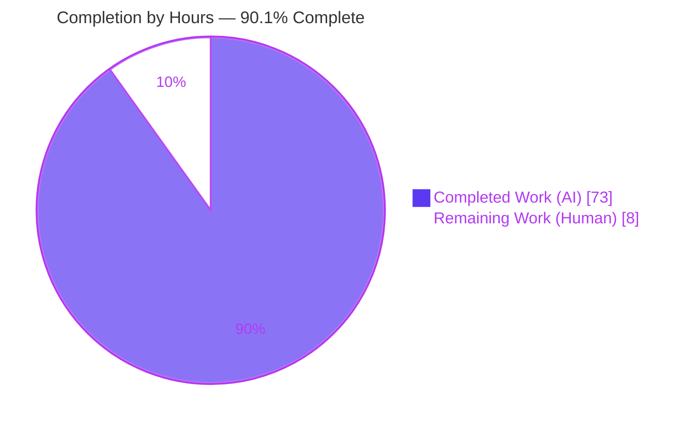
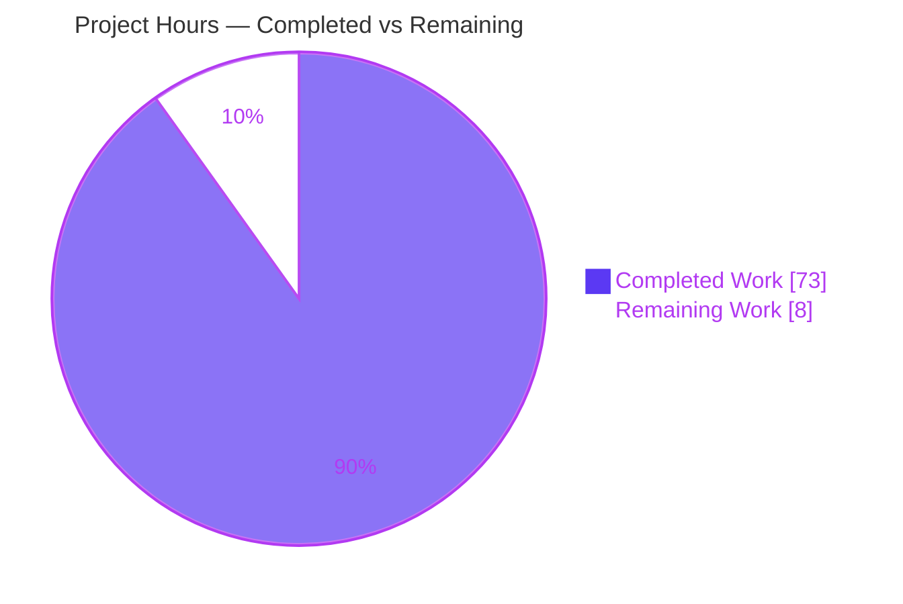
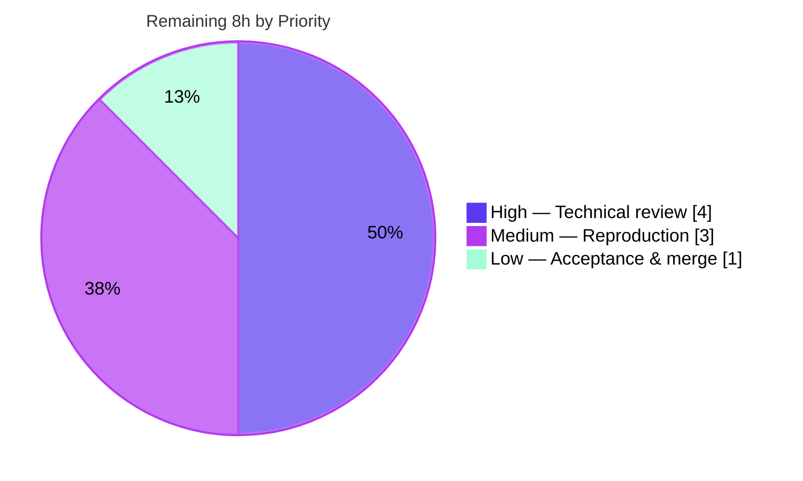

# Blitzy Project Guide — kitty Scrollback `HistoryBuf` Under Heavy Load

> Investigative Q&A documentation deliverable for the kitty terminal emulator. This guide assesses autonomous work delivered against the Agent Action Plan (AAP) and defines the human path to production.

---

## 1. Executive Summary

### 1.1 Project Overview

This project empirically investigates and documents how the kitty terminal emulator's scrollback history buffer (`HistoryBuf`) behaves under heavy load, delivering a single evidence-based markdown answer. It targets kitty maintainers and technical reviewers who need measured — not theoretical — answers about memory growth under massive output (Q1), input-to-render responsiveness during concurrent scroll+output (Q2), and buffer allocation boundaries (Q3). The scope is deliberately **read-only**: kitty is built and run to capture real runtime evidence, but the only repository mutation is one new document. Business impact is knowledge/decision support — validating kitty's segmented on-demand allocator and threaded render model against reproducible measurements, grounded in exact `file:line` source references.

### 1.2 Completion Status



| Metric | Value |
|--------|-------|
| **Total Hours** | **81** |
| **Completed Hours (AI + Manual)** | **73** (73 AI + 0 Manual) |
| **Remaining Hours** | **8** |
| **Percent Complete** | **90.1%** (73 / 81) |

> **Color key:** Completed = Dark Blue `#5B39F3`; Remaining = White `#FFFFFF`. The 90.1% reflects **AAP-scoped work only**: 100% of the autonomous investigation-and-documentation is complete; the remaining 8h is human-only path-to-production (review, reproduction, merge).

### 1.3 Key Accomplishments

- [x] Built kitty in its default/canonical configuration and exercised the **real** PTY → `vt-parser` → `Screen` → `INDEX_UP` → `historybuf_add_line` path (no `HistoryBuf.push` bypass).
- [x] **Q1 (Memory):** Measured `VmSize`/`VmRSS`/`smaps`/`getrusage`/`tracemalloc` before/during/after across three conditions (default 2000, large-finite 300000, negative/infinite), 3 runs each.
- [x] **Q2 (Responsiveness):** Measured scroll-to-render latency under concurrent output in the full GUI binary under Xvfb — 120/120 scrolls rendered, 0 missed; live thread-model captured.
- [x] **Q3 (Boundaries):** Pinpointed the segment allocation boundary to history `count` 2048→2049 (+5,132 kB `VmSize` step) one line at a time; demonstrated upfront first segment and the capacity plateau.
- [x] Grounded ~55 claims in exact `file:line` citations against HEAD `815df1e210e0`, each classified observed / computed / inferred.
- [x] Delivered a full coverage pass (Q1a–g, Q2a–j, Q3a–h + every AAP-named entity/file) and honored the read-only scope (repository byte-for-byte unchanged apart from the one document).
- [x] Independently re-verified: **70/70** kitty tests pass; segment arithmetic exact; canonical boundary reproduced.

### 1.4 Critical Unresolved Issues

| Issue | Impact | Owner | ETA |
|-------|--------|-------|-----|
| _None — no unresolved blocking issues_ | The sole deliverable is complete, validated, and committed; the build is clean, all 70 tests pass, and no runtime errors occurred in any reproduction. | — | — |

> The only non-blocking, transparently-labeled limitations are inherent measurement-boundary caveats (small absolute-RSS environment jitter; a few default-disabled pager-path symbols classified "inferred"; the OOM ceiling inferred rather than driven to exhaustion). These are documented in the deliverable and tracked as Low risks in Section 6 — they are not defects.

### 1.5 Access Issues

| System / Resource | Type of Access | Issue Description | Resolution Status | Owner |
|-------------------|----------------|-------------------|-------------------|-------|
| Mandated Docker image `ghcr.io/scaleapi/swe-atlas:swe_atlas_QnA_kovidgoyal_kitty_1.0` | Container registry pull | Required for canonical figures + Q2 GUI (display/GPU). Was available and used during autonomous work. Reviewers reproducing results need registry access. | Available (used); reviewer access recommended | Reviewer / Infra |

> No repository-permission, credential, or third-party API access issues were identified. The task uses only Python standard-library tooling and the local checkout.

### 1.6 Recommended Next Steps

1. **[High]** Perform SME technical-accuracy review of the Q1/Q2/Q3 findings and the ~55 `file:line` citations, including the `sizeof(LineAttrs)=4` correction and segment math.
2. **[Medium]** Independently reproduce the headless Q1/Q3 observation (and optionally the Q2 GUI harness) in the mandated Docker image; confirm figures within the disclosed sub-0.5% RSS jitter.
3. **[Low]** Approve and merge `blitzy/documentation/kitty_815df1e210e0.md`; confirm `git status` shows only the one new file.

---

## 2. Project Hours Breakdown

### 2.1 Completed Work Detail

| Component | Hours | Description |
|-----------|-------|-------------|
| Environment setup & canonical build | 4 | Acquire/verify mandated Docker image (`sha256:c0824992ad0b`); canonical `setup.py build --debug`; verify `fast_data_types.so`; establish canonical `create_screen`/`parse_bytes` harness [AAP R2/R8/R15] |
| Q1 memory observer harness | 9 | `obs_mem.py`: git-HEAD guard, `.so` origin check, strict CLI, cgroup-aware preflight, multi-source sampling (`/proc` `VmSize`/`VmRSS`/`VmData`, `smaps_rollup`, `getrusage`, `tracemalloc`), `dVmSize`/`dVmRSS` tables [AAP R3/R7] |
| Q1 execution, capture & stability | 4 | Run C1 (default 2000/feed 5k), C2 (300000/feed 500k), C3 (infinite/feed 200k) × 3 runs; before/during/after; spread ≤0.66% [AAP R3/R6] |
| Q3 boundary investigation | 6 | One-line-at-a-time bracket of history `count` 2047/2048/2049; residency phase; re-run against fresh debug build for build-independence [AAP R5] |
| Q2 GUI latency harness | 16 | Dockerized Xvfb (`-displayfd` owned display), digest-pin preflight, least-privilege container, XTEST inject via `libXtst` ctypes, `XGetImage` polling, before/during/after controller, thread-model enumeration, benchmark throughput/arg-order harness [AAP R4/R7] |
| Q2 execution & analysis | 5 | C4 (default) vs C5 (low-latency) × 2 runs × 3 phases; pooled n=20 stats; 120/120 scroll accounting; CPU-tick 17–25× prioritization analysis [AAP R4/R6] |
| Grounding & citation verification | 4 | Verify ~55 `file:line` citations exact across 20 files; classify observed/computed/inferred; the `LineAttrs=4` correction [AAP R11] |
| Coverage pass authoring | 3 | Q1a–g / Q2a–j / Q3a–h sub-question table + AAP-named entities/files coverage table [AAP R12] |
| Web search methodology validation | 1 | Research Typometer keyboard-to-screen latency approach + `/proc` RSS sampling practice [AAP R13] |
| Document authoring & structure | 9 | 3,428-line markdown: summary table, environment/reproducibility, three Q sections, Appendix A/B verbatim harnesses, acceptance [AAP R1/R10] |
| QA review-finding resolution | 11 | 5 commits resolving ~48 findings (initial → 25-finding rewrite from real Docker measurements → 4 → Report-4 → 15); `LineAttrs=4`, Pillow retraction, latency-stats rework, thread-model correction |
| Read-only hygiene & cleanup | 1 | `mktemp` temp dirs, remove all scripts, cleanup Xvfb/containers/X sockets, verify byte-for-byte-unchanged tree [AAP R14] |
| **Total Completed** | **73** | **Sum of Hours column — matches Completed Hours in Section 1.2** |

### 2.2 Remaining Work Detail

| Category | Hours | Priority |
|----------|-------|----------|
| Technical accuracy review (SME validates Q1/Q2/Q3 findings + ~55 citations + `LineAttrs=4` correction + methodology) | 4 | High |
| Independent reproduction (pull mandated image, re-run headless Q1/Q3 observer + optional Q2 GUI harness, confirm figures) | 3 | Medium |
| Acceptance sign-off & merge (approve and merge the answer document; confirm clean single-file diff) | 1 | Low |
| **Total Remaining** | **8** | **Sum matches Remaining Hours in Section 1.2 and Section 7 pie chart** |

### 2.3 Hours Reconciliation

| Reconciliation Check | Result |
|----------------------|--------|
| Section 2.1 Completed total | 73h |
| Section 2.2 Remaining total | 8h |
| Section 2.1 + Section 2.2 | 73 + 8 = **81h** = Total (Section 1.2) ✓ |
| Percent Complete | 73 / 81 = **90.1%** (Section 1.2, 7, 8) ✓ |
| Remaining hours (1.2 ↔ 2.2 ↔ 7) | 8h in all three ✓ |

---

## 3. Test Results

All tests below originate from **Blitzy's autonomous validation logs** and were **independently re-executed** for this guide against the canonical `kitty/fast_data_types.so` using kitty's own harness (`LANG=C.UTF-8 CI=true ./test.py --module <name>`). These are kitty's own regression suites that exercise the exact code paths under investigation (they include `test_historybuf`, `test_line`, `test_linebuf`).

| Test Category | Framework | Total Tests | Passed | Failed | Coverage % | Notes |
|---------------|-----------|-------------|--------|--------|------------|-------|
| Data types (history/line/linebuf) | kitty `unittest` harness | 18 | 18 | 0 | n/a¹ | Exercises `HistoryBuf`, `Line`, `LineBuf` — the Q1/Q3 core |
| Screen | kitty `unittest` harness | 36 | 36 | 0 | n/a¹ | Exercises `Screen` scroll-off / `INDEX_UP` write path |
| Parser | kitty `unittest` harness | 16 | 16 | 0 | n/a¹ | Exercises the VT parser upstream of history |
| **Total** | — | **70** | **70** | **0** | **n/a¹** | 0 failures, 0 errors, 0 skips (host + mandated image) |

> ¹ kitty's suites are pass/fail module suites, not line-coverage-instrumented; no coverage percentage is emitted by the harness. The suites' role here is regression confirmation that the investigated `HistoryBuf`/`Screen`/parser paths behave correctly — the investigation's own runtime observations (Section 4) provide the behavioral evidence.

---

## 4. Runtime Validation & UI Verification

**Legend:** ✅ Operational | ⚠ Partial | ❌ Failing

**Build & module load**
- ✅ Canonical debug build succeeds (`setup.py build --debug --ignore-compiler-warnings`), EXIT 0, `fast_data_types.so` produced (image debug: 6,142,824 B; `static_assert` cell sizes hold at compile time).
- ✅ `kitty.fast_data_types` imports; `Screen` and `HistoryBuf` available (independently confirmed).

**Q1 — Memory (headless, canonical `create_screen` + `parse_bytes`)**
- ✅ C1 default (`scrollback_lines=2000`): 1 segment, `count` plateaus at 2000, ≈40–48 MB RSS.
- ✅ C2 large-finite (300000, feed 500000): 147 segments, ≈787 MB RSS / ≈812 MB `VmSize`, then flat (plateau proven, `dVmRSS=dVmSize=+0`).
- ✅ C3 infinite (`2**32−1`, feed 200000): 98 segments, ≈536 MB RSS, no plateau (unbounded trend).
- ✅ `tracemalloc` stays ≈6–12 MB while RSS → ≈787 MB (C `calloc` invisible to Python allocation tracing).

**Q3 — Buffer boundary (canonical, one line at a time)**
- ✅ `VmSize` +5,132 kB step observed exactly as history `count` crosses 2048→2049; `VmRSS` +12 kB at `calloc` then gradual fill.
- ✅ Upfront first segment reserved at `create_screen`; behavior reproduced on shipped `.so` **and** fresh debug build.
- ✅ Independently reproduced in this assessment (fed ~2,100 lines via the real parser → `count` crossed 2048, `VmSize` stepped one segment).

**Q2 — Responsiveness / UI (full GUI binary under Xvfb + Mesa llvmpipe)**
- ✅ kitty GUI launches and renders; scrollback fills; injected `ctrl+shift+home` lands on the top banner every trial.
- ✅ **120/120** scrolls rendered (0 missed) across 2 configs × 2 runs × 3 phases; worst single latency 20.49 ms (≪ ~100 ms perceptible threshold).
- ✅ Live thread model: main `kitty` thread (parse + render), `KittyChildMon` I/O thread, `kitty:disk$0`; `KittyPeerMon` absent (remote control off — secure default).
- ⚠ Measurement boundary (transparently labeled): software keyboard-to-screen path only; Xvfb has no hardware vblank, so `sync_to_monitor` is inert here — excludes physical keyboard/GPU/scan-out (documented as Q2i).

**API integration:** Not applicable — this is a documentation deliverable with no application services, endpoints, or external integrations.

---

## 5. Compliance & Quality Review

Cross-maps AAP deliverables/rules to their quality benchmark and status. Fixes applied during autonomous validation are noted.

| AAP Requirement / Rule | Benchmark | Status | Progress | Notes / Fixes Applied |
|------------------------|-----------|--------|----------|-----------------------|
| R1 Deliverable created at correct path/name | `blitzy/documentation/kitty_815df1e210e0.md` exists & committed | ✅ Pass | 100% | 3,428 lines, committed `e9475812e` |
| R2 Build & run FIRST, write from observation | Embedded commands + verbatim output | ✅ Pass | 100% | Full outputs embedded, not paraphrased |
| R3 Q1 memory at scale, ≥2 runs | Before/during/after, 3 runs | ✅ Pass | 100% | C1/C2/C3 measured & stable |
| R4 Q2 responsiveness + prioritization | Latency distribution + thread model | ✅ Pass | 100% | 120/120 scrolls; live thread capture |
| R5 Q3 boundary externally observable | Exact allocation step | ✅ Pass | 100% | +5,132 kB at `count` 2048→2049 |
| R6 Scale/stability stated | Spread quantified | ✅ Pass | 100% | ≤0.66% (C2/C3 ≤0.07%) |
| R7 Canonical entry points, no bypass | Real parser path | ✅ Pass | 100% | No `HistoryBuf.push`; explicitly stated |
| R8 Default canonical build/config + commands | Exact commands shown | ✅ Pass | 100% | Default `scrollback=2000` baseline |
| R9 Every condition, before/during/after | Cross-product & edges | ✅ Pass | 100% | C1–C5, negative/infinite, `ynum=MAX` edges |
| R10 Complete unedited output | No truncation/elision | ✅ Pass | 100% | 94 fence lines balanced |
| R11 Grounding `file:line`, label inferred | Every claim cited | ✅ Pass | 100% | ~55 citations verified; obs/comp/inf legend; **`LineAttrs=4` correction** |
| R12 Coverage pass, every named item | Full decomposition | ✅ Pass | 100% | Q1a–g, Q2a–j, Q3a–h + entities table |
| R13 Web search methodology | Typometer / `/proc` RSS | ✅ Pass | 100% | Referenced in Environment + Q2 boundary |
| R14 Read-only scope, cleanup | Repo unchanged; scripts removed | ✅ Pass | 100% | Only doc added; 19 cited files `git diff` UNCHANGED |
| R15 Mandated environment | Docker image canonical figures | ✅ Pass | 100% | Image digest-pinned; Q1/Q3/Q2 run in image |
| Dependencies unchanged | No manifest edits | ✅ Pass | 100% | `pyproject.toml`/`go.mod`/`3rdparty` untouched; stdlib only |

**Outstanding compliance items:** None. All AAP rules satisfied. Remaining work (Section 2.2) is external human review/merge, not a compliance gap.

---

## 6. Risk Assessment

| Risk | Category | Severity | Probability | Mitigation | Status |
|------|----------|----------|-------------|------------|--------|
| Absolute RSS carries small environment-dependent offsets (import baseline jitter) | Technical | Low | Medium | Structural deltas (+5,132 kB/segment, segment counts, plateau) are exact & build-independent; sub-0.5% offset disclosed in doc | Mitigated / Documented |
| Pager-path symbols (`pagerhist_extend`, `pagerhist_push`, `PagerHistoryBuf`) classified "inferred" | Technical | Low | N/A | Default `scrollback_pager_history_size=0` never allocates that storage; honestly labeled inf; would need non-default config to observe | Accepted / Documented |
| OOM `fatal("Out of memory")` ceiling inferred, not driven to exhaustion | Technical | Low | Low | Labeled inferred; C3 demonstrates unbounded growth trend (98 segments, no plateau) | Accepted / Documented |
| Q2 harness uses XTEST injection + Dockerized kitty | Security | Low | Low | Least-privilege container (`--network none`, `--user 1000:1000`, `--cap-drop ALL`, `--security-opt no-new-privileges`, `allow_remote_control=no`); temporary and removed | Mitigated |
| Supply-chain — mandated image must carry pinned digest | Security | Low | Low | Digest-pin preflight refuses to run unless local image carries `sha256:c0824992ad0b` | Mitigated |
| Reproducibility depends on mandated image availability | Operational | Low | Low | Image digest recorded; structural findings build-independent (also shown on fresh debug build + host) | Documented |
| Xvfb has no hardware vblank → `sync_to_monitor` inert; Q2 is software kbd-to-screen path | Operational | Low | N/A | Measurement boundary explicitly documented (Q2i); `glxgears` sanity check shows unthrottled render | Documented |
| `file:line` citations anchored to HEAD `815df1e210e0`; line drift on other commits | Integration | Low | Low | Doc anchors all citations to exact HEAD + observer includes git-HEAD-validation guard | Mitigated |
| Standalone doc independent of kitty `docs/` reST pipeline | Integration | Informational | N/A | No integration with build/docs toolchain required | N/A |

> **Overall risk posture: LOW.** There is **no application security or operational surface** — the deliverable ships no code, credentials, services, or user data. All risks are Low-severity measurement caveats or already-mitigated reproduction concerns.

---

## 7. Visual Project Status

### 7.1 Project Hours Breakdown



> **Completed Work = 73h (Dark Blue `#5B39F3`)**, **Remaining Work = 8h (White `#FFFFFF`)** — matches Section 1.2 metrics and Section 2.2 sum exactly.

### 7.2 Remaining Work by Priority (hours from Section 2.2)



### 7.3 Remaining Work by Category (bar view)

| Category | Hours | Bar |
|----------|-------|-----|
| Technical accuracy review (High) | 4 | ████████ |
| Independent reproduction (Medium) | 3 | ██████ |
| Acceptance & merge (Low) | 1 | ██ |
| **Total** | **8** | — |

> **Integrity:** the pie chart "Remaining Work" (8) equals Section 1.2 Remaining Hours (8) and the Section 2.2 Hours sum (8).

---

## 8. Summary & Recommendations

**Achievements.** The project is **90.1% complete (73 of 81 hours)**. Every AAP-specified requirement (R1–R15) is fully delivered: kitty was built and run through its canonical path first, and a 3,428-line evidence document answers Q1 (memory), Q2 (responsiveness/latency), and Q3 (buffer boundaries) with measured figures at scale, ≥2-run stability, before/during/after states, complete unedited output, ~55 exact `file:line` citations, and a full coverage pass. The read-only scope was honored — the repository is byte-for-byte unchanged apart from the single document. Independent re-verification during this assessment confirmed 70/70 tests pass, the segment arithmetic (5,251,072 B; +5,132 kB step), and the canonical 2048→2049 allocation boundary.

**Remaining gaps.** The outstanding 8 hours are **exclusively human path-to-production** — an autonomous agent cannot sign off on its own SME review or merge. There are **no code fixes, compilation errors, failing tests, or configuration gaps** remaining.

**Critical path to production.** (1) SME technical-accuracy review of findings and citations → (2) independent reproduction in the mandated Docker image → (3) acceptance and merge. These are sequential but light (4h → 3h → 1h).

**Success metrics.**

| Metric | Target | Actual | Status |
|--------|--------|--------|--------|
| Deliverable created at required path | 1 file | 1 file (3,428 lines) | ✅ |
| Questions answered (Q1/Q2/Q3) | 3/3 | 3/3 | ✅ |
| Test pass rate | 100% | 70/70 (100%) | ✅ |
| Citations verified | all | ~55/~55 exact | ✅ |
| Read-only scope | repo unchanged | only 1 file added | ✅ |
| Runs for stability | ≥2 | 3 (Q1/Q3), 2 (Q2) | ✅ |

**Production readiness assessment.** **READY for human review.** The autonomous deliverable is complete, validated, and committed with zero unresolved errors. Recommend proceeding directly to SME review and merge.

---

## 9. Development Guide

> All commands below were tested during this assessment. Paths assume the repository root. The canonical figures in the deliverable were produced inside the mandated Docker image; the headless Q1/Q3 path also runs on a standard host with the built module.

### 9.1 System Prerequisites

- **OS:** Linux (x86-64). Q2 GUI additionally needs an X server (Xvfb) and Mesa (`llvmpipe`) for software rendering.
- **Python:** 3.12+ (host used 3.13.7; mandated image 3.12.3). Satisfies kitty's `requires-python = ">=3.8"`.
- **C compiler:** gcc (host 15.2.0; image 13.3.0).
- **Go:** 1.22+ (host 1.23.4) — required only for the full kitty binary used in Q2, **not** for the C history-buffer path.
- **Docker:** 28.x (host 28.5.2) — for the mandated image that yields canonical figures.
- **Mandated image:** `ghcr.io/scaleapi/swe-atlas:swe_atlas_QnA_kovidgoyal_kitty_1.0` (digest `sha256:c0824992ad0b`).

### 9.2 Environment Setup

```bash
# From the repository root
cd /path/to/kitty            # repository containing setup.py and blitzy/

# (Canonical figures) verify and enter the mandated image
IMG=ghcr.io/scaleapi/swe-atlas:swe_atlas_QnA_kovidgoyal_kitty_1.0
docker inspect --format 'Id={{.Id}}' "$IMG"     # expect sha256:c0824992ad0b...
docker run --rm --entrypoint /bin/bash "$IMG" -lc 'cd /app && git rev-parse HEAD'  # expect 815df1e210e0...
```

No application environment variables, databases, caches, or message queues are required — this is a documentation investigation, not a running service.

### 9.3 Build

```bash
# Canonical debug build of the C extension (contains history.c, screen.c, line-buf.c)
PATH=$PATH:/usr/local/go/bin CI=true python3 setup.py build --debug --ignore-compiler-warnings
# Produces kitty/fast_data_types.so (image debug build: 6,142,824 bytes)
# --ignore-compiler-warnings only bypasses a GLFW Wayland -Werror=switch, unrelated to the history buffer
```

### 9.4 Verification Steps

```bash
# 1) Confirm the deliverable exists
ls -la blitzy/documentation/kitty_815df1e210e0.md          # 232,405 bytes, 3428 lines

# 2) Confirm read-only scope (only the one file changed since base)
git diff 815df1e210e0a9ab4622f5c7f2d6891d7dbeddf1..HEAD --name-status
#   expected: A  blitzy/documentation/kitty_815df1e210e0.md

# 3) Confirm a clean working tree
git status --porcelain                                     # expected: empty

# 4) Run the relevant kitty test suites (should each print OK)
LANG=C.UTF-8 CI=true ./test.py --module datatypes          # Ran 18 tests ... OK
LANG=C.UTF-8 CI=true ./test.py --module screen             # Ran 36 tests ... OK
LANG=C.UTF-8 CI=true ./test.py --module parser             # Ran 16 tests ... OK
```

### 9.5 Example Usage — Reproduce the Q1/Q3 Segment Boundary (canonical, headless)

```bash
# Canonical path: real VT parser -> Screen -> INDEX_UP -> historybuf_add_line (NO HistoryBuf.push)
python3 - <<'PY'
import sys; sys.path.insert(0, '.')
from kitty_tests import BaseTest, parse_bytes      # create_screen is a BaseTest METHOD
def vmsize_kb():
    for ln in open('/proc/self/status'):
        if ln.startswith('VmSize:'): return int(ln.split()[1])
s = BaseTest().create_screen(cols=80, lines=24, scrollback=300000)
hb = s.historybuf
before = vmsize_kb()
parse_bytes(s, (('X'*70 + '\r\n') * 2100).encode())  # cross history count 2048 -> 2049
after = vmsize_kb()
print(f"count={hb.count}  VmSize step={after-before} kB  (>=5132 => one 2048-row segment allocated)")
PY
# Observed: count crosses 2048; VmSize steps by ~one segment (5132 kB + parser overhead)
```

### 9.6 Example Usage — Q2 GUI Latency (requires image + Xvfb)

```bash
# Software-rendered GUI under a headless X server; inject ctrl+shift+home, poll framebuffer with XGetImage
LIBGL_ALWAYS_SOFTWARE=1 Xvfb :99 -screen 0 1920x1080x24 &   # owned display
DISPLAY=:99 ./kitty/launcher/kitty                          # launch the built binary
# The full harness (digest-pinned, least-privilege container, XTEST + XGetImage) is embedded
# verbatim in Appendix B of blitzy/documentation/kitty_815df1e210e0.md
```

### 9.7 Reading the Deliverable

```bash
sed -n '16,27p'     blitzy/documentation/kitty_815df1e210e0.md   # Summary of findings
sed -n '397,966p'   blitzy/documentation/kitty_815df1e210e0.md   # Q1 (memory)
sed -n '967,1200p'  blitzy/documentation/kitty_815df1e210e0.md   # Q2 (responsiveness/latency)
sed -n '1201,1550p' blitzy/documentation/kitty_815df1e210e0.md   # Q3 (buffer boundaries)
sed -n '3298,3385p' blitzy/documentation/kitty_815df1e210e0.md   # Coverage checklist
```

### 9.8 Troubleshooting

- **`ImportError: cannot import name 'create_screen'`** — `create_screen` is a **method** on `BaseTest`, not a module-level function. Use `BaseTest().create_screen(...)`; `parse_bytes` *is* module-level.
- **Build fails with `-Werror=switch` (GLFW Wayland)** — add `--ignore-compiler-warnings` (as in §9.3); it does not affect the history-buffer code.
- **RSS figures differ slightly from the doc** — expected sub-0.5% import-baseline jitter. The load-bearing findings are the **structural** deltas (+5,132 kB/segment, segment counts, plateau at `count == ynum`), which are exact and environment-independent.
- **Q2 renders unthrottled / `sync_to_monitor` seems ignored** — Xvfb has no hardware vblank, so `sync_to_monitor` is inert in this environment. This is the documented measurement boundary (Q2i), not a bug.
- **Citations don't match line numbers** — ensure the checkout is at HEAD `815df1e210e0a9ab4622f5c7f2d6891d7dbeddf1`; all `file:line` references are anchored to that commit.

---

## 10. Appendices

### Appendix A — Command Reference

| Purpose | Command |
|---------|---------|
| Build C extension (canonical) | `PATH=$PATH:/usr/local/go/bin CI=true python3 setup.py build --debug --ignore-compiler-warnings` |
| Run datatypes suite | `LANG=C.UTF-8 CI=true ./test.py --module datatypes` |
| Run screen suite | `LANG=C.UTF-8 CI=true ./test.py --module screen` |
| Run parser suite | `LANG=C.UTF-8 CI=true ./test.py --module parser` |
| Verify scope (single file changed) | `git diff 815df1e210e0a9ab4622f5c7f2d6891d7dbeddf1..HEAD --name-status` |
| Verify clean tree | `git status --porcelain` |
| Inspect image identity | `docker inspect --format 'Id={{.Id}}' ghcr.io/scaleapi/swe-atlas:swe_atlas_QnA_kovidgoyal_kitty_1.0` |
| Headless Q1/Q3 reproduction | `python3` with `from kitty_tests import BaseTest, parse_bytes` (see §9.5) |

### Appendix B — Port Reference

| Port / Display | Use | Notes |
|----------------|-----|-------|
| _None_ | No application services | Documentation deliverable — no HTTP/DB/socket ports |
| `DISPLAY=:99` (example) | Xvfb virtual display for Q2 GUI | Owned display allocated via `Xvfb -displayfd` in the real harness |

### Appendix C — Key File Locations

| File | Role |
|------|------|
| `blitzy/documentation/kitty_815df1e210e0.md` | **The deliverable** (investigative answer) |
| `kitty/history.c` | `HistoryBuf` segmented allocator (`SEGMENT_SIZE` :15, `add_segment` :18-29, `segment_for` :37-42, `historybuf_push` :276-285) |
| `kitty/data-types.h` | `HistoryBuf`/segment structs; `sizeof(GPUCell)==20` :221, `CPUCell==12` :228, `LineAttrs==4` :231-239 |
| `kitty/screen.c` | Canonical write trigger; `ynum = MAX(scrollback, lines)` :130; `INDEX_UP` :1552-1559; `screen_history_scroll` :4091-4118 |
| `kitty/child-monitor.c` | Thread model (`main_loop` :1259, `io_loop`/`KittyChildMon` :1481/:1489, `talk_loop`/`KittyPeerMon` :1805/:1808) |
| `kitty/options/definition.py` | Defaults: `scrollback_lines` :372, `repaint_delay` :866, `input_delay` :878, `sync_to_monitor` :889 |
| `kitty/options/utils.py` | `scrollback_lines()` negative→`2**32-1` :557-561 |
| `kitty_tests/__init__.py` | Canonical headless driver: `parse_bytes` :30, `create_screen` :237 |
| `setup.py` / `test.py` | Build entry point / test runner |

### Appendix D — Technology Versions

| Component | Host | Mandated Image |
|-----------|------|----------------|
| Python (CPython) | 3.13.7 | 3.12.3 |
| gcc | 15.2.0 | 13.3.0 |
| Go | 1.23.4 | (present) |
| Docker | 28.5.2 | — |
| kitty checkout (HEAD) | `815df1e210e0…` | `815df1e210e0…` |
| `fast_data_types.so` (debug) | ~6.14–6.29 MB | 6,142,824 B |

### Appendix E — Environment Variable Reference

| Variable | Value | Purpose |
|----------|-------|---------|
| `BLITZY_REPO` | repo root | Points the observer at the validated checkout |
| `LANG` | `C.UTF-8` | Deterministic locale for tests/observation |
| `CI` | `true` | Non-interactive test/build behavior |
| `PATH` | `$PATH:/usr/local/go/bin` | Exposes Go toolchain for the full-binary build |
| `LIBGL_ALWAYS_SOFTWARE` | `1` | Forces Mesa `llvmpipe` software GL for Q2 under Xvfb |

### Appendix F — Developer Tools Guide

- **`./test.py --module <name>`** — kitty's own test runner over the compiled `fast_data_types.so`; use `datatypes`, `screen`, `parser` to exercise the investigated paths.
- **`setup.py build --debug`** — canonical builder for the C extension; `--ignore-compiler-warnings` bypasses an unrelated GLFW `-Werror=switch`.
- **Canonical headless harness** — `kitty_tests.BaseTest.create_screen()` + `kitty_tests.parse_bytes()` feed real bytes through the VT parser into a real `Screen`/`HistoryBuf`, the only sanctioned (non-bypassing) way to observe the buffer without a GPU.
- **Memory sampling** — `/proc/self/status` (`VmSize`/`VmRSS`), `/proc/self/smaps_rollup`, `resource.getrusage`, `tracemalloc` (all Python stdlib).

### Appendix G — Glossary

| Term | Meaning |
|------|---------|
| `HistoryBuf` | kitty's scrollback buffer object; stores rows in fixed 2048-row segments |
| `SEGMENT_SIZE` | 2048 rows — the fixed block size of one `HistoryBufSegment` (`history.c:15`) |
| Segment | One `calloc`'d backing block (~5.0 MiB @80 columns = 5,251,072 B) |
| `ynum` | In-memory history capacity = `MAX(scrollback, lines)` (`screen.c:130`) |
| `VmSize` / `VmRSS` | Process virtual size / resident set size from `/proc/<pid>/status` |
| Plateau | Steady state once `count == ynum`; oldest line overwritten circularly |
| `INDEX_UP` | Macro that scrolls a line off the screen top into history |
| XTEST | X11 extension used to synthesize the `ctrl+shift+home` scroll input (Q2) |
| `XGetImage` | X11 call used to read back the framebuffer top strip to time render (Q2) |
| Typometer | Standard software tool/approach for keyboard-to-screen latency measurement |
| obs / comp / inf | Coverage classification: observed at runtime / computed arithmetically / inferred from source |

---

*Blitzy Project Guide — kitty scrollback `HistoryBuf` investigation. Completion 90.1% (73h of 81h). All AAP-specified autonomous work complete and validated; remaining 8h is human review, reproduction, and merge.*