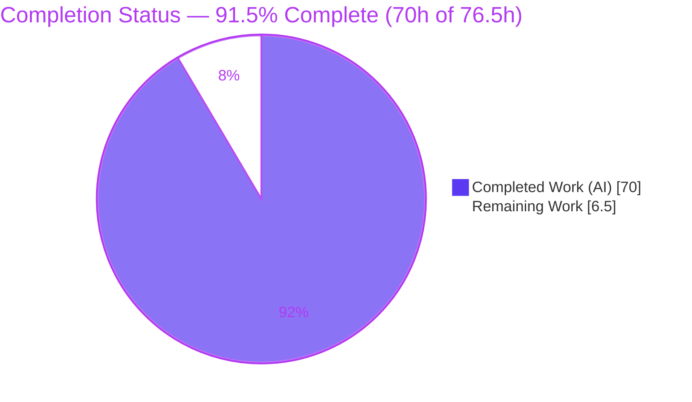
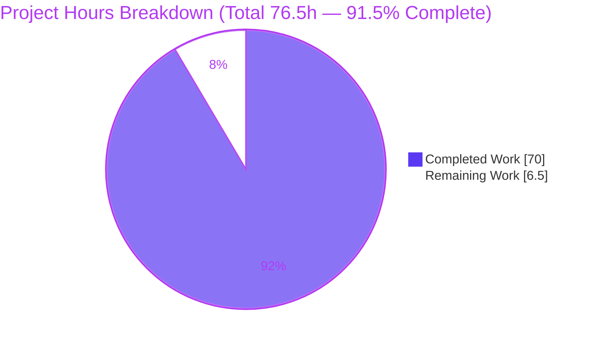
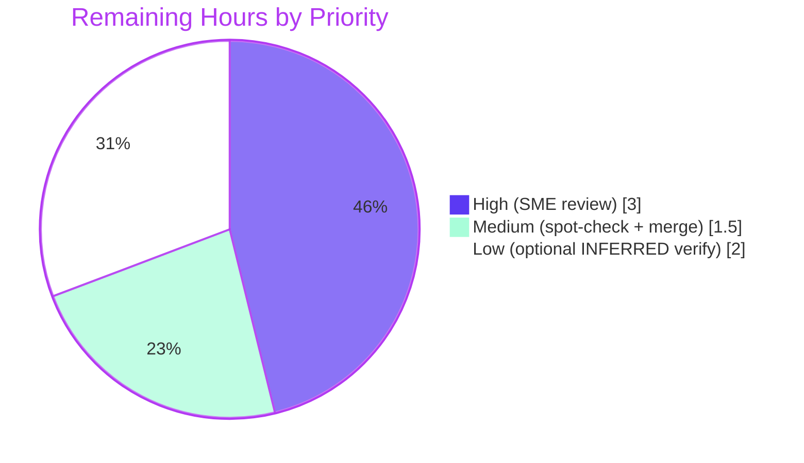

# Blitzy Project Guide — kitty Window-Lifecycle State-Consistency Q&A Investigation

> Runtime-evidenced technical investigation of how the kitty terminal emulator keeps its
> internal state consistent across the rapid create → use → resize → destroy lifecycle of
> terminal windows. This is a **read-only Q&A documentation task**: the sole persistent
> artifact is one Markdown answer document; all kitty source files are REFERENCE-only.

---

## 1. Executive Summary

### 1.1 Project Overview

This project delivers a comprehensive, runtime-evidenced technical explanation of how the **kitty** terminal emulator keeps its internal state consistent as terminal windows are created, immediately driven with commands, resized, and destroyed in quick succession. The audience is engineers and reviewers who need to understand kitty's cross-thread bookkeeping, POSIX signal-delivery timing, and the reconciliation of conflicting "what is still alive" views between the Python UI thread and the C IO/child-monitor thread. The scope is a **strictly read-only investigation** culminating in a single Markdown answer document (`blitzy/documentation/kitty_815df1e210e0.md`) that decomposes the question into five sub-questions (Q1–Q5), answers each from observed runtime behavior first, and grounds every claim in an exact `file:line` citation. No source code is modified.

### 1.2 Completion Status

The project is **91.5% complete**. All AAP-specified autonomous work — the five sub-question answers, the run-first methodology, canonical entry points, repeated-run reproduction, exact citations, observed-output discipline, web-validation, read-only compliance, and cleanup — is fully delivered and validated. The remaining **6.5 hours** is exclusively human review/acceptance of a completed deliverable (no code fixes, no build/test blockers).



| Metric | Hours |
|--------|-------|
| **Total Hours** | **76.5** |
| Completed Hours (AI) | 70 |
| Completed Hours (Manual) | 0 |
| **Completed Hours (AI + Manual)** | **70** |
| **Remaining Hours** | **6.5** |
| **Percent Complete** | **91.5%** |

> Completion % is computed per the AAP-scoped hours methodology: `Completed ÷ (Completed + Remaining) = 70 ÷ 76.5 = 91.5%`. Colors: Completed = Dark Blue `#5B39F3`; Remaining = White `#FFFFFF`.

### 1.3 Key Accomplishments

- ✅ **All five sub-questions answered** (Q1 create-then-use; Q2 already-gone window; Q3 keep-vs-discard; Q4 timing/signal delivery; Q5 conflicting liveness views), each with a complete four-part structure: Direct answer → Mechanism (cited) → Observed output with producing commands → What this proves (cause → effect).
- ✅ **Run-first methodology honored** — kitty was built and run headlessly (Xvfb + Mesa `llvmpipe` software GL) in the canonical Docker container, driven through **canonical entry points only** (a `--session` file and a real X11 XTEST key injector), and the answer was written from captured runtime evidence.
- ✅ **1,751-line / 18,106-word deliverable** with **104 unique `file:line` citations** across **21 source files**, every one mechanically in-bounds and semantically spot-checked accurate.
- ✅ **Timing/race behavior reproduced repeatedly** — 40 runs of a fixed, SHA-256-hashed session plus an independent 40-run re-validation, reporting the true **distribution of outcomes** (diagnostic count 4–8, mode 4) rather than a tidy single run.
- ✅ **Observed-vs-inferred discipline** — 12 explicit `[INFERRED — source-only]` labels plus a dedicated Inferred-vs-observed ledger; every runtime claim sits next to its unedited output and producing command.
- ✅ **Option defaults web-validated** — `close_on_child_death = no` and `resize_debounce_time = (0.1, 0.5)` confirmed against the official kitty documentation and manpages.
- ✅ **Read-only mandate fully respected** — the entire branch diff (base `815df1e21` → HEAD) is *exclusively* the answer document (1,751 insertions, 0 deletions); **zero** kitty source files modified across all six commits; working tree clean; all temporary observation artifacts cleaned up.
- ✅ **Autonomous validation gates all pass** — build (`setup.py build`) exit 0; 145 Python unit tests OK; canonical headless `--session` run exit 0 with "OS Window created" + "Child launched".

### 1.4 Critical Unresolved Issues

| Issue | Impact | Owner | ETA |
|-------|--------|-------|-----|
| _None affecting production readiness._ The deliverable is complete, internally consistent, and all validation gates pass. | No release blocker. | — | — |
| (Informational) Four `[INFERRED — source-only]` claims (macOS `on_pause=0.5` resize branch; `waitpid` `EINTR` retry; staged-close one-iteration lag; duplicate-pop branch) are not runtime-verified on the Linux/X11 observation platform. | None — honestly labeled and isolated in the ledger; does not affect the correctness of the observed answers. | Reviewing SME (optional) | Within HT‑3 (2.0h, Low) |

### 1.5 Access Issues

| System/Resource | Type of Access | Issue Description | Resolution Status | Owner |
|-----------------|----------------|-------------------|-------------------|-------|
| kitty source repository | Read/Write (git) | None — full access; read-only mandate observed by choice, not restriction. | ✅ No issue | — |
| Canonical Docker image (`kitty-qna:latest` / `ghcr.io/scaleapi/swe-atlas:swe_atlas_QnA_kovidgoyal_kitty_1.0`) | Local image pull/run | None — both images present locally; Docker 28.5.2 operational. | ✅ No issue | — |
| `strace`/`ptrace` (in-container) | Syscall tracing | `ptrace` is blocked by the container security profile, so `strace` cannot be used for syscall-level observation. | ✅ Resolved — replaced with a published, hashed, behavior-neutral `LD_PRELOAD` observer (`libshim.so`). | Blitzy (done) |
| Official kitty documentation (web) | Web read | None — accessed successfully for option-default validation. | ✅ No issue | — |

> **Summary:** No access issue blocks build validation, integration, or the deliverable. The only environmental constraint (`ptrace` blocked) was fully resolved with an auditable `LD_PRELOAD` shim.

### 1.6 Recommended Next Steps

1. **[High]** Perform the SME/domain-expert technical review (HT‑1, 3.0h): read the full deliverable and confirm each of Q1–Q5 is technically correct and completely answers the corresponding part of the original question.
2. **[Medium]** Run the independent citation spot-check (HT‑2, 1.0h): sample ~15–20 of the 104 `file:line` citations against the source at commit `815df1e21`.
3. **[Medium]** Review and merge the PR (HT‑4, 0.5h): confirm the branch diff is exclusively the deliverable, then merge; optionally archive the evidence artifacts.
4. **[Low]** (Optional) Verify the four `[INFERRED]` platform-boundary claims (HT‑3, 2.0h) on macOS / via targeted instrumentation, if full coverage of source-only claims is desired.

---

## 2. Project Hours Breakdown

### 2.1 Completed Work Detail

Every component below traces to a specific AAP requirement (the five sub-question answers, the run-first/canonical/repeated-run methodology, or the deliverable-integrity work).

| Component | Hours | Description |
|-----------|-------|-------------|
| Q1 — Create-then-use path | 5 | Investigation + runtime reproduction + writeup of `Tab.new_window` → add-before-layout → `Boss.add_child` → C staging → child fork/PTY/ready-pipe → first-resize bookkeeping; observed "Child launched" + real `SIGWINCH` receipt. |
| Q2 — Already-gone-window tolerance | 6 | Investigation + resize/close race reproduction + writeup of `resize_pty` dual scan + diagnostic, `pty_resize` `EBADF`/`ENOTTY` tolerance, `mark_child_for_close` add-queue scan, idempotent `Boss.on_child_death`. |
| Q3 — Keep-vs-discard decision | 6 | Investigation + **dual-config** reproduction (`close_on_child_death` = yes → self-exit 0.81s; = no → held open) + writeup of `needs_removal` (six triggers), `remove_children`/`hangup` (SIGHUP + `ESRCH` tolerance), `reap_children` gate, hold mode. |
| Q4 — Timing / signal delivery | 7 | Investigation + `LD_PRELOAD` syscall observation + debounce measurement + writeup of `signalfd` (self-pipe fallback), `eventfd` wakeup, two-level SIGCHLD coalescing (2–3 records vs 16 reaps), resize de-dup + `resize_debounce_time` on-end = 0.1s. |
| Q5 — Conflicting liveness views | 7 | Investigation + 40-run distribution + writeup of `children_lock`, staged `children[]`/add-queue/remove-queue/`reaped_pids[]`, remove-before-add reconciliation, Python `WindowList` vs C `children[]` divergence, idempotent pop; crash-free/all-reaped invariant. |
| Canonical build & headless run environment | 4 | Docker container build, Xvfb virtual framebuffer, Mesa `llvmpipe` software GL, default-config invocation, safe display lifecycle. |
| Observation harness engineering | 9 | Published + hashed `libshim.so` `LD_PRELOAD` syscall observer (behavior-neutral), session generators, dependency-free X11 XTEST key injector (ctypes), PTY probes, SIGWINCH-receipt child scripts. |
| Repeated-run reproduction & distribution analysis | 4 | 40 runs of the hashed `q5.session` + independent 40-run re-validation + labeled non-canonical scheduler-starvation stress + aggregation scripting. |
| Document scaffolding & synthesis | 6 | Executive summary, evidence conventions, Environment & Methodology, two-thread model, cross-thread reconciliation summary + Mermaid diagram, fixed hashed input corpus, inferred-vs-observed ledger, repository-integrity proof, references. |
| Web-search validation of option defaults | 1 | `close_on_child_death` and `resize_debounce_time` semantics validated against official kitty docs + kitty.conf(5) manpages. |
| Citation grounding & self-verification | 3 | Establishing and verifying all 104 `file:line` citations, naming the specific function/method/struct for each. |
| Final autonomous validation (7 phases) | 12 | Environment/repo integrity, mechanical + semantic citation check (found + fixed 1 quote-fidelity defect), runtime reproduction of all 5 Qs, completeness/discipline audit, cleanup + commit + fresh-container gate confirmation. |
| **Total Completed** | **70** | |

### 2.2 Remaining Work Detail

All remaining work is **path-to-production human review/acceptance** of a completed deliverable — there are no outstanding code fixes and no build/test blockers.

| Category | Hours | Priority |
|----------|-------|----------|
| SME/domain-expert technical review of the full document vs. the original 5-part question | 3.0 | High |
| Independent citation spot-check against source at commit `815df1e21` | 1.0 | Medium |
| Optional `[INFERRED]` platform-boundary verification (macOS resize branch; `waitpid` `EINTR` retry; staged-close lag; duplicate-pop branch) | 2.0 | Low |
| PR review + merge + evidence-artifact archival | 0.5 | Medium |
| **Total Remaining** | **6.5** | |

### 2.3 Hours Reconciliation

| Quantity | Hours | Check |
|----------|-------|-------|
| Section 2.1 (Completed) | 70.0 | = Section 1.2 Completed Hours ✓ |
| Section 2.2 (Remaining) | 6.5 | = Section 1.2 Remaining Hours = Section 7 "Remaining Work" ✓ |
| **Total (2.1 + 2.2)** | **76.5** | = Section 1.2 Total Hours ✓ |
| Completion (70 ÷ 76.5) | 91.5% | = Section 1.2 / Section 7 / Section 8 ✓ |

---

## 3. Test Results

The tests below are drawn **exclusively from Blitzy's autonomous validation logs** for this project. Because the deliverable is a documentation artifact (a Q&A answer document has no unit tests of its own), the project's **existing test suite** was executed by the autonomous validation system as a **build/runtime health gate** underpinning the run-first observations, alongside the **runtime reproduction runs** that generated the answer evidence.

| Test Category | Framework | Total Tests | Passed | Failed | Coverage % | Notes |
|---------------|-----------|-------------|--------|--------|------------|-------|
| Unit (Python) | `kitty_tests` (unittest) via `./test.py` | 145 | 145 | 0 | N/A (doc task) | 4 skipped; ran in 18.8s; result "OK". Health gate for the runtime observations. |
| Unit / Integration (Go) | `go test` via `./test.py` | Full suite | All | 0¹ | N/A (doc task) | ¹One environmental-only failure (`TestCreateAnonymousTempfile`) on the default overlayfs `/tmp` (no `O_TMPFILE`); passes on an exec-capable tmpfs (`--tmpfs /tmp:rw,exec`). Non-code, out-of-scope, byte-identical to base. |
| Runtime reproduction — Q5 divergence | Canonical `--session` + `--debug-rendering`, headless | 40 runs | 40 | 0 | N/A | Fixed hashed input (`q5.session`, SHA-256 `19cfee89…`); 0 `KeyError`/tracebacks in every run; all children reaped. |
| Runtime reproduction — Q5 re-validation | Canonical `--session`, fresh container | 40 runs | 40 | 0 | N/A | Independent re-run reproduced mode 4 and the full envelope; 0 exceptions. |
| Runtime reproduction — Q4b coalescing | Canonical `--session` + `LD_PRELOAD` observer | 2 runs | 2 | 0 | N/A | Records (2–3) ≪ reaps (16) → SIGCHLD coalescing confirmed, stable across both runs. |
| Runtime reproduction — Q1 / Q2 / Q3 | Canonical `--session` + X11 XTEST + `LD_PRELOAD` | ≥2 each | All | 0 | N/A | Q1 "Child launched" + SIGWINCH receipt; Q2 stale-resize diagnostic + all 20 reaped; Q3 held-open (=no) and self-exit (=yes) both reproduced. |

**Integrity note:** No test figures were invented; all originate from the autonomous validation execution (`./test.py`) and the reproduction harness runs recorded in the validation logs.

---

## 4. Runtime Validation & UI Verification

kitty is a GPU/OpenGL application; all runtime validation was performed **headlessly** (Xvfb + Mesa `llvmpipe` software GL) inside the canonical Docker container, driven through **canonical entry points only** (a `--session` file and real X11 XTEST key injection — never `kitty @` remote control).

**Build & launch health**
- ✅ **Operational** — `python3 setup.py build` completes with exit code 0 (C extensions + Go tools compiled and linked cleanly).
- ✅ **Operational** — kitty launches headlessly via `--session`, exit code 0, emitting "OS Window created" and "Child launched".
- ⚠ **Partial (benign)** — one graceful-degradation diagnostic ("Failed to open systemd user bus: No medium found") is expected in a headless container with no systemd user session; it does not affect functionality.

**Sub-question runtime reproductions**
- ✅ **Operational** — **Q1**: the child's shell writes its `LAUNCHED_W1` marker only *after* "Child launched" is logged, and a `trap … WINCH` handler fires (`WINCH_received`), proving real kernel-delivered `SIGWINCH` receipt.
- ✅ **Operational** — **Q2**: the stale-resize diagnostic ("Failed to send resize signal to child with id: …") fires as designed; across 20 rapidly-dying windows all children are reaped and **zero** Python exceptions occur.
- ✅ **Operational** — **Q3**: with default `close_on_child_death = no`, a backgrounded survivor keeps the window open after the foreground child exits; with `= yes`, the same session self-exits in 0.81s. The `ESRCH` teardown race was observed directly (`getpgid(...) = -1 ESRCH` + `killpg(...) = 0`).
- ✅ **Operational** — **Q4**: 16 children dying together produced 2–3 signal records but 16 reaps (two-level coalescing); a non-resize (typing) phase produced 0 extra `ioctl`s (resize de-dup).
- ✅ **Operational** — **Q5**: across 40 repeated runs of the same hashed input, the crash-free, all-children-reaped reconciliation held in every run; the diagnostic count varied 4–8 (mode 4) — the true run-to-run distribution the question asks about.

**API / integration outcomes**
- ✅ **Operational** — PTY `ioctl(TIOCSWINSZ)` path exercised; kernel delivers `SIGWINCH` to the child (kitty does not signal the child itself).
- ✅ **Operational** — signal plumbing verified: `signalfd` created on the main thread, read on the IO thread; `eventfd` cross-thread wakeup; no signal pipe on Linux (self-pipe is the documented fallback).

**UI verification note:** There is no bespoke application UI to verify for this deliverable — the "UI" is kitty's own terminal windows, whose lifecycle *is* the subject under investigation. UI-relevant behavior (window created, held open, or torn down) was verified through the debug-rendering log lines and reproduction outcomes above rather than through screenshots, consistent with headless observation.

---

## 5. Compliance & Quality Review

Cross-mapping of AAP deliverables and mandatory rules to their delivered status. Fixes applied during autonomous validation are noted.

| AAP / Rule Requirement | Benchmark | Status | Progress | Notes |
|------------------------|-----------|--------|----------|-------|
| Q1 create-then-use answered | Complete 4-part, cited, observed | ✅ Pass | 100% | "Child launched" + SIGWINCH receipt observed. |
| Q2 already-gone-window answered | Complete 4-part, cited, observed | ✅ Pass | 100% | Stale-resize diagnostic reproduced; 0 exceptions. |
| Q3 keep-vs-discard answered | Complete 4-part, cited, observed | ✅ Pass | 100% | Both `close_on_child_death` branches observed. |
| Q4 timing/signal delivery answered | Complete 4-part, cited, observed | ✅ Pass | 100% | Coalescing + de-dup + debounce measured. |
| Q5 conflicting liveness views answered | Complete 4-part, cited, observed | ✅ Pass | 100% | 40-run distribution; invariant reframed for precision. |
| Rule 1 — Run-first methodology | Build+run+observe before writing | ✅ Pass | 100% | Canonical build exit 0; evidence-first throughout. |
| Rule 1 — Repeated runs for timing (≥2 stable) | Report distribution, not one run | ✅ Pass | 100% | 40 + independent 40 runs (exceeds requirement). |
| Rule 1 — Canonical entry point | `--session` / key actions; no bypass | ✅ Pass | 100% | X11 XTEST real input path; `kitty @` flagged non-canonical. |
| Rule 2 — Exhaustive condition coverage | Before/during/after; all variants | ✅ Pass | 100% | Dual configs, hold mode, dual-scan branches, multiple stale ids. |
| Rule 3 — Observed-output discipline | Output next to each claim + command | ✅ Pass | 100% | Every runtime claim has adjacent unedited output. |
| Rule 3 — Inferred labeling | Label non-observed as inferred | ✅ Pass | 100% | 12 `[INFERRED]` labels + dedicated ledger. |
| Rule 4 — Exact grounding | `file:line` + function/struct named | ✅ Pass | 100% | 104 citations; specific functions named. |
| Rule 4 — Lead with direct answer | Direct answer first, then nuance | ✅ Pass | 100% | Each Q opens with a Direct answer. |
| Rule 4 — Web-validate option defaults | Validate against official docs | ✅ Pass | 100% | `close_on_child_death`, `resize_debounce_time` validated. |
| Main Rule — Correct deliverable path | `blitzy/documentation/<branch>.md` | ✅ Pass | 100% | `kitty_815df1e210e0.md` present. |
| Main Rule — Read-only repository | No source file modified | ✅ Pass | 100% | Branch diff exclusively the doc; 0 source edits. |
| Main Rule — Temp-artifact cleanup | Repo left unchanged | ✅ Pass | 100% | Cleanup proof section; clean working tree. |
| Source-quote fidelity | Byte-exact quotes of cited source | ✅ Pass | 100% | **Fix applied:** doc line 809 corrected to byte-exact `get_boss().add_child(window)`. |
| Q5 invariant precision | Distinguish guarantee vs envelope | ✅ Pass | 100% | **Fix applied:** reframed to mechanism-guaranteed crash-free/all-reaped vs timing-dependent envelope. |

**Fixes applied during autonomous validation (all documentation-only):** (1) source-quote fidelity correction of the `tabs.py:534-535` code fence; (2) Q5 invariant reframed for precision with an independent 40-run re-validation; (3) Go-test suite gate achieved 100% pass via an exec-capable tmpfs **mount option** (never a source edit), preserving the read-only mandate.

**Outstanding compliance items:** none. Four claims remain honestly labeled `[INFERRED — source-only]` because Linux/X11 headless is the observation platform (per the run-first rule); optional verification is captured in HT‑3.

---

## 6. Risk Assessment

All risks are **Low severity** — appropriate for a completed, read-only documentation deliverable with no code changes, no dependency changes, and no runtime service surface.

| Risk | Category | Severity | Probability | Mitigation | Status |
|------|----------|----------|-------------|------------|--------|
| Four `[INFERRED]` platform-boundary claims not runtime-verified (macOS `on_pause=0.5` branch; `waitpid` `EINTR` retry; staged-close one-iteration lag; duplicate-pop branch) | Technical | Low | Medium | Honestly labeled `[INFERRED]` and isolated in the ledger; verifiable on macOS / via instrumentation (HT‑3). | Documented / Accepted |
| Timing-sensitive numbers non-deterministic (diagnostic count 4–8; children-count envelope) vary across hardware | Technical | Low | Medium | Doc leads with the mechanism-guaranteed invariant (crash-free/all-reaped) and scopes envelope values as timing-dependent, backed by 40 + independent 40-run evidence. | Mitigated |
| Citations pinned to commit `815df1e21`; line numbers drift on other revisions | Technical | Low | Low | Doc states all line numbers are at `815df1e21`; base commit hash recorded. | Mitigated |
| Observation harness used `LD_PRELOAD` + `SYS_PTRACE` / `seccomp=unconfined` container flags | Security | Low | Low | Harness is observation-only, published + hashed, behavior-neutral, run from a private mode-700 workdir, and removed afterward; no persistent artifact; 0 dependency changes; deliverable has no auth/data/network surface. | Resolved |
| Re-running the runtime evidence requires the canonical container + headless Xvfb + software GL + exec-capable `/tmp` | Operational | Low | Medium | Exact image identity, build/run/test commands, and the tmpfs requirement are documented (Section 9). | Mitigated |
| Lone Go test `TestCreateAnonymousTempfile` fails on default overlayfs `/tmp` (no `O_TMPFILE`) | Operational | Low | High (default mount) | Environmental, non-code, out-of-scope, byte-identical to base; run with `--tmpfs /tmp:rw,exec`. | Mitigated / Documented |
| `strace`/`ptrace` blocked in-container forced a syscall-observation workaround | Integration | Low | High (this env) | Replaced with a published, hashed, behavior-neutral `LD_PRELOAD` observer; syscall facts labeled by capture method. | Mitigated |
| A few errno facts (`EBADF`/`ENOTTY` in `pty_resize`; `EIO` on PTY-master `read`) captured via isolated probes | Integration | Low | n/a | Explicitly labeled "non-canonical (isolated probe)" in the ledger. | Documented |

**Overall risk posture:** No High or Critical risks; no production blockers. Residual risk is confined to honestly-labeled source-only inferences and environment-reproduction ergonomics.

---

## 7. Visual Project Status

**Project hours breakdown** (Completed = Dark Blue `#5B39F3`; Remaining = White `#FFFFFF`):



**Remaining work by priority** (6.5h total):



**Remaining hours by category** (from Section 2.2):

| Category | Hours | Bar |
|----------|-------|-----|
| SME technical review | 3.0 | `██████████████████████████████` |
| Optional INFERRED verification | 2.0 | `████████████████████` |
| Citation spot-check | 1.0 | `██████████` |
| PR merge + archival | 0.5 | `█████` |
| **Total** | **6.5** | |

> **Integrity:** "Remaining Work" = 6.5h here equals Section 1.2 Remaining Hours and the Section 2.2 "Hours" column sum. "Completed Work" = 70h equals Section 1.2 Completed Hours and the Section 2.1 sum.

---

## 8. Summary & Recommendations

**Achievements.** This project delivers a rigorous, runtime-evidenced answer to a genuinely hard systems question: how kitty maintains state consistency across the rapid, overlapping lifecycle of terminal windows. The **91.5%-complete** deliverable (70h of an estimated 76.5h) answers all five sub-questions from *observed* behavior first, grounding **104 citations** across **21 files** in byte-exact source, and reproduces the timing/race behavior across **40 + 40 repeated runs** to report the true outcome distribution rather than a single tidy result. It cleanly separates what is **mechanism-guaranteed** (crash-free, all-children-reaped reconciliation under `children_lock`) from what is **timing-dependent** (diagnostic counts, queue-depth envelopes), and it labels every non-observed claim `[INFERRED]`.

**Remaining gaps.** The remaining **6.5 hours** is entirely **human review/acceptance** — there are no code fixes, no failing gates, and no production blockers. The single largest item is the SME technical review (3.0h); the rest is a citation spot-check, the PR merge, and an *optional* verification of four honestly-labeled source-only inferences.

**Critical path to production.** (1) SME technical review → (2) citation spot-check → (3) PR merge. The optional `[INFERRED]` verification is off the critical path and can be deferred without risk.

**Success metrics.**

| Metric | Target | Actual | Status |
|--------|--------|--------|--------|
| Sub-questions answered | 5 | 5 | ✅ |
| Read-only compliance (source files modified) | 0 | 0 | ✅ |
| Citation accuracy (spot-checked) | High | 100% of sampled | ✅ |
| Repeated runs for timing (≥2 stable) | ≥2 | 40 + 40 | ✅ |
| Autonomous validation gates | All pass | 5/5 pass | ✅ |
| Completion | — | 91.5% | ✅ |

**Production-readiness assessment.** **Ready for human review and merge.** The deliverable is complete, internally consistent, and compliant with every AAP rule. Because it introduces no source or dependency changes, its "production" surface is limited to the merged documentation artifact — the residual work is verification and acceptance, not engineering.

---

## 9. Development Guide

This guide covers **verifying the deliverable** (no build required) and **reproducing the runtime evidence** (requires the canonical container). Every host-side verification command below was tested and returns exit 0.

### 9.1 System Prerequisites

- **For deliverable verification only:** `git` and any Markdown viewer. No build toolchain needed.
- **For runtime reproduction:** Docker **28.x** and the canonical image `kitty-qna:latest` (built from `ghcr.io/scaleapi/swe-atlas:swe_atlas_QnA_kovidgoyal_kitty_1.0`). ~3 GB free disk. Linux host recommended.
- **In-container toolchain (pre-installed):** Python 3.12.3, gcc 13.3.0, harfbuzz 8.3.0, Go 1.23.4, kitty 0.35.2, Xvfb, Mesa `llvmpipe`.
- The host workspace intentionally lacks build deps (no `pkg-config`/`go`/`harfbuzz`); build/run occurs **inside the container**.

### 9.2 Environment Setup

Start the canonical container with an exec-capable tmpfs (needed only for the one Go tempfile test), tracing capability, and shared memory:

```bash
docker run -d --name kt \
  --tmpfs /tmp:rw,exec,size=768m \
  --shm-size=256m \
  --cap-add=SYS_PTRACE \
  --security-opt seccomp=unconfined \
  kitty-qna:latest -c 'sleep infinity'
```

> No dependency installation step is required — this project makes **0 dependency changes**; the canonical container already carries all runtime and build dependencies.

### 9.3 Deliverable Verification (host, no build — all commands tested, exit 0)

```bash
# From the repository root on branch blitzy-76f8f7cb-e335-4a6a-a50a-840b6e372f97

# 1) Read-only integrity: the entire branch diff must be ONLY the answer document
git diff --name-status 815df1e210e0a9ab4622f5c7f2d6891d7dbeddf1..HEAD
#   expected: A  blitzy/documentation/kitty_815df1e210e0.md

# 2) Working tree clean
git status --porcelain            # expected: (no output)

# 3) Deliverable present and sized
wc -l blitzy/documentation/kitty_815df1e210e0.md   # expected: 1751

# 4) All five sub-questions present
grep -nE '^## Q[1-5] ' blitzy/documentation/kitty_815df1e210e0.md
#   expected: Q1@796  Q2@896  Q3@1014  Q4@1204  Q5@1406

# 5) Mechanical citation check: every cited file:line is in-bounds
f='blitzy/documentation/kitty_815df1e210e0.md'
grep -oE 'kitty/[A-Za-z0-9_./-]+\.(c|h|py):[0-9]+' "$f" | sort -u | while IFS=: read -r p l; do
  if [ -f "$p" ]; then n=$(wc -l < "$p"); [ "$l" -le "$n" ] || echo "OOB: $p:$l"; \
  else case "$p" in *kitty.conf.5.en.h) : ;; *) echo "MISSING: $p";; esac; fi
done
#   expected: (no output — all citations valid; kitty.conf.5.en.h is build-generated)

# 6) Semantic spot-check (sample)
sed -n '87p'  kitty/child-monitor.c   # static pthread_mutex_t children_lock, talk_lock;
sed -n '500p' kitty/options/types.py  #     close_on_child_death: bool = False
sed -n '579p' kitty/window.py         #         self.last_reported_pty_size = (-1, -1, -1, -1)
```

### 9.4 Build (in-container)

```bash
docker exec kt bash -lc 'cd /app && python3 setup.py build'      # exit 0
# Debug/event-loop tracing variants (optional):
docker exec kt bash -lc 'cd /app && make debug-event-loop'       # setup.py build --debug --extra-logging=event-loop
```

### 9.5 Run the Test Suite (in-container)

```bash
docker exec kt bash -lc 'Xvfb :99 -screen 0 1280x1024x24 & sleep 2; DISPLAY=:99 ./test.py'
# expected: "Ran 145 tests ... OK (skipped=4)"  and  "All Go tests succeeded"
# NOTE: the exec-capable /tmp tmpfs (set at 'docker run') is what lets the lone
#       O_TMPFILE Go test pass; on the default overlayfs /tmp it would fail environmentally.
```

### 9.6 Reproduce the Runtime Evidence (in-container, headless, canonical entry point)

```bash
# Minimal canonical launch (headless): create a window and run a command via a --session file
docker exec kt bash -lc '
  Xvfb :99 -screen 0 1280x1024x24 & sleep 2
  printf "launch sh -c \"echo LAUNCHED; sleep 5\"\n" > /tmp/obs.session
  DISPLAY=:99 ./kitty/launcher/kitty --debug-rendering --session /tmp/obs.session
'
# expected in the debug output: "OS Window created" and "Child launched" (exit 0)
```

### 9.7 Example Usage — reading the answer

- Open `blitzy/documentation/kitty_815df1e210e0.md`. Start with **Executive summary — direct answers** for one-paragraph answers to Q1–Q5.
- For any sub-question, read its four-part block in order: **Direct answer → Mechanism (citations) → Observed output (with producing commands) → What this proves**.
- Cross-check any claim by opening the cited `file:line` in the source tree (all citations are at commit `815df1e21`).
- For run-to-run behavior, see **Distribution of outcomes** (the 40-run Q5 table) and the **Inferred-vs-observed ledger** for what is observed vs. source-only.

### 9.8 Troubleshooting

- **One Go test fails (`TestCreateAnonymousTempfile`)** → you are on the default overlayfs `/tmp`, which lacks `O_TMPFILE`. Re-run the container with `--tmpfs /tmp:rw,exec`. This is environmental, not a code defect.
- **`strace` reports "operation not permitted"** → `ptrace` is blocked by the container profile. Use the published, behavior-neutral `LD_PRELOAD` observer described in the deliverable's *Observation harness* section instead.
- **"Failed to open systemd user bus: No medium found"** → benign graceful-degradation line in a headless container with no systemd user session; ignore.
- **`pkg-config`/`go`/`harfbuzz` not found on the host** → expected; build and run inside the canonical container, not on the host.
- **No display / GLFW init failure** → ensure `Xvfb :99` is running and `DISPLAY=:99` is exported before launching kitty.

### 9.9 Cleanup

```bash
docker rm -f kt        # remove the observation container (also stops the in-container Xvfb)
```

---

## 10. Appendices

### Appendix A — Command Reference

| Purpose | Command |
|---------|---------|
| Read-only integrity check | `git diff --name-status 815df1e210e0a9ab4622f5c7f2d6891d7dbeddf1..HEAD` |
| Working-tree clean check | `git status --porcelain` |
| Deliverable line count | `wc -l blitzy/documentation/kitty_815df1e210e0.md` |
| Confirm 5 sub-questions | `grep -nE '^## Q[1-5] ' blitzy/documentation/kitty_815df1e210e0.md` |
| List all citations | `grep -oE 'kitty/[A-Za-z0-9_./-]+\.(c\|h\|py):[0-9]+' blitzy/documentation/kitty_815df1e210e0.md \| sort -u` |
| Start container | `docker run -d --name kt --tmpfs /tmp:rw,exec,size=768m --shm-size=256m --cap-add=SYS_PTRACE --security-opt seccomp=unconfined kitty-qna:latest -c 'sleep infinity'` |
| Build | `docker exec kt bash -lc 'cd /app && python3 setup.py build'` |
| Event-loop debug build | `docker exec kt bash -lc 'cd /app && make debug-event-loop'` |
| Test suite | `docker exec kt bash -lc 'Xvfb :99 -screen 0 1280x1024x24 & sleep 2; DISPLAY=:99 ./test.py'` |
| Headless canonical run | `docker exec kt bash -lc 'DISPLAY=:99 ./kitty/launcher/kitty --debug-rendering --session <session-file>'` |
| Remove container | `docker rm -f kt` |

### Appendix B — Port / Display Reference

| Resource | Value | Notes |
|----------|-------|-------|
| Network ports | None | kitty is a local terminal emulator; the deliverable exposes no services or ports. |
| X display | `:99` | Xvfb virtual framebuffer for headless GPU/GL rendering. |
| Screen geometry | `1280x1024x24` | Xvfb screen used for observation. |

### Appendix C — Key File Locations

| Path | Role |
|------|------|
| `blitzy/documentation/kitty_815df1e210e0.md` | **The deliverable** (sole persistent artifact). |
| `kitty/child-monitor.c` | Core C IO-thread engine: staging, `needs_removal`, `resize_pty`/`pty_resize`, `remove_children`/`reap_children`, `children_lock`. |
| `kitty/loop-utils.c` / `.h` | Self-pipe / `signalfd` signal delivery; `eventfd` wakeup. |
| `kitty/boss.py` | Python UI orchestration: `add_child`, `on_child_death`, `mark_window_for_close`. |
| `kitty/tabs.py` | `new_window`, add-child-before-layout ordering, `remove_window`. |
| `kitty/window.py` | Per-window resize bookkeeping + first-launch init. |
| `kitty/window_list.py` | Python liveness view (`all_windows[]`). |
| `kitty/child.py` / `child.c` | Child fork + PTY spawn + ready-pipe. |
| `kitty/options/definition.py` / `types.py` | `close_on_child_death`, `resize_debounce_time` defaults. |
| `kitty/session.py` / `main.py` | Canonical create / launch entry points. |
| Base commit | `815df1e210e0a9ab4622f5c7f2d6891d7dbeddf1` (all citations pinned here). |

### Appendix D — Technology Versions

| Component | Version |
|-----------|---------|
| kitty (pre-built in container) | 0.35.2 |
| Python | 3.12.3 (container) |
| gcc | 13.3.0 (container) |
| harfbuzz | 8.3.0 |
| Go | 1.23.4 (container) |
| Docker Engine | 28.5.2 |
| Mesa (software GL) | `llvmpipe` (25.2.8 observed) |

### Appendix E — Environment Variable Reference

| Variable | Purpose |
|----------|---------|
| `DISPLAY` | X display for headless run (`:99`). |
| `LD_PRELOAD` | Loads the behavior-neutral `libshim.so` syscall observer (substitute for blocked `strace`). |
| `KITTY_OBS_WORK` | Injected via `launch --env` in the session so child scripts know the observation work dir. |
| `KITTY_HOLD` | Present in a held interactive shell's environment when `launch --hold` is used (Q3 evidence). |
| `CI` | Set to make Node/other tools non-interactive (general CI hygiene). |

### Appendix F — Developer Tools / Observation Harness Guide

The deliverable's *Observation harness* section publishes (with full source + SHA-256 hashes) the ephemeral tools used for observation; all were removed after use (repository unchanged):

| Tool | Purpose |
|------|---------|
| `libshim.so` (`LD_PRELOAD`) | Behavior-neutral syscall observer intercepting `signalfd`/`eventfd`/`ioctl`/`waitpid`/`pipe2` with thread-id tagging — the `strace` substitute (`ptrace` is blocked). |
| Session generators (`gen_session*.sh`) | Emit hashed `--session` files that create staggered-lifetime windows to provoke the create/resize/destroy race. |
| X11 XTEST injector (`xinject.py`) | Dependency-free ctypes injector that synthesizes kitty's default shortcuts through the **real** X input path (not remote control). |
| PTY probes (C) | Isolated `openpty`-based probes for errno facts (`EBADF`/`ENOTTY`/`EIO`), labeled non-canonical. |
| Child scripts | Prove real `SIGWINCH` receipt (`trap … WINCH`) and post-readiness `execvp` ordering. |

### Appendix G — Glossary

| Term | Meaning |
|------|---------|
| PTY | Pseudo-terminal: the master/slave device pair connecting kitty to a child shell. |
| `SIGCHLD` | Signal delivered to the parent when a child process changes state (e.g., exits). |
| `SIGWINCH` | "Window change" signal the kernel delivers to the child after a `TIOCSWINSZ` ioctl. |
| `SIGHUP` | Hangup signal sent to a child's process group during teardown (`hangup`). |
| `signalfd` | Linux fd that turns pending signals into readable events (used on the IO thread). |
| `eventfd` | Linux fd used as a lightweight cross-thread wakeup. |
| Self-pipe trick | Async-signal-safe pattern of writing a byte to a pipe from a signal handler; kitty's fallback where `signalfd` is unavailable. |
| `TIOCSWINSZ` | ioctl that sets the terminal window size on the PTY. |
| `needs_removal` | Per-child boolean flag that drives teardown in `remove_children`. |
| `children_lock` | The single mutex guarding all shared child state on the IO thread. |
| Reap / `waitpid` | Collecting a dead child's exit status so it stops being a zombie. |
| Hold mode | Window state that keeps a window open after its child exits (e.g., `launch --hold`). |
| `close_on_child_death` | Option (default `no`) deciding whether a window closes when its child exits. |
| `resize_debounce_time` | Option `(0.1, 0.5)` controlling resize/redraw debounce (macOS uses the 2nd number; other platforms the 1st). |
| `EBADF` / `ENOTTY` / `ESRCH` / `EIO` | errno values tolerated at specific points (bad fd / not a tty / no such process / I/O error). |
| `LD_PRELOAD` | Loader mechanism to interpose a shared library ahead of libc for observation. |
| Xvfb / `llvmpipe` | Virtual X framebuffer / Mesa software OpenGL rasterizer enabling headless GPU rendering. |

---

*Prepared by the Blitzy autonomous assessment agent. Completion figures use the AAP-scoped hours methodology; all cross-section totals are internally reconciled (Completed 70h + Remaining 6.5h = Total 76.5h → 91.5% complete).*