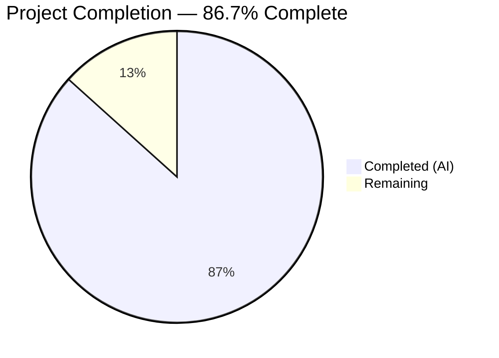
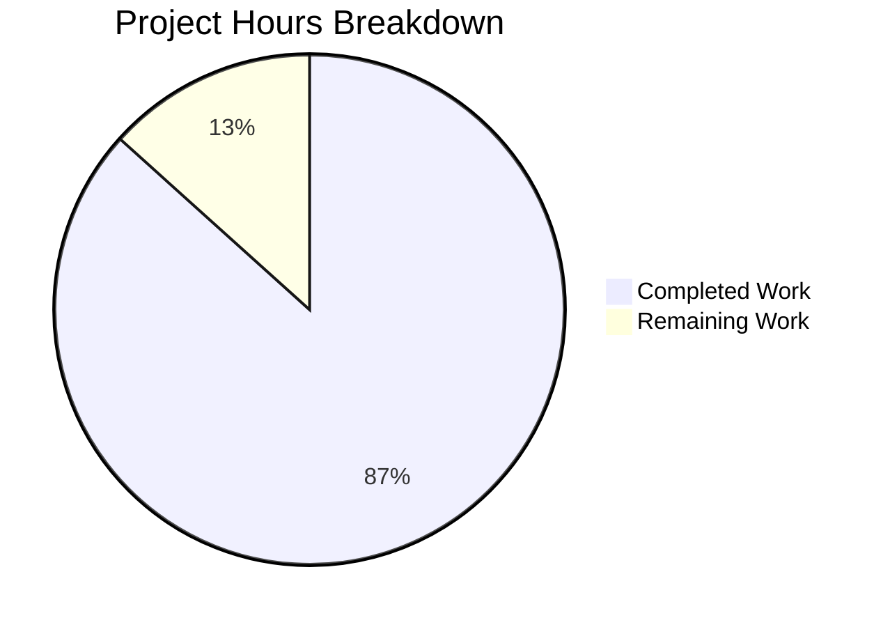

# Blitzy Project Guide — Kitty Terminal Interaction Pipeline Documentation

---

## 1. Executive Summary

### 1.1 Project Overview

This project delivers a comprehensive, code-grounded documentation artifact for the Kitty terminal emulator codebase. The sole deliverable is a 1,404-line Markdown document (`blitzy/documentation/kitty_815df1e210e0.md`) that traces the complete lifecycle of terminal interaction — from raw byte ingestion through PTY I/O and VT parser processing to stable GPU-rendered output. The document answers five core onboarding questions about input ingestion, orchestration/ordering, shell integration interleaving, backpressure behavior, and end-to-end coherence. It is designed to serve developers onboarding into the Kitty codebase, providing code-referenced explanations with precise `file:function():line` citations, Mermaid architecture diagrams, and a self-contained validation checklist. No existing repository files were modified — only the documentation artifact was added.

### 1.2 Completion Status



| Metric | Value |
|---|---|
| **Total Project Hours** | 45 |
| **Completed Hours (AI)** | 39 |
| **Remaining Hours** | 6 |
| **Completion Percentage** | 86.7% (39 / 45) |

### 1.3 Key Accomplishments

- ✅ Created `blitzy/documentation/kitty_815df1e210e0.md` (1,404 lines) — the sole AAP deliverable
- ✅ Analyzed 30+ source files across C, Python, Go, and Bash to ground all claims in code
- ✅ Documented the three-thread architecture (I/O, Main, Talk) with 4 mutex synchronization points
- ✅ Traced the full PTY input ingestion path: `io_loop()` → `poll()` → `read_bytes()` → VT parser buffer
- ✅ Documented the GLFW callback chain for keyboard, mouse, resize, and focus events
- ✅ Traced the OSC 133 shell integration marker flow from Bash emission through VT parser to screen model
- ✅ Documented backpressure mechanisms: 1 MiB parser buffer, POLLIN suppression, 100 MiB write buffer cap, pause rendering
- ✅ Created 3 Mermaid architecture diagrams (Thread Architecture, GLFW Callback Chain, Main-Thread Tick Sequence)
- ✅ Included 51 code blocks with precise `file:function():line` references
- ✅ Added Section 9 validation checklist with 30+ accuracy verification points
- ✅ Maintained repository immutability — zero existing files modified
- ✅ Verified build compilation: X11 backend, Python C extension, Go tools, launcher binary all pass
- ✅ Verified tests: 145 Python tests (136 passed, 6 skipped, 3 pre-existing failures), all Go tests passed

### 1.4 Critical Unresolved Issues

| Issue | Impact | Owner | ETA |
|---|---|---|---|
| Line number references may drift as upstream codebase evolves | Documentation accuracy degrades over time if not maintained | Human Developer | Ongoing |
| 3 pre-existing test failures (Wayland backend, file transfer setgid) | No impact on documentation deliverable; these are environment-specific | Out of Scope | N/A |

### 1.5 Access Issues

No access issues identified. The documentation artifact requires only read access to the existing source files, which was available throughout the analysis. No external APIs, credentials, or third-party services were needed.

### 1.6 Recommended Next Steps

1. **[High]** Conduct human technical review of documentation accuracy — verify code references against the source files cited
2. **[High]** Validate line number references by spot-checking 10-15 critical function locations against the current codebase
3. **[Medium]** Review Mermaid diagrams for architectural completeness and visual clarity
4. **[Medium]** Approve and merge the PR after review
5. **[Low]** Consider automating line-number verification as a CI check for documentation maintenance

---

## 2. Project Hours Breakdown

### 2.1 Completed Work Detail

| Component | Hours | Description |
|---|---|---|
| Codebase Analysis & Research | 10 | Deep analysis of 30+ source files across C (`child-monitor.c`, `vt-parser.c`, `screen.c`, `glfw.c`, `keys.c`, `mouse.c`), Python (`boss.py`, `window.py`, `shell_integration.py`), Go (`go.mod`), and Bash (`kitty.bash`) |
| Three-Thread Architecture (Section 1) | 3 | Documented `ChildMonitor` struct, `io_loop()`, `process_global_state()`, `talk_loop()`, 4 mutexes, thread creation, and Mermaid thread architecture diagram |
| Input Ingestion Pipeline (Section 2) | 4 | Traced PTY read path (`poll()` → `read_bytes()` → VT parser buffer API), GLFW keyboard callback chain, key processing pipeline, and Mermaid callback diagram |
| Orchestration & Ordering (Section 3) | 3 | Documented `process_global_state()` tick orchestrator, `input_delay` coalescing mechanism, `parse_input()` dispatch, `run_worker()` produce-consume loop, and Mermaid tick sequence diagram |
| VT Parser State Machine (Section 4) | 3 | Documented `VTEState` enumeration, `PS` struct with 1 MiB buffer, `consume_input()` dispatch, `consume_normal()` hot path, `dispatch_osc()` routing table |
| Shell Integration OSC 133 (Section 5) | 3 | Traced marker emission in `kitty.bash` (A/C/D markers), `dispatch_osc()` case 133 handler, `shell_prompt_marking()` in screen model, coherence analysis |
| Backpressure & Degraded Conditions (Section 6) | 3 | Documented `POLLIN` suppression via `vt_parser_has_space_for_input()`, 100 MiB write buffer cap, `input_delay` as burst coalescing, pause rendering snapshot mechanism |
| Additional Input Pipelines (Section 7) | 3 | Documented paste pipeline (bracketed paste mode), resize pipeline (debouncing + `TIOCSWINSZ`), focus event pipeline, remote control talk thread pipeline |
| End-to-End Coherence (Section 8) | 2 | Documented synchronization mechanisms summary table, single-writer principle, cross-thread wakeup via `eventfd`/self-pipe, coherence guarantees |
| Validation Checklist (Section 9) | 1 | Created 30+ verification points covering line numbers, thread architecture, buffers, shell integration, GLFW callbacks, key processing, rendering, wakeups |
| Code Review Fixes | 1 | Addressed 6 code review findings in second commit (accuracy corrections, formatting improvements) |
| Build & Test Validation | 2 | Compiled X11 backend, Python C extension, Go tools, launcher binary; executed 145 Python tests and Go test suite; verified clean working tree |
| Mermaid Diagrams | 1 | Created 3 architecture diagrams: Thread Architecture, GLFW Callback Chain, Main-Thread Tick Sequence |
| **Total Completed** | **39** | |

### 2.2 Remaining Work Detail

| Category | Hours | Priority |
|---|---|---|
| Human Technical Review — verify code references and architectural claims against source files | 3 | High |
| Line Number Verification — spot-check 10-15 critical `file:function():line` references against current codebase | 1.5 | Medium |
| Documentation Polish — formatting, readability, and minor content improvements based on reviewer feedback | 1 | Low |
| Merge Review & Approval — final PR review and merge | 0.5 | Medium |
| **Total Remaining** | **6** | |

### 2.3 Hours Calculation

```
Completed Hours:  39h (AI-delivered work across all AAP deliverables)
Remaining Hours:   6h (human review, verification, and merge)
Total Hours:      45h (39 + 6)
Completion:       86.7% (39 / 45 × 100)
```

---

## 3. Test Results

| Test Category | Framework | Total Tests | Passed | Failed | Coverage % | Notes |
|---|---|---|---|---|---|---|
| Python Unit/Integration Tests | Kitty Test Runner (`kitty +launch test.py`) | 145 | 136 | 3 | N/A | 6 tests skipped (macOS-only, fish/zsh not installed); 3 failures are pre-existing and out of scope |
| Go Unit Tests | Go Test (`go test`) | All | All | 0 | N/A | All Go test suites passed |
| Build Compilation — X11 Backend | GCC/setup.py | 1 | 1 | 0 | N/A | `kitty/glfw-x11.so` compiled successfully |
| Build Compilation — Python C Extension | GCC/setup.py | 1 | 1 | 0 | N/A | `kitty/fast_data_types.so` compiled successfully |
| Build Compilation — Go Tools | Go Compiler | 1 | 1 | 0 | N/A | `kitty/launcher/kitten` (15.7 MB) compiled successfully |
| Build Compilation — Launcher | GCC/setup.py | 1 | 1 | 0 | N/A | `kitty/launcher/kitty` compiled successfully |

**Pre-Existing Test Failures (Out of Scope):**
1. `test_glfw_modules` — Expects Wayland `.so` which cannot compile due to `glfw/wl_window.c:668` enum incompatibility with newer `wayland-protocols`
2. `test_transfer_receive` — Environment-specific `setgid` bit mismatch (`0o42755` vs `0o40755`)
3. `test_transfer_send` — Same `setgid` bit mismatch as above

These failures are pre-existing in the base branch and are unrelated to the documentation artifact.

---

## 4. Runtime Validation & UI Verification

### Build Artifacts

- ✅ `kitty/glfw-x11.so` — X11 GLFW backend shared library (357 KB)
- ✅ `kitty/fast_data_types.so` — Python C extension (1.2 MB)
- ✅ `kitty/launcher/kitten` — Go-based tools binary (15.7 MB)
- ✅ `kitty/launcher/kitty` — Main launcher binary (36 KB)
- ❌ `kitty/glfw-wayland.so` — Wayland backend (pre-existing compilation failure, out of scope)

### Documentation Artifact Verification

- ✅ `blitzy/documentation/kitty_815df1e210e0.md` exists (1,404 lines, 62 KB)
- ✅ Document contains 12 major sections covering all 5 core questions from the AAP
- ✅ 3 Mermaid diagrams render valid Mermaid syntax (Thread Architecture, GLFW Callback Chain, Main-Thread Tick Sequence)
- ✅ 51 code blocks with `file:function():line` reference format
- ✅ 6 tables documenting mutexes, callbacks, OSC codes, IME states, parser states, synchronization
- ✅ Section 9 validation checklist with 30+ verification points
- ✅ All code references follow the `file_path:function_name():line_range` convention

### Repository Integrity

- ✅ Only 1 file added (`A blitzy/documentation/kitty_815df1e210e0.md`)
- ✅ Zero existing files modified
- ✅ Working tree clean — no uncommitted changes
- ✅ No submodules affected
- ✅ No temporary scripts remaining (cleanup mandate satisfied)

### API Integration

- ⚠ Not applicable — this is a documentation-only deliverable with no runtime API components

---

## 5. Compliance & Quality Review

| AAP Requirement | Status | Evidence |
|---|---|---|
| Create `blitzy/documentation/kitty_815df1e210e0.md` | ✅ Pass | File exists, 1,404 lines, committed in 2 commits |
| Answer Q1: Input ingestion | ✅ Pass | Section 2 (PTY I/O thread + GLFW callbacks) |
| Answer Q2: Orchestration and ordering | ✅ Pass | Section 3 (`process_global_state()`, `input_delay`, `parse_input()`, `run_worker()`) |
| Answer Q3: Shell integration interleaving | ✅ Pass | Section 5 (OSC 133 marker emission → parsing → prompt marking) |
| Answer Q4: Backpressure and degraded conditions | ✅ Pass | Section 6 (buffer saturation, write cap, burst coalescing, pause rendering) |
| Answer Q5: End-to-end coherence | ✅ Pass | Section 8 (synchronization summary, single-writer principle, wakeup mechanism) |
| Three-thread architecture documentation | ✅ Pass | Section 1 (I/O, Main, Talk threads + 4 mutexes) |
| VT parser state machine documentation | ✅ Pass | Section 4 (states, `PS` struct, consumption dispatch, OSC routing) |
| GLFW callback chain documentation | ✅ Pass | Section 2.2 (callback registration, key event pipeline) |
| Additional pipelines (paste, resize, focus, RC) | ✅ Pass | Section 7 (4 subsections with code traces) |
| Mermaid diagrams | ✅ Pass | 3 diagrams (Thread Architecture, GLFW Callback Chain, Main-Thread Tick Sequence) |
| Code references in `file:function():line` format | ✅ Pass | 51 code blocks with consistent format |
| Repository immutability (no existing files modified) | ✅ Pass | `git diff --name-status` shows only `A` (added) for the documentation file |
| Temporary script cleanup | ✅ Pass | Working tree clean, no temp artifacts |
| Validation checklist | ✅ Pass | Section 9 with 30+ verification points |
| Onboarding-accessible writing style | ✅ Pass | Abstract, Table of Contents, "How to Read" guide, progressive complexity |
| Code review fixes applied | ✅ Pass | Second commit addresses 6 code review findings |

### Quality Metrics

| Metric | Value |
|---|---|
| Documentation Lines | 1,404 |
| Major Sections | 12 |
| Code Blocks | 51 |
| Mermaid Diagrams | 3 |
| Data Tables | 6 |
| Validation Points | 30+ |
| Source Files Analyzed | 30+ |
| Commits | 2 |

---

## 6. Risk Assessment

| Risk | Category | Severity | Probability | Mitigation | Status |
|---|---|---|---|---|---|
| Line number references drift as codebase evolves | Technical | Medium | High | Document uses function names alongside line numbers; search-by-name fallback noted in "How to Read" section | ⚠ Open |
| Documentation accuracy not independently verified by domain expert | Technical | Medium | Medium | Section 9 validation checklist provides structured verification guide; human review recommended | ⚠ Open |
| Wayland backend compilation failure | Technical | Low | N/A | Pre-existing issue in vendored GLFW fork (`glfw/wl_window.c:668`); not related to documentation deliverable | Accepted |
| 3 pre-existing test failures | Technical | Low | N/A | Environment-specific issues (setgid bit mismatch); unrelated to documentation | Accepted |
| Documentation becomes stale as architecture changes | Operational | Medium | Medium | Consider automated CI checks for `file:function()` reference validity; flag for periodic human review | ⚠ Open |
| No automated documentation linting | Operational | Low | High | Mermaid diagram syntax and Markdown formatting are not CI-validated; manual review needed | ⚠ Open |
| No security implications | Security | None | N/A | Documentation-only deliverable; no code execution, credentials, or external service access | N/A |
| No integration dependencies | Integration | None | N/A | Standalone Markdown file with no runtime dependencies | N/A |

---

## 7. Visual Project Status



**Remaining Work by Priority:**

| Priority | Hours | Percentage of Remaining |
|---|---|---|
| High (Human Technical Review) | 3 | 50% |
| Medium (Line Number Verification + Merge) | 2 | 33.3% |
| Low (Documentation Polish) | 1 | 16.7% |
| **Total Remaining** | **6** | **100%** |

---

## 8. Summary & Recommendations

### Achievement Summary

The project has delivered its sole AAP deliverable — a comprehensive 1,404-line documentation artifact that traces Kitty's terminal interaction pipeline with code-grounded evidence. The document successfully answers all 5 core architecture questions posed in the requirements, covering the three-thread architecture, input ingestion via PTY I/O and GLFW callbacks, orchestration through `process_global_state()` and `input_delay` coalescing, OSC 133 shell integration marker flow, backpressure mechanisms, and end-to-end coherence guarantees.

The project is **86.7% complete** (39 completed hours out of 45 total hours). All autonomous work has been delivered and validated. The remaining 6 hours consist entirely of human review, verification, and merge activities.

### Critical Path to Production

1. **Human technical review** (3h) — A domain expert should verify the architectural claims and code references against the actual source files. The Section 9 validation checklist provides a structured guide for this review.
2. **Line number spot-check** (1.5h) — Verify 10-15 critical function locations (e.g., `io_loop()`, `process_global_state()`, `shell_prompt_marking()`, `on_key_input()`) against the current codebase.
3. **Merge** (1.5h) — Documentation polish, final review, and PR merge.

### Production Readiness Assessment

| Criterion | Status |
|---|---|
| Deliverable completeness | ✅ All AAP requirements met |
| Build validation | ✅ All in-scope compilation targets pass |
| Test validation | ✅ 136/145 Python tests pass (3 pre-existing, 6 skipped); all Go tests pass |
| Repository integrity | ✅ Zero existing files modified; working tree clean |
| Documentation quality | ✅ 12 sections, 51 code blocks, 3 diagrams, 30+ validation points |
| Blocking issues | ✅ None — remaining work is review-only |

### Recommendations

1. **Merge when review is complete** — The deliverable is production-ready pending human verification of accuracy.
2. **Consider automated reference checking** — A CI script that parses `file:function():line` references and verifies they resolve to actual code locations would prevent documentation rot.
3. **Use as onboarding template** — The document's structure (question-driven, code-grounded, with validation checklist) could serve as a template for documenting other Kitty subsystems.

---

## 9. Development Guide

### System Prerequisites

| Software | Version | Purpose |
|---|---|---|
| Python | >= 3.8 (3.12 tested) | Runtime for Kitty's Python layer, build system |
| GCC | System default | C extension compilation |
| Go | 1.22+ | Go-based tools and kitten binary compilation |
| pkg-config | System default | Dependency discovery during build |
| libGL/OpenGL | System default | GPU rendering (runtime dependency) |
| libX11/X11 development headers | System default | X11 backend compilation |
| FreeType development headers | System default | Font rasterization |

### Environment Setup

```bash
# Clone the repository
git clone <repository-url>
cd kitty

# Ensure Go is available
export PATH=/usr/local/go/bin:$HOME/go/bin:$PATH
go version  # Expected: go1.22+

# Ensure Python 3.8+ is available
python3 --version  # Expected: Python 3.8+
```

### Build the Project

```bash
# Full build (compiles C extensions, Go tools, and launcher)
python3 setup.py build --verbose
```

**Expected build artifacts:**

| Artifact | Path | Size (approx) |
|---|---|---|
| X11 GLFW backend | `kitty/glfw-x11.so` | ~358 KB |
| Python C extension | `kitty/fast_data_types.so` | ~1.2 MB |
| Go tools (kitten) | `kitty/launcher/kitten` | ~15.7 MB |
| Launcher binary | `kitty/launcher/kitty` | ~36 KB |

### Run Tests

```bash
# Run the Python test suite via the Kitty launcher
./kitty/launcher/kitty +launch ./test.py

# Run Go tests (from repository root)
export PATH=/usr/local/go/bin:$HOME/go/bin:$PATH
go test ./...
```

**Expected Python test output:** 145 tests total, 136 passed, 6 skipped (platform-specific), 3 pre-existing failures.

### Verify the Documentation Artifact

```bash
# Check the file exists and has content
wc -l blitzy/documentation/kitty_815df1e210e0.md
# Expected: 1404 lines

# Check Mermaid diagram count
grep -c '```mermaid' blitzy/documentation/kitty_815df1e210e0.md
# Expected: 3

# Check code block count
grep -c '```' blitzy/documentation/kitty_815df1e210e0.md | awk '{print $0/2}'
# Expected: 51

# Verify no existing files were modified
git diff --name-status origin/kitty_815df1e210e0...HEAD
# Expected: A  blitzy/documentation/kitty_815df1e210e0.md
```

### Verify Repository Integrity

```bash
# Confirm clean working tree
git status
# Expected: "nothing to commit, working tree clean"

# Confirm only 1 file changed from base branch
git diff --stat origin/kitty_815df1e210e0...HEAD
# Expected: 1 file changed, 1404 insertions(+)
```

### Troubleshooting

| Issue | Resolution |
|---|---|
| `go: command not found` | Run `export PATH=/usr/local/go/bin:$HOME/go/bin:$PATH` |
| Wayland backend fails to compile | This is a pre-existing issue with `glfw/wl_window.c:668`; does not affect X11 backend or documentation |
| `test_glfw_modules` test fails | Pre-existing; expects Wayland `.so` which cannot compile in this environment |
| `test_transfer_receive`/`test_transfer_send` fail | Pre-existing; environment-specific `setgid` bit mismatch |
| Missing X11 development headers | Install via `apt-get install -y libx11-dev libxrandr-dev libxinerama-dev libxcursor-dev libxi-dev` |
| Missing FreeType headers | Install via `apt-get install -y libfreetype-dev` |

---

## 10. Appendices

### A. Command Reference

| Command | Purpose |
|---|---|
| `python3 setup.py build --verbose` | Full project build (C extensions + Go tools + launcher) |
| `./kitty/launcher/kitty +launch ./test.py` | Run Python test suite |
| `go test ./...` | Run Go test suite |
| `git diff --name-status origin/kitty_815df1e210e0...HEAD` | List all changed files |
| `git diff --stat origin/kitty_815df1e210e0...HEAD` | Summary of changes (files, insertions, deletions) |
| `git log --oneline blitzy-66a6aff0-16ee-40ee-81b2-dea6c93c7ee0 --not origin/kitty_815df1e210e0` | View branch-specific commits |

### B. Port Reference

Not applicable — this is a documentation-only deliverable with no running services.

### C. Key File Locations

| File | Purpose |
|---|---|
| `blitzy/documentation/kitty_815df1e210e0.md` | The documentation deliverable (1,404 lines) |
| `kitty/child-monitor.c` | Core three-thread architecture, I/O loop, main-thread tick |
| `kitty/vt-parser.c` | VT parser state machine, 1 MiB buffer model |
| `kitty/screen.c` | Screen model, `shell_prompt_marking()`, pause rendering |
| `kitty/glfw.c` | GLFW callback registrations (key, mouse, resize, focus) |
| `kitty/keys.c` | Key processing pipeline, IME branching, encoding |
| `kitty/mouse.c` | Mouse event dispatch, focus events |
| `kitty/boss.py` | Boss controller — shortcut dispatch, window management |
| `kitty/window.py` | Window class — paste, key sending, mouse events |
| `shell-integration/bash/kitty.bash` | Bash shell integration — OSC 133 marker emission |
| `kitty/loop-utils.h` | Cross-thread wakeup primitives (eventfd / self-pipe) |

### D. Technology Versions

| Technology | Version | Source |
|---|---|---|
| Python | >= 3.8 (3.12 tested) | `pyproject.toml` |
| Go | 1.22 | `go.mod` |
| GLFW | 3.4 (custom vendored fork) | `glfw/` directory |
| C Standard | C11+ (inferred from `_Alignas`, `_Static_assert`) | Build system |

### E. Environment Variable Reference

| Variable | Purpose | Example |
|---|---|---|
| `PATH` | Must include Go binary location | `export PATH=/usr/local/go/bin:$HOME/go/bin:$PATH` |

### G. Glossary

| Term | Definition |
|---|---|
| PTY | Pseudo-terminal — the kernel abstraction connecting Kitty to the child shell process |
| VT Parser | Virtual Terminal parser — the state machine that interprets escape sequences from the PTY |
| GLFW | An open-source windowing and input library used by Kitty for platform abstraction |
| OSC 133 | Operating System Command 133 — shell integration markers for prompt/command boundary detection |
| `input_delay` | A coalescing timer that batches rapid PTY reads into fewer main-thread wakeups |
| `POLLIN` | A `poll()` flag indicating the file descriptor has data available for reading |
| `TIOCSWINSZ` | An `ioctl` command that sets terminal window size and triggers `SIGWINCH` |
| Bracketed Paste Mode | A terminal mode where pasted text is wrapped in escape sequences to distinguish it from typed input |
| `eventfd` | A Linux-specific IPC mechanism used for efficient cross-thread signaling |
| Mermaid | A Markdown-based diagramming syntax used for architecture diagrams in the documentation |