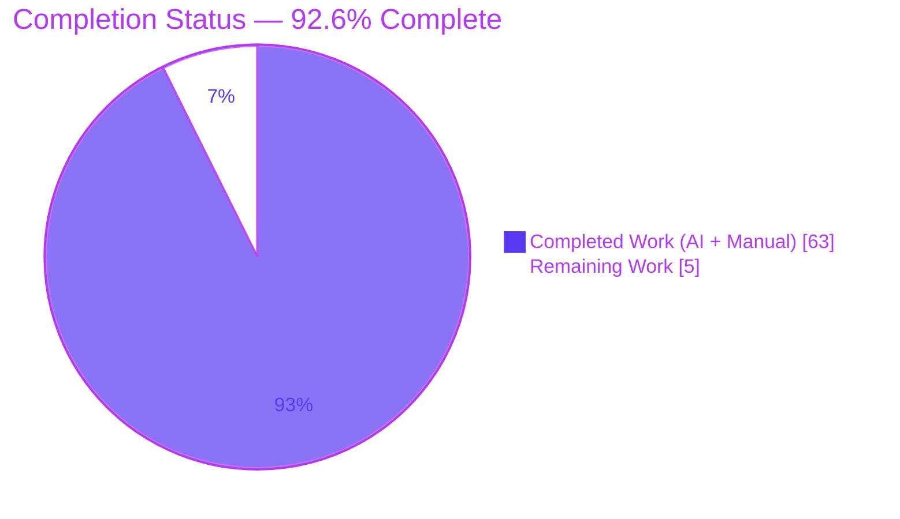
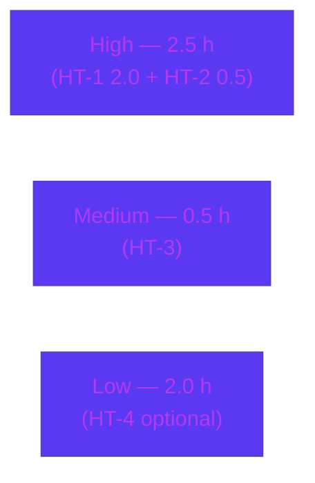

# Blitzy Project Guide — kitty Early Startup & Initialization Investigation

> **Deliverable type:** Read-only Q&A / documentation investigation
> **Single artifact:** `blitzy/documentation/kitty_815df1e210e0.md` (1,337 lines)
> **Branch:** `blitzy-3ab00df6-e58f-4345-ba91-ba55c333640f` · **HEAD:** `21ef59ca8` · **Base:** `815df1e21`
> **Brand colors:** Completed / AI Work = Dark Blue `#5B39F3` · Remaining = White `#FFFFFF` · Headings/Accents = Violet-Black `#B23AF2` · Highlight = Mint `#A8FDD9`

---

## 1. Executive Summary

### 1.1 Project Overview

This project delivers a comprehensive, evidence-grounded written investigation of the **kitty** terminal emulator's critical early startup and initialization sequence. The single deliverable is a Markdown document that builds kitty from source, launches it through its canonical native launcher, and traces how subsystems initialize — the rendering backend actually selected during GPU-context creation, the display configuration detected, the text-rendering capabilities reported, and the relationship between the window system, GPU initialization, and the text-cell metrics computed before any content is displayed. The target audience is engineers who need a faithful, citation-anchored map of kitty's boot path. Per an explicit read-only mandate, no kitty source was modified; the sole repository change is one new documentation file.

### 1.2 Completion Status

The project is **92.6% complete** (AAP-scoped, hours-based per PA1 methodology). All seven requirements are delivered, validated, and committed; the remaining 5.0 hours are path-to-production activities (human acceptance review and optional real-GPU re-verification).



| Metric | Hours |
|--------|-------|
| **Total Hours** | 68.0 |
| **Completed Hours (AI + Manual)** | 63.0 |
| **Remaining Hours** | 5.0 |
| **Percent Complete** | **92.6%** |

> Completion % = Completed Hours ÷ Total Hours = 63.0 ÷ 68.0 = **92.6%**.

### 1.3 Key Accomplishments

- ✅ **Built kitty from source** via its canonical entry point (`python3 setup.py build`): 122 compile steps + 5 link steps, exit 0; artifact byte-sizes match the recorded transcript.
- ✅ **Launched kitty headlessly** through the real native launcher (`kitty/launcher/kitty`) under Xvfb + Mesa `llvmpipe`, exit 0, across 17+ runs; version banner `kitty 0.35.2 created by Kovid Goyal`.
- ✅ **Traced the full startup order** (native launcher → Python bootstrap → GLFW init → font/cell metrics → OS window + GPU context → GL init → shader compile → Boss + child monitor → main loop), reconciled against monotonic-clock timestamps.
- ✅ **Captured the rendering backend actually selected**: GL `4.5 (Core Profile) Mesa 24.2.8` via `gl_init()`; documented the minimum floor (3.1 Linux / 3.3 macOS), GLSL 140, and the context hints requested.
- ✅ **Documented display configuration**: 1920×1080, logical DPI 96, content scale 1.0 (derived from an absent `RESOURCE_MANAGER`/`Xft.dpi`).
- ✅ **Reported text-rendering capabilities**: DejaVu Sans Mono (4 faces) with concrete `.ttf` paths via `dump_font_debug`; FreeType rasterization + HarfBuzz shaping + FontConfig discovery.
- ✅ **Explained window↔GPU↔cell relationship**: `calc_cell_metrics` → `get_window_size` closure; cell 9×18 px @ DPI 96; default 640×400 → 22×71 grid, cross-checked against `stty size`.
- ✅ **Grounded every claim**: 118 `file:line` citations across 26 source files (all resolve); observed-vs-inferred labelling throughout; software-GL caveat prominently disclosed.
- ✅ **Preserved repository purity**: exactly one added file, zero source modifications, temporary observation scripts confined to `/tmp` and removed.

### 1.4 Critical Unresolved Issues

| Issue | Impact | Owner | ETA |
|-------|--------|-------|-----|
| _None — no blocking issues._ The deliverable is complete, validated, and committed; the working tree is clean and repository purity is intact. | None | — | — |

### 1.5 Access Issues

| System / Resource | Type of Access | Issue Description | Resolution Status | Owner |
|-------------------|----------------|-------------------|-------------------|-------|
| Reporting sandbox toolchain | Build tooling (Go, pkg-config) | The current reporting container (Ubuntu 25.10) lacks Go and pkg-config, so a full rebuild is not re-performable **here**. This does **not** affect the deliverable — the build/runtime were completed and validated by prior agents in the correct environment (Ubuntu 24.04.2). | Not blocking — disclosed as an environment caveat; validated environment documented in §9/§10 | Human reviewer |
| Physical GPU hardware | Hardware / driver | The sandbox has no GPU; observed GL/renderer magnitudes are Mesa `llvmpipe` software values (non-canonical for real hardware). | Not blocking — labelled non-canonical in the document; optional real-GPU re-verification is remaining task HT-4 | Human reviewer |

### 1.6 Recommended Next Steps

1. **[High]** Perform the acceptance review of `blitzy/documentation/kitty_815df1e210e0.md` — confirm all seven requirements are answered and spot-check a sample of the citations against the pinned source.
2. **[High]** Verify repository purity (`git diff 815df1e21..HEAD --name-status` = one added file; clean tree) and approve/merge the PR.
3. **[Medium]** Independently reproduce the key evidence (build + headless launch) using the documented commands in an environment with the documented toolchain.
4. **[Low]** _Optional:_ re-verify the environment-scoped magnitudes on real GPU hardware to capture the physical driver's GL string and confirm the environment-independent startup structure holds.

---

## 2. Project Hours Breakdown

### 2.1 Completed Work Detail

Each component traces to a specific AAP requirement (REQ-1..REQ-7) or a mandated deliverable/purity activity.

| Component | Hours | Description |
|-----------|------:|-------------|
| A — Build environment + canonical build (REQ-1) | 9.0 | Install toolchain + dev libraries; run `python3 setup.py build`; capture full transcript; verify launcher/kitten/C-extension/GLFW artifacts and byte-sizes. |
| B — Runtime observation + instrumentation (REQ-1..6) | 9.5 | Headless Xvfb + `llvmpipe` launches with `--debug-rendering`/`--debug-font-fallback`; supplemental cell-metrics/geometry/thread probes exercised through kitty's own C path and removed. |
| C1 — Startup / init order trace (REQ-2, REQ-7) | 5.0 | Reconcile code path with monotonic-timestamped log; produce ordered subsystem-init narrative + diagram. |
| C2 — Rendering backend / GPU context (REQ-3) | 4.0 | Capture GL version string; document floor (3.1/3.3), GLSL 140, context hints, `ARB_texture_storage`, two-context (hidden→visible) sequence, `glxinfo` contrast. |
| C3 — Display configuration detected (REQ-4) | 2.0 | Content-scale/DPI detection; `RESOURCE_MANAGER`/`Xft.dpi` absence → DPI 96, scale 1.0; grid cross-check. |
| C4 — Text-rendering capabilities (REQ-5) | 2.0 | Resolve default fonts + concrete `.ttf` paths via `dump_font_debug`; document FreeType/HarfBuzz/FontConfig stack. |
| C5 — Window↔GPU↔cell relationship (REQ-6) | 3.0 | Trace `calc_cell_metrics` → `get_window_size`; cell px; default/cells window geometry; formula verification. |
| C6 — Concurrency model at startup (REQ-7) | 2.5 | Thread model: main + I/O (unconditional) + conditional Talk thread; corrected an earlier three-thread claim to the accurate two-thread default. |
| D1 — Authoring + evidence grounding (REQ-1..7) | 21.0 | Write the 1,337-line document; 118 `file:line` citations across 26 files; observed-vs-inferred labelling; complete unedited output blocks. |
| D2 — QA remediation (4 commits) | 4.0 | Code-review remediation, security-gate QA, report-fidelity QA, and the §8.3 timestamp-distribution correction. |
| E — Repository purity verification | 1.0 | Confirm one added file, zero source modifications, gitignored artifacts uncommitted, temporary scripts removed. |
| **Total Completed** | **63.0** | |

### 2.2 Remaining Work Detail

All remaining work is path-to-production (human-only). Total equals the Remaining Hours in §1.2 and the "Remaining Work" value in §7.

| Category | Hours | Priority |
|----------|------:|----------|
| HT-1 — Acceptance review of the 1,337-line document (verify 7 REQs; spot-check citations vs pinned source; confirm observed-vs-inferred + software-GL caveat) | 2.0 | High |
| HT-2 — Verify repository purity (one added file; clean tree) and approve/merge PR | 0.5 | High |
| HT-3 — Independently reproduce key evidence (documented build + headless launch; confirm banner, GL line, font block) | 0.5 | Medium |
| HT-4 — _Optional:_ real-GPU re-verification of environment-scoped magnitudes (physical GL string; structure invariance) | 2.0 | Low |
| **Total Remaining** | **5.0** | |

### 2.3 Hours Reconciliation

| Check | Result |
|-------|--------|
| Section 2.1 completed sum | 63.0 h |
| Section 2.2 remaining sum | 5.0 h |
| 2.1 + 2.2 = Total (§1.2) | 63.0 + 5.0 = **68.0 h** ✅ |
| Completion % (63.0 ÷ 68.0) | **92.6%** ✅ |
| Remaining matches §1.2 ↔ §2.2 ↔ §7 | 5.0 h in all three ✅ |

---

## 3. Test Results

This is a **read-only documentation task**; there is no in-scope application code, so no unit-test framework applies and kitty's `./test.py` suite was intentionally **not** exercised (AAP §0.2). The effective validation suite is Blitzy's autonomous **build + runtime + claim-verification + stability** checks. Every row below originates from Blitzy's autonomous validation logs for this project.

| Test Category | Framework / Method | Total | Passed | Failed | Coverage % | Notes |
|---------------|--------------------|------:|-------:|-------:|-----------:|-------|
| Build validation | `python3 setup.py build` (canonical) | 1 | 1 | 0 | N/A | Exit 0; 122 compile + 5 link steps; artifact byte-sizes match the recorded transcript. |
| Runtime — canonical headless launch | `kitty/launcher/kitty` under Xvfb + `llvmpipe` | 17+ | 17+ | 0 | N/A | Exit 0 on every launch; version banner `kitty 0.35.2`. |
| Stability — startup event order | 10-run repetition | 10 | 10 | 0 | N/A | Zero ordering violations of `GL ≤ OS Window ≤ systemd ≤ Child ≤ Text fonts`. |
| Stability — cell metrics | Supplemental probe (kitty's own `calc_cell_metrics`) | 2 | 2 | 0 | N/A | Byte-identical output (9×18 px @ DPI 96). |
| Stability — window geometry | Geometry probe (default + cells) | 2 | 2 | 0 | N/A | 640×400 and 721×433 reproduced; formulas verified. |
| Stability — thread model | Thread-count probe | 2 | 2 | 0 | N/A | Identical result (`KittyChildMon` present, `KittyPeerMon` absent). |
| Accuracy — citation resolution | Link-target resolver | 26 files / 118 refs | 26 / 118 | 0 | N/A | All cited source files/links resolve; zero drift. |
| Accuracy — claim verification | Manual verify vs real output + source | All claims | All | 0 | N/A | Every factual claim verified; one §8.3 correction applied. |

> **Integrity note:** Coverage % is Not Applicable because the deliverable is documentation (no executable in-scope code). Validation is claim-verification-based rather than code-coverage-based.

---

## 4. Runtime Validation & UI Verification

kitty is a GPU-based terminal; there is no web/UI surface for this deliverable. "Runtime validation" here means confirming kitty builds and boots through its canonical path and emits the diagnostics the document reports.

- ✅ **Operational — Canonical build:** `python3 setup.py build` → exit 0; native launcher, kitten, C extension, and GLFW backends produced.
- ✅ **Operational — Canonical launch:** headless `kitty/launcher/kitty` under Xvfb + `llvmpipe` → exit 0 across 17+ runs.
- ✅ **Operational — Version banner:** `kitty 0.35.2 created by Kovid Goyal` (`--version`, exit 0).
- ✅ **Operational — GPU context creation:** GL `4.5 (Core Profile) Mesa 24.2.8` detected by `gl_init()`; forward-compatible core context delivered.
- ✅ **Operational — Font system setup:** DejaVu Sans Mono (4 faces) resolved with concrete `.ttf` paths via `dump_font_debug`.
- ✅ **Operational — Display detection:** 1920×1080; logical DPI 96; content scale 1.0.
- ✅ **Operational — Cell metrics → window sizing:** cell 9×18 px @ DPI 96; default 640×400 → 22×71 grid, cross-checked against child `stty size`.
- ✅ **Operational — Startup order stability:** event order is a reproducible invariant (10-run repetition, zero violations).
- ⚠ **Partial — Renderer identity (environment-scoped):** observed renderer is Mesa `llvmpipe` **software** GL (no GPU in sandbox). Non-canonical for real hardware; the same code path reports the physical GPU driver's GL string on a real machine. Startup **structure** is environment-independent.
- ❌ **Failing:** None.

---

## 5. Compliance & Quality Review

AAP deliverables cross-mapped to Blitzy's quality/compliance benchmarks. Fixes applied during autonomous validation are noted.

| Benchmark / AAP Deliverable | Status | Progress | Notes |
|------------------------------|--------|----------|-------|
| REQ-1 — Build & launch from source | ✅ Pass | 100% | Canonical build + headless launch, banner `kitty 0.35.2`. |
| REQ-2 — Trace critical early startup phase | ✅ Pass | 100% | Ordered init narrative + timestamp reconciliation. |
| REQ-3 — Rendering backend actually selected | ✅ Pass | 100% | GL string, floor, GLSL, context hints, two-context sequence. |
| REQ-4 — Display configuration detected | ✅ Pass | 100% | DPI 96 / scale 1.0; `RESOURCE_MANAGER` absent → `Xft.dpi` unset. |
| REQ-5 — Text-rendering capabilities reported | ✅ Pass | 100% | Fonts + concrete paths; FreeType/HarfBuzz/FontConfig. |
| REQ-6 — Window↔GPU↔cell relationship | ✅ Pass | 100% | `calc_cell_metrics` → `get_window_size`; cell px; geometry verified. |
| REQ-7 — Startup sequence map + concurrency | ✅ Pass | 100% | Component map + accurate two-thread default model. |
| Rule — Build/run FIRST, then write | ✅ Pass | 100% | All runtime claims from real captured output + producing command. |
| Rule — Canonical path only (no bypass) | ✅ Pass | 100% | Real launcher + debug flags; supplemental harness labelled non-canonical. |
| Rule — Default configuration (`--config NONE`) | ✅ Pass | 100% | Default build/config; exact commands recorded. |
| Rule — Grounding (`file:line`, observed vs inferred) | ✅ Pass | 100% | 118 citations / 26 files; explicit labels. |
| Rule — Stability across ≥2 runs | ✅ Pass | 100% | Order (10-run), cell/geometry/thread (2-run). |
| Rule — Software-GL caveat disclosed | ✅ Pass | 100% | `llvmpipe` labelled non-canonical; real-HW note included. |
| Rule — Read-only / repository purity | ✅ Pass | 100% | One added file; zero source edits; temp scripts removed. |
| Deliverable name & location | ✅ Pass | 100% | `blitzy/documentation/kitty_815df1e210e0.md` (branch-named). |
| QA remediation applied | ✅ Pass | 100% | Code-review + security-gate + report-fidelity + §8.3 timestamp correction. |
| Human acceptance review | ⬜ Pending | 0% | Path-to-production (HT-1/HT-2); 5.0 h allocated in §2.2. |

---

## 6. Risk Assessment

The risk profile is genuinely **Low**: the deliverable is a completed, validated, committed, read-only documentation artifact with the repository pristine (no code added/modified, no dependency changes, no new attack surface).

| Risk | Category | Severity | Probability | Mitigation | Status |
|------|----------|----------|-------------|------------|--------|
| Environment-scoped GL/renderer/cell magnitudes are Mesa `llvmpipe` software values, non-canonical for real GPUs | Technical | Low | Medium | Labelled `[observed]`/`[non-canonical]`; note that the same code path reports the GPU's GL string on real HW; structure is environment-independent; optional real-GPU re-verification (HT-4) | Open (disclosed) |
| `file:line` citation drift as source evolves | Technical | Low | Medium | Citations anchored to named functions/structs; document pinned to source commit `815df1e21`; all 26 targets resolve | Mitigated |
| Build reproducibility / toolchain skew (e.g., Wayland `-Werror=switch`; reporting container lacks Go/pkg-config) | Technical | Low | Low | Exact toolchain versions documented; X11 backend used; kitty's `./dev.sh` pins prebuilt deps; disclosed as environment caveat, not a kitty defect | Mitigated |
| Subtle factual inaccuracy could mislead readers | Technical | Low | Low | Every claim verified vs real output + source (zero drift); 4 QA cycles incl. §8.3 correction; observed-vs-inferred labels | Mitigated |
| No new attack surface / dependencies / credentials | Security | None | — | Read-only task; zero code | Resolved |
| Document could expose sensitive information | Security | Low | Low | Only public source refs + environment specs; no secrets; security-gate QA cycle completed | Resolved |
| Temporary observation scripts persisting in repo | Operational | None | — | Scripts existed only in `/tmp`; removal verified with before/after evidence (§9) | Resolved |
| No runtime service / operational surface (static Markdown) | Operational | None | — | Nothing to deploy or monitor | N/A |
| Human acceptance review pending | Operational | Low | Medium | Standard gate; 5.0 h remaining allocated | Open |
| No external integrations / API keys / services | Integration | None | — | Self-contained document | N/A |
| Fidelity to cited source locations | Integration | Low | Low | Named-anchor citations; pinned commit | Mitigated |

---

## 7. Visual Project Status


**Remaining work by priority (from §2.2 — sums to 5.0 h):**



> **Integrity:** "Remaining Work" = **5.0 h** here equals the Remaining Hours in §1.2 and the sum of §2.2. "Completed Work" = **63.0 h** equals Completed Hours in §1.2 and the sum of §2.1. Completed = Dark Blue `#5B39F3`; Remaining = White `#FFFFFF`.

---

## 8. Summary & Recommendations

**Achievements.** The project is **92.6% complete (63.0 of 68.0 hours)**. kitty was built from source and launched through its canonical native launcher, and all seven requirements are answered from real, captured runtime output with `file:line` grounding: the startup order and component map, the rendering backend actually selected (GL `4.5 (Core Profile) Mesa 24.2.8`, floor 3.1 Linux / 3.3 macOS, GLSL 140, context hints), the detected display configuration (DPI 96, scale 1.0), the reported text-rendering capabilities (DejaVu Sans Mono with concrete paths; FreeType/HarfBuzz/FontConfig), and the window↔GPU↔cell relationship (cell 9×18 px feeding a 640×400 → 22×71 grid). An earlier three-thread concurrency claim was corrected to the accurate two-thread default.

**Remaining gaps (5.0 h, path-to-production only).** Human acceptance review (3.0 h across HT-1/HT-2/HT-3) and an optional real-GPU re-verification of the environment-scoped magnitudes (2.0 h, HT-4).

**Critical path to production.** (1) Acceptance review → (2) purity check + merge. The optional GPU re-verification can proceed in parallel or be deferred; it does not block merge because the document already labels the software-GL values as non-canonical.

**Success metrics.** Build exit 0; runtime exit 0 across 17+ launches; startup order a reproducible invariant (10-run, zero violations); all 26 cited files / 118 citations resolve; exactly one added file with zero source modifications.

**Production-readiness assessment.** The deliverable is **ready for human review and merge**. It is complete, internally consistent, and evidence-grounded, with its one environmental limitation (software-GL renderer identity) explicitly disclosed. No blocking issues remain.

| Metric | Value |
|--------|-------|
| Completion | 92.6% |
| Completed / Total hours | 63.0 / 68.0 |
| Remaining hours | 5.0 (path-to-production) |
| Blocking issues | 0 |
| Repository delta | 1 added file, 0 source modifications |
| Confidence | High (well-defined scope; exhaustively validated) |

---

## 9. Development Guide

> **Environment caveat (read first).** kitty's build/runtime were completed and validated by prior agents in the environment documented below (Ubuntu 24.04.2; Go 1.23.4; pkg-config 1.8.1). The **current reporting sandbox** (Ubuntu 25.10, Python 3.13.7, gcc 15.2.0) **lacks Go, pkg-config, Xvfb, and Mesa**, so a full rebuild is **not re-performable here**. The commands below are the exact, validated commands from the deliverable (§1, §8.2). Lightweight verification (toolchain presence, source-file existence, `setup.py` syntax, git purity, deliverable presence) was re-run in this sandbox and passed.

### 9.1 System Prerequisites

- **OS:** Linux (validated on Ubuntu 24.04.2). macOS is also supported by kitty (uses Core Text instead of FreeType/FontConfig).
- **Python** ≥ 3.8 (`pyproject.toml`; validated 3.12.3) — runs the bootstrap layer and drives `setup.py`.
- **Go** ≥ 1.22 (`go.mod`; validated 1.23.4) — compiles the Go launcher and kittens.
- **C compiler** — gcc or clang (validated gcc 13.3.0) — compiles the `fast_data_types` C extension.
- **pkg-config** (validated 1.8.1) — resolves system-library compile/link flags.
- **Headless display (for GPU-less runs):** Xvfb + Mesa software GL (`llvmpipe`).

### 9.2 Environment Setup (dependency installation)

Install build toolchain, kitty's system libraries, and headless helpers (Debian/Ubuntu):

```bash
sudo apt-get update
# Build toolchain + kitty build/runtime dependencies (docs/build.rst §Dependencies)
sudo apt-get install -y \
  build-essential pkg-config python3 python3-dev golang-go \
  libharfbuzz-dev libpng-dev zlib1g-dev liblcms2-dev libxxhash-dev \
  libssl-dev libfreetype-dev libfontconfig-dev libcanberra-dev libsimde-dev \
  libdbus-1-dev libxcursor-dev libxrandr-dev libxi-dev libxinerama-dev \
  libgl1-mesa-dev libxkbcommon-x11-dev libx11-xcb-dev libpython3-dev
# Headless run + observation tooling
sudo apt-get install -y xvfb mesa-utils x11-utils
```

### 9.3 Build (canonical entry point)

```bash
cd /path/to/repo            # repository root (contains setup.py, Makefile)
python3 setup.py build ; echo "BUILD_EXIT=$?"
```

**Expected:** a stream of `[N/122] Compiling …` lines followed by `[k/5]` link steps and `BUILD_EXIT=0`. Produces: `kitty/launcher/kitty`, `kitty/launcher/kitten`, `kitty/fast_data_types.so`, `kitty/glfw-x11.so`, `kitty/glfw-wayland.so`. (Equivalent to the `Makefile` `all:` target.)

> Do **not** run `setup.py clean` to force a rebuild — it runs `go clean -modcache` and wipes the warm Go cache. To force a non-incremental transcript, remove only the gitignored C artifacts (`build/`, `kitty/*.so`, `kitty/launcher/kitt*`) and re-run.

### 9.4 Launch & Verify

Shared environment for every headless launch:

```bash
export LANG=C.UTF-8 LC_ALL=C.UTF-8 LIBGL_ALWAYS_SOFTWARE=1 GALLIUM_DRIVER=llvmpipe
```

Version banner (sanity):

```bash
./kitty/launcher/kitty --version        # -> kitty 0.35.2 created by Kovid Goyal
```

Canonical headless launch with startup diagnostics:

```bash
xvfb-run -a -s "-screen 0 1920x1080x24" \
  ./kitty/launcher/kitty --debug-rendering --debug-font-fallback --config NONE \
  sh -c 'sleep 1.5' ; echo "LAUNCH_EXIT=$?"
```

**Expected (semantic invariants):** `LAUNCH_EXIT=0`; a GL version line `4.5 (Core Profile) Mesa 24.2.8 …`; an `OS Window created` line; a `Child launched` line; and a `Text fonts:` block listing four DejaVu Sans Mono `.ttf` paths. Event **order** is stable run-to-run; absolute timestamps are volatile.

Renderer / profile contrast (proves forward-compat delivered the core context):

```bash
xvfb-run -a -s "-screen 0 1920x1080x24" glxinfo -B
```

### 9.5 Verify Repository Purity

```bash
git diff 815df1e21..HEAD --name-status   # -> A  blitzy/documentation/kitty_815df1e210e0.md
git status --porcelain                    # -> (empty = clean)
git diff --check                          # -> (no output = clean)
```

### 9.6 Example Usage (reading the deliverable)

```bash
# Open the investigation document
less blitzy/documentation/kitty_815df1e210e0.md
# Jump to a section, e.g. the rendering backend (REQ-3)
grep -n '^## ' blitzy/documentation/kitty_815df1e210e0.md
```

### 9.7 Troubleshooting

- **`error: externally-managed-environment` on pip (Ubuntu 24+):** create a venv (`python3 -m venv .venv && . .venv/bin/activate`) or pass `--break-system-packages`. Not required for `setup.py build` itself.
- **No GPU / GL context fails to create:** export `LIBGL_ALWAYS_SOFTWARE=1 GALLIUM_DRIVER=llvmpipe` and run under `xvfb-run`. Without a working GL context, `create_os_window` aborts citing the required OpenGL version (`kitty/glfw.c:L1199`), and `gl_init` aborts if the detected version is below the floor (`kitty/gl.c:L73-74`) or `ARB_texture_storage` is missing (`kitty/gl.c:L64-66`).
- **Wayland backend fails with `-Werror=switch` on newer `wayland-protocols`:** an environment version-skew artifact, not a kitty defect. `setup.py` auto-disables Wayland when its `pkg-config` check fails; build/run the X11 backend instead.
- **`xrdb` not installed:** inspect the X resource database with `xprop -root RESOURCE_MANAGER` (as the deliverable does).
- **`go: command not found` / `pkg-config: command not found`:** install `golang-go` and `pkg-config` (see §9.2). The reporting sandbox intentionally omits these; use the documented validated environment for a full build.

---

## 10. Appendices

### A. Command Reference

| Purpose | Command |
|---------|---------|
| Canonical build | `python3 setup.py build` |
| Version banner | `./kitty/launcher/kitty --version` |
| Headless startup trace | `xvfb-run -a -s "-screen 0 1920x1080x24" ./kitty/launcher/kitty --debug-rendering --debug-font-fallback --config NONE sh -c 'sleep 1.5'` |
| Renderer / GL profile contrast | `xvfb-run -a -s "-screen 0 1920x1080x24" glxinfo -B` |
| X-resource / DPI observation | `xdpyinfo \| grep -i resolution` ; `xprop -root RESOURCE_MANAGER` |
| Repository purity | `git diff 815df1e21..HEAD --name-status` ; `git status --porcelain` ; `git diff --check` |

### B. Port Reference

Not applicable. The deliverable is a static Markdown document; kitty was launched headlessly for observation only and exposes no network service. No ports are used or required.

### C. Key File Locations

| Path | Role |
|------|------|
| `blitzy/documentation/kitty_815df1e210e0.md` | **The deliverable** (1,337 lines) |
| `setup.py` / `Makefile` | Canonical build entry point (`all:` → `python3 setup.py`) |
| `docs/build.rst` | Build-from-source instructions + dependency list |
| `kitty/launcher/main.c` | Native process entry; embeds CPython |
| `kitty/entry_points.py` / `kitty/main.py` | Python bootstrap + init order |
| `kitty/glfw.c` / `kitty/gl.c` / `kitty/data-types.h` | Window/GPU-context creation; GL init; GL floor + GLSL |
| `kitty/fonts.c` / `kitty/freetype.c` / `kitty/fonts/render.py` | Cell metrics; rasterization; font debug dump |
| `kitty/os_window_size.py` | `get_window_size` closure (cell metrics → pixels) |
| `kitty/child-monitor.c` / `kitty/logging.c` | Thread model; monotonic-timestamp log prefix |

### D. Technology Versions (validated build environment)

| Item | Value |
|------|-------|
| kitty source commit | `815df1e210e0a9ab4622f5c7f2d6891d7dbeddf1` |
| kitty version (banner) | `kitty 0.35.2 created by Kovid Goyal` |
| OS | Ubuntu 24.04.2 container |
| Compiler | gcc 13.3.0 |
| Go | 1.23.4 (minimum `go 1.22` per `go.mod`) |
| Python | 3.12.3 (minimum `>=3.8` per `pyproject.toml`) |
| pkg-config | 1.8.1 |
| Font libs | HarfBuzz 8.3.0, FreeType (SONAME 26.x), FontConfig 2.15.0 |
| GL stack | Mesa 24.2.8, `llvmpipe` (LLVM 19.1.1, 256 bits) — software |
| Display | Xvfb virtual X11 screen `1920×1080×24` |
| Locale | `C.UTF-8` |

> **Reporting sandbox (this run):** Ubuntu 25.10, Python 3.13.7, gcc 15.2.0; Go/pkg-config/Xvfb/Mesa absent — full rebuild not re-performable here (see §9 caveat).

### E. Environment Variable Reference

| Variable | Value | Purpose |
|----------|-------|---------|
| `LANG` / `LC_ALL` | `C.UTF-8` | Deterministic locale for the run |
| `LIBGL_ALWAYS_SOFTWARE` | `1` | Force Mesa software rendering (no GPU) |
| `GALLIUM_DRIVER` | `llvmpipe` | Select the `llvmpipe` software rasterizer |

### F. Developer Tools Guide

| Flag / Tool | Purpose |
|-------------|---------|
| `--debug-rendering` | Emit GL/renderer diagnostics (GL version line from `gl_init`) |
| `--debug-font-fallback` | Emit resolved fonts + paths via `dump_font_debug` |
| `--config NONE` | Run in default configuration (no user config) |
| `--version` | Print the version banner |
| `xvfb-run` / `Xvfb` | Headless virtual X11 display |
| `glxinfo` | Report GL renderer/version and profile contrast |
| `xwininfo` / `xdpyinfo` / `xprop` | Window geometry / display resolution / X resources |
| `stty size` | Child terminal grid (rows × cols) cross-check |

### G. Glossary

| Term | Meaning |
|------|---------|
| **GLFW** | Windowing/GL-context library; kitty vendors a 3.4 fork under `glfw/` |
| **GLAD** | Build-time OpenGL loader generator (`glad/generate.py`) |
| **llvmpipe** | Mesa's LLVM-based software OpenGL rasterizer (used because the sandbox has no GPU) |
| **Xvfb** | X virtual framebuffer — a headless X11 server |
| **DPI / content scale (xscale/yscale)** | Logical dots-per-inch and per-axis scale factors feeding geometry (DPI 96, scale 1.0 here) |
| **Cell metrics** | Per-character pixel cell width/height (`calc_cell_metrics`) that drive initial window sizing |
| **Forward-compatible core profile** | The GL context kitty requests via `GLFW_OPENGL_FORWARD_COMPAT` (no explicit profile hint) |
| **HarfBuzz / FreeType / FontConfig** | Text shaping / glyph rasterization / font discovery stack on Linux |
| **`--config NONE`** | Canonical flag to run kitty with no user configuration (defaults only) |
| **Non-canonical value** | A value obtained outside kitty's real launch path (e.g., the supplemental cell-metrics harness) or scoped to this software-GL environment |
