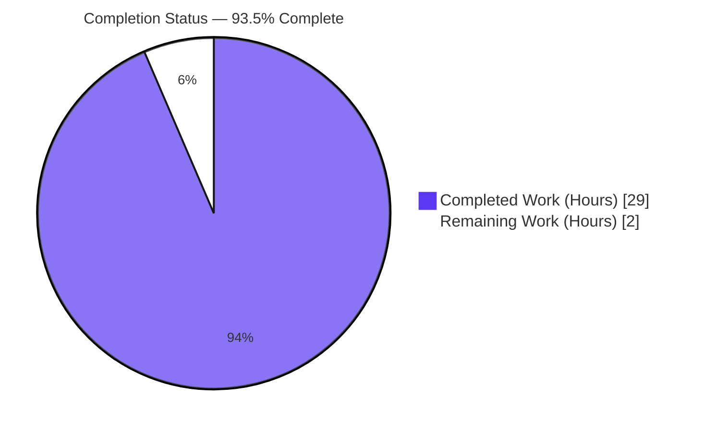
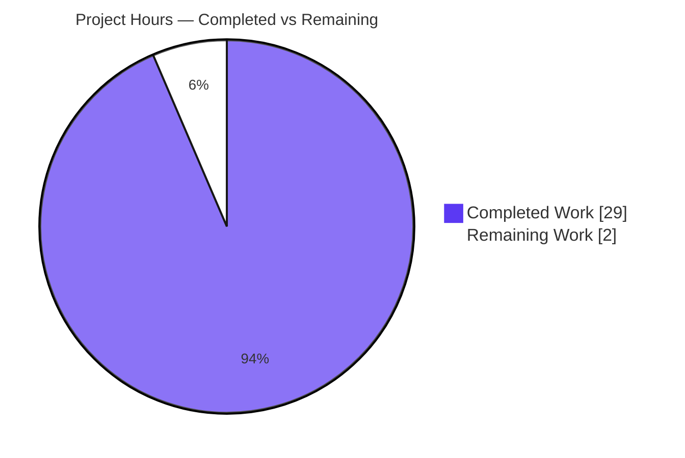
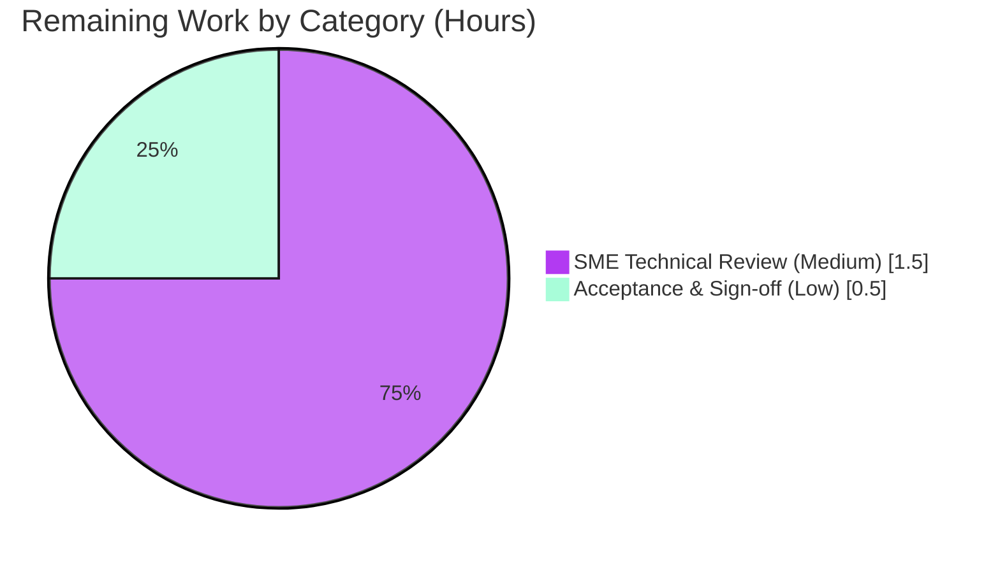

# Blitzy Project Guide

## kitty 0.35.2 — ZWJ Multi-Codepoint Emoji in a 1×1 Cell & State-Query Response (Read-Only QnA Investigation)

---

## 1. Executive Summary

### 1.1 Project Overview

This project delivers a single, evidence-backed Markdown answer document for a **read-only QnA investigation** into the kitty terminal emulator (`kovidgoyal/kitty`, commit `815df1e210e0`, **v0.35.2**). The audience is engineers seeking a practical, runtime-verified understanding of how kitty handles complex Unicode under extreme constraint. From **observed runtime behavior** — building kitty's C screen model and driving it through the **real VT parser** — the document explains how a ZWJ multi-codepoint emoji (`👨‍👩‍👧‍👦`) drawn into a **1×1 cell** is reduced to a single surviving codepoint, and what a Device-Status-Report state query then emits, byte-for-byte. The entire source tree is read-only reference; the sole artifact produced is the answer document.

### 1.2 Completion Status

The completion percentage is computed strictly from **AAP-scoped work plus path-to-production**, using the hours-based PA1 methodology: `Completion % = Completed Hours / (Completed + Remaining) × 100 = 29.0 / 31.0 = 93.5%`.



| Metric | Value |
|--------|-------|
| **Total Hours** | **31.0** |
| Completed Hours (AI + Manual) | 29.0 (AI: 29.0 · Manual: 0.0) |
| Remaining Hours | 2.0 |
| **Percent Complete** | **93.5%** |

> Legend — **Completed = Dark Blue `#5B39F3`**, **Remaining = White `#FFFFFF`**.

### 1.3 Key Accomplishments

- ✅ **Native extension built from source** in default configuration (`kitty/fast_data_types.so`, version **0.35.2**, build exit 0).
- ✅ **Real VT-parser entry path exercised** (`parse_bytes` → `kitty/vt-parser.c`), not the `screen.draw()` bypass — satisfying the "real entry point" mandate.
- ✅ **All four sub-questions (Q1–Q4) answered** with observed output, causal mechanism, and `file:line` citations.
- ✅ **1×1 headline result captured & byte-exact:** settled cell = `👦` (`U+1F466`); `ESC[6n` → `b'\x1b[1;2R'`.
- ✅ **20-column baseline contrast:** full 7-codepoint sequence round-trips, `cursor.x=8`, `ESC[6n` → `b'\x1b[1;9R'`.
- ✅ **Determinism confirmed** (3/3 identical runs) and **sibling conditions** covered (zero-width joiners, variation selectors, regional-indicator flag pair, wide-char + backspace).
- ✅ **57 `file:line` citations across 12 files** verified exact; **version context** established (predates grapheme-segmentation #8226/#8533).
- ✅ **Read-only mandate honored:** zero source edits, temporary `/tmp` probes removed, `git status` clean, build artifacts gitignored.
- ✅ **In-scope test suites green:** `screen` 36/36, `datatypes` 18/18, `parser` 16/16.

### 1.4 Critical Unresolved Issues

| Issue | Impact | Owner | ETA |
|-------|--------|-------|-----|
| _None._ All AAP-specified deliverables are complete and independently validated; the native extension builds, in-scope tests pass, and every documented claim reproduces byte-for-byte. | No blocking issues | — | — |

### 1.5 Access Issues

| System/Resource | Type of Access | Issue Description | Resolution Status | Owner |
|-----------------|----------------|-------------------|-------------------|-------|
| Repository (`kovidgoyal/kitty` working copy) | Read/Write | Full access; branch clean and committed | ✅ Resolved | Blitzy Agent |
| Native build toolchain (gcc, pkg-config, system libs) | Local | Present and functional; extension built | ✅ Resolved | Blitzy Agent |
| Font assets (e.g., Source Code Pro) | Offline install | Not installable offline (no network; `fc-list` empty) — affects only the **out-of-scope** `fonts` test | ⚠ Environmental (out of scope) | Human reviewer |
| Public internet (for version-context corroboration) | Web search | Corroboration completed during investigation (#8226/#8533 confirmed Apr-2025) | ✅ Resolved | Blitzy Agent |

No access issue affects the deliverable. The font limitation touches only an out-of-scope test and is noted for completeness.

### 1.6 Recommended Next Steps

1. **[Medium]** Perform a technical SME review of the answer document — read Q1–Q4, spot-check the CPR-clamp derivation and a sample of the 57 citations against source at commit `815df1e2` (1.5 h).
2. **[Low]** Stakeholder acceptance & merge sign-off for the single added file (0.5 h).
3. **[Low]** (Optional) Note the three out-of-scope environmental test failures in release notes as *not regressions* (test files byte-identical to base) — no code action required.

---

## 2. Project Hours Breakdown

### 2.1 Completed Work Detail

Every component traces to a specific AAP requirement (R#). Total matches Completed Hours in §1.2.

| Component | Hours | Description |
|-----------|-------|-------------|
| Canonical build & environment baseline (R1) | 2.0 | Built `fast_data_types.so` in default config; recorded exact command, version 0.35.2, toolchain, `.so` size, 129-line build transcript |
| Observation harness — real VT-parser entry (R2) | 2.0 | Wired `parse_bytes` → `vt-parser.c`, `Callbacks.wtcbuf` read-back, `create_screen`; deliberately avoided `screen.draw()` bypass |
| Q1 — the "keep" decision investigation (R3, R7) | 2.5 | Per-codepoint draw loop, `wcwidth_std`, autowrap/DECAWM overflow, combining-mark attach; before/during/after 1×1 progression capture |
| Q2 — final cell content (R4) | 1.0 | Settled cell = `U+1F466` via `str(screen.line(0))`; `CPUCell` capacity analysis |
| Q3 — state-query byte-exact response + CPR-clamp derivation (R5, R9) | 2.5 | `ESC[6n` → `b'\x1b[1;2R'`, `ESC[5n` → `b'\x1b[0n'`; clamp mechanism `screen.c:2188–2196` |
| Q4 — interaction synthesis (R6) | 1.5 | Composed classification + combining-merge + autowrap + cell capacity + cursor reporting |
| 20-column baseline contrast (R8) | 1.0 | Full 7-codepoint round-trip, `cursor.x=8`, `ESC[6n` → `b'\x1b[1;9R'`; cross-check vs `test_zwj` |
| Sibling-condition coverage (R10) | 3.0 | ZWJ `U+200B/200C/200D`, VS `U+FE0E/FE0F`, regional-indicator flag pair, wide-char + backspace, per-codepoint widths |
| Determinism verification (R11) | 0.5 | 3 identical runs + separate-process re-run; confirmed deterministic |
| Version-context research (R12) | 2.0 | Web search (#8226/#8533), changelog date, classic per-codepoint model established |
| Citation verification — 57 across 12 files (R13) | 2.5 | Every `file:line` verified exact and content-matched at commit `815df1e2` |
| Answer document authoring — 597 lines (R16) | 4.5 | Structured Markdown: verbatim Q, baseline, Q1–Q4, siblings, version context, coverage pass, integrity proof, appendices |
| Final validation pass (R14, R15) | 3.5 | Build exit 0 + 70 in-scope tests + 3× byte-exact probe reruns + 18-item coverage pass + all-citation checks |
| Repository integrity & cleanup (R17) | 0.5 | `/tmp` probes removed; `git status` clean; artifacts gitignored; zero source edits verified |
| **Total Completed** | **29.0** | **Matches §1.2 Completed Hours** |

### 2.2 Remaining Work Detail

Each category is genuine path-to-production for a QnA answer document (human review/acceptance). Total matches Remaining Hours in §1.2 and §7.

| Category | Hours | Priority |
|----------|-------|----------|
| Human SME technical review of the answer document (verify Q1–Q4, CPR derivation, sample citations, version framing) | 1.5 | Medium |
| Stakeholder acceptance & merge sign-off (approve & merge the single added file) | 0.5 | Low |
| **Total Remaining** | **2.0** | — |

### 2.3 Hours Reconciliation

| Check | Result |
|-------|--------|
| Section 2.1 Completed total | 29.0 h |
| Section 2.2 Remaining total | 2.0 h |
| **2.1 + 2.2 = Total Project Hours** | **29.0 + 2.0 = 31.0 h** ✅ (matches §1.2) |
| Remaining consistent across §1.2 ↔ §2.2 ↔ §7 | 2.0 h everywhere ✅ |
| Completion % = 29.0 / 31.0 × 100 | **93.5%** ✅ |

---

## 3. Test Results

All tests below originate from **Blitzy's autonomous validation logs** for this project (executed via `CI=true python3 test.py --module <name>`). These exercise the exact in-scope code paths (screen model, cell/data types, VT parser).

| Test Category | Framework | Total Tests | Passed | Failed | Coverage % | Notes |
|---------------|-----------|-------------|--------|--------|------------|-------|
| Unit — Screen model | `test.py` (Python `unittest` / `BaseTest`) | 36 | 36 | 0 | N/A¹ | Includes `test_zwj`, `test_variation_selectors`, `test_backspace_wide_characters`, `test_emoji_skin_tone_modifiers` |
| Unit — Data types | `test.py` (`unittest`) | 18 | 18 | 0 | N/A¹ | Cell/`CPUCell` storage model |
| Unit — VT parser | `test.py` (`unittest`) | 16 | 16 | 0 | N/A¹ | Real byte-ingestion routing (`dispatch_csi`, DSR) |
| **In-scope total** | — | **70** | **70** | **0** | **N/A¹** | **100% pass rate** |

¹ Coverage instrumentation is not part of kitty's native C/Python test suite; a percentage is therefore not reported. Confidence derives instead from **byte-exact runtime reproduction** (see §4) and 57 verified `file:line` citations.

**Out-of-scope failures (not counted; documented for transparency):** the full canonical suite (`setup.py test`) surfaces 3 failures — `file_transmission` ×2 (container filesystem does not preserve symlink mtime) and `fonts` ×1 (`Source Code Pro` not installable offline). Both test files are **byte-identical to the base commit** (confirmed via `git diff`), so these are **environmental and pre-existing, not regressions**. The deliverable makes zero claims about fonts or file-transfer; both subsystems are explicitly AAP-excluded.

---

## 4. Runtime Validation & UI Verification

The C screen model was driven through the **real VT parser** (`parse_bytes` → `kitty/vt-parser.c`), not the `screen.draw()` bypass. All results below were reproduced during this assessment.

**Build & environment**
- ✅ **Native build:** `CI=true python3 setup.py build --debug --ignore-compiler-warnings` → **exit 0**; `kitty/fast_data_types.so` produced.
- ✅ **Import & version:** `import kitty.fast_data_types` → `<class 'fast_data_types.Screen'> 0.35.2`.

**Primary 1×1 constrained case**
- ✅ **Settled cell content:** `str(screen.line(0))` = `'👦'` (`U+1F466`) — only the final base emoji survives.
- ✅ **Cursor after settle:** `(x=2, y=0)`.
- ✅ **CPR query:** `ESC[6n` → `b'\x1b[1;2R'` (hex `1b5b313b3252`) — the clamp (`x≥columns` on the last line → `x--`) yields column 2.
- ✅ **Device status:** `ESC[5n` → `b'\x1b[0n'` (hex `1b5b306e`, "terminal OK").

**20-column unconstrained baseline (contrast)**
- ✅ **Round-trip:** full sequence `'👨‍👩‍👧‍👦'` retained; `cursor.x=8` (four width-2 bases, three zero-width ZWJs).
- ✅ **CPR query:** `ESC[6n` → `b'\x1b[1;9R'` (hex `1b5b313b3952`) — no clamp fires.

**Determinism & siblings**
- ✅ **Determinism:** 1×1 result identical across **3/3** runs and a separate-process re-run: `('👦', x=2, y=0, b'\x1b[1;2R')`.
- ✅ **Zero-width joiners** `U+200B/200C/200D`: width 0; `X<zw>Y` on 5×5 leaves `cursor.x=2` (combining-merge).
- ✅ **Variation selectors** `U+FE0F` (widen) / `U+FE0E` (narrow): base width adjusts as expected; both retained.
- ✅ **Regional-indicator flag pair** `U+1F1EE U+1F1F3`: round-trips on 5×5; forced 1×1 → `ESC[6n` `b'\x1b[1;2R'`.
- ✅ **Wide char + backspace:** after emoji `cursor.x=2`; after `BS` `cursor.x=1`, cell text unchanged.

**UI Verification**
- ⚠ **Not applicable** — the deliverable is a Markdown document and the subject is a **headless C screen model** (no GPU/display, no user-facing UI). There is no front-end to verify; runtime verification is the byte-exact screen-buffer/parser evidence above.

---

## 5. Compliance & Quality Review

AAP deliverables and the governing **SWE-AtlasQnA-Repo** rule set are cross-mapped to their validation status. Fixes applied during autonomous validation are noted; none were required in this verification pass.

| Requirement / Rule | Benchmark | Status | Progress |
|--------------------|-----------|--------|----------|
| Single Markdown doc in `blitzy/documentation/` answering the question(s) | Exactly one CREATE: `kitty_815df1e210e0.md` | ✅ Pass | 100% |
| Investigate by **running** first, then write | Built extension + ran probes before authoring | ✅ Pass | 100% |
| Real entry path (no bypass) | `parse_bytes` → `vt-parser.c`; `screen.draw()` explicitly avoided | ✅ Pass | 100% |
| Default canonical config; report version & commands | v0.35.2; exact build command + transcript recorded | ✅ Pass | 100% |
| Exercise **every** condition (primary + siblings; before/during/after) | 1×1 + 20-col + siblings + before/during/after states | ✅ Pass | 100% |
| Byte-exact, unedited evidence + command | Raw `Callbacks` bytes quoted verbatim throughout | ✅ Pass | 100% |
| Answer **every** sub-question (Q1–Q4) with value + causal reason | Q1–Q4 each: observed value + mechanism + citation | ✅ Pass | 100% |
| Grounded `file:line` citations naming function/struct | 57 citations across 12 files, verified exact | ✅ Pass | 100% |
| Determinism (≥2 runs; report stability) | 3 identical runs + separate-process re-run | ✅ Pass | 100% |
| Coverage pass before finishing | 18-item coverage table present | ✅ Pass | 100% |
| Read-only mandate (no source edits; remove temp scripts; `git status` clean) | 0 edits; `/tmp` probes removed; clean tree | ✅ Pass | 100% |
| Version context (avoid mis-citation vs newer kitty) | Classic per-codepoint model established; #8226/#8533 flagged as post-0.35.2 | ✅ Pass | 100% |
| Zero-placeholder / production-ready deliverable | Complete document; no TODO/stub content | ✅ Pass | 100% |

**Quality summary:** the answer document is internally consistent (canonical reference environment vs verification-rerun environment clearly distinguished), exhaustive (18-item coverage), and byte-exact. No compliance gaps remain within AAP scope.

---

## 6. Risk Assessment

| Risk | Category | Severity | Probability | Mitigation | Status |
|------|----------|----------|-------------|------------|--------|
| Findings applied to a newer kitty (post-0.35.2 grapheme segmentation) → misinterpretation | Technical | Low | Medium | Explicit **Version context** section pins commit `815df1e2`/0.35.2 and flags #8226/#8533 as later work | ✅ Mitigated |
| Environment drift for reproduction (canonical Ubuntu 24.04/gcc 13.3.0/Py 3.12.3 vs rerun Ubuntu 25.10/gcc 15.2.0/Py 3.13.7; `.so` size differs) | Technical | Low | Low | Doc distinguishes both environments; runtime results reproduce **byte-for-byte** regardless | ✅ Mitigated |
| Build reproducibility depends on native toolchain + system libs; Go needed only for out-of-scope launcher link | Operational | Low | Low | Exact build command + `--ignore-compiler-warnings` rationale documented; Go-launcher non-zero exit does not affect observations | ✅ Documented |
| Out-of-scope environmental test failures (`file_transmission` ×2, `fonts` ×1) misread as regressions | Integration | Low | Low | Proven **byte-identical to base**; AAP-excluded; deliverable makes zero claims about them | ✅ Documented / Non-blocking |
| Security exposure | Security | None | — | Read-only documentation task; zero code introduced, zero new dependencies, no attack surface | ✅ N/A |
| External service / API / credential integration | Integration | None | — | No external integrations in task scope | ✅ N/A |

**Overall risk profile: LOW** — appropriate for a fully validated read-only documentation deliverable.

---

## 7. Visual Project Status

**Project Hours Breakdown** (Completed = `#5B39F3`, Remaining = `#FFFFFF`):



**Remaining Hours by Category** (from §2.2 — sums to 2.0 h):



> **Integrity check:** "Remaining Work" = **2.0 h** matches §1.2 Remaining Hours and the §2.2 total exactly. "Completed Work" = **29.0 h** matches §1.2 Completed Hours. Total = **31.0 h**.

---

## 8. Summary & Recommendations

**Achievements.** This read-only QnA investigation is **93.5% complete** (29.0 of 31.0 AAP-scoped hours). All four sub-questions are answered from **observed runtime behavior** with byte-exact evidence and grounded citations. On a **1×1 cell** the settled buffer retains only the final base emoji `👦` (`U+1F466`) — because each width-2 base autowraps and overwrites the single cell while ZWJ attaches as a zero-width combining mark and is discarded with its base — and `ESC[6n` returns `ESC[1;2R` via the CPR clamp. The **20-column baseline** confirms the classic per-codepoint model (full round-trip, `cursor.x=8`, `ESC[1;9R`). The sole deliverable was produced under a strict read-only mandate: **zero source edits**, temporary probes removed, `git status` clean.

**Remaining gaps.** No AAP implementation work is outstanding. The remaining **2.0 h** is entirely the human path-to-production gate: **SME technical review (1.5 h)** and **stakeholder acceptance & merge sign-off (0.5 h)**.

**Critical path to production.** SME review of Q1–Q4 and a citation spot-check → stakeholder acceptance → merge the single added file. There are no blockers: the extension builds (exit 0), in-scope tests pass (70/70), and every claim reproduces deterministically.

**Success metrics.**

| Metric | Target | Actual | Status |
|--------|--------|--------|--------|
| Sub-questions answered (Q1–Q4) | 4/4 | 4/4 | ✅ |
| In-scope tests passing | 100% | 70/70 (100%) | ✅ |
| `file:line` citations verified | All | 57/57 | ✅ |
| Byte-exact headline reproducibility | Deterministic | 3/3 identical | ✅ |
| Read-only mandate (source edits) | 0 | 0 | ✅ |
| Files created | 1 | 1 | ✅ |

**Production-readiness assessment.** The deliverable is **evidence-backed, byte-exact, internally consistent, and reproducible**, and the repository matches the read-only mandate exactly. Pending the human review gate, the branch is **ready to merge**. Per Blitzy honest-assessment principles, completion is capped below 100% (93.5%) because human review/acceptance has not yet occurred.

---

## 9. Development Guide

All commands below were executed successfully in the assessment environment and are copy-pasteable. Run from the repository root.

### 9.1 System Prerequisites

- **OS:** Linux (canonical reference: Ubuntu 24.04; verified rerun: Ubuntu 25.10).
- **Python:** ≥ 3.8 (`pyproject.toml:2` → `requires-python = ">=3.8"`); canonical 3.12.3, verified rerun 3.13.7.
- **C toolchain:** `gcc` (canonical 13.3.0; rerun 15.2.0), `pkg-config` (1.8.1).
- **System libraries (build):** `harfbuzz`, `fontconfig`, `libpng`, `lcms2`, `xkbcommon`, `wayland`, `x11-xcb`, `egl/gl mesa`, `openssl`, `zlib`, `xxhash`, `simde`.
- **Go:** optional — required **only** to link the launcher, which is **out of scope**; its absence does not affect the C screen model.

### 9.2 Environment Setup

```bash
# From the repository root; the native extension is imported via PYTHONPATH=.
cd /path/to/kitty
# (Optional) isolate dependencies:
# python3 -m venv .venv && source .venv/bin/activate
```

### 9.3 Build (Dependency Compilation)

```bash
CI=true python3 setup.py build --debug --ignore-compiler-warnings
```

- Produces `kitty/fast_data_types.so` (build exit 0).
- `--ignore-compiler-warnings` drops `-Werror`/`-pedantic-errors` (toggle at `setup.py:491`; flag at `setup.py:2003`; `build` action at `setup.py:1084`) so a **pre-existing, unrelated** GLFW Wayland `switch` warning does not abort the build. It is a legitimate build flag, not a repository modification.

### 9.4 Verification

```bash
# Confirm the extension imports and reports the expected version
PYTHONPATH=. python3 -c "import kitty.fast_data_types as f; from kitty.constants import str_version; print(f.Screen, str_version)"
# Expected: <class 'fast_data_types.Screen'> 0.35.2
```

```bash
# Run the in-scope test suites (non-interactive)
CI=true python3 test.py --module screen      # Expected: Ran 36 tests ... OK
CI=true python3 test.py --module datatypes   # Expected: Ran 18 tests ... OK
CI=true python3 test.py --module parser      # Expected: Ran 16 tests ... OK
```

### 9.5 Example Usage — Reproduce the Headline Result

Create a temporary probe **outside** the repository (keeps `git status` clean), then remove it:

```bash
cat > /tmp/kitty_probe.py << 'EOF'
from kitty.fast_data_types import Screen
from kitty_tests import Callbacks, parse_bytes
family = "\U0001F468\u200d\U0001F469\u200d\U0001F467\u200d\U0001F466"  # 👨‍👩‍👧‍👦
# 1x1 constrained cell
cb = Callbacks(); s = Screen(cb, 1, 1, 0, 10, 20, 0, cb)
parse_bytes(s, family.encode('utf-8'))
print("1x1 settled:", repr(str(s.line(0))), "cursor=(%d,%d)" % (s.cursor.x, s.cursor.y))
cb.clear(); parse_bytes(s, b'\x1b[6n')
print("1x1 ESC[6n ->", repr(cb.wtcbuf))
EOF
PYTHONPATH=. python3 /tmp/kitty_probe.py
rm -f /tmp/kitty_probe.py
```

Expected output:

```
1x1 settled: '👦' cursor=(2,0)
1x1 ESC[6n -> b'\x1b[1;2R'
```

### 9.6 Repository Integrity Checks

```bash
git status --porcelain                                    # (empty = clean)
git diff 815df1e210e0a9ab4622f5c7f2d6891d7dbeddf1..HEAD --name-status
# Expected: A  blitzy/documentation/kitty_815df1e210e0.md
git check-ignore kitty/fast_data_types.so build           # both paths => gitignored
```

### 9.7 Troubleshooting

| Symptom | Cause | Resolution |
|---------|-------|------------|
| Build aborts on a GLFW Wayland `switch` warning | `-Werror` promotes a pre-existing warning to an error | Add `--ignore-compiler-warnings` (as in §9.3) |
| `The go tool was not found on this system` | Go absent; only the launcher link needs it | Ignore — **out of scope**; the C screen model still builds and imports |
| `error: externally-managed-environment` on `pip install` | PEP 668 marker on system Python | Use a venv (§9.2) or `pip install --break-system-packages <pkg>` |
| `fonts` / `file_transmission` tests fail | No offline font (`Source Code Pro`); container symlink-mtime not preserved | **Out of scope & environmental** — test files are byte-identical to base; not regressions |
| `ModuleNotFoundError: kitty.fast_data_types` | Extension not built or `PYTHONPATH` unset | Run §9.3, then prefix commands with `PYTHONPATH=.` |

---

## 10. Appendices

### Appendix A — Command Reference

| Purpose | Command |
|---------|---------|
| Build native extension | `CI=true python3 setup.py build --debug --ignore-compiler-warnings` |
| Verify version | `PYTHONPATH=. python3 -c "import kitty.fast_data_types as f; from kitty.constants import str_version; print(f.Screen, str_version)"` |
| Run in-scope tests | `CI=true python3 test.py --module screen` (also `datatypes`, `parser`) |
| Full canonical suite | `CI=true python3 setup.py test` |
| Reproduce headline probe | `PYTHONPATH=. python3 /tmp/kitty_probe.py` (see §9.5) |
| Integrity: working tree | `git status --porcelain` |
| Integrity: changed files | `git diff 815df1e210e0a9ab4622f5c7f2d6891d7dbeddf1..HEAD --name-status` |
| Integrity: ignored artifacts | `git check-ignore kitty/fast_data_types.so build` |

### Appendix B — Port Reference

| Port | Service | Notes |
|------|---------|-------|
| _None_ | — | The investigation drives an **in-memory, headless** `Screen` object; no network ports, servers, or sockets are used. |

### Appendix C — Key File Locations

| Path | Role |
|------|------|
| `blitzy/documentation/kitty_815df1e210e0.md` | **The deliverable** — the answer document (only file created) |
| `kitty/screen.c` | Draw/wrap/`report_device_status`: `draw_text_loop` L763, `wcwidth_std` L814, autowrap L821, DECAWM L822, `draw_combining_char` L663, CPR `report_device_status` L2179 / clamp L2188–2196 |
| `kitty/vt-parser.c` | Real entry routing: `dispatch_csi` L1027, DSR dispatch L1172–1173 |
| `kitty/data-types.h` | Cell model: `CPUCell { char_type ch (L224); combining_type cc_idx[3] (L226); }` |
| `kitty/line.c` / `kitty/lineops.h` | `line_add_combining_char` L457 (decl L90) |
| `gen/wcwidth.py` | Classification generator: `is_combining_char` L409, `is_ignored_char` L416, `wcwidth_std` L509, `is_emoji_presentation_base` L516 |
| `kitty/unicode-data.{h,c}`, `kitty/wcwidth-std.h` | Generated classification/width tables |
| `kitty_tests/__init__.py` | Harness: `parse_bytes` L30, `Callbacks` L39, `create_screen` L237, `str(line())` L407 |
| `kitty_tests/screen.py` | Cross-check tests: `test_emoji_skin_tone_modifiers` L105, `test_zwj` L123, `test_backspace_wide_characters` L271, `test_variation_selectors` L592 |
| `setup.py` | Build: `build` action L1084, `--ignore-compiler-warnings` L2003, `werror` toggle L491 |
| `docs/changelog.rst` | Version context: L59 `0.35.2 [2024-06-22]` |

### Appendix D — Technology Versions

| Tool | Canonical Reference Env | Verification-Rerun Env (this assessment) |
|------|-------------------------|------------------------------------------|
| kitty (reported) | **0.35.2** | **0.35.2** (identical) |
| Operating system | Ubuntu 24.04 | Ubuntu 25.10 |
| Python | 3.12.3 | 3.13.7 |
| gcc | 13.3.0 | 15.2.0 |
| pkg-config | 1.8.1 | 1.8.1 |
| Go (launcher only, out of scope) | not present | 1.24.4 |
| git | — | 2.51.0 |
| `fast_data_types.so` size | 6,142,952 bytes | 6,285,000 bytes |

### Appendix E — Environment Variable Reference

| Variable | Value | Purpose |
|----------|-------|---------|
| `CI` | `true` | Forces non-interactive test/build behavior |
| `PYTHONPATH` | `.` | Makes the freshly built `kitty.fast_data_types` importable from the repo root |

### Appendix F — Developer Tools Guide

| Tool | Use |
|------|-----|
| `setup.py build` | Compiles the native extension (`fast_data_types.so`) — the only prerequisite for observing the C screen model |
| `test.py --module <name>` | Runs a single in-scope unit module non-interactively (`screen`, `datatypes`, `parser`) |
| `parse_bytes` + `Callbacks` (`kitty_tests`) | The canonical, real-entry observation harness (feeds bytes through `vt-parser.c`, reads replies from `Callbacks.wtcbuf`) |
| `git diff <base>..HEAD --name-status` | Confirms the read-only mandate (only the answer doc added) |

### Appendix G — Glossary

| Term | Definition |
|------|------------|
| **ZWJ** | Zero-Width Joiner (`U+200D`) — a zero-width combining codepoint used to join emoji into a single grapheme cluster |
| **CPR** | Cursor Position Report — the terminal's reply to `ESC[6n`, formatted `ESC[<row>;<col>R` (1-based) |
| **DSR** | Device Status Report — the `ESC[<n>n` query family; `ESC[5n` → status, `ESC[6n` → cursor position |
| **DECAWM** | Auto-Wrap Mode — when on (default), a glyph that does not fit wraps to the next line |
| **`wcwidth_std`** | kitty's per-codepoint width function (generated by `gen/wcwidth.py`); returns 0/1/2 |
| **`CPUCell`** | The classic cell struct storing one base codepoint + up to three combining marks (`kitty/data-types.h:224–226`) |
| **Grapheme segmentation** | Splitting text into user-perceived characters; kitty adopted full segmentation **after** 0.35.2 (#8226/#8533) — **not** in this commit |
| **Classic per-codepoint model** | The pre-0.35.2-successor behavior where each codepoint's width is computed individually with no grapheme clustering into one cell |

---

*End of Blitzy Project Guide. All figures are internally consistent: Completed 29.0 h + Remaining 2.0 h = Total 31.0 h; Completion 93.5%; Remaining (2.0 h) identical across §1.2, §2.2, and §7.*