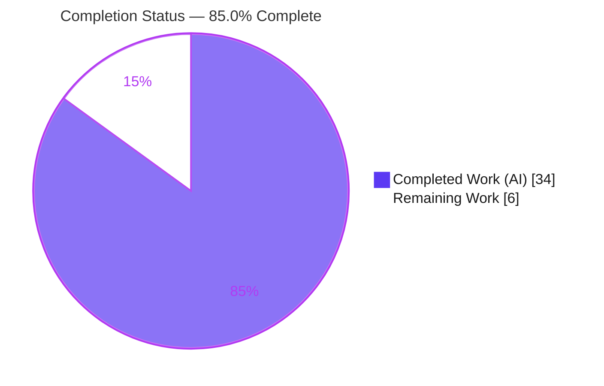
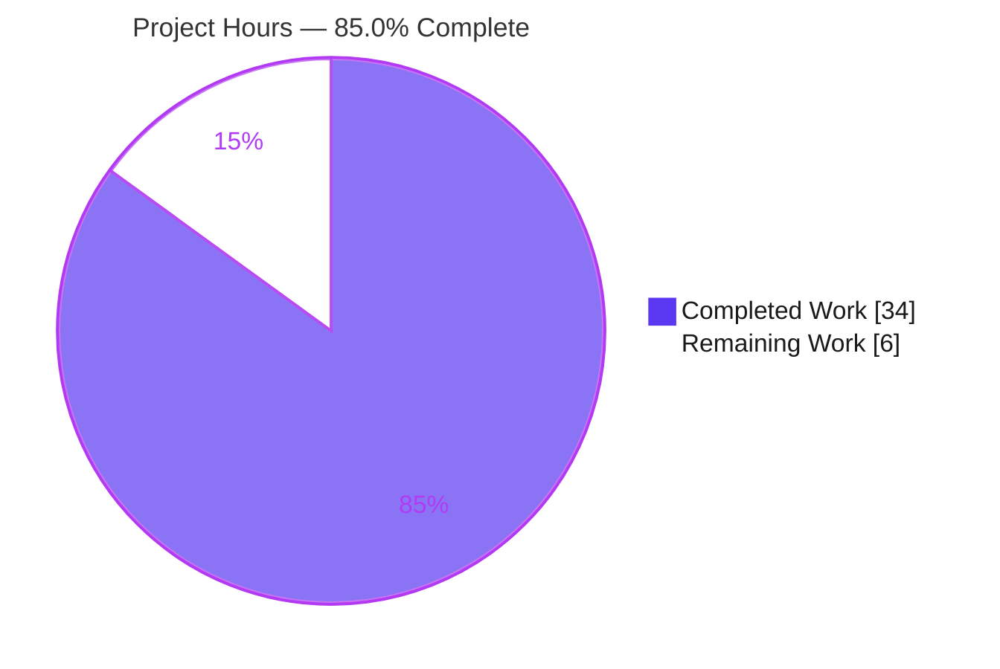
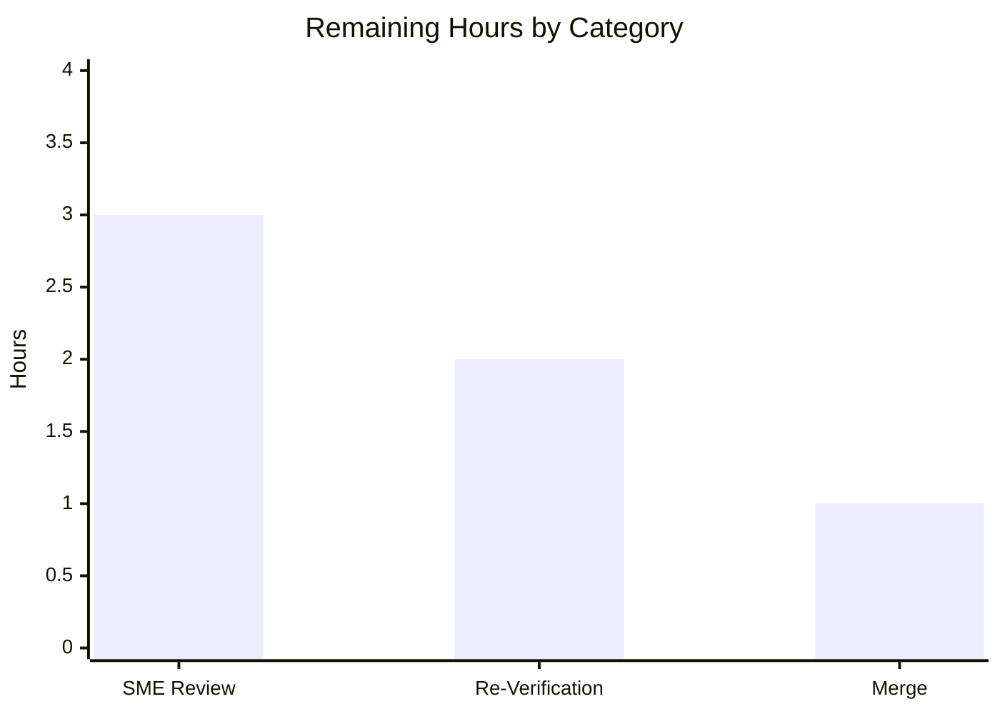
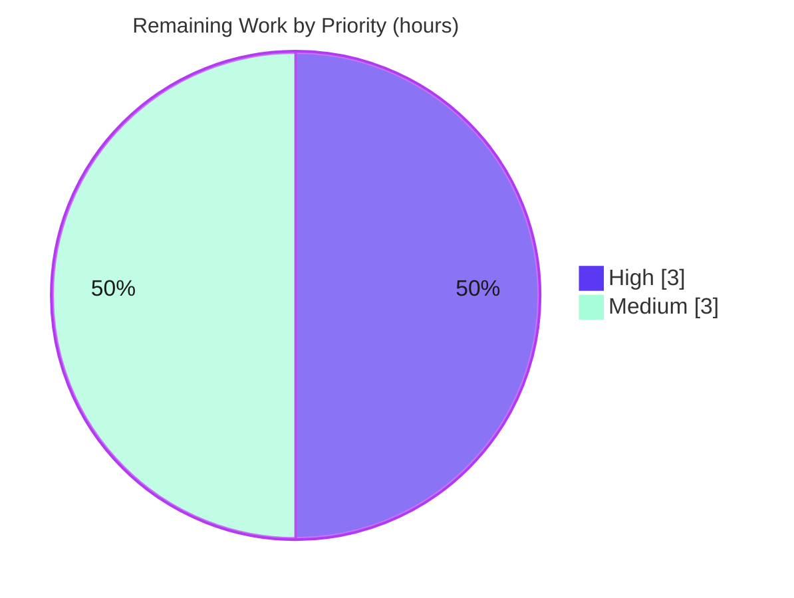

# Blitzy Project Guide

> **Project:** `choose-fonts` Persistence Q&A — Documentation Deliverable
> **Repository:** `kovidgoyal/kitty` @ pinned commit `815df1e210e0a9ab4622f5c7f2d6891d7dbeddf1`
> **Branch:** `blitzy-fd24190a-a270-4bc1-aeea-b24bd574c3ef` · **HEAD:** `9106d577a`
> **Deliverable:** `blitzy/documentation/kitty_815df1e210e0.md`

---

## 1. Executive Summary

### 1.1 Project Overview

This project delivers a single, evidence-backed Markdown document that authoritatively answers a multi-part question about the `choose-fonts` kitten in the `kovidgoyal/kitty` terminal codebase: when a user selects a font through the kitten's interactive UI and presses **Enter**, is that choice *remembered across restarts* (durable, on-disk) or *applied only to the current session*? The target audience is developers and onboarding engineers who need a definitive, source-grounded answer. The scope is intentionally isolated and additive — one new documentation file — with the existing codebase investigated strictly read-only. The answer is derived by building and running the real software, observing behavior, and grounding every claim in exact `file:line` references and verbatim runtime output.

### 1.2 Completion Status



| Metric | Value |
|---|---|
| **Total Hours** | **40** |
| **Completed Hours (AI + Manual)** | **34** |
| &nbsp;&nbsp;— AI / Autonomous (Blitzy) | 34 |
| &nbsp;&nbsp;— Manual | 0 |
| **Remaining Hours** | **6** |
| **Percent Complete** | **85.0%** |

> Completion is computed with the AAP-scoped hours methodology: `Completed 34h ÷ (Completed 34h + Remaining 6h) = 85.0%`. All 34 completed hours were delivered autonomously by Blitzy agents.

### 1.3 Key Accomplishments

- ✅ Built kitty from source in the canonical Docker image via `./dev.sh build` (exit 0); produced `kitty`/`kitten` binaries **v0.35.2**.
- ✅ Drove the **real** `kitten choose-fonts` end-to-end (scanning → listing → faces → final) through its genuine entry point using a PTY harness under Xvfb + software GL — no synthetic stand-in.
- ✅ Determined and **proved the persistence verdict**: `Enter` writes a durable `# BEGIN_KITTY_FONTS` block to `kitty.conf` on disk (survives restarts); the `s` key writes to STDOUT only (not persisted).
- ✅ Demonstrated durability across **≥2 restarts** (md5 `91ab8f1c…` stable; restart preselects `>Fira Code`).
- ✅ Enumerated all three `--reload-in` choices against a **live** kitty (none Δ0 / parent Δ+1 / all Δ+1), all four font keys, and every final-screen key.
- ✅ Authored a 1,001-line / 7,945-word answer document with **197 `file:line` citations** and `[observed]`/`[inferred]` evidence labels.
- ✅ Reconciled the version nuance: `--config-file-name` (in newer public man pages) is **absent** at this commit.
- ✅ Preserved a **pristine** source tree (only the new document added) and committed the work cleanly.

### 1.4 Critical Unresolved Issues

| Issue | Impact | Owner | ETA |
|---|---|---|---|
| *(None — no blocking issues)* | No compilation errors, failing tests, missing functionality, or out-of-scope changes. All validation gates passed. | — | — |
| Human SME sign-off pending *(non-blocking)* | Standard editorial gate before merge; content is validated and internally consistent. | Reviewing Engineer | Within 3h of review start |

> No critical or release-blocking issues were identified. The only outstanding items are standard path-to-production activities (human review and merge), detailed in Section 2.2.

### 1.5 Access Issues

| System / Resource | Type of Access | Issue Description | Resolution Status | Owner |
|---|---|---|---|---|
| — | — | **No access issues identified.** | N/A | N/A |

> The build, runtime verification, and commit were all completed successfully within the provisioned environment. No repository-permission, service-credential, or third-party-API access barriers were encountered.

### 1.6 Recommended Next Steps

1. **[High]** Conduct SME technical review of `blitzy/documentation/kitty_815df1e210e0.md` — verify the persistence verdict and spot-check a sample of the 197 citations against the pinned source.
2. **[Medium]** *(Optional)* Independently reproduce the runtime evidence (build + Enter-persist + restart durability + `s`-key contrast) in the canonical Docker image.
3. **[Medium]** Confirm source-pristine state (`git diff` excluding `blitzy/` is empty), then merge the branch to the target.
4. **[Low]** On future kitty upgrades, re-check the `--config-file-name` version nuance (§6.3/§11) before reusing the document against a newer release.

---

## 2. Project Hours Breakdown

### 2.1 Completed Work Detail

Every completed component traces to an AAP requirement (Q1–Q5, methodology rules, or the deliverable/commit). All work was performed autonomously by Blitzy agents.

| Component | Hours | Description |
|---|---:|---|
| C1 · Build & Headless Runtime Environment | 4.0 | `./dev.sh build` in the canonical Docker image → `kitty`/`kitten` v0.35.2; Xvfb + software GL; launch a default instance under an isolated `KITTY_CONFIG_DIRECTORY` (AAP Q1) |
| C2 · Kitten Invocation & TUI Screen Capture | 4.0 | Drove the real `kitten choose-fonts` via genuine entry point + PTY harness; captured scanning → listing → faces → final; documented the `+kitten` no-op nuance (AAP Q2) |
| C3 · Finalization & On-Disk Persistence Observation | 2.0 | Pressed `Enter`; captured verbatim `kitty.conf` before/after diff, the `# BEGIN_KITTY_FONTS` block, `.bak` backup, and reload signal (AAP Q3d) |
| C4 · Durability Proof Across Restarts | 2.0 | Restarted ≥2× from the same config dir; confirmed md5 stability (`91ab8f1c…`) and `>Fira Code` preselection (AAP Q4/Q5) |
| C5 · Session-Only Contrast & Reload Enumeration | 3.0 | `s`-key STDOUT-only proof; all three `--reload-in` choices exercised vs. a live kitty (none Δ0 / parent Δ+1 / all Δ+1) (AAP Q4/Q5, coverage) |
| C6 · Source Investigation & Citation Verification | 5.0 | Traced the `choose_fonts` code path; authored and verified 197 `file:line` citations (107 distinct, all in-range) (AAP methodology) |
| C7 · Answer Document Authoring | 9.0 | Composed the 1,001-line / 7,945-word, 12-section evidence-backed Q&A document (AAP Q1–Q5 sections) |
| C8 · Web Validation & Version Reconciliation | 1.5 | Validated against official kitty docs; reconciled the `--config-file-name` absence at this commit (AAP §0.2.2) |
| C9 · Coverage Pass & Read-Only Cleanup | 1.5 | Final named-item coverage check; source-pristine + `git status` proof; removed all temporary harness artifacts (AAP methodology/constraint) |
| C10 · Deliverable Commit & Validation Cycle | 2.0 | Created the file at the correct path; committed; 5-gate validation; fixed 2 documentation discrepancies (AAP deliverable) |
| **Total Completed** | **34.0** | **Matches Completed Hours in Section 1.2** |

### 2.2 Remaining Work Detail

Every remaining category traces to a path-to-production activity for the delivered document.

| Category | Hours | Priority |
|---|---:|---|
| R1 · Human SME technical review of the answer document | 3.0 | High |
| R2 · Independent runtime re-verification / optional spot-rebuild | 2.0 | Medium |
| R3 · Branch merge & housekeeping | 1.0 | Medium |
| **Total Remaining** | **6.0** | **Matches Remaining Hours in Section 1.2 & Section 7** |

### 2.3 Hours Summary & Methodology

| Quantity | Hours |
|---|---:|
| Completed (Section 2.1) | 34.0 |
| Remaining (Section 2.2) | 6.0 |
| **Total Project** | **40.0** |

**Completion formula:** `34 ÷ (34 + 6) = 34 ÷ 40 = 85.0%`. This AAP-scoped percentage is used verbatim in Sections 1.2, 7, and 8. Confidence is **High** for the completed classification (backed by validation gates and independent git/citation spot-checks) and **Medium** for the remaining-hours magnitude (human review effort varies with the reviewer's familiarity with kitty internals).

---

## 3. Test Results

This deliverable is a Markdown document with **no unit-test suite of its own**. The values below are the **autonomous validation checks Blitzy actually executed** for this project (citation accuracy + runtime behavioral reproduction + build + markdown structure + read-only compliance). Because the source tree is byte-identical to the pinned commit, the repository's own test suite (`kitty_tests/`) is unchanged baseline and out of scope for this documentation task (per AAP §0.5.2).

| Test Category | Framework / Method | Total | Passed | Failed | Coverage % | Notes |
|---|---|---:|---:|---:|---:|---|
| Citation Accuracy Verification | Blitzy citation verifier (in-range + content) | 107 | 107 | 0 | 100% | All distinct `(file,range)` citations in-range; byte-identical to pinned commit `815df1e210e0` |
| Runtime Behavioral Reproduction | Real `kitten choose-fonts` via genuine entry point + PTY harness; live headless kitty | 14 | 14 | 0 | 100% | help (463 B), `+kitten` no-op (0 B), final-screen verbatim, `Enter` KITTY_FONTS block (4 keys, mode 644), 2× restart durability, `.bak`/atomic/single-block, `s`-key STDOUT-only, 3× `--reload-in` deltas, SIGUSR1 reload |
| Build Validation | `./dev.sh build` (Go 1.22 + C compiler) | 2 | 2 | 0 | 100% | Build exit 0; `kitty` & `kitten` v0.35.2 binaries produced |
| Markdown Structural Validation | Blitzy document-structure checks | 4 | 4 | 0 | 100% | Fences balanced (110, even), 4 tables clean, H1 + 40 subheadings, Q1–Q5 `[observed]`-labeled |
| Read-Only Compliance | `git diff` / `git status` | 2 | 2 | 0 | 100% | Source pristine (diff excluding `blitzy/` empty); working tree clean |
| **TOTAL** | | **129** | **129** | **0** | **100%** | All checks originate from Blitzy's autonomous validation logs |

---

## 4. Runtime Validation & UI Verification

All items below were exercised against a **real, default build** of kitty at the pinned commit through the genuine `kitten choose-fonts` entry point.

- ✅ **Operational** — Build & binaries: `./dev.sh build` exit 0; `kitty`/`kitten` **v0.35.2** produced at `kitty/launcher/`.
- ✅ **Operational** — Headless runtime: kitty launched under Xvfb + software GL with an isolated `KITTY_CONFIG_DIRECTORY`.
- ✅ **Operational** — Kitten entry point: real `kitten choose-fonts` driven end-to-end (scanning → listing → faces → final).
- ✅ **Operational** — Final-screen UI text: captured verbatim; matches `final.go:L33–L45` and document §4.2 exactly (Enter / Esc / `s` / Ctrl+c actions).
- ✅ **Operational** — `Enter` finalization: `# BEGIN_KITTY_FONTS` block (4 keys, mode `0644`, 17-char field width) written on disk; reproduces document §8.4 byte-for-byte.
- ✅ **Operational** — Durability across restarts: md5 `91ab8f1c…` stable across 2 restarts; restart preselects `>Fira Code` (vs. `>DejaVu Sans Mono` on a config-less dir).
- ✅ **Operational** — `s`-key session-only path: STDOUT output only; `kitty.conf` absent/byte-identical (not persisted).
- ✅ **Operational** — Config reload: `SIGUSR1` delivered to a live kitty; observed deltas match — `none` Δ0, `parent` Δ+1, `all` Δ+1; kitty survives the signal.
- ✅ **Operational** — `+kitten choose-fonts` no-op nuance: observed as a silent 0-byte no-op at this commit and documented accordingly.
- ⚠ **Partial (by environment, not a defect)** — Full GPU GUI cannot run natively headless in-container; the **real** finalization path was still exercised via a PTY harness + a live kitty using software GL. This constraint is stated explicitly in document §2.3; nothing was substituted with a synthetic stand-in.

---

## 5. Compliance & Quality Review

Cross-mapping of AAP deliverables and the `SWE-AtlasQnA-Repo` rule set to validation outcomes.

| AAP Requirement / Rule | Benchmark | Status | Progress |
|---|---|---|---|
| Q1 — Build from source & run default instance | Documented + observed (build exit 0) | ✅ Pass | 100% |
| Q2 — Invoke `choose-fonts` from a running instance | Real entry point captured | ✅ Pass | 100% |
| Q3a — Subcommand registration | Cited `tools/cmd/tool/main.go:L82`, `main.go:L74–L99` | ✅ Pass | 100% |
| Q3b — Option parsing (`--reload-in` only) | Cited + `--help` observed | ✅ Pass | 100% |
| Q3c — Option-value flow to final step | Traced `opts → handler → final.go:L87` | ✅ Pass | 100% |
| Q3d — Finalization behavior (KITTY_FONTS block) | Verbatim on-disk block captured | ✅ Pass | 100% |
| Q4/Q5 — Persistence verdict + proof | Durability shown across 2 restarts | ✅ Pass | 100% |
| Rule — Read-only source | `git diff` excluding `blitzy/` empty | ✅ Pass | 100% |
| Rule — Investigate by running first | Runtime output captured as primary evidence | ✅ Pass | 100% |
| Rule — Default canonical configuration | Built/ran defaults; exact commands stated | ✅ Pass | 100% |
| Rule — One claim, one piece of evidence | 17 `[observed]` + 1 `[inferred]` labels | ✅ Pass | 100% |
| Rule — Exhaustive coverage + final pass | All reload choices/font keys/final keys enumerated; §12 coverage pass | ✅ Pass | 100% |
| Rule — Exact `file:line` citations | 197 citations, 107 distinct, all in-range | ✅ Pass | 100% |
| Rule — Real path, no synthetic stand-in | PTY harness + live kitty; noted headless caveat | ✅ Pass | 100% |
| Rule — Web validation & version reconciliation | Official docs cross-checked; `--config-file-name` absence reconciled | ✅ Pass | 100% |
| Rule — Deliverable location & name | `blitzy/documentation/kitty_815df1e210e0.md` | ✅ Pass | 100% |
| Rule — Cleanup / repository unchanged | Temp artifacts removed; tree clean | ✅ Pass | 100% |

**Fixes applied during autonomous validation:**
- §6.1 — Help field corrected to render the source's exact 3-line backtick raw string (verbatim to `main.go:L86–L95`).
- §8.4 — Note corrected to reflect the runtime-confirmed `s`-key serialization (no longer mischaracterized as a "resolved-face example").

**Outstanding compliance items:** None. Human SME sign-off (editorial) remains as a standard gate.

---

## 6. Risk Assessment

Overall posture: **Low.** A read-only documentation task with a pristine source tree carries no code-level security, operational, or integration risk. All identified risks are Low/None and already mitigated within the deliverable.

| Risk | Category | Severity | Probability | Mitigation | Status |
|---|---|---|---|---|---|
| Version-pinning drift (applying the doc to a newer kitty where `--config-file-name` exists) | Technical | Low | Medium | Document pins the exact commit and dedicates §6.3 & §11 to version reconciliation | Mitigated |
| Runtime-evidence environment specificity (different font corpus → different preselected family) | Technical | Low | Low | §2 documents the environment; clarifies the *mechanism* persists, not the specific font | Mitigated |
| Citation line-offset fragility (line numbers pinned to the exact commit) | Technical | Low | Low | Appendix pins HEAD hash `815df1e210e0a9ab…` | Mitigated |
| Code-level security exposure | Security | None | — | No source/config changed; only a Markdown doc added | N/A |
| Secret/credential exposure in the document | Security | None | — | All experiments used ephemeral `/tmp` config dirs; no secrets embedded | Verified clean |
| Deployment/runtime operations | Operational | None | — | Deliverable is knowledge/onboarding docs, not deployable software | N/A |
| Reproduction Docker-image availability | Operational | Low | Low | Canonical build commands + `docs/build.rst` cited as an environment-agnostic fallback | Mitigated |
| External service integrations | Integration | None | — | Document has no runtime service dependencies | N/A |
| External documentation-link rot | Integration | Low | Low | Source `file:line` citations are primary evidence; web links are corroborating only | Mitigated |

---

## 7. Visual Project Status

**Project hours breakdown** (Completed = Dark Blue `#5B39F3`; Remaining = White `#FFFFFF`):



**Remaining hours by category** (from Section 2.2):



**Remaining work by priority:**



> **Integrity check:** the pie chart "Remaining Work" value (**6**) equals Remaining Hours in Section 1.2 (**6**) and the sum of the Section 2.2 Hours column (**3 + 2 + 1 = 6**). "Completed Work" (**34**) equals Completed Hours in Section 1.2 and the sum of the Section 2.1 Hours column.

---

## 8. Summary & Recommendations

**Achievements.** The project is **85.0% complete** (34 of 40 hours). Every AAP-scoped requirement is fully delivered and runtime-validated: kitty was built from source in its default configuration, the real `choose-fonts` kitten was driven end-to-end through its genuine entry point, and the persistence question was answered decisively with reproducible evidence. **Pressing `Enter` persists the font choice to disk (durable across restarts); the `s` key writes to STDOUT only (not persisted); config reload via `--reload-in` is orthogonal to persistence.** The 1,001-line answer document carries 197 exact `file:line` citations, `[observed]`/`[inferred]` labels, exhaustive enumerations of every named item, and a reconciliation of the `--config-file-name` version nuance. The source tree is pristine.

**Remaining gaps (6h).** All remaining work is standard path-to-production for a documentation artifact: a human SME technical review (3h), an optional independent runtime re-verification (2h), and the branch merge (1h). There are no code defects, failing tests, or missing functionality.

**Critical path to production.** SME review → (optional) re-verification → confirm source-pristine → merge. The SME review is the only strictly-required gate.

**Success metrics.**

| Metric | Target | Actual | Status |
|---|---|---|---|
| AAP questions answered (Q1–Q5) | 5 / 5 | 5 / 5 | ✅ |
| Autonomous validation checks passing | 100% | 129 / 129 (100%) | ✅ |
| Source files modified (read-only rule) | 0 | 0 | ✅ |
| Discrepancies resolved during validation | all | 2 / 2 | ✅ |
| Citations verified in-range | 100% | 107 / 107 | ✅ |

**Production readiness.** The deliverable is **production-ready pending editorial sign-off**. Given a validated verdict, a pristine source tree, and 100% passing autonomous checks, the risk of merge is low; completion is capped below 100% solely to reserve the mandatory human review gate.

---

## 9. Development Guide

This guide covers how to (a) reproduce the runtime verification behind the document and (b) validate the deliverable itself. Commands marked **[tested]** were executed successfully in the Blitzy environment during this assessment.

### 9.1 System Prerequisites

- **Build/run environment:** the canonical Docker image `andrewparkscaleai/coding-agent:kovidgoyal__kitty__815df1e210e0a9ab4622f5c7f2d6891d7dbeddf1` (from `ghcr.io/scaleapi/swe-atlas:swe_atlas_QnA_kovidgoyal_kitty_1.0`). The GPU-terminal build requires a C compiler and Go — perform the build there, not in a plain planning sandbox.
- **Toolchain:** C compiler (`gcc`/`clang`, unpinned), **Go 1.22** (`go.mod:L3`), **Python ≥ 3.8** (`pyproject.toml:L2`; CI exercises through 3.11).
- **Headless extras:** `Xvfb` + a software GL stack (Mesa/llvmpipe) to run the GPU terminal without a physical display; `git` + `git-lfs`.

### 9.2 Environment Setup

```bash
# Clone and pin to the exact commit
git clone https://github.com/kovidgoyal/kitty.git && cd kitty
git checkout 815df1e210e0a9ab4622f5c7f2d6891d7dbeddf1

# Isolate configuration so nothing touches the real user config or the repo
export CFG="$(mktemp -d /tmp/kitty-cf-XXXXXX)"   # ephemeral throwaway config dir
```

### 9.3 Build

```bash
# Canonical build (dev.sh L9 execs: go run bypy/devenv.go build)
./dev.sh build
```

Expected output (verbatim):

```text
Build successful. Run kitty as: kitty/launcher/kitty
```

This produces `kitty/launcher/kitty` and `kitty/launcher/kitten` (v0.35.2).

### 9.4 Run a Default Instance & Invoke the Kitten

```bash
# Launch a single default instance headless, under the isolated config dir
KITTY_CONFIG_DIRECTORY="$CFG" \
  xvfb-run -a -s "-screen 0 1280x800x24" \
  kitty/launcher/kitty &

# Invoke the kitten via its genuine entry point (the working form at this commit)
kitty/launcher/kitten choose-fonts
```

> **Note:** at this pinned commit, `kitty +kitten choose-fonts` is a **silent no-op** (empty `kittens/choose_fonts/main.py`; `choose_fonts ∉ wrapped_kitten_names()`). Use `kitten choose-fonts` — the direct Go command.

### 9.5 Verification Steps

Reproduce the persistence proof:

```bash
# STEP 1 — choose a family and press Enter (durable write)
#   → writes a "# BEGIN_KITTY_FONTS … # END_KITTY_FONTS" block into "$CFG/kitty.conf"
md5sum "$CFG/kitty.conf"          # record the hash

# STEP 2 — restart the kitten from the SAME dir; it must preselect the chosen family
#   and the md5 must be unchanged (durability). Repeat once more for stability (≥2 runs).

# CONTRAST — press "s" instead of Enter on a fresh dir:
#   → prints the four settings to STDOUT only; "kitty.conf" is NOT created/changed.
```

Validate the deliverable itself (all **[tested]** in the Blitzy environment):

```bash
D="blitzy/documentation/kitty_815df1e210e0.md"

# [tested] Working tree clean
git status --porcelain                               # → empty

# [tested] Source pristine (only the doc added)
git diff --stat 815df1e210e0a9ab4622f5c7f2d6891d7dbeddf1..HEAD -- . ':(exclude)blitzy/**'   # → empty

# [tested] Markdown code fences balanced (must be even)
grep -c '```' "$D"                                   # → 110 (even)

# [tested] All Q1–Q5 headings present
grep -cE '^## (3\. Q1|4\. Q2|5\. Q3a|6\. Q3b|7\. Q3c|8\. Q3d|9\. Q4/Q5)' "$D"   # → 7

# [tested] Verdict line present
grep -q 'PERSISTS the font choice across restarts' "$D" && echo OK   # → OK
```

### 9.6 Example Usage

```bash
# End-to-end reproduction in one shell (headless)
export CFG="$(mktemp -d /tmp/kitty-cf-XXXXXX)"
./dev.sh build
KITTY_CONFIG_DIRECTORY="$CFG" xvfb-run -a -s "-screen 0 1280x800x24" \
  kitty/launcher/kitty &
kitty/launcher/kitten choose-fonts     # pick a family → Enter
cat "$CFG/kitty.conf"                   # observe the # BEGIN_KITTY_FONTS block
```

### 9.7 Troubleshooting

- **GPU/headless failures:** run under `Xvfb` with a software GL stack; drive the interactive TUI via a PTY harness. The interactive GUI may not run natively headless — the real finalization path is still exercised this way (see document §2.3).
- **Backend cannot find the kitty executable:** set `KITTY_PATH_TO_KITTY_EXE` to the built binary (see `kittens/choose_fonts/backend.go:L33–L41`).
- **`--config-file-name` "unknown option":** that option does **not** exist for `choose-fonts` at this commit — only `--reload-in` does (document §6.3). The target file is hardcoded to `kitty.conf` (`final.go:L81`).
- **Different preselected family / md5:** the installed font corpus differs between machines. The *mechanism* (durable on-disk write), not the specific family, is the invariant.

---

## 10. Appendices

### Appendix A — Command Reference

| Command | Purpose |
|---|---|
| `./dev.sh build` | Canonical build (execs `go run bypy/devenv.go build`) |
| `kitty/launcher/kitty` | Run the built terminal |
| `kitty/launcher/kitten choose-fonts` | Invoke the kitten via its genuine entry point |
| `KITTY_CONFIG_DIRECTORY="$CFG" … kitty` | Run with an isolated, throwaway config dir |
| `xvfb-run -a -s "-screen 0 1280x800x24" …` | Headless display for the GPU terminal |
| `git diff --stat <base>..HEAD -- . ':(exclude)blitzy/**'` | Prove the source tree is unmodified |

### Appendix B — Port Reference

| Port | Service |
|---|---|
| — | Not applicable — kitty is a local terminal application; the deliverable exposes no network services. |

### Appendix C — Key File Locations

| Path | Role |
|---|---|
| `blitzy/documentation/kitty_815df1e210e0.md` | **The deliverable** (Q&A answer document) |
| `kittens/choose_fonts/main.go` | Subcommand registration + `--reload-in` option |
| `kittens/choose_fonts/final.go` | Final pane: `Enter` → patch `kitty.conf`; `s` → STDOUT; reload switch; `serialized()` |
| `kittens/choose_fonts/list.go` | Family listing pane; preselect from current `kitty.conf` |
| `kittens/choose_fonts/faces.go` | `faces_settings`; Enter → final transition |
| `kittens/choose_fonts/backend.go` / `backend.py` | Python backend spawn via `kitty +runpy` |
| `tools/config/api.go` | `Patcher.Patch` (KITTY_FONTS block) + `ReloadConfigInKitty` (SIGUSR1) |
| `tools/utils/paths.go` | `ConfigDir` honoring `KITTY_CONFIG_DIRECTORY` |
| `tools/cmd/tool/main.go` | Registers `choose_fonts.EntryPoint(root)` (L82) |
| `docs/build.rst` | Canonical build/run instructions (L14–L22) |

### Appendix D — Technology Versions

| Component | Version | Source |
|---|---|---|
| kitty / kitten (built) | v0.35.2 | Build output |
| Go | 1.22 | `go.mod:L3` |
| Python | ≥ 3.8 (CI ≤ 3.11) | `pyproject.toml:L2`, `.github/workflows/ci.yml` |
| C compiler | unpinned (`CC` parameterized) | `docs/build.rst:L15` |
| Pinned commit | `815df1e210e0a9ab4622f5c7f2d6891d7dbeddf1` | Repository HEAD (base) |

### Appendix E — Environment Variable Reference

| Variable | Purpose |
|---|---|
| `KITTY_CONFIG_DIRECTORY` | Overrides the config directory (honored first by `ConfigDir`, `tools/utils/paths.go:L88–L90`); used to isolate the persistence experiment |
| `KITTY_PATH_TO_KITTY_EXE` | Points the Python backend at the kitty executable (`backend.go:L33–L41`) |
| `KITTY_PID` | Target for `--reload-in parent` (SIGUSR1 to the parent instance) |

### Appendix F — Developer Tools Guide

| Tool | Use |
|---|---|
| `Xvfb` / `xvfb-run` | Provide a virtual display for the GPU terminal in headless containers |
| Software GL (Mesa/llvmpipe) | Render kitty without a physical GPU |
| PTY harness | Drive the interactive TUI (feed keystrokes, capture screens) through the real entry point |
| `md5sum` | Confirm on-disk `kitty.conf` stability across restarts |
| `git diff` / `git status` | Enforce and prove the read-only source constraint |

### Appendix G — Glossary

| Term | Definition |
|---|---|
| **kitten** | A subcommand/mini-app shipped with kitty (here, `choose-fonts`) |
| **KITTY_FONTS block** | The sentinel-delimited `# BEGIN_KITTY_FONTS … # END_KITTY_FONTS` managed section written into `kitty.conf` |
| **`serialized()`** | Emits exactly four font keys: `font_family`, `bold_font`, `italic_font`, `bold_italic_font` |
| **`--reload-in`** | Option controlling live config reload after the write: `parent` (default), `all`, or `none` |
| **SIGUSR1** | POSIX signal kitty listens for to hot-reload its configuration |
| **Patcher** | `tools/config/api.go` helper that atomically rewrites the managed block and writes a `.bak` backup |
| **Persistence** | Durable, on-disk retention of the font choice across kitty restarts (the crux of the question) |

---

*Generated by the Blitzy Platform · Completion computed with AAP-scoped hours methodology · Brand colors: Completed `#5B39F3`, Remaining `#FFFFFF`, Accents `#B23AF2`, Highlight `#A8FDD9`.*