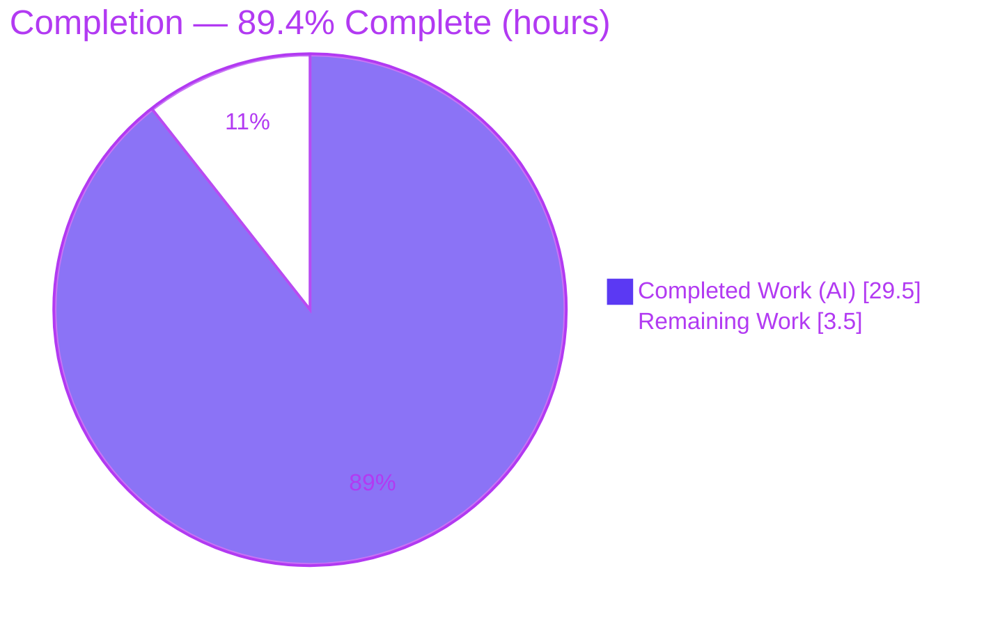
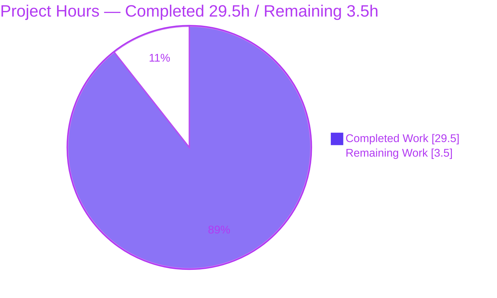
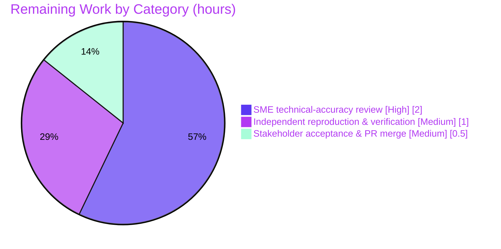

# Blitzy Project Guide

> **Project:** kitty keyboard-protocol flag-stack investigation across main / alternate screen buffers
> **Branch:** `blitzy-12cf64e2-311b-4082-b625-27ac1f455e33` &nbsp;•&nbsp; **Base:** `815df1e21` &nbsp;•&nbsp; **HEAD:** `e906382e9`
> **Task type:** SWE-AtlasQnA — read-only investigative documentation

---

## 1. Executive Summary

### 1.1 Project Overview

This project delivers a single, evidence-backed investigative document that explains — and proves with byte-exact captured runtime output — how kitty's keyboard-protocol progressive-enhancement flag stack behaves when the terminal switches between the main and alternate screen buffers. The audience is terminal-emulator engineers and protocol implementers. The technical scope is strictly read-only: the kitty native C extension (`fast_data_types.so`) is built and driven through its real input path (CSI bytes → VT parser → live `Screen` → key encoder), and the observations answer five objectives (round-trip survival, stack exhaustion, controlled byte capture, cross-buffer independence, and isolation-breakdown conditions). The only artifact added to the repository is one markdown answer document; no product code is changed.

### 1.2 Completion Status



| Metric | Hours |
|--------|-------|
| **Total Hours** | **33.0** |
| **Completed Hours (AI + Manual)** | **29.5** (AI 29.5 + Manual 0.0) |
| **Remaining Hours** | **3.5** |
| **Percent Complete** | **89.4%** |

> Completion is computed with the AAP-scoped hours methodology: `29.5 / (29.5 + 3.5) = 89.4%`. All AAP-specified deliverables are complete and validated; the remaining 3.5 hours are the path-to-production human review/acceptance of the documentation artifact (there is no deploy/CI/runtime component for a markdown deliverable).

### 1.3 Key Accomplishments

- ✅ **All five investigation objectives answered** (OBJ-1…OBJ-5), each led by a direct answer and backed by complete, unedited byte captures.
- ✅ **Real input path exercised headlessly** — raw CSI bytes → `kitty_tests.parse_bytes` → live `Screen` → `encode_key_for_tty`; no mock, remote-control, or debug bypass.
- ✅ **Byte-for-byte reproducibility proven** — the embedded self-checking probe reproduces SHA-256 `d8e2bf22…c4a610` run-to-run (independently re-confirmed this session).
- ✅ **Exact capacity established from code** — 8 entries per buffer with FIFO oldest-eviction, cited to `kitty/screen.h:128` and `kitty/screen.c:1234-1241`.
- ✅ **Cross-buffer independence demonstrated** in both directions plus multi-level round-trip restoration and zero rapid-switch leakage.
- ✅ **55 file:line citations** grounding every claim; 30+ verified exact with zero discrepancies.
- ✅ **Read-only mandate intact** — `git diff` since base shows exactly one added file (`blitzy/documentation/kitty_815df1e210e0.md`, 1045 lines); temp scripts removed; working tree clean.
- ✅ **Canonical tests green** — project runner `keys` 3/3 and `screen` 36/36 pass (re-run this session, exit 0).

### 1.4 Critical Unresolved Issues

| Issue | Impact | Owner | ETA |
|-------|--------|-------|-----|
| _None._ All validation gates passed; build exits 0; all tests pass; probe reproduces the documented SHA; zero citation discrepancies. | No release-blocking items | — | — |

### 1.5 Access Issues

| System/Resource | Type of Access | Issue Description | Resolution Status | Owner |
|-----------------|----------------|-------------------|-------------------|-------|
| _None_ | — | No access issues identified. The task is fully self-contained: build and observation run headless/offline with no external services, credentials, or network dependencies. | N/A | — |

**No access issues identified.**

### 1.6 Recommended Next Steps

1. **[High]** Perform SME technical-accuracy review of the 1045-line investigation — confirm the OBJ-1…OBJ-5 direct answers and spot-check the file:line citations against source.
2. **[Medium]** Independently reproduce the evidence — build the extension (or reuse the warm `.so`), run the embedded probe, and confirm EXIT 0, 46/46 assertions, and SHA-256 `d8e2bf22…c4a610`.
3. **[Medium]** Obtain stakeholder acceptance and merge the single-file documentation PR.

---

## 2. Project Hours Breakdown

### 2.1 Completed Work Detail

| Component | Hours | Description |
|-----------|-------|-------------|
| Environment build & native-extension toolchain (R1) | 2.5 | Built `kitty/fast_data_types.so` from source (default config) with the documented `--ignore-compiler-warnings` workaround; verified headless import. |
| OBJ-1 round-trip investigation (R2) | 2.0 | Drove main→alt→main via DEC 1049 through the real parser; captured `flags` at each stage (0→1→0→8→1). |
| OBJ-2 stack-exhaustion investigation (R3) | 2.5 | Established capacity 8, FIFO oldest-eviction, cross-buffer isolation in both directions, and multi-level round-trip restoration. |
| OBJ-3 controlled byte-capture test (R4) | 2.5 | Encoded `Ctrl+Shift+a` across flag states/buffers; verified modifier arithmetic (`;6`) and alternate-key sub-fields (`97:65`, `97::98`, `97:65:98`). |
| OBJ-4 independence proof (R5) | 1.5 | Four rapid main↔alt cycles proving zero leakage (main=1 / alt=8 every cycle). |
| OBJ-5 isolation-breakdown, 5 sub-conditions (R6) | 3.5 | DEC 1049 vs 47/1047; empty/over-pop reset; flag-dependent encoding; query response; RIS clears both stacks. |
| Self-checking probe harness + 2-run stability (R10) | 3.0 | ~486-line probe with 45 scenario asserts + SHA-256 stability assert and a fail-closed provenance guard. |
| Reference reading + 55 file:line citation verification (R7) | 2.5 | Read 10 source/test/spec files; verified 30+ citations exact, zero discrepancies. |
| Protocol research + flag-bit semantics (§2) (R8) | 1.5 | Grounded the protocol's flag bits, escape-code vocabulary, stack limit, and eviction against captured bytes. |
| Exhaustive condition coverage: bits/event-types/set-modes (R11) | 2.0 | All 5 flag bits; press/repeat/release; set modes replace/OR/AND-NOT; omitted-parameter defaults. |
| Document authoring & structure, 1045 lines (R9) | 5.0 | Direct-answers table + eight sections; cause→effect narrative; byte-capture blocks; methodology with exact commands. |
| Read-only discipline, cleanup & git verification (R12) | 1.0 | Kept temp scripts in `/tmp` and removed them; confirmed working tree clean; 3 commits by `agent@blitzy.com`. |
| **Total Completed** | **29.5** | |

### 2.2 Remaining Work Detail

| Category | Hours | Priority |
|----------|-------|----------|
| SME technical-accuracy review of investigation & citations | 2.0 | High |
| Independent reproduction & environment verification (build + probe + SHA match) | 1.0 | Medium |
| Stakeholder acceptance & documentation PR merge | 0.5 | Medium |
| **Total Remaining** | **3.5** | |

### 2.3 Hours Reconciliation

| Check | Result |
|-------|--------|
| Section 2.1 total (Completed) | 29.5 h |
| Section 2.2 total (Remaining) | 3.5 h |
| 2.1 + 2.2 = Total Project Hours (§1.2) | 29.5 + 3.5 = **33.0 h** ✓ |
| Completion % = 29.5 / 33.0 | **89.4%** ✓ |
| §1.2 Remaining = §2.2 Remaining = §7 pie "Remaining Work" | 3.5 h ✓ |

---

## 3. Test Results

All tests below originate from Blitzy's autonomous validation logs for this project; the `keys`/`screen` canonical runs and the embedded probe were additionally re-executed this session to confirm.

| Test Category | Framework | Total Tests | Passed | Failed | Coverage % | Notes |
|---------------|-----------|-------------|--------|--------|-----------|-------|
| Embedded self-checking probe | Python `assert` + `hashlib` SHA-256 | 46 | 46 | 0 | 100% of OBJ scenarios | 45 scenario asserts + 1 run-to-run SHA stability assert; EXIT 0, empty stderr; SHA `d8e2bf22…c4a610` reproduced this session. |
| Independent verification harness | Python (custom, from-scratch) | 18 | 18 | 0 | Key behaviors | Cross-checks OBJ-1 survival, OBJ-2 cap=8 + FIFO + isolation (both directions), OBJ-4 no-leak, OBJ-5 reset/query/RIS/flag-encoding. |
| Unit — keys module | `unittest` (`kitty +launch test.py --module keys`) | 3 | 3 | 0 | Encoder path | `test_encode_key_event`, `test_encode_mouse_event`, `test_mapping`; re-run this session → OK, exit 0. |
| Unit — screen module | `unittest` (`kitty +launch test.py --module screen`) | 36 | 36 | 0 | Screen / alt-buffer | Full screen model incl. alternate-buffer behavior; re-run this session → OK, exit 0. |
| **Totals** | | **103** | **103** | **0** | — | 100% pass rate across all suites. |

---

## 4. Runtime Validation & UI Verification

**Runtime health (real input path, headless):**

- ✅ **Native extension loads and runs** — `from kitty.fast_data_types import Screen, encode_key_for_tty` succeeds; `fast_data_types.so` (6.2 MB) links `libpython3.13.so.1.0`.
- ✅ **Canonical entry point operational** — raw CSI bytes → `kitty_tests.parse_bytes` → live `Screen` → `encode_key_for_tty`; no mock/remote-control/debug bypass.
- ✅ **Child-byte capture operational** — query responses captured via `Callbacks.write → wtcbuf` (e.g. `CSI ? u` → `b'\x1b[?5u'`).
- ✅ **State transitions verified** — buffer toggle (DEC 1049/47/1047), push/pop/set, over-pop reset, and RIS all exercised through the parser with before/during/after readings.
- ✅ **Run-to-run stability** — two in-process runs SHA-256-identical; digest also reproduces across separate process launches.

**UI verification:** ⚠ **Not applicable.** This is a headless terminal-core investigation with **no GUI or web surface** to verify. There is no window, GPU, or browser component in scope; "UI" is limited to the byte streams a terminal sends to its child, all of which are captured and validated above.

**API integration outcomes:** ✅ **None required / none present.** The investigation runs fully offline with no external service, credential, or network dependency.

---

## 5. Compliance & Quality Review

Cross-map of AAP deliverables and rules to their validation status. Fixes applied during autonomous validation are captured in commits `4be8d3aaf` (code-review findings) and `e906382e9` (QA final-acceptance findings).

| # | AAP Deliverable / Rule | Benchmark | Status | Progress |
|---|------------------------|-----------|--------|----------|
| OBJ-1 | Round-trip state survival | Answered + observed bytes | ✅ Pass | 100% |
| OBJ-2 | Stack exhaustion (limit, eviction, isolation) | Answered + observed bytes | ✅ Pass | 100% |
| OBJ-3 | Controlled test with real byte capture | Answered + observed bytes | ✅ Pass | 100% |
| OBJ-4 | Proof of independence (rapid-switch) | Answered + observed bytes | ✅ Pass | 100% |
| OBJ-5 | Isolation-breakdown conditions (a–e) | Answered + observed bytes | ✅ Pass | 100% |
| Rule 1 | Run-first; observed-over-inferred; stability | Build+run first; 2-run SHA | ✅ Pass | 100% |
| Rule 2 | Exhaustive condition/evidence coverage | All bits/variants/states; unedited output | ✅ Pass | 100% |
| Rule 3 | Faithful instruction-following; exact entry point | Real CSI→parser→Screen path | ✅ Pass | 100% |
| Rule 4 | Complete, precise, grounded answering | file:line + observed output per claim | ✅ Pass | 100% |
| MainRule | Deliverable location/name; read-only | One file `blitzy/documentation/kitty_815df1e210e0.md`; no source changed | ✅ Pass | 100% |
| §0.8.1 | Build in default config; commands stated | Command recorded verbatim in methodology | ✅ Pass | 100% |
| §0.8.1 | Cleanup discipline | Temp scripts in `/tmp` removed; tree clean | ✅ Pass | 100% |

**Fixes applied during autonomous validation (examples):** clarifying that capacity **8** is a *code fact* (`screen.h:128`) rather than a documented number; scoping the OBJ-3 byte-invariance claim to the *primary-key* encoding; hardening the probe's provenance guard to fail closed on `KITTY_REPO`.

**Outstanding compliance items:** none.

---

## 6. Risk Assessment

| Risk | Category | Severity | Probability | Mitigation | Status |
|------|----------|----------|-------------|------------|--------|
| Interpreter version drift — bytes observed on Python 3.13.7 (AAP originally 3.12.3) | Technical | Low | Low | Methodology pins the interpreter; `requires-python >=3.8` satisfied; probe fails closed on provenance | Mitigated |
| Fresh build needs `--ignore-compiler-warnings` to bypass an unrelated GLFW Wayland `-Werror=switch` at `glfw/wl_window.c:668` | Technical | Low | Medium | Documented verbatim in methodology and the development guide; terminal core compiles clean | Documented |
| Capacity "8" is tied to the array size at `screen.h:128` and could drift if upstream changes it | Technical | Low | Low | Document attributes 8 to code (not spec) and pins base commit `815df1e21` | Mitigated |
| No product code, dependencies, or network surface introduced; embedded probe uses `git` in list form (injection-safe) and fails closed on `KITTY_REPO` | Security | None | — | Read-only, doc-only change; no runtime footprint | No risk introduced |
| No service/deploy/monitoring footprint (static markdown artifact) | Operational | None | — | N/A | N/A |
| No external integrations, credentials, or network config; runs headless/offline | Integration | None | — | N/A | N/A |
| Reproduction requires native build toolchain (C compiler, Go, pkg-config, `-dev` libs) | Integration | Low | Low | Development guide lists prerequisites; warm `fast_data_types.so` is reusable without rebuild | Mitigated |

**Overall posture:** minimal. A read-only, zero-runtime-footprint documentation deliverable with no High/Critical risks; residual items are Low-severity reproduction-environment concerns, each documented or mitigated.

---

## 7. Visual Project Status

**Project hours breakdown** (Completed = Dark Blue `#5B39F3`, Remaining = White `#FFFFFF`):



**Remaining hours by category** (from Section 2.2, total 3.5 h):



> **Integrity:** the pie chart "Remaining Work" (3.5 h) equals the Section 1.2 Remaining Hours and the Section 2.2 "Hours" column total.

---

## 8. Summary & Recommendations

**Achievements.** The project is **89.4% complete** (29.5 of 33.0 hours). Every AAP-specified deliverable is finished and validated: all five objectives are answered with byte-exact observed output, the exact stack capacity (8) and FIFO eviction policy are established from source, cross-buffer independence is proven in both directions, and the entire investigation is captured in a single 1045-line document with 55 file:line citations. The embedded self-checking probe reproduces the documented SHA-256 (`d8e2bf22…c4a610`) byte-for-byte, which was independently re-confirmed this session.

**Remaining gaps.** The remaining **3.5 hours** are entirely path-to-production human activities — there is no code, configuration, integration, or deployment work outstanding because the deliverable is a static, read-only markdown artifact. The gaps are: SME technical review (2.0 h), independent reproduction (1.0 h), and stakeholder acceptance/PR merge (0.5 h).

**Critical path to production.** SME review → independent reproduction of the SHA → acceptance and merge. None of these steps require infrastructure changes; the warm build artifact and self-checking probe make reproduction a low-effort confirmation.

**Success metrics.** 103/103 tests passing (probe 46, harness 18, `keys` 3, `screen` 36); build exit 0; zero citation discrepancies; exactly one file changed vs. base; working tree clean.

**Production readiness assessment.** The documentation deliverable is **production-ready pending human acceptance**. It fully satisfies the AAP's read-only mandate and observed-over-inferred discipline, and its conclusions are reproducible on demand. Recommended action: proceed with SME review and merge.

| Metric | Value |
|--------|-------|
| Completion | 89.4% |
| Total / Completed / Remaining hours | 33.0 / 29.5 / 3.5 |
| Tests passing | 103 / 103 |
| Files changed vs. base | 1 (added) |
| Critical unresolved issues | 0 |

---

## 9. Development Guide

> All commands below were executed and verified in this environment. Run them from the repository root.

### 9.1 System Prerequisites

- **OS:** Linux (validated on the task's Ubuntu 25.10 container).
- **Python:** `>=3.8` (per `pyproject.toml:2`); validated on **3.13.7**, which is the interpreter the extension links against (`libpython3.13.so.1.0`).
- **Build toolchain (only for a from-scratch build):** C compiler (validated `gcc 15.2.0`), Go (validated `go1.24.4`), `pkg-config`, and the usual native `-dev` libraries.
- **Tools:** Git (+ Git LFS).

### 9.2 Environment Setup

```bash
# From the repository root
export KITTY_REPO="$PWD"
export CI=true
export ASAN_OPTIONS=detect_leaks=0   # non-interactive, leak-report-free runs
```

### 9.3 Dependency Installation

No third-party packages are required — the investigation uses only in-repo components and the Python standard library (`unittest`, `hashlib`). If a native rebuild is needed, ensure the build toolchain in §9.1 is present. Otherwise the warm `kitty/fast_data_types.so` is reusable as-is.

### 9.4 Build

```bash
CI=true ASAN_OPTIONS=detect_leaks=0 python3 setup.py build --debug --ignore-compiler-warnings
```

- `--ignore-compiler-warnings` is required **only** to bypass an unrelated GLFW Wayland `-Werror=switch` failure at `glfw/wl_window.c:668`. The terminal-core extension compiles cleanly and **no source file is modified** by the flag.

### 9.5 Verification

```bash
# 1) Native module import
CI=true KITTY_REPO="$PWD" python3 -c \
  "from kitty.fast_data_types import Screen, encode_key_for_tty; print('import OK')"

# 2) Canonical unit tests (both should print OK and exit 0)
CI=true ASAN_OPTIONS=detect_leaks=0 kitty/launcher/kitty +launch test.py --module keys
CI=true ASAN_OPTIONS=detect_leaks=0 kitty/launcher/kitty +launch test.py --module screen
```

Expected: `keys` → `Ran 3 tests … OK`; `screen` → `Ran 36 tests … OK`.

### 9.6 Example Usage — reproduce the investigation's evidence

The complete, self-contained probe is embedded verbatim inside the deliverable (`blitzy/documentation/kitty_815df1e210e0.md`, the ` ```python ` block in Section 1). Save it to `/tmp/kbd_stack_probe.py` and run:

```bash
CI=true ASAN_OPTIONS=detect_leaks=0 KITTY_REPO="$PWD" python3 /tmp/kbd_stack_probe.py
```

Expected: EXIT 0, empty stderr, all 46 assertions pass, and:

```text
RUN 1 SHA-256: d8e2bf220ba812e151c81a9eb8cb0f9865e68884a429dc1f6c604e1d31c4a610
RUN 2 SHA-256: d8e2bf220ba812e151c81a9eb8cb0f9865e68884a429dc1f6c604e1d31c4a610
IDENTICAL: True
```

Reproduce just the digest under `pipefail`:

```bash
bash -o pipefail -c 'CI=true ASAN_OPTIONS=detect_leaks=0 KITTY_REPO="$PWD" \
  python3 /tmp/kbd_stack_probe.py | sed -n "/RUN 1 SHA-256/,\$p"'
```

Remove the temp script afterward to preserve the read-only mandate: `rm -f /tmp/kbd_stack_probe.py`.

### 9.7 Troubleshooting

- **Build fails at `glfw/wl_window.c:668` (`-Werror=switch`)** → ensure `--ignore-compiler-warnings` is passed; this is an unrelated upstream GLFW/Wayland issue, not a terminal-core error.
- **`ImportError: fast_data_types`** → run the build in §9.4, and ensure `KITTY_REPO` points at the repository root that contains the built `.so`.
- **Probe aborts with a provenance `AssertionError`** → run from the correct checkout where base commit `815df1e21` is an ancestor of `HEAD` and the built `.so` lives under `KITTY_REPO`; this fail-closed guard is intentional.
- **Missing toolchain** → install a C compiler, Go, `pkg-config`, and native `-dev` libs, or reuse the warm `fast_data_types.so` without rebuilding.

---

## 10. Appendices

### A. Command Reference

| Purpose | Command |
|---------|---------|
| Build extension | `CI=true ASAN_OPTIONS=detect_leaks=0 python3 setup.py build --debug --ignore-compiler-warnings` |
| Run keys tests | `CI=true ASAN_OPTIONS=detect_leaks=0 kitty/launcher/kitty +launch test.py --module keys` |
| Run screen tests | `CI=true ASAN_OPTIONS=detect_leaks=0 kitty/launcher/kitty +launch test.py --module screen` |
| Run the probe | `CI=true ASAN_OPTIONS=detect_leaks=0 KITTY_REPO="$PWD" python3 /tmp/kbd_stack_probe.py` |
| Confirm read-only | `git diff 815df1e21 --name-status` &nbsp;→&nbsp; expect one `A` line |
| Confirm clean tree | `git status --porcelain` &nbsp;→&nbsp; expect empty output |

### B. Port Reference

Not applicable — the investigation is fully headless and offline; no ports, sockets, or network services are used.

### C. Key File Locations

| Path | Role |
|------|------|
| `blitzy/documentation/kitty_815df1e210e0.md` | **The deliverable** — the investigative answer (1045 lines). |
| `kitty/screen.h` | Per-screen flag storage + stack prototypes (`main/alt_key_encoding_flags[8]`, `L128`, `L269-273`). |
| `kitty/screen.c` | Toggle / push / pop / set / current / report / reset (`L1068`, `L1204`, `L1212`, `L1220`, `L1234`, `L1248`, `L162`). |
| `kitty/modes.h` | DEC alternate-screen mode constants (`L72-77`). |
| `kitty/vt-parser.c` | CSI-`u` dispatch (`L1217-1237`); RIS (`L277-278`). |
| `kitty/keys.c` | Encoder composition + Python entry (`L250-251`, `L311-319`, `L334`). |
| `kitty/key_encoding.py` | Python-side key-event helpers. |
| `docs/keyboard-protocol.rst` | Official protocol spec (stack limit, eviction, flag semantics). |
| `kitty_tests/__init__.py` | Headless harness — `parse_bytes`, `create_screen`, `Callbacks.wtcbuf`. |
| `kitty_tests/keys.py` | Modifier-encoding `csi()` helper (`L22`, `L38-49`, `L51`). |

### D. Technology Versions

| Component | Version (validated) |
|-----------|--------------------|
| Python | 3.13.7 (`requires-python >=3.8`) |
| C compiler | gcc 15.2.0 |
| Go | go1.24.4 |
| Native extension | `kitty/fast_data_types.so` (6.2 MB) built from HEAD `815df1e21` |
| Test framework | `unittest` (Python standard library) |

### E. Environment Variable Reference

| Variable | Value | Purpose |
|----------|-------|---------|
| `KITTY_REPO` | `"$PWD"` (repo root) | Root the probe uses to locate the built `.so`; enforced by the fail-closed provenance guard. |
| `CI` | `true` | Non-interactive mode for the test harness. |
| `ASAN_OPTIONS` | `detect_leaks=0` | Suppresses AddressSanitizer leak reports on debug builds. |

### F. Developer Tools Guide

- **Build system:** `setup.py` compiles the C core into the single Python extension `kitty/fast_data_types.so`; the launcher `kitty/launcher/kitty` runs the test entrypoint `test.py`.
- **Test driver:** `kitty +launch test.py --module <name>` runs a module's `unittest` suite headlessly.
- **Observation harness:** `kitty_tests.parse_bytes(screen, data)` feeds raw bytes through the real VT parser; `Callbacks.write → wtcbuf` captures child-bound bytes; `screen.current_key_encoding_flags()` and `encode_key_for_tty(...)` read state and encode keys.

### G. Glossary

| Term | Meaning |
|------|---------|
| **Keyboard-protocol flag stack** | Per-screen stack of progressive-enhancement flag sets governing key encoding. |
| **Progressive enhancement flags** | `0b1` disambiguate, `0b10` report event types, `0b100` report alternate keys, `0b1000` report all keys as escape codes, `0b10000` report associated text. |
| **CSI** | Control Sequence Introducer (`ESC [`). |
| **DEC 1049 / 47 / 1047** | Private modes that toggle the alternate screen; only 1049 also saves the cursor and clears the alternate screen. |
| **RIS** | Reset to Initial State (`ESC c`) — returns to the main buffer and clears both flag stacks. |
| **FIFO eviction** | On overflow the **oldest** stack entry is dropped. |
| **`encode_key_for_tty`** | Python entry point (`pyencode_key_for_tty`) that composes the same encoder call the live runtime uses. |