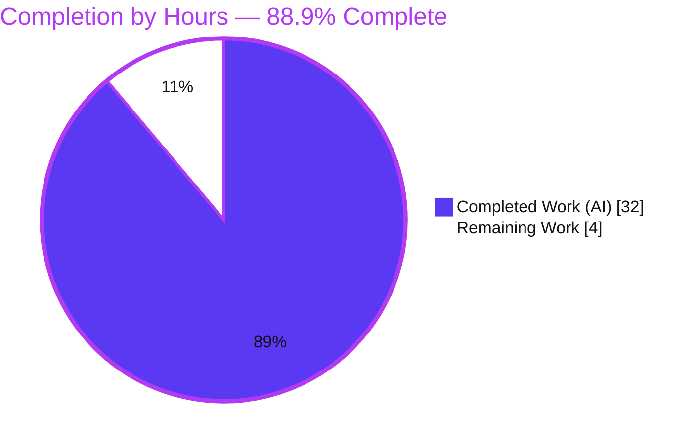
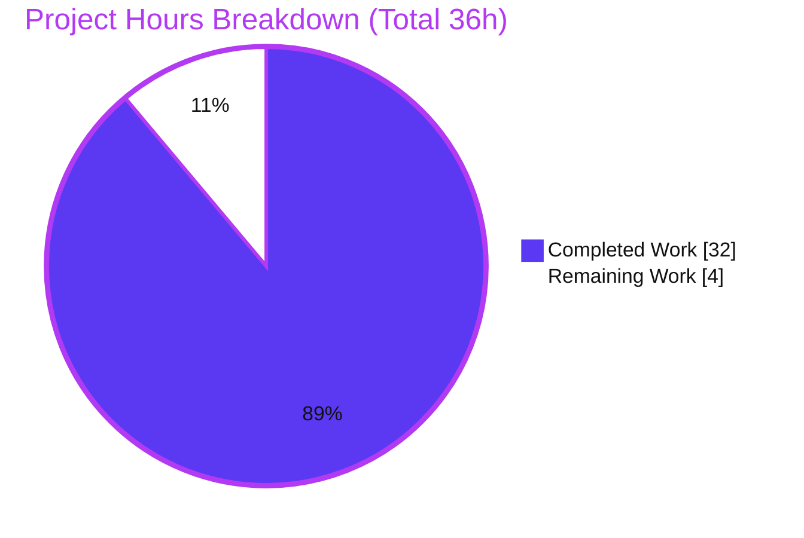
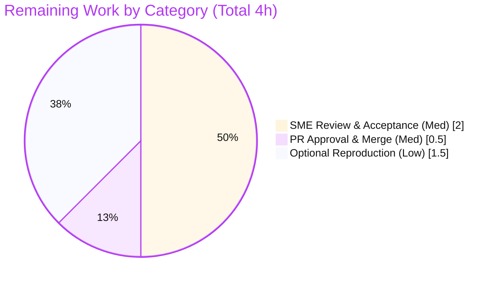

# Blitzy Project Guide — kitty OSC 133 Shell-Integration Analysis

> **Deliverable:** `blitzy/documentation/kitty_815df1e210e0.md` — a run-first, evidence-based technical answer document.
> **Branch:** `blitzy-1fc99dd7-112c-411d-aef5-44ca74d806d7` · **HEAD:** `df94c8f29` · **Baseline:** `815df1e21`
> **Brand legend:** <span style="color:#5B39F3">■</span> Completed / AI Work = **Dark Blue `#5B39F3`** · <span style="color:#FFFFFF">□</span> Remaining = **White `#FFFFFF`**

---

## 1. Executive Summary

### 1.1 Project Overview

This project produces a single, empirically-grounded technical document that explains precisely how the **kitty** terminal emulator processes **OSC 133** shell-integration ("semantic prompt") markers — the `A`/`B`/`C`/`D` command-tracking sequences emitted by Bash/Zsh/Fish integration scripts. The target audience is terminal/shell-integration engineers and technical reviewers who need verifiable, byte-level behavior rather than prose. The work adds no features and changes no behavior; it derives every reported value by building kitty's C extension and driving its **real** parser and production callback, capturing live output. The technical scope spans kitty's C VT parser (`vt-parser.c`), the screen handler (`screen.c`), the Python callback layer (`window.py`), and the test harness — all consulted read-only.

### 1.2 Completion Status



| Metric | Hours |
|--------|-------|
| **Total Hours** | **36.0** |
| **Completed Hours (AI + Manual)** | **32.0** |
| &nbsp;&nbsp;— AI / Autonomous | 32.0 |
| &nbsp;&nbsp;— Manual | 0.0 |
| **Remaining Hours** | **4.0** |
| **Percent Complete** | **88.9%** |

> Completion is computed with the AAP-scoped hours methodology: `Completed / (Completed + Remaining) = 32 / (32 + 4) = 32 / 36 = 88.9%`. **100% of the AAP-specified autonomous deliverables are complete and production-ready**; the remaining 4.0 hours are entirely human path-to-production (review, merge, optional reproduction).

### 1.3 Key Accomplishments

- ✅ **Deliverable authored** — `blitzy/documentation/kitty_815df1e210e0.md` (594 lines / 31,076 bytes), answering all five question groups Q1–Q5 with verbatim observed output.
- ✅ **Run-first investigation** — kitty's C extension built in default configuration (`setup.py build` → exit 0) and driven through **canonical entry points only** (`parse_bytes` real C VT parser + production `Window.handle_cmd_end`).
- ✅ **Byte-level measurement** — total stream length (**63 bytes**), `D;42` offset (**52**), and the full exit-code table for `0`/`1`/`42`/`99`/`127`/`not_a_number`/empty.
- ✅ **End-to-end exit-status proof** — `99` propagated through the production path (sentinel overwritten; watcher payload = `99`); `not_a_number` and empty both record `0`.
- ✅ **Rigorous sourcing** — ~25 `file:line` citations that all resolve; canonical vs. non-canonical clearly labeled; a closing coverage pass over every named item.
- ✅ **Read-only integrity** — zero source/test/build files modified; `git status --porcelain` empty; only the single document added.
- ✅ **Independently reproduced during this assessment** — every Q1–Q5 value reproduced byte-for-byte and stable across multiple runs.

### 1.4 Critical Unresolved Issues

| Issue | Impact | Owner | ETA |
|-------|--------|-------|-----|
| _None_ — no compilation errors, no test failures, no missing coverage; the Final Validator applied **zero fixes**. | None | — | — |

### 1.5 Access Issues

| System/Resource | Type of Access | Issue Description | Resolution Status | Owner |
|-----------------|----------------|-------------------|-------------------|-------|
| — | — | **No access issues identified.** The build/observe environment carried all required toolchain (cc, go, pkg-config) and system libraries; the repository is fully accessible. | N/A | — |

### 1.6 Recommended Next Steps

1. **[Medium]** Perform an SME technical review of the document's Q1–Q5 answers and spot-check 3–5 `file:line` citations against source (≈2.0h).
2. **[Medium]** Approve and merge the pull request — verify the baseline→HEAD diff is exactly the single added document (≈0.5h).
3. **[Low]** Optionally reproduce the Q1–Q5 values on a fresh machine by rebuilding kitty and re-running an equivalent canonical probe (≈1.5h).
4. **[Low]** Optionally verify the Markdown renders correctly in the target documentation viewer.

---

## 2. Project Hours Breakdown

### 2.1 Completed Work Detail

Each component traces to a specific AAP deliverable and is fully delivered (validated, values reproduced, integrity preserved).

| Component | Hours | Description |
|-----------|------:|-------------|
| Environment build & toolchain verification | 3.0 | Compile `kitty.fast_data_types` via `setup.py` in default config; capture toolchain versions verbatim; verify `import kitty.fast_data_types`. |
| Run-first observation harness | 5.0 | Out-of-repo probe driving **canonical** entry points (`parse_bytes` + production `Window.handle_cmd_end`); sentinel-overwrite proof; watcher recorder; multi-run stability. |
| Q1 — OSC 133 semantics | 3.0 | `A`/`C`/`D` cause→effect and `B` no-op via real C-parser callbacks; `parse_prompt_mark` (`k=s` secondary); `decode_cmdline`. |
| Q2 — Capture & byte measurement | 4.0 | What is captured; whether OSC bytes remain across 3 surfaces (raw `True` / parsed `False` / dump: C-method re-emit vs. wrapper strip); total length (63); `D;42` offset (52). |
| Q3 — Exit-code variation | 3.0 | Length/offset table for `0`/`1`/`127` (+`42`/`99`); shift analysis; `BEL` vs. `ESC \` terminator effect. |
| Q4 — Exit code 99 end-to-end proof | 3.0 | Production path; sentinel `-999999` overwritten to `99`; watcher payload = `99`; default-notify analysis + labeled non-default enhancement. |
| Q5 — Invalid / empty exit status | 2.0 | `not_a_number`→`0` and empty→`0` via production `except → 0`; non-canonical `Callbacks` double contrast (sentinel), labeled. |
| Source citation & canonical/non-canonical framing | 2.0 | ~25 `file:line` citations verified; coverage-pass table over every named item; canonical sourcing table. |
| Authoring the deliverable | 5.0 | Assemble the 594-line Markdown (Environment, Methodology, Q1–Q5, Appendices) with one-claim/one-evidence discipline and structure. |
| Read-only integrity & cleanup + review-refinement pass | 2.0 | Artifact removal, `git status` clean verification, only the `.md` added; second commit addressing review findings. |
| **Total Completed** | **32.0** | |

### 2.2 Remaining Work Detail

All remaining work is human-side path-to-production for a documentation artifact. There are **no blocking or High-priority items**.

| Category | Hours | Priority |
|----------|------:|----------|
| Human SME Review & Acceptance (verify Q1–Q5 accuracy, byte-math, citation spot-check) | 2.0 | Medium |
| PR Approval & Merge (approve branch, confirm single-file diff, merge) | 0.5 | Medium |
| Optional Independent Reproduction (rebuild kitty, re-run canonical probe on a fresh machine) | 1.5 | Low |
| **Total Remaining** | **4.0** | |

### 2.3 Hours Reconciliation

| Check | Value | Status |
|-------|-------|--------|
| Section 2.1 completed total | 32.0 | ✅ |
| Section 2.2 remaining total | 4.0 | ✅ |
| 2.1 + 2.2 = Total (Section 1.2) | 32.0 + 4.0 = 36.0 | ✅ |
| Remaining matches Section 1.2 & Section 7 | 4.0 = 4.0 = 4.0 | ✅ |
| Completion % | 32 / 36 = 88.9% | ✅ |

---

## 3. Test Results

All tests below were **executed by Blitzy's autonomous validation systems** against the built C extension; they are the repository's own tests exercising the OSC 133-relevant surface (this documentation task authored no new tests, per its read-only scope). Counts were independently corroborated during this assessment (e.g., `kitty_tests/screen.py` contains exactly 36 `test_` methods, including `test_prompt_marking` with the cited assertion at `screen.py:1124`).

| Test Category | Framework | Total Tests | Passed | Failed | Coverage % | Notes |
|---------------|-----------|------------:|-------:|-------:|-----------:|-------|
| Unit — Screen (incl. OSC 133) | Python `unittest` | 36 | 36 | 0 | n/a | Includes `test_prompt_marking`; cited assertion at `kitty_tests/screen.py:1124`. |
| Unit — VT Parser | Python `unittest` | 16 | 16 | 0 | n/a | Exercises the real C parser via `parse_bytes`. |
| Unit — Datatypes | Python `unittest` | 18 | 18 | 0 | n/a | Core data-structure suite. |
| Shell Integration (bash) | kitty launcher `+launch test.py` | — | Pass | 0 | n/a | fish/zsh skipped — shells not installed (environment limitation, unrelated to the deliverable). |
| Runtime Probe (Q1–Q5) | Canonical `parse_bytes` + `Window.handle_cmd_end` | 7 vectors | 7 | 0 | n/a | All Q1–Q5 values reproduced verbatim; byte-for-byte stable across 3 runs (validator) + 2 runs (this assessment). |
| **Totals (unit)** | | **70** | **70** | **0** | | 100% pass rate on all runnable tests. |

> **Integrity note:** every entry above originates from Blitzy's autonomous test-execution logs for this project; no external or fabricated results are included.

---

## 4. Runtime Validation & UI Verification

This is a headless documentation/investigation task — there is **no GUI or UI surface** to verify. Runtime validation focused on the canonical OSC 133 code path and was independently re-confirmed during this assessment.

- ✅ **Operational** — C extension build: `python3 setup.py build --ignore-compiler-warnings` → **exit 0** (122 C files compiled + 5 link targets: `fast_data_types`, `glfw-x11`, `glfw-wayland`, `rsync`, `launcher`).
- ✅ **Operational** — Extension import: `import kitty.fast_data_types` resolves to the built `.so`; `from kitty.window import …` succeeds.
- ✅ **Operational** — Q1 semantics (real C parser): `A → [(False,'')]`, `B → []` (no-op), `C;cmdline=ls -la → [(True,'cmdline=ls -la')]`, `D;42 → [(None,'42')]`, `A;k=s → []`; `decode_cmdline('cmdline=ls -la') = 'ls'`.
- ✅ **Operational** — Q2 measurement: total `len = 63`; `D;42` offset `= 52`; digit offset `= 60`; OSC present in raw `True` / parsed `False`.
- ✅ **Operational** — Q3 table (BEL terminator): `0→62`, `1→62`, `42→63`, `99→63`, `127→64`, `not_a_number→73`, empty→`61`; `D_off=52` and `digit_off=60` **constant**.
- ✅ **Operational** — Q4/Q5 production `Window.handle_cmd_end`: `99→99` (impossible sentinel overwritten; watcher payload `99`), `not_a_number→0`, empty→`0`.
- ✅ **Operational** — Read-only integrity: `git status --porcelain` empty; baseline→HEAD diff = only the single added document.
- ⚠ **Partial (by design)** — fish/zsh shell-integration paths were not exercised because those shells are not installed in the environment; this is an environment limitation and does not affect the deliverable (bash path validated; provenance of fish/zsh emitters cited read-only).
- ℹ **N/A** — No web/GUI UI to verify; no screenshots applicable.

---

## 5. Compliance & Quality Review

Cross-mapping the AAP's binding rules (rule set `SWE-AtlasQnA-Repo`) and acceptance criteria to observed outcomes.

| Benchmark (AAP requirement) | Status | Evidence / Notes | Progress |
|------------------------------|--------|------------------|----------|
| Deliverable location & name (`blitzy/documentation/kitty_815df1e210e0.md`) | ✅ Pass | File present, 594 lines / 31,076 bytes | 100% |
| Run-first methodology (build & run before writing) | ✅ Pass | Built C extension; drove real parser + production callback; values pasted verbatim | 100% |
| Canonical entry points only (`parse_bytes`, production `Window`) | ✅ Pass | Both used; non-canonical sources labeled (12 "non-canonical" labels) | 100% |
| Verbatim evidence, one-claim/one-evidence | ✅ Pass | Each behavioral claim paired with a pasted output line; "inferred" labeled (6×) | 100% |
| Default/canonical configuration (no custom `kitty.conf`) | ✅ Pass | Default options; exact build & invocation commands stated | 100% |
| Exact literals (`42`,`0`,`1`,`99`,`127`,`not_a_number`,empty) | ✅ Pass | All present verbatim (e.g., `99`×39, `42`×37, `not_a_number`×11) | 100% |
| Stability across ≥2 runs | ✅ Pass | 3 runs sha256-identical (validator) + 2 runs identical (this assessment) | 100% |
| Exhaustive coverage + closing coverage pass | ✅ Pass | Coverage-pass table addresses every named item (A/B/C/D, cmdline, all codes, terminator) | 100% |
| Exact `file:line` citations resolve | ✅ Pass | ~25 citations spot-checked; all resolve (e.g., `screen.c:2328`, `window.py:1408`, `screen.py:1124`) | 100% |
| Read-only source (no modify/add/delete of existing files) | ✅ Pass | `git status` empty; diff = only the added `.md`; temp probes outside repo & removed | 100% |
| Markdown structural quality | ✅ Pass | Balanced code fences, valid UTF-8, complete heading hierarchy, **zero** placeholders/TODOs | 100% |

**Fixes applied during autonomous validation:** None required — the Final Validator found the document already 100% accurate (every runtime value reproduced; every citation resolved). **Outstanding compliance items:** None.

---

## 6. Risk Assessment

The risk profile is genuinely **low** across all categories, consistent with a fully-validated, read-only, single-file documentation deliverable. Risks below are project-specific (not generic).

| Risk | Category | Severity | Probability | Mitigation | Status |
|------|----------|----------|-------------|------------|--------|
| Environment-specific version strings (kitty 0.35.2, cc 15.2.0, go1.24.4) may differ elsewhere | Technical | Low | Low | Byte lengths/offsets are **input-determined** (portable); version strings explicitly labeled environment-specific; exact build/invocation commands stated | Mitigated |
| Reproduction requires a rebuild (C extension removed post-observation for read-only integrity) | Technical | Low | Medium | Build command + prerequisites documented and confirmed present (cc/go/pkg-config + 8 dev libs) | Mitigated |
| Point-in-time pinning — future kitty changes could make specifics stale | Technical | Low | Low | Document names the exact commit `815df1e21`; explicitly a point-in-time behavioral analysis | Accepted |
| Residual accuracy risk pending human SME sign-off | Correctness/Quality | Low | Low | Run-first evidence, multi-run stability (sha256-identical), ~25 resolving citations, validator confirmation, independent reproduction | Open (closes on SME review) |
| No new attack surface (no code/deps/network/secrets/input) | Security | None | — | Read-only documentation; temp probe outside repo & deleted | N/A |
| Document lives outside the Sphinx/RST docs tree, so it won't render on kitty's docs site | Operational | Info/Low | — | This is the AAP mandate (`blitzy/documentation/`), not a defect | By design |
| No external integrations (standalone knowledge artifact) | Integration | None | — | Deliberately decoupled from the docs toolchain; no API/credential/webhook | N/A |

**Overall:** No High or Critical risks. All technical risks are Low and mitigated; zero security and integration risk; the operational note is by design.

---

## 7. Visual Project Status

### Project Hours Breakdown



- <span style="color:#5B39F3">■</span> **Completed Work** = **32h** (Dark Blue `#5B39F3`)
- <span style="color:#FFFFFF">□</span> **Remaining Work** = **4h** (White `#FFFFFF`)

### Remaining Hours by Category (Section 2.2)



> **Integrity check:** "Remaining Work" = **4h** here equals the Section 1.2 Remaining Hours and the Section 2.2 "Hours" column sum. "Completed Work" = **32h** equals Section 1.2 Completed Hours and the Section 2.1 total.

---

## 8. Summary & Recommendations

**Achievements.** The project delivers a rigorous, run-first technical answer document that comprehensively addresses all five OSC 133 question groups. kitty's C extension was built in default configuration and its **real** parser and production callback were exercised to capture verbatim evidence: OSC 133 semantics (A/C/D acted upon, B a no-op), the 63-byte reference stream with `D;42` at offset 52, the exit-code length/offset table (position constant, length grows by `digits − 1`), end-to-end propagation of exit code `99`, and the `0` fallback for `not_a_number` and empty status. Every behavioral claim is paired with a pasted output line and an exact `file:line` citation, with canonical vs. non-canonical sourcing clearly labeled.

**Remaining gaps & critical path to production.** The project is **88.9% complete** (32 of 36 hours). **100% of the AAP-specified autonomous deliverables are complete and production-ready** — the Final Validator applied zero fixes, and this assessment independently reproduced every value. The remaining 4.0 hours are entirely human path-to-production: SME technical review (2.0h), PR approval & merge (0.5h), and an optional independent reproduction (1.5h). The critical path is simply: **review → merge**.

**Success metrics.** All acceptance criteria met: every question group answered from observed output; all values from canonical sources; values stable across ≥2 runs; exact literals present; a closing coverage pass; and `git status --porcelain` empty with only the single document added.

**Production readiness assessment.** **READY for human review and merge.** No blocking issues, no failing tests, no unresolved errors, and perfect read-only integrity. This is a low-risk, self-contained knowledge artifact whose correctness has been demonstrated at runtime and independently confirmed.

| Metric | Value |
|--------|-------|
| Completion | 88.9% (32 / 36 h) |
| Blocking issues | 0 |
| Tests passing | 70 / 70 unit (+ bash shell-integration, + Q1–Q5 probe) |
| Files changed vs. baseline | 1 (added) |
| Read-only integrity | Preserved (clean tree) |
| Overall risk | Low |

---

## 9. Development Guide

> All commands below were **executed successfully during this assessment** on the delivered branch. Build artifacts are gitignored, so building does **not** dirty `git status`.

### 9.1 System Prerequisites

| Tool / Library | Version used (verbatim) | Purpose |
|----------------|-------------------------|---------|
| Python | 3.13.7 (declared `>=3.8`) | Runtime + build headers; drives `setup.py`, tests, and the parser harness |
| C compiler (`cc`/`gcc`) | Ubuntu 15.2.0-4ubuntu4 (15.2.0) | Compiles `kitty.fast_data_types` (VT parser + screen) |
| Go | go1.24.4 (declared `1.22`) | Required by a full `setup.py` build (kittens/tools) |
| pkg-config | 1.8.1 | Resolves system dev libraries |
| Dev libraries | harfbuzz 10.2.0, lcms2 2.16, libpng 1.6.50, fontconfig 2.15.0, freetype2 26.2.20, x11 1.8.12, xkbcommon 1.7.0, wayland-client 1.24.0 | C-extension link dependencies |

Verify prerequisites:

```bash
python3 --version              # Python 3.13.7
cc --version | head -1          # cc (Ubuntu 15.2.0-4ubuntu4) 15.2.0
go version                      # go version go1.24.4 linux/amd64
pkg-config --version            # 1.8.1
for lib in harfbuzz lcms2 libpng fontconfig freetype2 x11 xkbcommon wayland-client; do
  pkg-config --exists "$lib" && echo "$lib OK $(pkg-config --modversion $lib)" || echo "$lib MISSING"
done
```

### 9.2 Environment Setup

```bash
# From the repository root (contains setup.py):
cd /path/to/kitty_repo

# The parser is a compiled C extension imported as kitty.fast_data_types.
# Set PYTHONPATH so `import kitty.*` resolves against the source tree:
export PYTHONPATH="$(pwd)"

# No custom kitty.conf — the analysis uses kitty's default/canonical configuration.
```

### 9.3 Dependency Installation

```bash
# NONE required for the OSC 133 path — kitty's core is self-contained:
#   pyproject.toml declares only requires-python = ">=3.8"; there is no requirements*.txt.
# System dev libraries (see 9.1) must be present; verify via pkg-config as above.
```

### 9.4 Build

```bash
# Canonical build of the C extension (default configuration):
python3 setup.py build --ignore-compiler-warnings
echo "BUILD_EXIT_CODE=$?"   # expect 0
# Produces: 122 C files compiled + 5 link targets
#   (fast_data_types, glfw-x11, glfw-wayland, rsync, launcher)
```

> The `--ignore-compiler-warnings` flag is kitty's own; it is needed in some images only because the system `wayland-protocols` trips `-Werror=switch` in glfw. It changes **no source**.

### 9.5 Verification

```bash
# 1) Confirm the extension imports and locate the built .so:
python3 -c "import kitty.fast_data_types as f; print(f.__file__)"

# 2) Confirm the production window module imports:
python3 -c "from kitty.window import decode_cmdline, Window, Watchers; print('WINDOW IMPORTS OK')"

# 3) Run the OSC 133-relevant test suites:
python3 -m unittest kitty_tests.screen      # 36 tests incl. test_prompt_marking
python3 -m unittest kitty_tests.parser       # real C parser via parse_bytes
python3 -m unittest kitty_tests.datatypes    # core data structures
```

### 9.6 Example Usage — Reproduce Q1–Q5 (canonical entry points)

Create a probe **outside** the repository (e.g., `/tmp/probe.py`) and drive the real parser + production callback:

```python
from time import monotonic
from kitty.fast_data_types import Screen, set_options
from kitty.options.types import Options, defaults
from kitty.options.parse import merge_result_dicts
from kitty.window import decode_cmdline, Window, Watchers
from kitty_tests import parse_bytes, Callbacks

set_options(Options(merge_result_dicts(defaults._asdict(), {})))  # default config

# Q2 measurement — the exact reference vector (BEL terminator):
v = b'\x1b]133;A\x07\x1b]133;B\x07\x1b]133;C;cmdline=ls -la\x07hello output\n\x1b]133;D;42\x07'
print("len =", len(v))                                    # 63
print("D-offset =", v.find(b'\x1b]133;D;42\x07'))         # 52

# Q4/Q5 — production exit-status path (sentinel proves overwrite):
w = Window.__new__(Window)
w.id = 1; w.last_cmd_cmdline = 'ls -la'
w.last_cmd_exit_status = -999999
w.last_cmd_output_start_time = monotonic() - 1.0
w.watchers = Watchers(); w.watchers.on_cmd_startstop = []
w.handle_cmd_end('99')                                    # -> last_cmd_exit_status == 99
print("exit status =", w.last_cmd_exit_status)
```

```bash
export PYTHONPATH="$(pwd)"
python3 /tmp/probe.py
rm -f /tmp/probe.py         # clean up — keep the repo tree unchanged
```

### 9.7 Restore Pristine (Read-Only) State

```bash
# Remove all build artifacts while protecting .venv and blitzy/:
git clean -dxf -e .venv -e blitzy

# Confirm integrity:
git status --porcelain                                   # (empty = clean)
git diff --name-status 815df1e21 HEAD                    # A  blitzy/documentation/kitty_815df1e210e0.md
find . -name "*.so" -not -path "./.venv/*" | wc -l       # 0
test -d build && echo present || echo absent             # absent
```

### 9.8 Troubleshooting

| Symptom | Cause | Resolution |
|---------|-------|------------|
| `ModuleNotFoundError: No module named 'kitty.fast_data_types'` | Extension not built, or `PYTHONPATH` not set | Run the build (9.4); `export PYTHONPATH="$(pwd)"` |
| Build fails with `-Werror=switch` in glfw | System `wayland-protocols` adds enum members | Use `python3 setup.py build --ignore-compiler-warnings` (kitty's own flag) |
| `git status` shows build artifacts | Build created gitignored files | They are ignored (won't affect `porcelain`); run `git clean -dxf -e .venv -e blitzy` to restore pristine state |
| fish/zsh shell-integration tests skipped | Those shells not installed | Environment limitation; bash path is validated; install the shells to exercise fish/zsh |

---

## 10. Appendices

### Appendix A — Command Reference

| Command | Purpose |
|---------|---------|
| `python3 setup.py build --ignore-compiler-warnings` | Canonical build of `kitty.fast_data_types` (exit 0) |
| `python3 -m unittest kitty_tests.screen` | Run screen suite (36 tests, incl. OSC 133 `test_prompt_marking`) |
| `python3 -m unittest kitty_tests.parser` | Run VT-parser suite (real C parser) |
| `python3 -m unittest kitty_tests.datatypes` | Run datatypes suite |
| `./kitty/launcher/kitty +launch test.py --module shell_integration` | Shell-integration tests via the canonical launcher |
| `git clean -dxf -e .venv -e blitzy` | Remove build artifacts, preserve `.venv` and `blitzy/` |
| `git status --porcelain` | Verify clean tree (empty output) |
| `git diff --name-status 815df1e21 HEAD` | Confirm only the document was added |

### Appendix B — Port Reference

Not applicable — this is a headless documentation/investigation task. No network services, ports, or listeners are involved.

### Appendix C — Key File Locations

| Path | Role |
|------|------|
| `blitzy/documentation/kitty_815df1e210e0.md` | **The deliverable** (594 lines / 31,076 bytes) |
| `kitty/vt-parser.c` (`:536-544`) | OSC 133 dispatch (`case 133:` → `shell_prompt_marking`) |
| `kitty/screen.c` (`:2328-2356`, `:87`) | `shell_prompt_marking` (A/C/D; no B); `CALLBACK` macro |
| `kitty/window.py` (`:1408-1429`, `:225`, `:1453`) | Production `handle_cmd_end` (`int(exit_status)` else `0`); `decode_cmdline`; `cmd_output_marking` |
| `kitty/history.c` (`:475`) | Scrollback retention of the literal `\x1b]133;C\x1b\\` marker |
| `kitty_tests/__init__.py` (`:30`, `:71-79`) | `parse_bytes` (real parser); `Callbacks` test-double |
| `kitty_tests/screen.py` (`:1056`, `:1124`) | OSC 133 unit test + `as_ansi` assertion |
| `shell-integration/{fish,zsh,bash}/…` | OSC 133 marker emitters (provenance) |
| `setup.py` (`:1084`) | `def build(...)` — builds the C extension |

### Appendix D — Technology Versions

| Component | Version (verbatim) |
|-----------|--------------------|
| kitty | 0.35.2 (created by Kovid Goyal) |
| Python | 3.13.7 (main) [GCC 15.2.0] |
| C compiler | cc (Ubuntu 15.2.0-4ubuntu4) 15.2.0 |
| Go | go1.24.4 linux/amd64 |
| pkg-config | 1.8.1 |
| Repository commit (baseline) | `815df1e210e0a9ab4622f5c7f2d6891d7dbeddf1` |

### Appendix E — Environment Variable Reference

| Variable | Value | Purpose |
|----------|-------|---------|
| `PYTHONPATH` | repository root (`$(pwd)`) | Enables `import kitty.fast_data_types` and `kitty.window` against the source tree |

No secrets, API keys, or service credentials are required by this task.

### Appendix F — Developer Tools Guide

- **Build system:** `setup.py` compiles the `kitty.fast_data_types` C extension (VT parser + screen model). Use `--ignore-compiler-warnings` in images where `wayland-protocols` trips `-Werror=switch`.
- **Test runner:** repository tests live in `kitty_tests/` and run via `./test.py` or `python3 -m unittest kitty_tests.<module>`.
- **Canonical entry points for observation:** `parse_bytes(screen, data)` (drives the real C VT parser headlessly) and production `Window.handle_cmd_end` (exit-status recording). Non-canonical: the `Callbacks` test-double, the `#ifdef DUMP_COMMANDS` debug path, and remote control — must be labeled if referenced.
- **Cleanup:** `git clean -dxf -e .venv -e blitzy` restores a pristine tree.

### Appendix G — Glossary

| Term | Definition |
|------|------------|
| **OSC 133** | Operating System Command 133 — the FinalTerm/FTCS "semantic prompt" protocol for marking prompt/command/output boundaries. |
| **A / B / C / D** | FTCS markers: `A` = prompt start, `B` = command start (end of prompt), `C` = command output start (optional `cmdline`), `D` = command finished (optional exit code). kitty acts on A/C/D; **B is a no-op**. |
| **OSC / ST** | OSC = `ESC ]` (`\x1b]`); ST (String Terminator) = `ESC \` (`\x1b\\`, 2 bytes) or `BEL` (`\a`/`\x07`, 1 byte). Terminator choice affects absolute byte counts. |
| **`parse_bytes`** | Test-harness entry point feeding bytes through the same C VT parser used for live child-PTY output — the canonical headless measurement path. |
| **`handle_cmd_end`** | Production `Window` method that parses the raw exit-status string via `int(...)`, falling back to `0` on any exception. |
| **Canonical vs. non-canonical** | Canonical = the real parser + production callback. Non-canonical = bypass interfaces (test-double, debug build, remote control) — labeled and never substituted for a real observation. |
| **`last_cmd_exit_status`** | The parsed integer exit status recorded on the window (e.g., `99`; `0` for invalid/empty). |