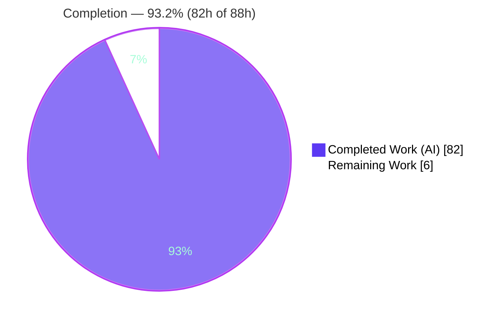
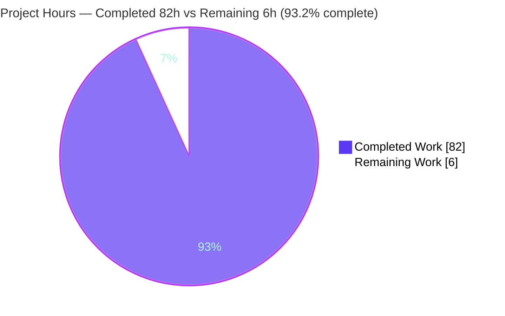
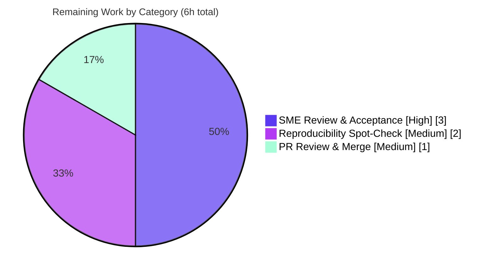

# Blitzy Project Guide — Kitty 0.35.2 Startup Runtime Investigation

> **Subject:** kovidgoyal/kitty terminal emulator · commit `815df1e210e0a9ab4622f5c7f2d6891d7dbeddf1` · version **kitty 0.35.2**
> **Branch:** `kitty_815df1e210e0` · **Task type:** Read-only investigation + documentation
> **Sole deliverable:** `blitzy/documentation/kitty_815df1e210e0.md` (1,517 lines · 10,988 words · 86,924 bytes)

---

## 1. Executive Summary

### 1.1 Project Overview

This project is a **read-only, run-first runtime investigation** of how **kitty 0.35.2** starts up — the interval between process launch and the terminal being ready to host a shell. The audience is engineers and technical reviewers who need a rigorously evidenced account of Kitty's startup path. The single deliverable is one markdown answer document that resolves four user questions — startup subsystems (Q1), initial configuration (Q2), terminal↔shell readiness (Q3), and display/render liveness (Q4) — with each behavioral claim backed by the exact command run and its unedited output, captured by building the real binary and launching it headlessly under **Xvfb + Mesa llvmpipe** software OpenGL. Technical scope spans the native launcher, configuration, GLFW/OpenGL, fonts, PTY/child management, the VT parser, and the screen model. **Zero source files are modified.**

### 1.2 Completion Status

The project is **93.2% complete** on an AAP-scoped, hours-based basis. All Agent Action Plan (AAP) deliverable requirements are complete and independently validated; the remaining 6 hours are path-to-production **human acceptance** (SME review, reproducibility spot-check, PR merge), which no human has performed yet.



| Metric | Value |
|--------|-------|
| **Total Hours** | **88** |
| **Completed Hours (AI 82 + Manual 0)** | **82** |
| **Remaining Hours** | **6** |
| **Percent Complete** | **93.2%** |

*Formula: 82 completed ÷ (82 completed + 6 remaining) = 82 ÷ 88 = 93.2%.*

### 1.3 Key Accomplishments

- ✅ Built the real binary from source in the canonical container (`python3 setup.py build`, EXIT 0 under strict `-Werror -pedantic-errors`), with **bit-reproducible** artifacts across two independent clean clones and the version stamp `kitty 0.35.2` confirmed from the freshly built binary.
- ✅ Provisioned a headless GUI environment (owned **Xvfb :77**, **Mesa llvmpipe** software OpenGL forced via `LIBGL_ALWAYS_SOFTWARE=1`) and grounded the approach in primary Mesa/GLFW/X.Org documentation.
- ✅ **Q1** — traced and evidenced 10 startup subsystems with a verbatim stdout GL banner + 8-line stderr bring-up block and per-line producer/stream attribution (`gl.c:72`, `glfw.c:1321`, `systemd.c:87`, `window.py:871`, `fonts/render.py:163`).
- ✅ **Q2** — documented the `create_opts` → `load_config` resolution over built-in `defaults`, captured the canonical `debug_config` report via the real `ctrl+shift+F6` keybinding, and demonstrated crafted-config overrides + bad-config-line reporting.
- ✅ **Q3** — captured the PTY/fork/exec handshake via `strace` (`openpty` → `/dev/ptmx`, `setsid`, `ioctl TIOCSCTTY`, `execvp` → `/usr/bin/sh`), the 21-variable child environment, both `TERMINFO` delivery modes, shell integration (bash vs `sh`), and the shell's first bytes parsed and drawn.
- ✅ **Q4** — evidenced the OpenGL requirement enforcement, cell rasterization pipeline + 13 GLSL programs, font fallback, a framebuffer glyph-size measurement proving real rasterization, ANSI colour + Unicode rendering, and the scroll/damage model.
- ✅ Exercised all five edge/negative conditions (E1–E5), including the GL-missing fatal and a bad config line, and applied disciplined **OBSERVED vs INFERRED** labeling throughout.
- ✅ Honored the **read-only mandate perfectly**: `git diff` versus the subject commit shows only the one documentation file; all temporary artifacts were cleaned up.

### 1.4 Critical Unresolved Issues

| Issue | Impact | Owner | ETA |
|-------|--------|-------|-----|
| _None._ No critical blocking issues remain. The AAP deliverable is complete, compiles, runs, and reproduces; the only remaining work is standard human review/acceptance (Section 1.6, Section 2.2). | — | — | — |

### 1.5 Access Issues

| System/Resource | Type of Access | Issue Description | Resolution Status | Owner |
|-----------------|----------------|-------------------|-------------------|-------|
| Canonical Docker container (`ghcr.io/scaleapi` swe-atlas kitty `815df1e210e0`) | Build/run environment | Exact reproduction of the runtime evidence requires this pinned image (generic sandboxes lack Go, `pkg-config`, Xvfb, Mesa/graphics libs). | Available to Blitzy validation; reviewers need pull access to reproduce. | Reviewer / Platform |
| Source repository & branch | Merge permission | PR merge to the target branch requires repository write access. | Pending human merge | Reviewer |

*No credential, API-key, or third-party-service access issues apply — this is a read-only local investigation that introduces no dependencies and uses no secrets.*

### 1.6 Recommended Next Steps

1. **[High]** Have a kitty/terminal-internals SME read and accept `blitzy/documentation/kitty_815df1e210e0.md`, confirming all four questions are answered and spot-checking the file:line anchors against source (≈3h).
2. **[Medium]** Run a reproducibility spot-check of a representative subset of documented commands inside the canonical container (Q1 primary run; E1 GL-missing negatives; the `debug_config` keybinding capture) (≈2h).
3. **[Medium]** Review the single-file diff, confirm the read-only mandate (`git diff 815df1e210e0..HEAD` = only the doc), and merge (≈1h).
4. **[Low]** (Optional, out of AAP scope) Schedule a macOS CoreText/Cocoa parity run to promote the currently-INFERRED macOS claims to OBSERVED.

---

## 2. Project Hours Breakdown

### 2.1 Completed Work Detail

All completed work is autonomous (AI). Each component traces to specific AAP requirements.

| Component | Hours | Description |
|-----------|------:|-------------|
| A · Build & headless environment | 10 | Canonical build from a clean clone at the exact commit (`python3 setup.py build`, EXIT 0, bit-reproducible artifacts; version `0.35.2` confirmed); documented the `./dev.sh build` failure edge case; provisioned owned Xvfb :77 + Mesa llvmpipe (`LIBGL_ALWAYS_SOFTWARE=1`); web-research grounding; secure observation harness + stderr log-capture convention. |
| B · Q1 startup subsystems | 9 | Traced 10 subsystems (launcher → entry_points → `_main` → `init_glfw` → `AppRunner` → `create_sessions` → `create_os_window`+GL+shaders → `Boss`/`ChildMonitor` → font dump → `child_monitor.main_loop`); verbatim GL banner + 8-line bring-up; per-line producer/stream attribution; `readelf` CPython symbols; stability hash. |
| C · Q2 initial configuration | 10 | `create_opts` → `load_config` resolution over `defaults`; config-dir order; proved candidates absent on default launch; first-launch defaults (font_size 11.0, cursor_shape, fg/bg, scrollback 2000); canonical `debug_config` report via real keybinding; crafted-config overrides; bad-config-line reporting (2 mechanisms). |
| D · Q3 terminal↔shell | 14 | `openpty`; `Child.fork` → C `spawn()` handshake via `strace` (`setsid`/`TIOCSCTTY`/`execvp`) + child TTY/session state; exec-failure fallback; 21-variable child env; terminfo DB + both delivery modes; shell integration bash vs `sh`; first-bytes parse→draw + `--dump-bytes`. |
| E · Q4 display/render | 13 | OpenGL requirement anchors; cell rasterization pipeline + 13 GLSL programs; font resolution/fallback (U+4e2d, U+2713); framebuffer glyph-size measurement (real-rasterization proof); ANSI colour + Unicode escapes drawn; scroll/damage model; confirming log messages. |
| F · Edge cases E1–E5 | 7 | GL-missing fatals (unreachable display; forced inadequate GL version → `glfw.c:1198-1199`); crafted config in isolated root; `debug_config` via real keybinding; before/after screen states; `TERMINFO` path-vs-direct modes. |
| G · Document authoring & coverage | 12 | Single answer document with per-claim command + unedited output; 81 file:line anchors; OBSERVED/INFERRED discipline; final coverage passes (functions/files/flags/"e.g." items); ≥2-run stability discipline; correct file location/name per the SWE-AtlasQnA-Repo rule. |
| H · Cleanup & read-only integrity | 2 | Removed all temporary artifacts; tore down Xvfb by exact pid; verified `git diff` clean (only the doc); confirmed zero source-file modifications. |
| I · Autonomous QA / validation | 5 | Final Validator's 5 gates (dependencies, compilation, evidence reproducibility, runtime, in-scope file) + 7 QA-fix hunks grounded in source/runtime truth. |
| **Total Completed** | **82** | |

### 2.2 Remaining Work Detail

All remaining work is path-to-production **human acceptance**; there are no AAP deliverable gaps.

| Category | Hours | Priority |
|----------|------:|----------|
| SME technical review & acceptance of the answer document | 3 | High |
| Reproducibility spot-check of key runs in the canonical container | 2 | Medium |
| PR review & merge to target branch | 1 | Medium |
| **Total Remaining** | **6** | |

> **Consistency:** Section 2.1 (82h) + Section 2.2 (6h) = **88h** = Total Hours in Section 1.2. Remaining (6h) is identical in Sections 1.2, 2.2, and 7.

### 2.3 Out-of-Scope Enhancements (0h — not counted)

These are explicitly **outside** the AAP scope and carry **no** hours in the totals above; listed for awareness only.

| Enhancement | Priority | Why out of scope |
|-------------|----------|------------------|
| macOS CoreText/Cocoa parity run (promote INFERRED macOS claims to OBSERVED) | Low | AAP §0.5.2 excludes the macOS path; Linux/Xvfb is the canonical run environment. |
| Refresh pinned GL banner string if container Mesa is bumped | Low | Environment-drift maintenance; the 3.1/3.3 requirement is the invariant. |
| Historical CVE review of the pinned toolchain | Low | Only relevant if the historical `0.35.2` binary is deployed; read-only investigation adds no dependencies. |

---

## 3. Test Results

This is a **read-only documentation deliverable**, so the test-equivalent is Blitzy's **autonomous validation & evidence-reproducibility** gates: every documented runtime claim was re-executed in the canonical container and confirmed to match. All entries below originate from Blitzy's autonomous validation logs for this project. The **"Coverage %"** column denotes **reproducibility rate** (share of claims/checks reproduced), not source-code line coverage.

> **Honest disclosure:** the repository's own `test.py` suite was **intentionally not executed** — it is neither the deliverable nor within AAP scope for a read-only startup investigation. The build + runtime + evidence-reproducibility gates below fully cover the validation mandate.

| Test Category | Framework / Method | Total | Passed | Failed | Coverage % | Notes |
|---------------|--------------------|------:|-------:|-------:|-----------:|-------|
| Build reproducibility | `setup.py build` + `sha256` | 2 | 2 | 0 | 100% | Launcher + `fast_data_types.so` bit-reproducible across 2 independent clean clones. |
| Strict compilation | `gcc -Werror -pedantic-errors` | 1 | 1 | 0 | 100% | EXIT 0; zero `error:` lines; 214-line verbose log. |
| Q1 startup evidence | Headless run + stderr capture | 1 | 1 | 0 | 100% | 8-line bring-up byte-for-byte; merged-capture sha256 `d0868582…`; ≥2 runs. |
| Q2 configuration evidence | `debug_config` + config runs | 4 | 4 | 0 | 100% | Default resolution; crafted overrides; 2 bad-line mechanisms. |
| Q3 PTY/shell evidence | `strace` + `env` + `--dump-bytes` | 5 | 5 | 0 | 100% | PTY handshake; 21-var env; 2 terminfo modes; shell integration; 7-byte draw. |
| Q4 display evidence | GL banner + framebuffer + font fallback | 5 | 5 | 0 | 100% | GL 4.5 llvmpipe; 13 GLSL programs; font fallback; glyph-size measurement; scroll. |
| Edge cases E1–E5 | Negative + isolated runs | 5 | 5 | 0 | 100% | GL-missing fatals (2 negatives); crafted config; keybinding; before/after; terminfo modes. |
| Runtime end-to-end | Headless launch | 1 | 1 | 0 | 100% | EXIT 0; `READY` drawn grey-on-black; byte-identical ×2 (timestamps aside). |
| **Total** | | **24** | **24** | **0** | **100%** | Every documented runtime claim reproduced exactly. |

---

## 4. Runtime Validation & UI Verification

Legend: ✅ Operational · ⚠ Partial · ❌ Failing

**Build & toolchain**
- ✅ Canonical build `python3 setup.py build` — EXIT 0, bit-reproducible artifacts.
- ✅ Version banner — `kitty 0.35.2` confirmed from the freshly built binary.
- ⚠ Nominal `./dev.sh build` — EXIT 1 at this commit (bundled `wayland-protocols` vs system `-Werror=switch`); documented as an observed edge condition and not used for build values (read-only: the vendored GLFW source may not be edited).

**Headless runtime (Xvfb :77 + Mesa llvmpipe)**
- ✅ GLFW/OpenGL context — GL banner `4.5 (Core Profile) Mesa 25.2.8` on stdout; llvmpipe satisfies the 3.1(Linux)/3.3(macOS) requirement.
- ✅ OS window — `OS Window created` (640×400); Xvfb readiness confirmed via `xdpyinfo`.
- ✅ Child/PTY — `Child launched`; PTY/fork/exec handshake captured via `strace`.
- ✅ End-to-end lifecycle — EXIT 0; short-lived shell child draws first output and exits cleanly; byte-identical across ≥2 runs.

**UI / on-screen verification (headless framebuffer)**
- ✅ First output drawn — `READY` rendered in the window as grey `(221,221,221)` on black `(0,0,0)`, matching the Q2-verified default foreground/background.
- ✅ Correct stream behavior — `READY` is drawn into the terminal (not echoed to kitty's own stdout), confirming the PTY parse→draw path.
- ✅ Font rasterization — measured glyph bounding boxes scale with font size (fs11 44×10 vs fs24 94×23, tracking the 2.18× font ratio), proving real rasterization rather than a stub.
- ✅ Colour & Unicode — ANSI-colour and wide/CJK Unicode escapes parsed and drawn as coloured/wide glyphs; font fallback selected (U+4e2d → Droid Sans Fallback).
- ✅ Scrolling/damage — scroll produced the expected line tokens and inked row-bands (before/after screen states contrasted).

**API integration:** Not applicable — no network services or external APIs are part of this startup investigation.

---

## 5. Compliance & Quality Review

Cross-mapping AAP deliverables and the SWE-AtlasQnA-Repo rules to Blitzy quality benchmarks.

| Benchmark / Rule | Status | Progress | Notes |
|------------------|--------|----------|-------|
| Deliverable location & name (`blitzy/documentation/<branch>.md`) | ✅ Pass | 100% | `blitzy/documentation/kitty_815df1e210e0.md` matches branch `kitty_815df1e210e0`. |
| Run-first, then write | ✅ Pass | 100% | Full rewrite from real headless runtime evidence (commit `454d1ac2`); claims backed by captured output. |
| Canonical entry point only (no bypass) | ✅ Pass | 100% | Real launcher → CPython → `kitty.main`; the one in-process corroboration check is labeled `non-canonical`. |
| Default canonical config for build/banner values | ✅ Pass | 100% | Version/VCS stamps from the default build; exact build & invocation commands stated. |
| Exercise every condition (edge/negative) | ✅ Pass | 100% | E1–E5: GL-missing fatals, bad config line, terminfo modes, before/after screen states. |
| Actual unedited output beside every claim | ✅ Pass | 100% | 41 captured-output blocks; only called-out normalizations (timestamp prefix, `sort`, byte-dump regrouping). |
| Answer every named item + coverage pass | ✅ Pass | 100% | Final coverage passes over functions, files, flags, and "e.g./such as/including/like" items. |
| Exact & grounded (`file:line`) | ✅ Pass | 100% | 81 `kitty/…:line` anchors; specific functions/structs named. |
| OBSERVED vs INFERRED labeling | ✅ Pass | 100% | 62 OBSERVED / 18 INFERRED / non-canonical labels; e.g. `gl.c:73-74` correctly INFERRED (not reached; `glfw.c:1199` fatal fires first). |
| Read-only repository (zero source edits) | ✅ Pass | 100% | `git diff 815df1e210e0..HEAD` = only the doc; working tree clean. |
| Mandatory cleanup | ✅ Pass | 100% | Scratch dir + crafted config + logs removed; Xvfb torn down by exact pid; no leftover `blitzy/_scratch_screens`. |
| No dependency/manifest change | ✅ Pass | 100% | `pyproject.toml`, `go.mod`, `setup.py` untouched. |
| Document lint (fences/whitespace/UTF-8) | ✅ Pass | 100% | 41 balanced code-fence blocks; `git diff --check` clean; UTF-8, no placeholders/TODO/FIXME. |
| Human SME acceptance | ⚠ Pending | 0% | Requires human review/acceptance (Section 2.2, HT-1). |

**Fixes applied during autonomous validation (in-scope deliverable only):** 7 QA-fix hunks (+35/−20, 1502→1517 lines) — AAP §0.5.2 compliance framing; accurate `./dev.sh build` failure description; honest, load-scoped build-timing/byte-identical claims; Q3 source-anchor corrections verified against source (`child.c` chdir/`safe_open`/fallback writes; `window.py` `mark_terminal_ready`/`child_is_launched`/"Child launched").

---

## 6. Risk Assessment

No High-severity risks — consistent with a read-only, fully-validated documentation deliverable. Severities/probabilities per PA3.

| Risk | Category | Severity | Probability | Mitigation | Status |
|------|----------|----------|-------------|------------|--------|
| Captured runtime values (GL/Mesa version, font paths, glyph bbox sizes) are specific to the canonical container; a reviewer elsewhere sees different values. | Technical | Low | Medium | Doc pins the exact container + commands; the invariant is the mechanism, not the environment-specific value. | Mitigated |
| 18 INFERRED claims are read from source, not runtime-exercised (internal control flow; `gl.c:73-74` happy path; macOS paths). | Technical | Low | Low | Every claim explicitly OBSERVED vs INFERRED labeled per rule; SME confirms during review. | Mitigated |
| Nominal `./dev.sh build` fails at this commit (bundled `wayland-protocols` `-Werror=switch`, `glfw/wl_window.c:668`). | Technical | Low | N/A (resolved) | Both paths documented; canonical `setup.py build` EXIT 0, version confirmed, artifacts bit-reproducible. | Resolved |
| Historical baseline (kitty 0.35.2 + pinned toolchain) may have CVEs published after the commit. | Security | Low | N/A (out of scope) | Pre-existing baseline property, not introduced; read-only adds zero deps; scoped CVE review only if the binary is deployed. | Accepted |
| Secrets/attack surface. | Security | None | N/A | No secrets used/emitted; `KITTY_PUBLIC_KEY` is an ephemeral per-launch public key; doc-only change adds no attack surface. | N/A |
| Exact reproduction requires the specific canonical Docker container. | Operational | Medium | Low | Container image + all commands recorded; generic Linux + Xvfb + Mesa llvmpipe + build deps is a documented alternative. | Mitigated |
| Headless run depends on Xvfb + Mesa llvmpipe availability. | Operational | Low | Low | Full setup commands in the Development Guide; the canonical container ships the toolchain. | Mitigated |
| macOS CoreText/Cocoa startup + font path not exercised (Linux/Xvfb only). | Integration | Low | N/A (out of scope) | AAP §0.5.2 excludes it; labeled INFERRED; a separate macOS run is needed for parity. | Accepted |
| Observed GL banner (4.5 llvmpipe) drifts if container Mesa version changes. | Integration | Low | Low | Exact Mesa version pinned; the 3.1/3.3 requirement enforcement is the true invariant. | Mitigated |
| Code-integration into the kitty codebase. | Integration | None | N/A | Doc-only deliverable; no interfaces changed; read-only. | N/A |

---

## 7. Visual Project Status

**Project hours breakdown** (Blitzy colors — Completed = Dark Blue `#5B39F3`, Remaining = White `#FFFFFF`):



**Remaining work by category** (hours from Section 2.2; sums to 6h):



> **Integrity:** "Remaining Work" = **6h** here equals Remaining Hours in Section 1.2 and the sum of the Section 2.2 "Hours" column. "Completed Work" = **82h** equals Completed Hours in Section 1.2.

---

## 8. Summary & Recommendations

**Achievements.** The project delivers a single, exhaustively-evidenced answer document (1,517 lines) that resolves all four user questions about Kitty's startup from real headless runtime observation of the built binary — not from code reading alone. It builds the binary reproducibly, provisions a headless GL environment, traces 10 startup subsystems, explains and demonstrates configuration resolution, captures the PTY/fork/exec handshake and the shell's first-output rendering, and evidences the display/font/scroll systems, plus five edge/negative conditions. The read-only mandate was honored perfectly (zero source files modified).

**Remaining gaps.** None in AAP deliverable scope. The outstanding **6 hours** are path-to-production human acceptance: SME technical review, a reproducibility spot-check in the canonical container, and PR merge.

**Critical path to production.** SME review & acceptance (3h) → reproducibility spot-check (2h) → PR review & merge (1h). No code integration, deployment pipeline, or dependency work is required — the deliverable is a documentation artifact.

**Success metrics.** All 24 autonomous validation/reproducibility checks passed (100%); build EXIT 0 with bit-reproducible artifacts; headless runtime EXIT 0 with byte-identical output across runs; 81 grounded file:line anchors; disciplined OBSERVED/INFERRED labeling.

**Production readiness assessment.** The document is **production-ready at 93.2% complete (82h of 88h)**, pending only human review/acceptance. Per Blitzy policy, autonomous completion is capped below 100% to reserve the mandatory human-acceptance gate. Recommendation: **approve after SME review** — there are no blocking issues and no source-code risk.

---

## 9. Development Guide

How to build, run, and reproduce the investigation. Commands are copy-pasteable. **Steps marked _[container-only]_ require the canonical Docker container** (generic sandboxes lack Go, `pkg-config`, Xvfb, and Mesa/graphics libraries). Sandbox-verifiable checks (git/version/lint) run anywhere with git + Python.

### 9.1 System Prerequisites

- **Preferred:** the canonical container `ghcr.io/scaleapi` swe-atlas `kovidgoyal_kitty_815df1e210e0` (ships Python 3.12, Go 1.23, gcc 13, harfbuzz/freetype/fontconfig/lcms2/libpng, Xvfb, Mesa llvmpipe, `glxinfo`, `xdotool`, ImageMagick, `strace`).
- **Or a generic Linux host** with: Python ≥ 3.8 (CI uses 3.10/3.11), Go 1.22, a C compiler, and native libs — `harfbuzz (≥2.2.0)`, `freetype`, `fontconfig`, `liblcms2`, `libpng`, `libxxhash`, `zlib`, `openssl`, X11/xkbcommon/GL dev packages — plus **Xvfb** and **Mesa (llvmpipe)**.

### 9.2 Environment Setup _[container-only for Xvfb/build]_

```bash
# Owned, isolated scratch directory (mode 700)
SCRATCH=$(mktemp -d /tmp/kqna.XXXXXX); chmod 700 "$SCRATCH"

# Clean clone at the EXACT subject commit (keeps /work untouched)
git clone /work "$SCRATCH/clean815"
cd "$SCRATCH/clean815"
git checkout 815df1e210e0a9ab4622f5c7f2d6891d7dbeddf1   # detached; pure source

# Own a virtual X display (probe for a free one if :99 is busy)
Xvfb :77 -screen 0 1920x1080x24 -ac +extension GLX +render -noreset &
echo $! > "$SCRATCH/xvfb77.pid"                          # exact pid for teardown

# Headless GL + locale environment
export DISPLAY=:77
export LIBGL_ALWAYS_SOFTWARE=1
export LANG=C.UTF-8 LC_ALL=C.UTF-8
export HOME="$SCRATCH/home"; mkdir -p "$HOME"            # isolated HOME
export KITTY_CONFIG_DIRECTORY="$SCRATCH/cfgempty"; mkdir -p "$KITTY_CONFIG_DIRECTORY"
```

### 9.3 Build _[container-only]_

```bash
cd "$SCRATCH/clean815"
python3 setup.py build --verbose      # canonical: EXIT 0, ~22s, builds kitty/launcher/kitty
# NOTE: ./dev.sh build FAILS at this commit (bundled wayland-protocols vs system,
#       -Werror=switch at glfw/wl_window.c:668). Use setup.py build for all values.
```

Verify the build:

```bash
"$SCRATCH/clean815/kitty/launcher/kitty" --version    # -> kitty 0.35.2 ...
```

### 9.4 Headless Run / Startup _[container-only]_

```bash
# Primary evidence run: short-lived child lets the terminal start, draw, and exit cleanly
"$SCRATCH/clean815/kitty/launcher/kitty" \
  --debug-rendering --debug-font-fallback \
  sh -c 'echo READY; sleep 1'
# stdout: GL banner "[..] GL version string: '4.5 (Core Profile) Mesa ...'"
# stderr: 8-line bring-up ("OS Window created", "Child launched", "Text fonts:" + faces)
# exit code: 0
```

### 9.5 Verification

```bash
# GL renderer present (container-only) -> llvmpipe 4.5
DISPLAY=:77 LIBGL_ALWAYS_SOFTWARE=1 glxinfo | grep -E 'renderer|core profile version'

# Read-only mandate proof (runs anywhere with git) -> ONLY the doc changed
git -C /work diff 815df1e210e0a9ab4622f5c7f2d6891d7dbeddf1 HEAD --stat

# Version string from source (runs anywhere) -> 0.35.2
grep -n 'version: Version' /work/kitty/constants.py

# Document lint (runs anywhere) -> balanced fences, no whitespace errors
grep -c '```' /work/blitzy/documentation/kitty_815df1e210e0.md   # even = balanced
git -C /work diff --check 815df1e210e0a9ab4622f5c7f2d6891d7dbeddf1 HEAD
```

### 9.6 Example Usage

```bash
# Q2: crafted config demonstrates applied overrides + bad-line reporting
cat > "$KITTY_CONFIG_DIRECTORY/kitty.conf" <<'EOF'
font_size 18.0
cursor_shape beam
scrollback_lines 5000
font_size notanumber       # deliberately invalid -> reported, not fatal
EOF
"$SCRATCH/clean815/kitty/launcher/kitty" sh -c 'true'   # observe bad-line message on stderr

# Q3: see the raw bytes the shell emits (echo READY = 52 45 41 44 59 0d 0a)
"$SCRATCH/clean815/kitty/launcher/kitty" --dump-bytes=/dev/stderr sh -c 'echo READY; sleep 1'
```

### 9.7 Cleanup

```bash
kill "$(cat "$SCRATCH/xvfb77.pid")" 2>/dev/null   # stop Xvfb by exact pid
rm -rf "$SCRATCH"                                   # remove all temp artifacts
git -C /work status --porcelain                     # expect: only the doc (or clean)
```

### 9.8 Troubleshooting

- **`kitty requires working OpenGL 3.1 drivers` / fatal at `glfw.c:1199`** — Xvfb lacks GLX or Mesa isn't selected. Ensure Xvfb was started with `+extension GLX` and export `LIBGL_ALWAYS_SOFTWARE=1`; confirm with `glxinfo`.
- **`X11: Failed to open display`** — Xvfb isn't running or `DISPLAY` is wrong. Restart Xvfb and re-export `DISPLAY=:77`.
- **`./dev.sh build` exits 1** — expected at this commit; use `python3 setup.py build` (the canonical path).
- **Display `:99` already in use** — pick a free display number (e.g. `:77`) and update `DISPLAY`.
- **Different GL/Mesa/font values than documented** — expected off the pinned container; the mechanism is the invariant, not the environment-specific string.

---

## 10. Appendices

### A. Command Reference

| Purpose | Command |
|---------|---------|
| Clone at exact commit | `git clone /work "$SCRATCH/clean815" && cd "$SCRATCH/clean815" && git checkout 815df1e210e0a9ab4622f5c7f2d6891d7dbeddf1` |
| Canonical build | `python3 setup.py build --verbose` |
| Version check | `kitty/launcher/kitty --version` |
| Start Xvfb | `Xvfb :77 -screen 0 1920x1080x24 -ac +extension GLX +render -noreset &` |
| GL renderer probe | `DISPLAY=:77 LIBGL_ALWAYS_SOFTWARE=1 glxinfo \| grep -E 'renderer\|core profile version'` |
| Primary evidence run | `kitty/launcher/kitty --debug-rendering --debug-font-fallback sh -c 'echo READY; sleep 1'` |
| Dump raw shell bytes | `kitty/launcher/kitty --dump-bytes=/dev/stderr sh -c 'echo READY; sleep 1'` |
| Read-only proof | `git diff 815df1e210e0a9ab4622f5c7f2d6891d7dbeddf1 HEAD --stat` |
| Cleanup | `kill "$(cat "$SCRATCH/xvfb77.pid")"; rm -rf "$SCRATCH"` |

### B. Display / Port Reference

No TCP network ports are used by this startup investigation. The only "port" is the **virtual X11 display**:

| Resource | Value | Notes |
|----------|-------|-------|
| Owned virtual display | `:77` | Chosen because container-provided `:99` was occupied. |
| Xvfb screen geometry | `1920x1080x24` | With `+extension GLX +render`. |
| OS window size (observed) | `640×400` | Default first-window size on the headless run. |

### C. Key File Locations

| Path | Role |
|------|------|
| `blitzy/documentation/kitty_815df1e210e0.md` | The sole deliverable (answer document). |
| `kitty/launcher/main.c` | Native launcher → CPython bootstrap (Q1). |
| `kitty/main.py` | Startup orchestration (`_main`, `init_glfw`, `run_app`, `load_all_shaders`) (Q1/Q4). |
| `kitty/glfw.c` | `create_os_window`, GL context hints, temp-window fatal `:1198-1199` (Q1/Q4). |
| `kitty/gl.c` | GL version banner `:72`, version enforcement `:73-74` (Q4). |
| `kitty/cli.py` / `kitty/config.py` / `kitty/constants.py` | `create_opts` / `load_config` / version `:25` (Q2). |
| `kitty/options/*` / `kitty/debug_config.py` | Generated schema/`defaults`; applied-config report (Q2). |
| `kitty/child.py` / `kitty/child.c` / `kitty/child-monitor.c` | `openpty`, `fork`, `spawn` (`setsid`/`TIOCSCTTY`/`execvp`), PTY read loop (Q3). |
| `kitty/vt-parser.c` / `kitty/screen.c` | Byte parsing → screen line-buffer/scroll/damage (Q3/Q4). |
| `kitty/shaders.c` / `kitty/*.glsl` | Cell rasterization pipeline + 13 GLSL programs (Q4). |
| `kitty/logging.c` | Common stderr sink; `[%.3f]` timestamp prefix `:56` (Q1–Q4). |

### D. Technology Versions (as exercised in the canonical container)

| Component | Version |
|-----------|---------|
| kitty | 0.35.2 (`kitty/constants.py:25`) |
| CPython | 3.12 |
| Go | 1.23 (repo pins 1.22 via `go.mod`) |
| gcc | 13 |
| Mesa / llvmpipe | 25.2.8 (LLVM 20.1.2) — reports GL 4.5 Core |
| harfbuzz / freetype / fontconfig | 8.3.0 / 26.1.20 / 2.15.0 |
| lcms2 / libpng | 2.14 / 1.6.43 |
| X11 / xkbcommon | 1.8.7 / 1.6.0 |

### E. Environment Variable Reference

| Variable | Purpose |
|----------|---------|
| `DISPLAY` | Target X display for the headless run (`:77`). |
| `LIBGL_ALWAYS_SOFTWARE` | Forces Mesa software (llvmpipe) rendering. |
| `HOME` | Isolated home so the real config is never touched. |
| `KITTY_CONFIG_DIRECTORY` | Isolated config dir (empty for default; crafted for Q2). |
| `LANG` / `LC_ALL` | `C.UTF-8` for deterministic locale. |
| `TERM` | Exported to the child as `xterm-kitty` (Q3). |
| `TERMINFO` | Points the child at Kitty's terminfo DB (path or base64 modes) (Q3). |
| `COLORTERM` | `truecolor` (Q3). |
| `KITTY_PID` / `KITTY_PUBLIC_KEY` | Child env; the public key is ephemeral per launch (Q3). |

### F. Developer Tools Guide

| Tool | Use in this investigation |
|------|---------------------------|
| `Xvfb` | Virtual X11 display for headless GUI launch. |
| `glxinfo` | Confirms the llvmpipe renderer / GL core version. |
| `xdpyinfo` | Verifies display readiness (geometry/depth). |
| `xdotool` | Triggers the real `ctrl+shift+F6` `debug_config` keybinding. |
| `strace` | Captures the PTY/fork/exec syscall handshake (Q3). |
| `od` / byte dump | Shows the shell's raw first bytes (Q3). |
| `readelf` | Confirms CPython symbols in the launcher (Q1). |
| ImageMagick | Measures rendered glyph bounding boxes from framebuffer captures (Q4). |
| `git diff` / `git diff --check` | Proves the read-only mandate and clean whitespace. |

### G. Glossary

| Term | Meaning |
|------|---------|
| **GLFW** | The windowing/OpenGL-context library Kitty bundles for the OS window. |
| **llvmpipe** | Mesa's LLVM-based software OpenGL rasterizer (no GPU required). |
| **Xvfb** | X virtual framebuffer — an X server that renders to memory, enabling headless GUI runs. |
| **PTY** | Pseudo-terminal; the master/slave pair connecting Kitty to the child shell. |
| **`TIOCSCTTY`** | ioctl that makes a PTY the child's controlling terminal. |
| **terminfo** | Terminal capability database keyed by `TERM` (here `xterm-kitty`). |
| **VT parser** | Kitty's parser turning the shell's escape-sequence byte stream into screen operations. |
| **OSC** | Operating System Command — a class of terminal escape sequences. |
| **Damage / dirty lines** | The screen model's tracking of changed lines to drive redraws. |
| **OBSERVED / INFERRED** | Labels distinguishing runtime-observed facts from source-read (not runtime-exercised) statements. |

---

*Prepared by the Blitzy autonomous assessment agent. All hours are AAP-scoped; completion (93.2%) reflects only AAP deliverable work plus path-to-production human acceptance. Colors: Completed = `#5B39F3`, Remaining = `#FFFFFF`.*