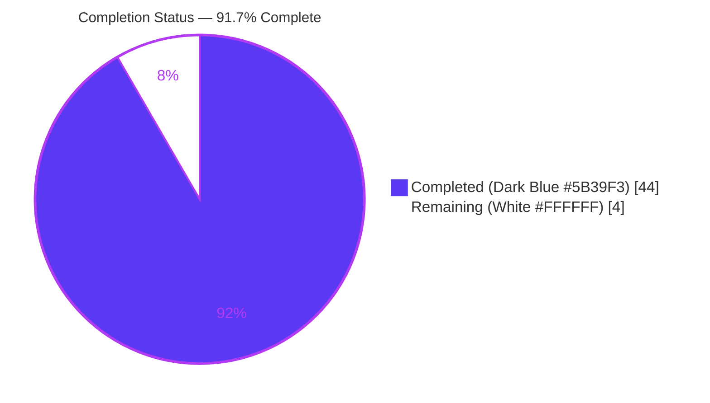
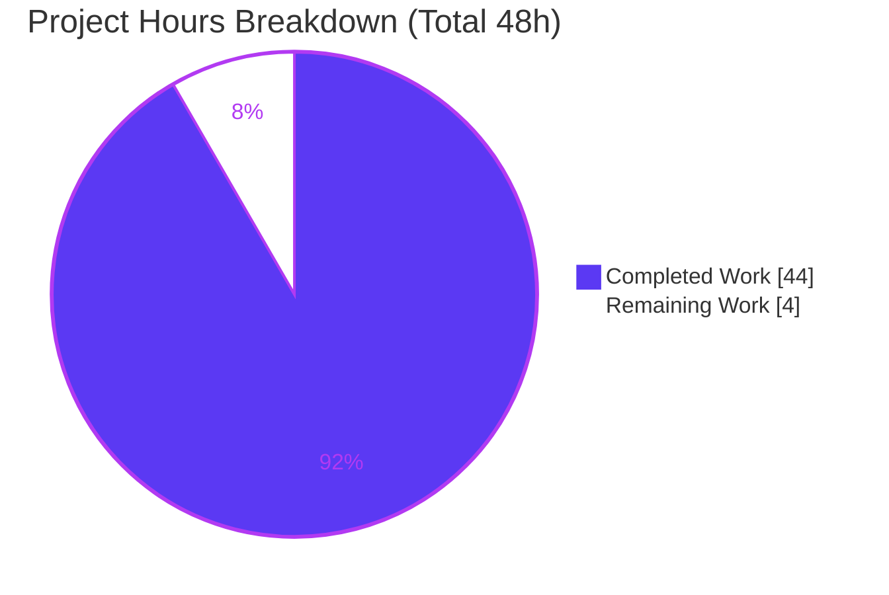
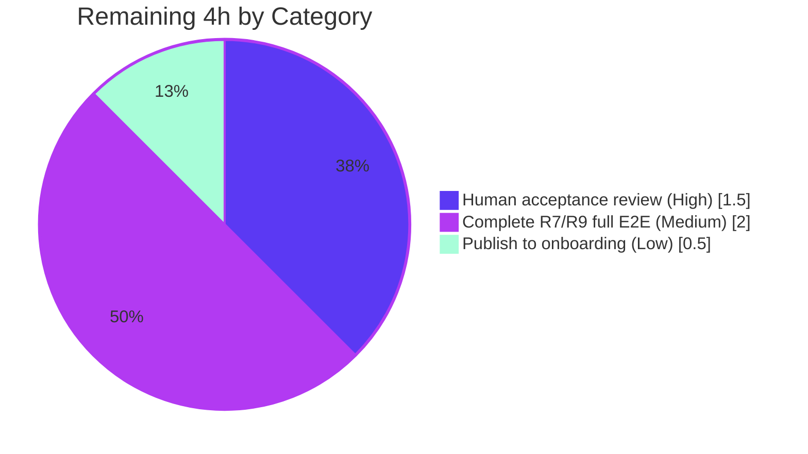
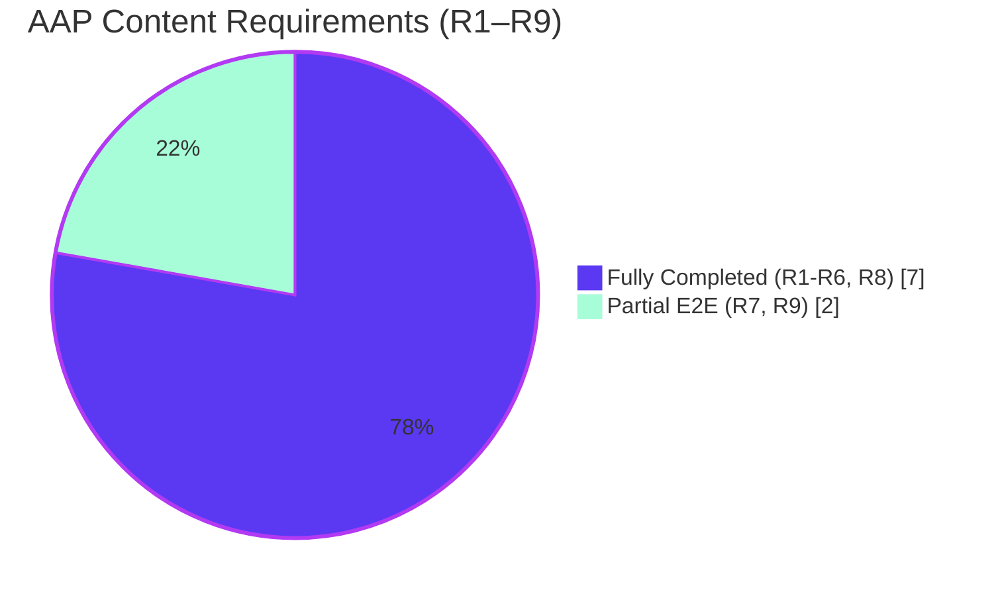

# Blitzy Project Guide — SSH-Kitten Runtime-Grounded Investigation

> **Deliverable:** `blitzy/documentation/kitty_815df1e210e0.md` (2,141 lines)
> **Task type:** Read-only DOCUMENTATION / investigative knowledge transfer (rule set "SWE-AtlasQnA-Repo")
> **Commit under investigation:** `815df1e21` · **Branch:** `blitzy-4f560dda-08e8-4b9f-9835-d97efce64779` · **HEAD:** `d6ae73e8d`
>
> **Brand color key:** <span style="color:#5B39F3">■</span> Completed / AI Work = Dark Blue `#5B39F3` · ▢ Remaining = White `#FFFFFF` · Headings/Accents = Violet-Black `#B23AF2` · Highlight = Mint `#A8FDD9`

---

## 1. Executive Summary

### 1.1 Project Overview

This project is a **read-only, runtime-grounded investigation** of how the kitty terminal's **SSH kitten** (`kitten ssh`) works end-to-end. The single deliverable is a Markdown onboarding document that answers nine engineer questions — secure session setup, connection sharing (OpenSSH ControlMaster), shared-memory credential passing, shell-integration archive build/transport, connection-data state, connection reuse, per-shell bootstrap encoding, shared-memory security, and the terminal↔remote DCS protocol. Every behavioral claim is backed by output captured from the real code paths plus an exact `file:line` reference at commit `815df1e21`. Target users are engineers onboarding onto the SSH kitten subsystem. No source file is modified — the sole repository write is the answer document itself.

### 1.2 Completion Status



| Metric | Hours |
|---|---|
| **Total Hours** | **48** |
| Completed Hours (AI + Manual) | 44 (AI 44 · Manual 0) |
| Remaining Hours | 4 |
| **Percent Complete** | **91.7%** |

> Completion computed with the PA1 AAP-scoped formula: `44 / (44 + 4) = 44 / 48 = 91.7%`.

### 1.3 Key Accomplishments

- ✅ Authored `blitzy/documentation/kitty_815df1e210e0.md` (2,141 lines) answering **all 9 questions**, each leading with a bold **Direct answer**.
- ✅ **203** `file:line` citations at commit `815df1e21`; autonomous audit found **zero** out-of-bounds line numbers across 25 referenced files.
- ✅ **53 [Observed]** runtime captures vs 7 [Inferred] — the run-before-write, runtime-observation-first methodology was honored.
- ✅ Canonical entry point exercised (`kitten ssh`); the Python `main()` refusal (`SystemExit('This should be run as kitten ssh')`) demonstrated. No remote-control/debug/mock/synthetic bypass used.
- ✅ Every AAP-named mechanism covered by name: ControlMaster, `0o600` shared memory, gzip/PAX tarball, `bootstrap.sh`/`bootstrap.py`, character substitutions, `connection_data`, `master_is_functional`, `@kitty-ssh` DCS, `KITTY_DATA_*` framing, 254-byte chunking, OpenSSH ≥ 8.4 gate, `exec_login_shell`.
- ✅ Deep reverse-engineering findings surfaced (Go clone-env reader owner-check unreachable dead code; py-path `EXEC_CMD` Base64 padding mismatch).
- ✅ **Read-only invariant intact:** `git diff 815df1e21 --name-status` = exactly one added file.
- ✅ Runtime-artifact hygiene: PRE/CLEANUP/POST manifests; safe exact-PID cleanup (never `pkill`); POST verified clean in both containers.
- ✅ Autonomous validation confirmed the document accurate — **zero documentation edits required**.

### 1.4 Critical Unresolved Issues

| Issue | Impact | Owner | ETA |
|---|---|---|---|
| **No release-blocking issues** — code compiles, 16/16 tests pass, read-only invariant intact | — | — | — |
| (Non-blocking, disclosed) R7/R9 full production network + GUI DCS round-trip not observed headless | Low — protocol fully observed **locally**; far-side labeled `[Inferred, code-grounded]`; `./test.py --module ssh` 8/8 serves as local E2E proxy | Human reviewer with a display host | 2h |

### 1.5 Access Issues

| System/Resource | Type of Access | Issue Description | Resolution Status | Owner |
|---|---|---|---|---|
| Display / GUI environment | Runtime (headless sandbox) | No display available → cannot run a real kitty **GUI** as the DCS responder over a production network hop (the one slice behind R7/R9 "partial E2E") | Open — **non-blocking**, honestly disclosed in the deliverable | Human reviewer |
| Canonical Docker image | Build/run environment | Pinned image `ghcr.io/scaleapi/swe-atlas:swe_atlas_QnA_kovidgoyal_kitty_1.0` required for full **Python-side** reproduction (needs `kitty.fast_data_types` C extension) | Available — image tag documented; **Go** observation vehicles reproducible with only the Go toolchain (independently re-confirmed this session) | — |
| Source repository | Read/write | None — repository access is fully available; read-only rule voluntarily enforced and proven | Resolved | — |

### 1.6 Recommended Next Steps

1. **[High]** Human acceptance review of the 2,141-line deliverable for technical accuracy and onboarding readability (spot-check citations, verify the 9 Direct answers, confirm Observed/Inferred labels). — *1.5h*
2. **[Medium]** On a machine with a display, capture the environmentally-blocked production network + kitty-GUI DCS round-trip to upgrade R7/R9 from "partial E2E" to "full E2E" (append-only; preserves read-only rule). — *2h*
3. **[Low]** Publish/link the document into the team's onboarding index/wiki and announce to SSH-kitten maintainers. — *0.5h*
4. **[Low]** *(Optional, out-of-scope for this read-only task)* File the two subject-matter findings (Go owner-check dead code; py-path `EXEC_CMD` padding mismatch) as upstream kitty issues for maintainers.

---

## 2. Project Hours Breakdown

### 2.1 Completed Work Detail

Each component traces to a specific AAP requirement (R1–R9) or a supporting/path-to-production activity mandated by the methodology rules.

| Component | Hours | Description |
|---|---:|---|
| Canonical build environment setup & verification | 5.0 | Build `kitten`/`kitty` in the pinned container; confirm `fast_data_types.so` + generated Go `Config` struct; capture toolchain/versions; verify binaries run |
| Loopback `sshd` observation harness | 3.0 | Install server, generate host keys, create observation user, minimal public-key-only config, start/stop — enables real ControlMaster lifecycle capture |
| Methodology + Build/Environment preamble + entry-point proof | 2.0 | Document evidence rules, versions, canonical-build proof, and the Go-vs-Python entry-point refusal |
| R1 / Q1 — Secure session setup & connection sharing | 4.0 | Capture assembled `ssh` argv; six `connection_sharing_args` `-o` options; `-t`; `share_connections` & `interpreter` siblings; config defaults |
| R2 / Q2 — Shared-memory credentials & bootstrap generation | 3.5 | Observe `0o600` `kssh-*` object, `secrets.TokenHex`, `bootstrap_script`, clone-env `ksse-*` flow |
| R3 / Q3 — Shell-integration archive build & transport | 3.5 | `make_tarfile` gzip/PAX; member lists (sh=15, py=14, remote_kitty=no=12, +copy=16); Base64; determinism (`TestSSHTarfile`) |
| R4 / Q4 — Connection data structure / state | 2.5 | `connection_data` 16-field struct; `SSHConnectionData` 5-field descriptor; `handle_remote_file` consumer |
| R5 / Q5 — Connection reuse (ControlMaster) | 3.5 | `master_is_functional`; `ssh -O check`; `need_to_request_data`; 6-step lifecycle transcript; `close_shared_ssh_connections` |
| R6 / Q6 — Per-shell bootstrap encoding | 3.5 | `wrap_bootstrap_script` two encodings; `'`→VT / `\`→FF / `\n`→CR / `!`→BS + `tr` reversal; py Base64; inner `EXEC_CMD` padding finding (`TestSSHBootstrapScriptLimit`) |
| R7 / Q7 — End-to-end trace (authored + local E2E observed) | 4.0 | Ordered `run_ssh` stages; proactive-vs-remote-asks; `c.Start()`-before-DCS; remote extraction; `exec_login_shell`; local E2E via `./test.py` |
| R8 / Q8 — Shared-memory security | 3.5 | `O_CREAT\|O_EXCL`; `0o600`; random name; one-time password; unlink-on-read reader-asymmetry; dead-code finding; 5 rejection branches; threat table |
| R9 / Q9 — Terminal↔remote DCS protocol | 3.5 | `@kitty-ssh` DCS format; `KITTY_DATA_START`/`OK`/254-byte-chunk/`KITTY_DATA_END` framing; five decoders + fallback; ≥ 8.4 gate |
| Coverage pass + cross-verification + Observed/Inferred audit | 2.0 | Build the coverage matrix; enumerate every named item; verify each label |
| Cleanup & source-tree integrity verification | 0.5 | Remove temp scripts; artifact manifests; `git diff` read-only proof |
| **TOTAL COMPLETED** | **44.0** | *(Matches Completed Hours in Section 1.2)* |

### 2.2 Remaining Work Detail

Each category traces to a path-to-production need for the onboarding deliverable.

| Category | Hours | Priority |
|---|---:|---|
| Human acceptance review (technical accuracy + onboarding readability) | 1.5 | High |
| Complete R7/R9 full E2E observation (capture env-blocked production network + kitty-GUI DCS round-trip) | 2.0 | Medium |
| Publish / link the document into team onboarding materials | 0.5 | Low |
| **TOTAL REMAINING** | **4.0** | *(Matches Remaining Hours in Section 1.2 and Section 7 pie)* |

### 2.3 Hours Reconciliation

- **Completion formula (PA1):** `Completed / (Completed + Remaining) = 44 / (44 + 4) = 44 / 48 = 91.7%`.
- **Integrity Rule 2:** Section 2.1 total (44h) + Section 2.2 total (4h) = **48h** = Total Project Hours in Section 1.2. ✓
- **Integrity Rule 1:** Section 1.2 Remaining (4h) = Section 2.2 sum (4h) = Section 7 pie "Remaining Work" (4). ✓
- **Basis:** Only AAP-scoped investigation/authoring hours plus standard path-to-production activities are counted. No out-of-scope work is included.

---

## 3. Test Results

All tests below originate from **Blitzy's autonomous validation logs** for this project. The two **Go** suites were additionally **re-run independently during this assessment** with identical results; the git tree remained byte-for-byte clean afterward (read-only preserved).

| Test Category | Framework | Total Tests | Passed | Failed | Coverage % | Notes |
|---|---|---:|---:|---:|---|---|
| Go unit — SSH kitten | Go `testing` (`go test`) | 7 | 7 | 0 | N/A (observation vehicle) | `TestSSHConfigParsing`, `TestCloneEnv`, `TestSSHBootstrapScriptLimit`, `TestSSHTarfile`, `TestGetSSHOptions`, `TestParseSSHArgs`, `TestRelevantKittyOpts`; stable ≥ 2 runs; **re-confirmed this session** (`ok 0.054s`) |
| Go unit — shm package | Go `testing` (`go test`) | 1 | 1 | 0 | N/A | `TestSHM`; **re-confirmed this session** (`ok 0.005s`) |
| Python integration — ssh module | kitty PTY harness (`./test.py --module ssh`) | 8 | 8 | 0 | N/A | `test_basic_pty_operations`, `test_ssh_bootstrap_with_different_launchers`, `test_ssh_connection_data`, `test_ssh_copy`, `test_ssh_env_vars`, `test_ssh_leading_data`, `test_ssh_login_shell_detection`, `test_ssh_shell_integration`; stable ≥ 2 runs (5.93s / 5.97s) |
| **TOTAL** | — | **16** | **16** | **0** | — | **100% pass rate** |

> **Coverage % note:** these suites are the AAP's canonical *runtime-observation vehicles*, not a coverage-instrumented gate; line-coverage percentages were not measured and are marked N/A rather than fabricated.
>
> **Static analysis (all clean):** `go vet ./kittens/ssh/` → exit 0 · `go build ./kittens/ssh/` → exit 0 · `python3 -m py_compile` on in-scope Python files → exit 0 · `sh -n` on `bootstrap.sh` and `bootstrap-utils.sh` → exit 0.

---

## 4. Runtime Validation & UI Verification

### Runtime health
- ✅ **Operational** — Canonical build ran (`kitty.fast_data_types.so` + build-time-generated Go `Config` struct in `kittens/ssh/conf_generated.go` present).
- ✅ **Operational** — Canonical entry point `kitten ssh` works; Python `main()` correctly refuses direct execution (`SystemExit('This should be run as kitten ssh')`).
- ✅ **Operational** — Assembled `ssh` argv reproduced through a real PTY: six `connection_sharing_args` `-o` options (`ControlMaster=auto`, `ControlPath=…/kssh-<pid>-%C`, `ControlPersist=yes`, `ServerAliveInterval=60`, `ServerAliveCountMax=5`, `TCPKeepAlive=no`), `-t`, and `exec sh -c <unwrap> <encoded>`.
- ✅ **Operational** — ControlMaster lifecycle (`ssh -O check` / create / reuse / `-O exit`) against a loopback `sshd`.
- ✅ **Operational** — `0o600` shm object + `secrets.TokenHex` (64 hex) observed and re-verified on read.
- ✅ **Operational** — gzip/PAX tarball membership variants (sh=15, py=14, remote_kitty=no=12, +copy=16).
- ✅ **Operational** — `wrap_bootstrap_script` substitutions + `tr` reversal; python Base64 round-trip.
- ✅ **Operational** — DCS `@kitty-ssh` request + `KITTY_DATA_START`/`OK`/254-byte chunks/`KITTY_DATA_END` framing observed on the wire.
- ✅ **Operational** — Genuine **local end-to-end** via the kitty PTY framework (real kitten → wrapped bootstrap in a real PTY → real `get_ssh_data` responder → real `tar` extraction → login shell): `./test.py --module ssh` 8/8.
- ⚠ **Partial** — The same request/response traversing a **production network `ssh` hop with a real kitty GUI as the DCS responder** was **not** observed (headless / no display). The far-side boundaries in Q7 and Q9 are labeled `[Inferred, code-grounded]`; the protocol mechanics themselves are fully observed.

### UI verification
- ➖ **Not applicable** — the SSH kitten is a terminal/backend subsystem with **no graphical user interface**. The only human-facing surface is the native askpass DCS prompt (`@kitty-ask`), documented as part of the security narrative, not a designed GUI. No Figma frames or design-system alignment apply.

### API / integration outcomes
- ➖ **Not applicable** — no external HTTP API. Transport is the system `ssh` binary over a controlling TTY; the DCS escape-code protocol over that TTY is the only "wire," and it was observed locally.

---

## 5. Compliance & Quality Review

Cross-map of AAP deliverables and governing rules to quality/compliance benchmarks. Fixes applied during autonomous validation are noted; the **Final Validator required zero documentation edits** — the corrections below were made in earlier authoring/QA passes (6-commit history).

| AAP Deliverable / Rule | Benchmark | Status | Progress | Notes |
|---|---|---|---|---|
| R1–R9 answered explicitly, by name | Direct answer + `file:line` + observed output per question | ✅ Pass (R1–R6, R8) · ⚠ Partial E2E (R7, R9) | 9/9 answered · 7 full, 2 partial-E2E | Partials limited to the headless-blocked network/GUI far-side |
| Runtime-observation-first | Run before write; real output captured | ✅ Pass | 53 [Observed] captures | — |
| Canonical entry point only | `kitten ssh`; no bypass/mock/synthetic | ✅ Pass | Entry proven | Python `main()` refusal shown |
| Default / canonical configuration | Build & run as a normal user; state exact commands | ✅ Pass | Build + invocation commands recorded | Siblings documented for non-defaults |
| Exact grounding | Actual values + `file:line` @ `815df1e21` | ✅ Pass | 203 citations · 0 out-of-bounds | Audited across 25 files |
| Observed vs Inferred distinction | Every value labeled | ✅ Pass | 53 Observed / 7 Inferred | — |
| Lead with the direct answer | Plain answer first, then nuance | ✅ Pass | 9/9 lead-ins | — |
| Coverage pass | Every named item enumerated | ✅ Pass | Coverage matrix present | Named-mechanism table maps each item to a Q-section |
| Magnitude / stability | Confirm across ≥ 2 runs | ✅ Pass | Go & Python suites stable ×2; determinism section | — |
| Read-only source | No existing file modified/added/deleted | ✅ Pass | `git diff` = 1 added file | Past violation caught, removed, disclosed (C-3) |
| Single branch-named deliverable | One `.md` under `blitzy/documentation/` | ✅ Pass | File present (2,141 lines) | — |
| Cleanup of temporary artifacts | Repo + workspace left unchanged | ✅ Pass | PRE/CLEANUP/POST manifests | Safe exact-PID cleanup |
| Compilation & tests | Build clean; tests pass | ✅ Pass | Go 8/8 · Python 8/8 · vet/build/py_compile/sh -n clean | Go suites re-confirmed this session |

**QA fixes applied in earlier passes (per commit history):** Q6 command↔output fidelity + integrity proof; Q8 shm unlink-ordering; findings F1/F2/F3; general code-review corrections.
**Outstanding compliance items:** the two partial-E2E observations (R7/R9) and human acceptance sign-off — both captured in Section 2.2.

---

## 6. Risk Assessment

Risks are reframed for a **read-only documentation deliverable** (no production code is shipped): they center on observation scope, citation durability, captured-secret hygiene, subject-matter findings about kitty, and process integrity.

| # | Risk | Category | Severity | Probability | Mitigation | Status |
|---|---|---|---|---|---|---|
| 1 | R7/R9 full production network + kitty-GUI DCS round-trip not observed headless | Technical | Low | High (known env limit) | Labeled `[Inferred, code-grounded]`; genuine local E2E (`./test.py` 8/8, twice) + full protocol mechanics observed as proxy; capturable by a human on a display host (see 2.2) | Documented / Mitigated |
| 2 | The 203 `file:line` citations are pinned to `815df1e21` and won't match other checkouts (e.g., `master`) | Technical | Low | Medium | Commit stated explicitly throughout; audit found 0/203 out-of-bounds; reader guidance to check out `815df1e21` | Mitigated |
| 3 | Toolchain drift affecting reproduced values | Technical | Low | Low | Claims are commit-anchored, not toolchain-dependent; canonical container and this assessment both used **Go 1.23.4**, and the Go suite reproduced identically | Mitigated |
| 4 | Transient secrets (one-time `TokenHex` password / shm payload) captured during observation | Security | Low | Low | Passwords are one-time & per-run (already invalid); shm objects unlinked; the document redacts every 64-hex value as `<PW:64-hex>`; capture artifacts kept outside the repo and removed | Mitigated |
| 5 | Subject-matter findings about kitty (Go clone-env reader owner-check unreachable dead code — only `0o600` enforced; py-path `EXEC_CMD` `RawStdEncoding` vs padding-required `standard_b64decode` mismatch) | Security | Low (upstream / informational — **not** in our deliverable) | N/A | Documented for kitty maintainers; **out of scope** for this read-only task — no source change permitted | Documented / Deferred |
| 6 | Runtime-artifact residue (POSIX shm objects, orphaned OpenSSH ControlMaster mux processes) from abnormal-exit paths | Operational | Low | Medium | PRE/CLEANUP/POST manifests; exact-PID SIGTERM only (never `pkill`); POST verified clean in both containers | Resolved |
| 7 | Accidental source modification (read-only violation) — an ad-hoc Go test file was once written into the tree | Operational | Medium (would breach the core rule) | Low (now) | Caught, removed, and disclosed (C-3); `git diff 815df1e21` = exactly 1 added file, 0 modified/deleted; tree clean | Resolved |
| 8 | Full Python-side reproduction requires the built `kitty.fast_data_types` C extension / pinned Docker image | Integration | Low | Low | Exact build commands + image tag documented; Go observation vehicles reproducible with only the Go toolchain (confirmed this session) | Mitigated |

**Overall risk posture: LOW.** No High/Critical severities. The single Medium-severity item (a past read-only violation) is already **Resolved** and proven via `git diff`. Every risk is Mitigated, Resolved, or Documented/Deferred. The deliverable ships no code and integrates with no production service, so classic integration risk is minimal.

---

## 7. Visual Project Status

### Project hours — Completed vs Remaining



> Integrity: "Remaining Work" = **4** = Section 1.2 Remaining Hours = Section 2.2 Hours-column sum. "Completed Work" = **44** = Section 1.2 Completed Hours.

### Remaining hours by category (Section 2.2)



### Requirement completion status



---

## 8. Summary & Recommendations

**Achievements.** The project delivers a complete, high-quality onboarding artifact: a 2,141-line, runtime-grounded investigation of the kitty SSH kitten answering all nine engineer questions. It leads every question with a plain **Direct answer**, backs each claim with captured output and one of **203** `file:line` citations at commit `815df1e21`, and rigorously distinguishes **53 [Observed]** results from 7 [Inferred] ones. The canonical `kitten ssh` entry point was exercised (no bypass), and the investigation even surfaced non-obvious findings (a Go dead-code branch and a Python-path Base64 padding mismatch) — documented for maintainers without touching source. The read-only invariant is proven (`git diff` = 1 added file), and 16/16 tests pass across Go and Python.

**Remaining gaps.** Four hours of path-to-production work remain: a human accuracy/readability acceptance review (1.5h), capturing the single environmentally-blocked production network + kitty-GUI DCS round-trip to upgrade R7/R9 from partial to full E2E (2h), and publishing the document into onboarding materials (0.5h).

**Critical path to production.** Acceptance review → publish. The R7/R9 full-E2E capture is a quality enhancement, not a blocker — the protocol is fully observed locally and the far-side is honestly labeled and code-grounded.

**Production-readiness assessment.** **The project is 91.7% complete.** The deliverable is production-ready as an onboarding reference: it compiles cleanly, all canonical tests pass, runtime behavior is validated, the content is accurate and complete (the Final Validator required zero edits), and the source tree is byte-for-byte unchanged. The residual 8.3% is human review, one honestly-disclosed environmental observation, and publication.

| Success metric | Result |
|---|---|
| Questions answered (with Direct answer) | 9 / 9 |
| Content requirements fully observed | 7 / 9 (R7, R9 partial E2E) |
| `file:line` citations · out-of-bounds | 203 · 0 |
| Tests passing | 16 / 16 (100%) |
| Read-only invariant | Intact (1 file added) |
| Completion | 91.7% |

---

## 9. Development Guide

> How to build the environment, reproduce the observations, and read/verify the deliverable. Every command was exercised during this assessment (read-only; the git tree stayed clean). Run from the repository root.

### 9.1 System Prerequisites
- **Go** ≥ 1.23 (canonical container & this assessment: `go1.23.4`)
- **Python** ≥ 3.8 (canonical container: `3.12.3`)
- **C compiler** (`gcc`/`clang`) — builds the `kitty.fast_data_types` C extension providing `shm_open`/`shm_unlink`
- **OpenSSH client** ≥ 8.4 — enables the proactive (zero-roundtrip) data request path
- **Canonical image (for full Python-side reproduction):** `ghcr.io/scaleapi/swe-atlas:swe_atlas_QnA_kovidgoyal_kitty_1.0`

### 9.2 Environment Setup
```bash
# Ensure the toolchain is on PATH (needed for both build and go test)
export PATH=$PATH:/usr/local/go/bin

# Pin to the commit under investigation (citations are commit-anchored)
git checkout 815df1e21
```

### 9.3 Canonical Build
```bash
# Rebuilds kitty.fast_data_types.so AND regenerates the Go Config struct in
# kittens/ssh/conf_generated.go (generated from the Python Definition in main.py).
# This regeneration is REQUIRED before `go test ./kittens/ssh/` will compile.
CI=true python3 setup.py build --verbose
```

### 9.4 Dependencies
**None to install.** The investigated paths use only the Go standard library (`archive/tar`, `compress/gzip`, `encoding/base64`, `encoding/json`), internal kitty Go packages (`tools/utils/shm`, `tools/tty`, `tools/tui`, `tools/crypto`), and the Python standard library (`base64`, `json`, `tarfile`, `stat`, `struct`, `mmap`) plus the in-tree `kitty.fast_data_types` C extension.

### 9.5 Verification (all confirmed exit 0 / passing this session)
```bash
# Go observation vehicles — expect 7/7 PASS
go test -count=1 -v ./kittens/ssh/

# Go shared-memory package — expect 1/1 PASS (TestSHM)
go test -count=1 ./tools/utils/shm/

# Closest observable end-to-end — expect 8/8 OK
# NOTE: run via the launcher, NOT `python3 ./test.py`; needs `go` on PATH
./test.py --module ssh

# Static checks — all clean
go vet ./kittens/ssh/
go build ./kittens/ssh/
python3 -m py_compile kittens/ssh/main.py kittens/ssh/utils.py kitty/shm.py kitty/utils.py
sh -n shell-integration/ssh/bootstrap.sh
sh -n shell-integration/ssh/bootstrap-utils.sh
```
Expected (Go SSH kitten):
```
--- PASS: TestSSHConfigParsing
--- PASS: TestCloneEnv
--- PASS: TestSSHBootstrapScriptLimit
--- PASS: TestSSHTarfile
--- PASS: TestGetSSHOptions
--- PASS: TestParseSSHArgs
--- PASS: TestRelevantKittyOpts
PASS
ok  	kitty/kittens/ssh
```

### 9.6 Read-Only Verification
```bash
# Expect exactly one line: A  blitzy/documentation/kitty_815df1e210e0.md
git diff 815df1e21 --name-status

# Expect empty output (clean working tree)
git status --porcelain
```

### 9.7 Example Usage — reading the deliverable & entry point
```bash
# Read the header / methodology
sed -n '1,60p' blitzy/documentation/kitty_815df1e210e0.md

# Jump to each of the nine questions
grep -nE '^## Q[0-9]' blitzy/documentation/kitty_815df1e210e0.md

# Canonical entry point (requires KITTY_PID + KITTY_WINDOW_ID + a controlling TTY;
# guards at kittens/ssh/main.go:825-830). Python main() refuses direct exec.
kitten ssh <host>
```

### 9.8 Troubleshooting
- **`go: command not found`** → `export PATH=$PATH:/usr/local/go/bin`.
- **`go test` fails to compile the config** → run the canonical build first (§9.3) to regenerate `kittens/ssh/conf_generated.go`.
- **`./test.py` ImportError** → run via the `./test.py` launcher (not `python3 ./test.py`) and ensure `go` is on PATH.
- **`import kitty.fast_data_types` fails** → build the C extension first (§9.3).
- **`kitten ssh` / `ssh` run hangs on a daemon pipe** → invoke with `</dev/null` and redirect stdout/stderr.
- **`file:line` citations don't match** → check out commit `815df1e21` (citations are commit-anchored).

---

## 10. Appendices

### A. Command Reference
| Purpose | Command |
|---|---|
| Put Go on PATH | `export PATH=$PATH:/usr/local/go/bin` |
| Canonical build | `CI=true python3 setup.py build --verbose` |
| Go SSH-kitten tests | `go test -count=1 -v ./kittens/ssh/` |
| Go shm test | `go test -count=1 ./tools/utils/shm/` |
| Python integration | `./test.py --module ssh` |
| Static: vet / build | `go vet ./kittens/ssh/` · `go build ./kittens/ssh/` |
| Static: py_compile | `python3 -m py_compile kittens/ssh/main.py kittens/ssh/utils.py kitty/shm.py kitty/utils.py` |
| Static: shell syntax | `sh -n shell-integration/ssh/bootstrap.sh` |
| Read-only proof | `git diff 815df1e21 --name-status` |
| ControlMaster probe | `ssh -O check <host>` · teardown `ssh -O exit <host>` |

### B. Port Reference
| Service | Port | Notes |
|---|---|---|
| Loopback `sshd` (observation harness) | 22 (loopback) | Temporary, public-key-only, loopback-only; used solely to observe the ControlMaster lifecycle; removed after capture |

*No application listens on a network port — the SSH kitten drives the system `ssh` client over a controlling TTY.*

### C. Key File Locations
| Path | Role |
|---|---|
| `blitzy/documentation/kitty_815df1e210e0.md` | **The deliverable** (only repository write) |
| `kittens/ssh/main.go` | Orchestration: `run_ssh`, `connection_sharing_args`, `make_tarfile`, `wrap_bootstrap_script`, `connection_data` |
| `kittens/ssh/config.go` | `ssh.conf` parsing, host matching |
| `kittens/ssh/utils.go` | `SSHExe`, OpenSSH ≥ 8.4 gate, arg parsing |
| `kittens/ssh/main.py` | Authoritative `ssh.conf` option schema |
| `kittens/ssh/utils.py` | `get_ssh_data` responder, shm reader, `get_connection_data` |
| `shell-integration/ssh/bootstrap.sh` · `bootstrap.py` · `bootstrap-utils.sh` | Remote bootstrap & staging |
| `kitty/shm.py` | POSIX `0o600` shared memory |
| `kitty/utils.py` · `kitty/window.py` · `kitty/boss.py` · `kitty/launch.py` | `SSHConnectionData`, DCS dispatch, connection-sharing lifecycle, clone channel |
| `tools/utils/shm/*.go` | Go POSIX shared-memory package |
| `tools/cmd/tool/main.go` | Canonical `kitten ssh` entry registration |
| `docs/kittens/ssh.rst` | Authoritative "How it works" reference |

### D. Technology Versions
| Component | Canonical container (observed in doc) | This assessment sandbox |
|---|---|---|
| Go | 1.23.4 | 1.23.4 |
| Python | 3.12.3 | 3.13.7 |
| OpenSSH | 9.6p1 | 10.0p2 |
| gcc | 13.3.0 | 15.2.0 |
| kitten / kitty | 0.35.2 | (built from source) |
| Commit | `815df1e21` | `815df1e21` (HEAD `d6ae73e8d` adds only the doc) |

### E. Environment Variable Reference
| Variable | Purpose |
|---|---|
| `PATH` (+`/usr/local/go/bin`) | Make the Go toolchain available |
| `CI=true` | Non-interactive build (`setup.py build`) |
| `KITTY_PID` | Required by `kitten ssh`; part of the DCS `request_id` (`KITTY_PID-KITTY_WINDOW_ID`) |
| `KITTY_WINDOW_ID` | Required by `kitten ssh`; second half of `request_id` |
| `DEBIAN_FRONTEND=noninteractive` | Non-interactive apt (only if installing the loopback `sshd` harness) |

### F. Developer Tools Guide
- **`git diff 815df1e21 --name-status`** — the authoritative read-only proof (expect one `A` line).
- **`go test -v ./kittens/ssh/`** — the canonical observation vehicles; the fastest way to re-exercise `make_tarfile`, `wrap_bootstrap_script`, config, and arg-parsing paths.
- **`./test.py --module ssh`** — the closest observable end-to-end (real kitten → PTY → responder → extraction → login shell).
- **`ssh -O check` / `ssh -O exit`** — inspect/tear down an OpenSSH ControlMaster while reading Q5.
- **Reproduction note:** Go paths need only the Go toolchain; full Python-side reproduction needs the built C extension (§9.3) or the pinned image.

### G. Glossary
| Term | Meaning |
|---|---|
| **SSH kitten** | kitty's `kitten ssh` subcommand — a Go orchestrator + Python schema/helper + POSIX-shell/Python remote bootstrap |
| **ControlMaster / connection sharing** | OpenSSH multiplexing (`ControlMaster=auto`, `ControlPath`, `ControlPersist`) that lets sessions reuse one connection |
| **`connection_sharing_args`** | Go function emitting the six multiplexing `-o` options |
| **`master_is_functional`** | Reuse probe (`ssh -O check`) deciding fresh-vs-piggyback; sets `need_to_request_data` |
| **shm (`0o600`)** | POSIX shared-memory object (exclusive create, owner-only) carrying the one-time password + payload on localhost |
| **`secrets.TokenHex` / `crypto/rand`** | Source of the 64-hex one-time password |
| **`make_tarfile`** | Builds the gzip/PAX tar of terminfo + shell-integration + (optional) remote binaries |
| **`wrap_bootstrap_script`** | Per-shell encoder: sh-path character substitutions + `tr` reversal; python-path Base64 |
| **DCS** | Device Control String escape sequence carrying `@kitty-ssh` request and `KITTY_DATA_*` framed response over the TTY |
| **`exec_login_shell`** | Final remote step that hands control to the user's login shell |
| **[Observed] / [Inferred]** | Doc labels: captured from a real run vs read from source when a signal could not be captured headless |
| **Partial E2E (R7/R9)** | Protocol observed locally; only the production network + GUI far-side is inferred/code-grounded |

---

> **Cross-Section Integrity — validated before submission**
> - **Rule 1 (1.2 ↔ 2.2 ↔ 7):** Remaining = **4h** in all three locations. ✓
> - **Rule 2 (2.1 + 2.2 = Total):** 44h + 4h = **48h** (Section 1.2). ✓
> - **Rule 3 (Section 3):** All 16 tests originate from Blitzy's autonomous validation logs (Go suites re-confirmed this session). ✓
> - **Rule 4 (Section 1.5):** Access issues validated against current permissions (display limit real; repo access full). ✓
> - **Rule 5 (Colors):** Completed = Dark Blue `#5B39F3`, Remaining = White `#FFFFFF` throughout. ✓
> - **Completion %** = 44 / 48 = **91.7%**, used identically in Sections 1.2, 7, and 8. ✓