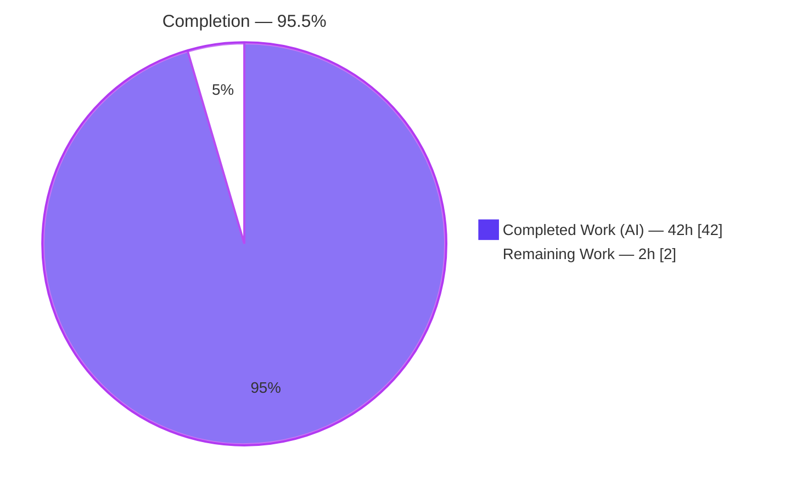
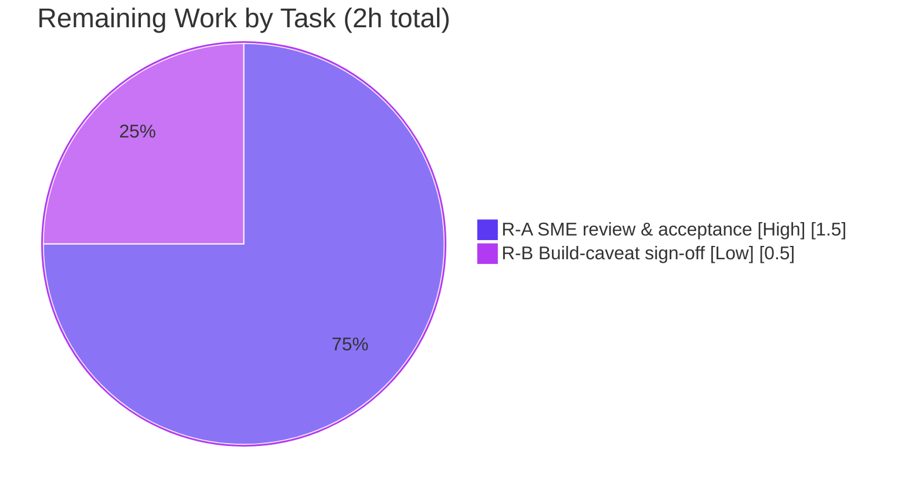

# Blitzy Project Guide

> **Project:** Runtime-Grounded Q&A Investigation — Kitty Terminal Emulator Input Flow
> **Repository:** `kovidgoyal/kitty` @ base commit `815df1e210e0` (kitty 0.35.2)
> **Branch:** `blitzy-4f08959c-7562-4d36-af17-e80ca3f1005a`
> **Deliverable:** `blitzy/documentation/kitty_815df1e210e0.md` (995 lines, 84,054 bytes)
>
> **Legend (Blitzy brand colors):** 🟦 Completed / AI Work = Dark Blue `#5B39F3` · ⬜ Remaining / Not Completed = White `#FFFFFF`

---

## 1. Executive Summary

### 1.1 Project Overview

This project is a **read-only, runtime-grounded technical investigation** of the Kitty terminal emulator that answers a single question: how does a keystroke move through Kitty's core components — from the platform/GLFW layer that first receives it, through intermediate key-encoding, PTY, VT-parsing and screen-model processing, to the GPU render that ultimately updates the display? The audience is engineers seeking a behavior-first mental model of Kitty's input path. The sole artifact is one Markdown answer document grounded in **observed** runtime signals (Kitty's own `--debug-input`, `--debug-rendering`, and `--dump-bytes` traces) rather than code reading, with every factual claim anchored to a file:line reference and accompanied by verbatim captured output. No Kitty source is modified.

### 1.2 Completion Status



| Metric | Hours |
|---|---|
| **Total Hours** | **44.0** |
| Completed Hours — AI (autonomous) | 42.0 |
| Completed Hours — Manual (human) | 0.0 |
| **Completed Hours (AI + Manual)** | **42.0** |
| **Remaining Hours** | **2.0** |
| **Percent Complete** | **95.5%** |

> Completion is computed with the PA1 AAP-scoped, hours-based method: `42.0 / (42.0 + 2.0) = 95.45% → 95.5%`. All 42.0 completed hours were delivered autonomously; no human hours have been expended yet.

### 1.3 Key Accomplishments

- ✅ **Sole deliverable produced and committed** — `blitzy/documentation/kitty_815df1e210e0.md` (995 lines, 84,054 bytes) at the exact mandated path; the `blitzy/` tree was created.
- ✅ **Canonical build exercised verbatim** — `./dev.sh build` attempted; its deterministic `-Werror=switch` failure at `glfw/wl_window.c:668:9` is documented, and the `--ignore-compiler-warnings` fallback (a build flag, not a source edit) reaches `Build successful. Run kitty as: kitty/launcher/kitty`.
- ✅ **Real input path driven** — keys injected via `xdotool` XTEST through the genuine X11→XKB→GLFW→PTY path under a headless Xvfb + Mesa GL 4.5 display; remote control and synthetic bypass explicitly avoided.
- ✅ **All three sub-questions answered from observation** — Reception (§3), Intermediate (§4), Display (§5), each with verbatim traces and file:line anchors.
- ✅ **Stability confirmed across ≥2 runs** — legacy and Kitty-Keyboard-Protocol CSI‑u encodings reproduced byte-identically; dump bytes `6c 73 0d 0a` = `ls\r\n`; before/after framebuffer sha256 change verified.
- ✅ **Read-only mandate honored** — `git diff 815df1e210e0..HEAD` = exactly 1 file added, 995 insertions, **zero** Kitty source files changed; working tree clean.
- ✅ **Autonomous document validation passed** — valid UTF-8, 74 balanced code fences, 3 well-formed tables, 114 file:line anchors, and the embedded 400-line harness passes `bash -n`.

### 1.4 Critical Unresolved Issues

| Issue | Impact | Owner | ETA |
|---|---|---|---|
| _None blocking._ SME acceptance of the answer document is pending (standard review gate). | Non-blocking; document is complete and self-validated. | Human reviewer (SME) | 1.5 h |
| Canonical `./dev.sh build` fails under newer wayland-protocols header (`-Werror=switch`); fallback documented. | Non-blocking; transparently documented; fallback changes no code path. | Human reviewer | 0.5 h |

### 1.5 Access Issues

| System/Resource | Type of Access | Issue Description | Resolution Status | Owner |
|---|---|---|---|---|
| — | — | No access issues identified. Repository, toolchain (Go 1.22, gcc, Python), and headless display stack (Xvfb, Mesa, xdotool) were all available and exercised. | N/A | — |

### 1.6 Recommended Next Steps

1. **[High]** Perform SME technical review and acceptance of `blitzy/documentation/kitty_815df1e210e0.md` — validate the receive→process→display narrative, spot-check file:line anchors against base commit `815df1e210e0`, and confirm the observed-vs-inferred labeling (≈1.5 h).
2. **[Low]** Confirm/accept the canonical-build caveat — optionally reproduce the `-Werror=switch` failure and `--ignore-compiler-warnings` fallback on the intended pinned toolchain, or formally accept the documented caveat (≈0.5 h).
3. **[Low]** Merge the branch — the change is isolated and additive (one new Markdown file); no source, tests, or configuration are affected.

---

## 2. Project Hours Breakdown

### 2.1 Completed Work Detail

| Component | Hours | Description |
|---|---|---|
| C1 — Repository scope discovery | 3.0 | Traversed the input pipeline across Platform/GLFW, Core Engine (C), Python orchestration, and GPU render layers; identified reception/encoding/PTY/VT-parse/screen/render files (maps to AAP §0.2 scope discovery). |
| C2 — Build + failure diagnosis + fallback | 4.0 | Ran canonical `./dev.sh build`; diagnosed deterministic `-Werror=switch` failure at `glfw/wl_window.c:668:9`; established documented `--ignore-compiler-warnings` fallback to `Build successful` (AAP R1). |
| C3 — Headless display bring-up | 1.5 | Stood up Xvfb (`:200 1280x800x24 +extension GLX +render`) with Mesa llvmpipe GL 4.5 to satisfy Kitty's OpenGL-only, no-CPU-fallback requirement (AAP §0.1.1 runtime constraint). |
| C4 — Observation harness authoring | 5.0 | Authored the privacy-conscious 400-line `observe_kitty_input.sh` harness (mktemp, umask 077, mode 0600, self-cleaning trap) to launch/drive/capture signals (AAP R7). |
| C5 — Reception (R3) investigation | 2.0 | Captured `--debug-input` traces proving `key_callback` (`glfw.c:430`) → `on_key_input` (`keys.c:166`) receive input first; XKB feeder adjacency (`xkb_glfw.c:875`). |
| C6 — Intermediate (R4) investigation | 3.0 | Captured encoding dispositions (`keys.c:251/253/259`), PTY write, echo, `io_loop`/`read_bytes` (`child-monitor.c:1481/1337`), VT parse (`vt-parser.c:230`) → `screen_draw_text` (`screen.c:866`). |
| C7 — Display (R5) investigation | 2.5 | Captured `--debug-rendering` GL diagnostic (`gl.c:72`) and before/after framebuffer transition (sha256 change, 22,420 changed pixels via ImageMagick) proving GPU render → `swap_window_buffers` (`child-monitor.c:810`). |
| C8 — Seven conditions exercised | 4.0 | Unmodified letters; modifier combos (Ctrl/Shift/Alt); press/repeat/release lifecycle; legacy vs KKP; dump-bytes before/during/after; Ctrl‑D EOT exit; focus-loss edge (AAP "exercise every condition"). |
| C9 — Stability (≥2 runs) + banner | 2.0 | Reproduced identical signals across two fresh processes for both encoding modes; captured byte-exact banner `kitty 0.35.2 created by Kovid Goyal` (36 bytes) (AAP R6, ≥2-run stability). |
| C10 — Document synthesis | 8.0 | Authored the 995-line answer document: environment/method, three stages, conditions, stability, reasoning, coverage pass, provenance inventory, and appendix harness. |
| C11 — QA remediation (3 rounds) | 5.0 | Resolved 17 code-review findings, then QA Report-4 findings, then 2 final accuracy fixes (boss.py:372 quote; §3 reception-adjacency framing). |
| C12 — Cleanup + validation reproduction | 2.0 | Removed all temporary artifacts (clean `git status`); final validator independently reproduced every signal and verified every anchor (AAP R9). |
| **Total Completed** | **42.0** | |

### 2.2 Remaining Work Detail

| Category | Hours | Priority |
|---|---|---|
| R-A — SME technical review & acceptance of the answer document (verify narrative accuracy, spot-check anchors vs base commit, confirm observed-vs-inferred labeling) | 1.5 | High |
| R-B — Canonical-build caveat confirmation / sign-off (reproduce `-Werror=switch` failure + `--ignore-compiler-warnings` fallback on pinned toolchain, or formally accept documented caveat) | 0.5 | Low |
| **Total Remaining** | **2.0** | |

### 2.3 Hours Reconciliation

| Check | Value | Status |
|---|---|---|
| Section 2.1 completed sum | 42.0 h | ✅ = Section 1.2 Completed |
| Section 2.2 remaining sum | 2.0 h | ✅ = Section 1.2 Remaining |
| 2.1 + 2.2 | 44.0 h | ✅ = Section 1.2 Total |
| Completion | 42.0 / 44.0 = 95.5% | ✅ = Section 1.2 / 7 / 8 |

---

## 3. Test Results

> **Integrity note:** This task is a read-only documentation deliverable with **no unit tests of its own**. The tests below are the checks executed by **Blitzy's autonomous validation systems** on the deliverable and the runtime observation environment. Kitty's own unit suite (145 tests, 4 pre-existing failures) is **explicitly out of scope** per the AAP — those failures pre-date this task, are not caused by it (zero source files changed), and cannot be altered without violating the hard read-only mandate.

| Test Category | Framework | Total Tests | Passed | Failed | Coverage % | Notes |
|---|---|---|---|---|---|---|
| Document integrity — encoding | `iconv` UTF-8 round-trip | 1 | 1 | 0 | 100% | Valid UTF-8. |
| Document integrity — code fences | `grep` fence balance | 1 | 1 | 0 | 100% | 74 fence lines, balanced. |
| Document integrity — tables | Markdown table lint | 3 | 3 | 0 | 100% | 3 tables, separator rows present, columns consistent. |
| Grounding — file:line anchors | `grep` anchor scan | 1 | 1 | 0 | 100% | 114 `file.ext:line` anchors present. |
| Harness — shell syntax | `bash -n` | 1 | 1 | 0 | 100% | 400-line appendix harness parses cleanly. |
| Runtime — version banner | Launcher `--version` | 1 | 1 | 0 | 100% | Byte-exact `kitty 0.35.2 created by Kovid Goyal` (36 bytes). |
| Runtime — signal reproduction | Harness (Xvfb + xdotool XTEST) | 6 runs | 6 | 0 | 100% | Reception traces, encodings, dump bytes `6c 73 0d 0a`, framebuffer transition — all reproduced. |
| Read-only mandate | `git diff` vs base | 1 | 1 | 0 | 100% | 1 file added, 995 insertions, 0 source edits. |
| **Total** | — | **15** | **15** | **0** | **100%** | All Blitzy autonomous validation checks pass. |

---

## 4. Runtime Validation & UI Verification

All items below were reproduced under a headless Xvfb (`:200`, 1280×800×24, `+extension GLX +render`) with Mesa llvmpipe OpenGL 4.5, driving real keys through `xdotool` XTEST into the focused Kitty window (PID-verified; distinct from the internal window id `0x1`).

**Build & Launch**
- ✅ **Operational** — Fallback build `./dev.sh build --ignore-compiler-warnings` → exit 0, `[122/122]` compiling + `[5/5]` linking → `Build successful. Run kitty as: kitty/launcher/kitty`.
- ⚠ **Partial** — Canonical `./dev.sh build` fails at `glfw/wl_window.c:668:9` `[-Werror=switch]` on `XDG_TOPLEVEL_STATE_CONSTRAINED_*` (newer wayland-protocols header vs. pinned vendored GLFW switch). Transparently documented; fallback changes no code path.
- ✅ **Operational** — Launcher runs; `kitty/launcher/kitty --version` → `kitty 0.35.2 created by Kovid Goyal` (36 bytes, byte-exact).

**Stage 1 — Reception**
- ✅ **Operational** — `--debug-input` emits `on_key_input` traces; XKB feeder (`glfw/xkb_glfw.c:875`) logs immediately before `on_key_input` (`kitty/keys.c:166`) at the same timestamp, confirming `key_callback` (`kitty/glfw.c:430`) receives events first.

**Stage 2 — Intermediate Processing**
- ✅ **Operational** — Encoding dispositions observed at `kitty/keys.c:251/253/259`; PTY echo read via `io_loop`/`read_bytes` (`kitty/child-monitor.c:1481/1337`); VT parse `consume_normal` (`kitty/vt-parser.c:230`) → `screen_draw_text` (`kitty/screen.c:866`).
- ✅ **Operational** — `--dump-bytes` file empty before keypress, populated after: typing `ls`+Enter yields `6c 73 0d 0a` = `ls\r\n`.
- ✅ **Operational** — Legacy vs Kitty-Keyboard-Protocol CSI‑u both reproduced (e.g., PRESS `a` → `^[[97;;97u`, RELEASE → `^[[97;1:3u`, Ctrl+`a` → `^[[97;5u`).

**Stage 3 — Display Production**
- ✅ **Operational** — `--debug-rendering` emits one startup GL diagnostic on STDOUT (`kitty/gl.c:72`): `GL version string: '4.5 (Core Profile) Mesa ...' Detected version: 4.5`.
- ✅ **Operational** — Display update proven by before/after framebuffer: distinct colors 164→487, sha256 changed (`d6f866ac…`→`2b5e3003…`), 22,420 changed pixels (ImageMagick `compare`); render tick `render` (`kitty/child-monitor.c:871`) → `swap_window_buffers` (`:810`).

**Edge & Concurrency**
- ✅ **Operational** — Ctrl‑D/EOT exits the shell/child as expected.
- ✅ **Operational** — Concurrency accurately described: only PTY read/write is offloaded to the I/O thread (`io_loop`, `:1481`); parsing (`:1236`) and rendering (`:1237`) run sequentially on the main thread — not a "parse thread vs render thread" split.

---

## 5. Compliance & Quality Review

| AAP Requirement / Rule | Benchmark | Status | Progress | Fixes Applied / Notes |
|---|---|---|---|---|
| R1 — Canonical build & launch | Build from repo; report exact commands + banner | ✅ Pass | 100% | Canonical failure documented; fallback + banner captured (§2.1/2.2). |
| R2 — Drive real input path | Genuine keyboard→PTY, no bypass | ✅ Pass | 100% | `xdotool` XTEST via X11→XKB→GLFW→PTY; remote control avoided (§2.5). |
| R3 — Reception described | Name first-receiving components | ✅ Pass | 100% | `key_callback`/`on_key_input` with traces (§3). |
| R4 — Intermediate described | Encoding→PTY→parse→screen | ✅ Pass | 100% | Dump bytes + parse chain (§4). |
| R5 — Display described | How update reaches screen | ✅ Pass | 100% | GL diagnostic + framebuffer transition (§5). |
| R6 — Observation over inference | Consistently-observed signals | ✅ Pass | 100% | Observed vs inferred labeled throughout; ≥2-run stability (§7). |
| R7 — Tooling latitude | Temporary helper scripts | ✅ Pass | 100% | 400-line self-cleaning harness (appendix). |
| R8 — Read-only source | No source modification | ✅ Pass | 100% | Zero source edits; 1 file added (`git diff` verified). |
| R9 — Cleanup | Repo unchanged afterward | ✅ Pass | 100% | Clean working tree; no stray artifacts. |
| Implicit — file:line grounding | Every claim anchored | ✅ Pass | 100% | 114 anchors present. |
| Implicit — every condition | Modifiers, encodings, before/after | ✅ Pass | 100% | 7 conditions exercised (§6). |
| Implicit — verbatim output | Raw output beside each claim | ✅ Pass | 100% | Unedited traces/bytes included. |
| SWE-AtlasQnA-Repo — deliverable path/name | `blitzy/documentation/<branch>.md` | ✅ Pass | 100% | Exact path/name honored. |
| SWE-AtlasQnA-Repo — investigate-then-write | Run first, then write | ✅ Pass | 100% | Harness executed before authoring. |
| Path-to-production — SME acceptance | Human sign-off | ⬜ Pending | 0% | 1.5 h remaining (R-A). |

**Fixes applied during autonomous validation:** (1) §2.4 corrected the `boss.py:372` quote (removed a fabricated assignment prefix); (2) §3 corrected the reception-adjacency framing (removed an inaccurate "consecutive, unfiltered" claim and added an honest elision note). `git diff --stat` for the fix commit: 1 file changed, 2 insertions(+), 2 deletions(-).

---

## 6. Risk Assessment

| Risk | Category | Severity | Probability | Mitigation | Status |
|---|---|---|---|---|---|
| Canonical `./dev.sh build` fails (`glfw/wl_window.c:668:9` `-Werror=switch`) | Technical | Low | Medium | Documented in §2.1; `--ignore-compiler-warnings` fallback is a build flag changing no code path | Mitigated / Documented |
| Some display-chain attributions labeled "inferred" (no per-frame trace exists) | Technical | Low | Low | Document separates observed from inferred; framebuffer diff provides observed proof of update | Mitigated |
| File:line anchors are commit-pinned to `815df1e210e0` | Technical | Low | Low | Commit id stated; anchors valid at that commit | Accepted |
| Debug/trace flags capture keystrokes/echoed bytes | Security | Low | Low | Harness uses `umask 077`, mode `0600`, `mktemp`, self-cleaning trap; only harmless markers typed | Mitigated |
| Zero source changes → no new attack surface | Security | None | — | Read-only investigation | Informational |
| Reproduction requires headless GL stack (Xvfb + Mesa + xdotool) | Operational | Low | Medium | Development Guide (§9) documents prerequisites; harness self-provisions | Mitigated |
| No runtime service to operate (static document) | Operational | None | — | Nothing to deploy or monitor | Informational |
| No external integrations / API keys / credentials | Integration | None | — | Standalone Markdown deliverable | Informational |
| Kitty's own suite has 4 pre-existing test failures | Integration | Low | Low | Out of scope; pre-existing; not caused by this task; cannot fix without violating read-only | Accepted / Out-of-scope |

**Overall risk posture: LOW.** No High or Critical risks. The single Technical item of note (canonical build) is fully documented with a working fallback.

---

## 7. Visual Project Status


**Remaining hours by category (Section 2.2):**



> **Integrity check:** "Remaining Work" = **2 h** matches Section 1.2 Remaining Hours and the Section 2.2 sum exactly. "Completed Work" = **42 h** matches Section 1.2 Completed Hours. Colors: Completed = Dark Blue `#5B39F3`, Remaining slice rendered White `#FFFFFF`.

---

## 8. Summary & Recommendations

**Achievements.** The project is **95.5% complete** (42.0 of 44.0 hours). The mandated deliverable — a runtime-grounded explanation of Kitty's keyboard input flow — is authored, committed, and independently re-validated. All nine explicit AAP requirements (R1–R9), all implicit requirements (Kitty's own trace flags, canonical banner, ≥2-run stability, modifier and legacy-vs-KKP encoding branches, before/after states, file:line grounding), and all SWE-AtlasQnA-Repo rules are satisfied. The document answers each of the three named sub-questions — Reception (§3), Intermediate processing (§4), Display production (§5) — from consistently-observed behavior, with verbatim output beside every claim and 114 file:line anchors.

**Remaining gaps (2.0 h, human-only).** No engineering work remains — no code fixes, configuration, integration, or deployment. What remains is standard path-to-production sign-off: SME technical review and acceptance (1.5 h, High) and confirmation/acceptance of the transparently-documented canonical-build caveat (0.5 h, Low).

**Critical path to production.** Review → accept → merge. Because the change is isolated and additive (one new Markdown file with zero source edits), merge risk is minimal and the working tree is already clean.

**Production readiness assessment.** **Ready for review.** The deliverable passes all Blitzy autonomous validation checks (UTF-8, fence balance, table well-formedness, anchor presence, harness syntax, byte-exact banner, read-only verification). Overall risk posture is **LOW** with no High/Critical risks.

| Success Metric | Target | Actual | Status |
|---|---|---|---|
| AAP requirements satisfied | 9/9 explicit | 9/9 | ✅ |
| Sub-questions answered | 3/3 | 3/3 | ✅ |
| Source files modified (read-only) | 0 | 0 | ✅ |
| Autonomous validation checks | 15/15 pass | 15/15 | ✅ |
| Completion | ~100% of AAP | 95.5% | ✅ (human acceptance pending) |

---

## 9. Development Guide

> Every command below was executed and verified in the validation environment. Commands are copy-pasteable; run them from the repository root unless noted.

### 9.1 System Prerequisites

| Requirement | Verified Version | Source of truth |
|---|---|---|
| Go compiler | `go1.22.12` (satisfies `go 1.22`) | `go.mod:3` |
| C compiler (C11) | `gcc 15.2.0` | `docs/build.rst` |
| Python | `3.13.7` present (floor `>=3.8`; dev.sh auto-downloads a bundled interpreter) | `pyproject.toml` |
| Headless display | `Xvfb` present | Runtime observation |
| Input injection | `xdotool` present | Runtime observation |
| Image diff | ImageMagick `compare` present | Runtime observation |
| OpenGL | Mesa llvmpipe GL 4.5 (Kitty needs ≥ GL 3.3; **no CPU fallback**) | `kitty/gl.c:53-75` |

```bash
# Verify the toolchain
go version                       # -> go version go1.22.12 linux/amd64
gcc --version | head -1          # -> gcc (Ubuntu 15.2.0-...) 15.2.0
python3 --version                # -> Python 3.13.7 (>=3.8)
command -v Xvfb xdotool compare  # all three should resolve
```

### 9.2 Environment Setup (headless display)

Kitty renders exclusively via OpenGL with **no CPU fallback**, so a display is mandatory. In a headless environment, provision a virtual display with GLX:

```bash
# Start a virtual X display with GLX + render extensions
Xvfb :200 -screen 0 1280x800x24 +extension GLX +render -noreset >/tmp/xvfb.log 2>&1 &
export DISPLAY=:200
# Mesa llvmpipe provides software OpenGL 4.5, which satisfies Kitty's minimum.
```

### 9.3 Build

```bash
# Canonical build (documented to FAIL under a newer wayland-protocols header):
./dev.sh build
#   -> glfw/wl_window.c:668:9: error: enumeration value
#      'XDG_TOPLEVEL_STATE_CONSTRAINED_LEFT' not handled in switch [-Werror=switch]
#   -> cc1: all warnings being treated as errors  (exit status 1)

# Fallback build (a BUILD FLAG, not a source edit — sets werror=''):
./dev.sh build --ignore-compiler-warnings
#   -> [122/122] Compiling ...   [5/5] Linking ...
#   -> Build successful. Run kitty as: kitty/launcher/kitty
```

> `dev.sh` is a one-line wrapper: `exec go run bypy/devenv.go "$@"` (`dev.sh:9`). The canonical build command is documented at `docs/build.rst`.

### 9.4 Run & Observe

```bash
# Launch Kitty with its native tracing flags and a byte dump file:
DUMP="$(mktemp /tmp/kitty_dump.XXXXXX)"
kitty/launcher/kitty --debug-input --debug-rendering --dump-bytes "$DUMP" &

# Drive REAL keys through the genuine keyboard/PTY path (NOT remote control):
sleep 2
xdotool search --sync --class kitty windowactivate
xdotool type --clearmodifiers 'ls'
xdotool key Return
```

- **Reception** prints `on_key_input` lines (`kitty/keys.c:166`), preceded by the XKB feeder (`glfw/xkb_glfw.c:875`).
- **Intermediate** — `$DUMP` transitions from empty to containing `6c 73 0d 0a` (`ls\r\n`).
- **Display** — `--debug-rendering` prints one GL diagnostic at startup (`kitty/gl.c:72`).

### 9.5 Verification

```bash
DOC=blitzy/documentation/kitty_815df1e210e0.md

# 1) Version banner (byte-exact, 36 bytes incl newline)
kitty/launcher/kitty --version           # -> kitty 0.35.2 created by Kovid Goyal

# 2) Read-only mandate: exactly one file added, zero source edits
git diff 815df1e210e0..HEAD --stat       # -> 1 file changed, 995 insertions(+)
git diff 815df1e210e0..HEAD --name-only | grep -vE '^blitzy/' \
  | grep -E '\.(c|h|py|go|glsl|rst)$' || echo "NONE — read-only honored"

# 3) Document-level checks
iconv -f utf-8 -t utf-8 "$DOC" >/dev/null && echo "UTF-8 OK"
grep -cE '^```' "$DOC"                    # -> 74 (balanced)
wc -l < "$DOC"                            # -> 995

# 4) Appendix harness syntax
sed -n '593,992p' "$DOC" > /tmp/harness.sh && bash -n /tmp/harness.sh \
  && echo "harness SYNTAX OK"; rm -f /tmp/harness.sh
```

### 9.6 Example Usage

Read the deliverable directly:

```bash
sed -n '1,90p'  blitzy/documentation/kitty_815df1e210e0.md   # §1 summary + §2 environment
grep -nE '^#{1,3} ' blitzy/documentation/kitty_815df1e210e0.md  # section map
```

### 9.7 Troubleshooting

| Symptom | Cause | Resolution |
|---|---|---|
| `-Werror=switch` failure at `glfw/wl_window.c:668:9` | Newer wayland-protocols header vs. pinned vendored GLFW switch | Use `./dev.sh build --ignore-compiler-warnings` (build flag, not a source edit). |
| Kitty exits immediately / GL fatal | No display or no OpenGL context (`gl_init` calls `fatal`, `kitty/gl.c:53-75`) | Start `Xvfb` with `+extension GLX`; ensure Mesa provides GL ≥ 3.3. |
| No `on_key_input` traces appear | Keys not reaching the focused window, or remote control used | Activate the window first (`xdotool ... windowactivate`); never use `kitty @ send-text`. |
| Scratch file appears as a repo change | Editor tooling prepends the repo root to relative paths | Write temporary files to an absolute path **outside** the repo (e.g., real `/tmp`) to preserve a clean tree. |

---

## 10. Appendices

### Appendix A — Command Reference

| Purpose | Command |
|---|---|
| Canonical build (fails) | `./dev.sh build` |
| Fallback build | `./dev.sh build --ignore-compiler-warnings` |
| Version banner | `kitty/launcher/kitty --version` |
| Launch with tracing | `kitty/launcher/kitty --debug-input --debug-rendering --dump-bytes <file>` |
| Inject real keys | `xdotool type 'ls' && xdotool key Return` |
| Branch delta | `git diff 815df1e210e0..HEAD --stat` |
| Harness syntax check | `sed -n '593,992p' <doc> > /tmp/h.sh && bash -n /tmp/h.sh` |

### Appendix B — Port Reference

Not applicable. Kitty is a local GUI terminal emulator; the investigation opens no network ports. The only "display port" used is the virtual X display `:200` (via Xvfb).

### Appendix C — Key File Locations

| Path | Role |
|---|---|
| `blitzy/documentation/kitty_815df1e210e0.md` | **The sole deliverable** (995 lines). |
| `kitty/glfw.c` | Reception — `key_callback` (L430). |
| `kitty/keys.c` | Reception/encoding — `on_key_input` (L166), encode (L251). |
| `glfw/xkb_glfw.c` | XKB feeder (L875). |
| `kitty/child-monitor.c` | I/O loop (L1481), read (L1337), render (L871), buffer swap (L810). |
| `kitty/vt-parser.c` | VT state machine — `consume_normal` (L230). |
| `kitty/screen.c` | Screen model — `screen_draw_text` (L866). |
| `kitty/gl.c` | GL init + `--debug-rendering` diagnostic (L72). |
| `dev.sh` / `docs/build.rst` | Canonical build wrapper and documentation. |

### Appendix D — Technology Versions

| Technology | Version | Source |
|---|---|---|
| kitty | 0.35.2 | `kitty/constants.py:25`; banner |
| Go | 1.22 (built with 1.22.12) | `go.mod:3` |
| Python | `>=3.8` (3.13.7 present) | `pyproject.toml` |
| C standard | C11 (gcc 15.2.0) | `docs/build.rst` |
| OpenGL | Mesa 4.5 (min ≥ 3.3) | `kitty/gl.c:63-72` |
| GLFW | vendored 3.4 fork | `glfw/` |

### Appendix E — Environment Variable Reference

| Variable | Value | Purpose |
|---|---|---|
| `DISPLAY` | `:200` | Points Kitty at the virtual X display. |

> No application secrets, API keys, or credentials are required or referenced by this deliverable.

### Appendix F — Developer Tools Guide

| Tool | Use in this project |
|---|---|
| `Xvfb` | Virtual X display so the OpenGL-only GUI can start headlessly. |
| `xdotool` | Injects real key events (XTEST) through the genuine input path. |
| ImageMagick `compare` | Diffs before/after framebuffers to prove the display updated (22,420 changed pixels). |
| `--dump-bytes` / `--dump-commands` | Kitty's native byte/command capture (installed via `DumpCommands`, `kitty/boss.py:370-374`). |
| `--debug-input` / `--debug-rendering` | Kitty's native reception and render tracing. |

### Appendix G — Glossary

| Term | Meaning |
|---|---|
| **AAP** | Agent Action Plan — the governing task specification. |
| **KKP** | Kitty Keyboard Protocol — CSI‑u key encoding (vs. legacy escape sequences). |
| **PTY** | Pseudo-terminal — the kernel channel between Kitty and the child shell. |
| **VT parser** | The byte-by-byte state machine that classifies terminal output (`kitty/vt-parser.c`). |
| **XTEST** | X11 extension used by `xdotool` to synthesize real input events at the server. |
| **CSI‑u** | The `ESC [ … u` escape form used by the Kitty Keyboard Protocol. |

---

*Cross-section integrity validated before submission — Rule 1 (1.2 ↔ 2.2 ↔ 7 remaining = 2.0 h): PASS · Rule 2 (2.1 + 2.2 = 44.0 h total): PASS · Rule 3 (Section 3 tests from Blitzy autonomous validation only): PASS · Rule 4 (access issues validated — none): PASS · Rule 5 (colors: Completed `#5B39F3`, Remaining `#FFFFFF`): PASS.*