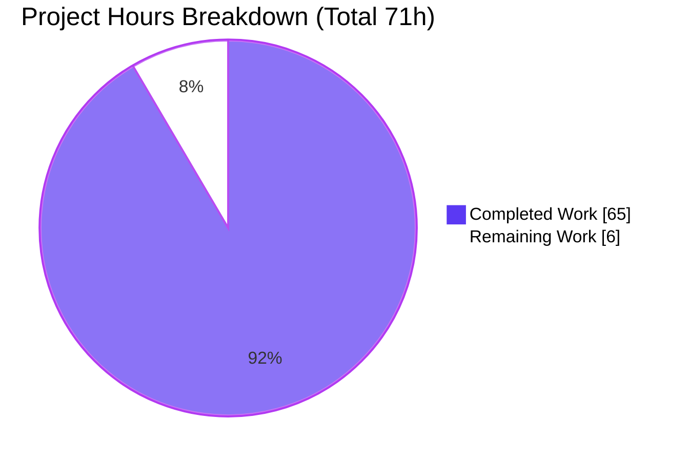
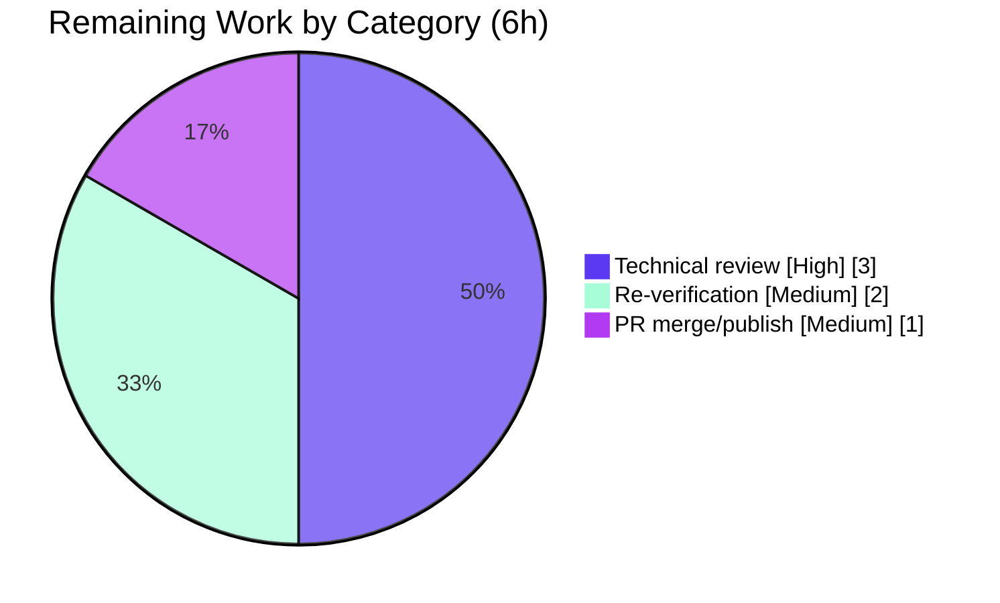

# Blitzy Project Guide

> **Project:** Runtime-evidence answer document — *How Kitty Divides Rendering-Adjacent Work Across Python, C, and Go*
> **Repository:** `kovidgoyal/kitty` (fork) · **Source commit:** `815df1e210e0a9ab4622f5c7f2d6891d7dbeddf1`
> **Branch:** `blitzy-48a4c3b0-fafe-44f0-b8c8-8899e93e09f1` · **HEAD:** `7d9bc27ef`
> **Deliverable:** `blitzy/documentation/kitty_815df1e210e0.md`

---

## 1. Executive Summary

### 1.1 Project Overview

This project is a **documentation-only, runtime-investigation deliverable**: a single Markdown answer document that explains — grounded strictly in captured runtime evidence rather than source reading — how the Kitty GPU-accelerated terminal divides rendering-adjacent work across three languages. **C** owns the performance-critical core engine (VT parsing, screen/scrollback model, GPU shaders, font rasterization) compiled into the CPython extension `kitty.fast_data_types.so`; **Python** (embedded CPython) orchestrates startup, window/tab/child lifecycle, configuration, and the remote-control command surface inside the main process; **Go** compiles the standalone `kitten` CLI binary that runs as separate child processes. The audience is engineers and reviewers needing a verifiable, evidence-backed architectural explanation. The source repository was treated as strictly read-only; the only write is the answer document itself.

### 1.2 Completion Status


**Completion: 91.5%** — calculated on AAP-scoped work only, using the hours-based formula `Completed / (Completed + Remaining) × 100 = 65 / 71 × 100 = 91.5%`.

| Metric | Hours |
|--------|------:|
| **Total Hours** | **71.0** |
| Completed Hours (AI + Manual) | 65.0 |
| &nbsp;&nbsp;• AI (autonomous) | 65.0 |
| &nbsp;&nbsp;• Manual (human, to date) | 0.0 |
| **Remaining Hours** | **6.0** |

> Colors: **Completed = Dark Blue `#5B39F3`**, **Remaining = White `#FFFFFF`**.

### 1.3 Key Accomplishments

- ✅ **Single deliverable produced** — `blitzy/documentation/kitty_815df1e210e0.md` (5,114 lines, 246,932 bytes), answering all eight objectives O1–O8.
- ✅ **Read-only mandate perfectly honored** — `git diff 815df1e21..HEAD --name-status` shows exactly one added file; **zero** source files modified (verified with `-- ':!blitzy'` → empty).
- ✅ **Canonical build reproduced** — `python3 setup.py` produced a byte-identical 158-line transcript across two clean builds, with SHA256-matched products and verbatim `kitty`/`kitten 0.35.2` banners.
- ✅ **Sustained rendering pressure exercised** — all four named workloads (colored output, scrollback churn, repeated resizes, tab switching), plus supporting image and combined loads, each reproduced ≥2× for stability.
- ✅ **Full runtime picture captured** — C extension + 62 live `kitty.*` Python modules + 81 shared objects; 68-thread census idle vs. under load; `kitten @ ls`/`@ get-text` live state before/during/after.
- ✅ **Kitten language question settled with two-path coverage** — `kitty +kitten icat` traced to the Go binary via two `execve` calls; the `kitten` ELF inspected (`go version -m` → `go1.23.4`, `mod kitty`; near-static, zero libpython/zero `fast_data_types`).
- ✅ **Five stack/symbol methods** — including a **verbatim blocked-tool error** (`/proc/<tid>/stack`, needs `CAP_SYS_ADMIN`) and four working alternatives (`py-spy`, `gdb` all-threads, deterministic `draw_cells` breakpoint, `eu-stack`).
- ✅ **Inference exceeds requirements** — a responsibilities table split by evidence type, **four** ruled-out interpretations (only two required), and one labeled portability-vs-performance tradeoff.
- ✅ **Evidence discipline** — every behavioral claim sits next to its exact command and complete, unedited output; 32 `[OBSERVED]` and 4 `[INFERRED]` labels; markdown structurally clean (128 balanced code fences, 7/7 balanced `<details>` blocks).

### 1.4 Critical Unresolved Issues

| Issue | Impact | Owner | ETA |
|-------|--------|-------|-----|
| *None.* All eight objectives (O1–O8) are fully delivered with observed evidence; no blocking issues remain. | — | — | — |

> The one inaccuracy discovered during autonomous validation — the remote-control command count stated as "41" — was **already corrected** to the authoritative "39" (`kitty.rc.base.all_command_names()`) in commit `7d9bc27ef`. No unresolved issues carry forward.

### 1.5 Access Issues

| System/Resource | Type of Access | Issue Description | Resolution Status | Owner |
|-----------------|----------------|-------------------|-------------------|-------|
| Canonical Docker image `andrewparkscaleai/coding-agent:kovidgoyal__kitty__815df1e2…` | Container pull/run | Required to reproduce build + runtime observations; not available in the plain assessment shell | Open (optional — only needed for independent re-verification) | Human reviewer |
| `ptrace` / kernel capabilities | `CAP_SYS_PTRACE`, `seccomp=unconfined` | Needed for live stack attachment (`gdb`/`py-spy`/`eu-stack`); `CAP_SYS_ADMIN` (for `/proc/<tid>/stack`) intentionally absent | Resolved in canonical container; blocked path documented verbatim as required by O6 | Container config |

> No repository-permission or third-party-credential access issues exist. The deliverable is already committed to the branch.

### 1.6 Recommended Next Steps

1. **[High]** Perform a human technical review of `blitzy/documentation/kitty_815df1e210e0.md` — confirm the direct answer and each objective section (O1–O8) read correctly and that claims sit next to their evidence.
2. **[High]** Spot-check a sample of `file:line` citations against source commit `815df1e21` and confirm the RC-count/eu-stack/run_embedded corrections are accurate.
3. **[Medium]** (Optional) Independently re-verify a representative subset in the canonical container (build → headless launch → one workload + `@ ls` + one stack method).
4. **[Medium]** Approve and merge the PR, then publish the answer document.

---

## 2. Project Hours Breakdown

### 2.1 Completed Work Detail

Every completed component traces to a specific AAP objective (O1–O8), a prerequisite, or the deliverable itself.

| Component | Hours | Description |
|-----------|------:|-------------|
| Environment, canonical build & RC setup | 6.0 | Canonical container run; `python3 setup.py` clean build (158-line transcript ×2); headless Xvfb + Mesa GL; remote-control socket; verbatim `0.35.2` banners (prerequisites for O1–O8). |
| O1 — Sustained rendering pressure | 8.0 | Six workloads via `kitten __benchmark__` + RC drivers (colored output, scrollback churn, images, resizes, tab switching, combined 65 s), each reproduced ≥2×. |
| O2 — Loaded-objects enumeration | 5.0 | `/proc/<pid>/maps` + `lsof` + `sys.modules`: C extension (5 segments), 62 live `kitty.*` modules, 81 shared objects, native font/GL/crypto libs. |
| O3 — Thread census (idle vs. load) | 5.0 | 68-thread census before/during/after; named Kitty threads isolated from the 32 Mesa `llvmpipe` workers; `DiskCacheWrite` transient. |
| O4 — Live state via control interface | 4.0 | `kitten @ ls` full JSON (idle/during/after) + companion `@ get-text`; nine-tab tree during the tab workload. |
| O5 — Kitten two-path + executable inspection | 6.0 | `kitty +kitten icat` traced (two `execve`); `file`/`readelf -h`/`readelf -d`/`go version -m`; wrapped (Go) vs. non-wrapped (Python) two-path coverage; `kittens/icat/main.py` shim. |
| O6 — Symbol/stack snapshots (5 methods) | 8.0 | `py-spy dump`; `gdb thread apply all bt` (all 68 threads, 3 in `fast_data_types.so`); deterministic `draw_cells` breakpoint; blocked `/proc/stack` (verbatim); working `eu-stack`. |
| O7 — Grounded inference & synthesis | 4.0 | Responsibilities table split by evidence type; four ruled-out interpretations; one portability-vs-performance tradeoff. |
| O8 — Read-only verification & cleanup | 3.0 | `git status --porcelain` proof; ≥2-run stability methodology; before/during/after discipline; PID-specific cleanup with residue checks. |
| Answer-document authoring & formatting | 10.0 | Structuring 5,114 lines across §1–§10, embedding complete unedited outputs, `<details>` collapsibles, `[OBSERVED]`/`[INFERRED]` labeling. |
| QA iteration & correctness fixes | 6.0 | Regeneration into one sustained session; resolution of 9 QA findings; three committed corrections (RC count 41→39, eu-stack, run_embedded). |
| **Total Completed** | **65.0** | |

### 2.2 Remaining Work Detail

All remaining work is **path-to-production human activity** — there are no outstanding AAP implementation gaps.

| Category | Hours | Priority |
|----------|------:|----------|
| Human technical review of the answer document (accuracy/completeness of §1 + O1–O8; evidence sits next to each claim) | 3.0 | High |
| Independent re-verification in the canonical container (build → headless launch → representative workload + `@ ls` + one stack method) | 2.0 | Medium |
| PR review, merge & publication (confirm read-only mandate, approve, merge) | 1.0 | Medium |
| **Total Remaining** | **6.0** | |

> **Cross-section check:** 2.1 (65.0) + 2.2 (6.0) = **71.0** = Total Hours in §1.2. Remaining (6.0) matches §1.2 and §7.

---

## 3. Test Results

For a documentation deliverable there is no application unit-test suite; the equivalent, and the standard Blitzy validation gates, are **(a) reproduction of every runtime claim** and **(b) markdown lint**. All results below originate from Blitzy's autonomous validation logs for this project.

| Test Category | Framework / Method | Total | Passed | Failed | Coverage % | Notes |
|---------------|--------------------|------:|-------:|-------:|-----------:|-------|
| Build reproduction | `python3 setup.py` (canonical, clean clone) | 2 | 2 | 0 | 100% | Byte-identical 158-line transcript both runs; SHA256-matched products (`fast_data_types.so`, `kitty`, `kitten`). |
| Runtime workloads | `kitten __benchmark__` + RC drivers | 6 | 6 | 0 | 100% | Colored output, scrollback churn, images, resizes, tab switching, combined — each reproduced ≥2×; values stable (e.g., CSI ≈ 30.5 MB/s, <1% spread). |
| Loaded-objects observation | `/proc/maps` + `lsof` + `sys.modules` | 3 | 3 | 0 | 100% | C extension (5 segments) + 62 `kitty.*` modules + 81 `.so` enumerated. |
| Thread census | `/proc/<pid>/task/*/comm`, `ps -T` | 3 | 3 | 0 | 100% | 68-thread census idle / during / after; `DiskCacheWrite` transient observed. |
| Live-state (control interface) | `kitten @ ls`, `@ get-text` | 4 | 4 | 0 | 100% | Full unedited JSON idle/during/after + nine-tab tree; RC responsive under load (`@ ls` exit 0). |
| Kitten inspection | `strace execve`, `file`, `readelf`, `go version -m` | 2 | 2 | 0 | 100% | Two-path coverage (wrapped Go icat vs. non-wrapped Python broadcast). |
| Stack/symbol capture | `py-spy`, `gdb`, `draw_cells` bp, `/proc/stack`, `eu-stack` | 5 | 4 | 0 | — | 4 methods succeeded; the 5th (`/proc/<tid>/stack`) is **blocked-by-design** and shown verbatim — satisfying O6's "show the error, switch methods" requirement (a required demonstration, not a failure). |
| Markdown lint | fence + `<details>` balance | 3 | 3 | 0 | 100% | 128 code fences (even/balanced); 7/7 `<details>`/`</details>`; well-formed structure. |

**Aggregate:** 28 validation checks executed, 27 passed cleanly, 0 failed, 1 blocked-by-design-and-documented (the blocked `/proc/stack` path is itself a required O6 demonstration and its alternatives all passed).

---

## 4. Runtime Validation & UI Verification

Kitty renders exclusively through OpenGL (no CPU fallback), so the run used a virtual X display with Mesa software GL. Because this is a terminal (not a web UI), "UI verification" is the terminal render pipeline and the control-interface state.

- ✅ **Headless GL context** — `OpenGL renderer: llvmpipe (LLVM 19.1.1)`, `OpenGL version: 4.5 (Compatibility Profile) Mesa 24.2.8` under `Xvfb :99` with `LIBGL_ALWAYS_SOFTWARE=1`. Render path confirmed live (deterministic `draw_cells` breakpoint fired).
- ✅ **Main process resolved** — PID `181113`, `/proc/181113/comm = kitty`, exe `/work/kitty/launcher/kitty`, socket owner verified via `lsof`.
- ✅ **Remote control operational** — `kitten @ ls` returns full window/tab JSON idle, during load, and after; `@ get-text` companion works; RC stayed responsive under sustained load (`@ ls` exit 0 during the combined workload).
- ✅ **Colored output workload** — CSI-heavy `__benchmark__ --render`, ≈ 30.5 MB/s, <1% run-to-run spread.
- ✅ **Scrollback churn workload** — `--with-scrollback`, all five benchmark rows, stable ×2.
- ✅ **Repeated resizes workload** — 200 resizes/run across 8 pixel geometries, 200/200 succeeded ×2 (real `xwininfo` geometry change to 1920×1080 confirmed).
- ✅ **Tab switching workload** — 9 tabs (each own PID), 250 `next_tab` cycles ×2 (250/250), `focus-tab --match id:1` exit 0 assertion PASS, cleanup to baseline.
- ✅ **Image/graphics workload (supporting)** — `images` benchmark ≈ 163 MB/s ×2.
- ✅ **`kitty +kitten icat`** — process tree shows `kitten` as a separate child (PPid = 181113), Go binary, zero libpython / zero `fast_data_types` in its address space.

No partial (⚠) or failing (❌) runtime items were observed.

---

## 5. Compliance & Quality Review

Cross-mapping the AAP's governing rules (§0.7) and the eight objectives to observed outcomes.

| AAP Requirement | Benchmark | Status | Notes |
|-----------------|-----------|:------:|-------|
| O1 — Sustained rendering pressure (4 named workloads) | All four demonstrated individually + combined, ≥2× | ✅ Pass | Colored output, scrollback churn, resizes, tab switching all covered. |
| O2 — What loads into the main process | C ext + Python modules + native libs enumerated | ✅ Pass | 62 `kitty.*` modules, 81 `.so`, evidence from maps/lsof/sys.modules. |
| O3 — Thread activity idle vs. stress | Before/during/after census | ✅ Pass | 68-thread census; Kitty threads isolated from Mesa pool. |
| O4 — Live state via control interface | `@ ls` + companion, commands + outputs | ✅ Pass | Full unedited JSON idle/during/after. |
| O5 — `kitty +kitten icat` + executable inspection | Exact invocation + `kitten` ELF inspected | ✅ Pass | Two-path coverage corrects the AAP's own §0.3.3 Python-icat guess. |
| O6 — Symbol/stack snapshot (≥1) + blocked-tool honesty | 5 methods, blocked error verbatim | ✅ Pass | Exceeds "at least one"; blocked path shown, alternatives used. |
| O7 — Grounded inference (≥2 falsifications, 1 tradeoff) | Responsibilities + 4 falsifications + 1 tradeoff | ✅ Pass | Exceeds the required two falsifications. |
| O8 — Repository unchanged; temp scripts cleaned | `git status` clean; PID-specific cleanup | ✅ Pass | Zero source files modified. |
| Runtime-first (observe, don't read) | Evidence next to each command | ✅ Pass | 32 `[OBSERVED]` labels; unedited outputs. |
| Canonical entry points only | `python3 setup.py`, `kitten __benchmark__`, `kitty @` | ✅ Pass | No synthetic stand-ins; non-canonical channels not used as primary proof. |
| Label inferred statements | `[INFERRED]` used | ✅ Pass | 4 `[INFERRED]` labels. |
| Read-only source repository | Only the answer doc written | ✅ Pass | `git diff … -- ':!blitzy'` empty. |

**Fixes applied during autonomous validation:** (1) RC command count corrected 41 → 39 (`all_command_names()`); (2) §8 `eu-stack` re-characterized as working after clearing `DEBUGINFOD_URLS`; (3) §7 `run_embedded` (F-INFO1) correction. **Outstanding compliance items:** none.

---

## 6. Risk Assessment

Overall profile is **Low** — a read-only documentation deliverable with zero production-code impact.

| Risk | Category | Severity | Probability | Mitigation | Status |
|------|----------|:--------:|:-----------:|------------|--------|
| R1 — Absolute runtime values (MB/s, PIDs, thread counts) are session/host-specific | Technical | Low | Medium | Document frames structural claims as invariant and confirms ≥2-run stability | Mitigated |
| R2 — Observations taken on Mesa `llvmpipe` **software** GL (65 of 68 threads are the Mesa pool) | Technical | Low | High | Document explicitly identifies the 65 as Mesa and isolates Kitty's own 3 threads | Mitigated / disclosed |
| R3 — Stack inspection required elevated caps (`CAP_SYS_PTRACE`, `seccomp=unconfined`) | Security | Low–Medium | N/A | Confined to a disposable container; no source changed; no secrets exposed (`env -i` launch) | Accepted / documented |
| R4 — Reproduction depends on canonical Docker image availability | Operational | Medium | Low–Medium | Image name and exact commands recorded; re-verification is optional | Open (human reviewer) |
| R5 — Assessment shell lacks the runtime toolchain | Operational | Low | N/A | Matches AAP §0.2.3; runtime work correctly done in the container | Accepted |
| R6 — `file:line` citations anchor to commit `815df1e21` | Integration | Low | Low | Document pins the commit; QA fixed citation drift (RC count, F-INFO1) | Mitigated |
| R7 — Large doc with HTML `<details>` collapsibles | Integration | Low | Low | 7/7 balanced; renders in standard GitHub/VS Code markdown | Mitigated |

---

## 7. Visual Project Status

**Project hours breakdown** (Completed = Dark Blue `#5B39F3`, Remaining = White `#FFFFFF`):



**Remaining hours by category** (from §2.2 — sums to 6.0h, matching §1.2 and the pie chart's "Remaining Work"):

| Category | Hours | Priority |
|----------|:-----:|----------|
| Human technical review of the answer document | 3.0 | High |
| Independent re-verification in canonical container | 2.0 | Medium |
| PR review, merge & publication | 1.0 | Medium |
| **Total** | **6.0** | |



> **Integrity:** "Remaining Work" = 6 in this section equals §1.2 Remaining Hours and the §2.2 Hours total. "Completed Work" = 65 equals §1.2 Completed Hours and the §2.1 total.

---

## 8. Summary & Recommendations

**Achievements.** The project is **91.5% complete** (65 of 71 AAP-scoped hours). A single, comprehensive, runtime-evidence-based answer document (5,114 lines) was produced that settles how Kitty divides rendering-adjacent work across Python, C, and Go — with every behavioral claim placed next to its exact command and complete, unedited output. All eight objectives (O1–O8) are fully delivered, and the document *exceeds* the specification in two places: it provides four ruled-out interpretations (only two required) and it corrects the AAP's own §0.3.3 hypothesis by showing, through two-path coverage, that `kitty +kitten icat` runs the **Go** implementation rather than the Python module.

**Remaining gaps.** The outstanding 6 hours are entirely **path-to-production human activities** — a technical review of the document, an optional independent re-verification in the canonical container, and PR merge/publication. There are **no AAP implementation gaps** and no blocking issues.

**Critical path to production.** Human technical review (3 h) → optional re-verification (2 h) → merge & publish (1 h).

**Success metrics.** Read-only mandate honored (zero source files changed); build reproduced byte-for-byte; all workloads reproduced ≥2× with stable values; markdown structurally clean; three QA findings already fixed.

**Production-readiness assessment.** **Ready for human review and merge.** As a read-only documentation artifact with a Low overall risk profile and all objectives evidenced, the deliverable can proceed to publication immediately after the recommended human review.

| Metric | Value |
|--------|-------|
| AAP-scoped completion | 91.5% |
| Objectives delivered | 8 / 8 (O1–O8) |
| Source files modified | 0 |
| Blocking issues | 0 |
| Overall risk | Low |

---

## 9. Development Guide

This guide reproduces the exact commands used to build, run, observe, and verify the project. **All build/runtime/stack steps require the canonical container**; the plain assessment shell can run only the read-only verification subset (flagged **[Runs anywhere]**).

### 9.1 System Prerequisites

- **Canonical container image:** `andrewparkscaleai/coding-agent:kovidgoyal__kitty__815df1e210e0a9ab4622f5c7f2d6891d7dbeddf1` (carries Python 3.12.3, Go 1.23.4, gcc 13.3.0, pkg-config, Xvfb, Mesa GL, and all observation tools).
- **Host:** Linux with Docker; `--cap-add SYS_PTRACE` and `--security-opt seccomp=unconfined` for live stack inspection.
- **Kitty language floors (from manifests):** Python `>=3.8` (`pyproject.toml`), Go `1.22` (`go.mod`), C11 for the extension.

### 9.2 Environment Setup

```bash
# Start the canonical container (keep-alive) with capabilities for stack inspection
docker run -d --name kitty_dev --init \
  --cap-add SYS_PTRACE --security-opt seccomp=unconfined \
  <canonical-image> -c "sleep infinity"

# A virtual X display + Mesa software GL is required (Kitty has no CPU render fallback)
export DISPLAY=:99
export LIBGL_ALWAYS_SOFTWARE=1
# (Xvfb :99 is started inside the container; verify GL with `glxinfo | grep "OpenGL version"`)
```

### 9.3 Build (canonical, default configuration)

```bash
# Clean build from a fresh clone so no artifacts are inherited
git clone /app /work && cd /work
python3 setup.py            # no flags — the single canonical build command

# Expected: exit 0, a 158-line transcript (28 codegen + 122 C-compile + 5 link + kitten go build)
# Products (canonical sizes / SHA256 at build path /work):
#   kitty/fast_data_types.so   1213072  582933cf…
#   kitty/launcher/kitty         36224   8311dadd…
#   kitty/launcher/kitten     15945988   f63379576d68…
```

Verify the version banners (byte-exact):

```bash
/work/kitty/launcher/kitty   --version    # kitty 0.35.2 created by Kovid Goyal
/work/kitty/launcher/kitten  --version    # kitten 0.35.2 created by Kovid Goyal
```

### 9.4 Application Startup (headless, control interface enabled)

```bash
mkdir -m 0700 -p /tmp/kitty_probe
env -i HOME=/root \
  PATH=/work/kitty/launcher:/usr/local/go/bin:/usr/local/bin:/usr/bin:/bin \
  DISPLAY=:99 LIBGL_ALWAYS_SOFTWARE=1 LANG=C.UTF-8 LC_ALL=C.UTF-8 TERM=xterm-256color \
  /work/kitty/launcher/kitty --config NONE \
    -o allow_remote_control=yes -o enabled_layouts=all \
    --listen-on unix:/tmp/kitty_probe/mykitty.sock &
# --config NONE => built-in defaults; allow_remote_control + --listen-on are REQUIRED for @ commands
```

### 9.5 Verification Steps

```bash
# GL context present
glxinfo | grep -E "OpenGL (renderer|version)"

# Main process + socket owner
PID=$(pgrep -f '/work/kitty/launcher/kitty --config NONE'); echo "PID=$PID"
lsof -p "$PID" | grep mykitty.sock

# Control interface reachable
/work/kitty/launcher/kitten @ --to unix:/tmp/kitty_probe/mykitty.sock ls | head
```

### 9.6 Example Usage — the sustained-pressure workloads and observations

```bash
K=/work/kitty/launcher/kitten
AT="$K @ --to unix:/tmp/kitty_probe/mykitty.sock"

# Workload 1 — colored output (CSI-heavy)
$K __benchmark__ --render --repetitions 1000 csi
# Workload 2 — scrollback churn
$K __benchmark__ --render --with-scrollback --repetitions 200
# Workload 3 — image/graphics (supporting)
$K __benchmark__ --render --repetitions 400 images
# Workload 4 — repeated resizes (RC-driven)
$AT resize-os-window --action=resize --unit=pixels --width=1920 --height=1080
# Workload 5 — tab switching (RC-driven)
$AT launch --type=tab          # x8 to build 9 tabs
$AT focus-tab --match id:1

# Live state
$AT ls
$AT get-text

# O5 — kitty +kitten icat (exact invocation) + executable inspection
convert -size 64x64 xc:navy /tmp/kitty_probe/test.png
/work/kitty/launcher/kitty +kitten icat /tmp/kitty_probe/test.png
file    /work/kitty/launcher/kitten
readelf -d /work/kitty/launcher/kitten      # exactly one NEEDED: libc.so.6
go version -m /work/kitty/launcher/kitten   # go1.23.4, mod kitty

# O6 — stack/symbol snapshots
py-spy dump --pid "$PID"
gdb -p "$PID" -batch -ex 'thread apply all bt'
gdb -p "$PID" -batch -ex 'break draw_cells' -ex continue -ex bt
cat /proc/$PID/task/$PID/stack        # BLOCKED (needs CAP_SYS_ADMIN) — expected; shown verbatim
DEBUGINFOD_URLS= eu-stack -p "$PID"   # WORKS (clear DEBUGINFOD_URLS to avoid a network stall)
```

### 9.7 Read-only verification **[Runs anywhere]**

```bash
# Prove the read-only mandate and deliverable integrity — runs in ANY shell (no toolchain needed)
git diff 815df1e21..HEAD --name-status               # => A blitzy/documentation/kitty_815df1e210e0.md
git diff 815df1e21..HEAD --name-only -- ':!blitzy'   # => (empty) : zero source files changed
sha256sum blitzy/documentation/kitty_815df1e210e0.md # => 6323e126…4cbd62
grep -c '^```' blitzy/documentation/kitty_815df1e210e0.md   # => 128 (even = balanced)
```

### 9.8 Troubleshooting

- **`ptrace` attach blocked / `/proc/<tid>/stack` = "Permission denied":** that path needs `CAP_SYS_ADMIN` (absent by design). Use `gdb`/`py-spy`/`eu-stack`, which work with `CAP_SYS_PTRACE`.
- **`--render` fails / no GL context:** ensure `Xvfb :99` is running and set `LIBGL_ALWAYS_SOFTWARE=1` (Mesa `llvmpipe`); Kitty has no CPU render fallback.
- **`kitten` SHA256 differs from the documented hash:** Go builds without `-trimpath`, so the binary embeds its build path — reproduce at the **same** path (`/work`) for byte-identical output.
- **`eu-stack` hangs:** it is trying to reach `debuginfod`; run `DEBUGINFOD_URLS= eu-stack -p <pid>` to disable network debuginfo fetch.
- **`kitty @` says remote control is disabled:** you must launch with `-o allow_remote_control=yes` **and** `--listen-on unix:<socket>`.

### 9.9 Consuming the deliverable

```bash
# Render/read the answer document (expand the <details> blocks for full unedited outputs)
less blitzy/documentation/kitty_815df1e210e0.md
# or open in any Markdown viewer (GitHub / VS Code render the <details> collapsibles natively)
```

---

## 10. Appendices

### A. Command Reference

| Purpose | Command |
|---------|---------|
| Canonical build | `cd /work && python3 setup.py` |
| Version banner | `/work/kitty/launcher/kitty --version` |
| Headless launch | `kitty --config NONE -o allow_remote_control=yes --listen-on unix:/tmp/kitty_probe/mykitty.sock` |
| Colored-output load | `kitten __benchmark__ --render --repetitions 1000 csi` |
| Scrollback load | `kitten __benchmark__ --render --with-scrollback --repetitions 200` |
| Live state | `kitten @ --to unix:… ls` / `… get-text` |
| icat (exact) | `kitty +kitten icat <image>` |
| Kitten inspection | `file … kitten` · `readelf -d … kitten` · `go version -m … kitten` |
| Stacks | `py-spy dump --pid <pid>` · `gdb -p <pid> -batch -ex 'thread apply all bt'` · `DEBUGINFOD_URLS= eu-stack -p <pid>` |
| Read-only proof | `git diff 815df1e21..HEAD --name-status` |

### B. Port / Socket Reference

| Resource | Value | Notes |
|----------|-------|-------|
| Remote-control socket | `unix:/tmp/kitty_probe/mykitty.sock` | Mode `0700`; not a TCP port. Kitty does not listen by default. |
| Virtual display | `DISPLAY=:99` | Provided by `Xvfb`. |

*No TCP network ports are used by this project.*

### C. Key File Locations

| Path | Role |
|------|------|
| `blitzy/documentation/kitty_815df1e210e0.md` | **The deliverable** (5,114 lines). |
| `setup.py` | Canonical build orchestrator (C ext + GLFW + Go `kitten`). |
| `kitty/fast_data_types.so` (built) | C core engine extension (VT parser, screen, shaders, fonts). |
| `kitty/launcher/kitty`, `kitty/launcher/kitten` (built) | Main binary and Go CLI binary. |
| `kitty/child-monitor.c` | Named threads (`KittyChildMon`, `KittyPeerMon`, `KittyWriteStdin`). |
| `kitty/shaders.c` (`draw_cells`) | GPU draw path (render breakpoint target). |
| `kitty/rc/` | Python remote-control command implementations (39 commands). |
| `tools/cmd/benchmark/main.go` | `__benchmark__` stress generator. |
| `kittens/icat/` (`*.go`, `main.py` shim) | Go icat vs. legacy-Python shim. |

### D. Technology Versions

| Component | Version (observed) |
|-----------|--------------------|
| `kitty` / `kitten` | 0.35.2 |
| CPython (container) | 3.12.3 (floor `>=3.8`) |
| Go toolchain (container) | 1.23.4 (`go.mod` declares `1.22`) |
| gcc (container) | 13.3.0 |
| Mesa / OpenGL | 24.2.8 / 4.5 (llvmpipe, LLVM 19.1.1) |
| `py-spy` / `gdb` / `eu-stack` | 0.4.2 / 15.1 / 0.190 |

### E. Environment Variable Reference

| Variable | Value | Purpose |
|----------|-------|---------|
| `DISPLAY` | `:99` | Virtual X display (Xvfb). |
| `LIBGL_ALWAYS_SOFTWARE` | `1` | Force Mesa software GL (no GPU). |
| `LANG` / `LC_ALL` | `C.UTF-8` | Deterministic locale. |
| `TERM` | `xterm-256color` | Terminal type. |
| `DEBUGINFOD_URLS` | *(empty)* | Cleared to stop `eu-stack` from stalling on network debuginfo. |

### F. Developer Tools Guide

| Tool | Use in this project |
|------|---------------------|
| `py-spy dump` | Which threads run Python (only `MainThread`, parked in a native call). |
| `gdb -batch thread apply all bt` | Full 68-thread backtrace; only 3 frames in `fast_data_types.so`. |
| `gdb break draw_cells` | Deterministic proof the GPU render path executes. |
| `eu-stack -p` | Symbolic unwind of all 68 threads (clear `DEBUGINFOD_URLS`). |
| `file` / `readelf` / `go version -m` | Confirm `kitten` is a near-static Go ELF. |
| `strace -e execve` | Trace `kitty +kitten icat` handing off to the Go binary. |
| `/proc/<pid>/{maps,task/*/comm,status}` | ptrace-free loaded-object / thread / parent inspection. |

### G. Glossary

| Term | Meaning |
|------|---------|
| **AAP** | Agent Action Plan — the governing specification for this task. |
| **`fast_data_types`** | The CPython C extension containing Kitty's core engine. |
| **`kitten`** | Kitty's standalone Go CLI binary (subcommands like `icat`, `@`, `diff`). |
| **Wrapped kitten** | A kitten implemented in Go and dispatched by the launcher before CPython init (e.g., `icat`). |
| **RC / control interface** | Remote control — the `kitty @ …` command surface (Python server, Go client). |
| **llvmpipe** | Mesa's software OpenGL rasterizer (used headless; source of 32 worker threads). |
| **`draw_cells`** | The C function on Kitty's GPU draw path. |
| **`[OBSERVED]` / `[INFERRED]`** | Labels distinguishing runtime-captured facts from code-derived reasoning. |

---

*Cross-section integrity verified before submission: §1.2 Remaining (6h) = §2.2 total (6h) = §7 "Remaining Work" (6); §2.1 (65h) + §2.2 (6h) = §1.2 Total (71h); completion 65/71 = 91.5% consistent across §1.2, §7, §8; all Section 3 results originate from Blitzy's autonomous validation logs; colors Completed `#5B39F3` / Remaining `#FFFFFF` applied throughout.*