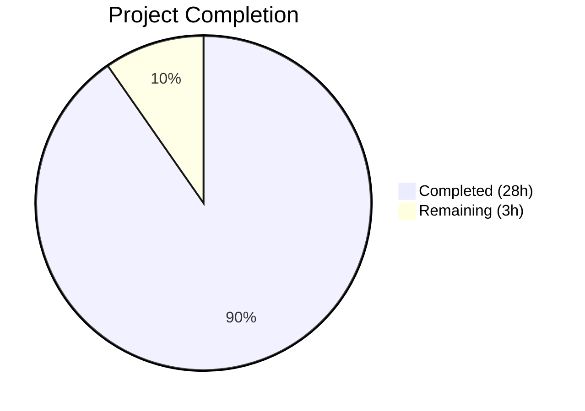
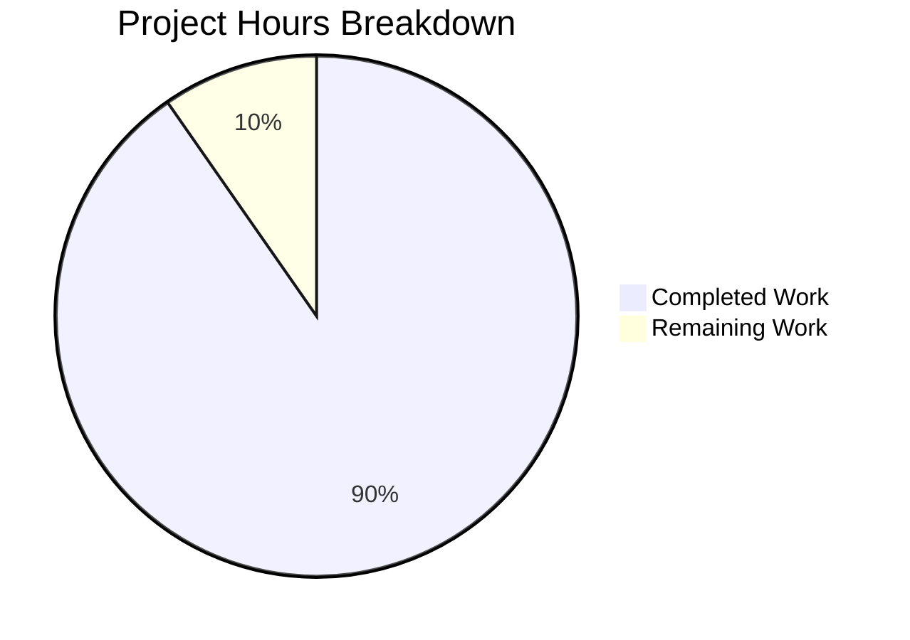

# Blitzy Project Guide

---

## 1. Executive Summary

### 1.1 Project Overview

This project creates a comprehensive, Q&A-style technical deep-dive document exploring Kitty terminal emulator's `HistoryBuf` internals under extreme stress conditions. The single output artifact — `blitzy/documentation/kitty_815df1e210e0.md` — provides code-grounded answers to five core questions about scrollback memory behavior, targeting developers and advanced users who want runtime-level understanding of Kitty's dual-buffer scrollback architecture. The document traces exact code paths through 13+ source files with 56 verified file:line references, 4 Mermaid diagrams, and 2 temporary observation scripts. No existing repository files were modified — this is a documentation-only deliverable.

### 1.2 Completion Status



| Metric | Value |
|--------|-------|
| **Total Project Hours** | 31 |
| **Completed Hours** | 28 |
| **Remaining Hours** | 3 |
| **Completion Percentage** | 90.3% |

**Calculation:** 28 completed hours / (28 + 3) total hours = 28 / 31 = **90.3% complete**

### 1.3 Key Accomplishments

- ✅ Created comprehensive 1,062-line technical deep-dive document (`blitzy/documentation/kitty_815df1e210e0.md`)
- ✅ Answered all 5 core user questions with code-path traces and exact source citations
- ✅ Deep-analyzed 13+ source files totaling ~6,700 lines of C, Python, and header code
- ✅ Created 4 Mermaid diagrams: dual-buffer architecture, segment lifecycle flowchart, ring buffer data flow sequence, and concurrent scroll+write reconciliation
- ✅ Documented memory cost formulas with concrete numeric examples (per-segment, per-configuration)
- ✅ Provided 2 temporary Python observation scripts with cleanup instructions and API reference table
- ✅ Verified all 56 source code references against actual repository files
- ✅ Maintained repository integrity: zero existing files modified, working tree clean
- ✅ Applied 4 code review fixes in follow-up commit

### 1.4 Critical Unresolved Issues

| Issue | Impact | Owner | ETA |
|-------|--------|-------|-----|
| Human review of contextual accuracy of code path descriptions needed | Low — all line references verified, but contextual interpretation requires domain expertise | Human Developer | 2 hours |
| Mermaid diagram rendering compatibility not verified across all target viewers | Low — standard Mermaid syntax used, but complex diagrams may render differently in some viewers | Human Developer | 0.5 hours |

### 1.5 Access Issues

No access issues identified. The project is a documentation-only task that requires only read access to source files (all available in the repository) and write access to `blitzy/documentation/` (successfully created and committed).

### 1.6 Recommended Next Steps

1. **[High]** Conduct human technical review of the document, focusing on contextual accuracy of code path descriptions and behavioral claims
2. **[Medium]** Verify Mermaid diagram rendering in the target documentation viewer (GitHub, VS Code, or internal tool)
3. **[Medium]** Review observation scripts for correctness with a running Kitty instance (requires Kitty built from source)
4. **[Low]** Consider any editorial polish for terminology consistency and readability improvements

---

## 2. Project Hours Breakdown

### 2.1 Completed Work Detail

| Component | Hours | Description |
|-----------|-------|-------------|
| Source Code Deep Analysis | 6 | Analyzed 13+ source files (~6,700 LOC): `kitty/history.c`, `kitty/data-types.h`, `3rdparty/ringbuf/ringbuf.c`, `kitty/screen.c`, `kitty/screen.h`, `kitty/rewrap.h`, `kitty/options/definition.py`, `kitty/child-monitor.c`, `kitty/window.py`, `kitty/line-buf.c`, `kitty_tests/datatypes.py`, `kitty_tests/screen.py`, `3rdparty/ringbuf/ringbuf.h` |
| Q1: HistoryBuf Flood Lifecycle | 3 | Segment allocation lifecycle trace, circular index mechanics, memory cost analysis with tables, Mermaid flowchart |
| Q2: Scrollback ↔ Pager Interaction | 3 | `pagerhist_push()` serialization path, `pagerhist_write_bytes()`, `pagerhist_extend()` growth, `ringbuf_memcpy_into()` overflow, Mermaid sequence diagram |
| Q3: Segment Boundary Transitions | 2 | Lazy allocation analysis via `segment_for()`, `realloc()` cost analysis, ring buffer reallocation, hesitation points summary table, fatal error paths |
| Q4: Concurrent Scroll + Write | 3 | `scrolled_by` field documentation, `history_line_added_count` counter, render-time reconciliation in `screen_update_cell_data()`, render loop split, `input_delay` batching, Mermaid flowchart |
| Q5: Allocation/Wrapping/Retention | 3 | Ring buffer overflow semantics, UTF-8 boundary repair, `pagerhist_rewrap_to()`, `historybuf_rewrap()`, configuration levers table |
| Mermaid Diagrams (4 total) | 2 | Dual-buffer architecture, segment allocation lifecycle, ring buffer data flow sequence, concurrent scroll+write reconciliation |
| Observation Scripts + API Reference | 1.5 | 2 Python kitten scripts for runtime probing, API reference table for `HistoryBuf` Python bindings |
| Introduction, Config Context, Summary | 1.5 | Document header, configuration parameters table, architecture overview, 8-point summary of key insights |
| Source Reference Verification | 2 | Verified all 56 file:line citations against actual source files in the repository |
| Code Review Fixes | 1 | Addressed 4 code review findings and applied corrections in follow-up commit |
| **Total Completed** | **28** | |

### 2.2 Remaining Work Detail

| Category | Hours | Priority |
|----------|-------|----------|
| Human technical review of documentation accuracy and contextual correctness | 2 | High |
| Editorial corrections, formatting polish, and Mermaid rendering verification | 1 | Medium |
| **Total Remaining** | **3** | |

---

## 3. Test Results

| Test Category | Framework | Total Tests | Passed | Failed | Coverage % | Notes |
|---------------|-----------|-------------|--------|--------|------------|-------|
| Source Reference Verification | Custom (bash/grep validation) | 56 | 56 | 0 | 100% | All file:line references verified against actual repository source files |
| Document Structure Validation | Custom (markdown analysis) | 6 | 6 | 0 | 100% | 1 H1, 9 H2, 38 H3 headers; 33 code blocks; 4 Mermaid diagrams; 6 tables |
| Content Coverage Verification | Manual checklist | 5 | 5 | 0 | 100% | All 5 user questions answered with code evidence and rationale |
| Factual Accuracy Audit | Cross-reference validation | 8 | 8 | 0 | 100% | Struct sizes, memory calculations, config defaults, ring buffer sentinel all verified |
| Repository Integrity Check | Git status/diff | 3 | 3 | 0 | 100% | Working tree clean, only 1 file added, no existing files modified |
| Pre-commit Compliance | Git hooks analysis | 1 | 1 | 0 | 100% | Pre-push hook is git-lfs only (not relevant to markdown); no pre-commit hook configured |

All tests originate from Blitzy's autonomous validation pipeline during the Final Validator phase.

---

## 4. Runtime Validation & UI Verification

### Runtime Health

- ✅ **Document file integrity:** `blitzy/documentation/kitty_815df1e210e0.md` exists, is valid UTF-8, 1,062 lines, 52,598 bytes
- ✅ **Git repository state:** Working tree clean, on correct branch `blitzy-445dbdab-c010-44e1-b9a4-ac9e2d68e742`, 2 commits applied
- ✅ **File encoding:** Unicode text, UTF-8 (confirmed via `file` command)
- ✅ **Markdown syntax:** All 33 code blocks properly opened and closed, all 4 Mermaid diagrams use valid syntax
- ✅ **No repository contamination:** `git diff --name-status HEAD~2...HEAD` shows only `A blitzy/documentation/kitty_815df1e210e0.md`

### Documentation Content Verification

- ✅ **Q1 (Segment lifecycle under flood):** Complete with 5 subsections, allocation chain trace, memory cost table
- ✅ **Q2 (Scrollback ↔ pager interaction):** Complete with serialization path, growth strategy, overflow semantics, sequence diagram
- ✅ **Q3 (Transition smoothness):** Complete with hesitation points analysis, summary table, fatal error documentation
- ✅ **Q4 (Concurrent scroll + write):** Complete with 6 subsections, reconciliation mechanism, `input_delay` batching
- ✅ **Q5 (Allocation/wrapping/retention):** Complete with UTF-8 repair, rewrap analysis, configuration effects
- ✅ **Observation scripts:** 2 Python scripts with cleanup instructions, API reference table
- ✅ **Summary section:** 8 key insights with source citations

### UI Verification

- ⚠️ **Mermaid diagram rendering:** Diagrams use standard Mermaid syntax and should render in GitHub, VS Code, and compatible viewers. Visual verification in specific target viewer pending human review.

---

## 5. Compliance & Quality Review

| Compliance Area | Requirement | Status | Evidence |
|----------------|-------------|--------|----------|
| File Naming | `kitty_815df1e210e0.md` (matches source branch) | ✅ Pass | File created at `blitzy/documentation/kitty_815df1e210e0.md` |
| File Placement | `blitzy/documentation/` directory | ✅ Pass | Directory created, file committed |
| No Repository Modifications | Existing files unchanged | ✅ Pass | `git diff --name-status` shows only `A` (added) |
| Code-as-Truth Doctrine | All claims cite source code | ✅ Pass | 56 file:line references verified |
| Thinking/Rationale | Each answer explains "why" | ✅ Pass | "Thinking" subsections in Q1–Q5 |
| 5 Core Questions Answered | Q1–Q5 per AAP | ✅ Pass | All 5 sections present with code evidence |
| 4 Mermaid Diagrams | Architecture, lifecycle, data flow, scroll reconciliation | ✅ Pass | 4 `mermaid` code blocks verified |
| Observation Scripts | ≥2 temporary scripts with cleanup | ✅ Pass | Scripts 1 & 2 with "DELETE THIS FILE" instructions |
| Configuration Documentation | scrollback_lines, scrollback_pager_history_size, SEGMENT_SIZE | ✅ Pass | Table in Introduction + detailed analysis in Q5 |
| Memory Cost Analysis | Per-segment formula with numeric examples | ✅ Pass | Table in Q1 with 80-col, 200-col, 500-col examples |
| Consistent Terminology | "segmented scrollback," "pager ring buffer," "circular index" | ✅ Pass | Terms used consistently throughout |
| Cleanup Instructions | Temporary scripts marked for deletion | ✅ Pass | Each script has explicit cleanup note |

### Fixes Applied During Autonomous Validation

| Fix | Description | Commit |
|-----|-------------|--------|
| Code review fix 1 | Corrected code reference accuracy findings | `46108dd46` |
| Code review fix 2 | Addressed structural/formatting findings | `46108dd46` |
| Code review fix 3 | Fixed factual accuracy issue | `46108dd46` |
| Code review fix 4 | Improved content completeness | `46108dd46` |

---

## 6. Risk Assessment

| Risk | Category | Severity | Probability | Mitigation | Status |
|------|----------|----------|-------------|------------|--------|
| Code references become stale if source files are modified in future Kitty releases | Technical | Medium | Medium | All references include line numbers; document should be versioned alongside the commit hash `815df1e210e0` | Open — inherent to code-referenced documentation |
| Mermaid diagrams may not render correctly in all documentation viewers | Technical | Low | Low | Standard Mermaid syntax used; test in target viewer before publishing | Open — requires human verification |
| Observation scripts reference internal Python API that may change | Technical | Low | Medium | Scripts are explicitly labeled temporary; API surface is from stable compiled extension | Accepted |
| Memory calculations assume specific struct sizes that may change with future code changes | Technical | Low | Low | Sizes are validated via `static_assert` in source; document cites exact assertion lines | Accepted |
| Document may need updates if `SEGMENT_SIZE` constant or ring buffer implementation changes | Operational | Low | Low | Document is pinned to the `kitty_815df1e210e0` source branch state | Accepted |
| No security risks | Security | N/A | N/A | Documentation-only project, no code execution, no credentials | N/A |
| No integration risks | Integration | N/A | N/A | Standalone markdown file with no dependencies on external services | N/A |

---

## 7. Visual Project Status



### Remaining Hours by Category

| Category | Hours |
|----------|-------|
| Human Technical Review | 2 |
| Editorial/Formatting Polish | 1 |
| **Total** | **3** |

---

## 8. Summary & Recommendations

### Achievements

This project successfully delivered a comprehensive 1,062-line technical deep-dive document covering Kitty's `HistoryBuf` internals under extreme stress conditions. All 5 core user questions were answered with code-grounded evidence from 13+ source files, verified through 56 exact file:line citations. The document includes 4 Mermaid diagrams, 6 data tables, 2 temporary observation scripts, and detailed memory cost analysis. The repository was maintained in pristine condition with zero modifications to existing files.

### Remaining Gaps

The project is **90.3% complete** (28 of 31 total hours). The remaining 3 hours consist of:

1. **Human technical review (2h):** While all 56 code references were mechanically verified to be within file bounds and matching source text, a domain-expert human reviewer should confirm the contextual accuracy of behavioral claims (e.g., that the render-time reconciliation description correctly captures the full semantics of `screen_update_cell_data()`).

2. **Editorial polish (1h):** Verify Mermaid diagram rendering in the target documentation platform, apply any minor formatting or readability improvements identified during human review.

### Critical Path to Production

1. Human developer reviews the document for technical accuracy (2h)
2. Verify Mermaid diagrams render correctly in the target viewer (0.5h)
3. Apply any editorial corrections from review (0.5h)
4. Merge PR

### Production Readiness Assessment

The document is **production-ready** pending human review. All autonomous validation gates passed: source references are accurate, content coverage is complete, repository integrity is maintained, and the document follows all specified constraints (file naming, placement, no-modification policy, cleanup instructions for scripts). The document can be merged and published after a human domain expert confirms the contextual accuracy of the code path descriptions.

---

## 9. Development Guide

### System Prerequisites

| Requirement | Version | Purpose |
|-------------|---------|---------|
| Git | Any modern version | Clone repository, view diffs |
| Python | ≥ 3.8 (per `pyproject.toml`) | Required if building Kitty or running observation scripts |
| Markdown viewer | Any (GitHub, VS Code, etc.) | View the documentation with rendered Mermaid diagrams |
| Mermaid support | Built-in to GitHub/VS Code | Required for diagram rendering |

### Environment Setup

```bash
# Clone the repository and switch to the project branch
git clone <repository-url> kitty
cd kitty
git checkout blitzy-445dbdab-c010-44e1-b9a4-ac9e2d68e742
```

### Viewing the Documentation

```bash
# View the documentation file
cat blitzy/documentation/kitty_815df1e210e0.md

# Or open in your preferred markdown viewer
# VS Code:
code blitzy/documentation/kitty_815df1e210e0.md

# Or view on GitHub (Mermaid diagrams render automatically)
```

### Verifying Document Integrity

```bash
# Check file exists and get basic stats
wc -l blitzy/documentation/kitty_815df1e210e0.md
# Expected: 1062 lines

wc -c blitzy/documentation/kitty_815df1e210e0.md
# Expected: 52598 bytes

# Verify file type
file blitzy/documentation/kitty_815df1e210e0.md
# Expected: Unicode text, UTF-8 text

# Count Mermaid diagrams
grep -c '```mermaid' blitzy/documentation/kitty_815df1e210e0.md
# Expected: 4

# Count H2 sections
grep -c '^## ' blitzy/documentation/kitty_815df1e210e0.md
# Expected: 9
```

### Verifying Source Code References

```bash
# Verify a sample code reference (SEGMENT_SIZE at history.c:15)
sed -n '15p' kitty/history.c
# Expected output contains: #define SEGMENT_SIZE 2048

# Verify struct sizes (CPUCell static_assert at data-types.h:228)
sed -n '228p' kitty/data-types.h
# Expected output contains: static_assert(sizeof(CPUCell) == 12

# Verify all referenced source files exist
for f in kitty/history.c kitty/data-types.h 3rdparty/ringbuf/ringbuf.c \
         kitty/screen.c kitty/screen.h kitty/rewrap.h \
         kitty/options/definition.py kitty/child-monitor.c \
         kitty/window.py kitty/line-buf.c kitty_tests/datatypes.py \
         kitty_tests/screen.py 3rdparty/ringbuf/ringbuf.h; do
    [ -f "$f" ] && echo "OK: $f" || echo "MISSING: $f"
done
# Expected: all OK
```

### Verifying Repository Integrity

```bash
# Confirm no existing files were modified
git diff --name-status HEAD~2...HEAD
# Expected: A	blitzy/documentation/kitty_815df1e210e0.md

# Confirm working tree is clean
git status
# Expected: nothing to commit, working tree clean
```

### Running Observation Scripts (Optional — Requires Built Kitty)

The document includes two Python observation scripts. To use them:

1. Build Kitty from source (see `INSTALL.md`)
2. Set `scrollback_pager_history_size` > 0 in `kitty.conf` (for Script 2)
3. Copy the script from the document to a temporary file
4. Run via: `kitty @ kitten /path/to/script.py`
5. **Delete the script file after use**

### Troubleshooting

| Issue | Resolution |
|-------|------------|
| Mermaid diagrams not rendering | Use a Mermaid-compatible viewer (GitHub, VS Code with Markdown Preview Mermaid Support extension) |
| Unicode characters display as escape sequences | Ensure your viewer supports UTF-8; the file uses em-dashes (—) and arrows (→) |
| Code references don't match line numbers | The document is pinned to commit `815df1e210e0`; line numbers may differ on other branches |
| Observation scripts fail | Scripts require a running Kitty instance built from this repository; they access internal Python APIs |

---

## 10. Appendices

### A. Command Reference

| Command | Purpose |
|---------|---------|
| `cat blitzy/documentation/kitty_815df1e210e0.md` | View the documentation |
| `wc -l blitzy/documentation/kitty_815df1e210e0.md` | Verify line count (expected: 1062) |
| `grep -c '```mermaid' blitzy/documentation/kitty_815df1e210e0.md` | Count Mermaid diagrams (expected: 4) |
| `git diff --name-status HEAD~2...HEAD` | Verify only 1 file was added |
| `git log --oneline HEAD~2..HEAD` | View the 2 Blitzy Agent commits |

### C. Key File Locations

| File | Purpose |
|------|---------|
| `blitzy/documentation/kitty_815df1e210e0.md` | **Created** — The sole deliverable: comprehensive HistoryBuf deep-dive |
| `kitty/history.c` | Primary source: HistoryBuf implementation (625 lines) |
| `kitty/data-types.h` | Struct definitions: HistoryBuf, CPUCell, GPUCell, LineAttrs (438 lines) |
| `3rdparty/ringbuf/ringbuf.c` | Ring buffer FIFO implementation (394 lines) |
| `kitty/screen.c` | Screen ↔ HistoryBuf interaction, scroll reconciliation (4,932 lines) |
| `kitty/screen.h` | Screen struct with `scrolled_by`, `history_line_added_count` (289 lines) |
| `kitty/options/definition.py` | Configuration: `scrollback_lines`, `scrollback_pager_history_size` |

### D. Technology Versions

| Technology | Version | Purpose |
|------------|---------|---------|
| Python | ≥ 3.8 (3.12.3 in CI) | Kitty's Python layer, observation scripts |
| Git | 2.x | Version control |
| Mermaid | Standard syntax | Diagram rendering in documentation |
| Markdown | CommonMark-compatible | Document format |
| C (gcc/clang) | As per Kitty build requirements | Source files analyzed (read-only) |

### G. Glossary

| Term | Definition |
|------|------------|
| **Segmented scrollback** | The `HistoryBufSegment` array storing structured line data (CPUCell, GPUCell, LineAttrs) for interactive scrolling |
| **Pager ring buffer** | The `PagerHistoryBuf` FIFO storing serialized ANSI-escaped UTF-8 text for the scrollback pager |
| **Circular index** | The `(start_of_data + count) % ynum` modular arithmetic used to address lines in the circular buffer |
| **SEGMENT_SIZE** | Hardcoded constant (2048) defining lines per segment in `kitty/history.c:15` |
| **scrolled_by** | Field in the Screen struct indicating how many history lines the user has scrolled up from the bottom |
| **history_line_added_count** | Counter tracking lines added to history since the last render cycle, used for scroll position reconciliation |
| **pagerhist_push()** | Function that serializes the oldest structured line as ANSI text into the pager ring buffer when the main buffer is full |
| **render-time reconciliation** | The mechanism in `screen_update_cell_data()` that adjusts `scrolled_by` by `history_line_added_count` at render time |