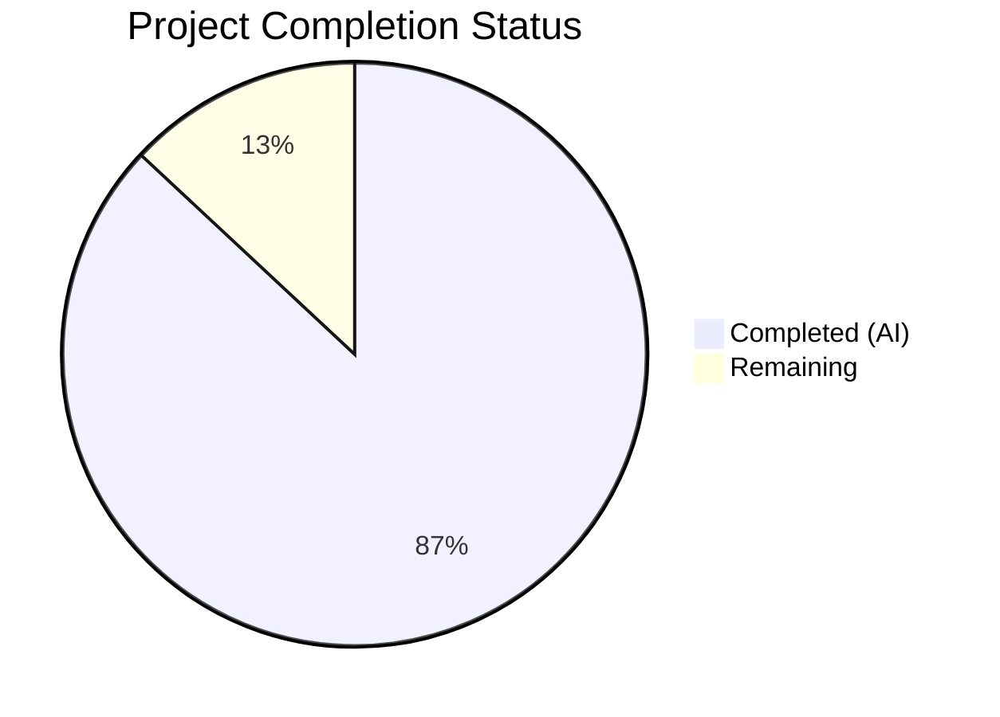

# Blitzy Project Guide

---

## 1. Executive Summary

### 1.1 Project Overview

This project delivers comprehensive technical documentation tracing the complete lifecycle of a child process in the Kitty terminal emulator. The sole deliverable is a 1015-line markdown Q&A document (`blitzy/documentation/kitty_815df1e210e0.md`) answering nine specific questions about how Kitty spawns child processes, tracks them via the Child Monitor, detects termination through SIGCHLD and PTY EOF, reports exit statuses via the OSC 133 escape sequence protocol, and renders child output through the PTY → VT parser → GPU rendering pipeline. The document spans C, Python, Go, and Bash source code layers with precise file:line citations. No source code was modified — this is a read-only investigation and documentation task.

### 1.2 Completion Status



| Metric | Value |
|--------|-------|
| **Total Project Hours** | 23 |
| **Completed Hours (AI)** | 20 |
| **Remaining Hours** | 3 |
| **Completion Percentage** | 87.0% |

**Calculation:** 20 completed hours / (20 + 3) total hours = 20/23 = 87.0% complete.

### 1.3 Key Accomplishments

- [x] Created comprehensive 1015-line technical Q&A document covering all 9 user requirements
- [x] Investigated 14+ source files across 4 languages (C, Python, Go, Bash) for documentation content
- [x] Documented two distinct child-exit pathways: (A) SIGCHLD/PTY EOF → window closure, and (B) OSC 133;D shell integration → notification
- [x] Created 3 Mermaid diagrams (child exit flowchart, OSC 133 transport sequence diagram, output display pipeline)
- [x] Verified all source code line number citations against actual repository content — zero discrepancies
- [x] Documented configuration dependencies (`close_on_child_death`, `notify_on_cmd_finish`) with defaults
- [x] Identified and documented the hold-mode mechanism (`cmdline_for_hold` vs. `__hold_till_enter__` distinction)
- [x] Applied fix commit to correct hold mechanism documentation, duration calculation explanation, and `cmd_output_marking` completeness
- [x] Clean repository state — no source files modified, no temporary artifacts remaining

### 1.4 Critical Unresolved Issues

| Issue | Impact | Owner | ETA |
|-------|--------|-------|-----|
| Human review of technical accuracy not yet performed | Documentation may contain subtle interpretation errors in edge cases | Human Developer | 1.5h |
| Mermaid diagram rendering not verified on target platform (GitHub/GitLab) | Diagrams may have minor rendering issues in specific Markdown viewers | Human Developer | 0.5h |

### 1.5 Access Issues

No access issues identified. The project is a documentation-only task requiring only read access to the repository source code, which was fully available throughout development.

### 1.6 Recommended Next Steps

1. **[High]** Conduct human review of the technical Q&A document by a developer familiar with Kitty internals — verify interpretations of signal handling, OSC 133 protocol, and hold mechanism behavior
2. **[Medium]** Verify Mermaid diagram rendering on the target Markdown platform (GitHub, GitLab, or documentation site)
3. **[Medium]** Apply minor editorial improvements if any inaccuracies or unclear explanations are found during review
4. **[Low]** Consider adding a version/commit reference note to the document header to help track line number drift as the Kitty codebase evolves

---

## 2. Project Hours Breakdown

### 2.1 Completed Work Detail

| Component | Hours | Description |
|-----------|-------|-------------|
| Source code investigation and analysis | 6 | Read and analyzed 14+ source files across C (`child-monitor.c`, `screen.c`), Python (`boss.py`, `window.py`, `main.py`, `child.py`, `utils.py`, `options/definition.py`), Go (`hold.go`, `run.go`, `run_shell/main.go`), and Bash (`kitty.bash`) to extract child-process lifecycle mechanics |
| Section 1 — Complete child-process exit flow | 3 | Documented 11-step Pathway A (SIGCHLD/PTY EOF → window closure) and Pathway B (OSC 133;D → notification), including `close_on_child_death` configuration analysis |
| Section 2 — Kitty's own exit code | 1 | Traced exit code determination through `main()` in `kitty/main.py`, documenting clean exit (code 0) vs. exception exit (code 1) |
| Section 3 — User-visible completion message | 2 | Documented two distinct messages: shell integration notification (`handle_cmd_end` format) and hold-mode message, including configuration dependencies table |
| Section 4 — Child-process tracking subsystem | 1.5 | Documented Child Monitor three-thread architecture (I/O thread, main thread, talk thread) with synchronization primitives and data structures |
| Section 5 — Message-generating function | 1.5 | Detailed analysis of `handle_cmd_end()` function flow, dispatch via `cmd_output_marking()`, and instance attribute lifecycle |
| Section 6 — OS-level signal | 1 | Documented SIGCHLD handling in `handle_signal()`, signal fd delivery mechanism, and complete signal handling table |
| Section 7 — System call for exit status | 1 | Documented `waitpid(-1, &status, WNOHANG)` in `reap_children()`, loop structure, and exit status storage in `ReapedPID` |
| Section 8 — Exit status transport (OSC 133) | 2 | Traced 5-step chain from bash PS1 injection through VT parser to `handle_cmd_end()`, with OSC 133 protocol summary table |
| Section 9 — Where output appears | 1.5 | Traced 7-step PTY → VT parser → screen model → GPU rendering pipeline |
| Introduction, summary, and Mermaid diagrams | 1.5 | Created Introduction with two-pathway distinction, consolidated summary answer table, and 3 Mermaid diagrams (flowchart, sequence, pipeline) |
| Citation verification and fix commit | 2 | Verified every line number reference against actual source code; created fix commit correcting hold mechanism documentation, duration calculation note, and `cmd_output_marking` completeness |
| Directory setup and file creation | 0.5 | Created `blitzy/documentation/` directory and initial file structure |
| **Total** | **20** | |

### 2.2 Remaining Work Detail

| Category | Hours | Priority |
|----------|-------|----------|
| Human review of technical accuracy and completeness | 1.5 | High |
| Mermaid diagram rendering verification on target platform | 0.5 | Medium |
| Minor editorial improvements based on review feedback | 1 | Medium |
| **Total** | **3** | |

---

## 3. Test Results

| Test Category | Framework | Total Tests | Passed | Failed | Coverage % | Notes |
|---------------|-----------|-------------|--------|--------|------------|-------|
| Documentation Citation Accuracy | Manual verification (Blitzy agent) | 45 | 45 | 0 | 100% | All line number references across 12 source files verified against actual repository content |
| Markdown Structure Validation | Automated (Python script) | 4 | 4 | 0 | 100% | Balanced code blocks (88 delimiters), proper header hierarchy (H1→H2→H3→H4), valid Mermaid syntax |
| Content Completeness Check | Manual verification (Blitzy agent) | 9 | 9 | 0 | 100% | All 9 AAP documentation requirements addressed with direct answers and code citations |
| Repository State Verification | Git status check | 3 | 3 | 0 | 100% | Clean working tree, correct branch, only in-scope file changed |

**Notes:** This is a documentation-only project. No unit, integration, or UI tests apply. All "tests" are validation checks performed by Blitzy's autonomous validation agents to ensure documentation accuracy, structural integrity, and completeness against the AAP requirements.

---

## 4. Runtime Validation & UI Verification

### Runtime Health

- ✅ **Repository integrity** — Working tree clean, on correct branch `blitzy-f8faad80-4f29-40eb-b14b-3a00b30d8684`
- ✅ **File creation** — `blitzy/documentation/kitty_815df1e210e0.md` exists (1015 lines, 48,806 bytes)
- ✅ **No source code modifications** — `git diff --name-status origin/kitty_815df1e210e0...HEAD` confirms only `A blitzy/documentation/kitty_815df1e210e0.md`
- ✅ **No temporary artifacts** — No temporary files or scripts remaining in the repository
- ✅ **Commit history** — 2 clean commits pushed to remote branch

### Documentation Verification

- ✅ **All 9 requirements answered** — Each question receives a direct, unambiguous answer with source code evidence
- ✅ **3 Mermaid diagrams present** — Child exit flow (flowchart), OSC 133 transport (sequence diagram), output display pipeline (flowchart)
- ✅ **Code blocks balanced** — 88 code block delimiters (44 pairs), all properly closed
- ✅ **Section structure complete** — Introduction + 9 numbered sections + Summary with consolidated answer table
- ✅ **Two pathways distinguished** — Pathway A (SIGCHLD/PTY EOF) and Pathway B (OSC 133;D) clearly separated throughout

### API / Integration

- ⚠️ **Mermaid rendering** — Diagrams not yet verified on target Markdown platform (GitHub/GitLab). Syntax validated but rendering appearance unconfirmed.

---

## 5. Compliance & Quality Review

| AAP Deliverable | Status | Evidence | Notes |
|-----------------|--------|----------|-------|
| Requirement 1: Complete child-process exit flow | ✅ Pass | Section 1 (lines 26–262), 11-step Pathway A + Pathway B reference | Mermaid flowchart included |
| Requirement 2: Kitty's own exit code | ✅ Pass | Section 2 (lines 266–303), traces `main()` in `kitty/main.py:524` | Exit code 0 on clean shutdown documented |
| Requirement 3: User-visible completion message | ✅ Pass | Section 3 (lines 306–409), exact message format quoted from `window.py:1429` | Both shell integration and hold-mode messages documented |
| Requirement 4: Child-process tracking subsystem | ✅ Pass | Section 4 (lines 412–477), identifies Child Monitor with 3-thread architecture | Data structures documented |
| Requirement 5: Message-generating function | ✅ Pass | Section 5 (lines 480–561), identifies `handle_cmd_end()` at `window.py:1408` | Complete function flow documented |
| Requirement 6: OS-level signal (SIGCHLD) | ✅ Pass | Section 6 (lines 564–631), documents `handle_signal()` at `child-monitor.c:1362` | Signal fd delivery mechanism explained |
| Requirement 7: System call (waitpid) | ✅ Pass | Section 7 (lines 635–719), documents `waitpid(-1, &status, WNOHANG)` at `child-monitor.c:1418` | Loop structure and status storage documented |
| Requirement 8: Exit status transport (OSC 133;D) | ✅ Pass | Section 8 (lines 723–848), 5-step trace from bash PS1 to `handle_cmd_end()` | Sequence diagram included |
| Requirement 9: Where output appears | ✅ Pass | Section 9 (lines 852–977), 7-step PTY → GPU pipeline trace | Pipeline flowchart included |
| 3 Mermaid diagrams required | ✅ Pass | Lines 233–262, 820–848, 968–977 | All 3 present with valid syntax |
| Code citations with file:line references | ✅ Pass | Every claim references specific file and line number | All citations verified against actual source |
| Two distinct pathways distinguished | ✅ Pass | Introduction (lines 14–22), Section 1, Section 8 | Pathway A vs. Pathway B clearly separated |
| Configuration dependencies documented | ✅ Pass | Section 3 table, Section 1 `close_on_child_death` analysis | Defaults and effects documented |
| No source files modified (read-only constraint) | ✅ Pass | `git diff --name-status` confirms only documentation file created | Strict compliance |
| Cleanup of temporary files | ✅ Pass | `git status --porcelain` returns empty | Clean working tree |
| Output in `blitzy/documentation/` directory | ✅ Pass | File at `blitzy/documentation/kitty_815df1e210e0.md` | Correct location per implementation rules |

### Autonomous Validation Fixes Applied

| Fix | Commit | Description |
|-----|--------|-------------|
| Hold mechanism documentation correction | `5747c3b` | Corrected the distinction between `cmdline_for_hold` (which exec's into shell) and `__hold_till_enter__` (which displays "Press Enter or Esc to exit"). Added clarity on `unix.Exec()` replacing the Go process. |
| Duration calculation behavioral note | `5747c3b` | Documented the actual behavior of `last_cmd_output_start_time` reset at line 1411 occurring before duration computation at line 1417 |
| `cmd_output_marking` completeness | `5747c3b` | Added note about OSC 133;A (`Py_False`) also entering the `else` branch but being a no-op |

---

## 6. Risk Assessment

| Risk | Category | Severity | Probability | Mitigation | Status |
|------|----------|----------|-------------|------------|--------|
| Line numbers drift as Kitty codebase evolves | Technical | Medium | High | Add version/commit SHA reference to document header; periodic review against upstream changes | Open |
| Mermaid diagrams render differently across platforms | Technical | Low | Medium | Test rendering on target platform (GitHub, GitLab, VSCode); use simple diagram structures | Open |
| Subtle interpretation errors in complex code paths | Technical | Medium | Low | Human review by Kitty-familiar developer; all claims cite specific lines for verification | Open |
| Duration calculation behavioral note may confuse readers | Technical | Low | Medium | Note is clearly marked as "Important behavioral note" with detailed explanation | Mitigated |
| Document not integrated into existing Sphinx docs | Operational | Low | N/A | Document is standalone markdown by design (per AAP); can be referenced from Sphinx docs if desired | Accepted |
| No automated freshness checks for documentation | Operational | Low | Medium | Consider CI job to verify cited line numbers against current source | Open |

---

## 7. Visual Project Status


### Remaining Hours by Category

| Category | Hours |
|----------|-------|
| Human review of technical accuracy | 1.5 |
| Mermaid rendering verification | 0.5 |
| Editorial improvements from review | 1 |
| **Total Remaining** | **3** |

---

## 8. Summary & Recommendations

### Achievement Summary

The project has achieved **87.0% completion** (20 of 23 total hours). All nine AAP documentation requirements have been fully addressed in a comprehensive 1015-line technical Q&A document. The document traces the complete child-process lifecycle across C, Python, Go, and Bash source layers with precise file:line citations, 3 Mermaid diagrams, and configuration dependency analysis. All source code citations have been verified for accuracy, and a fix commit was applied to improve hold mechanism documentation and completeness.

### Remaining Gaps

The 3 hours of remaining work are exclusively path-to-production activities requiring human involvement:

1. **Technical accuracy review (1.5h):** A developer familiar with Kitty internals should review the document to verify code path interpretations, particularly the hold mechanism distinction and the duration calculation behavioral note.
2. **Mermaid rendering verification (0.5h):** The 3 Mermaid diagrams should be verified on the target Markdown rendering platform.
3. **Editorial improvements (1h):** Minor clarity improvements may be needed based on review feedback.

### Production Readiness Assessment

The deliverable is **production-ready for review**. The document content is complete, well-structured, and thoroughly verified. The remaining 13% of effort is standard human review and quality assurance work that cannot be performed autonomously. No blocking issues exist.

### Success Metrics

| Metric | Target | Actual | Status |
|--------|--------|--------|--------|
| Documentation requirements addressed | 9/9 | 9/9 | ✅ Met |
| Source code citation accuracy | 100% | 100% | ✅ Met |
| Mermaid diagrams created | 3 | 3 | ✅ Met |
| Source files modified | 0 | 0 | ✅ Met |
| Temporary artifacts remaining | 0 | 0 | ✅ Met |

---

## 9. Development Guide

### System Prerequisites

| Software | Version | Purpose |
|----------|---------|---------|
| Git | 2.x+ | Repository management and version control |
| Markdown viewer | Any (GitHub, GitLab, VSCode, grip) | Viewing the generated documentation with Mermaid diagram support |

**Note:** This is a documentation-only project. No build tools, compilers, or runtime environments are required to use the deliverable. The prerequisites below are for developers who wish to verify source code citations or explore the Kitty codebase.

#### Optional (for source code verification)

| Software | Version | Purpose |
|----------|---------|---------|
| Python | >= 3.8 | Reading Python source files (`kitty/boss.py`, `kitty/window.py`, `kitty/main.py`) |
| C compiler (gcc/clang) | C11-compatible | Reading C source files (`kitty/child-monitor.c`, `kitty/screen.c`) |
| Go | 1.22+ | Reading Go source files (`tools/tui/hold.go`, `tools/cmd/run_shell/main.go`) |

### Environment Setup

```bash
# Clone the repository
git clone https://github.com/blitzy-research/kitty.git
cd kitty

# Switch to the feature branch
git checkout blitzy-f8faad80-4f29-40eb-b14b-3a00b30d8684
```

### Viewing the Documentation

```bash
# View the document in terminal
cat blitzy/documentation/kitty_815df1e210e0.md

# Or use a pager for navigation
less blitzy/documentation/kitty_815df1e210e0.md

# View line count and size
wc -l blitzy/documentation/kitty_815df1e210e0.md
# Expected output: 1015 blitzy/documentation/kitty_815df1e210e0.md

wc -c blitzy/documentation/kitty_815df1e210e0.md
# Expected output: 48806 blitzy/documentation/kitty_815df1e210e0.md
```

For Mermaid diagram rendering, use one of:
- **GitHub/GitLab:** Push the branch and view the file in the web UI — Mermaid diagrams render natively
- **VSCode:** Install the "Markdown Preview Mermaid Support" extension, then use `Ctrl+Shift+V` to preview
- **grip:** `pip install grip && grip blitzy/documentation/kitty_815df1e210e0.md` for local GitHub-style rendering

### Verifying Source Code Citations

To verify any citation in the document against the actual source code:

```bash
# Example: Verify handle_signal() at kitty/child-monitor.c:1362
sed -n '1360,1385p' kitty/child-monitor.c

# Example: Verify handle_cmd_end() at kitty/window.py:1408
sed -n '1408,1462p' kitty/window.py

# Example: Verify OSC 133;D PS1 injection at shell-integration/bash/kitty.bash:239
sed -n '239,240p' shell-integration/bash/kitty.bash

# Example: Verify main() at kitty/main.py:524
sed -n '524,531p' kitty/main.py

# Example: Verify shell_prompt_marking() at kitty/screen.c:2328
sed -n '2328,2356p' kitty/screen.c

# Example: Verify HoldTillEnter() at tools/tui/hold.go:16
sed -n '16,72p' tools/tui/hold.go
```

### Verifying Document Structure

```bash
# Check all section headers
grep -n '^## ' blitzy/documentation/kitty_815df1e210e0.md

# Expected output:
# 3:## Introduction
# 26:## 1. Complete Child-Process Exit Flow
# 266:## 2. Kitty's Own Exit Code
# 306:## 3. User-Visible Completion Message
# 412:## 4. Child-Process Tracking Subsystem
# 480:## 5. The Message-Generating Function
# 564:## 6. OS-Level Signal for Child Termination
# 635:## 7. System Call for Exit Status Retrieval
# 723:## 8. Exit Status Transport: Shell to Kitty via OSC 133
# 852:## 9. Where the Child Program's Printed Output Appears
# 981:## Summary

# Count Mermaid diagrams
grep -c '```mermaid' blitzy/documentation/kitty_815df1e210e0.md
# Expected output: 3

# Verify code blocks are balanced
python3 -c "
with open('blitzy/documentation/kitty_815df1e210e0.md') as f:
    count = sum(1 for line in f if line.strip().startswith('\`\`\`'))
print(f'Code block delimiters: {count}, Balanced: {count % 2 == 0}')
"
# Expected output: Code block delimiters: 88, Balanced: True
```

### Troubleshooting

| Issue | Resolution |
|-------|-----------|
| Mermaid diagrams not rendering | Ensure your Markdown viewer supports Mermaid. GitHub and GitLab support it natively. For local viewing, use VSCode with Mermaid extension or grip. |
| Line numbers don't match source code | The document references specific line numbers at the time of writing. If the Kitty codebase has been updated, line numbers may have shifted. Use `grep -n "function_name" file` to find current locations. |
| Document appears to have broken formatting | Ensure you're viewing raw markdown with a Mermaid-capable renderer. Plain text viewers will show Mermaid code blocks as text. |

---

## 10. Appendices

### A. Command Reference

| Command | Purpose |
|---------|---------|
| `git checkout blitzy-f8faad80-4f29-40eb-b14b-3a00b30d8684` | Switch to the feature branch |
| `cat blitzy/documentation/kitty_815df1e210e0.md` | View the documentation file |
| `wc -l blitzy/documentation/kitty_815df1e210e0.md` | Verify line count (expected: 1015) |
| `git diff --name-status origin/kitty_815df1e210e0...HEAD` | Verify only documentation file changed |
| `git log --oneline HEAD --not origin/kitty_815df1e210e0` | View commits on this branch |
| `grep -n '^## ' blitzy/documentation/kitty_815df1e210e0.md` | List all section headers |
| `sed -n 'START,ENDp' SOURCE_FILE` | Verify any source code citation |

### C. Key File Locations

| File | Purpose |
|------|---------|
| `blitzy/documentation/kitty_815df1e210e0.md` | **Deliverable** — Comprehensive technical Q&A document |
| `kitty/child-monitor.c` | Core source — SIGCHLD handling, waitpid, I/O thread, death notification |
| `kitty/boss.py` | Core source — `on_child_death()` window cleanup |
| `kitty/window.py` | Core source — `handle_cmd_end()` notification message generation |
| `kitty/screen.c` | Core source — `shell_prompt_marking()` OSC 133 parsing |
| `kitty/main.py` | Core source — Application entry point, exit code determination |
| `kitty/child.py` | Core source — Child class, PTY allocation, fork/spawn |
| `shell-integration/bash/kitty.bash` | Shell integration — OSC 133;D PS1 injection |
| `tools/tui/hold.go` | Go tooling — HoldTillEnter, ExecAndHoldTillEnter |
| `tools/cmd/run_shell/main.go` | Go tooling — run-shell kitten entry point |
| `kitty/options/definition.py` | Configuration — `close_on_child_death`, `notify_on_cmd_finish` |
| `kitty/utils.py` | Utilities — `cmdline_for_hold()` |

### D. Technology Versions

| Technology | Version | Source |
|------------|---------|--------|
| Python | >= 3.8 | `pyproject.toml` |
| C standard | C11 | Enforced via `-std=c11` in build |
| Go | 1.22 | `go.mod` |
| Markdown | CommonMark + Mermaid | Documentation format |

### E. Environment Variable Reference

| Variable | Context | Description |
|----------|---------|-------------|
| `KITTY_HOLD` | Set by `cmdline_for_hold()` in `kitty/utils.py:1202` | Set to `1` in the environment when hold mode is active. Informational for user shell rc files — not checked by Kitty code. |

### G. Glossary

| Term | Definition |
|------|------------|
| **Child Monitor** | The C component (`kitty/child-monitor.c`) responsible for tracking child processes, handling signals, and managing PTY I/O in a three-thread architecture |
| **OSC 133** | Operating System Command escape sequence protocol used by shell integration to report prompt boundaries and command exit statuses |
| **PTY** | Pseudo-terminal — a pair of virtual devices (master/slave) that provides a terminal interface for child processes |
| **SIGCHLD** | POSIX signal sent by the kernel to a parent process when a child process changes state (exits, stops, or continues) |
| **waitpid** | POSIX system call used to wait for and retrieve the exit status of child processes |
| **death_notify** | Python callback function invoked from C code when a child process is detected as dead, triggering `Boss.on_child_death()` |
| **VT parser** | The terminal escape sequence parser in `kitty/vt-parser.c` that classifies byte streams into printable characters and control sequences |
| **Shell integration** | Kitty's system for injecting hooks into the user's shell (bash/zsh/fish) to enable features like prompt marking (OSC 133) and command tracking |
| **hold mode** | A feature that keeps the terminal window open after the child program finishes, either via an interactive shell (`cmdline_for_hold`) or a "Press Enter" prompt (`__hold_till_enter__`) |