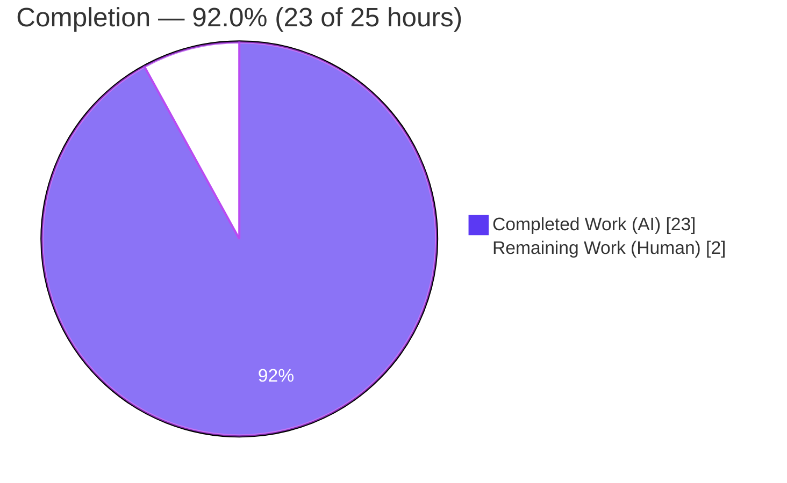
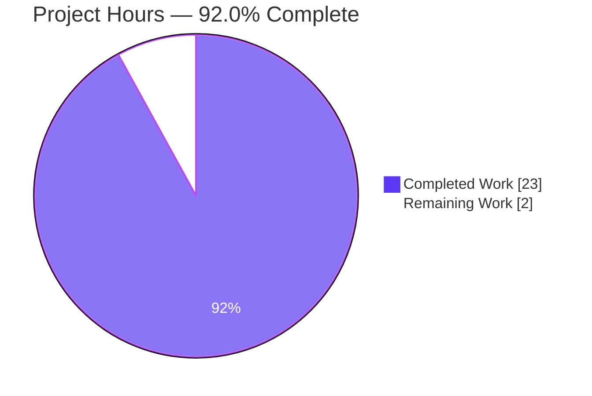
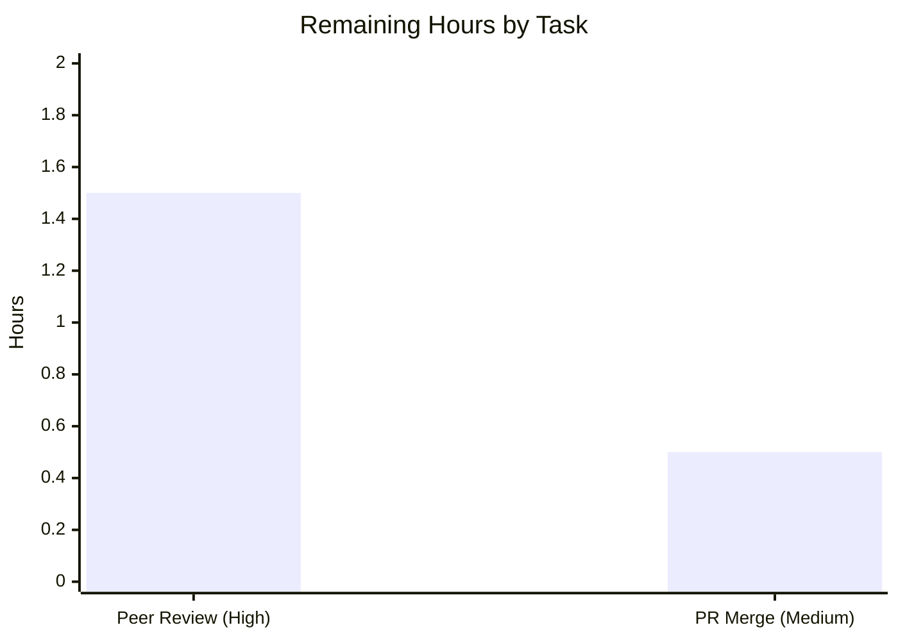

# Blitzy Project Guide — Kitty `HistoryBuf` Runtime Investigation

> **Deliverable:** `blitzy/documentation/kitty_815df1e210e0.md` — a runtime-verified investigation of Kitty's scrollback subsystem under enormous, fast output bursts.
> **Task type:** Read-only investigation / documentation (no terminal behavior modified).
> **Brand legend:** 🟦 **Completed / AI Work** = Dark Blue `#5B39F3` · ⬜ **Remaining / Not Completed** = White `#FFFFFF`

---

## 1. Executive Summary

### 1.1 Project Overview

This project delivers a single, empirically-grounded Markdown investigation document explaining the runtime behavior of Kitty's scrollback subsystem — the `HistoryBuf` object in `kitty/history.c` and its embedded pager ring buffer — under an enormous, fast burst of output. It answers five sub-questions: segment carving, segmented-storage↔pager interaction, transition smoothness, concurrent scroll, and allocation/wrapping/retention — using output captured by **building and running** Kitty's native extension, not code-reading alone. Target users are Kitty maintainers and terminal-internals engineers. The scope is strictly read-only over the source tree; the sole artifact is `blitzy/documentation/kitty_815df1e210e0.md`. Business impact: an authoritative, reproducible internal reference grounded in verifiable runtime evidence with exact `file:line` citations.

### 1.2 Completion Status



| Metric | Hours |
|---|---|
| **Total Hours** | **25.0** |
| **Completed Hours (AI + Manual)** | **23.0** (AI: 23.0 · Manual: 0.0) |
| **Remaining Hours** | **2.0** |
| **Percent Complete** | **92.0%** |

> Completion is computed on AAP-scoped work only (PA1): `Completed / (Completed + Remaining) = 23.0 / 25.0 = 92.0%`. All AAP deliverable requirements are complete; the residual 2.0h is path-to-production (human peer review + merge of a documentation-only PR).

### 1.3 Key Accomplishments

- ✅ **Native extension built and validated** — `CI=true python3 setup.py build --ignore-compiler-warnings` produced `kitty/fast_data_types.so`; `HistoryBuf`/`LineBuf`/`Line`/`Screen` all instantiable.
- ✅ **Investigate-by-running-first satisfied** — five temporary observation harnesses (one C probe + four Python scripts) authored, run, and their output captured verbatim before any prose.
- ✅ **All five objectives answered** — OBJ-1 (segment carving), OBJ-2 (storage↔pager), OBJ-3 (smoothness/hesitation), OBJ-4 (concurrent scroll), OBJ-5 (allocation/wrapping/retention), each with a producing command + verbatim output + citations.
- ✅ **97 exact `file:line` citations** across 11 source files, all verified against the pinned tree (commit `815df1e210e0`).
- ✅ **Coverage pass + honest flagging** — a 5-row coverage table plus an explicit "unverifiable / environment-specific" section (RSS/timings, `num_segments` inference, pager rewrap verified-by-reading).
- ✅ **Two genuine runtime corrections** — constructor arg order (`ynum` first, third arg in **bytes**) and `ringbuf` located at repo-root `3rdparty/` (not `kitty/3rdparty/`).
- ✅ **Read-only scope preserved** — exactly one file added (+525/-0); working tree clean; `.so`/`build/` and `/tmp` harnesses never committed.
- ✅ **Zero defects** — `python3 test.py historybuf …` → 7/7 pass; build exit 0; no unresolved errors.

### 1.4 Critical Unresolved Issues

| Issue | Impact | Owner | ETA |
|---|---|---|---|
| *None* — the deliverable passed all five autonomous validation gates with zero discrepancies; no blocking or release-critical issues were identified. | None | — | — |

### 1.5 Access Issues

**No access issues identified.** The task operated entirely on the local repository with a fully provisioned toolchain (gcc 15.2.0, Python 3.13.7, all dev libraries). No repository permissions, service credentials, or third-party API access were required or blocked.

| System/Resource | Type of Access | Issue Description | Resolution Status | Owner |
|---|---|---|---|---|
| *None* | — | No external systems, credentials, or network resources are required for this read-only documentation task. | N/A | — |

### 1.6 Recommended Next Steps

1. **[High]** Peer-review `blitzy/documentation/kitty_815df1e210e0.md` — verify the two-tier-design narrative, spot-check a sample of the 97 citations against the pinned source, and optionally re-run one or two Appendix-A harnesses to confirm reproducibility. *(1.5h)*
2. **[Medium]** Merge the documentation-only PR after review — confirm the working tree is clean (only the single added file), approve, merge, and close out the branch. *(0.5h)*
3. **[Low]** *(Discretionary, not part of the 2.0h path-to-production)* Optionally link/publish the investigation in an internal knowledge base. Note: converting the transient harnesses into committed tests/scripts is **explicitly forbidden** by the read-only rule and must not be done.

---

## 2. Project Hours Breakdown

### 2.1 Completed Work Detail

All completed work is autonomous (AI) and traces to specific AAP requirements (R1–R12).

| Component | Hours | Description |
|---|---:|---|
| Environment setup & native extension build | 2.5 | Compile `fast_data_types.so`; resolve `--ignore-compiler-warnings` accommodation (glfw `-Werror=switch`) and `libsimde`/dev-lib toolchain; verify import surface and constructor argument order. *(R1)* |
| Scrollback-subsystem source comprehension | 4.0 | Read `kitty/history.c` (624 lines; 40+ cited lines), `data-types.h` structs, `screen.c` (`scrolled_by`), `line-buf.c` wrapping, and `3rdparty/ringbuf` — the basis for exact citations. *(R1/R2/R9)* |
| Observation harness development & execution | 5.5 | Author/run 5 harnesses (`sizes.c` C probe + `obj1_obj3.py`, `obj2.py`, `obj4.py`, `obj5.py`); drive `HistoryBuf` and a full `Screen`; capture `count`, RSS, timings, and `pagerhist` across OBJ-1..OBJ-5. *(R2, R4–R8)* |
| Empirical capture & runtime corrections | 1.5 | Correlate captured output with source; document two corrections (constructor arg order in **bytes**; `ringbuf` at repo-root `3rdparty/`). *(R2/R12)* |
| Answer-document authoring | 6.5 | Write the 525-line / ~6,034-word document: TL;DR two-tier model, methodology, five objective sections (command + verbatim output + interpretation), 97 citations, coverage table, Appendix A verbatim harnesses. *(R3–R10)* |
| Coverage pass, honest flagging & read-only cleanup | 1.0 | Coverage pass over OBJ-1..5; flag unverifiable/environment-specific items; remove `/tmp` scripts; verify `git status` clean. *(R10/R11/R12)* |
| Iterative review/QA remediation (3 commits) | 2.0 | Address code-review then QA findings across 3 agent commits (embed verbatim scripts, add OBJ-3 producing command, clarify commit provenance). *(review)* |
| **Total Completed** | **23.0** | |

### 2.2 Remaining Work Detail

All remaining work is path-to-production and requires a human. Hours sum to the Remaining total in Section 1.2.

| Category | Hours | Priority |
|---|---:|---|
| Technical peer review of the investigation document (read; verify narrative; spot-check citations; optionally rebuild + re-run 1–2 harnesses) | 1.5 | High |
| Documentation-only PR merge & branch close-out (confirm clean tree, approve, merge, delete branch) | 0.5 | Medium |
| **Total Remaining** | **2.0** | |

### 2.3 Total Project Hours & Completion Formula (Reconciliation)

| Quantity | Value |
|---|---:|
| Section 2.1 — Completed | 23.0h |
| Section 2.2 — Remaining | 2.0h |
| **Total Project Hours** (2.1 + 2.2) | **25.0h** |
| **Completion %** = 23.0 / 25.0 × 100 | **92.0%** |

> **Cross-section integrity:** Remaining = **2.0h** is identical in Sections 1.2, 2.2, and 7 (Rule 1). Section 2.1 + Section 2.2 = 25.0h = Total in Section 1.2 (Rule 2). Confidence: **High** — deliverable complete, validated, and reproduced; only bounded human-review time remains.

---

## 3. Test Results

All results below originate from Blitzy's autonomous validation logs (Gate 1 & Gate 4) and were independently re-run by the reviewer this session.

| Test Category | Framework | Total | Passed | Failed | Coverage % | Notes |
|---|---|---:|---:|---:|---|---|
| Unit — Data Types / Scrollback | kitty `test.py` (Python `unittest`) | 7 | 7 | 0 | Not measured¹ | `historybuf`, `linebuf`, `line`, `ansi_repr`, `rewrap_simple`, `rewrap_wider`, `rewrap_narrower` — "Ran 7 tests in 0.005s … OK". Re-run independently, exit 0. |
| Empirical Reproduction (Observation Harnesses)² | Custom C + Python harnesses (`fast_data_types`) | 5 | 5 | 0 | N/A | All 5 harnesses executed successfully in Gate 4. **3 independently re-reproduced byte-identical** by the reviewer (`sizes.c`, `obj2.py`, `obj5.py`). OBJ-1/OBJ-3 structural claims stable; absolute RSS/timings flagged environment-specific. |

¹ Kitty's `test.py` does not emit a coverage percentage; these existing suite tests exercise the exact `HistoryBuf`/`LineBuf`/`Line` code paths the investigation depends on and confirm the runtime environment.
² These are empirical reproduction checks (not unit tests) that regenerate the verbatim output quoted in the deliverable. They are the "application components" of a runtime-investigation task.

**Independent reproduction detail (reviewer, this session):**
- `sizes.c` → `sizeof(CPUCell)=12`, `sizeof(GPUCell)=20`, `sizeof(LineAttrs)=4`, per-segment `13115392` bytes (12.51 MiB) — identical to document.
- `obj2.py` → Phase A pager len=0 during fill; Phase B `+15` bytes/eviction `b'\x1b[mline0     \r\n'`; Phase C `sz=0` discards — identical.
- `obj5.py` → `is_continued [False, True, False]`; `as_ansi` pieces `['AAAAAAAA','bbb\n','CCCCCCCC\n']`; reverse-index `['CCCCCCCC','bbb','AAAAAAAA']`; eviction `b'\x1b[mAAAAAAAA\r\x1b[mbbb\r\n'` — identical.

---

## 4. Runtime Validation & UI Verification

**Runtime health (native extension & investigation harnesses):**
- ✅ **Operational** — `import kitty.fast_data_types` succeeds; `kitty/fast_data_types.so` present (1,253,792 bytes).
- ✅ **Operational** — `HistoryBuf(3000, 5)` → `ynum=3000, xnum=5, count=0`; all 9 documented methods present (`as_ansi`, `dirty_lines`, `line`, `pagerhist_as_bytes`, `pagerhist_as_text`, `pagerhist_rewrap`, `pagerhist_write`, `push`, `rewrap`) plus read-only members `xnum`, `ynum`, `count`.
- ✅ **Operational** — `count` is read-only (assignment raises `AttributeError`, as documented).
- ✅ **Operational** — `LineBuf`, `Line`, and `Screen` all instantiable (OBJ-4 drives a full `Screen`).
- ✅ **Operational** — OBJ-2 & OBJ-5 harnesses reproduce byte-identical output; OBJ-1/OBJ-3 segment-boundary structure (carving at multiples of 2048; ~12–13 MB RSS steps) is stable and reproducible.
- ⚠ **Partial (by design)** — OBJ-4 render re-anchoring (`screen.c:L2716/L2761`) and OBJ-3 pager rewrap/reflow (`pagerhist_rewrap_to`) are verified **by reading the code only**; the push-only/parse-only harnesses did not exercise them at runtime. This limitation is **explicitly flagged** in the deliverable.

**UI verification:**
- ➖ **Not applicable** — this is a headless C-extension investigation with **no UI/frontend**. There is no web page, screen, or visual component to verify. (Kitty's interactive scrollbar/pager UX is referenced only as framing context, not exercised.)

**API integration:**
- ➖ **Not applicable** — no external APIs, services, or network calls are involved. The only "integration" is read-only reference to the unmodified source tree.

---

## 5. Compliance & Quality Review

Cross-map of AAP deliverables (governing rules + five objectives) to status, including fixes applied during autonomous validation.

| Benchmark (AAP requirement) | Status | Progress | Evidence / Notes |
|---|---|---|---|
| **Rule 1** — Branch-named doc under `blitzy/documentation/` | ✅ Pass | 100% | `blitzy/documentation/kitty_815df1e210e0.md` (name = source branch `kitty_815df1e210e0`). |
| **Rule 2** — Investigate by building & running first | ✅ Pass | 100% | Extension built; 5 harnesses run before prose; methodology documents build command. |
| **Rule 3** — Quote observed output verbatim | ✅ Pass | 100% | Every objective quotes captured output with its producing command; reviewer re-reproduced 3/5 byte-identical. |
| **Rule 4** — Answer every part + coverage pass | ✅ Pass | 100% | 5-row coverage table + explicit statement; OBJ-1..OBJ-5 each answered. |
| **Rule 5** — Exact `file:line` citations, no paraphrase | ✅ Pass | 100% | 97 citations across 11 files; all verified exact against pinned tree. |
| **Rule 6** — Read-only scope; temp scripts removed; repo unchanged | ✅ Pass | 100% | One file added (+525/-0); `git status` clean; `.so`/`build/` gitignored; `/tmp` harnesses deleted. |
| **OBJ-1** — Fill / stretch / segment carving | ✅ Pass | 100% | `count`→`ynum` pin; segments 1→5 at 2048 multiples; 12.51 MiB/segment. |
| **OBJ-2** — Segmented storage ↔ pager ring buffer | ✅ Pass | 100% | Pager empty during fill; `+15` bytes/eviction at capacity; `sz=0` discards. |
| **OBJ-3** — Transition smoothness vs. hesitation | ✅ Pass | 100% | ~4–7× median latency at boundaries; fatal-on-OOM; rewrap flagged verified-by-reading. |
| **OBJ-4** — Concurrent scroll while ingesting | ✅ Pass | 100% | `scrolled_by` (Screen layer) independent of `count`; ingestion advanced `count` 36→66 while parked. |
| **OBJ-5** — Allocation / wrapping / retention | ✅ Pass | 100% | `next_char_was_wrapped` continuation; `as_ansi` join/terminate; reverse-index 0=newest. |
| **Quality** — Zero defects (tests, build, errors) | ✅ Pass | 100% | 7/7 tests; build exit 0; no unresolved errors. |
| **Honesty** — Flag unverifiable/environment-specific | ✅ Pass | 100% | Dedicated section for env-specific RSS/timings, `num_segments` inference, read-only-verified paths. |

**Fixes applied during autonomous validation:**
- Commit 2 (`8d9085cf2`) — addressed code-review findings for the investigation.
- Commit 3 (`522076f04`) — addressed QA findings: embedded verbatim observation scripts (Appendix A), added the OBJ-3 producing command, clarified commit provenance.

**Outstanding compliance item:** external human peer-review sign-off (the only open gate; tracked as HT-1 in Section 2.2).

---

## 6. Risk Assessment

Overall posture: **Low.** This is a read-only, additive, single-document deliverable with no runtime, security, or integration surface. All identified risks are Low severity and already mitigated or explicitly documented.

| Risk | Category | Severity | Probability | Mitigation | Status |
|---|---|---|---|---|---|
| Environment-specific RSS/timing figures (OBJ-1/OBJ-3) may not reproduce numerically on other hardware | Technical | Low | High | Document quotes them as a "representative captured run" and flags them explicitly; structural claims (2048 boundaries, ~12 MB steps) are stable | ✅ Mitigated / Documented |
| Cited `file:line` numbers are pinned to commit `815df1e210e0`; reading the doc against a different commit could show drift | Technical | Low | Low | Commit is pinned in the document; all 97 citations verified exact against this tree | ✅ Mitigated |
| `num_segments` is inferred (not directly exposed to Python), so carving rests on RSS + analytic boundary | Technical | Low | Low | Doc flags the inference and cross-checks two agreeing signals (RSS steps + `ceil(count/2048)`) | ✅ Mitigated / Documented |
| Security exposure (new attack surface, credentials, dependencies) | Security | None | N/A | Documentation-only, read-only scope; no code/deps/credentials added; tree verified clean | ✅ No risk |
| Reproduction requires building the native extension (`--ignore-compiler-warnings` + full dev-lib toolchain incl. `libsimde`) | Operational | Low | Medium | Exact build command + dependency list included in the doc and in Section 9 (Development Guide) | ✅ Mitigated |
| Transient harnesses were deleted; a reviewer must recreate them to reproduce | Operational | Low | Medium | All 5 harnesses embedded verbatim in Appendix A of the deliverable with recreation instructions | ✅ Mitigated |
| External service / API / network integration failure | Integration | None | N/A | No external services, APIs, or network dependencies; integrates read-only with unmodified source | ✅ No risk |

---

## 7. Visual Project Status

**Project hours breakdown** (Completed = Dark Blue `#5B39F3`, Remaining = White `#FFFFFF`):



**Remaining hours by task** (from Section 2.2):



> **Integrity check:** the pie chart's "Remaining Work" = **2** equals the Remaining Hours in Section 1.2 and the sum of the Section 2.2 Hours column (1.5 + 0.5 = 2.0). ✅

---

## 8. Summary & Recommendations

**Achievements.** The project is **92.0% complete** (23.0 of 25.0 AAP-scoped hours). Every AAP deliverable requirement is complete and independently validated: the native extension builds and runs, all five objectives (OBJ-1..OBJ-5) are answered with producing commands and verbatim output, 97 `file:line` citations are exact, a coverage pass is present, unverifiable items are honestly flagged, and the read-only scope is preserved (one file added, clean tree). The unit suite passes 7/7 and three of five observation harnesses were re-reproduced byte-identical.

**Remaining gaps & critical path.** The only remaining work (2.0h) is path-to-production for a documentation-only PR: a human technical peer review (1.5h, High) followed by merge (0.5h, Medium). There are **no defects, blocking issues, or access issues**. The critical path is simply *review → merge*.

**Production readiness.** For a read-only documentation deliverable, "production" means the reviewed document is merged and available. The artifact is technically complete, empirically reproducible, and compliant with every governing rule; it is ready for human review now. Per honest-assessment principles, completion is held below 100% precisely because that review-and-merge gate remains.

| Success Metric | Result |
|---|---|
| AAP objectives answered (OBJ-1..OBJ-5) | 5 / 5 ✅ |
| Governing rules satisfied | 6 / 6 ✅ |
| Unit tests passing | 7 / 7 ✅ |
| `file:line` citations verified exact | 97 / 97 ✅ |
| Harnesses independently re-reproduced | 3 / 5 (byte-identical); 2 structural-stable ✅ |
| Source files modified (read-only scope) | 0 ✅ |
| Completion | **92.0%** |

---

## 9. Development Guide

This guide reproduces the investigation end-to-end. Every command was tested in this environment (Ubuntu, gcc 15.2.0, Python 3.13.7). Run all commands from the repository root.

### 9.1 System Prerequisites

- **OS:** Linux (verified on Ubuntu). **Python:** 3.13.7 (satisfies `requires-python >= 3.8`). **Compiler:** gcc 15.2.0.
- **Headers/tools:** `python3-dev`, `pkg-config`, `gcc`.
- **Dev libraries (link dependencies of the extension):** `libharfbuzz-dev`, `libpng-dev`, `liblcms2-dev`, `libfontconfig-dev`, `libfreetype-dev`, `libgl-dev`, `libxxhash-dev`, `libssl-dev`, X11/Wayland/xkb dev libs, and `libsimde-dev`.

### 9.2 Environment Setup

```bash
# From the repository root. The kitty package must resolve on PYTHONPATH.
cd /path/to/repo
export PYTHONPATH=.
```

### 9.3 Build the Native Extension

```bash
# Produces kitty/fast_data_types.so (gitignored). --ignore-compiler-warnings
# bypasses a glfw -Werror=switch failure (setup.py:L491 / flag defined at :L2003).
CI=true python3 setup.py build --ignore-compiler-warnings
```

Expected: exit code 0 and `kitty/fast_data_types.so` present.

### 9.4 Verify the Import Surface

```bash
PYTHONPATH=. python3 -c "
import kitty.fast_data_types as f
hb = f.HistoryBuf(3000, 5)          # NB: constructor is HistoryBuf(ynum, xnum, [pagerhist_sz_BYTES])
print('ynum=%d xnum=%d count=%d' % (hb.ynum, hb.xnum, hb.count))
print('methods:', sorted(x for x in dir(hb) if not x.startswith('__')))
"
```

Expected: `ynum=3000 xnum=5 count=0` and the 9 documented methods plus `xnum`, `ynum`, `count`.

### 9.5 Reproduce the Investigation (Observation Harnesses)

```bash
mkdir -p /tmp/instr
# Paste each harness from Appendix A of the deliverable into /tmp/instr/, then:

# OBJ-1 exact allocation math (C probe)
gcc -I kitty $(python3-config --includes) /tmp/instr/sizes.c -o /tmp/instr/sizes && /tmp/instr/sizes

# OBJ-1 fill/carve + OBJ-3 per-push timings
PYTHONPATH=. python3 /tmp/instr/obj1_obj3.py
# OBJ-2 segmented storage <-> pager ring buffer
PYTHONPATH=. python3 /tmp/instr/obj2.py
# OBJ-4 concurrent scroll while ingesting
PYTHONPATH=. python3 /tmp/instr/obj4.py
# OBJ-5 allocation / wrapping / retention
PYTHONPATH=. python3 /tmp/instr/obj5.py
```

Expected (deterministic harnesses, verified byte-identical this session):
- `sizes.c` → `sizeof(CPUCell)=12`, `sizeof(GPUCell)=20`, `sizeof(LineAttrs)=4`, per-segment `13115392` bytes (12.51 MiB).
- `obj2.py` → pager `len=0` during fill; `+15` bytes/eviction (`b'\x1b[mline0     \r\n'`); `sz=0` discards.
- `obj5.py` → `is_continued [False, True, False]`; `as_ansi` pieces `['AAAAAAAA','bbb\n','CCCCCCCC\n']`.
- `obj1_obj3.py` → `count` pins at `ynum`; segments 1→5 at pushes #2048/#4096/#6144/#8192. *(Absolute RSS/timing values are environment-specific.)*

### 9.6 Run the Test Suite

```bash
python3 test.py historybuf linebuf line ansi_repr rewrap_simple rewrap_wider rewrap_narrower
```

Expected: `Ran 7 tests … OK`.

### 9.7 View the Deliverable

```bash
less blitzy/documentation/kitty_815df1e210e0.md
# or render the Markdown in any viewer
```

### 9.8 Cleanup & Read-Only Verification

```bash
rm -rf /tmp/instr                 # remove transient harnesses
git status --porcelain            # expect: empty (clean tree)
git diff --name-status 815df1e21..HEAD   # expect: A  blitzy/documentation/kitty_815df1e210e0.md
```

### 9.9 Troubleshooting

- **glfw `-Werror=switch` build failure** → add `--ignore-compiler-warnings` to the `setup.py build` invocation (already in §9.3).
- **`ModuleNotFoundError: kitty.fast_data_types`** → build first (§9.3) and run with `PYTHONPATH=.` from the repo root.
- **`pagerhist` always empty** → pass the third constructor argument (in **bytes**), e.g. `HistoryBuf(5, 10, 1 << 20)`; with no third arg the pager is disabled (`scrollback_pager_history_size = 0`).
- **Segment carving not visible** → the default `scrollback_lines = 2000` fits in a single 2048-line segment; use `ynum > 2048` (e.g. `HistoryBuf(10240, 200)`) to cross segment boundaries.
- **`num_segments` not found on the Python object** → expected; it is not exposed. Infer carving from RSS steps + `ceil(min(count, ynum) / 2048)`.

---

## 10. Appendices

### A. Command Reference

| Purpose | Command |
|---|---|
| Build native extension | `CI=true python3 setup.py build --ignore-compiler-warnings` |
| Verify import | `PYTHONPATH=. python3 -c "import kitty.fast_data_types as f; print(f.HistoryBuf(3000,5).ynum)"` |
| Compile C probe | `gcc -I kitty $(python3-config --includes) /tmp/instr/sizes.c -o /tmp/instr/sizes && /tmp/instr/sizes` |
| Run a harness | `PYTHONPATH=. python3 /tmp/instr/obj2.py` |
| Run tests | `python3 test.py historybuf linebuf line ansi_repr rewrap_simple rewrap_wider rewrap_narrower` |
| Read-only check | `git status --porcelain` (expect empty) |
| Diff vs base | `git diff --name-status 815df1e21..HEAD` |

### B. Port Reference

**Not applicable.** The investigation is fully headless — no server is started and no network ports are opened or listened on. `HistoryBuf` is driven in-process via the native extension.

### C. Key File Locations

| Path | Role |
|---|---|
| `blitzy/documentation/kitty_815df1e210e0.md` | **The deliverable** (525 lines) |
| `kitty/history.c` | Primary reference — segment model, ring eviction, pager push/extend/rewrap, bindings (624 lines) |
| `kitty/data-types.h` | `HistoryBuf`, `HistoryBufSegment`, `PagerHistoryBuf` struct definitions |
| `kitty/screen.c` | `alloc_historybuf`, `historybuf_add_line`, `scrolled_by` (OBJ-4) |
| `kitty/line.c` / `kitty/line-buf.c` | Line storage, `line_as_ansi`, `next_char_was_wrapped` (OBJ-5) |
| `3rdparty/ringbuf/ringbuf.h` / `.c` | Byte ring buffer backing `pagerhist` (repo-root, not `kitty/3rdparty/`) |
| `kitty/options/definition.py` | `scrollback_lines`, `scrollback_pager_history_size` defaults |
| `kitty/fast_data_types.so` | Compiled extension (gitignored build artifact) |
| `/tmp/instr/*` | Transient observation harnesses (never committed) |

### D. Technology Versions

| Component | Version |
|---|---|
| Python | 3.13.7 (project requires ≥ 3.8) |
| gcc | 15.2.0 (Ubuntu) |
| Kitty source (pinned base) | commit `815df1e210e0` (branch `kitty_815df1e210e0`) |
| Working branch | `blitzy-56ab1944-9be5-494a-8b43-72a6ebd096e8` |
| Extension artifact | `kitty/fast_data_types.so` (1,253,792 bytes) |

### E. Environment Variable Reference

| Variable | Value | Purpose |
|---|---|---|
| `PYTHONPATH` | `.` | Resolve the `kitty` package when running harnesses/verification from the repo root |
| `CI` | `true` | Non-interactive build behavior for `setup.py` |

### F. Developer Tools Guide

Browser-based tooling (e.g., Chrome DevTools) is **not applicable** — there is no web UI. The "developer tools" for this investigation are the five observation harnesses embedded verbatim in **Appendix A of the deliverable** (`sizes.c`, `obj1_obj3.py`, `obj2.py`, `obj4.py`, `obj5.py`). Each captures a specific runtime signal: byte-exact allocation math (`sizes.c`), fill/carve + per-push timings (`obj1_obj3.py`), storage↔pager interaction (`obj2.py`), concurrent scroll vs. ingest (`obj4.py`), and wrapping/retention (`obj5.py`). Recreate them under `/tmp/instr` and run per §9.5.

### G. Glossary

| Term | Meaning |
|---|---|
| **`HistoryBuf`** | The in-memory segmented scrollback ring (interactive history). Members exposed to Python: `xnum`, `ynum`, `count`. |
| **Segment** | A fixed 2048-line storage block (`SEGMENT_SIZE`); allocated on demand as the buffer fills. |
| **`pagerhist`** | The separate, byte-addressable FIFO **pager ring buffer** (browse-only), fed only by eviction from the in-memory ring. |
| **`count` / `ynum`** | Populated line count / total capacity. `count` grows to `ynum` then pins; further pushes evict the oldest line. |
| **`scrolled_by`** | The user's scroll offset, a **Screen-layer** view concept independent of `HistoryBuf` storage state (OBJ-4). |
| **`next_char_was_wrapped`** | Per-cell continuation flag governing whether `as_ansi` joins lines (wrapped) or terminates with `\n` (OBJ-5). |
| **Eviction** | When the ring is full (`count == ynum`), the oldest line is serialized into `pagerhist` and the ring start advances. |
| **`num_segments`** | Internal C field (not exposed to Python); segment carving is inferred from RSS growth + `ceil(min(count, ynum) / 2048)`. |

---

*Prepared by the Blitzy Platform. Completion (92.0%) reflects AAP-scoped work only: all deliverable requirements complete and validated; the remaining 2.0h is human peer review and merge of a documentation-only PR. Brand colors — Completed `#5B39F3`, Remaining `#FFFFFF` — applied consistently across all status visuals.*