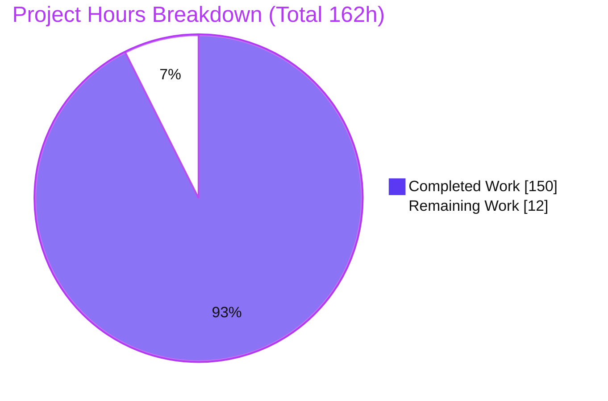
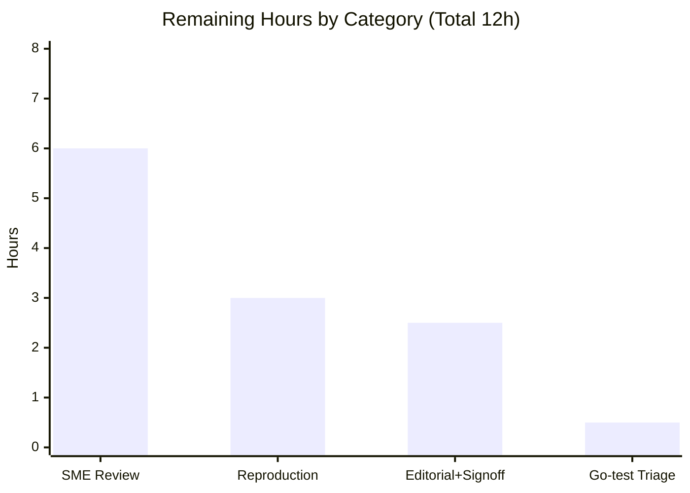

# Blitzy Project Guide

## 1. Executive Summary

### 1.1 Project Overview

This project answers a runtime-grounded engineering question about the **kitty terminal emulator**: how clipboard data crosses kitty's C↔Python boundary when many things happen at once. The deliverable is a single evidence-backed technical document, `blitzy/documentation/kitty_815df1e210e0.md`, addressing five objectives (O1–O5) plus the separate-process kitten boundary. Target users are kitty maintainers and engineers reasoning about terminal concurrency, memory ownership, and clipboard security. Technical scope spans the VT parser, screen model, child monitor, GLFW clipboard bridge, scrollback/history, and disk cache. Every claim is anchored to a `file:line` citation and captured runtime output, labeled observed vs inferred. This is a strictly read-only investigation: the source repository is left byte-for-byte unchanged.

### 1.2 Completion Status


| Metric | Value |
|---|---|
| **Total Hours** | 162 |
| **Completed Hours (AI + Manual)** | 150 (150 AI + 0 Manual) |
| **Remaining Hours** | 12 |
| **Percent Complete** | **92.6%** |

> Completion is computed with the AAP-scoped, hours-based method (PA1): `150 / (150 + 12) × 100 = 92.6%`. The 12 remaining hours are entirely human path-to-production (review, reproduction, sign-off); no in-scope engineering work remains.

### 1.3 Key Accomplishments

- [x] Authored the **5,876-line** runtime-grounded answer document with **575 `file:line` citations across 61 source files** and machine-auditable labeling (**369 `[observed]` + 24 `[inferred]`** tags).
- [x] Built kitty canonically (`python3 setup.py`, exit 0 under strict `-Werror`) plus two diagnostic builds (ASan+UBSan; valgrind-compatible) and ran headless under Xvfb.
- [x] Proved the threading model by live backtrace: I/O thread `KittyChildMon` (`kitty/child-monitor.c:1489`) only fills a shared 1 MiB buffer; VT parsing, all C→Python callbacks, and rendering are serialized on the **main thread under the GIL**.
- [x] **O1** — reproduced the small single-`dispatch_osc` write, buffer-bounded partial-OSC-52 chunking (3 MiB → 8 dispatches, first chunk ≈ `BUF_SZ`), the 16 MiB `io.BytesIO`→on-disk `TemporaryFile` rollover, and byte-exact reconstruction across two runs.
- [x] **O1 security finding** — surfaced a **CWE-400-class** double-scaling of `clipboard_max_size` (`512` → ≈ 512 TiB effective, `kitty/clipboard.py:321`), leaving the truncation guard unreachable by default.
- [x] **O2** — demonstrated the default **3 ms `input_delay`** coalescing gate, the 1 MiB-buffer POLLIN backpressure (`kitty/child-monitor.c:1501`), latency distributions across ≥ 2 runs, and a 2,000-event in-order/complete-delivery proof.
- [x] **Kitten boundary** — exercised the real Go + Python clipboard kitten as a separate process (distinct PIDs), measuring a ≈ 3.3 ms round-trip; confirmed the zero-copy alias does **not** extend across the process boundary.
- [x] **O3** — measured scrollback-scan magnitudes (byte-exact across two runs), `/proc/<pid>/smaps` memory before/during/after, and history RAM-segment growth; showed a pending event waits ≈ the full scan duration.
- [x] **O4** — analyzed the zero-copy `memoryview`'s three lifetimes, proved a genuine **use-after-free** with an AddressSanitizer positive control (3/3 runs) for retain-after-teardown, and showed kitty is safe via copy-out during the synchronous callback.
- [x] **O5** — ran a helgrind campaign: **no race on the VT-parser clipboard path**; **two genuine data races in the graphics disk cache** (`shutting_down`, `cache_file_fd`); documented the `is_self_offer` reentrancy chain.
- [x] Honored read-only scope: **exactly one file added, zero source files modified**, temporary scripts cleaned, working tree byte-for-byte identical to base HEAD `815df1e210e0`.

### 1.4 Critical Unresolved Issues

No build-blocking or validation-blocking defects remain in the deliverable; the autonomous validator cleared all five gates. The items below are non-blocking caveats requiring human attention before formal acceptance.

| Issue | Impact | Owner | ETA |
|---|---|---|---|
| Three headline findings (CWE-400 double-scale, 2 disk-cache races, use-after-free control) not yet independently human-confirmed | Findings should be verified before being relied upon or reported upstream | Kitty-domain reviewer | 3h |
| `xdotool`-dependent accept/deny UI captures (§4.6, §6.3–6.4) not reproducible in either documented image (no offline provisioning) | 2 corroborating overlay captures labeled non-canonical-reproducible; core accept/deny behavior still grounded canonically in §4.5/§4.7 | Reviewer with X11 tooling | (within reproduction, 3h) |
| Environmental Go test `TestCreateAnonymousTempfile` fails (container fs lacks `O_TMPFILE`) | Out-of-scope and unfixable under read-only; risk of misreading as an in-scope defect | Reviewer / infra | 0.5h |

### 1.5 Access Issues

| System / Resource | Type of Access | Issue Description | Resolution Status | Owner |
|---|---|---|---|---|
| `xdotool` (X11 key injection) | Build/test tooling | Absent in **both** the canonical and diagnostic images; `apt-get install xdotool` fails offline (`E: Unable to fetch some archives`) | **Open** — the 2 dependent captures are labeled corroborating-only; behavior grounded canonically elsewhere | Reviewer / infra |
| `strace` / `gdb` / `valgrind` | Diagnostic tooling | Absent in the bare canonical image | **Resolved** — supplied via the PTRACE-enabled `kitty-diag:latest` container (`--cap-add=SYS_PTRACE`), `/app` still at base HEAD | Blitzy (done) |
| Source repository / credentials / third-party APIs | Repo & service access | None required or blocked — self-contained codebase, no network or credentials needed | **N/A** | — |

### 1.6 Recommended Next Steps

1. **[High]** SME technical review of the document against source at HEAD `815df1e210e0` — verify the headline findings and spot-check citation accuracy and observed/inferred labeling. *(6h)*
2. **[Medium]** Reproduce the headline probes in the canonical container — O1 rollover, O3 scan magnitudes, O5 helgrind races, O4 ASan use-after-free control. *(3h)*
3. **[Low]** Final editorial/formatting acceptance pass and publish/sign-off of the document as the answer. *(2.5h)*
4. **[Low]** Decide the disposition of the out-of-scope environmental Go-test note (accept-as-documented or file an upstream note) — no code change. *(0.5h)*

---

## 2. Project Hours Breakdown

### 2.1 Completed Work Detail

| Component | Hours | Description |
|---|---:|---|
| Foundation — Build & Environment (§2, §3) | 18 | Canonical build (`python3 setup.py`, exit 0, `-Werror`) + ASan/UBSan and valgrind-compatible diagnostic builds; Xvfb headless bring-up; byte-identical reproducibility proof; full test-suite run + Go-failure characterization; live thread census. |
| O1 — Clipboard C→Python Transfer (§4) | 24 | Graduated OSC 52 writes (small single-dispatch, buffer-bounded chunking, 16 MiB rollover); `--dump-commands` + `strace` + `/proc/<pid>/fd`; byte-exact reconstruction ×2; OSC 52 `?` and OSC 5522 read/MIME paths; permission prompts; 11-status ledger; `clipboard_max_size` double-scale CWE-400 finding. |
| O2 — Behavior Under Concurrent Load (§5) | 16 | Flood harness with `EAGAIN` backpressure; `input_delay` 0/3/25 ms causal contrast; POLLIN `poll()` strace; DSR latency distributions across ≥ 2 runs; 2,000-event in-order/complete-delivery proof. |
| Kitten Process Boundary (§6) | 12 | Real Go `kitten clipboard` SET/GET with distinct PIDs; prompt-gated two-kitten process tree; Python `ask`-kitten event-loop strace; ≈ 3.3 ms round-trip. |
| O3 — Scrollback Scan Effect (§7) | 18 | Scan magnitude probes (to 60k lines); gdb-synchronized event interposition; canonical get-text seam; `/proc` smaps before/during/after; pager-history behavior; line-count reconciliation. |
| O4 — Timing & Object Ownership (§8) | 16 | Linked 3-breakpoint gdb run; `write.pending → read.sz` promotion under the parser mutex; `memoryview` three-lifetime analysis; ASan use-after-free positive control (3/3); copy-out safety. |
| O5 — Subtle Races (§9) | 20 | helgrind methodology on a valgrind-compatible build; disk-cache race reproduction ×2 (`shutting_down`, `cache_file_fd`); `is_self_offer` reentrancy gdb chain; conclusions bounded to observed runs. |
| Document Authoring & QA Remediation | 22 | 5,876-line evidence-dense document; 575 citations; observed/inferred labeling; §10 coverage ledger; 8 commits (initial draft + seven remediation cycles resolving 60+ code-review/QA findings). |
| Cleanup & Repository Integrity (§11.2) | 4 | Temp-script removal under `/tmp`; `docker diff` audit; git integrity proof (tree byte-identical to base HEAD). |
| **Total Completed** | **150** | |

### 2.2 Remaining Work Detail

| Category | Hours | Priority |
|---|---:|---|
| SME technical review of the document (findings + citations + coverage ledger) | 6.0 | High |
| Reproduce headline probes in the canonical container (O1 rollover, O3 scan, O5 helgrind, O4 ASan) | 3.0 | Medium |
| Final editorial/formatting acceptance pass + publish/sign-off | 2.5 | Low |
| Triage disposition of the out-of-scope environmental Go-test note (no code change) | 0.5 | Low |
| **Total Remaining** | **12.0** | |

> **Reconciliation:** Completed (150) + Remaining (12) = **162 Total** = Section 1.2. Section 2.2 total (12) = Section 1.2 Remaining = Section 7 "Remaining Work".

---

## 3. Test Results

All results below originate from Blitzy's autonomous validation logs for this project (canonical container, HEAD `815df1e210e0`). Coverage is reported as **n/r** (not reported) because kitty's suite reports pass/fail, not line coverage.

| Test Category | Framework | Total Tests | Passed | Failed | Coverage % | Notes |
|---|---|---:|---:|---:|:--:|---|
| Unit — Full Python suite | Python `unittest` (`./test.py`) | 145 | 141 | 0 | n/r | Result **OK**; 4 skipped (env-declared: frozen-build cert, macOS-only font, 2 fish-integration). |
| Unit — clipboard *(subset)* | Python `unittest` | 1 | 1 | 0 | n/r | `test_clipboard_write_request` ok — O1 evidence base. |
| Unit — parser *(subset)* | Python `unittest` | 16 | 16 | 0 | n/r | incl. `test_osc_codes`, `test_parser_threading` — O1/O2 evidence base. |
| Unit — screen *(subset)* | Python `unittest` | 36 | 36 | 0 | n/r | O3 scrollback evidence base. |
| Memory safety — ASan + UBSan | `setup.py --debug --sanitize` | clipboard + parser modules | clean | 0 | n/r | **Zero sanitizer reports** on the boundary code. |
| Integration — Go suite | Go `testing` (via `./test.py`) | 26 packages | 25 pkgs | 1 test | n/r | `TestCreateAnonymousTempfile` fails — environment-only (`O_TMPFILE`/`EOPNOTSUPP`), out-of-scope, unfixable under read-only, documented in doc §2.4. |

*Subset rows are contained within the 145-test full suite and are not additive.* The single Go failure is the only failing test and is orthogonal to the clipboard/parser/scrollback investigation.

---

## 4. Runtime Validation & UI Verification

This deliverable has no web UI; "UI verification" pertains to kitty's interactive clipboard-read confirmation overlay (the `ask` kitten). Runtime health was validated live in the canonical container.

**Build & core runtime**
- ✅ **Operational** — Canonical build `python3 setup.py` completes with exit 0 under `-Werror` (122 compile steps, zero warnings).
- ✅ **Operational** — `kitty 0.35.2` launches headless under Xvfb `:99`; `fast_data_types` C extension imports; `+launch` interpreter works.

**O1 — Clipboard transfer**
- ✅ **Operational** — Small OSC 52 write → single `clipboard_control 52 c;aGVsbG8=` dispatch.
- ✅ **Operational** — Large write (3 MiB) → buffer-bounded partial-OSC-52 chunking (8 dispatches, first chunk ≈ `BUF_SZ`), byte-exact reconstruction.
- ✅ **Operational** — 16 MiB write → `io.BytesIO`→on-disk `TemporaryFile` rollover observed via `/proc/<pid>/fd` + `strace`.

**O2 / O3 / O4 / O5**
- ✅ **Operational** — Thread topology census (`KittyChildMon` present; kitty's own `DiskCacheWrite` lazily created, absent at idle).
- ✅ **Operational** — O3 scrollback-scan magnitudes byte-exact across two runs; smaps deltas captured.
- ✅ **Operational** — O5 `is_self_offer` canonical round-trip (match = YES); disk-cache races reproduced under helgrind ×2.
- ✅ **Operational** — O4 use-after-free positive control reproduced 3/3 under ASan.

**API / integration outcomes**
- ✅ **Operational** — Canonical OSC 52 / OSC 5522 read paths (`OK`/`DATA`/`DONE`) and error branches (`EPERM`, `EINVAL`) captured through a real PTY.
- ⚠ **Partial** — Interactive overlay **accept/deny** captures (`read-clipboard-ask`) depend on `xdotool`, absent in both images; labeled corroborating-only. The underlying accept→`OK`/`DATA`/`DONE`, deny→`EPERM` behavior is grounded canonically in §4.5/§4.7.
- ❌ **Failing** — Go `TestCreateAnonymousTempfile` (environment-only, `O_TMPFILE`); out-of-scope and documented.

---

## 5. Compliance & Quality Review

Cross-map of the governing **SWE-AtlasQnA-Repo** rules and AAP deliverables to observed evidence. Progress: ▰▰▰▰▰ = fully met.

| Requirement (AAP §0.7 / deliverables) | Status | Progress | Evidence |
|---|:--:|:--:|---|
| Deliverable created at `blitzy/documentation/kitty_815df1e210e0.md` | ✅ Pass | ▰▰▰▰▰ | 5,876 lines; only file added vs base. |
| Investigate-by-running-first (observe, don't infer) | ✅ Pass | ▰▰▰▰▰ | 369 `[observed]` captures with full unedited output. |
| Exercise the real canonical entry point (OSC 52 through a PTY; no RC/debug bypass) | ✅ Pass | ▰▰▰▰▰ | Probes labeled canonical/non-canonical in §11.1; RC path used only as labeled cross-check. |
| Default, canonical build & configuration; exact commands stated | ✅ Pass | ▰▰▰▰▰ | `python3 setup.py`; defaults held (`input_delay` 3 ms, `clipboard_max_size` 512). |
| Magnitude/timing stable across ≥ 2 runs (or reported as distribution) | ✅ Pass | ▰▰▰▰▰ | O2 latency distributions; O3 byte-exact across two runs. |
| Exercise every condition (primary, secondary, error/edge, before/during/after) | ✅ Pass | ▰▰▰▰▰ | 11-status ledger; permission prompts; backpressure; scan before/during/after. |
| Include actual, unedited output for every claim | ✅ Pass | ▰▰▰▰▰ | Command + complete output embedded next to each finding. |
| Answer every sub-part and named mechanism | ✅ Pass | ▰▰▰▰▰ | §10 coverage ledger maps O1–O5 + kitten boundary + every named symbol. |
| Exact & grounded (`file:line`, observed vs inferred) | ✅ Pass | ▰▰▰▰▰ | 575 citations across 61 files; 369 observed / 24 inferred labels. |
| Read-only scope (no source modified; temp scripts removed) | ✅ Pass | ▰▰▰▰▰ | `git diff --name-status` shows only the added doc; tree byte-identical to base. |

**Fixes applied during autonomous validation:** none required — the document passed build validation, citation accuracy, runtime reproduction, consistency/formatting, and test-suite validation with **zero corrections** across all phases. **Outstanding quality items:** human SME confirmation of the three headline findings (see §1.4).

---

## 6. Risk Assessment

| Risk | Category | Severity | Probability | Mitigation | Status |
|---|---|:--:|:--:|---|---|
| Out-of-image tooling (`xdotool`, `strace`/PTRACE) needed for some §4.6/§6 corroborating captures → not reproducible in the plain canonical image | Technical | Low | Medium | Labeled "corroborating, not canonical-reproducible"; core behavior grounded canonically elsewhere | Documented / Accepted |
| 24 `[inferred]` claims (untested surfaces: macOS/Cocoa, Wayland; source-only failed reproductions) not runtime-verified at HEAD | Technical | Low | Low | Machine-auditable `[inferred]` labels; §9.7 enumerates untested surfaces | Documented |
| Timing/magnitude values environment-specific (container CPU/fs); absolute latencies (~3.3 ms) hardware-dependent | Technical | Low | Medium | Reported as distributions across ≥ 2 runs, not single numbers | Mitigated |
| **CWE-400** `clipboard_max_size` double-scaling (512 → ≈ 512 TiB effective; truncation guard unreachable by default), `kitty/clipboard.py:321` | Security *(finding in kitty)* | Medium | N/A (observed) | Positive control shows the guard fires with a tiny limit; accuracy to be human-confirmed | Documented finding |
| Genuine **use-after-free** reading the boundary `memoryview` after parser teardown (ASan 3/3); kitty itself not exposed (copies out) | Security *(finding in kitty)* | Medium | N/A (observed) | Bounded to a positive control; kitty's copy-out path shown safe | Documented finding |
| Two **data races** in the graphics disk cache (`shutting_down`, `cache_file_fd`) under helgrind ×2 | Security *(finding in kitty)* | Medium | N/A (observed) | Bounded to "observed in these runs"; distinct from the clipboard path | Documented finding |
| Large document (5,876 lines) → non-trivial review effort; risk of superficial review missing an inaccuracy | Operational | Low | Low | §10 coverage ledger + observed/inferred tags enable structured review | Open (human review) |
| Reproducibility tied to specific container image + diagnostic PTRACE container (environment drift) | Operational | Low | Low | Exact commands + per-probe `sha256` digests embedded | Mitigated |
| Environment-only Go test failure (`TestCreateAnonymousTempfile`, no `O_TMPFILE`) | Integration | Low | N/A (deterministic env) | Documented §2.4 as environment-driven, orthogonal, out-of-scope | Accepted (unfixable under read-only) |

---

## 7. Visual Project Status



**Remaining hours by category (Section 2.2):**



**Remaining hours by priority:** High = 6h · Medium = 3h · Low = 3h (total 12h).

> Brand colors: Completed = Dark Blue `#5B39F3`; Remaining = White `#FFFFFF`; accents Violet-Black `#B23AF2`. The pie "Remaining Work" (12) equals Section 1.2 Remaining Hours and the Section 2.2 total.

---

## 8. Summary & Recommendations

**Achievements.** The investigation is **92.6% complete** (150 of 162 hours). It delivers a comprehensive, runtime-grounded answer to how kitty moves clipboard data across its C↔Python boundary under concurrent load. It proves — with live backtraces, `--dump-commands` traces, `strace`, gdb, ASan, and helgrind — the multi-threaded I/O + single-threaded GIL-serialized dispatch model; the zero-copy `memoryview` boundary and its copy-out safety; the small/chunked/rollover clipboard size regimes; `input_delay` coalescing and POLLIN backpressure; the separate-process kitten boundary; and the scrollback-scan interference on event delivery and memory.

**Remaining gaps (path-to-production, 12h).** All remaining work is human: SME accuracy review (6h), reproduction spot-checks in the canonical container (3h), editorial acceptance and sign-off (2.5h), and a disposition decision on the out-of-scope environmental Go-test note (0.5h). No in-scope engineering work remains and the source tree is unchanged.

**Critical path to production.** SME review → reproduction spot-check → editorial sign-off → publish. The three headline findings (CWE-400 double-scale, disk-cache races, use-after-free control) should be human-confirmed before being relied upon or reported upstream.

**Success metrics.** ✅ Build compiles cleanly; ✅ 145 Python tests OK (4 env-skips); ✅ investigation-relevant modules pass 100%; ✅ every objective sub-part answered per the §10 ledger; ✅ read-only scope honored (1 file added, 0 source changed).

**Production-readiness assessment.** The single in-scope deliverable is **production-ready pending human sign-off**. The lone failing test is an environmental Go limitation that is out-of-scope and unfixable under the read-only constraint, and is honestly documented. Recommended disposition: **accept after the 12h human review path above.**

| Metric | Value |
|---|---|
| Completion | 92.6% |
| Completed / Total hours | 150 / 162 |
| Remaining hours | 12 |
| In-scope failing tests | 0 |
| Source files modified | 0 |

---

## 9. Development Guide

This is a **read-only investigation**. There are two tracks: **(A) consume/verify the deliverable** — reproducible on any machine with `git` + coreutils; and **(B) reproduce the runtime evidence** — requires the canonical container. Track-A commands were verified in-sandbox; Track-B commands are captured verbatim from the validated canonical run.

### 9.1 System Prerequisites

- **Track A (verify):** `git`, Python ≥ 3.8, coreutils, a UTF-8 markdown viewer.
- **Track B (reproduce evidence):** Docker; the canonical image `swe-atlas-kitty:canonical` (`ghcr.io/scaleapi/swe-atlas:swe_atlas_QnA_kovidgoyal_kitty_1.0`) — **Ubuntu 24.04.2 LTS**, kernel `6.6.122+ x86_64`, **Python 3.12.3**, **gcc 13.3.0**, **go1.23.4**, **kitty 0.35.2**, `/app` at HEAD `815df1e210e0`; **Xvfb** for headless display; for trace/detector probes, the PTRACE-enabled `kitty-diag:latest` (adds `strace`/`gdb`/`valgrind`, run with `--cap-add=SYS_PTRACE`).

### 9.2 Environment Setup

```bash
# Track A — verify the deliverable (any host)
cd <repo-root>
git rev-parse HEAD
git status --porcelain            # expect: empty (clean tree)

# Track B — reproduce evidence (canonical container)
# docker run --rm -it swe-atlas-kitty:canonical bash
# Start the headless X server before launching kitty:
[ -S /tmp/.X11-unix/X99 ] || { rm -f /tmp/.X99-lock; \
  setsid Xvfb :99 -screen 0 1024x768x24 >/tmp/xvfb.log 2>&1 & sleep 3; }
```

### 9.3 Dependency Installation

No project dependencies are added, updated, or removed (read-only scope). The canonical build itself compiles the `fast_data_types` C extension, the GLFW backends, and the Go launcher/kitten binaries:

```bash
# Canonical build (container) — exit 0, ~48s, strict -Werror
cd /app && python3 setup.py

# Diagnostic cross-check builds (non-default, labeled)
python3 setup.py --debug --sanitize      # ASan + UBSan memory-safety cross-check
```

### 9.4 Application Startup

```bash
# Track A — open the deliverable
$PAGER blitzy/documentation/kitty_815df1e210e0.md   # or any markdown viewer

# Track B — launch kitty headless (container)
DISPLAY=:99 ./kitty/launcher/kitty --version        # -> kitty 0.35.2 created by Kovid Goyal
```

### 9.5 Verification Steps

```bash
# Track A — read-only scope + document integrity (verified in-sandbox, all pass)
git diff --name-status 815df1e210e0a9ab4622f5c7f2d6891d7dbeddf1..HEAD
#   expect exactly: A  blitzy/documentation/kitty_815df1e210e0.md
wc -l blitzy/documentation/kitty_815df1e210e0.md   # 5876
grep -c '^```' blitzy/documentation/kitty_815df1e210e0.md   # 286 (even => balanced)
iconv -f UTF-8 -t UTF-8 blitzy/documentation/kitty_815df1e210e0.md >/dev/null && echo "UTF-8 OK"

# Track B — test suite (canonical container)
DISPLAY=:99 LANG=C.UTF-8 ./test.py                 # -> Ran 145 tests ... OK (skipped=4)
DISPLAY=:99 ./test.py --module clipboard           # -> Ran 1 test ... OK
DISPLAY=:99 ./test.py --module parser              # -> Ran 16 tests ... OK
DISPLAY=:99 ./test.py --module screen              # -> Ran 36 tests ... OK
```

### 9.6 Example Usage

- Navigate the document top-down; use the **§10 coverage ledger** to jump from any objective sub-part or named mechanism to its evidence anchor.
- Reproduce a headline probe (full bodies embedded inline + inventoried in §11.1 with `sha256`): O1 small write §4.1, O1 rollover §4.3 (`o1_rollover.sh`), O3 scan §7.1 (`o3_probe.py`), O4 use-after-free §8.3.1, O5 helgrind races §9.
- Trace/detector probes must run in `kitty-diag:latest` with `--cap-add=SYS_PTRACE`.

### 9.7 Troubleshooting

- **`go: command not found` (this sandbox):** the build/run/test track is **container-only**; use `swe-atlas-kitty:canonical`.
- **`strace`/`gdb`/`valgrind` absent:** use the PTRACE-enabled `kitty-diag:latest` container with `--cap-add=SYS_PTRACE`.
- **`xdotool` absent (both images, no offline install):** the §4.6/§6.3–6.4 accept/deny captures are corroborating-only; behavior is grounded canonically in §4.5/§4.7.
- **`valgrind` SIGILL under the canonical build:** the `-O3 -march=native` build emits AVX-512VL that valgrind can't decode; use the byte-identical valgrind-compatible diagnostic build described in §9.1 of the document.
- **kitty won't start headless:** ensure `Xvfb :99` is running and `DISPLAY=:99` is exported (see §9.2).
- **Go `TestCreateAnonymousTempfile` fails:** environment-only (container fs lacks `O_TMPFILE`→`EOPNOTSUPP`); out-of-scope, unfixable under read-only, documented in doc §2.4.

---

## 10. Appendices

### A. Command Reference

| Purpose | Command |
|---|---|
| Canonical build | `cd /app && python3 setup.py` |
| Diagnostic build (ASan/UBSan) | `python3 setup.py --debug --sanitize` |
| Launch headless | `DISPLAY=:99 ./kitty/launcher/kitty` |
| Full test suite | `DISPLAY=:99 LANG=C.UTF-8 ./test.py` |
| Focused module tests | `DISPLAY=:99 ./test.py --module clipboard\|parser\|screen` |
| VT-parser tracing | `kitty --dump-commands` / `--dump-bytes` |
| Read-only scope proof | `git diff --name-status 815df1e210e0..HEAD` |
| Clean-tree proof | `git status --porcelain` (expect empty) |

### B. Port Reference

| Resource | Value | Notes |
|---|---|---|
| Network service ports | none | kitty is a terminal emulator, not a network server; no TCP/HTTP ports are opened by this investigation. |
| X11 display | `:99` | Xvfb virtual display socket `/tmp/.X11-unix/X99` used for headless runs. |

### C. Key File Locations

| Path | Role |
|---|---|
| `blitzy/documentation/kitty_815df1e210e0.md` | **The deliverable** (only file added). |
| `kitty/vt-parser.c` | Shared 1 MiB buffer, `dispatch_osc` zero-copy `memoryview`, chunking, `input_delay` gate. |
| `kitty/screen.c` | `CALLBACK` C→Python macro, `clipboard_control`, scrollback text scan. |
| `kitty/child-monitor.c` | I/O thread `KittyChildMon`, main tick, POLLIN backpressure. |
| `kitty/clipboard.py` | `WriteRequest`/`Tempfile` BytesIO→disk rollover, `clipboard_max_size`. |
| `kitty/glfw.c` | OS-clipboard owner callbacks, `is_self_offer`. |
| `kitty/history.c`, `kitty/line.c` | Scrollback RAM segments and `as_text_generic` scan loop. |
| `kitty/disk-cache.c` | Background `DiskCacheWrite` thread (disk-cache races). |

### D. Technology Versions (canonical container)

| Component | Version |
|---|---|
| OS | Ubuntu 24.04.2 LTS (kernel 6.6.122+ x86_64) |
| Python | 3.12.3 |
| C compiler | gcc 13.3.0 |
| Go | go1.23.4 |
| kitty (built) | 0.35.2 |
| Source HEAD | `815df1e210e0a9ab4622f5c7f2d6891d7dbeddf1` |

### E. Environment Variable Reference

| Variable | Value | Purpose |
|---|---|---|
| `DISPLAY` | `:99` | Headless Xvfb display for GUI-dependent runs/tests. |
| `LANG` / `LC_ALL` | `C.UTF-8` | Deterministic UTF-8 locale for the suite and byte-exact captures. |

### F. Developer Tools Guide

| Tool | Use |
|---|---|
| `--dump-commands` / `--dump-bytes` | In-repo canonical VT-parser dispatch tracing (preferred). |
| `--debug-input` / `--replay-commands` | In-repo input/replay diagnostics. |
| `gdb` | Linked breakpoints for lock/lifetime and event-delivery seams (diagnostic container). |
| `strace` | `/proc`-fd + file-syscall trace of the rollover; POLLIN `poll()` trace (diagnostic container). |
| `valgrind` / `helgrind` | Data-race detection (valgrind-compatible diagnostic build). |
| ASan + UBSan | Memory-safety cross-check of the boundary code (`setup.py --debug --sanitize`). |
| `/proc/<pid>/smaps` | Scrollback-scan memory measurement (before/during/after). |

### G. Glossary

| Term | Meaning |
|---|---|
| **OSC 52 / OSC 5522** | Terminal escape codes carrying clipboard set/get payloads; the canonical clipboard entry point. |
| **GIL** | CPython Global Interpreter Lock — serializes all Python callbacks onto the main thread. |
| **`memoryview`** | Zero-copy Python view over the live C parser buffer; valid only within the C dispatch scope. |
| **`BUF_SZ`** | The shared 1 MiB VT-parser buffer (`kitty/vt-parser.c:18`). |
| **`input_delay`** | Default 3 ms coalescing gate before parsing bursty PTY output. |
| **PTY** | Pseudo-terminal; the real channel through which OSC 52 reaches the parser. |
| **DSR** | Device Status Report — a query used to measure event-delivery latency. |
| **CWE-400** | Uncontrolled Resource Consumption — class of the `clipboard_max_size` double-scale finding. |
| **use-after-free** | Reading the boundary `memoryview` after the parser buffer is freed. |
| **helgrind / ASan / UBSan / TSan** | Data-race / memory-safety / undefined-behavior / thread sanitizers used as cross-checks. |
| **`Tempfile` rollover** | `io.BytesIO`→on-disk `TemporaryFile` transition at 16 MiB in `kitty/clipboard.py`. |
| **`KittyChildMon`** | The PTY I/O thread that only fills the shared buffer (no Python C-API). |