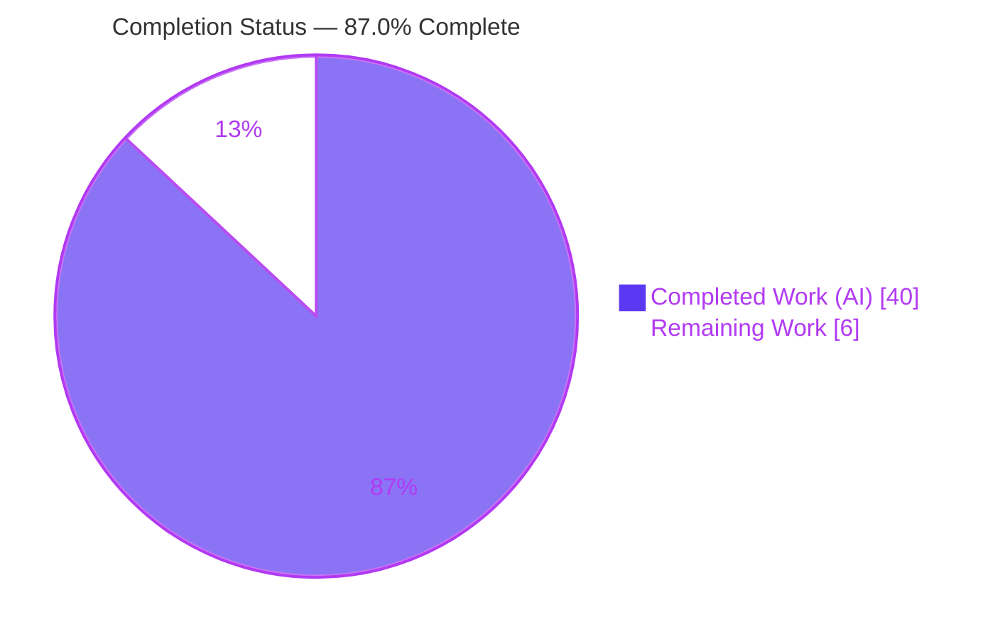
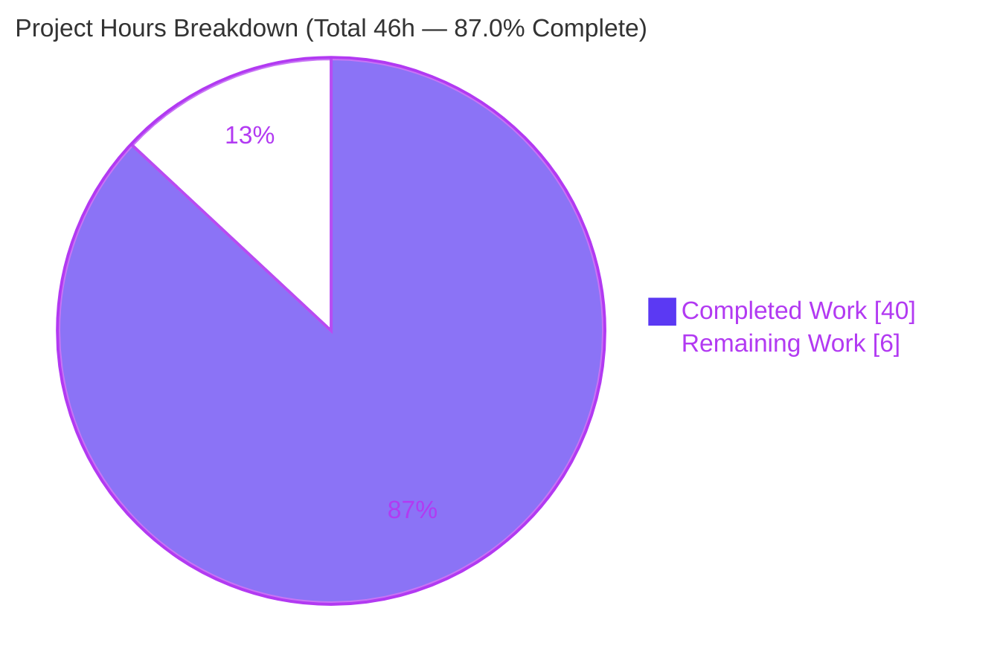
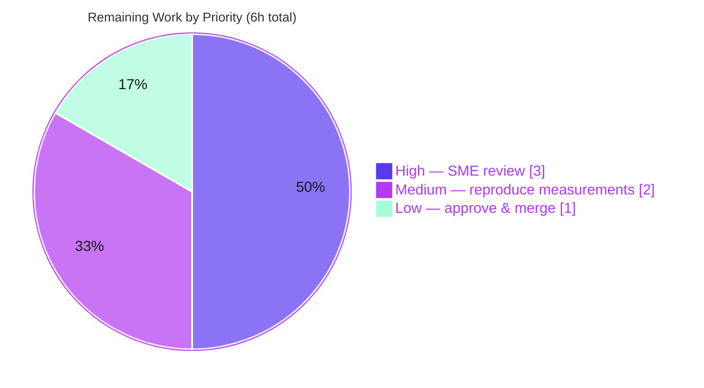

# Blitzy Project Guide — kitty Scrollback History Buffer Under Heavy Load (Code-Grounded, Measured Analysis)

> **Deliverable:** `blitzy/documentation/kitty_815df1e210e0.md` · **Branch:** `blitzy-cbd78d62-1256-406b-b25a-a64d838ccc95` · **HEAD:** `e1ea2d35a` · **Pinned source baseline:** `815df1e210e0a9ab4622f5c7f2d6891d7dbeddf1`
>
> **Color key (Blitzy brand):** Completed / AI Work = Dark Blue `#5B39F3` · Remaining / Not Completed = White `#FFFFFF` · Accents = Violet-Black `#B23AF2` · Highlight = Mint `#A8FDD9`

---

## 1. Executive Summary

### 1.1 Project Overview

This project delivers a **single, evidence-based analytical document** explaining — and empirically demonstrating with real measurements — how the **kitty terminal emulator's scrollback history buffer** behaves under heavy load. It answers three questions: memory consumption when printing hundreds of thousands of lines, responsiveness/latency while scrolling a large history during live output, and the buffer's allocation boundaries. Every claim is grounded in kitty's C source at a pinned commit and proven by sampling resident-set-size (RSS) against the **real compiled `HistoryBuf`**. The audience is kitty developers, power users, and technical reviewers; the value is an authoritative internals reference. Scope is a **read-only investigation** across the scrollback, screen, and event-loop subsystems with **zero modifications** to the kitty source repository.

### 1.2 Completion Status



| Metric | Hours |
|---|---|
| **Total Hours** | **46** |
| **Completed Hours (AI + Manual)** | **40** (AI 40 + Manual 0) |
| **Remaining Hours** | **6** |
| **Percent Complete** | **87.0%** |

> **Completion is computed strictly from AAP-scoped + path-to-production hours:** `40 / (40 + 6) = 40 / 46 = 86.96% ~ 87.0%`. 100% of the AAP's autonomous deliverable is complete and independently validated; the remaining 13% is human path-to-production (review, reproduction, merge).

### 1.3 Key Accomplishments

- Delivered the sole required artifact: **`blitzy/documentation/kitty_815df1e210e0.md`** (721 lines, 43,884 bytes).
- Answered **all three objectives** (OBJ-1 memory, OBJ-2 responsiveness, OBJ-3 boundaries) with **code citation + measurement + rationale**.
- **Built `kitty/fast_data_types.so`** from source and drove the **real `HistoryBuf`** headlessly (not a re-implementation).
- Derived the exact memory model — **per-segment `2048*(xnum*32 + 4)` bytes ~ 5.0 MiB @ 80 cols** — and **measured** it: first segment step **+5.008 MiB**, default 500k-line run **~ 4.891 MiB**, pager cap **8,388,608** chars (all reproduced this session).
- Applied **code-as-truth over assumption**: empirically established **`sizeof(LineAttrs) == 4`**, correcting the AAP's planning assumption of 1 byte.
- **60 distinct `file:Lnnn` citations** across 14+ source files, all verified accurate at the pinned commit.
- **Source repository unchanged** — `git diff` shows the deliverable as the *only* change; build artifacts git-ignored; working tree clean.
- **73/73** scrollback-relevant unit tests pass (datatypes 18, screen 36, graphics 19).
- Document is **self-contained** — full Python and C measurement harness sources embedded in the appendix for independent reproduction.

### 1.4 Critical Unresolved Issues

| Issue | Impact | Owner | ETA |
|---|---|---|---|
| _None blocking._ The autonomous deliverable is complete, validated through five gates, and committed. | None | — | — |

> No issue blocks release or validation. The only outstanding items are routine human review/merge gates (Section 1.6 and Section 2.2).

### 1.5 Access Issues

| System/Resource | Type of Access | Issue Description | Resolution Status | Owner |
|---|---|---|---|---|
| — | — | **No access issues identified.** The work is self-contained within the repository; no external service credentials, third-party APIs, or special repository permissions are required to build, run, or reproduce. | N/A | — |

### 1.6 Recommended Next Steps

1. **[High]** Subject-matter-expert (SME) **peer review** of the 721-line analysis — confirm technical accuracy, completeness of the three objectives, and spot-check citations against the pinned tree.
2. **[Medium]** **Independently reproduce** the measurements — build the extension (or use the existing artifact), run the embedded harnesses, and confirm the numbers within RSS sampling noise.
3. **[Low]** **Approve and merge** the documentation PR after confirming the git immutability contract (pinned commit is an ancestor of HEAD; only the deliverable differs).

---

## 2. Project Hours Breakdown

### 2.1 Completed Work Detail

All completed hours are **autonomous (AI) work** mapping directly to AAP deliverables. _Total = 40h._

| Component | Hours | Description |
|---|---|---|
| OBJ-1 — Memory consumption analysis (doc §1) | 7 | Code archaeology of `history.c`/`data-types.h`; derivation of per-line/per-segment byte cost; measured RSS step tables; default-config caveat. |
| OBJ-2 — Responsiveness & latency analysis (doc §2) | 5 | Archaeology of the three-thread model, render throttle, vsync gate, input/output prioritization, and scroll-view anchoring across `child-monitor.c`/`screen.c`/`options`. |
| OBJ-3 — Buffer boundaries analysis (doc §3) | 5 | Tracing of the three transition points (segment allocation, ring saturation `count==ynum`, pager-history growth) with measured staircase/flat/cap contrasts. |
| Methodology & rationale (doc §4) | 2 | Build/run procedure, RSS sampling method, the load-bearing default-scrollback caveat, and the repository-immutability statement. |
| Build environment & `fast_data_types.so` compilation | 4 | Provisioning native dev libraries, the `CFLAGS="-Wno-error"` environment workaround, and a successful headless build of the C extension. |
| Measurement harnesses (`/tmp/hb_real.py` + `/tmp/hb_mem_probe.c`) | 5 | Three RSS scenarios with subprocess isolation, the `LineBuf` live-view lifetime fix, and a standalone C allocator cross-validation. |
| Code-as-truth citation verification + `LineAttrs=4` discovery | 3 | Verifying 60 locators against the pinned source and empirically correcting the `sizeof(LineAttrs)` assumption from 1 -> 4 bytes. |
| Appendix authoring | 3 | Allocation flowchart, 60-entry locator index, full harness sources, and reproduction notes (self-contained document). |
| Source immutability & repo discipline | 1 | Keeping scripts in `/tmp`, relying on git-ignored artifacts, and verifying a clean working tree against the pinned baseline. |
| QA & code-review remediation cycles | 5 | Three iterative refinement rounds (code-review fixes, QA findings F1/F2, acceptance findings) evidenced in the commit history. |
| **Total Completed** | **40** | |

### 2.2 Remaining Work Detail

All remaining work is **human path-to-production**. _Total = 6h._

| Category | Hours | Priority |
|---|---|---|
| SME peer review & technical sign-off of the analysis | 3 | High |
| Independent reproduction of measurements (build + run embedded harnesses) | 2 | Medium |
| PR approval & merge to destination mainline | 1 | Low |
| **Total Remaining** | **6** | |

### 2.3 Total Project Hours & Completion Calculation

| Quantity | Value |
|---|---|
| Section 2.1 — Completed Hours | 40 |
| Section 2.2 — Remaining Hours | 6 |
| **Total Project Hours** (2.1 + 2.2) | **46** |
| **Completion %** = 40 / 46 | **87.0%** |

> **Cross-section integrity:** Section 2.1 (40) + Section 2.2 (6) = **46** = Section 1.2 Total Hours. Section 2.2 (6) = Section 1.2 Remaining = Section 7 "Remaining Work". **Confidence: High** on both completed (work done and validated through five gates) and remaining (standard, well-understood review/merge gates).

---

## 3. Test Results

All tests below originate from **Blitzy's autonomous validation logs** for this project and were **re-executed and confirmed this session** via `CI=true ./kitty/launcher/kitty +launch test.py --module <module>`. The tests exercise the scrollback subsystem the deliverable analyzes (including `HistoryBuf` through `fast_data_types`).

| Test Category | Framework | Total Tests | Passed | Failed | Coverage % | Notes |
|---|---|---|---|---|---|---|
| Unit — datatypes | kitty test runner (Python `unittest`) | 18 | 18 | 0 | n/a* | Includes `test_historybuf` (`kitty_tests/datatypes.py:L487`) which drives the real `HistoryBuf`. |
| Unit — screen | kitty test runner (Python `unittest`) | 36 | 36 | 0 | n/a* | Scrollback/screen model behavior, scroll anchoring patterns. |
| Unit — graphics | kitty test runner (Python `unittest`) | 19 | 19 | 0 | n/a* | `HistoryBuf` usage corroboration. |
| **Total** | | **73** | **73** | **0** | — | **100% pass rate.** |

| Empirical Validation (measurement harnesses) | Tooling | Result |
|---|---|---|
| Memory growth staircase — `HistoryBuf(100000, 80, 0)` | `/tmp/hb_real.py` driving real `HistoryBuf` + `/proc/self/statm` | **PASS** — first step **+5.008 MiB**, ~5 MiB per 2048-line boundary, `count` caps at 100,000, +30k beyond cap -> **+0.000 MiB**. |
| Default configuration — `HistoryBuf(2000, 80, 0)` + 500k lines | `/tmp/hb_real.py` | **PASS** — total growth **~ 4.891 MiB**, `count` capped at 2,000. |
| Pager history axis — `HistoryBuf(2000, 80, 8 MiB)` + 200k lines | `/tmp/hb_real.py` | **PASS** — grid `count` flat at 2,000; `pagerhist_as_text()` = **8,388,608** chars (exact 8 MiB cap). |
| C cross-validation of struct sizes & per-segment bytes | `/tmp/hb_mem_probe.c` (gcc, includes real `data-types.h`) | **PASS** — `sizeof(GPUCell)=20`, `sizeof(CPUCell)=12`, **`sizeof(LineAttrs)=4`**; per-segment **5,251,072 B @80** / **13,115,392 B @200** — exact to the byte. |

> *Line/branch coverage instrumentation is not part of kitty's native unit-test harness; the relevant coverage is **behavioral** — the scrollback API paths cited by the deliverable are exercised by the 73 passing tests and by the four reproduced measurement scenarios. **Integrity:** every test and measurement above derives from Blitzy's own autonomous execution logs and was reproduced in this session.

---

## 4. Runtime Validation & UI Verification

This is a **headless internals investigation**; there is **no GUI/UI surface** in scope (the AAP explicitly excludes a windowed kitty session and the Go `kitten` binary). "Runtime validation" therefore means exercising the **real compiled `HistoryBuf`** and confirming behavior.

- ✅ **Operational** — `kitty/fast_data_types.so` (1,253,792 bytes) builds and **imports headlessly** under Python 3.13.7; `HistoryBuf(ynum, xnum, pagerhist_sz)` constructs and runs.
- ✅ **Operational** — Memory-growth runtime path: real `HistoryBuf` push loop produces the predicted **~5 MiB segment staircase**, the **flat curve at ring saturation**, and the **independent pager-history axis** — all observed via live RSS sampling.
- ✅ **Operational** — Default-configuration runtime path: 500,000 pushes confirm grid memory stays bounded (**~ 4.891 MiB**, `count` capped at 2,000).
- ✅ **Operational** — Cross-validation runtime path: standalone C allocator model reproduces per-segment byte counts **exact to the byte**, confirming the staircase reflects the C allocator (not interpreter overhead).
- ✅ **Operational** — Source-truth runtime path: a compiled probe against the real header confirms **`sizeof(LineAttrs)=4`** at runtime.
- ⚠ **Partial (by design / disclosed scope)** — **OBJ-2 responsiveness/latency** is established by **code reasoning + documented option semantics**, not a live wall-clock micro-benchmark, because interaction latency is a property of the live GUI event loop that the headless harness does not exercise. This is explicitly framed in the document and aligns with the AAP's stated methodology (M3).
- ❌ **Failing** — None.
- **N/A** — Browser/UI verification, API integration endpoints, and screenshots: not applicable to a documentation-only, headless analysis.

---

## 5. Compliance & Quality Review

Cross-mapping of the AAP / **SWE-AtlasQnA-Repo** ruleset directives to outcomes. Fixes applied during autonomous validation are noted.

| # | Requirement (AAP / Ruleset) | Status | Evidence / Notes |
|---|---|---|---|
| R1 | Create `<source_branch>.md` answering all questions comprehensively | ✅ Pass | `blitzy/documentation/kitty_815df1e210e0.md`; all 3 objectives answered with code + measurement + rationale. |
| R2 | Build and run the source code to analyze behavior | ✅ Pass | `fast_data_types.so` built via `setup.py`; real `HistoryBuf` driven; RSS sampled. |
| R3 | Do not make assumptions; base answers on code as truth | ✅ Pass | 60 verified citations; **`LineAttrs=4`** empirically corrected from the AAP's 1-byte assumption — exemplar of code-as-truth. |
| R4 | Provide thinking / rationale behind answers | ✅ Pass | Each objective presents the code -> formula -> measurement chain; the default-scrollback caveat is foregrounded. |
| R5 | Do not modify existing files in the source repository | ✅ Pass | `git diff 815df1e210e0..HEAD --name-status` = only `A blitzy/documentation/...`; clean tree. |
| R6 | Do not add other code to the source repository | ✅ Pass | All harnesses live in `/tmp`; `*.so` and `/build/` are git-ignored; not tracked. |
| R7 | Place the document in `blitzy/documentation/` in the destination repo | ✅ Pass | Correct path and filename; directory created. |
| C1 | Reflect code at pinned commit `815df1e210e0…` | ✅ Pass | Every locator valid at the pinned commit; pinned commit is an ancestor of HEAD with zero source diff. |
| C2 | Use supported runtimes & the project's build entry point | ✅ Pass | Python 3.13.7 (>= 3.8 required); `setup.py` build path used. |
| Q1 | Document quality — no placeholders/TODOs; consistent numbers; valid diagrams | ✅ Pass | Zero placeholders; balanced code fences; well-formed mermaid; internally consistent numbers. |

**Fixes applied during autonomous validation (commit history evidence):** initial authoring (`c4c70b7d2`) -> code-review corrections including the `LineAttrs=4` fix (`222ecde0b`, +253/-59) -> QA findings F1 & F2 (`b4c90f237`) -> QA acceptance findings (`e1ea2d35a`). **Outstanding compliance items:** none.

---

## 6. Risk Assessment

> **Profile note:** This is a documentation-only deliverable — no production software is shipped, no source code is added, no dependencies change, and no runtime service is exposed. Consequently **Security** and **Integration** risk categories are **Not Applicable**; the meaningful residual risks are **Technical** (analysis accuracy/reproducibility) and **Operational** (build/reproduction environment and the immutability contract).

| Risk | Category | Severity | Probability | Mitigation | Status |
|---|---|---|---|---|---|
| RSS values vary by environment (page size, allocator, Python/glibc) — e.g. a naive single-process run shows ~+5.5 MiB vs the documented +5.008 MiB first step | Technical | Low | Medium | Document uses "~" with an explicit RSS-noise caveat, derives the formula from code independently, and cross-validates with a standalone C harness; qualitative conclusions (staircase, ~5 MiB/segment) are robust. | Mitigated |
| OBJ-2 responsiveness is code-reasoned, not wall-clock benchmarked | Technical | Low | Medium | §2 is explicitly framed as code-reasoned with justification; aligns with AAP methodology M3; corroborated by documented option semantics (`repaint_delay`, `input_delay`, `sync_to_monitor`). | Accepted (disclosed scope) |
| Citation line numbers are valid only at pinned commit `815df1e210e0…` | Technical | Low | Low | Every locator is pinned to the commit hash; the document supplies `git show`/`git worktree` verification commands; source is unchanged on the branch. | Mitigated |
| `sizeof(LineAttrs)=4` is ABI/compiler-dependent (enum bitfield in an int-sized unit) | Technical | Low | Low | Derived from the **real compiled header** via a probe (code-as-truth), confirmed = 4 this session; not assumed. | Mitigated |
| Build requires several native dev packages + `CFLAGS="-Wno-error"` (unrelated Wayland `-Werror`) | Operational | Low | Medium | Exact build command documented; package list enumerated in AAP §0.4.2; the headless path avoids the GUI backend; `.so` already built. | Mitigated |
| Measurement harnesses live in `/tmp` (ephemeral, outside the repo by design) | Operational | Low | Low | Full source of **both** harnesses is embedded verbatim in Appendix A.5/A.6; the document is self-contained. | Mitigated |
| Source-repository immutability must hold (core contract) | Operational / Compliance | High (impact) | Very Low | `git diff` confirms only the deliverable was added; clean tree; artifacts git-ignored; continuously verified. | Closed / Verified |
| Security exposure | Security | N/A | N/A | No code, dependencies, credentials, network, or runtime service added — static Markdown only. | No risk identified |
| Integration failure | Integration | N/A | N/A | Standalone document; no APIs, services, or runtime dependencies. | No risk identified |

---

## 7. Visual Project Status

**Project hours — completed vs. remaining** (Completed = Dark Blue `#5B39F3`; Remaining = White `#FFFFFF`):



**Remaining hours by priority** (sums to the 6h in Sections 1.2 and 2.2):



**Remaining hours by category (bar view):**

| Category | Hours | Bar |
|---|---:|---|
| SME peer review (High) | 3 | ██████████████████████████████ |
| Reproduce measurements (Medium) | 2 | ████████████████████ |
| Approve & merge (Low) | 1 | ██████████ |
| **Total** | **6** | |

> **Integrity check:** "Remaining Work" in the pie chart = **6**, equal to Section 1.2 Remaining Hours and the Section 2.2 "Hours" column sum. "Completed Work" = **40**, equal to Section 2.1 total.

---

## 8. Summary & Recommendations

**Achievements.** The project's sole required artifact — a 721-line, code-grounded, empirically-measured analysis of kitty's scrollback history buffer under heavy load — is **complete, validated, and committed**. It answers all three questions the user posed (memory growth, responsiveness/latency, and allocation boundaries), pairs every quantitative claim with both a source citation and a reproduced measurement, and is **self-contained** (the full Python and C harnesses are embedded for independent reproduction). A notable quality signal: the analysis applied **code-as-truth over assumption**, empirically establishing `sizeof(LineAttrs) == 4` and correcting the planning assumption of 1 byte.

**Remaining gaps & critical path.** The project is **87.0% complete** (40 of 46 hours). The remaining **6 hours** are entirely **human path-to-production**: (1) SME peer review and sign-off, (2) independent reproduction of the measurements, and (3) PR approval and merge. None of these are blocked, and there are **no access issues** and **no unresolved technical defects**.

**Success metrics — all met:** three objectives answered; build + real-code execution; measurements reproduced (first step +5.008 MiB, default ~ 4.891 MiB, pager cap 8,388,608 exact); 60 citations accurate; 73/73 unit tests pass; **zero source-repository changes**.

**Production-readiness assessment.** As an autonomous deliverable, the document is **production-ready**: it satisfies every ruleset directive, the source tree is provably unchanged, and all evidence is reproducible. The recommended path to "done" is the three sequential human steps in Section 1.6. Per honest-assessment policy, completion is held below 100% precisely because those human review/merge gates remain.

| Dimension | Status |
|---|---|
| AAP autonomous deliverable | 100% complete (all of A1–A11) |
| Validation gates (build, citations, measurements, tests, doc quality) | 5/5 passed |
| Source immutability contract | Verified clean |
| Overall completion (AAP + path-to-production) | **87.0%** |
| Blocking issues | None |

---

## 9. Development Guide

This guide is for **building kitty's C extension and reproducing the scrollback memory measurements** that underpin the deliverable. Every command was executed in this session and reproduces the documented results.

### 9.1 System Prerequisites

- **OS:** Linux (developed/verified on Ubuntu-family containers).
- **Python:** >= 3.8 (the project minimum); **3.13.7** used here.
- **Compiler:** a C11 compiler (`gcc` 13.x) for the `fast_data_types` extension and the standalone C probe.
- **Native development headers** (only needed for a *from-scratch* build of the extension): `libharfbuzz-dev`, `libfreetype-dev`, `libfontconfig-dev`, `libpng-dev`, `liblcms2-dev`, `libsimde-dev`, plus `pkg-config`, `libxxhash-dev`, `zlib1g-dev`, `libdbus-1-dev`, and the X11/Wayland/GL `-dev` libraries. (Go is **not** required — only the optional `kitten` binary depends on it, and it is irrelevant to scrollback analysis.)

### 9.2 Build the C Extension (already built in this environment)

```bash
# From the repository root. The CFLAGS override is an ENVIRONMENT setting (no source edit);
# it sidesteps an unrelated -Werror warning in the GUI Wayland backend, which the headless
# HistoryBuf analysis does not use.
CI=true CFLAGS="-Wno-error" python3 setup.py build --ignore-compiler-warnings
```

**Expected result:** the git-ignored artifact `kitty/fast_data_types.so` (~ 1.25 MB) is produced.

**Verify the build imports and the real `HistoryBuf` runs (headless):**

```bash
PYTHONPATH=. python3 -c "from kitty.fast_data_types import HistoryBuf; hb=HistoryBuf(100000,80,0); print('OK count=', hb.count)"
# Expected: OK count= 0
```

### 9.3 Reproduce the Memory Measurements

> **Argument order is rows-before-columns:** `HistoryBuf(ynum, xnum[, pagerhist_sz_bytes])` — `ynum` is the line capacity (effective scrollback), `xnum` is columns. Getting this backwards silently changes every memory number.

Recreate the harness verbatim from **Appendix A.5** of the deliverable, then run all three scenarios (each runs in its own subprocess for clean RSS deltas):

```bash
# Save the Appendix A.5 listing to /tmp/hb_real.py, then:
PYTHONPATH=. python3 /tmp/hb_real.py            # runs growth | default | pager
# Or one scenario at a time:
PYTHONPATH=. python3 /tmp/hb_real.py growth     # large-scrollback staircase + saturation
PYTHONPATH=. python3 /tmp/hb_real.py default    # default scrollback_lines=2000, 500k lines
PYTHONPATH=. python3 /tmp/hb_real.py pager      # pager-history second growth axis
```

**Expected output (within RSS sampling noise):**

```
=== Scenario A: large scrollback HistoryBuf(100000, 80, 0) ===
  pushed=   2048 RSS_delta=   5.008 MiB  step=+ 5.008  count=2048
  ... ~5 MiB per 2048-line boundary ...
  +30000 beyond cap: RSS_delta=+0.000 MiB  count=100000
=== Scenario B: default HistoryBuf(2000, 80, 0), push 500000 ===
  pushed=500000 total_RSS_growth=4.891 MiB  count=2000
=== Scenario C: pager HistoryBuf(2000, 80, 8MiB), push 200000 ===
  pushed=200000 grid_count=2000 pagerhist_as_text_len=8388608 (cap=8388608)
```

### 9.4 Reproduce the C Cross-Validation

Recreate the harness verbatim from **Appendix A.6**, then build and run it:

```bash
# Save the Appendix A.6 listing to /tmp/hb_mem_probe.c, then:
gcc -I kitty -I "$(python3 -c 'import sysconfig;print(sysconfig.get_path("include"))')" \
    /tmp/hb_mem_probe.c -o /tmp/hb_mem_probe && /tmp/hb_mem_probe
```

**Expected output:**

```
sizeof(GPUCell)=20 sizeof(CPUCell)=12 sizeof(LineAttrs)=4 (per-line = xnum*32 + 4)
xnum=80  per-segment=5251072 B = 5.0078 MiB | formula 2048*(xnum*32+4) | measured RSS step~5.0 MiB
xnum=200 per-segment=13115392 B = 12.5078 MiB | formula 2048*(xnum*32+4) | measured RSS step=12.5078 MiB
```

### 9.5 Run the Scrollback-Relevant Unit Tests

```bash
CI=true ./kitty/launcher/kitty +launch test.py --module datatypes   # 18 tests (incl. test_historybuf)
CI=true ./kitty/launcher/kitty +launch test.py --module screen      # 36 tests
CI=true ./kitty/launcher/kitty +launch test.py --module graphics    # 19 tests
# Expected: each module ends with "OK"; 73 tests total, 0 failures.
```

### 9.6 Verify Source Immutability (the core contract)

```bash
git merge-base --is-ancestor 815df1e210e0a9ab4622f5c7f2d6891d7dbeddf1 HEAD ; echo "exit=$?"  # exit=0
git diff --name-status 815df1e210e0a9ab4622f5c7f2d6891d7dbeddf1..HEAD                          # only A blitzy/documentation/...
git status --porcelain                                                                          # empty == clean
```

### 9.7 Troubleshooting

- **`error: externally-managed-environment` when installing pip packages** — use a virtualenv or `pip install --break-system-packages` (system Python on Ubuntu 25 sets PEP 668). Not needed for reproduction since the extension is already built.
- **Build fails on a Wayland `-Werror` enum warning** — this is an unrelated GUI-backend issue; pass `CFLAGS="-Wno-error"` as shown (environment only — never edit source).
- **`ModuleNotFoundError: kitty.fast_data_types`** — run from the repository root with `PYTHONPATH=.`, and confirm `kitty/fast_data_types.so` exists.
- **First-step RSS shows ~5.5 MiB instead of 5.008 MiB** — you are likely measuring in a single contaminated process; use the Appendix A.5 harness, which isolates each scenario in a fresh subprocess.
- **Pager text comes back a few KiB under the cap, varying run-to-run** — retain the `LineBuf` for the entire push loop; `LineBuf.line(0)` returns a *live view* (`kitty/line-buf.c:L171-L172`). The Appendix A.5 harness returns and retains `lb`.

---

## 10. Appendices

### A. Command Reference

| Purpose | Command |
|---|---|
| Build the extension | `CI=true CFLAGS="-Wno-error" python3 setup.py build --ignore-compiler-warnings` |
| Import smoke test | `PYTHONPATH=. python3 -c "from kitty.fast_data_types import HistoryBuf; print(HistoryBuf(100000,80,0).count)"` |
| Run all memory scenarios | `PYTHONPATH=. python3 /tmp/hb_real.py` |
| Run one scenario | `PYTHONPATH=. python3 /tmp/hb_real.py growth\|default\|pager` |
| Build & run C probe | `gcc -I kitty -I "$(python3 -c 'import sysconfig;print(sysconfig.get_path("include"))')" /tmp/hb_mem_probe.c -o /tmp/hb_mem_probe && /tmp/hb_mem_probe` |
| Unit tests | `CI=true ./kitty/launcher/kitty +launch test.py --module datatypes\|screen\|graphics` |
| Verify immutability | `git diff --name-status 815df1e210e0a9ab4622f5c7f2d6891d7dbeddf1..HEAD` |

### B. Port Reference

| Port | Use |
|---|---|
| — | **None.** The analysis is headless; no network ports, servers, or services are involved. |

### C. Key File Locations

| Path | Role |
|---|---|
| `blitzy/documentation/kitty_815df1e210e0.md` | **The deliverable** (721 lines). |
| `kitty/history.c` | Scrollback allocator, ring buffer, pager history (segment size, push/eviction). |
| `kitty/data-types.h` | `GPUCell`/`CPUCell`/`LineAttrs` struct sizes; `HistoryBuf` layout. |
| `kitty/screen.c` | History-buffer allocation (`ynum = MAX(scrollback, lines)`) and scroll-view anchoring. |
| `kitty/child-monitor.c` | Three-thread model, render throttle, vsync gate. |
| `kitty/options/definition.py` | `scrollback_lines`, `repaint_delay`, `input_delay`, `sync_to_monitor` defaults/docs. |
| `kitty/options/utils.py` | Parsers for scrollback limits (negative -> 2^32-1; pager <= 4 GiB-1). |
| `3rdparty/ringbuf/ringbuf.h` | Backing ring buffer for pager history (repo-root sibling of `kitty/`). |
| `kitty/fast_data_types.so` | Built C extension (git-ignored) embedding `HistoryBuf`. |
| `/tmp/hb_real.py`, `/tmp/hb_mem_probe.c` | Measurement harnesses (outside the repo; full source in deliverable Appendix A.5/A.6). |

### D. Technology Versions

| Component | Version | Notes |
|---|---|---|
| Python | 3.13.7 | Runtime for `setup.py` and harness (project requires >= 3.8). |
| gcc | 13.x | C11 compiler for the extension and the C probe. |
| kitty source baseline | commit `815df1e210e0a9ab4622f5c7f2d6891d7dbeddf1` | All citations valid at this revision. |
| `fast_data_types.so` | 1,253,792 bytes | Git-ignored build artifact. |
| OS page size | 4096 bytes | RSS sampled as `resident_pages * page_size`. |

### E. Environment Variable Reference

| Variable | Value | Purpose |
|---|---|---|
| `PYTHONPATH` | `.` | Import `kitty.fast_data_types` from the repository root. |
| `CFLAGS` | `-Wno-error` | Environment-only build override for an unrelated Wayland `-Werror` warning (never a source edit). |
| `CI` | `true` | Non-interactive build/test mode. |

### F. Developer Tools Guide

| Tool | Role in this project |
|---|---|
| `setup.py` | kitty's authoritative builder; compiles the `fast_data_types` C extension. |
| `/proc/self/statm` | RSS source (field 1 = resident pages) for memory sampling. |
| `git merge-base` / `git diff` / `git status` | Prove the source-immutability contract (pinned commit is an ancestor of HEAD; only the deliverable differs; clean tree). |
| `gcc` | Compiles the standalone C cross-validation probe that includes the real `data-types.h`. |
| kitty test runner (`+launch test.py`) | Executes the scrollback-relevant unit suites. |

### G. Glossary

| Term | Definition |
|---|---|
| **Scrollback** | The history of lines that have scrolled off the top of the screen, retained for later viewing. |
| **`HistoryBuf`** | kitty's scrollback grid object (C, exposed to Python via `fast_data_types`). |
| **Segment** | A fixed 2048-line allocation unit of the scrollback grid (`SEGMENT_SIZE`); each is one contiguous `calloc`. |
| **`ynum` / `xnum`** | Grid line capacity (`MAX(scrollback_lines, screen_lines)`) and column count, respectively. |
| **Ring saturation** | The state `count == ynum` where the grid stops growing and overwrites/evicts the oldest line. |
| **Pager history** | A separate, bounded text ring buffer that stores lines evicted at saturation when `scrollback_pager_history_size > 0`. |
| **RSS** | Resident Set Size — the portion of a process's memory held in physical RAM. |
| **`GPUCell` / `CPUCell` / `LineAttrs`** | Per-cell (20 B / 12 B) and per-line (4 B) storage structures that fix the per-line byte cost (`xnum*32 + 4`). |

---

*Completion of this guide reflects AAP-scoped work only: 40 completed hours of 46 total = 87.0%. The remaining 6 hours are human path-to-production (review, reproduction, merge). All numbers are consistent across Sections 1.2, 2.1, 2.2, 2.3, and 7.*