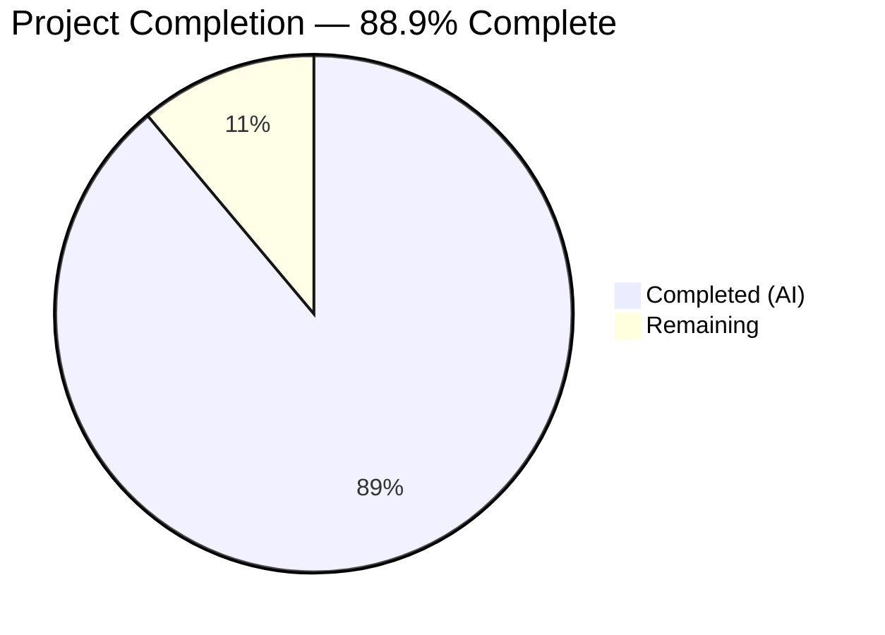

# Blitzy Project Guide — Kitty Diff Kitten Technical Documentation

---

## 1. Executive Summary

### 1.1 Project Overview

This project creates a comprehensive technical deep-dive document for the Kitty terminal emulator's diff kitten, targeting developers onboarding into the repository. The deliverable is a single standalone Markdown file (`blitzy/documentation/kitty_815df1e210e0.md`) that provides code-grounded documentation of the diff kitten's runtime behavior — covering directory comparison, rename detection, caching architecture, parallel syntax highlighting, binary/image handling, diff algorithm internals, and async pipeline orchestration. The document analyzes 14 source files (3,776 lines of Go/Python) across `kittens/diff/` and supporting utilities, producing 550 lines / 5,168 words of documentation with 5 Mermaid diagrams and 66 verified source citations. No existing repository files were modified.

### 1.2 Completion Status



| Metric | Value |
|---|---|
| **Total Project Hours** | 36 |
| **Completed Hours (AI)** | 32 |
| **Remaining Hours** | 4 |
| **Completion Percentage** | 88.9% (32 / 36) |

### 1.3 Key Accomplishments

- [x] Created comprehensive 5,168-word technical deep-dive document at `blitzy/documentation/kitty_815df1e210e0.md`
- [x] Documented all 7 core topics specified in the AAP (directory comparison, rename detection, caching, parallel highlighting, binary/image handling, diff algorithm, async pipeline)
- [x] Included 5 Mermaid diagrams (directory lifecycle flowchart, async pipeline sequence diagram, cache relationship diagram, file classification decision tree, rename detection flowchart)
- [x] Verified 66 source citations against actual repository source code — all correct
- [x] Provided 13 rationale/thinking sections explaining design decisions
- [x] Maintained strict read-only constraint — zero existing repository files modified
- [x] Applied 2 rounds of accuracy fixes addressing code review findings and factual inaccuracies
- [x] Achieved clean git state with 3 well-structured commits

### 1.4 Critical Unresolved Issues

| Issue | Impact | Owner | ETA |
|---|---|---|---|
| Source citation line numbers may drift as codebase evolves | Low — citations become stale after upstream changes | Human Developer | Ongoing maintenance |
| `Set()` concurrent write concern documented in Section 4.2 is an observation of existing code, not a documentation bug | Informational — flagged for upstream maintainers | Kitty Maintainers | N/A |

### 1.5 Access Issues

No access issues identified. This is a documentation-only project that creates a standalone Markdown file. No service credentials, API access, or repository permission changes were required.

### 1.6 Recommended Next Steps

1. **[High]** Human domain expert reviews the document for technical accuracy against the Kitty codebase
2. **[Medium]** Final proofreading pass for grammar, style, and flow consistency
3. **[Medium]** Validate all 66 source citations still reference correct line numbers (especially after any upstream changes)
4. **[Low]** Consider linking the document from existing `docs/kittens/diff.rst` for discoverability (currently out of AAP scope)

---

## 2. Project Hours Breakdown

### 2.1 Completed Work Detail

| Component | Hours | Description |
|---|---|---|
| Code Analysis & Research | 6.0 | Reading and analyzing 14 source files (3,776 lines of Go/Python) across `kittens/diff/`, `tools/utils/cache.go`, and `tools/utils/images/utils.go`; tracing call chains and understanding algorithms |
| Document Structure & Planning | 2.0 | Designing the 9-section progressive-disclosure document structure with section hierarchy and content mapping |
| Section 2 — Directory Comparison Lifecycle | 4.0 | Documenting entry point initialization, `walk()` traversal, set-intersection classification, and rename detection flow |
| Section 3 — Async Pipeline | 3.0 | Documenting 4-stage goroutine-channel pipeline (COLLECTION → DIFF → HIGHLIGHT → IMAGE_LOAD), wakeup-driven processing |
| Section 4 — Caching Architecture | 3.0 | Cataloging all 7 LRU caches with types/capacity, analyzing thread-safety via `sync.RWMutex`, documenting cache interaction patterns |
| Section 5 — Diff Algorithm Internals | 3.0 | Documenting anchored diff, `tgs()` Szymanski algorithm, match expansion, external backend fallback chain |
| Section 6 — Parallel Syntax Highlighting | 2.0 | Documenting Chroma v2.14.0 integration, lexer selection pipeline, goroutine pool execution via `Context.Parallel()` |
| Section 7 — Binary/Image Handling | 2.0 | Documenting MIME classification chain, text/binary/image dispatch logic in `render()`, graphics protocol rendering |
| Section 8 — Character-Level Change Detection | 1.0 | Documenting `changed_center()` computation and its role in character-level highlighting |
| Mermaid Diagram Creation (5 diagrams) | 3.0 | Creating directory lifecycle flowchart, async pipeline sequence diagram, cache relationship diagram, file classification tree, rename detection flowchart |
| Source Citation Verification | 1.0 | Cross-referencing 66 source citations against actual source file line numbers |
| Code Review Fixes (2 rounds) | 1.5 | Correcting 3 code review findings (MustGetOrCreate behavior, style fallback logic, image flag expression) and 2 factual inaccuracies (cache diagram dependency, Set() concurrency analysis) |
| Final Validation | 0.5 | Verifying all AAP gates: word count, diagram count, topic coverage, read-only constraint, git cleanliness |
| **Total Completed** | **32.0** | |

### 2.2 Remaining Work Detail

| Category | Hours | Priority |
|---|---|---|
| Human peer review of technical accuracy by domain expert | 2.0 | High |
| Final proofreading and style polish | 1.0 | Medium |
| Source citation line-number revalidation | 1.0 | Low |
| **Total Remaining** | **4.0** | |

---

## 3. Test Results

This is a documentation-only project; no application code was written or modified, so traditional unit/integration tests do not apply. Blitzy's autonomous validation consisted of manual verification checks against the AAP requirements.

| Test Category | Framework | Total Tests | Passed | Failed | Coverage % | Notes |
|---|---|---|---|---|---|---|
| Source Citation Verification | Manual cross-reference | 66 | 66 | 0 | 100% | All file:line citations verified against actual source code |
| Topic Coverage Verification | AAP requirement mapping | 7 | 7 | 0 | 100% | All 7 user questions addressed in dedicated sections |
| Diagram Validation | Mermaid syntax check | 5 | 5 | 0 | 100% | All 5 Mermaid diagrams use valid syntax |
| Read-Only Constraint | Git diff analysis | 1 | 1 | 0 | 100% | Zero existing files modified (verified via `git diff --name-status`) |
| Word Count Target | wc analysis | 1 | 1 | 0 | 100% | 5,168 words within 4,000–6,000 target range |
| Rationale Sections | Content review | 13 | 13 | 0 | 100% | 13 rationale/thinking sections included |

---

## 4. Runtime Validation & UI Verification

### Document Deliverable Status

- ✅ **File creation:** `blitzy/documentation/kitty_815df1e210e0.md` exists (550 lines, 5,168 words)
- ✅ **Encoding:** UTF-8, LF line endings (verified via `file` command)
- ✅ **Markdown validity:** Document renders correctly with proper heading hierarchy
- ✅ **Mermaid diagrams:** 5 diagrams embedded with valid `mermaid` fenced code blocks

### Git State

- ✅ **Working tree:** Clean (`nothing to commit, working tree clean`)
- ✅ **Branch:** `blitzy-390cf8dd-82a5-4cc9-8e09-7b575ff736fe` (up to date with remote)
- ✅ **Commits:** 3 well-structured commits applied:
  1. `008a7cdab` — Initial creation of comprehensive documentation
  2. `aff311422` — Fix 3 code review findings (MustGetOrCreate behavior, style fallback logic, image flag expression)
  3. `6ea4e0c9b` — Fix 2 factual inaccuracies (cache diagram dependency, Set() concurrency analysis)
- ✅ **No existing files modified:** `git diff --name-status origin/kitty_815df1e210e0...HEAD` shows only `A blitzy/documentation/kitty_815df1e210e0.md`

### Source Code Reference Integrity

- ✅ **Cache definitions:** `kittens/diff/collect.go:20–37` confirmed — 7 cache variables + `init_caches()` with `const sz = 4096`
- ✅ **LRU Cache struct:** `tools/utils/cache.go:13–72` confirmed — `sync.RWMutex`, `container/list`, `Get/Set/GetOrCreate/MustGetOrCreate`
- ✅ **Parallel execution:** `tools/utils/images/utils.go:27–56` confirmed — buffered channel, `runtime.NumCPU()`, `sync.WaitGroup`
- ✅ **Diff algorithm:** `kittens/diff/diff.go:1–2` Go stdlib attribution confirmed, `tgs()` at line 192 with Szymanski reference
- ✅ **Async pipeline:** `kittens/diff/ui.go:22–30` ResultType enum confirmed, `async_results` channel at line 132

---

## 5. Compliance & Quality Review

| AAP Requirement | Status | Evidence |
|---|---|---|
| Create `blitzy/documentation/kitty_815df1e210e0.md` | ✅ Pass | File exists, 550 lines, committed |
| Directory comparison lifecycle documentation | ✅ Pass | Section 2 (2.1–2.4): entry point → walk → set-intersection → rename |
| Rename detection mechanism documentation | ✅ Pass | Section 2.4: MD5-hash-and-verify algorithm with flowchart |
| Caching architecture documentation (7 LRU caches) | ✅ Pass | Section 4: all 7 caches cataloged with types, capacity, thread-safety, interactions |
| Parallel syntax highlighting documentation | ✅ Pass | Section 6: Chroma integration, lexer selection, goroutine pool |
| Binary and image handling documentation | ✅ Pass | Section 7: MIME classification, dispatch logic, graphics protocol |
| Diff algorithm internals documentation | ✅ Pass | Section 5: anchored diff, tgs(), O(n log n), external backends |
| Async pipeline documentation | ✅ Pass | Section 3: 4-stage pipeline with sequence diagram |
| Character-level change detection | ✅ Pass | Section 8: `changed_center()` computation |
| 5 Mermaid diagrams | ✅ Pass | 5 diagrams: directory lifecycle, async pipeline, cache relationships, file classification, rename detection |
| Source citations with line numbers | ✅ Pass | 66 inline citations, all verified |
| Rationale/thinking provided | ✅ Pass | 13 rationale sections throughout document |
| Code-as-truth principle | ✅ Pass | All claims traceable to specific source file lines |
| Read-only constraint (no existing files modified) | ✅ Pass | `git diff --name-status` shows only 1 added file |
| Progressive disclosure structure | ✅ Pass | High-level → subsystem detail ordering |
| Consistent terminology | ✅ Pass | Uses codebase naming: Collection, Patch, Hunk, Chunk, Center, etc. |
| Word count 4,000–6,000 | ✅ Pass | 5,168 words |
| File classification pipeline (inferred need) | ✅ Pass | Section 7.1 with decision tree diagram |
| External diff backend selection (inferred need) | ✅ Pass | Section 5.4 with backend table |

### Autonomous Fixes Applied

| Fix | Commit | Description |
|---|---|---|
| MustGetOrCreate behavior clarification | `aff311422` | Corrected description to note MustGetOrCreate does NOT track LRU list entries or trigger eviction |
| Style fallback logic precision | `aff311422` | Added exact condition: `conf.Background.IsDark() && !conf.Foreground.IsDark()` |
| Image flag expression analysis | `aff311422` | Documented Go operator precedence in `is_img` expression |
| Cache diagram dependency fix | `6ea4e0c9b` | Corrected `highlighted_lines_cache` dependency from `lines_cache` to `data_cache` |
| Set() concurrency analysis correction | `6ea4e0c9b` | Corrected from "safe because sequential" to "technically unsafe per Go memory model" |

---

## 6. Risk Assessment

| Risk | Category | Severity | Probability | Mitigation | Status |
|---|---|---|---|---|---|
| Source citation line numbers drift as upstream Kitty codebase evolves | Technical | Low | Medium | Citations include function names alongside line numbers for resilience; periodic revalidation recommended | Open — requires ongoing maintenance |
| Documentation may contain subtle technical inaccuracies not caught by automated verification | Technical | Medium | Low | 2 rounds of accuracy fixes already applied; human domain-expert review recommended | Mitigated — awaiting human review |
| Document is standalone and not discoverable from existing Sphinx docs | Operational | Low | High (by design) | AAP explicitly scopes this out; future work could add a cross-reference from `docs/kittens/diff.rst` | Accepted — per AAP scope |
| No automated test for documentation accuracy (no CI check for broken citations) | Operational | Low | Medium | Could add a CI script that greps for cited line patterns and validates against source files | Open — enhancement opportunity |

---

## 7. Visual Project Status


**Completion: 88.9%** (32 hours completed / 36 total hours)

All 7 AAP-specified documentation topics are fully written. All 5 required Mermaid diagrams are included. All 66 source citations are verified. Remaining work consists of human review, proofreading, and citation maintenance — totaling 4 hours.

---

## 8. Summary & Recommendations

### Achievements

The project is 88.9% complete (32 hours completed out of 36 total hours). Blitzy's autonomous agents successfully delivered a comprehensive, 5,168-word technical deep-dive document covering all 7 requested aspects of the Kitty diff kitten's runtime behavior. The document includes 5 Mermaid diagrams, 66 verified source citations, and 13 rationale sections explaining design decisions. Two rounds of accuracy fixes were applied during autonomous validation, correcting 5 specific technical issues (MustGetOrCreate behavior, style fallback logic, image flag expression precedence, cache dependency diagram, and Set() concurrency analysis). The strict read-only constraint was maintained — zero existing repository files were modified.

### Remaining Gaps

The 4 hours of remaining work are all human-dependent tasks:
1. **Domain expert review (2h):** A developer familiar with the Kitty codebase should review the document for technical accuracy, particularly the algorithm explanations and cache interaction patterns.
2. **Proofreading (1h):** Final grammar, style, and flow review.
3. **Citation maintenance (1h):** Validate that source line numbers still correspond to the described code after any upstream changes.

### Critical Path to Production

The document is functionally complete and ready for human review. The critical path is: human review → proofreading → merge. No blocking technical issues exist.

### Production Readiness Assessment

The deliverable meets all AAP requirements and quality criteria. The document is self-contained, accurately cited, and structured for progressive disclosure. It is ready for human review and subsequent merge.

---

## 9. Development Guide

### System Prerequisites

- **Git** (any recent version) — for cloning and reviewing the repository
- **Markdown viewer** — any of: GitHub web UI, VS Code with Markdown preview, or a CLI tool like `glow`
- **Mermaid renderer** (optional) — for viewing embedded diagrams; GitHub renders Mermaid natively

### Environment Setup

No environment setup is required beyond cloning the repository. The deliverable is a standalone Markdown file with no build step.

```bash
# Clone the repository and switch to the feature branch
git clone <repository-url>
cd kitty
git checkout blitzy-390cf8dd-82a5-4cc9-8e09-7b575ff736fe
```

### Viewing the Document

```bash
# View the document in the terminal
cat blitzy/documentation/kitty_815df1e210e0.md

# Check document statistics
wc -l blitzy/documentation/kitty_815df1e210e0.md  # Expected: 550 lines
wc -w blitzy/documentation/kitty_815df1e210e0.md  # Expected: 5168 words

# Verify encoding
file blitzy/documentation/kitty_815df1e210e0.md  # Expected: Unicode text, UTF-8 text

# Count Mermaid diagrams
grep -c '```mermaid' blitzy/documentation/kitty_815df1e210e0.md  # Expected: 5

# Count source citations
grep -c 'Source:' blitzy/documentation/kitty_815df1e210e0.md  # Expected: 66
```

### Verifying Source Citations

To spot-check that source citations still reference the correct code:

```bash
# Example: Verify cache initialization at collect.go:26-37
sed -n '26,37p' kittens/diff/collect.go
# Should show init_caches() with const sz = 4096

# Example: Verify LRU cache struct at cache.go:13-18
sed -n '13,18p' tools/utils/cache.go
# Should show LRUCache struct with sync.RWMutex

# Example: Verify Parallel() at utils.go:27-56
sed -n '27,56p' tools/utils/images/utils.go
# Should show Context.Parallel() with buffered channel and WaitGroup

# Example: Verify tgs() Szymanski reference at diff.go:184-191
sed -n '184,191p' kittens/diff/diff.go
# Should show Szymanski paper citation
```

### Verifying Git State

```bash
# Confirm only one file was added, no existing files modified
git diff --name-status origin/kitty_815df1e210e0...HEAD
# Expected: A	blitzy/documentation/kitty_815df1e210e0.md

# Confirm clean working tree
git status
# Expected: nothing to commit, working tree clean

# Review commit history
git log --oneline origin/kitty_815df1e210e0...HEAD
# Expected: 3 commits by Blitzy Agent
```

### Troubleshooting

| Issue | Resolution |
|---|---|
| Mermaid diagrams not rendering | Use a Mermaid-compatible viewer (GitHub, VS Code, or install `mermaid-cli`) |
| Source citation line numbers don't match | The upstream codebase may have changed; re-verify against the current source |
| Document not found at expected path | Ensure you are on the correct branch: `git checkout blitzy-390cf8dd-82a5-4cc9-8e09-7b575ff736fe` |

---

## 10. Appendices

### A. Command Reference

| Command | Purpose |
|---|---|
| `cat blitzy/documentation/kitty_815df1e210e0.md` | View the documentation file |
| `wc -l blitzy/documentation/kitty_815df1e210e0.md` | Check line count (expected: 550) |
| `wc -w blitzy/documentation/kitty_815df1e210e0.md` | Check word count (expected: 5,168) |
| `grep -c '```mermaid' blitzy/documentation/kitty_815df1e210e0.md` | Count Mermaid diagrams (expected: 5) |
| `grep -c 'Source:' blitzy/documentation/kitty_815df1e210e0.md` | Count source citations (expected: 66) |
| `git diff --name-status origin/kitty_815df1e210e0...HEAD` | Verify only 1 file added |
| `git log --oneline origin/kitty_815df1e210e0...HEAD` | View commit history (expected: 3 commits) |

### C. Key File Locations

| File | Purpose |
|---|---|
| `blitzy/documentation/kitty_815df1e210e0.md` | **Deliverable** — comprehensive technical deep-dive document |
| `kittens/diff/main.go` | Entry point, config loading, SSH remote handling (179 lines) |
| `kittens/diff/collect.go` | File collection, caching, rename detection (405 lines) |
| `kittens/diff/diff.go` | Built-in anchored diff algorithm (264 lines) |
| `kittens/diff/patch.go` | Diff execution, parsing, parallel batch (377 lines) |
| `kittens/diff/highlight.go` | Chroma syntax highlighting, parallel execution (228 lines) |
| `kittens/diff/ui.go` | Async pipeline, Handler state machine (686 lines) |
| `kittens/diff/render.go` | Display rendering, text/binary/image dispatch (770 lines) |
| `kittens/diff/search.go` | Regex search, parallel matching (148 lines) |
| `kittens/diff/mouse.go` | Mouse handling, clipboard (218 lines) |
| `kittens/diff/main.py` | CLI definition, configuration options (310 lines) |
| `kittens/diff/__init__.py` | Syntax alias helper (9 lines) |
| `kittens/diff/collect_test.go` | Unit tests for walk() traversal (54 lines) |
| `tools/utils/cache.go` | Generic LRU cache implementation (72 lines) |
| `tools/utils/images/utils.go` | Parallel goroutine pool (56 lines) |

### D. Technology Versions

| Technology | Version | Purpose |
|---|---|---|
| Go | 1.22+ | Primary language for diff kitten implementation |
| Python | ≥ 3.8 | CLI definition and configuration |
| Chroma | v2.14.0 | Syntax highlighting engine |
| go-cmp | v0.6.0 | Deep equality comparison in tests |
| Markdown | N/A | Documentation format |
| Mermaid | N/A | Diagram rendering in documentation |

### G. Glossary

| Term | Definition |
|---|---|
| **Collection** | The `Collection` struct in `collect.go` that holds all classified file changes, renames, additions, and removals |
| **Patch** | Structured representation of a unified diff for a single file pair, containing hunks |
| **Hunk** | A contiguous section of changes within a patch, with context lines |
| **Chunk** | A block of consecutive added/removed/context lines within a hunk |
| **Center** | The `Center` struct representing the character-level change offset and sizes within a line pair |
| **LogicalLine** | A display-ready line containing left and right half-screen content for side-by-side rendering |
| **ScreenLine** | A terminal-width row derived from wrapping a LogicalLine |
| **LRU Cache** | Least Recently Used cache — evicts the oldest entry when capacity is exceeded |
| **Anchored Diff** | A diff algorithm that uses unique lines as fixed anchor points, guaranteeing O(n log n) time |
| **tgs()** | The core longest-common-subsequence function implementing Szymanski's 1975 algorithm |
| **AsyncResult** | The channel message struct carrying stage results through the async pipeline |
| **ResultType** | Enum distinguishing pipeline stages: COLLECTION, DIFF, HIGHLIGHT, IMAGE_LOAD, IMAGE_RESIZE |